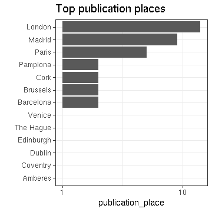

## Summary for Cervantes Saavedra, Miguel De (1547-1616)


```
## Error in eval(expr, envir, enclos): object 'title.file' not found
```

```
## Error in paste("Writing", filename): object 'title.file' not found
```

This author has:

  * 38 documents
  * 35 unique titles ([table]('r title.file'))
  * 20 unique publication places
  * 9 unique publication countries
  * 1605, 1830 time span   


```
## Error in dfs$names: $ operator is invalid for atomic vectors
```

```
## NULL
```


Publication timeline:


## Selected title


```
## Error in seq.default(h[1], h[2], length.out = n): 'to' cannot be NA, NaN or infinite
```


## Language


## Publication place



