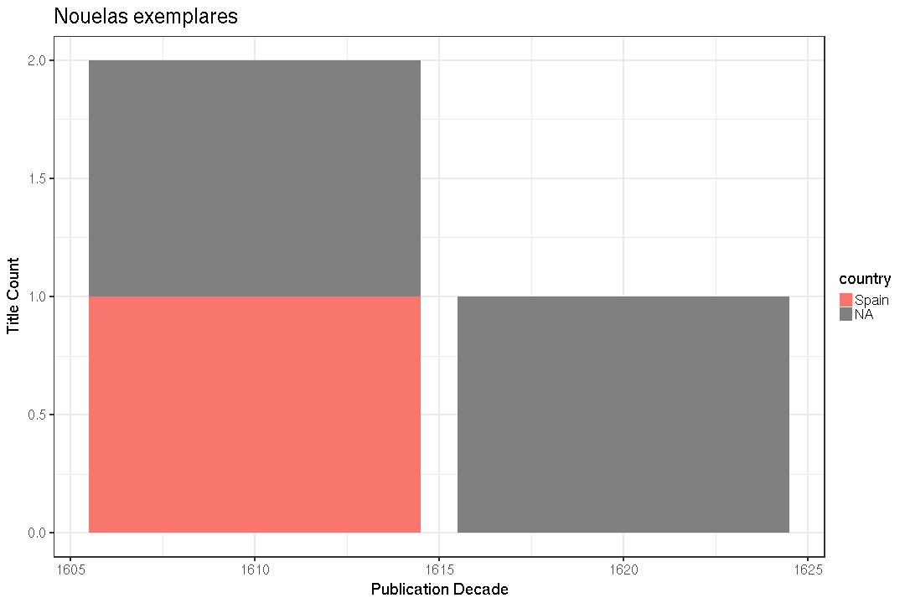

## Summary for Cervantes Saavedra, Miguel De (1547-1616)


```
## Error in eval(expr, envir, enclos): object 'title.file' not found
```

```
## Error in paste("Writing", filename): object 'title.file' not found
```

This author has:

  * 2300 documents
  * 959 unique titles ([table]('r title.file'))
  * 55 unique publication places
  * 17 unique publication countries
  * 1585, 1830 time span   


```
## Error in dfs$names: $ operator is invalid for atomic vectors
```

```
## NULL
```


Publication timeline:


## Selected title




## Language


## Publication place


