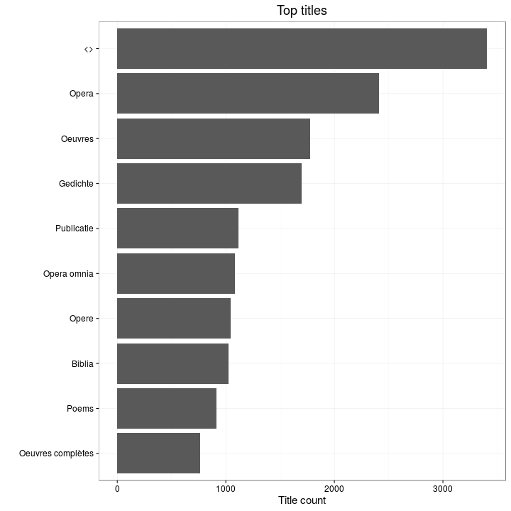
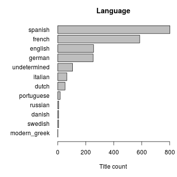

## Summary for Shakespeare, William (1564-1616)


```
## Error in eval(expr, envir, enclos): object 'title.file' not found
```

```
## Error in paste("Writing", filename): object 'title.file' not found
```

This author has:

  * 0 documents
  * 0 unique titles ([table]('r title.file'))
  * 0 unique publication places
  * 0 unique publication countries
  * Inf, -Inf time span   





Publication timeline:


## Selected title


## Language


```
## Warning in min(x): no non-missing arguments to min; returning Inf
```

```
## Warning in max(x): no non-missing arguments to max; returning -Inf
```

```
## Warning in min(w.l): no non-missing arguments to min; returning Inf
```

```
## Warning in max(w.r): no non-missing arguments to max; returning -Inf
```

```
## Error in plot.window(xlim, ylim, log = log, ...): need finite 'xlim' values
```




## Publication place


