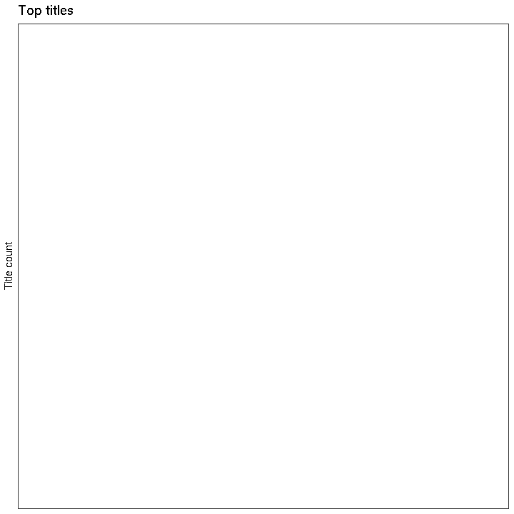
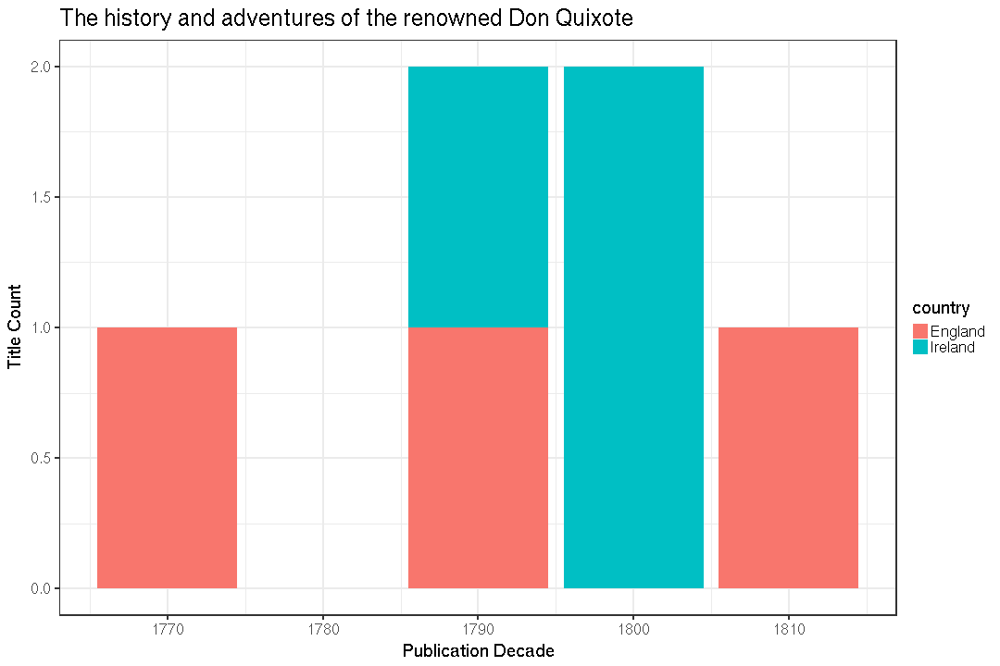

## Summary for Shakespeare, William (1564-1616)


```
## Error in eval(expr, envir, enclos): object 'title.file' not found
```

```
## Error in write_xtable(dfa$title, file = title.file): object 'title.file' not found
```

This author has:

  * 70 documents
  * 57 unique titles ([table]('r title.file'))
  * 10 unique publication places
  * 8 unique publication countries
  * 1604, 1828 time span   





Publication timeline:


## Selected title




## Language


```
## Error in colSums(select(dfa, starts_with("language"))): 'x' must be numeric
```

```
## Error in eval(expr, envir, enclos): object 'lan' not found
```

```
## Error in gsub("language\\.", "", names(lan)): object 'lan' not found
```

```
## Error in barplot(lan, las = 1, horiz = T, main = "Language", xlab = "Title count"): object 'lan' not found
```


## Publication place


