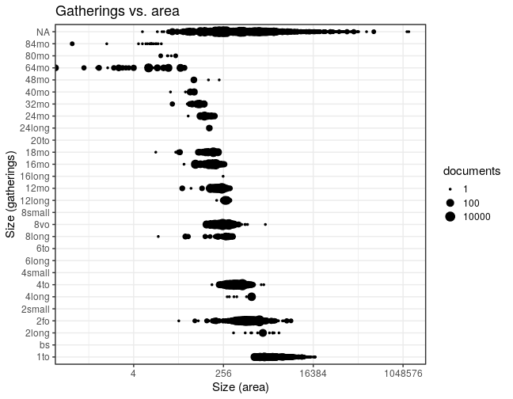
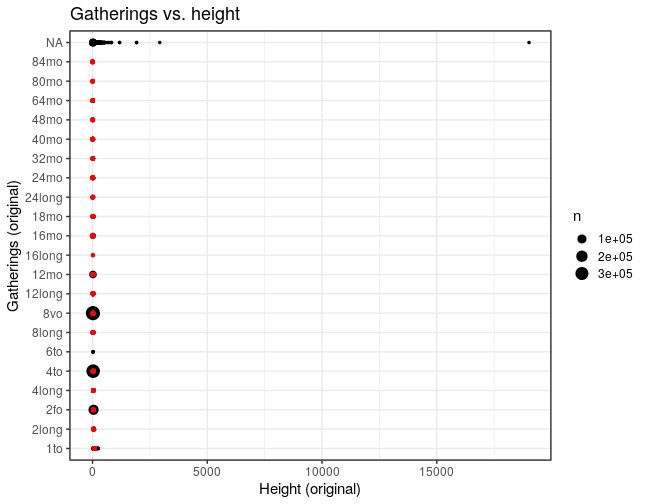
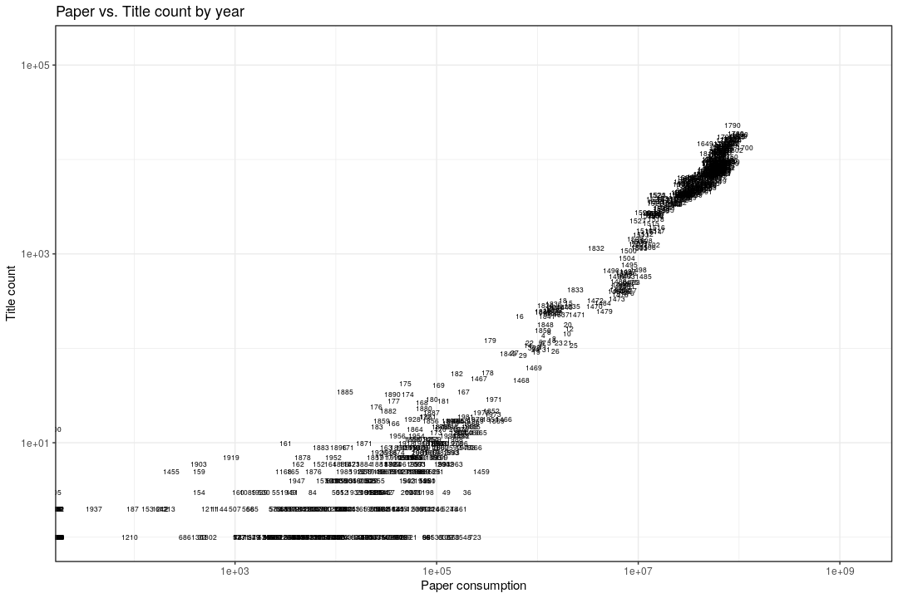

## Document size comparisons

  * Some dimension info is provided in the original raw data for altogether 2961372 documents (54.8%) but could not be interpreted for 1535082 documents (ie. dimension info was successfully estimated for 48.2 % of the documents where this field was not empty).

  * Document size (area) info was obtained in the final preprocessed data for altogether 1768271 documents (33%). For the remaining documents, critical dimension information was not available or could not be interpreted: [List of entries where document surface could not be estimated](output.tables/physical_dimension_incomplete.csv)

  * Document gatherings info is originally available for 1214569 documents (22%), and further estimated up to 1426290 documents (26%) in the final preprocessed data.

  * Document height info is originally available for 626943 documents (12%), and further estimated up to 1768276 documents (33%) in the final preprocessed data.

  * Document width info is originally available for 61515 documents (1%), and further estimated up to 1768294 documents (33%) in the final preprocessed data.


These tables can be used to verify the accuracy of the conversions from the raw data to final estimates:

  * [Dimension conversions from raw data to final estimates](output.tables/conversions_physical_dimension.csv)

  * [Automated tests for dimension conversions](https://github.com/COMHIS/bibliographica/blob/master/inst/extdata/tests_dimension_polish.csv)


The estimated dimensions are based on the following auxiliary information sheets:

  * [Document dimension abbreviations](https://github.com/COMHIS/bibliographica/blob/master/inst/extdata/document_size_abbreviations.csv)

  * [Standard sheet size estimates](https://github.com/COMHIS/bibliographica/blob/master/inst/extdata/sheetsizes.csv)

  * [Document dimension estimates](https://github.com/COMHIS/bibliographica/blob/master/inst/extdata/documentdimensions.csv) (used when information is partially missing)


  
<!--[Discarded dimension info](output.tables/dimensions_discarded.csv)-->

Left: final gatherings vs. final document dimension (width x height). Right: original gatherings versus original heights where both are available. The point size indicates the number of documents for each case. The red dots indicate the estimated height that is used when only gathering information is available. 


```
## Error in FUN(X[[i]], ...): object '.group' not found
```




Left: Document dimension histogram (surface area);
Middle: Paper consumption histogram;
Right: title count per gatherings.


### Gatherings timelines


Popularity of different document sizes over time. Left: absolute title counts. Right: relative title counts. Gatherings with less than 15 documents at every decade are excluded:


```
## NULL
```

```
## NULL
```


### Title count versus paper consumption




<!--


## Average document dimensions 

Here we use the original data only:


Only the most frequently occurring gatherings are listed here:


|gatherings.original | mean.width| median.width| mean.height| median.height|     n|
|:-------------------|----------:|------------:|-----------:|-------------:|-----:|
|1to                 |      34.24|        34.24|       49.01|         49.01|   346|
|2fo                 |      23.86|        23.86|       32.87|         32.87| 11390|
|4to                 |      19.47|        19.47|       22.48|         22.48| 22638|
|8vo                 |      14.05|        14.05|       19.24|         19.24| 28442|
|12mo                |      11.18|        11.18|       16.08|         16.08|  9742|
|16mo                |       9.83|         9.83|       12.77|         12.77|   613|
|18mo                |       9.00|         9.00|       14.24|         14.24|   225|

-->
