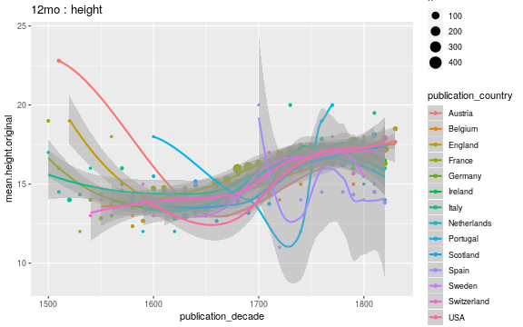

## Average document dimensions 

We have 1.5131 &times; 105 documents with country and original gatherings information. We have 1235159 documents with original gatherings information but no country information.

|       | Argentina| Austria| Barbados| Belgium| Canada| Czech| Denmark| England| Estonia| Europe| Finland| France| Germany| Guernesey| Hungary| India| Ireland| Italy| Jamaica| Latvia| Lithuania| Netherlands| Poland| Portugal| Russia| Scotland| Spain| Sweden| Switzerland| USA|   NA| total|
|:------|---------:|-------:|--------:|-------:|------:|-----:|-------:|-------:|-------:|------:|-------:|------:|-------:|---------:|-------:|-----:|-------:|-----:|-------:|------:|---------:|-----------:|------:|--------:|------:|--------:|-----:|------:|-----------:|---:|----:|-----:|
|1to    |         0|       0|        0|       1|      0|     0|       0|     297|       0|      0|       0|     21|       4|         0|       0|     0|       4|     3|       0|      0|         0|           9|      0|        0|      0|       17|    19|      0|           0|   2|   25|   402|
|2long  |         0|       1|        0|       0|      0|     0|       0|      11|       0|      0|       0|      8|       0|         0|       0|     0|       0|     2|       0|      0|         0|           0|      0|        0|      0|        1|     0|      0|           0|   0|    1|    24|
|2fo    |         2|       8|        0|      38|      4|     6|       8|    3350|      10|      0|       8|    701|     513|         0|       0|     2|      60|   625|       0|      1|         0|         258|      1|       25|      9|      733|   811|      8|         102|  50| 4229| 11562|
|4long  |         0|       0|        0|       0|      0|     0|       0|       0|       0|      0|       0|      3|       0|         0|       0|     0|       0|     0|       0|      0|         0|           1|      0|        0|      0|        0|     0|      0|           0|   0|    1|     5|
|4to    |         0|      22|        0|      60|      1|     2|      32|    7343|       2|      0|       9|   5233|    1562|         0|       0|     5|      63|   931|       0|      0|         1|         791|     15|      123|     48|     1240|   607|    105|         110|  83| 4955| 23343|
|6to    |         0|       0|        0|       0|      0|     0|       0|       1|       0|      0|       0|      1|       0|         0|       0|     0|       0|     0|       0|      0|         0|           1|      0|        0|      0|        1|     0|      0|           0|   0|    1|     5|
|8long  |         0|       0|        0|       0|      0|     0|       0|       1|       0|      0|       0|      1|       0|         0|       0|     0|       0|     0|       0|      0|         0|           0|      1|        0|      0|        0|     0|      0|           0|   0|    1|     4|
|8vo    |         0|      61|        1|     106|      3|     2|      50|   12328|       0|      0|       3|   4919|    1549|         1|       1|     3|     418|   541|       1|     18|         0|         989|     27|       34|     30|     2133|   422|     62|         292| 872| 4345| 29211|
|12long |         0|       0|        0|       0|      0|     0|       0|       6|       0|      0|       0|      2|       0|         0|       0|     0|       0|     0|       0|      0|         0|           0|      0|        0|      0|        0|     0|      0|           0|   1|    0|     9|
|12mo   |         0|       1|        0|      79|     11|     0|       0|    3415|       0|      1|       1|   2110|     201|         0|       0|     0|     245|   120|       1|      0|         0|        1277|      2|        5|      2|      651|    24|      7|          77| 433| 1236|  9899|
|16mo   |         0|       0|        0|       9|      0|     0|       0|      78|       0|      0|       1|    155|      16|         0|       0|     0|       0|     6|       0|      1|         0|          69|      0|        1|      0|       18|    15|      2|          13|  14|  222|   620|
|18mo   |         0|       1|        0|       0|      0|     0|       0|      63|       0|      0|       0|     53|       1|         0|       0|     0|       3|     1|       0|      0|         0|           5|      0|        0|      0|       33|     0|      0|           0|  40|   25|   225|
|24long |         0|       0|        0|       0|      0|     0|       0|       1|       0|      0|       0|      0|       0|         0|       0|     0|       0|     0|       0|      0|         0|           1|      0|        0|      0|        0|     0|      0|           0|   0|    0|     2|
|24mo   |         0|       0|        0|       0|      0|     0|       0|      46|       0|      0|       0|     16|       0|         0|       0|     0|       0|     1|       0|      0|         0|          96|      0|        0|      0|       31|     0|      0|           0|  20|   77|   287|
|32mo   |         0|       0|        0|       2|      0|     0|       0|      10|       0|      0|       0|      5|       0|         0|       0|     0|       0|     0|       0|      0|         0|           2|      0|        0|      0|        3|     0|      0|           1|  19|   12|    54|
|48mo   |         0|       0|        0|       0|      0|     0|       0|       1|       0|      0|       0|      0|       0|         0|       0|     0|       0|     0|       0|      0|         0|           0|      0|        0|      0|        0|     0|      0|           0|   0|    1|     2|
|64mo   |         0|       0|        0|       0|      0|     0|       0|       0|       0|      0|       0|      0|       0|         0|       0|     0|       0|     0|       0|      0|         0|           0|      0|        0|      0|        1|     0|      0|           0|   0|    0|     1|

### Selected gatherings across time; by country

### Average document sizes 

Only cases with 2000 documents are shown:

|gatherings.original | mean.height| median.height| mean.width| median.width|     n|
|:-------------------|-----------:|-------------:|----------:|------------:|-----:|
|1to                 |    54.80779|      54.80779|  38.442857|    38.442857|   402|
|2fo                 |    32.86899|      32.86899|  23.824736|    23.824736| 11562|
|4to                 |    22.43735|      22.43735|  19.362162|    19.362162| 23343|
|8vo                 |    19.22826|      19.22826|  14.029825|    14.029825| 29211|
|12mo                |    16.07322|      16.07322|  11.166667|    11.166667|  9899|
|16mo                |    12.77661|      12.77661|   9.833333|     9.833333|   620|
|18mo                |    14.24000|      14.24000|   9.000000|     9.000000|   225|

### Average document sizes by decade and country

Only cases with 2000 documents are shown:

|gatherings.original |country     | publication_decade| mean.height| median.height| mean.width| median.width|    n|
|:-------------------|:-----------|------------------:|-----------:|-------------:|----------:|------------:|----:|
|1to                 |Belgium     |               1610|    48.00000|      48.00000|   36.00000|     36.00000|    1|
|1to                 |England     |               1600|    45.00000|      45.00000|   32.00000|     32.00000|    1|
|1to                 |England     |               1610|   215.00000|     215.00000|   42.00000|     42.00000|    1|
|1to                 |England     |               1640|    31.75000|      31.75000|   21.75000|     21.75000|    4|
|1to                 |England     |               1650|    30.00000|      30.00000|   19.66667|     19.66667|    3|
|1to                 |England     |               1660|    34.00000|      34.00000|   23.71429|     23.71429|    7|
|1to                 |England     |               1670|    43.25000|      43.25000|   35.75000|     35.75000|    2|
|1to                 |England     |               1680|    42.63636|      42.63636|   24.88889|     24.88889|   11|
|1to                 |England     |               1690|    40.38333|      40.38333|   36.57500|     36.57500|    6|
|1to                 |England     |               1700|    32.00000|      32.00000|   24.50000|     24.50000|    3|
|1to                 |England     |               1710|    32.00000|      32.00000|   20.00000|     20.00000|    1|
|1to                 |England     |               1720|    68.20000|      68.20000|   51.25000|     51.25000|    5|
|1to                 |England     |               1730|    33.85714|      33.85714|   18.83333|     18.83333|    7|
|1to                 |England     |               1740|    57.20339|      57.20339|   31.43836|     31.43836|   73|
|1to                 |England     |               1750|    51.55000|      51.55000|   37.53333|     37.53333|   60|
|1to                 |England     |               1760|    61.58333|      61.58333|   44.50000|     44.50000|   12|
|1to                 |England     |               1770|    77.91667|      77.91667|   58.50000|     58.50000|   12|
|1to                 |England     |               1780|    78.29032|      78.29032|   56.16129|     56.16129|   31|
|1to                 |England     |               1790|    52.28571|      52.28571|   43.28571|     43.28571|    7|
|1to                 |England     |               1800|    30.00000|      30.00000|   24.36364|     24.36364|   22|
|1to                 |England     |               1810|    25.55556|      25.55556|   19.66667|     19.66667|    9|
|1to                 |England     |               1820|    35.26316|      35.26316|   28.11111|     28.11111|   19|
|1to                 |England     |               1830|    48.00000|      48.00000|   46.00000|     46.00000|    1|
|1to                 |France      |               1700|   136.00000|     136.00000|  131.00000|    131.00000|    1|
|1to                 |France      |               1710|    61.00000|      61.00000|   44.00000|     44.00000|    1|
|1to                 |France      |               1740|   127.00000|     127.00000|   92.40000|     92.40000|    5|
|1to                 |France      |               1750|    82.00000|      82.00000|   49.00000|     49.00000|    2|
|1to                 |France      |               1760|    64.00000|      64.00000|   50.00000|     50.00000|    1|
|1to                 |France      |               1780|    90.50000|      90.50000|   55.00000|     55.00000|    2|
|1to                 |France      |               1790|    96.85714|      96.85714|   56.71429|     56.71429|    7|
|1to                 |France      |               1810|   164.00000|     164.00000|  163.00000|    163.00000|    1|
|1to                 |France      |               1820|    83.00000|      83.00000|   53.00000|     53.00000|    1|
|1to                 |Germany     |               1680|    16.00000|      16.00000|   11.00000|     11.00000|    1|
|1to                 |Germany     |               1760|    55.00000|      55.00000|   45.00000|     45.00000|    1|
|1to                 |Germany     |               1800|    87.00000|      87.00000|   55.00000|     55.00000|    1|
|1to                 |Germany     |               1810|    80.00000|      80.00000|   50.00000|     50.00000|    1|
|1to                 |Ireland     |               1720|    31.50000|      31.50000|   20.50000|     20.50000|    2|
|1to                 |Ireland     |               1740|   240.00000|     240.00000|  186.00000|    186.00000|    1|
|1to                 |Ireland     |               1780|    32.00000|      32.00000|   17.00000|     17.00000|    1|
|1to                 |Italy       |               1560|    23.00000|      23.00000|   17.00000|     17.00000|    1|
|1to                 |Italy       |               1660|    56.00000|      56.00000|   42.00000|     42.00000|    1|
|1to                 |Italy       |               1680|    28.00000|      28.00000|   21.00000|     21.00000|    1|
|1to                 |Netherlands |               1600|    41.00000|      41.00000|   35.00000|     35.00000|    1|
|1to                 |Netherlands |               1610|    44.00000|      44.00000|   35.00000|     35.00000|    3|
|1to                 |Netherlands |               1650|    64.00000|      64.00000|   51.00000|     51.00000|    2|
|1to                 |Netherlands |               1660|    36.00000|      36.00000|   27.00000|     27.00000|    1|
|1to                 |Netherlands |               1670|    63.00000|      63.00000|   54.00000|     54.00000|    1|
|1to                 |Netherlands |               1740|    54.00000|      54.00000|   40.00000|     40.00000|    1|
|1to                 |Scotland    |               1640|    38.00000|      38.00000|   26.00000|     26.00000|    1|
|1to                 |Scotland    |               1660|    39.00000|      39.00000|   25.00000|     25.00000|    1|
|1to                 |Scotland    |               1690|    30.00000|      30.00000|   18.00000|     18.00000|    1|
|1to                 |Scotland    |               1740|    31.00000|      31.00000|   19.00000|     19.00000|    1|
|1to                 |Scotland    |               1780|   118.00000|     118.00000|  102.00000|    102.00000|    1|
|1to                 |Scotland    |               1810|    42.83333|      42.83333|   29.16667|     29.16667|    6|
|1to                 |Scotland    |               1820|    44.33333|      44.33333|   33.33333|     33.33333|    6|
|1to                 |Spain       |               1760|    40.33333|      40.33333|   36.20000|     36.20000|    5|
|1to                 |Spain       |               1770|    37.00000|      37.00000|   36.00000|     36.00000|    3|
|1to                 |Spain       |               1780|    42.09091|      42.09091|   36.45455|     36.45455|   11|
|1to                 |USA         |               1750|   151.00000|     151.00000|   75.00000|     75.00000|    1|
|1to                 |USA         |               1790|    92.40000|      92.40000|   82.60000|     82.60000|    1|
|1to                 |NA          |               1530|    41.00000|      41.00000|   28.00000|     28.00000|    1|
|1to                 |NA          |               1540|    24.30000|      24.30000|   23.20000|     23.20000|    1|
|1to                 |NA          |               1640|    37.00000|      37.00000|   26.00000|     26.00000|    1|
|1to                 |NA          |               1650|    39.00000|      39.00000|   23.00000|     23.00000|    1|
|1to                 |NA          |               1690|    31.00000|      31.00000|        NaN|          NaN|    1|
|1to                 |NA          |               1710|    13.00000|      13.00000|    9.00000|      9.00000|    1|
|1to                 |NA          |               1720|    95.00000|      95.00000|   78.00000|     78.00000|    2|
|1to                 |NA          |               1740|    69.00000|      69.00000|   53.00000|     53.00000|    1|
|1to                 |NA          |               1750|    59.00000|      59.00000|   57.00000|     57.00000|    1|
|1to                 |NA          |               1760|    51.00000|      51.00000|   34.75000|     34.75000|    4|
|1to                 |NA          |               1770|    55.33333|      55.33333|   41.33333|     41.33333|    3|
|1to                 |NA          |               1780|    71.00000|      71.00000|   52.75000|     52.75000|    4|
|1to                 |NA          |               1790|    59.00000|      59.00000|   53.00000|     53.00000|    1|
|1to                 |NA          |               1800|    31.25000|      31.25000|   28.00000|     28.00000|    2|
|1to                 |NA          |               1810|    32.00000|      32.00000|        NaN|          NaN|    1|
|2fo                 |Argentina   |               1810|    31.50000|      31.50000|        NaN|          NaN|    2|
|2fo                 |Austria     |               1540|    30.00000|      30.00000|        NaN|          NaN|    1|
|2fo                 |Austria     |               1550|    30.00000|      30.00000|        NaN|          NaN|    1|
|2fo                 |Austria     |               1660|    23.50000|      23.50000|        NaN|          NaN|    2|
|2fo                 |Austria     |               1670|    31.00000|      31.00000|        NaN|          NaN|    1|
|2fo                 |Austria     |               1710|    44.00000|      44.00000|        NaN|          NaN|    1|
|2fo                 |Austria     |               1780|    35.00000|      35.00000|        NaN|          NaN|    1|
|2fo                 |Austria     |               1790|    33.00000|      33.00000|        NaN|          NaN|    1|
|2fo                 |Belgium     |               1470|    28.25000|      28.25000|        NaN|          NaN|    4|
|2fo                 |Belgium     |               1480|    28.08333|      28.08333|        NaN|          NaN|   12|
|2fo                 |Belgium     |               1530|    33.00000|      33.00000|        NaN|          NaN|    3|
|2fo                 |Belgium     |               1540|    35.00000|      35.00000|        NaN|          NaN|    2|
|2fo                 |Belgium     |               1560|    31.00000|      31.00000|        NaN|          NaN|    1|
|2fo                 |Belgium     |               1570|    32.00000|      32.00000|        NaN|          NaN|    1|
|2fo                 |Belgium     |               1580|    32.66667|      32.66667|        NaN|          NaN|    3|
|2fo                 |Belgium     |               1600|    27.00000|      27.00000|   20.00000|     20.00000|    1|
|2fo                 |Belgium     |               1610|    37.00000|      37.00000|        NaN|          NaN|    1|
|2fo                 |Belgium     |               1630|    33.00000|      33.00000|   11.00000|     11.00000|    2|
|2fo                 |Belgium     |               1640|    32.00000|      32.00000|        NaN|          NaN|    1|
|2fo                 |Belgium     |               1680|    32.00000|      32.00000|        NaN|          NaN|    1|
|2fo                 |Belgium     |               1700|    35.00000|      35.00000|        NaN|          NaN|    2|
|2fo                 |Belgium     |               1760|    34.00000|      34.00000|   22.00000|     22.00000|    1|
|2fo                 |Belgium     |               1790|    40.50000|      40.50000|   29.75000|     29.75000|    2|
|2fo                 |Belgium     |               1830|    28.60000|      28.60000|   20.40000|     20.40000|    1|
|2fo                 |Canada      |               1770|    34.00000|      34.00000|        NaN|          NaN|    1|
|2fo                 |Canada      |               1780|    36.66667|      36.66667|        NaN|          NaN|    3|
|2fo                 |Czech       |               1550|    33.00000|      33.00000|        NaN|          NaN|    1|
|2fo                 |Czech       |               1590|    28.00000|      28.00000|        NaN|          NaN|    1|
|2fo                 |Czech       |               1730|    33.00000|      33.00000|        NaN|          NaN|    3|
|2fo                 |Czech       |               1800|    36.00000|      36.00000|        NaN|          NaN|    1|
|2fo                 |Denmark     |               1650|    32.00000|      32.00000|        NaN|          NaN|    2|
|2fo                 |Denmark     |               1690|    35.00000|      35.00000|        NaN|          NaN|    1|
|2fo                 |Denmark     |               1700|    34.00000|      34.00000|        NaN|          NaN|    1|
|2fo                 |Denmark     |               1730|    35.00000|      35.00000|        NaN|          NaN|    1|
|2fo                 |Denmark     |               1740|    50.00000|      50.00000|        NaN|          NaN|    2|
|2fo                 |Denmark     |               1770|    43.00000|      43.00000|        NaN|          NaN|    1|
|2fo                 |England     |               1470|    27.00000|      27.00000|        NaN|          NaN|    2|
|2fo                 |England     |               1480|    27.38462|      27.38462|        NaN|          NaN|   13|
|2fo                 |England     |               1490|    27.00000|      27.00000|        NaN|          NaN|    5|
|2fo                 |England     |               1510|    28.00000|      28.00000|        NaN|          NaN|    2|
|2fo                 |England     |               1520|    28.63636|      28.63636|        NaN|          NaN|   11|
|2fo                 |England     |               1530|    30.50000|      30.50000|        NaN|          NaN|    6|
|2fo                 |England     |               1540|    28.53333|      28.53333|        NaN|          NaN|   15|
|2fo                 |England     |               1550|    29.85714|      29.85714|        NaN|          NaN|   21|
|2fo                 |England     |               1560|    30.21053|      30.21053|        NaN|          NaN|   19|
|2fo                 |England     |               1570|    30.72973|      30.72973|        NaN|          NaN|   37|
|2fo                 |England     |               1580|    31.33333|      31.33333|        NaN|          NaN|   24|
|2fo                 |England     |               1590|    29.47059|      29.47059|        NaN|          NaN|   34|
|2fo                 |England     |               1600|    29.81132|      29.81132|   28.00000|     28.00000|   53|
|2fo                 |England     |               1610|    31.69524|      31.69524|        NaN|          NaN|  105|
|2fo                 |England     |               1620|    30.72000|      30.72000|        NaN|          NaN|  100|
|2fo                 |England     |               1630|    30.85662|      30.85662|   32.50000|     32.50000|  136|
|2fo                 |England     |               1640|    31.68750|      31.68750|   22.33333|     22.33333|   80|
|2fo                 |England     |               1650|    30.01325|      30.01325|   21.50000|     21.50000|  151|
|2fo                 |England     |               1660|    31.56098|      31.56098|   33.50000|     33.50000|  123|
|2fo                 |England     |               1670|    33.57588|      33.57588|   29.33333|     29.33333|  257|
|2fo                 |England     |               1680|    31.45192|      31.45192|   21.55556|     21.55556|  416|
|2fo                 |England     |               1690|    33.27536|      33.27536|   20.64706|     20.64706|  138|
|2fo                 |England     |               1700|    33.37857|      33.37857|   21.85714|     21.85714|  140|
|2fo                 |England     |               1710|    32.76650|      32.76650|   21.75000|     21.75000|  197|
|2fo                 |England     |               1720|    34.15108|      34.15108|   20.50000|     20.50000|  139|
|2fo                 |England     |               1730|    36.72647|      36.72647|   24.00000|     24.00000|  170|
|2fo                 |England     |               1740|    33.34146|      33.34146|   23.28571|     23.28571|  164|
|2fo                 |England     |               1750|    34.36571|      34.36571|   18.20000|     18.20000|  175|
|2fo                 |England     |               1760|    36.39785|      36.39785|   24.57143|     24.57143|   93|
|2fo                 |England     |               1770|    35.80208|      35.80208|   21.50000|     21.50000|   96|
|2fo                 |England     |               1780|    36.76984|      36.76984|   25.33333|     25.33333|  126|
|2fo                 |England     |               1790|    34.58861|      34.58861|   21.87500|     21.87500|  158|
|2fo                 |England     |               1800|    40.69492|      40.69492|   28.79310|     28.79310|   59|
|2fo                 |England     |               1810|    35.86047|      35.86047|   20.70000|     20.70000|   43|
|2fo                 |England     |               1820|    35.59524|      35.59524|   22.66667|     22.66667|   42|
|2fo                 |Estonia     |               1650|    28.00000|      28.00000|        NaN|          NaN|    1|
|2fo                 |Estonia     |               1670|    37.00000|      37.00000|        NaN|          NaN|    1|
|2fo                 |Estonia     |               1690|    34.00000|      34.00000|        NaN|          NaN|    3|
|2fo                 |Estonia     |               1700|    31.60000|      31.60000|        NaN|          NaN|    5|
|2fo                 |Finland     |               1610|    30.00000|      30.00000|        NaN|          NaN|    1|
|2fo                 |Finland     |               1630|    21.00000|      21.00000|        NaN|          NaN|    1|
|2fo                 |Finland     |               1680|    30.00000|      30.00000|        NaN|          NaN|    1|
|2fo                 |Finland     |               1710|    30.00000|      30.00000|        NaN|          NaN|    1|
|2fo                 |Finland     |               1720|    31.00000|      31.00000|        NaN|          NaN|    1|
|2fo                 |Finland     |               1730|    25.00000|      25.00000|        NaN|          NaN|    2|
|2fo                 |Finland     |               1800|    25.00000|      25.00000|        NaN|          NaN|    1|
|2fo                 |France      |               1460|    28.00000|      28.00000|        NaN|          NaN|    1|
|2fo                 |France      |               1470|    31.18750|      31.18750|        NaN|          NaN|   32|
|2fo                 |France      |               1480|    29.70312|      29.70312|   10.00000|     10.00000|   32|
|2fo                 |France      |               1490|    28.98529|      28.98529|        NaN|          NaN|   34|
|2fo                 |France      |               1500|    29.18182|      29.18182|        NaN|          NaN|   22|
|2fo                 |France      |               1510|    29.87500|      29.87500|   10.00000|     10.00000|   32|
|2fo                 |France      |               1520|    32.24138|      32.24138|   10.00000|     10.00000|   29|
|2fo                 |France      |               1530|    32.08571|      32.08571|        NaN|          NaN|   35|
|2fo                 |France      |               1540|    32.51282|      32.51282|        NaN|          NaN|   39|
|2fo                 |France      |               1550|    33.93333|      33.93333|        NaN|          NaN|   15|
|2fo                 |France      |               1560|    34.83333|      34.83333|        NaN|          NaN|   12|
|2fo                 |France      |               1570|    35.00000|      35.00000|        NaN|          NaN|   14|
|2fo                 |France      |               1580|    34.78947|      34.78947|        NaN|          NaN|   19|
|2fo                 |France      |               1590|    34.60000|      34.60000|        NaN|          NaN|    5|
|2fo                 |France      |               1600|    33.71429|      33.71429|   20.00000|     20.00000|   14|
|2fo                 |France      |               1610|    35.70588|      35.70588|        NaN|          NaN|   17|
|2fo                 |France      |               1620|    34.78947|      34.78947|        NaN|          NaN|   19|
|2fo                 |France      |               1630|    34.84211|      34.84211|   22.00000|     22.00000|   19|
|2fo                 |France      |               1640|    36.77273|      36.77273|        NaN|          NaN|   22|
|2fo                 |France      |               1650|    33.88235|      33.88235|        NaN|          NaN|   17|
|2fo                 |France      |               1660|    36.45455|      36.45455|   30.00000|     30.00000|   22|
|2fo                 |France      |               1670|    40.05882|      40.05882|        NaN|          NaN|   17|
|2fo                 |France      |               1680|    37.37500|      37.37500|   20.00000|     20.00000|   24|
|2fo                 |France      |               1690|    40.56250|      40.56250|        NaN|          NaN|   16|
|2fo                 |France      |               1700|    37.42857|      37.42857|        NaN|          NaN|   14|
|2fo                 |France      |               1710|    39.26316|      39.26316|   20.50000|     20.50000|   19|
|2fo                 |France      |               1720|    39.45000|      39.45000|        NaN|          NaN|   20|
|2fo                 |France      |               1730|    35.48000|      35.48000|        NaN|          NaN|    5|
|2fo                 |France      |               1740|    44.05556|      44.05556|   33.50000|     33.50000|   18|
|2fo                 |France      |               1750|    40.00000|      40.00000|        NaN|          NaN|   17|
|2fo                 |France      |               1760|    43.35000|      43.35000|   30.00000|     30.00000|   20|
|2fo                 |France      |               1770|    42.76190|      42.76190|   39.00000|     39.00000|   21|
|2fo                 |France      |               1780|    37.15000|      37.15000|   33.00000|     33.00000|   20|
|2fo                 |France      |               1790|    43.30000|      43.30000|        NaN|          NaN|   10|
|2fo                 |France      |               1800|    44.09091|      44.09091|        NaN|          NaN|   11|
|2fo                 |France      |               1810|    45.80000|      45.80000|        NaN|          NaN|   10|
|2fo                 |France      |               1820|    51.87500|      51.87500|   60.00000|     60.00000|    8|
|2fo                 |Germany     |               1470|    32.03191|      32.03191|   39.00000|     39.00000|   94|
|2fo                 |Germany     |               1480|    29.88889|      29.88889|   23.33333|     23.33333|   63|
|2fo                 |Germany     |               1490|    30.76316|      30.76316|   20.75000|     20.75000|   38|
|2fo                 |Germany     |               1500|    30.90909|      30.90909|        NaN|          NaN|   11|
|2fo                 |Germany     |               1510|    30.92308|      30.92308|        NaN|          NaN|   13|
|2fo                 |Germany     |               1520|    31.00000|      31.00000|        NaN|          NaN|    2|
|2fo                 |Germany     |               1530|    30.00000|      30.00000|        NaN|          NaN|    7|
|2fo                 |Germany     |               1540|    29.80000|      29.80000|        NaN|          NaN|    5|
|2fo                 |Germany     |               1550|    34.33333|      34.33333|        NaN|          NaN|    3|
|2fo                 |Germany     |               1560|    32.20000|      32.20000|        NaN|          NaN|    5|
|2fo                 |Germany     |               1570|    33.83333|      33.83333|        NaN|          NaN|   12|
|2fo                 |Germany     |               1580|    35.00000|      35.00000|        NaN|          NaN|    9|
|2fo                 |Germany     |               1590|    33.80000|      33.80000|        NaN|          NaN|   25|
|2fo                 |Germany     |               1600|    34.51852|      34.51852|        NaN|          NaN|   27|
|2fo                 |Germany     |               1610|    32.84615|      32.84615|        NaN|          NaN|   13|
|2fo                 |Germany     |               1620|    34.58333|      34.58333|        NaN|          NaN|   12|
|2fo                 |Germany     |               1630|    34.50000|      34.50000|        NaN|          NaN|    2|
|2fo                 |Germany     |               1640|    35.62500|      35.62500|        NaN|          NaN|    8|
|2fo                 |Germany     |               1650|    33.42857|      33.42857|        NaN|          NaN|    7|
|2fo                 |Germany     |               1660|    34.10000|      34.10000|        NaN|          NaN|   10|
|2fo                 |Germany     |               1670|    34.42857|      34.42857|        NaN|          NaN|   14|
|2fo                 |Germany     |               1680|    35.33333|      35.33333|        NaN|          NaN|   18|
|2fo                 |Germany     |               1690|    35.20833|      35.20833|        NaN|          NaN|   24|
|2fo                 |Germany     |               1700|    34.38462|      34.38462|        NaN|          NaN|   13|
|2fo                 |Germany     |               1710|    35.20000|      35.20000|        NaN|          NaN|   10|
|2fo                 |Germany     |               1720|    37.07692|      37.07692|        NaN|          NaN|   13|
|2fo                 |Germany     |               1730|    36.37500|      36.37500|        NaN|          NaN|    8|
|2fo                 |Germany     |               1740|    41.33333|      41.33333|        NaN|          NaN|    6|
|2fo                 |Germany     |               1750|    40.47059|      40.47059|   38.40000|     38.40000|   17|
|2fo                 |Germany     |               1760|    34.66667|      34.66667|        NaN|          NaN|    3|
|2fo                 |Germany     |               1770|    38.25000|      38.25000|        NaN|          NaN|    4|
|2fo                 |Germany     |               1780|    39.80000|      39.80000|        NaN|          NaN|    5|
|2fo                 |Germany     |               1790|    32.50000|      32.50000|   21.00000|     21.00000|    4|
|2fo                 |Germany     |               1800|    36.00000|      36.00000|        NaN|          NaN|    1|
|2fo                 |Germany     |               1810|    28.00000|      28.00000|        NaN|          NaN|    2|
|2fo                 |Germany     |               1820|    42.66667|      42.66667|        NaN|          NaN|    3|
|2fo                 |Germany     |               1830|    49.50000|      49.50000|   54.00000|     54.00000|    2|
|2fo                 |India       |               1770|    29.00000|      29.00000|        NaN|          NaN|    1|
|2fo                 |India       |               1780|    34.00000|      34.00000|        NaN|          NaN|    1|
|2fo                 |Ireland     |               1600|    25.00000|      25.00000|        NaN|          NaN|    1|
|2fo                 |Ireland     |               1620|    30.00000|      30.00000|        NaN|          NaN|    1|
|2fo                 |Ireland     |               1630|    29.00000|      29.00000|        NaN|          NaN|    1|
|2fo                 |Ireland     |               1660|    28.00000|      28.00000|        NaN|          NaN|    1|
|2fo                 |Ireland     |               1670|    29.00000|      29.00000|        NaN|          NaN|    4|
|2fo                 |Ireland     |               1690|    38.26667|      38.26667|        NaN|          NaN|   30|
|2fo                 |Ireland     |               1700|    36.00000|      36.00000|        NaN|          NaN|    5|
|2fo                 |Ireland     |               1710|    34.00000|      34.00000|        NaN|          NaN|    1|
|2fo                 |Ireland     |               1720|    32.00000|      32.00000|   20.00000|     20.00000|    5|
|2fo                 |Ireland     |               1730|    33.50000|      33.50000|        NaN|          NaN|    2|
|2fo                 |Ireland     |               1740|    36.50000|      36.50000|        NaN|          NaN|    2|
|2fo                 |Ireland     |               1750|    59.00000|      59.00000|        NaN|          NaN|    1|
|2fo                 |Ireland     |               1770|    45.00000|      45.00000|        NaN|          NaN|    1|
|2fo                 |Ireland     |               1780|    33.00000|      33.00000|        NaN|          NaN|    1|
|2fo                 |Ireland     |               1790|    32.00000|      32.00000|        NaN|          NaN|    1|
|2fo                 |Ireland     |               1800|    34.00000|      34.00000|        NaN|          NaN|    1|
|2fo                 |Ireland     |               1810|    30.00000|      30.00000|        NaN|          NaN|    2|
|2fo                 |Italy       |               1460|    35.33333|      35.33333|        NaN|          NaN|    6|
|2fo                 |Italy       |               1470|    30.44792|      30.44792|        NaN|          NaN|   96|
|2fo                 |Italy       |               1480|    31.05825|      31.05825|   44.00000|     44.00000|  103|
|2fo                 |Italy       |               1490|    31.62192|      31.62192|        NaN|          NaN|  146|
|2fo                 |Italy       |               1500|    31.25000|      31.25000|        NaN|          NaN|   12|
|2fo                 |Italy       |               1520|    32.50000|      32.50000|        NaN|          NaN|    2|
|2fo                 |Italy       |               1530|    33.75000|      33.75000|        NaN|          NaN|    4|
|2fo                 |Italy       |               1540|    42.00000|      42.00000|        NaN|          NaN|    1|
|2fo                 |Italy       |               1550|    30.00000|      30.00000|        NaN|          NaN|    1|
|2fo                 |Italy       |               1560|    34.71429|      34.71429|        NaN|          NaN|    7|
|2fo                 |Italy       |               1570|    34.50000|      34.50000|        NaN|          NaN|    2|
|2fo                 |Italy       |               1580|    35.00000|      35.00000|   26.00000|     26.00000|    6|
|2fo                 |Italy       |               1590|    33.16667|      33.16667|   28.00000|     28.00000|    6|
|2fo                 |Italy       |               1600|    34.50000|      34.50000|        NaN|          NaN|    2|
|2fo                 |Italy       |               1610|    34.75000|      34.75000|        NaN|          NaN|    8|
|2fo                 |Italy       |               1620|    33.25000|      33.25000|        NaN|          NaN|    4|
|2fo                 |Italy       |               1630|    29.12500|      29.12500|        NaN|          NaN|    8|
|2fo                 |Italy       |               1640|    30.42857|      30.42857|        NaN|          NaN|   14|
|2fo                 |Italy       |               1650|    30.57143|      30.57143|        NaN|          NaN|   14|
|2fo                 |Italy       |               1660|    30.81250|      30.81250|   40.00000|     40.00000|   16|
|2fo                 |Italy       |               1670|    30.52381|      30.52381|        NaN|          NaN|   21|
|2fo                 |Italy       |               1680|    30.90909|      30.90909|        NaN|          NaN|   11|
|2fo                 |Italy       |               1690|    28.00000|      28.00000|        NaN|          NaN|   63|
|2fo                 |Italy       |               1700|    29.50000|      29.50000|        NaN|          NaN|    6|
|2fo                 |Italy       |               1710|    56.00000|      56.00000|        NaN|          NaN|    1|
|2fo                 |Italy       |               1720|    34.00000|      34.00000|        NaN|          NaN|    7|
|2fo                 |Italy       |               1730|    39.00000|      39.00000|        NaN|          NaN|    4|
|2fo                 |Italy       |               1740|    47.77778|      47.77778|   46.25000|     46.25000|    9|
|2fo                 |Italy       |               1750|    51.25000|      51.25000|   65.00000|     65.00000|    4|
|2fo                 |Italy       |               1760|    53.50000|      53.50000|   34.66667|     34.66667|   12|
|2fo                 |Italy       |               1770|    64.70000|      64.70000|   60.60000|     60.60000|   10|
|2fo                 |Italy       |               1780|    43.75000|      43.75000|   38.00000|     38.00000|    4|
|2fo                 |Italy       |               1790|    34.25000|      34.25000|        NaN|          NaN|    4|
|2fo                 |Italy       |               1800|    37.33333|      37.33333|        NaN|          NaN|    3|
|2fo                 |Italy       |               1810|    35.25000|      35.25000|        NaN|          NaN|    4|
|2fo                 |Italy       |               1820|    39.50000|      39.50000|   28.00000|     28.00000|    4|
|2fo                 |Latvia      |               1790|    33.00000|      33.00000|        NaN|          NaN|    1|
|2fo                 |Netherlands |               1470|    27.00000|      27.00000|        NaN|          NaN|    4|
|2fo                 |Netherlands |               1480|    29.00000|      29.00000|        NaN|          NaN|    2|
|2fo                 |Netherlands |               1600|    35.25000|      35.25000|   29.00000|     29.00000|    8|
|2fo                 |Netherlands |               1610|    34.50000|      34.50000|   18.00000|     18.00000|   15|
|2fo                 |Netherlands |               1620|    33.75000|      33.75000|        NaN|          NaN|   12|
|2fo                 |Netherlands |               1630|    34.33333|      34.33333|        NaN|          NaN|   18|
|2fo                 |Netherlands |               1640|    35.40000|      35.40000|        NaN|          NaN|   15|
|2fo                 |Netherlands |               1650|    39.60000|      39.60000|   34.00000|     34.00000|   15|
|2fo                 |Netherlands |               1660|    38.73913|      38.73913|        NaN|          NaN|   23|
|2fo                 |Netherlands |               1670|    38.41667|      38.41667|        NaN|          NaN|   12|
|2fo                 |Netherlands |               1680|    38.63636|      38.63636|        NaN|          NaN|   11|
|2fo                 |Netherlands |               1690|    36.87500|      36.87500|        NaN|          NaN|    8|
|2fo                 |Netherlands |               1700|    38.07143|      38.07143|        NaN|          NaN|   28|
|2fo                 |Netherlands |               1710|    43.80000|      43.80000|   45.00000|     45.00000|   10|
|2fo                 |Netherlands |               1720|    39.70588|      39.70588|   26.00000|     26.00000|   17|
|2fo                 |Netherlands |               1730|    41.35484|      41.35484|   25.00000|     25.00000|   31|
|2fo                 |Netherlands |               1740|    45.66667|      45.66667|   26.00000|     26.00000|    6|
|2fo                 |Netherlands |               1750|    39.50000|      39.50000|        NaN|          NaN|    8|
|2fo                 |Netherlands |               1760|    40.60000|      40.60000|        NaN|          NaN|    5|
|2fo                 |Netherlands |               1770|    39.00000|      39.00000|        NaN|          NaN|    4|
|2fo                 |Netherlands |               1780|    43.40000|      43.40000|        NaN|          NaN|    5|
|2fo                 |Netherlands |               1790|    56.00000|      56.00000|        NaN|          NaN|    1|
|2fo                 |Poland      |               1600|    34.00000|      34.00000|        NaN|          NaN|    1|
|2fo                 |Portugal    |               1480|    30.00000|      30.00000|        NaN|          NaN|    1|
|2fo                 |Portugal    |               1550|    35.00000|      35.00000|        NaN|          NaN|    1|
|2fo                 |Portugal    |               1600|    27.00000|      27.00000|        NaN|          NaN|    2|
|2fo                 |Portugal    |               1610|    30.00000|      30.00000|        NaN|          NaN|    1|
|2fo                 |Portugal    |               1640|    29.00000|      29.00000|        NaN|          NaN|    2|
|2fo                 |Portugal    |               1650|    30.00000|      30.00000|        NaN|          NaN|    1|
|2fo                 |Portugal    |               1670|    29.00000|      29.00000|        NaN|          NaN|    2|
|2fo                 |Portugal    |               1680|    29.50000|      29.50000|        NaN|          NaN|    2|
|2fo                 |Portugal    |               1690|    31.00000|      31.00000|        NaN|          NaN|    1|
|2fo                 |Portugal    |               1710|    29.00000|      29.00000|        NaN|          NaN|    1|
|2fo                 |Portugal    |               1720|    33.50000|      33.50000|        NaN|          NaN|    2|
|2fo                 |Portugal    |               1740|    30.50000|      30.50000|        NaN|          NaN|    2|
|2fo                 |Portugal    |               1750|    31.00000|      31.00000|        NaN|          NaN|    2|
|2fo                 |Portugal    |               1760|    29.50000|      29.50000|        NaN|          NaN|    2|
|2fo                 |Portugal    |               1790|    30.00000|      30.00000|        NaN|          NaN|    1|
|2fo                 |Portugal    |               1800|    24.00000|      24.00000|        NaN|          NaN|    2|
|2fo                 |Russia      |               1630|    30.00000|      30.00000|        NaN|          NaN|    1|
|2fo                 |Russia      |               1750|    33.00000|      33.00000|        NaN|          NaN|    1|
|2fo                 |Russia      |               1780|    33.00000|      33.00000|        NaN|          NaN|    5|
|2fo                 |Russia      |               1800|    36.00000|      36.00000|        NaN|          NaN|    1|
|2fo                 |Russia      |               1820|    57.00000|      57.00000|        NaN|          NaN|    1|
|2fo                 |Scotland    |               1580|    29.00000|      29.00000|        NaN|          NaN|    1|
|2fo                 |Scotland    |               1590|    28.25000|      28.25000|        NaN|          NaN|    4|
|2fo                 |Scotland    |               1600|    27.75000|      27.75000|        NaN|          NaN|    4|
|2fo                 |Scotland    |               1610|    28.20000|      28.20000|        NaN|          NaN|    5|
|2fo                 |Scotland    |               1620|    27.60000|      27.60000|        NaN|          NaN|    5|
|2fo                 |Scotland    |               1630|    29.66667|      29.66667|        NaN|          NaN|    3|
|2fo                 |Scotland    |               1640|    29.66667|      29.66667|   28.00000|     28.00000|   15|
|2fo                 |Scotland    |               1650|    27.68421|      27.68421|        NaN|          NaN|   19|
|2fo                 |Scotland    |               1660|    27.92593|      27.92593|        NaN|          NaN|   27|
|2fo                 |Scotland    |               1670|    31.08000|      31.08000|   35.00000|     35.00000|   25|
|2fo                 |Scotland    |               1680|    31.00000|      31.00000|        NaN|          NaN|   38|
|2fo                 |Scotland    |               1690|    31.80822|      31.80822|   24.33333|     24.33333|   73|
|2fo                 |Scotland    |               1700|    31.61111|      31.61111|   18.66667|     18.66667|   54|
|2fo                 |Scotland    |               1710|    33.30508|      33.30508|   28.00000|     28.00000|   59|
|2fo                 |Scotland    |               1720|    33.78947|      33.78947|   18.50000|     18.50000|   57|
|2fo                 |Scotland    |               1730|    35.04082|      35.04082|   22.00000|     22.00000|   49|
|2fo                 |Scotland    |               1740|    36.95455|      36.95455|   21.80000|     21.80000|  220|
|2fo                 |Scotland    |               1750|    34.64286|      34.64286|        NaN|          NaN|   14|
|2fo                 |Scotland    |               1760|    38.00000|      38.00000|        NaN|          NaN|    7|
|2fo                 |Scotland    |               1770|    33.60000|      33.60000|        NaN|          NaN|    5|
|2fo                 |Scotland    |               1780|    35.15789|      35.15789|        NaN|          NaN|   19|
|2fo                 |Scotland    |               1790|    34.42857|      34.42857|        NaN|          NaN|   21|
|2fo                 |Scotland    |               1800|    36.00000|      36.00000|        NaN|          NaN|    2|
|2fo                 |Scotland    |               1810|    31.00000|      31.00000|        NaN|          NaN|    2|
|2fo                 |Scotland    |               1820|    43.40000|      43.40000|   38.00000|     38.00000|    5|
|2fo                 |Spain       |               1490|    28.00000|      28.00000|        NaN|          NaN|    1|
|2fo                 |Spain       |               1500|    29.75000|      29.75000|        NaN|          NaN|    4|
|2fo                 |Spain       |               1510|    29.00000|      29.00000|        NaN|          NaN|    2|
|2fo                 |Spain       |               1520|    30.00000|      30.00000|        NaN|          NaN|    1|
|2fo                 |Spain       |               1540|    30.00000|      30.00000|        NaN|          NaN|    2|
|2fo                 |Spain       |               1550|    28.00000|      28.00000|        NaN|          NaN|    1|
|2fo                 |Spain       |               1560|    29.50000|      29.50000|        NaN|          NaN|    2|
|2fo                 |Spain       |               1570|    29.33333|      29.33333|        NaN|          NaN|    3|
|2fo                 |Spain       |               1580|    30.20000|      30.20000|        NaN|          NaN|    5|
|2fo                 |Spain       |               1590|    30.30000|      30.30000|        NaN|          NaN|   20|
|2fo                 |Spain       |               1600|    30.00000|      30.00000|        NaN|          NaN|    8|
|2fo                 |Spain       |               1610|    29.42308|      29.42308|        NaN|          NaN|   26|
|2fo                 |Spain       |               1620|    29.92308|      29.92308|        NaN|          NaN|   26|
|2fo                 |Spain       |               1630|    30.50000|      30.50000|        NaN|          NaN|    8|
|2fo                 |Spain       |               1640|    30.18182|      30.18182|        NaN|          NaN|   11|
|2fo                 |Spain       |               1650|    29.90909|      29.90909|        NaN|          NaN|   11|
|2fo                 |Spain       |               1660|    29.64286|      29.64286|        NaN|          NaN|   14|
|2fo                 |Spain       |               1670|    29.60000|      29.60000|        NaN|          NaN|   10|
|2fo                 |Spain       |               1680|    29.80000|      29.80000|        NaN|          NaN|   10|
|2fo                 |Spain       |               1690|    29.40000|      29.40000|        NaN|          NaN|   20|
|2fo                 |Spain       |               1700|    30.22222|      30.22222|        NaN|          NaN|    9|
|2fo                 |Spain       |               1710|    28.80000|      28.80000|        NaN|          NaN|   10|
|2fo                 |Spain       |               1720|    30.56000|      30.56000|        NaN|          NaN|   25|
|2fo                 |Spain       |               1730|    30.42857|      30.42857|        NaN|          NaN|   28|
|2fo                 |Spain       |               1740|    29.27083|      29.27083|        NaN|          NaN|   24|
|2fo                 |Spain       |               1750|    29.73333|      29.73333|        NaN|          NaN|   15|
|2fo                 |Spain       |               1760|    29.21212|      29.21212|        NaN|          NaN|   66|
|2fo                 |Spain       |               1770|    29.81579|      29.81579|   30.00000|     30.00000|   76|
|2fo                 |Spain       |               1780|    31.68041|      31.68041|   43.75000|     43.75000|   97|
|2fo                 |Spain       |               1790|    32.36364|      32.36364|   30.00000|     30.00000|   55|
|2fo                 |Spain       |               1800|    32.76364|      32.76364|   29.23077|     29.23077|   55|
|2fo                 |Spain       |               1810|    31.82927|      31.82927|   27.91667|     27.91667|   82|
|2fo                 |Spain       |               1820|    31.65476|      31.65476|   23.21818|     23.21818|   84|
|2fo                 |Sweden      |               1480|    33.00000|      33.00000|        NaN|          NaN|    2|
|2fo                 |Sweden      |               1630|   122.50000|     122.50000|   41.50000|     41.50000|    2|
|2fo                 |Sweden      |               1690|    32.00000|      32.00000|        NaN|          NaN|    1|
|2fo                 |Sweden      |               1740|    37.00000|      37.00000|        NaN|          NaN|    1|
|2fo                 |Sweden      |               1760|    64.50000|      64.50000|   62.50000|     62.50000|    2|
|2fo                 |Switzerland |               1470|    30.33333|      30.33333|   32.00000|     32.00000|   12|
|2fo                 |Switzerland |               1480|    34.26667|      34.26667|        NaN|          NaN|   15|
|2fo                 |Switzerland |               1490|    29.62500|      29.62500|        NaN|          NaN|   16|
|2fo                 |Switzerland |               1500|    29.00000|      29.00000|        NaN|          NaN|    1|
|2fo                 |Switzerland |               1510|    31.25000|      31.25000|        NaN|          NaN|    4|
|2fo                 |Switzerland |               1520|    31.00000|      31.00000|        NaN|          NaN|    1|
|2fo                 |Switzerland |               1530|    31.00000|      31.00000|        NaN|          NaN|    1|
|2fo                 |Switzerland |               1540|    34.00000|      34.00000|        NaN|          NaN|    1|
|2fo                 |Switzerland |               1550|    34.20000|      34.20000|        NaN|          NaN|    5|
|2fo                 |Switzerland |               1560|    32.66667|      32.66667|        NaN|          NaN|    6|
|2fo                 |Switzerland |               1570|    34.80000|      34.80000|        NaN|          NaN|    5|
|2fo                 |Switzerland |               1580|    33.71429|      33.71429|        NaN|          NaN|    7|
|2fo                 |Switzerland |               1590|    37.00000|      37.00000|        NaN|          NaN|    8|
|2fo                 |Switzerland |               1600|    35.75000|      35.75000|        NaN|          NaN|    4|
|2fo                 |Switzerland |               1610|    35.50000|      35.50000|        NaN|          NaN|    2|
|2fo                 |Switzerland |               1620|    39.00000|      39.00000|        NaN|          NaN|    1|
|2fo                 |Switzerland |               1640|    32.50000|      32.50000|        NaN|          NaN|    2|
|2fo                 |Switzerland |               1650|    39.00000|      39.00000|        NaN|          NaN|    2|
|2fo                 |Switzerland |               1660|    38.00000|      38.00000|        NaN|          NaN|    1|
|2fo                 |Switzerland |               1670|    36.00000|      36.00000|        NaN|          NaN|    1|
|2fo                 |Switzerland |               1680|    35.00000|      35.00000|        NaN|          NaN|    1|
|2fo                 |Switzerland |               1690|    37.00000|      37.00000|        NaN|          NaN|    1|
|2fo                 |Switzerland |               1730|    38.50000|      38.50000|        NaN|          NaN|    2|
|2fo                 |Switzerland |               1740|    39.00000|      39.00000|        NaN|          NaN|    1|
|2fo                 |Switzerland |               1760|    40.00000|      40.00000|        NaN|          NaN|    1|
|2fo                 |Switzerland |               1830|    47.00000|      47.00000|   30.00000|     30.00000|    1|
|2fo                 |USA         |               1710|    32.00000|      32.00000|        NaN|          NaN|    2|
|2fo                 |USA         |               1720|    32.00000|      32.00000|        NaN|          NaN|    3|
|2fo                 |USA         |               1730|    32.00000|      32.00000|        NaN|          NaN|    1|
|2fo                 |USA         |               1740|    35.00000|      35.00000|        NaN|          NaN|    2|
|2fo                 |USA         |               1750|    29.66667|      29.66667|        NaN|          NaN|    3|
|2fo                 |USA         |               1760|    39.00000|      39.00000|        NaN|          NaN|    3|
|2fo                 |USA         |               1770|    36.83333|      36.83333|        NaN|          NaN|    6|
|2fo                 |USA         |               1780|    39.00000|      39.00000|        NaN|          NaN|    3|
|2fo                 |USA         |               1790|    36.09091|      36.09091|        NaN|          NaN|   22|
|2fo                 |USA         |               1800|    33.00000|      33.00000|        NaN|          NaN|    1|
|2fo                 |USA         |               1810|    29.00000|      29.00000|   21.00000|     21.00000|    2|
|2fo                 |USA         |               1820|    53.00000|      53.00000|        NaN|          NaN|    1|
|2fo                 |USA         |               1830|    43.00000|      43.00000|   29.00000|     29.00000|    1|
|2fo                 |NA          |               1460|    35.00000|      35.00000|        NaN|          NaN|    3|
|2fo                 |NA          |               1470|    32.09524|      32.09524|        NaN|          NaN|   84|
|2fo                 |NA          |               1480|    30.29897|      30.29897|   21.00000|     21.00000|   97|
|2fo                 |NA          |               1490|    31.39157|      31.39157|        NaN|          NaN|   83|
|2fo                 |NA          |               1500|    30.39394|      30.39394|        NaN|          NaN|   66|
|2fo                 |NA          |               1510|    31.24096|      31.24096|        NaN|          NaN|   83|
|2fo                 |NA          |               1520|    31.72464|      31.72464|        NaN|          NaN|   69|
|2fo                 |NA          |               1530|    31.81176|      31.81176|        NaN|          NaN|   85|
|2fo                 |NA          |               1540|    32.34884|      32.34884|        NaN|          NaN|   86|
|2fo                 |NA          |               1550|    32.02358|      32.02358|        NaN|          NaN|  106|
|2fo                 |NA          |               1560|    32.58571|      32.58571|   27.25000|     27.25000|   70|
|2fo                 |NA          |               1570|    33.43939|      33.43939|        NaN|          NaN|   66|
|2fo                 |NA          |               1580|    34.25000|      34.25000|        NaN|          NaN|   68|
|2fo                 |NA          |               1590|    32.88889|      32.88889|   32.00000|     32.00000|   63|
|2fo                 |NA          |               1600|    32.57609|      32.57609|        NaN|          NaN|   92|
|2fo                 |NA          |               1610|    33.44262|      33.44262|   39.66667|     39.66667|  122|
|2fo                 |NA          |               1620|    32.42593|      32.42593|        NaN|          NaN|  162|
|2fo                 |NA          |               1630|    32.28283|      32.28283|   10.00000|     10.00000|   99|
|2fo                 |NA          |               1640|    32.81188|      32.81188|        NaN|          NaN|  101|
|2fo                 |NA          |               1650|    32.20492|      32.20492|        NaN|          NaN|  122|
|2fo                 |NA          |               1660|    31.47333|      31.47333|        NaN|          NaN|  150|
|2fo                 |NA          |               1670|    32.17544|      32.17544|        NaN|          NaN|  114|
|2fo                 |NA          |               1680|    32.28409|      32.28409|   26.00000|     26.00000|   88|
|2fo                 |NA          |               1690|    29.19500|      29.19500|   25.66667|     25.66667|  400|
|2fo                 |NA          |               1700|    33.79104|      33.79104|   18.75000|     18.75000|   67|
|2fo                 |NA          |               1710|    34.98039|      34.98039|        NaN|          NaN|   51|
|2fo                 |NA          |               1720|    34.32000|      34.32000|        NaN|          NaN|   75|
|2fo                 |NA          |               1730|    35.91753|      35.91753|   24.66667|     24.66667|   97|
|2fo                 |NA          |               1740|    33.94030|      33.94030|   25.00000|     25.00000|   67|
|2fo                 |NA          |               1750|    34.25000|      34.25000|   22.00000|     22.00000|   56|
|2fo                 |NA          |               1760|    33.12560|      33.12560|   25.00000|     25.00000|  125|
|2fo                 |NA          |               1770|    32.12613|      32.12613|   29.40000|     29.40000|  111|
|2fo                 |NA          |               1780|    32.43023|      32.43023|   20.50000|     20.50000|   86|
|2fo                 |NA          |               1790|    32.63587|      32.63587|   24.75000|     24.75000|   92|
|2fo                 |NA          |               1800|    31.06207|      31.06207|   26.00000|     26.00000|  145|
|2fo                 |NA          |               1810|    30.91333|      30.91333|   21.78947|     21.78947|  150|
|2fo                 |NA          |               1820|    31.35831|      31.35831|   22.03721|     22.03721|  614|
|2fo                 |NA          |               1830|    32.23571|      32.23571|   24.10000|     24.10000|   14|
|4to                 |Austria     |               1480|    22.00000|      22.00000|        NaN|          NaN|    2|
|4to                 |Austria     |               1490|    20.00000|      20.00000|        NaN|          NaN|    1|
|4to                 |Austria     |               1500|    20.50000|      20.50000|        NaN|          NaN|    2|
|4to                 |Austria     |               1510|    21.33333|      21.33333|        NaN|          NaN|    3|
|4to                 |Austria     |               1520|    21.00000|      21.00000|        NaN|          NaN|    2|
|4to                 |Austria     |               1760|    23.16667|      23.16667|        NaN|          NaN|    6|
|4to                 |Austria     |               1770|    24.00000|      24.00000|        NaN|          NaN|    1|
|4to                 |Austria     |               1780|    24.50000|      24.50000|        NaN|          NaN|    4|
|4to                 |Austria     |               1790|    27.00000|      27.00000|        NaN|          NaN|    1|
|4to                 |Belgium     |               1470|    20.50000|      20.50000|        NaN|          NaN|    2|
|4to                 |Belgium     |               1480|    19.91667|      19.91667|        NaN|          NaN|   12|
|4to                 |Belgium     |               1490|    18.00000|      18.00000|        NaN|          NaN|    1|
|4to                 |Belgium     |               1500|    20.00000|      20.00000|        NaN|          NaN|    1|
|4to                 |Belgium     |               1510|    21.25000|      21.25000|        NaN|          NaN|    4|
|4to                 |Belgium     |               1540|    20.50000|      20.50000|        NaN|          NaN|    2|
|4to                 |Belgium     |               1560|    21.50000|      21.50000|        NaN|          NaN|    2|
|4to                 |Belgium     |               1570|    24.00000|      24.00000|        NaN|          NaN|    1|
|4to                 |Belgium     |               1580|    25.00000|      25.00000|        NaN|          NaN|    1|
|4to                 |Belgium     |               1590|    23.20000|      23.20000|   15.00000|     15.00000|    5|
|4to                 |Belgium     |               1600|    20.60000|      20.60000|        NaN|          NaN|    5|
|4to                 |Belgium     |               1610|    21.66667|      21.66667|        NaN|          NaN|    3|
|4to                 |Belgium     |               1620|    20.00000|      20.00000|        NaN|          NaN|    2|
|4to                 |Belgium     |               1630|    19.75000|      19.75000|        NaN|          NaN|    4|
|4to                 |Belgium     |               1650|    20.50000|      20.50000|        NaN|          NaN|    2|
|4to                 |Belgium     |               1660|    22.00000|      22.00000|        NaN|          NaN|    2|
|4to                 |Belgium     |               1680|    20.50000|      20.50000|        NaN|          NaN|    2|
|4to                 |Belgium     |               1690|    25.00000|      25.00000|        NaN|          NaN|    1|
|4to                 |Belgium     |               1700|    25.50000|      25.50000|        NaN|          NaN|    2|
|4to                 |Belgium     |               1710|    22.00000|      22.00000|        NaN|          NaN|    1|
|4to                 |Belgium     |               1720|    21.00000|      21.00000|   17.00000|     17.00000|    1|
|4to                 |Belgium     |               1730|    22.00000|      22.00000|        NaN|          NaN|    1|
|4to                 |Belgium     |               1750|    20.00000|      20.00000|        NaN|          NaN|    1|
|4to                 |Belgium     |               1770|    24.00000|      24.00000|        NaN|          NaN|    1|
|4to                 |Belgium     |               1780|    27.00000|      27.00000|        NaN|          NaN|    1|
|4to                 |Canada      |               1780|    24.00000|      24.00000|        NaN|          NaN|    1|
|4to                 |Czech       |               1610|    20.00000|      20.00000|        NaN|          NaN|    2|
|4to                 |Denmark     |               1570|    20.00000|      20.00000|        NaN|          NaN|    1|
|4to                 |Denmark     |               1630|    19.50000|      19.50000|        NaN|          NaN|    2|
|4to                 |Denmark     |               1640|    22.00000|      22.00000|        NaN|          NaN|    1|
|4to                 |Denmark     |               1650|    20.00000|      20.00000|        NaN|          NaN|    3|
|4to                 |Denmark     |               1670|    19.72500|      19.72500|        NaN|          NaN|    4|
|4to                 |Denmark     |               1680|    19.75000|      19.75000|        NaN|          NaN|    4|
|4to                 |Denmark     |               1690|    20.00000|      20.00000|        NaN|          NaN|    4|
|4to                 |Denmark     |               1700|    19.66667|      19.66667|        NaN|          NaN|    3|
|4to                 |Denmark     |               1720|    21.00000|      21.00000|        NaN|          NaN|    1|
|4to                 |Denmark     |               1730|    20.00000|      20.00000|        NaN|          NaN|    1|
|4to                 |Denmark     |               1740|    27.33333|      27.33333|   24.00000|     24.00000|    3|
|4to                 |Denmark     |               1770|    19.00000|      19.00000|        NaN|          NaN|    1|
|4to                 |Denmark     |               1780|    21.50000|      21.50000|        NaN|          NaN|    2|
|4to                 |Denmark     |               1790|    20.00000|      20.00000|        NaN|          NaN|    1|
|4to                 |Denmark     |               1830|    26.00000|      26.00000|        NaN|          NaN|    1|
|4to                 |England     |               1490|    17.50000|      17.50000|        NaN|          NaN|    2|
|4to                 |England     |               1500|    22.00000|      22.00000|        NaN|          NaN|    1|
|4to                 |England     |               1510|    21.00000|      21.00000|        NaN|          NaN|    1|
|4to                 |England     |               1520|    21.00000|      21.00000|        NaN|          NaN|    2|
|4to                 |England     |               1530|    22.50000|      22.50000|        NaN|          NaN|    2|
|4to                 |England     |               1540|    19.40000|      19.40000|        NaN|          NaN|    5|
|4to                 |England     |               1550|    20.80000|      20.80000|        NaN|          NaN|   15|
|4to                 |England     |               1560|    19.17391|      19.17391|        NaN|          NaN|   23|
|4to                 |England     |               1570|    19.36842|      19.36842|   17.00000|     17.00000|   57|
|4to                 |England     |               1580|    19.81818|      19.81818|        NaN|          NaN|   77|
|4to                 |England     |               1590|    19.64655|      19.64655|   14.00000|     14.00000|  116|
|4to                 |England     |               1600|    19.09730|      19.09730|   13.50000|     13.50000|  185|
|4to                 |England     |               1610|    19.53365|      19.53365|        NaN|          NaN|  208|
|4to                 |England     |               1620|    19.56566|      19.56566|        NaN|          NaN|  198|
|4to                 |England     |               1630|    19.14527|      19.14527|        NaN|          NaN|  296|
|4to                 |England     |               1640|    19.21491|      19.21491|   13.83333|     13.83333| 1268|
|4to                 |England     |               1650|    19.23280|      19.23280|   14.50000|     14.50000|  378|
|4to                 |England     |               1660|    19.77737|      19.77737|   18.66667|     18.66667|  274|
|4to                 |England     |               1670|    20.66366|      20.66366|   21.50000|     21.50000|  388|
|4to                 |England     |               1680|    20.84226|      20.84226|   16.00000|     16.00000|  691|
|4to                 |England     |               1690|    21.29098|      21.29098|   16.75000|     16.75000|  488|
|4to                 |England     |               1700|    21.21562|      21.21562|   16.33333|     16.33333|  320|
|4to                 |England     |               1710|    22.06875|      22.06875|   15.50000|     15.50000|  160|
|4to                 |England     |               1720|    23.43443|      23.43443|   17.00000|     17.00000|  122|
|4to                 |England     |               1730|    24.83333|      24.83333|   21.00000|     21.00000|  156|
|4to                 |England     |               1740|    25.62602|      25.62602|   16.00000|     16.00000|  246|
|4to                 |England     |               1750|    24.60092|      24.60092|   17.50000|     17.50000|  218|
|4to                 |England     |               1760|    25.48347|      25.48347|   20.33333|     20.33333|  242|
|4to                 |England     |               1770|    25.95699|      25.95699|   21.00000|     21.00000|  372|
|4to                 |England     |               1780|    26.76453|      26.76453|   21.81818|     21.81818|  345|
|4to                 |England     |               1790|    26.42053|      26.42053|   21.70370|     21.70370|  302|
|4to                 |England     |               1800|    26.88710|      26.88710|   21.11111|     21.11111|   93|
|4to                 |England     |               1810|    26.89286|      26.89286|   21.20000|     21.20000|   56|
|4to                 |England     |               1820|    26.28125|      26.28125|   22.75000|     22.75000|   32|
|4to                 |England     |               1830|    23.00000|      23.00000|   13.00000|     13.00000|    4|
|4to                 |Estonia     |               1690|    22.00000|      22.00000|        NaN|          NaN|    1|
|4to                 |Estonia     |               1800|    21.00000|      21.00000|        NaN|          NaN|    1|
|4to                 |Finland     |               1470|    17.00000|      17.00000|        NaN|          NaN|    1|
|4to                 |Finland     |               1530|    21.00000|      21.00000|        NaN|          NaN|    1|
|4to                 |Finland     |               1590|    24.00000|      24.00000|        NaN|          NaN|    1|
|4to                 |Finland     |               1650|    20.00000|      20.00000|        NaN|          NaN|    1|
|4to                 |Finland     |               1660|    20.00000|      20.00000|        NaN|          NaN|    1|
|4to                 |Finland     |               1670|    19.00000|      19.00000|        NaN|          NaN|    1|
|4to                 |Finland     |               1720|    22.50000|      22.50000|        NaN|          NaN|    2|
|4to                 |Finland     |               1790|    21.00000|      21.00000|        NaN|          NaN|    1|
|4to                 |France      |               1470|    20.57143|      20.57143|        NaN|          NaN|    7|
|4to                 |France      |               1480|    20.82609|      20.82609|        NaN|          NaN|   23|
|4to                 |France      |               1490|    20.36173|      20.36173|        NaN|          NaN|   81|
|4to                 |France      |               1500|    21.08696|      21.08696|        NaN|          NaN|   46|
|4to                 |France      |               1510|    21.50000|      21.50000|        NaN|          NaN|   74|
|4to                 |France      |               1520|    20.93750|      20.93750|   14.00000|     14.00000|   32|
|4to                 |France      |               1530|    21.95238|      21.95238|        NaN|          NaN|   21|
|4to                 |France      |               1540|    22.66667|      22.66667|        NaN|          NaN|   54|
|4to                 |France      |               1550|    22.95745|      22.95745|        NaN|          NaN|   94|
|4to                 |France      |               1560|    23.18182|      23.18182|        NaN|          NaN|   55|
|4to                 |France      |               1570|    22.41935|      22.41935|        NaN|          NaN|   31|
|4to                 |France      |               1580|    23.18919|      23.18919|        NaN|          NaN|   37|
|4to                 |France      |               1590|    23.50000|      23.50000|        NaN|          NaN|   16|
|4to                 |France      |               1600|    23.35294|      23.35294|        NaN|          NaN|   17|
|4to                 |France      |               1610|    23.06250|      23.06250|        NaN|          NaN|   32|
|4to                 |France      |               1620|    22.67742|      22.67742|        NaN|          NaN|   31|
|4to                 |France      |               1630|    22.82759|      22.82759|        NaN|          NaN|   29|
|4to                 |France      |               1640|    22.69712|      22.69712|        NaN|          NaN|  104|
|4to                 |France      |               1650|    22.83263|      22.83263|        NaN|          NaN|   95|
|4to                 |France      |               1660|    23.20896|      23.20896|        NaN|          NaN|   67|
|4to                 |France      |               1670|    24.33256|      24.33256|        NaN|          NaN|   43|
|4to                 |France      |               1680|    24.12121|      24.12121|   22.00000|     22.00000|   66|
|4to                 |France      |               1690|    23.74419|      23.74419|        NaN|          NaN|   86|
|4to                 |France      |               1700|    22.79439|      22.79439|   16.83333|     16.83333|  214|
|4to                 |France      |               1710|    23.58307|      23.58307|        NaN|          NaN|  319|
|4to                 |France      |               1720|    25.04167|      25.04167|   20.00000|     20.00000|  384|
|4to                 |France      |               1730|    23.52722|      23.52722|        NaN|          NaN|  349|
|4to                 |France      |               1740|    23.67672|      23.67672|        NaN|          NaN|  232|
|4to                 |France      |               1750|    25.03244|      25.03244|   21.00000|     21.00000|  521|
|4to                 |France      |               1760|    25.10029|      25.10029|        NaN|          NaN|  349|
|4to                 |France      |               1770|    25.87046|      25.87046|   21.80000|     21.80000| 1266|
|4to                 |France      |               1780|    25.22340|      25.22340|   21.00000|     21.00000|  282|
|4to                 |France      |               1790|    25.64000|      25.64000|   22.00000|     22.00000|   75|
|4to                 |France      |               1800|    25.80000|      25.80000|   21.50000|     21.50000|   40|
|4to                 |France      |               1810|    25.70588|      25.70588|        NaN|          NaN|   34|
|4to                 |France      |               1820|    25.58333|      25.58333|        NaN|          NaN|   24|
|4to                 |France      |               1830|    25.00000|      25.00000|        NaN|          NaN|    3|
|4to                 |Germany     |               1460|    20.22222|      20.22222|        NaN|          NaN|    9|
|4to                 |Germany     |               1470|    20.68750|      20.68750|        NaN|          NaN|   48|
|4to                 |Germany     |               1480|    20.80769|      20.80769|        NaN|          NaN|   26|
|4to                 |Germany     |               1490|    20.50495|      20.50495|        NaN|          NaN|  101|
|4to                 |Germany     |               1500|    20.74359|      20.74359|        NaN|          NaN|   39|
|4to                 |Germany     |               1510|    20.93333|      20.93333|        NaN|          NaN|   30|
|4to                 |Germany     |               1520|    20.46667|      20.46667|        NaN|          NaN|   30|
|4to                 |Germany     |               1530|    20.16667|      20.16667|        NaN|          NaN|   18|
|4to                 |Germany     |               1540|    20.76923|      20.76923|        NaN|          NaN|   13|
|4to                 |Germany     |               1550|    20.10714|      20.10714|        NaN|          NaN|   28|
|4to                 |Germany     |               1560|    19.25000|      19.25000|   15.00000|     15.00000|    8|
|4to                 |Germany     |               1570|    19.85714|      19.85714|        NaN|          NaN|    7|
|4to                 |Germany     |               1580|    20.25000|      20.25000|        NaN|          NaN|   24|
|4to                 |Germany     |               1590|    21.71429|      21.71429|        NaN|          NaN|   28|
|4to                 |Germany     |               1600|    21.43478|      21.43478|        NaN|          NaN|   23|
|4to                 |Germany     |               1610|    21.23333|      21.23333|   20.00000|     20.00000|   30|
|4to                 |Germany     |               1620|    20.62069|      20.62069|        NaN|          NaN|   29|
|4to                 |Germany     |               1630|    19.89474|      19.89474|        NaN|          NaN|   19|
|4to                 |Germany     |               1640|    19.26875|      19.26875|        NaN|          NaN|   16|
|4to                 |Germany     |               1650|    19.93333|      19.93333|        NaN|          NaN|   30|
|4to                 |Germany     |               1660|    20.27907|      20.27907|        NaN|          NaN|   43|
|4to                 |Germany     |               1670|    20.07879|      20.07879|        NaN|          NaN|   66|
|4to                 |Germany     |               1680|    20.33708|      20.33708|        NaN|          NaN|   89|
|4to                 |Germany     |               1690|    20.72881|      20.72881|        NaN|          NaN|   59|
|4to                 |Germany     |               1700|    20.63158|      20.63158|        NaN|          NaN|   76|
|4to                 |Germany     |               1710|    21.02381|      21.02381|        NaN|          NaN|   84|
|4to                 |Germany     |               1720|    20.75949|      20.75949|        NaN|          NaN|   79|
|4to                 |Germany     |               1730|    21.23077|      21.23077|   17.50000|     17.50000|  104|
|4to                 |Germany     |               1740|    21.17442|      21.17442|   18.00000|     18.00000|   86|
|4to                 |Germany     |               1750|    21.77419|      21.77419|        NaN|          NaN|   62|
|4to                 |Germany     |               1760|    21.48077|      21.48077|        NaN|          NaN|   52|
|4to                 |Germany     |               1770|    23.33333|      23.33333|        NaN|          NaN|   81|
|4to                 |Germany     |               1780|    22.43750|      22.43750|        NaN|          NaN|   48|
|4to                 |Germany     |               1790|    24.25000|      24.25000|   17.50000|     17.50000|   41|
|4to                 |Germany     |               1800|    22.56250|      22.56250|        NaN|          NaN|   16|
|4to                 |Germany     |               1810|    24.12500|      24.12500|        NaN|          NaN|    8|
|4to                 |Germany     |               1820|    25.54545|      25.54545|   21.00000|     21.00000|   11|
|4to                 |Germany     |               1830|    22.00000|      22.00000|        NaN|          NaN|    1|
|4to                 |India       |               1780|    31.00000|      31.00000|        NaN|          NaN|    1|
|4to                 |India       |               1790|    23.00000|      23.00000|        NaN|          NaN|    2|
|4to                 |India       |               1820|    25.00000|      25.00000|        NaN|          NaN|    2|
|4to                 |Ireland     |               1630|    18.00000|      18.00000|        NaN|          NaN|    1|
|4to                 |Ireland     |               1640|    18.00000|      18.00000|        NaN|          NaN|    3|
|4to                 |Ireland     |               1650|    20.00000|      20.00000|        NaN|          NaN|    1|
|4to                 |Ireland     |               1660|    20.50000|      20.50000|        NaN|          NaN|    2|
|4to                 |Ireland     |               1670|    20.50000|      20.50000|        NaN|          NaN|    4|
|4to                 |Ireland     |               1680|    22.33333|      22.33333|        NaN|          NaN|    6|
|4to                 |Ireland     |               1690|    19.85714|      19.85714|        NaN|          NaN|    7|
|4to                 |Ireland     |               1700|    20.00000|      20.00000|        NaN|          NaN|    4|
|4to                 |Ireland     |               1710|    20.00000|      20.00000|        NaN|          NaN|    5|
|4to                 |Ireland     |               1720|    21.50000|      21.50000|        NaN|          NaN|    2|
|4to                 |Ireland     |               1730|    20.00000|      20.00000|        NaN|          NaN|    1|
|4to                 |Ireland     |               1740|    24.66667|      24.66667|        NaN|          NaN|    3|
|4to                 |Ireland     |               1750|    23.50000|      23.50000|        NaN|          NaN|    2|
|4to                 |Ireland     |               1760|    25.00000|      25.00000|        NaN|          NaN|    6|
|4to                 |Ireland     |               1770|    25.00000|      25.00000|   22.00000|     22.00000|    6|
|4to                 |Ireland     |               1780|    25.50000|      25.50000|        NaN|          NaN|    4|
|4to                 |Ireland     |               1790|    28.00000|      28.00000|        NaN|          NaN|    1|
|4to                 |Ireland     |               1800|    24.66667|      24.66667|        NaN|          NaN|    3|
|4to                 |Ireland     |               1810|    22.00000|      22.00000|        NaN|          NaN|    1|
|4to                 |Ireland     |               1830|    24.00000|      24.00000|        NaN|          NaN|    1|
|4to                 |Italy       |               1460|    25.33333|      25.33333|        NaN|          NaN|    3|
|4to                 |Italy       |               1470|    22.88718|      22.88718|        NaN|          NaN|   78|
|4to                 |Italy       |               1480|    20.46237|      20.46237|        NaN|          NaN|   93|
|4to                 |Italy       |               1490|    20.42623|      20.42623|        NaN|          NaN|  122|
|4to                 |Italy       |               1500|    20.57143|      20.57143|        NaN|          NaN|   21|
|4to                 |Italy       |               1510|    21.43750|      21.43750|        NaN|          NaN|   16|
|4to                 |Italy       |               1520|    21.38462|      21.38462|        NaN|          NaN|   13|
|4to                 |Italy       |               1530|    20.89474|      20.89474|        NaN|          NaN|   19|
|4to                 |Italy       |               1540|    21.46154|      21.46154|        NaN|          NaN|   13|
|4to                 |Italy       |               1550|    21.20000|      21.20000|        NaN|          NaN|   20|
|4to                 |Italy       |               1560|    21.35000|      21.35000|        NaN|          NaN|   20|
|4to                 |Italy       |               1570|    20.78947|      20.78947|        NaN|          NaN|   19|
|4to                 |Italy       |               1580|    21.35185|      21.35185|        NaN|          NaN|   54|
|4to                 |Italy       |               1590|    22.00278|      22.00278|        NaN|          NaN|   36|
|4to                 |Italy       |               1600|    21.47059|      21.47059|        NaN|          NaN|   34|
|4to                 |Italy       |               1610|    21.55556|      21.55556|        NaN|          NaN|   36|
|4to                 |Italy       |               1620|    21.76000|      21.76000|        NaN|          NaN|   25|
|4to                 |Italy       |               1630|    21.75000|      21.75000|        NaN|          NaN|   20|
|4to                 |Italy       |               1640|    23.44444|      23.44444|        NaN|          NaN|   18|
|4to                 |Italy       |               1650|    23.46154|      23.46154|        NaN|          NaN|   13|
|4to                 |Italy       |               1660|    23.05263|      23.05263|        NaN|          NaN|   19|
|4to                 |Italy       |               1670|    23.60870|      23.60870|        NaN|          NaN|   23|
|4to                 |Italy       |               1680|    23.04000|      23.04000|        NaN|          NaN|   25|
|4to                 |Italy       |               1690|    24.75000|      24.75000|        NaN|          NaN|   20|
|4to                 |Italy       |               1700|    23.30000|      23.30000|        NaN|          NaN|   10|
|4to                 |Italy       |               1710|    24.28571|      24.28571|        NaN|          NaN|    7|
|4to                 |Italy       |               1720|    25.57143|      25.57143|        NaN|          NaN|    7|
|4to                 |Italy       |               1730|    24.28000|      24.28000|   17.00000|     17.00000|   25|
|4to                 |Italy       |               1740|    25.33333|      25.33333|        NaN|          NaN|   21|
|4to                 |Italy       |               1750|    25.09333|      25.09333|        NaN|          NaN|   30|
|4to                 |Italy       |               1760|    24.66667|      24.66667|        NaN|          NaN|   18|
|4to                 |Italy       |               1770|    25.78571|      25.78571|        NaN|          NaN|   14|
|4to                 |Italy       |               1780|    24.66667|      24.66667|        NaN|          NaN|   12|
|4to                 |Italy       |               1790|    25.36364|      25.36364|        NaN|          NaN|   11|
|4to                 |Italy       |               1800|    26.50000|      26.50000|        NaN|          NaN|    6|
|4to                 |Italy       |               1810|    24.40000|      24.40000|        NaN|          NaN|    5|
|4to                 |Italy       |               1820|    29.40000|      29.40000|   21.00000|     21.00000|    5|
|4to                 |Lithuania   |               1580|    19.00000|      19.00000|        NaN|          NaN|    1|
|4to                 |Netherlands |               1480|    20.00000|      20.00000|        NaN|          NaN|    6|
|4to                 |Netherlands |               1490|    18.00000|      18.00000|        NaN|          NaN|    1|
|4to                 |Netherlands |               1580|    18.00000|      18.00000|        NaN|          NaN|    4|
|4to                 |Netherlands |               1590|    22.16667|      22.16667|        NaN|          NaN|    6|
|4to                 |Netherlands |               1600|    20.00000|      20.00000|        NaN|          NaN|   10|
|4to                 |Netherlands |               1610|    20.63889|      20.63889|        NaN|          NaN|   36|
|4to                 |Netherlands |               1620|    20.59259|      20.59259|   19.00000|     19.00000|   54|
|4to                 |Netherlands |               1630|    20.13333|      20.13333|        NaN|          NaN|   30|
|4to                 |Netherlands |               1640|    20.73333|      20.73333|        NaN|          NaN|   45|
|4to                 |Netherlands |               1650|    21.03623|      21.03623|        NaN|          NaN|   69|
|4to                 |Netherlands |               1660|    21.18519|      21.18519|        NaN|          NaN|   54|
|4to                 |Netherlands |               1670|    21.58140|      21.58140|        NaN|          NaN|   43|
|4to                 |Netherlands |               1680|    21.43333|      21.43333|   17.00000|     17.00000|   60|
|4to                 |Netherlands |               1690|    21.71154|      21.71154|        NaN|          NaN|   52|
|4to                 |Netherlands |               1700|    22.27049|      22.27049|        NaN|          NaN|   61|
|4to                 |Netherlands |               1710|    22.60526|      22.60526|        NaN|          NaN|   38|
|4to                 |Netherlands |               1720|    24.72973|      24.72973|        NaN|          NaN|   37|
|4to                 |Netherlands |               1730|    24.22727|      24.22727|        NaN|          NaN|   44|
|4to                 |Netherlands |               1740|    24.05128|      24.05128|        NaN|          NaN|   39|
|4to                 |Netherlands |               1750|    24.23590|      24.23590|        NaN|          NaN|   39|
|4to                 |Netherlands |               1760|    24.48000|      24.48000|        NaN|          NaN|   25|
|4to                 |Netherlands |               1770|    25.55556|      25.55556|        NaN|          NaN|   18|
|4to                 |Netherlands |               1780|    23.00000|      23.00000|        NaN|          NaN|   13|
|4to                 |Netherlands |               1790|    26.50000|      26.50000|        NaN|          NaN|    4|
|4to                 |Netherlands |               1800|    27.00000|      27.00000|        NaN|          NaN|    1|
|4to                 |Netherlands |               1810|    21.00000|      21.00000|        NaN|          NaN|    1|
|4to                 |Netherlands |               1820|    26.00000|      26.00000|        NaN|          NaN|    1|
|4to                 |Poland      |               1590|    21.00000|      21.00000|        NaN|          NaN|    1|
|4to                 |Poland      |               1610|    19.50000|      19.50000|        NaN|          NaN|    2|
|4to                 |Poland      |               1640|    18.66667|      18.66667|        NaN|          NaN|    3|
|4to                 |Poland      |               1660|    20.00000|      20.00000|        NaN|          NaN|    1|
|4to                 |Poland      |               1720|    22.00000|      22.00000|        NaN|          NaN|    1|
|4to                 |Poland      |               1730|    19.00000|      19.00000|        NaN|          NaN|    1|
|4to                 |Poland      |               1740|    26.00000|      26.00000|        NaN|          NaN|    2|
|4to                 |Poland      |               1760|    21.66667|      21.66667|        NaN|          NaN|    3|
|4to                 |Poland      |               1770|    22.00000|      22.00000|        NaN|          NaN|    1|
|4to                 |Portugal    |               1540|    20.00000|      20.00000|        NaN|          NaN|    2|
|4to                 |Portugal    |               1570|    19.00000|      19.00000|        NaN|          NaN|    1|
|4to                 |Portugal    |               1590|    21.00000|      21.00000|        NaN|          NaN|    1|
|4to                 |Portugal    |               1610|    19.66667|      19.66667|        NaN|          NaN|    3|
|4to                 |Portugal    |               1620|    19.33333|      19.33333|        NaN|          NaN|    3|
|4to                 |Portugal    |               1630|    19.50000|      19.50000|        NaN|          NaN|    2|
|4to                 |Portugal    |               1640|    20.20000|      20.20000|        NaN|          NaN|    5|
|4to                 |Portugal    |               1650|    19.66667|      19.66667|        NaN|          NaN|    3|
|4to                 |Portugal    |               1660|    20.00000|      20.00000|        NaN|          NaN|    6|
|4to                 |Portugal    |               1670|    19.83333|      19.83333|        NaN|          NaN|    6|
|4to                 |Portugal    |               1680|    19.50000|      19.50000|        NaN|          NaN|    4|
|4to                 |Portugal    |               1690|    20.00000|      20.00000|        NaN|          NaN|    1|
|4to                 |Portugal    |               1710|    20.00000|      20.00000|        NaN|          NaN|    9|
|4to                 |Portugal    |               1720|    20.66667|      20.66667|        NaN|          NaN|    3|
|4to                 |Portugal    |               1730|    20.12500|      20.12500|        NaN|          NaN|   16|
|4to                 |Portugal    |               1740|    20.33333|      20.33333|        NaN|          NaN|    6|
|4to                 |Portugal    |               1750|    20.25000|      20.25000|        NaN|          NaN|   12|
|4to                 |Portugal    |               1760|    20.00000|      20.00000|        NaN|          NaN|    2|
|4to                 |Portugal    |               1770|    21.50000|      21.50000|        NaN|          NaN|    2|
|4to                 |Portugal    |               1780|    20.37500|      20.37500|        NaN|          NaN|   16|
|4to                 |Portugal    |               1790|    21.21429|      21.21429|        NaN|          NaN|   14|
|4to                 |Portugal    |               1800|    21.33333|      21.33333|        NaN|          NaN|    3|
|4to                 |Portugal    |               1810|    20.00000|      20.00000|        NaN|          NaN|    1|
|4to                 |Portugal    |               1820|    21.00000|      21.00000|        NaN|          NaN|    2|
|4to                 |Russia      |               1700|    20.00000|      20.00000|        NaN|          NaN|    1|
|4to                 |Russia      |               1720|    21.50000|      21.50000|        NaN|          NaN|    4|
|4to                 |Russia      |               1730|    25.75000|      25.75000|        NaN|          NaN|    4|
|4to                 |Russia      |               1740|    25.00000|      25.00000|        NaN|          NaN|    4|
|4to                 |Russia      |               1750|    25.00000|      25.00000|        NaN|          NaN|    3|
|4to                 |Russia      |               1760|    25.25000|      25.25000|        NaN|          NaN|    8|
|4to                 |Russia      |               1770|    25.14286|      25.14286|        NaN|          NaN|    7|
|4to                 |Russia      |               1780|    25.85714|      25.85714|        NaN|          NaN|    7|
|4to                 |Russia      |               1790|    26.00000|      26.00000|        NaN|          NaN|    2|
|4to                 |Russia      |               1800|    27.00000|      27.00000|        NaN|          NaN|    1|
|4to                 |Russia      |               1810|    27.60000|      27.60000|   21.00000|     21.00000|    5|
|4to                 |Russia      |               1820|    27.00000|      27.00000|        NaN|          NaN|    2|
|4to                 |Scotland    |               1500|    15.00000|      15.00000|        NaN|          NaN|    6|
|4to                 |Scotland    |               1550|    18.00000|      18.00000|        NaN|          NaN|    1|
|4to                 |Scotland    |               1560|    19.00000|      19.00000|        NaN|          NaN|    1|
|4to                 |Scotland    |               1580|    19.33333|      19.33333|        NaN|          NaN|    3|
|4to                 |Scotland    |               1590|    18.83333|      18.83333|        NaN|          NaN|   12|
|4to                 |Scotland    |               1600|    18.80000|      18.80000|        NaN|          NaN|   10|
|4to                 |Scotland    |               1610|    20.00000|      20.00000|        NaN|          NaN|   10|
|4to                 |Scotland    |               1620|    18.91667|      18.91667|        NaN|          NaN|   12|
|4to                 |Scotland    |               1630|    18.96875|      18.96875|        NaN|          NaN|   32|
|4to                 |Scotland    |               1640|    18.81651|      18.81651|        NaN|          NaN|  109|
|4to                 |Scotland    |               1650|    19.46875|      19.46875|        NaN|          NaN|   32|
|4to                 |Scotland    |               1660|    19.56000|      19.56000|        NaN|          NaN|   25|
|4to                 |Scotland    |               1670|    20.21429|      20.21429|        NaN|          NaN|   14|
|4to                 |Scotland    |               1680|    19.95000|      19.95000|        NaN|          NaN|   60|
|4to                 |Scotland    |               1690|    19.74286|      19.74286|   21.00000|     21.00000|   35|
|4to                 |Scotland    |               1700|    19.68354|      19.68354|        NaN|          NaN|  158|
|4to                 |Scotland    |               1710|    20.54286|      20.54286|   16.33333|     16.33333|   35|
|4to                 |Scotland    |               1720|    23.15000|      23.15000|        NaN|          NaN|   20|
|4to                 |Scotland    |               1730|    22.70130|      22.70130|        NaN|          NaN|   77|
|4to                 |Scotland    |               1740|    22.61111|      22.61111|   15.50000|     15.50000|   90|
|4to                 |Scotland    |               1750|    22.64286|      22.64286|   20.00000|     20.00000|   56|
|4to                 |Scotland    |               1760|    25.22951|      25.22951|   19.00000|     19.00000|  122|
|4to                 |Scotland    |               1770|    25.70000|      25.70000|   21.00000|     21.00000|   60|
|4to                 |Scotland    |               1780|    25.93333|      25.93333|   22.00000|     22.00000|   60|
|4to                 |Scotland    |               1790|    26.13245|      26.13245|        NaN|          NaN|  151|
|4to                 |Scotland    |               1800|    25.33333|      25.33333|        NaN|          NaN|   15|
|4to                 |Scotland    |               1810|    25.86667|      25.86667|        NaN|          NaN|   12|
|4to                 |Scotland    |               1820|    25.42857|      25.42857|        NaN|          NaN|   21|
|4to                 |Scotland    |               1830|    24.00000|      24.00000|        NaN|          NaN|    1|
|4to                 |Spain       |               1490|    18.00000|      18.00000|        NaN|          NaN|    1|
|4to                 |Spain       |               1510|    20.00000|      20.00000|        NaN|          NaN|    1|
|4to                 |Spain       |               1540|    20.00000|      20.00000|        NaN|          NaN|    1|
|4to                 |Spain       |               1560|    20.25000|      20.25000|        NaN|          NaN|    2|
|4to                 |Spain       |               1570|    20.00000|      20.00000|        NaN|          NaN|    3|
|4to                 |Spain       |               1580|    20.50000|      20.50000|        NaN|          NaN|    4|
|4to                 |Spain       |               1590|    21.96875|      21.96875|        NaN|          NaN|   16|
|4to                 |Spain       |               1600|    20.25000|      20.25000|        NaN|          NaN|    4|
|4to                 |Spain       |               1610|    20.08333|      20.08333|        NaN|          NaN|    6|
|4to                 |Spain       |               1620|    20.42105|      20.42105|        NaN|          NaN|   19|
|4to                 |Spain       |               1630|    20.06667|      20.06667|        NaN|          NaN|   15|
|4to                 |Spain       |               1640|    20.55556|      20.55556|        NaN|          NaN|    9|
|4to                 |Spain       |               1650|    20.60000|      20.60000|        NaN|          NaN|   10|
|4to                 |Spain       |               1660|    21.22727|      21.22727|        NaN|          NaN|   11|
|4to                 |Spain       |               1670|    22.00000|      22.00000|        NaN|          NaN|   15|
|4to                 |Spain       |               1680|    20.90000|      20.90000|        NaN|          NaN|   10|
|4to                 |Spain       |               1690|    20.88889|      20.88889|        NaN|          NaN|    9|
|4to                 |Spain       |               1700|    20.58824|      20.58824|        NaN|          NaN|   17|
|4to                 |Spain       |               1710|    20.47619|      20.47619|        NaN|          NaN|   21|
|4to                 |Spain       |               1720|    20.12500|      20.12500|        NaN|          NaN|   24|
|4to                 |Spain       |               1730|    21.33333|      21.33333|        NaN|          NaN|   21|
|4to                 |Spain       |               1740|    20.78571|      20.78571|        NaN|          NaN|   28|
|4to                 |Spain       |               1750|    20.75000|      20.75000|        NaN|          NaN|   48|
|4to                 |Spain       |               1760|    21.28571|      21.28571|        NaN|          NaN|   42|
|4to                 |Spain       |               1770|    21.77778|      21.77778|        NaN|          NaN|   36|
|4to                 |Spain       |               1780|    22.54839|      22.54839|        NaN|          NaN|   62|
|4to                 |Spain       |               1790|    22.09091|      22.09091|        NaN|          NaN|   66|
|4to                 |Spain       |               1800|    21.58824|      21.58824|        NaN|          NaN|   34|
|4to                 |Spain       |               1810|    21.46875|      21.46875|        NaN|          NaN|   32|
|4to                 |Spain       |               1820|    21.27027|      21.27027|        NaN|          NaN|   37|
|4to                 |Spain       |               1830|    22.66667|      22.66667|        NaN|          NaN|    3|
|4to                 |Sweden      |               1610|    19.00000|      19.00000|        NaN|          NaN|    1|
|4to                 |Sweden      |               1620|    19.00000|      19.00000|        NaN|          NaN|    1|
|4to                 |Sweden      |               1650|    20.00000|      20.00000|        NaN|          NaN|    1|
|4to                 |Sweden      |               1670|    20.40000|      20.40000|        NaN|          NaN|    5|
|4to                 |Sweden      |               1680|    19.00000|      19.00000|        NaN|          NaN|    1|
|4to                 |Sweden      |               1700|    22.75000|      22.75000|        NaN|          NaN|    4|
|4to                 |Sweden      |               1710|    21.00000|      21.00000|        NaN|          NaN|    2|
|4to                 |Sweden      |               1720|    19.00000|      19.00000|        NaN|          NaN|    2|
|4to                 |Sweden      |               1730|    22.12500|      22.12500|        NaN|          NaN|    8|
|4to                 |Sweden      |               1740|    20.92857|      20.92857|        NaN|          NaN|   14|
|4to                 |Sweden      |               1750|    21.39394|      21.39394|        NaN|          NaN|   33|
|4to                 |Sweden      |               1760|    21.00000|      21.00000|        NaN|          NaN|    2|
|4to                 |Sweden      |               1770|    20.30000|      20.30000|        NaN|          NaN|   10|
|4to                 |Sweden      |               1780|    22.42857|      22.42857|        NaN|          NaN|    7|
|4to                 |Sweden      |               1790|    23.75000|      23.75000|        NaN|          NaN|    4|
|4to                 |Sweden      |               1800|    22.62500|      22.62500|        NaN|          NaN|    8|
|4to                 |Sweden      |               1810|    28.00000|      28.00000|        NaN|          NaN|    1|
|4to                 |Sweden      |               1820|    25.00000|      25.00000|        NaN|          NaN|    1|
|4to                 |Switzerland |               1470|    20.00000|      20.00000|        NaN|          NaN|    1|
|4to                 |Switzerland |               1480|    19.50000|      19.50000|        NaN|          NaN|    4|
|4to                 |Switzerland |               1490|    21.35714|      21.35714|        NaN|          NaN|   14|
|4to                 |Switzerland |               1500|    21.75000|      21.75000|        NaN|          NaN|    4|
|4to                 |Switzerland |               1510|    21.00000|      21.00000|        NaN|          NaN|    4|
|4to                 |Switzerland |               1520|    20.50000|      20.50000|        NaN|          NaN|    4|
|4to                 |Switzerland |               1530|    21.50000|      21.50000|        NaN|          NaN|    2|
|4to                 |Switzerland |               1550|    22.00000|      22.00000|        NaN|          NaN|    2|
|4to                 |Switzerland |               1560|    24.75000|      24.75000|        NaN|          NaN|    4|
|4to                 |Switzerland |               1570|    21.00000|      21.00000|        NaN|          NaN|    3|
|4to                 |Switzerland |               1580|    22.71429|      22.71429|        NaN|          NaN|    7|
|4to                 |Switzerland |               1590|    24.00000|      24.00000|        NaN|          NaN|    8|
|4to                 |Switzerland |               1600|    25.00000|      25.00000|        NaN|          NaN|    2|
|4to                 |Switzerland |               1620|    23.00000|      23.00000|        NaN|          NaN|    5|
|4to                 |Switzerland |               1640|    24.00000|      24.00000|        NaN|          NaN|    1|
|4to                 |Switzerland |               1650|    25.00000|      25.00000|        NaN|          NaN|    1|
|4to                 |Switzerland |               1660|    24.00000|      24.00000|        NaN|          NaN|    1|
|4to                 |Switzerland |               1670|    21.50000|      21.50000|        NaN|          NaN|    2|
|4to                 |Switzerland |               1680|    24.00000|      24.00000|        NaN|          NaN|    1|
|4to                 |Switzerland |               1690|    25.00000|      25.00000|        NaN|          NaN|    1|
|4to                 |Switzerland |               1700|    23.75000|      23.75000|        NaN|          NaN|    4|
|4to                 |Switzerland |               1710|    22.00000|      22.00000|        NaN|          NaN|    1|
|4to                 |Switzerland |               1730|    22.91667|      22.91667|        NaN|          NaN|   12|
|4to                 |Switzerland |               1740|    25.50000|      25.50000|        NaN|          NaN|    4|
|4to                 |Switzerland |               1750|    25.50000|      25.50000|        NaN|          NaN|    2|
|4to                 |Switzerland |               1760|    26.50000|      26.50000|        NaN|          NaN|    4|
|4to                 |Switzerland |               1770|    24.33333|      24.33333|        NaN|          NaN|    3|
|4to                 |Switzerland |               1780|    25.66667|      25.66667|        NaN|          NaN|    6|
|4to                 |Switzerland |               1810|    24.50000|      24.50000|        NaN|          NaN|    2|
|4to                 |Switzerland |               1820|    29.00000|      29.00000|        NaN|          NaN|    1|
|4to                 |USA         |               1690|    20.00000|      20.00000|        NaN|          NaN|    1|
|4to                 |USA         |               1700|    19.00000|      19.00000|        NaN|          NaN|    2|
|4to                 |USA         |               1730|    24.00000|      24.00000|        NaN|          NaN|    1|
|4to                 |USA         |               1740|    20.33333|      20.33333|        NaN|          NaN|    6|
|4to                 |USA         |               1750|    19.60000|      19.60000|        NaN|          NaN|   10|
|4to                 |USA         |               1760|    21.62500|      21.62500|        NaN|          NaN|    8|
|4to                 |USA         |               1770|    19.40000|      19.40000|        NaN|          NaN|   10|
|4to                 |USA         |               1780|    20.00000|      20.00000|        NaN|          NaN|   17|
|4to                 |USA         |               1790|    25.25000|      25.25000|   14.00000|     14.00000|   24|
|4to                 |USA         |               1800|    22.00000|      22.00000|        NaN|          NaN|    1|
|4to                 |USA         |               1810|    28.00000|      28.00000|        NaN|          NaN|    1|
|4to                 |USA         |               1820|    23.00000|      23.00000|        NaN|          NaN|    1|
|4to                 |USA         |               1830|    28.00000|      28.00000|        NaN|          NaN|    1|
|4to                 |NA          |               1460|    21.00000|      21.00000|        NaN|          NaN|    1|
|4to                 |NA          |               1470|    22.25000|      22.25000|        NaN|          NaN|   40|
|4to                 |NA          |               1480|    20.71233|      20.71233|        NaN|          NaN|   73|
|4to                 |NA          |               1490|    20.60902|      20.60902|        NaN|          NaN|  133|
|4to                 |NA          |               1500|    21.37333|      21.37333|        NaN|          NaN|   75|
|4to                 |NA          |               1510|    21.56000|      21.56000|        NaN|          NaN|  100|
|4to                 |NA          |               1520|    21.29286|      21.29286|        NaN|          NaN|   70|
|4to                 |NA          |               1530|    21.00000|      21.00000|        NaN|          NaN|   77|
|4to                 |NA          |               1540|    20.76471|      20.76471|        NaN|          NaN|   85|
|4to                 |NA          |               1550|    21.47445|      21.47445|        NaN|          NaN|  137|
|4to                 |NA          |               1560|    21.61184|      21.61184|        NaN|          NaN|  152|
|4to                 |NA          |               1570|    21.30827|      21.30827|        NaN|          NaN|  133|
|4to                 |NA          |               1580|    21.52857|      21.52857|        NaN|          NaN|  210|
|4to                 |NA          |               1590|    21.30000|      21.30000|        NaN|          NaN|  160|
|4to                 |NA          |               1600|    22.14384|      22.14384|   15.75000|     15.75000|  146|
|4to                 |NA          |               1610|    21.92199|      21.92199|        NaN|          NaN|  141|
|4to                 |NA          |               1620|    22.01825|      22.01825|   27.00000|     27.00000|  137|
|4to                 |NA          |               1630|    21.57921|      21.57921|        NaN|          NaN|  101|
|4to                 |NA          |               1640|    22.04310|      22.04310|        NaN|          NaN|  116|
|4to                 |NA          |               1650|    21.91765|      21.91765|        NaN|          NaN|  170|
|4to                 |NA          |               1660|    21.55921|      21.55921|        NaN|          NaN|  152|
|4to                 |NA          |               1670|    21.55932|      21.55932|        NaN|          NaN|  118|
|4to                 |NA          |               1680|    21.49655|      21.49655|   23.00000|     23.00000|  145|
|4to                 |NA          |               1690|    22.56938|      22.56938|        NaN|          NaN|  209|
|4to                 |NA          |               1700|    23.21788|      23.21788|        NaN|          NaN|  358|
|4to                 |NA          |               1710|    21.95249|      21.95249|        NaN|          NaN|  221|
|4to                 |NA          |               1720|    22.12042|      22.12042|        NaN|          NaN|  191|
|4to                 |NA          |               1730|    22.50256|      22.50256|   36.00000|     36.00000|  195|
|4to                 |NA          |               1740|    22.88378|      22.88378|        NaN|          NaN|  148|
|4to                 |NA          |               1750|    24.59066|      24.59066|   19.00000|     19.00000|  182|
|4to                 |NA          |               1760|    23.30964|      23.30964|   19.66667|     19.66667|  197|
|4to                 |NA          |               1770|    22.71094|      22.71094|        NaN|          NaN|  128|
|4to                 |NA          |               1780|    23.25035|      23.25035|   17.33333|     17.33333|  141|
|4to                 |NA          |               1790|    23.15323|      23.15323|   34.00000|     34.00000|  126|
|4to                 |NA          |               1800|    23.15909|      23.15909|    9.75000|      9.75000|   47|
|4to                 |NA          |               1810|    22.59767|      22.59767|        NaN|          NaN|   43|
|4to                 |NA          |               1820|    21.51136|      21.51136|   16.37500|     16.37500|   88|
|4to                 |NA          |               1830|    20.33333|      20.33333|        NaN|          NaN|    9|
|8vo                 |Austria     |               1550|    15.00000|      15.00000|        NaN|          NaN|    1|
|8vo                 |Austria     |               1620|    20.00000|      20.00000|        NaN|          NaN|    1|
|8vo                 |Austria     |               1670|    15.00000|      15.00000|        NaN|          NaN|    1|
|8vo                 |Austria     |               1730|    23.00000|      23.00000|        NaN|          NaN|    1|
|8vo                 |Austria     |               1740|    17.00000|      17.00000|        NaN|          NaN|    2|
|8vo                 |Austria     |               1750|    17.00000|      17.00000|        NaN|          NaN|    2|
|8vo                 |Austria     |               1760|    20.50000|      20.50000|        NaN|          NaN|    4|
|8vo                 |Austria     |               1770|    19.25000|      19.25000|        NaN|          NaN|    8|
|8vo                 |Austria     |               1780|    19.20000|      19.20000|        NaN|          NaN|   20|
|8vo                 |Austria     |               1790|    19.46154|      19.46154|        NaN|          NaN|   13|
|8vo                 |Austria     |               1800|    18.75000|      18.75000|        NaN|          NaN|    4|
|8vo                 |Austria     |               1810|    22.00000|      22.00000|        NaN|          NaN|    1|
|8vo                 |Austria     |               1820|    20.33333|      20.33333|        NaN|          NaN|    3|
|8vo                 |Barbados    |               1810|    21.00000|      21.00000|        NaN|          NaN|    1|
|8vo                 |Belgium     |               1490|    12.00000|      12.00000|        NaN|          NaN|    1|
|8vo                 |Belgium     |               1520|    14.00000|      14.00000|        NaN|          NaN|    1|
|8vo                 |Belgium     |               1530|    14.66667|      14.66667|        NaN|          NaN|    3|
|8vo                 |Belgium     |               1540|    15.50000|      15.50000|        NaN|          NaN|    2|
|8vo                 |Belgium     |               1550|    15.00000|      15.00000|        NaN|          NaN|    5|
|8vo                 |Belgium     |               1560|    15.50000|      15.50000|        NaN|          NaN|    2|
|8vo                 |Belgium     |               1570|    16.00000|      16.00000|        NaN|          NaN|    2|
|8vo                 |Belgium     |               1580|    16.75000|      16.75000|        NaN|          NaN|    2|
|8vo                 |Belgium     |               1590|    16.14286|      16.14286|        NaN|          NaN|    7|
|8vo                 |Belgium     |               1600|    16.66667|      16.66667|        NaN|          NaN|    3|
|8vo                 |Belgium     |               1630|    17.00000|      17.00000|        NaN|          NaN|    1|
|8vo                 |Belgium     |               1650|    14.00000|      14.00000|        NaN|          NaN|    1|
|8vo                 |Belgium     |               1660|    17.66667|      17.66667|        NaN|          NaN|    3|
|8vo                 |Belgium     |               1670|    17.50000|      17.50000|        NaN|          NaN|    4|
|8vo                 |Belgium     |               1680|    20.00000|      20.00000|        NaN|          NaN|    1|
|8vo                 |Belgium     |               1690|    17.66667|      17.66667|        NaN|          NaN|    3|
|8vo                 |Belgium     |               1700|    17.66667|      17.66667|        NaN|          NaN|    3|
|8vo                 |Belgium     |               1710|    16.66667|      16.66667|        NaN|          NaN|    6|
|8vo                 |Belgium     |               1720|    17.25000|      17.25000|        NaN|          NaN|    4|
|8vo                 |Belgium     |               1730|    16.75000|      16.75000|        NaN|          NaN|    4|
|8vo                 |Belgium     |               1740|    18.50000|      18.50000|        NaN|          NaN|    2|
|8vo                 |Belgium     |               1750|    19.00000|      19.00000|        NaN|          NaN|    1|
|8vo                 |Belgium     |               1760|    19.00000|      19.00000|        NaN|          NaN|    3|
|8vo                 |Belgium     |               1770|    19.08333|      19.08333|        NaN|          NaN|    6|
|8vo                 |Belgium     |               1780|    20.41176|      20.41176|        NaN|          NaN|   17|
|8vo                 |Belgium     |               1790|    20.81818|      20.81818|        NaN|          NaN|   11|
|8vo                 |Belgium     |               1800|    22.00000|      22.00000|        NaN|          NaN|    2|
|8vo                 |Belgium     |               1810|    21.00000|      21.00000|        NaN|          NaN|    2|
|8vo                 |Belgium     |               1820|    22.00000|      22.00000|        NaN|          NaN|    4|
|8vo                 |Canada      |               1780|    22.00000|      22.00000|        NaN|          NaN|    1|
|8vo                 |Canada      |               1790|    21.00000|      21.00000|        NaN|          NaN|    2|
|8vo                 |Czech       |               1770|    19.00000|      19.00000|        NaN|          NaN|    1|
|8vo                 |Czech       |               1780|    16.00000|      16.00000|        NaN|          NaN|    1|
|8vo                 |Denmark     |               1610|    16.00000|      16.00000|        NaN|          NaN|    1|
|8vo                 |Denmark     |               1620|    16.00000|      16.00000|        NaN|          NaN|    1|
|8vo                 |Denmark     |               1660|    16.00000|      16.00000|        NaN|          NaN|    3|
|8vo                 |Denmark     |               1670|    16.00000|      16.00000|        NaN|          NaN|    1|
|8vo                 |Denmark     |               1690|    16.00000|      16.00000|        NaN|          NaN|    1|
|8vo                 |Denmark     |               1730|    17.00000|      17.00000|        NaN|          NaN|    1|
|8vo                 |Denmark     |               1740|    17.66667|      17.66667|        NaN|          NaN|    3|
|8vo                 |Denmark     |               1750|    17.66667|      17.66667|        NaN|          NaN|    3|
|8vo                 |Denmark     |               1760|    19.75000|      19.75000|        NaN|          NaN|    8|
|8vo                 |Denmark     |               1770|    18.37500|      18.37500|        NaN|          NaN|    8|
|8vo                 |Denmark     |               1780|    19.66667|      19.66667|        NaN|          NaN|    6|
|8vo                 |Denmark     |               1790|    19.11111|      19.11111|        NaN|          NaN|    9|
|8vo                 |Denmark     |               1800|    18.66667|      18.66667|        NaN|          NaN|    3|
|8vo                 |Denmark     |               1810|    18.00000|      18.00000|        NaN|          NaN|    1|
|8vo                 |Denmark     |               1820|    18.00000|      18.00000|        NaN|          NaN|    1|
|8vo                 |England     |               1490|    15.00000|      15.00000|        NaN|          NaN|    1|
|8vo                 |England     |               1510|    19.00000|      19.00000|        NaN|          NaN|    1|
|8vo                 |England     |               1530|    15.25000|      15.25000|        NaN|          NaN|    4|
|8vo                 |England     |               1540|    15.53846|      15.53846|        NaN|          NaN|   13|
|8vo                 |England     |               1550|    15.06250|      15.06250|        NaN|          NaN|   16|
|8vo                 |England     |               1560|    14.93333|      14.93333|   14.00000|     14.00000|   30|
|8vo                 |England     |               1570|    14.63333|      14.63333|        NaN|          NaN|   30|
|8vo                 |England     |               1580|    15.51020|      15.51020|        NaN|          NaN|   49|
|8vo                 |England     |               1590|    15.40000|      15.40000|        NaN|          NaN|   50|
|8vo                 |England     |               1600|    16.56604|      16.56604|        NaN|          NaN|   53|
|8vo                 |England     |               1610|    15.78947|      15.78947|        NaN|          NaN|   76|
|8vo                 |England     |               1620|    16.16438|      16.16438|        NaN|          NaN|   73|
|8vo                 |England     |               1630|    16.28090|      16.28090|        NaN|          NaN|   89|
|8vo                 |England     |               1640|    16.62281|      16.62281|   14.00000|     14.00000|  114|
|8vo                 |England     |               1650|    16.11896|      16.11896|   14.00000|     14.00000|  269|
|8vo                 |England     |               1660|    16.50000|      16.50000|        NaN|          NaN|  216|
|8vo                 |England     |               1670|    17.07311|      17.07311|   15.00000|     15.00000|  424|
|8vo                 |England     |               1680|    18.62207|      18.62207|        NaN|          NaN|  426|
|8vo                 |England     |               1690|    18.26923|      18.26923|   16.00000|     16.00000|  442|
|8vo                 |England     |               1700|    19.07132|      19.07132|   12.00000|     12.00000|  631|
|8vo                 |England     |               1710|    19.34137|      19.34137|   12.28571|     12.28571|  996|
|8vo                 |England     |               1720|    19.75640|      19.75640|   12.50000|     12.50000|  711|
|8vo                 |England     |               1730|    19.97932|      19.97932|   12.33333|     12.33333|  701|
|8vo                 |England     |               1740|    19.94460|      19.94460|   12.75000|     12.75000|  704|
|8vo                 |England     |               1750|    20.35227|      20.35227|   11.75000|     11.75000|  660|
|8vo                 |England     |               1760|    20.01102|      20.01102|   12.80000|     12.80000|  708|
|8vo                 |England     |               1770|    20.52909|      20.52909|   12.28571|     12.28571|  849|
|8vo                 |England     |               1780|    20.89728|      20.89728|   12.90000|     12.90000|  919|
|8vo                 |England     |               1790|    21.23592|      21.23592|   13.65217|     13.65217| 1403|
|8vo                 |England     |               1800|    21.11661|      21.11661|   13.22222|     13.22222|  566|
|8vo                 |England     |               1810|    21.39461|      21.39461|   13.36667|     13.36667|  575|
|8vo                 |England     |               1820|    21.79449|      21.79449|   13.73077|     13.73077|  472|
|8vo                 |England     |               1830|    21.71930|      21.71930|   14.00000|     14.00000|   57|
|8vo                 |Finland     |               1650|    15.00000|      15.00000|        NaN|          NaN|    1|
|8vo                 |Finland     |               1720|    18.00000|      18.00000|        NaN|          NaN|    1|
|8vo                 |Finland     |               1800|    21.00000|      21.00000|        NaN|          NaN|    1|
|8vo                 |France      |               1480|    13.75000|      13.75000|        NaN|          NaN|    4|
|8vo                 |France      |               1490|    14.23810|      14.23810|        NaN|          NaN|   42|
|8vo                 |France      |               1500|    13.87097|      13.87097|        NaN|          NaN|   31|
|8vo                 |France      |               1510|    15.84615|      15.84615|        NaN|          NaN|   13|
|8vo                 |France      |               1520|    16.68627|      16.68627|        NaN|          NaN|   51|
|8vo                 |France      |               1530|    16.90265|      16.90265|        NaN|          NaN|  113|
|8vo                 |France      |               1540|    16.76378|      16.76378|        NaN|          NaN|  127|
|8vo                 |France      |               1550|    17.02714|      17.02714|   17.00000|     17.00000|   70|
|8vo                 |France      |               1560|    16.59259|      16.59259|        NaN|          NaN|   54|
|8vo                 |France      |               1570|    16.79710|      16.79710|        NaN|          NaN|   69|
|8vo                 |France      |               1580|    16.68269|      16.68269|   12.00000|     12.00000|  104|
|8vo                 |France      |               1590|    17.19355|      17.19355|        NaN|          NaN|   31|
|8vo                 |France      |               1600|    17.69333|      17.69333|   20.00000|     20.00000|   75|
|8vo                 |France      |               1610|    16.97609|      16.97609|        NaN|          NaN|  184|
|8vo                 |France      |               1620|    17.35000|      17.35000|        NaN|          NaN|  100|
|8vo                 |France      |               1630|    17.24658|      17.24658|        NaN|          NaN|   73|
|8vo                 |France      |               1640|    17.39506|      17.39506|        NaN|          NaN|   81|
|8vo                 |France      |               1650|    17.41791|      17.41791|        NaN|          NaN|   67|
|8vo                 |France      |               1660|    17.47500|      17.47500|        NaN|          NaN|   80|
|8vo                 |France      |               1670|    17.89286|      17.89286|        NaN|          NaN|   28|
|8vo                 |France      |               1680|    17.90909|      17.90909|   11.00000|     11.00000|   44|
|8vo                 |France      |               1690|    18.50000|      18.50000|        NaN|          NaN|   26|
|8vo                 |France      |               1700|    19.05556|      19.05556|   20.00000|     20.00000|   18|
|8vo                 |France      |               1710|    18.52381|      18.52381|        NaN|          NaN|   21|
|8vo                 |France      |               1720|    18.54545|      18.54545|   23.00000|     23.00000|   33|
|8vo                 |France      |               1730|    19.18293|      19.18293|   18.00000|     18.00000|   41|
|8vo                 |France      |               1740|    19.12676|      19.12676|   19.50000|     19.50000|   71|
|8vo                 |France      |               1750|    19.43023|      19.43023|   17.40000|     17.40000|   86|
|8vo                 |France      |               1760|    19.46341|      19.46341|   13.00000|     13.00000|  123|
|8vo                 |France      |               1770|    19.99087|      19.99087|   13.00000|     13.00000|  219|
|8vo                 |France      |               1780|    20.34013|      20.34013|   15.25000|     15.25000|  902|
|8vo                 |France      |               1790|    20.33922|      20.33922|   13.75000|     13.75000| 1275|
|8vo                 |France      |               1800|    21.05792|      21.05792|   14.00000|     14.00000|  221|
|8vo                 |France      |               1810|    20.84033|      20.84033|   26.00000|     26.00000|  243|
|8vo                 |France      |               1820|    21.29282|      21.29282|   23.75000|     23.75000|  181|
|8vo                 |France      |               1830|    22.38889|      22.38889|        NaN|          NaN|   18|
|8vo                 |Germany     |               1480|    13.00000|      13.00000|        NaN|          NaN|    1|
|8vo                 |Germany     |               1490|    12.66667|      12.66667|        NaN|          NaN|    3|
|8vo                 |Germany     |               1500|    14.00000|      14.00000|        NaN|          NaN|    6|
|8vo                 |Germany     |               1520|    15.66667|      15.66667|        NaN|          NaN|    9|
|8vo                 |Germany     |               1530|    15.87500|      15.87500|        NaN|          NaN|   16|
|8vo                 |Germany     |               1540|    15.54167|      15.54167|        NaN|          NaN|   24|
|8vo                 |Germany     |               1550|    15.42857|      15.42857|        NaN|          NaN|   14|
|8vo                 |Germany     |               1560|    16.13514|      16.13514|        NaN|          NaN|   37|
|8vo                 |Germany     |               1570|    16.31579|      16.31579|        NaN|          NaN|   19|
|8vo                 |Germany     |               1580|    16.50000|      16.50000|   11.00000|     11.00000|   22|
|8vo                 |Germany     |               1590|    17.19048|      17.19048|        NaN|          NaN|   42|
|8vo                 |Germany     |               1600|    17.04348|      17.04348|        NaN|          NaN|   23|
|8vo                 |Germany     |               1610|    16.32432|      16.32432|        NaN|          NaN|   37|
|8vo                 |Germany     |               1620|    17.23529|      17.23529|        NaN|          NaN|   17|
|8vo                 |Germany     |               1630|    16.10000|      16.10000|        NaN|          NaN|   10|
|8vo                 |Germany     |               1640|    16.58333|      16.58333|   10.00000|     10.00000|   12|
|8vo                 |Germany     |               1650|    16.33333|      16.33333|   10.00000|     10.00000|   21|
|8vo                 |Germany     |               1660|    16.85238|      16.85238|        NaN|          NaN|   21|
|8vo                 |Germany     |               1670|    17.25714|      17.25714|   15.00000|     15.00000|   35|
|8vo                 |Germany     |               1680|    17.10256|      17.10256|        NaN|          NaN|   39|
|8vo                 |Germany     |               1690|    17.01923|      17.01923|        NaN|          NaN|   52|
|8vo                 |Germany     |               1700|    17.31167|      17.31167|        NaN|          NaN|   60|
|8vo                 |Germany     |               1710|    17.27119|      17.27119|        NaN|          NaN|   59|
|8vo                 |Germany     |               1720|    17.77500|      17.77500|        NaN|          NaN|   40|
|8vo                 |Germany     |               1730|    17.99184|      17.99184|        NaN|          NaN|   49|
|8vo                 |Germany     |               1740|    18.36207|      18.36207|        NaN|          NaN|   58|
|8vo                 |Germany     |               1750|    18.83871|      18.83871|        NaN|          NaN|   62|
|8vo                 |Germany     |               1760|    18.65467|      18.65467|   12.00000|     12.00000|   75|
|8vo                 |Germany     |               1770|    18.92520|      18.92520|        NaN|          NaN|  127|
|8vo                 |Germany     |               1780|    19.13978|      19.13978|        NaN|          NaN|  186|
|8vo                 |Germany     |               1790|    19.28095|      19.28095|   12.00000|     12.00000|  210|
|8vo                 |Germany     |               1800|    19.29167|      19.29167|        NaN|          NaN|   72|
|8vo                 |Germany     |               1810|    19.34884|      19.34884|        NaN|          NaN|   43|
|8vo                 |Germany     |               1820|    19.41026|      19.41026|        NaN|          NaN|   39|
|8vo                 |Germany     |               1830|    19.11111|      19.11111|        NaN|          NaN|    9|
|8vo                 |Guernesey   |               1800|    19.00000|      19.00000|        NaN|          NaN|    1|
|8vo                 |Hungary     |               1780|    23.00000|      23.00000|        NaN|          NaN|    1|
|8vo                 |India       |               1790|    21.00000|      21.00000|        NaN|          NaN|    1|
|8vo                 |India       |               1800|    21.50000|      21.50000|        NaN|          NaN|    2|
|8vo                 |Ireland     |               1670|    17.00000|      17.00000|        NaN|          NaN|    1|
|8vo                 |Ireland     |               1680|    16.00000|      16.00000|        NaN|          NaN|    3|
|8vo                 |Ireland     |               1690|    20.66667|      20.66667|        NaN|          NaN|    3|
|8vo                 |Ireland     |               1700|    18.25000|      18.25000|        NaN|          NaN|    4|
|8vo                 |Ireland     |               1710|    18.16667|      18.16667|        NaN|          NaN|    6|
|8vo                 |Ireland     |               1720|    18.00000|      18.00000|   12.00000|     12.00000|   19|
|8vo                 |Ireland     |               1730|    18.26316|      18.26316|        NaN|          NaN|   38|
|8vo                 |Ireland     |               1740|    20.24444|      20.24444|        NaN|          NaN|   45|
|8vo                 |Ireland     |               1750|    20.43478|      20.43478|   12.50000|     12.50000|   46|
|8vo                 |Ireland     |               1760|    19.95833|      19.95833|   13.00000|     13.00000|   24|
|8vo                 |Ireland     |               1770|    20.56410|      20.56410|   14.00000|     14.00000|   39|
|8vo                 |Ireland     |               1780|    20.84746|      20.84746|   13.80000|     13.80000|   59|
|8vo                 |Ireland     |               1790|    21.46667|      21.46667|   13.50000|     13.50000|   90|
|8vo                 |Ireland     |               1800|    21.33333|      21.33333|        NaN|          NaN|   12|
|8vo                 |Ireland     |               1810|    20.00000|      20.00000|   13.00000|     13.00000|   14|
|8vo                 |Ireland     |               1820|    21.40000|      21.40000|   13.00000|     13.00000|   15|
|8vo                 |Italy       |               1470|    17.00000|      17.00000|        NaN|          NaN|    4|
|8vo                 |Italy       |               1480|    14.83333|      14.83333|        NaN|          NaN|    6|
|8vo                 |Italy       |               1490|    16.00000|      16.00000|        NaN|          NaN|   29|
|8vo                 |Italy       |               1500|    15.21053|      15.21053|        NaN|          NaN|   19|
|8vo                 |Italy       |               1510|    14.71429|      14.71429|        NaN|          NaN|    7|
|8vo                 |Italy       |               1520|    16.20000|      16.20000|        NaN|          NaN|   10|
|8vo                 |Italy       |               1530|    15.50000|      15.50000|        NaN|          NaN|   20|
|8vo                 |Italy       |               1540|    16.03333|      16.03333|   15.00000|     15.00000|   30|
|8vo                 |Italy       |               1550|    16.60000|      16.60000|        NaN|          NaN|   15|
|8vo                 |Italy       |               1560|    17.14286|      17.14286|        NaN|          NaN|    7|
|8vo                 |Italy       |               1570|    16.00000|      16.00000|        NaN|          NaN|    5|
|8vo                 |Italy       |               1580|    16.82353|      16.82353|        NaN|          NaN|   17|
|8vo                 |Italy       |               1590|    17.06667|      17.06667|   16.00000|     16.00000|   15|
|8vo                 |Italy       |               1600|    16.00000|      16.00000|        NaN|          NaN|    8|
|8vo                 |Italy       |               1610|    17.09091|      17.09091|        NaN|          NaN|   11|
|8vo                 |Italy       |               1620|    17.27273|      17.27273|        NaN|          NaN|   11|
|8vo                 |Italy       |               1630|    16.00000|      16.00000|        NaN|          NaN|    6|
|8vo                 |Italy       |               1640|    17.10000|      17.10000|   15.00000|     15.00000|   10|
|8vo                 |Italy       |               1650|    16.37500|      16.37500|        NaN|          NaN|    8|
|8vo                 |Italy       |               1660|    17.14286|      17.14286|        NaN|          NaN|    7|
|8vo                 |Italy       |               1670|    19.00000|      19.00000|        NaN|          NaN|    1|
|8vo                 |Italy       |               1680|    17.50000|      17.50000|        NaN|          NaN|    4|
|8vo                 |Italy       |               1690|    16.50000|      16.50000|        NaN|          NaN|    6|
|8vo                 |Italy       |               1700|    16.20000|      16.20000|        NaN|          NaN|    5|
|8vo                 |Italy       |               1710|    17.25000|      17.25000|        NaN|          NaN|    4|
|8vo                 |Italy       |               1720|    18.37500|      18.37500|        NaN|          NaN|    8|
|8vo                 |Italy       |               1730|    18.80000|      18.80000|        NaN|          NaN|   15|
|8vo                 |Italy       |               1740|    20.52941|      20.52941|        NaN|          NaN|   17|
|8vo                 |Italy       |               1750|    18.93333|      18.93333|        NaN|          NaN|   15|
|8vo                 |Italy       |               1760|    20.14000|      20.14000|        NaN|          NaN|   30|
|8vo                 |Italy       |               1770|    20.17391|      20.17391|        NaN|          NaN|   46|
|8vo                 |Italy       |               1780|    19.90698|      19.90698|   17.00000|     17.00000|   43|
|8vo                 |Italy       |               1790|    19.42609|      19.42609|        NaN|          NaN|   46|
|8vo                 |Italy       |               1800|    20.54545|      20.54545|        NaN|          NaN|   22|
|8vo                 |Italy       |               1810|    20.33333|      20.33333|        NaN|          NaN|   18|
|8vo                 |Italy       |               1820|    20.40000|      20.40000|        NaN|          NaN|   15|
|8vo                 |Italy       |               1830|    24.00000|      24.00000|        NaN|          NaN|    1|
|8vo                 |Jamaica     |               1790|    21.00000|      21.00000|        NaN|          NaN|    1|
|8vo                 |Latvia      |               1770|    20.62500|      20.62500|        NaN|          NaN|    8|
|8vo                 |Latvia      |               1780|    19.77778|      19.77778|        NaN|          NaN|    9|
|8vo                 |Latvia      |               1790|    18.00000|      18.00000|        NaN|          NaN|    1|
|8vo                 |Netherlands |               1570|    16.00000|      16.00000|        NaN|          NaN|    1|
|8vo                 |Netherlands |               1580|    17.40000|      17.40000|        NaN|          NaN|    5|
|8vo                 |Netherlands |               1590|    16.21429|      16.21429|        NaN|          NaN|   14|
|8vo                 |Netherlands |               1600|    17.00000|      17.00000|        NaN|          NaN|    7|
|8vo                 |Netherlands |               1610|    16.46667|      16.46667|        NaN|          NaN|   15|
|8vo                 |Netherlands |               1620|    17.16129|      17.16129|        NaN|          NaN|   31|
|8vo                 |Netherlands |               1630|    16.18182|      16.18182|        NaN|          NaN|   33|
|8vo                 |Netherlands |               1640|    16.71667|      16.71667|   20.00000|     20.00000|   48|
|8vo                 |Netherlands |               1650|    17.06250|      17.06250|        NaN|          NaN|   48|
|8vo                 |Netherlands |               1660|    17.51923|      17.51923|        NaN|          NaN|   52|
|8vo                 |Netherlands |               1670|    18.04651|      18.04651|        NaN|          NaN|   43|
|8vo                 |Netherlands |               1680|    17.73333|      17.73333|        NaN|          NaN|   60|
|8vo                 |Netherlands |               1690|    17.80392|      17.80392|        NaN|          NaN|   51|
|8vo                 |Netherlands |               1700|    17.19070|      17.19070|        NaN|          NaN|   43|
|8vo                 |Netherlands |               1710|    17.88095|      17.88095|        NaN|          NaN|   42|
|8vo                 |Netherlands |               1720|    18.11905|      18.11905|        NaN|          NaN|   42|
|8vo                 |Netherlands |               1730|    18.15909|      18.15909|        NaN|          NaN|   44|
|8vo                 |Netherlands |               1740|    18.43333|      18.43333|   19.00000|     19.00000|   60|
|8vo                 |Netherlands |               1750|    18.20233|      18.20233|   11.00000|     11.00000|   43|
|8vo                 |Netherlands |               1760|    18.98387|      18.98387|        NaN|          NaN|   62|
|8vo                 |Netherlands |               1770|    20.19697|      20.19697|   14.00000|     14.00000|   66|
|8vo                 |Netherlands |               1780|    20.41071|      20.41071|        NaN|          NaN|   56|
|8vo                 |Netherlands |               1790|    21.23529|      21.23529|        NaN|          NaN|   17|
|8vo                 |Netherlands |               1800|    18.88235|      18.88235|        NaN|          NaN|   17|
|8vo                 |Netherlands |               1810|    20.72603|      20.72603|        NaN|          NaN|   73|
|8vo                 |Netherlands |               1820|    18.85714|      18.85714|   13.00000|     13.00000|   14|
|8vo                 |Netherlands |               1830|    17.00000|      17.00000|        NaN|          NaN|    2|
|8vo                 |Poland      |               1680|    18.00000|      18.00000|        NaN|          NaN|    1|
|8vo                 |Poland      |               1700|    17.00000|      17.00000|        NaN|          NaN|    1|
|8vo                 |Poland      |               1720|    18.00000|      18.00000|        NaN|          NaN|    1|
|8vo                 |Poland      |               1740|    18.00000|      18.00000|        NaN|          NaN|    1|
|8vo                 |Poland      |               1750|    17.00000|      17.00000|        NaN|          NaN|    1|
|8vo                 |Poland      |               1760|    19.33333|      19.33333|        NaN|          NaN|    3|
|8vo                 |Poland      |               1770|    16.66667|      16.66667|        NaN|          NaN|    3|
|8vo                 |Poland      |               1780|    18.71429|      18.71429|        NaN|          NaN|    7|
|8vo                 |Poland      |               1790|    18.57143|      18.57143|        NaN|          NaN|    7|
|8vo                 |Poland      |               1800|    16.00000|      16.00000|        NaN|          NaN|    1|
|8vo                 |Poland      |               1820|    17.00000|      17.00000|        NaN|          NaN|    1|
|8vo                 |Portugal    |               1490|    16.00000|      16.00000|        NaN|          NaN|    1|
|8vo                 |Portugal    |               1600|    13.50000|      13.50000|        NaN|          NaN|    2|
|8vo                 |Portugal    |               1610|    14.00000|      14.00000|        NaN|          NaN|    1|
|8vo                 |Portugal    |               1630|    15.00000|      15.00000|        NaN|          NaN|    1|
|8vo                 |Portugal    |               1670|    15.00000|      15.00000|        NaN|          NaN|    1|
|8vo                 |Portugal    |               1720|    15.00000|      15.00000|        NaN|          NaN|    1|
|8vo                 |Portugal    |               1730|    15.50000|      15.50000|        NaN|          NaN|    2|
|8vo                 |Portugal    |               1760|    16.00000|      16.00000|        NaN|          NaN|    1|
|8vo                 |Portugal    |               1770|    17.00000|      17.00000|        NaN|          NaN|    4|
|8vo                 |Portugal    |               1780|    16.71429|      16.71429|        NaN|          NaN|    7|
|8vo                 |Portugal    |               1790|    16.62500|      16.62500|        NaN|          NaN|    8|
|8vo                 |Portugal    |               1800|    18.00000|      18.00000|        NaN|          NaN|    2|
|8vo                 |Portugal    |               1810|    18.00000|      18.00000|        NaN|          NaN|    2|
|8vo                 |Portugal    |               1820|    15.00000|      15.00000|        NaN|          NaN|    1|
|8vo                 |Russia      |               1560|    13.00000|      13.00000|        NaN|          NaN|    1|
|8vo                 |Russia      |               1710|    17.00000|      17.00000|        NaN|          NaN|    1|
|8vo                 |Russia      |               1730|    18.00000|      18.00000|        NaN|          NaN|    1|
|8vo                 |Russia      |               1740|    18.00000|      18.00000|        NaN|          NaN|    1|
|8vo                 |Russia      |               1750|    19.00000|      19.00000|        NaN|          NaN|    1|
|8vo                 |Russia      |               1760|    21.00000|      21.00000|        NaN|          NaN|    3|
|8vo                 |Russia      |               1770|    21.00000|      21.00000|        NaN|          NaN|    3|
|8vo                 |Russia      |               1780|    19.87500|      19.87500|        NaN|          NaN|    8|
|8vo                 |Russia      |               1790|    20.25000|      20.25000|        NaN|          NaN|    4|
|8vo                 |Russia      |               1800|    20.00000|      20.00000|        NaN|          NaN|    3|
|8vo                 |Russia      |               1810|    22.50000|      22.50000|        NaN|          NaN|    2|
|8vo                 |Russia      |               1820|    22.00000|      22.00000|        NaN|          NaN|    2|
|8vo                 |Scotland    |               1560|    17.00000|      17.00000|        NaN|          NaN|    2|
|8vo                 |Scotland    |               1570|    15.25000|      15.25000|        NaN|          NaN|    4|
|8vo                 |Scotland    |               1580|    14.00000|      14.00000|        NaN|          NaN|    1|
|8vo                 |Scotland    |               1590|    15.85714|      15.85714|        NaN|          NaN|    7|
|8vo                 |Scotland    |               1600|    15.50000|      15.50000|        NaN|          NaN|    6|
|8vo                 |Scotland    |               1610|    15.11111|      15.11111|        NaN|          NaN|    9|
|8vo                 |Scotland    |               1620|    14.33333|      14.33333|        NaN|          NaN|    6|
|8vo                 |Scotland    |               1630|    15.46154|      15.46154|        NaN|          NaN|   13|
|8vo                 |Scotland    |               1640|    16.15789|      16.15789|        NaN|          NaN|   19|
|8vo                 |Scotland    |               1650|    15.90000|      15.90000|        NaN|          NaN|   10|
|8vo                 |Scotland    |               1660|    15.44444|      15.44444|        NaN|          NaN|    9|
|8vo                 |Scotland    |               1670|    16.00000|      16.00000|        NaN|          NaN|   11|
|8vo                 |Scotland    |               1680|    15.22222|      15.22222|        NaN|          NaN|   18|
|8vo                 |Scotland    |               1690|    15.60976|      15.60976|        NaN|          NaN|   41|
|8vo                 |Scotland    |               1700|    17.02439|      17.02439|        NaN|          NaN|   41|
|8vo                 |Scotland    |               1710|    17.45714|      17.45714|        NaN|          NaN|   35|
|8vo                 |Scotland    |               1720|    17.33333|      17.33333|        NaN|          NaN|   54|
|8vo                 |Scotland    |               1730|    18.38462|      18.38462|   11.00000|     11.00000|   78|
|8vo                 |Scotland    |               1740|    18.77778|      18.77778|   11.00000|     11.00000|   90|
|8vo                 |Scotland    |               1750|    18.98131|      18.98131|   12.00000|     12.00000|  107|
|8vo                 |Scotland    |               1760|    19.43478|      19.43478|        NaN|          NaN|  115|
|8vo                 |Scotland    |               1770|    19.68116|      19.68116|        NaN|          NaN|  207|
|8vo                 |Scotland    |               1780|    20.10000|      20.10000|   11.00000|     11.00000|  310|
|8vo                 |Scotland    |               1790|    20.59729|      20.59729|   14.80000|     14.80000|  442|
|8vo                 |Scotland    |               1800|    20.43902|      20.43902|   14.50000|     14.50000|  287|
|8vo                 |Scotland    |               1810|    21.21951|      21.21951|   14.00000|     14.00000|  123|
|8vo                 |Scotland    |               1820|    21.62048|      21.62048|   13.90000|     13.90000|   83|
|8vo                 |Scotland    |               1830|    21.60000|      21.60000|        NaN|          NaN|    5|
|8vo                 |Spain       |               1560|    19.83333|      19.83333|        NaN|          NaN|    3|
|8vo                 |Spain       |               1570|    14.50000|      14.50000|        NaN|          NaN|    2|
|8vo                 |Spain       |               1580|    15.50000|      15.50000|        NaN|          NaN|    4|
|8vo                 |Spain       |               1590|    17.75000|      17.75000|        NaN|          NaN|    8|
|8vo                 |Spain       |               1600|    15.00000|      15.00000|        NaN|          NaN|    2|
|8vo                 |Spain       |               1610|    15.33333|      15.33333|        NaN|          NaN|    6|
|8vo                 |Spain       |               1620|    15.83333|      15.83333|        NaN|          NaN|    6|
|8vo                 |Spain       |               1630|    16.83333|      16.83333|        NaN|          NaN|    6|
|8vo                 |Spain       |               1640|    17.00000|      17.00000|        NaN|          NaN|    3|
|8vo                 |Spain       |               1650|    17.00000|      17.00000|        NaN|          NaN|    3|
|8vo                 |Spain       |               1660|    16.50000|      16.50000|        NaN|          NaN|    6|
|8vo                 |Spain       |               1670|    22.00000|      22.00000|        NaN|          NaN|    3|
|8vo                 |Spain       |               1680|    24.00000|      24.00000|        NaN|          NaN|    3|
|8vo                 |Spain       |               1690|    18.00000|      18.00000|        NaN|          NaN|    2|
|8vo                 |Spain       |               1700|    29.00000|      29.00000|        NaN|          NaN|    1|
|8vo                 |Spain       |               1710|    18.50000|      18.50000|        NaN|          NaN|    2|
|8vo                 |Spain       |               1720|    16.20000|      16.20000|        NaN|          NaN|    5|
|8vo                 |Spain       |               1730|    15.60000|      15.60000|        NaN|          NaN|   20|
|8vo                 |Spain       |               1740|    16.20000|      16.20000|        NaN|          NaN|    5|
|8vo                 |Spain       |               1750|    16.18750|      16.18750|        NaN|          NaN|   16|
|8vo                 |Spain       |               1760|    16.03333|      16.03333|        NaN|          NaN|   30|
|8vo                 |Spain       |               1770|    16.63636|      16.63636|        NaN|          NaN|   44|
|8vo                 |Spain       |               1780|    16.88889|      16.88889|        NaN|          NaN|   54|
|8vo                 |Spain       |               1790|    16.93902|      16.93902|        NaN|          NaN|   82|
|8vo                 |Spain       |               1800|    17.30882|      17.30882|        NaN|          NaN|   34|
|8vo                 |Spain       |               1810|    15.50000|      15.50000|        NaN|          NaN|   26|
|8vo                 |Spain       |               1820|    16.04762|      16.04762|   15.00000|     15.00000|   42|
|8vo                 |Spain       |               1830|    16.00000|      16.00000|        NaN|          NaN|    4|
|8vo                 |Sweden      |               1610|    22.00000|      22.00000|        NaN|          NaN|    1|
|8vo                 |Sweden      |               1630|    16.00000|      16.00000|        NaN|          NaN|    1|
|8vo                 |Sweden      |               1640|    16.00000|      16.00000|        NaN|          NaN|    2|
|8vo                 |Sweden      |               1650|    16.00000|      16.00000|        NaN|          NaN|    2|
|8vo                 |Sweden      |               1660|    17.00000|      17.00000|        NaN|          NaN|    1|
|8vo                 |Sweden      |               1670|    16.00000|      16.00000|        NaN|          NaN|    7|
|8vo                 |Sweden      |               1680|    17.00000|      17.00000|        NaN|          NaN|    1|
|8vo                 |Sweden      |               1690|    17.50000|      17.50000|        NaN|          NaN|    2|
|8vo                 |Sweden      |               1700|    17.50000|      17.50000|        NaN|          NaN|    4|
|8vo                 |Sweden      |               1720|    17.00000|      17.00000|        NaN|          NaN|    4|
|8vo                 |Sweden      |               1730|    17.00000|      17.00000|        NaN|          NaN|    1|
|8vo                 |Sweden      |               1740|    17.00000|      17.00000|        NaN|          NaN|    1|
|8vo                 |Sweden      |               1750|    19.00000|      19.00000|        NaN|          NaN|   11|
|8vo                 |Sweden      |               1760|    16.00000|      16.00000|        NaN|          NaN|    1|
|8vo                 |Sweden      |               1770|    19.56667|      19.56667|        NaN|          NaN|    9|
|8vo                 |Sweden      |               1780|    20.25000|      20.25000|        NaN|          NaN|    4|
|8vo                 |Sweden      |               1790|    19.00000|      19.00000|        NaN|          NaN|    6|
|8vo                 |Sweden      |               1800|    18.50000|      18.50000|        NaN|          NaN|    2|
|8vo                 |Sweden      |               1810|    20.00000|      20.00000|        NaN|          NaN|    1|
|8vo                 |Sweden      |               1820|    22.00000|      22.00000|        NaN|          NaN|    1|
|8vo                 |Switzerland |               1490|    14.83333|      14.83333|        NaN|          NaN|    6|
|8vo                 |Switzerland |               1520|    16.00000|      16.00000|        NaN|          NaN|    3|
|8vo                 |Switzerland |               1530|    19.50000|      19.50000|        NaN|          NaN|    2|
|8vo                 |Switzerland |               1540|    17.00000|      17.00000|        NaN|          NaN|    3|
|8vo                 |Switzerland |               1550|    16.42857|      16.42857|        NaN|          NaN|   14|
|8vo                 |Switzerland |               1560|    17.73333|      17.73333|        NaN|          NaN|   15|
|8vo                 |Switzerland |               1570|    17.18182|      17.18182|        NaN|          NaN|   11|
|8vo                 |Switzerland |               1580|    17.18182|      17.18182|        NaN|          NaN|   11|
|8vo                 |Switzerland |               1590|    18.21053|      18.21053|        NaN|          NaN|   19|
|8vo                 |Switzerland |               1600|    16.75000|      16.75000|        NaN|          NaN|    4|
|8vo                 |Switzerland |               1610|    18.00000|      18.00000|        NaN|          NaN|    3|
|8vo                 |Switzerland |               1620|    18.00000|      18.00000|        NaN|          NaN|    1|
|8vo                 |Switzerland |               1630|    17.25000|      17.25000|        NaN|          NaN|    4|
|8vo                 |Switzerland |               1640|    17.50000|      17.50000|        NaN|          NaN|    4|
|8vo                 |Switzerland |               1650|    17.60000|      17.60000|        NaN|          NaN|    5|
|8vo                 |Switzerland |               1660|    17.50000|      17.50000|        NaN|          NaN|   10|
|8vo                 |Switzerland |               1670|    17.87500|      17.87500|        NaN|          NaN|    8|
|8vo                 |Switzerland |               1680|    17.50000|      17.50000|        NaN|          NaN|    4|
|8vo                 |Switzerland |               1690|    20.00000|      20.00000|        NaN|          NaN|    3|
|8vo                 |Switzerland |               1730|    18.00000|      18.00000|        NaN|          NaN|    7|
|8vo                 |Switzerland |               1740|    18.80000|      18.80000|        NaN|          NaN|    5|
|8vo                 |Switzerland |               1750|    17.12500|      17.12500|        NaN|          NaN|    8|
|8vo                 |Switzerland |               1760|    19.77778|      19.77778|        NaN|          NaN|   18|
|8vo                 |Switzerland |               1770|    20.00000|      20.00000|        NaN|          NaN|   30|
|8vo                 |Switzerland |               1780|    19.85417|      19.85417|        NaN|          NaN|   48|
|8vo                 |Switzerland |               1790|    20.72414|      20.72414|        NaN|          NaN|   29|
|8vo                 |Switzerland |               1800|    21.33333|      21.33333|        NaN|          NaN|    9|
|8vo                 |Switzerland |               1810|    21.00000|      21.00000|        NaN|          NaN|    4|
|8vo                 |Switzerland |               1820|    21.25000|      21.25000|        NaN|          NaN|    4|
|8vo                 |USA         |               1680|    15.00000|      15.00000|        NaN|          NaN|    1|
|8vo                 |USA         |               1690|    14.50000|      14.50000|        NaN|          NaN|    2|
|8vo                 |USA         |               1710|    15.75000|      15.75000|        NaN|          NaN|    4|
|8vo                 |USA         |               1720|    17.53846|      17.53846|        NaN|          NaN|   13|
|8vo                 |USA         |               1730|    18.20833|      18.20833|        NaN|          NaN|   24|
|8vo                 |USA         |               1740|    17.65217|      17.65217|        NaN|          NaN|   23|
|8vo                 |USA         |               1750|    18.65116|      18.65116|        NaN|          NaN|   43|
|8vo                 |USA         |               1760|    19.34286|      19.34286|        NaN|          NaN|   70|
|8vo                 |USA         |               1770|    20.47573|      20.47573|        NaN|          NaN|  103|
|8vo                 |USA         |               1780|    20.03846|      20.03846|        NaN|          NaN|  104|
|8vo                 |USA         |               1790|    21.29394|      21.29394|   14.00000|     14.00000|  330|
|8vo                 |USA         |               1800|    21.25000|      21.25000|        NaN|          NaN|   84|
|8vo                 |USA         |               1810|    21.38235|      21.38235|        NaN|          NaN|   34|
|8vo                 |USA         |               1820|    22.29412|      22.29412|        NaN|          NaN|   34|
|8vo                 |USA         |               1830|    23.00000|      23.00000|        NaN|          NaN|    3|
|8vo                 |NA          |               1470|    18.62500|      18.62500|        NaN|          NaN|    8|
|8vo                 |NA          |               1480|    17.75000|      17.75000|        NaN|          NaN|    4|
|8vo                 |NA          |               1490|    15.78667|      15.78667|        NaN|          NaN|   15|
|8vo                 |NA          |               1500|    16.50000|      16.50000|        NaN|          NaN|   26|
|8vo                 |NA          |               1510|    16.75000|      16.75000|        NaN|          NaN|   44|
|8vo                 |NA          |               1520|    16.47802|      16.47802|        NaN|          NaN|   91|
|8vo                 |NA          |               1530|    16.27485|      16.27485|        NaN|          NaN|  171|
|8vo                 |NA          |               1540|    16.54528|      16.54528|        NaN|          NaN|  265|
|8vo                 |NA          |               1550|    16.50984|      16.50984|        NaN|          NaN|  254|
|8vo                 |NA          |               1560|    16.25854|      16.25854|   11.00000|     11.00000|  205|
|8vo                 |NA          |               1570|    16.33898|      16.33898|        NaN|          NaN|  118|
|8vo                 |NA          |               1580|    16.54545|      16.54545|   10.00000|     10.00000|  165|
|8vo                 |NA          |               1590|    16.76667|      16.76667|   10.00000|     10.00000|  120|
|8vo                 |NA          |               1600|    16.70248|      16.70248|        NaN|          NaN|  121|
|8vo                 |NA          |               1610|    16.83621|      16.83621|   19.50000|     19.50000|  116|
|8vo                 |NA          |               1620|    17.54000|      17.54000|        NaN|          NaN|   75|
|8vo                 |NA          |               1630|    17.00000|      17.00000|        NaN|          NaN|   55|
|8vo                 |NA          |               1640|    16.67901|      16.67901|        NaN|          NaN|   81|
|8vo                 |NA          |               1650|    16.90805|      16.90805|   12.50000|     12.50000|   87|
|8vo                 |NA          |               1660|    17.17703|      17.17703|   17.00000|     17.00000|   74|
|8vo                 |NA          |               1670|    16.70667|      16.70667|        NaN|          NaN|   75|
|8vo                 |NA          |               1680|    17.13636|      17.13636|        NaN|          NaN|   55|
|8vo                 |NA          |               1690|    18.18966|      18.18966|        NaN|          NaN|   58|
|8vo                 |NA          |               1700|    17.00000|      17.00000|        NaN|          NaN|   46|
|8vo                 |NA          |               1710|    17.94366|      17.94366|   19.00000|     19.00000|   71|
|8vo                 |NA          |               1720|    17.33846|      17.33846|        NaN|          NaN|   65|
|8vo                 |NA          |               1730|    17.98361|      17.98361|        NaN|          NaN|   61|
|8vo                 |NA          |               1740|    18.49383|      18.49383|   20.00000|     20.00000|   81|
|8vo                 |NA          |               1750|    18.50926|      18.50926|   19.50000|     19.50000|  108|
|8vo                 |NA          |               1760|    18.92424|      18.92424|        NaN|          NaN|  198|
|8vo                 |NA          |               1770|    19.09867|      19.09867|        NaN|          NaN|  225|
|8vo                 |NA          |               1780|    19.88810|      19.88810|   14.12500|     14.12500|  353|
|8vo                 |NA          |               1790|    20.92653|      20.92653|   12.00000|     12.00000|  490|
|8vo                 |NA          |               1800|    20.73125|      20.73125|   11.00000|     11.00000|  160|
|8vo                 |NA          |               1810|    20.19118|      20.19118|   14.33333|     14.33333|  102|
|8vo                 |NA          |               1820|    19.31868|      19.31868|   13.50000|     13.50000|   91|
|8vo                 |NA          |               1830|    18.81818|      18.81818|   10.50000|     10.50000|   11|
|12mo                |Austria     |               1760|    17.00000|      17.00000|        NaN|          NaN|    1|
|12mo                |Belgium     |               1560|    13.00000|      13.00000|        NaN|          NaN|    1|
|12mo                |Belgium     |               1570|    14.50000|      14.50000|        NaN|          NaN|    2|
|12mo                |Belgium     |               1580|    13.00000|      13.00000|        NaN|          NaN|    1|
|12mo                |Belgium     |               1590|    13.33333|      13.33333|        NaN|          NaN|    3|
|12mo                |Belgium     |               1620|    14.50000|      14.50000|        NaN|          NaN|    2|
|12mo                |Belgium     |               1630|    14.00000|      14.00000|        NaN|          NaN|    1|
|12mo                |Belgium     |               1650|    15.00000|      15.00000|        NaN|          NaN|    3|
|12mo                |Belgium     |               1660|    13.72727|      13.72727|        NaN|          NaN|   11|
|12mo                |Belgium     |               1670|    14.28571|      14.28571|        NaN|          NaN|    7|
|12mo                |Belgium     |               1680|    15.55556|      15.55556|        NaN|          NaN|    9|
|12mo                |Belgium     |               1690|    15.00000|      15.00000|        NaN|          NaN|    7|
|12mo                |Belgium     |               1700|    16.25000|      16.25000|        NaN|          NaN|    4|
|12mo                |Belgium     |               1710|    15.00000|      15.00000|        NaN|          NaN|    3|
|12mo                |Belgium     |               1730|    15.60000|      15.60000|   10.00000|     10.00000|    5|
|12mo                |Belgium     |               1740|    15.50000|      15.50000|        NaN|          NaN|    2|
|12mo                |Belgium     |               1750|    17.00000|      17.00000|        NaN|          NaN|    2|
|12mo                |Belgium     |               1760|    17.50000|      17.50000|        NaN|          NaN|    6|
|12mo                |Belgium     |               1770|    17.50000|      17.50000|        NaN|          NaN|    2|
|12mo                |Belgium     |               1780|    16.20000|      16.20000|        NaN|          NaN|    5|
|12mo                |Belgium     |               1790|    15.00000|      15.00000|        NaN|          NaN|    2|
|12mo                |Belgium     |               1800|    18.00000|      18.00000|        NaN|          NaN|    1|
|12mo                |Canada      |               1780|    17.00000|      17.00000|        NaN|          NaN|    3|
|12mo                |Canada      |               1790|    17.83333|      17.83333|        NaN|          NaN|    6|
|12mo                |Canada      |               1800|    19.00000|      19.00000|        NaN|          NaN|    1|
|12mo                |Canada      |               1810|    15.00000|      15.00000|        NaN|          NaN|    1|
|12mo                |England     |               1520|    19.00000|      19.00000|        NaN|          NaN|    1|
|12mo                |England     |               1560|    18.00000|      18.00000|        NaN|          NaN|    1|
|12mo                |England     |               1580|    12.33333|      12.33333|        NaN|          NaN|    3|
|12mo                |England     |               1590|    12.70000|      12.70000|        NaN|          NaN|   10|
|12mo                |England     |               1600|    13.72727|      13.72727|   13.00000|     13.00000|   11|
|12mo                |England     |               1610|    13.46667|      13.46667|        NaN|          NaN|   15|
|12mo                |England     |               1620|    14.15789|      14.15789|        NaN|          NaN|   19|
|12mo                |England     |               1630|    14.25641|      14.25641|        NaN|          NaN|   78|
|12mo                |England     |               1640|    14.09524|      14.09524|        NaN|          NaN|   42|
|12mo                |England     |               1650|    14.18750|      14.18750|        NaN|          NaN|   64|
|12mo                |England     |               1660|    14.58730|      14.58730|        NaN|          NaN|   63|
|12mo                |England     |               1670|    14.89773|      14.89773|        NaN|          NaN|   88|
|12mo                |England     |               1680|    14.95139|      14.95139|        NaN|          NaN|  144|
|12mo                |England     |               1690|    15.11000|      15.11000|        NaN|          NaN|  100|
|12mo                |England     |               1700|    15.73846|      15.73846|        NaN|          NaN|   65|
|12mo                |England     |               1710|    16.19424|      16.19424|        NaN|          NaN|  139|
|12mo                |England     |               1720|    16.57576|      16.57576|   11.00000|     11.00000|  132|
|12mo                |England     |               1730|    17.03046|      17.03046|        NaN|          NaN|  197|
|12mo                |England     |               1740|    16.83660|      16.83660|        NaN|          NaN|  153|
|12mo                |England     |               1750|    16.88855|      16.88855|   10.00000|     10.00000|  227|
|12mo                |England     |               1760|    17.24790|      17.24790|   10.33333|     10.33333|  238|
|12mo                |England     |               1770|    17.22112|      17.22112|        NaN|          NaN|  303|
|12mo                |England     |               1780|    16.88474|      16.88474|   11.00000|     11.00000|  321|
|12mo                |England     |               1790|    17.52654|      17.52654|   10.50000|     10.50000|  584|
|12mo                |England     |               1800|    16.91379|      16.91379|   11.75000|     11.75000|  145|
|12mo                |England     |               1810|    16.68657|      16.68657|   10.33333|     10.33333|  134|
|12mo                |England     |               1820|    17.21951|      17.21951|   11.11111|     11.11111|  123|
|12mo                |England     |               1830|    18.26667|      18.26667|        NaN|          NaN|   15|
|12mo                |Europe      |               1750|    17.00000|      17.00000|        NaN|          NaN|    1|
|12mo                |Finland     |               1690|    16.00000|      16.00000|        NaN|          NaN|    1|
|12mo                |France      |               1500|    19.00000|      19.00000|        NaN|          NaN|    2|
|12mo                |France      |               1510|    16.00000|      16.00000|        NaN|          NaN|    3|
|12mo                |France      |               1530|    12.00000|      12.00000|        NaN|          NaN|    1|
|12mo                |France      |               1540|    14.50000|      14.50000|        NaN|          NaN|    2|
|12mo                |France      |               1550|    12.66667|      12.66667|        NaN|          NaN|    3|
|12mo                |France      |               1560|    15.00000|      15.00000|        NaN|          NaN|    2|
|12mo                |France      |               1570|    15.60000|      15.60000|        NaN|          NaN|    5|
|12mo                |France      |               1580|    14.33333|      14.33333|        NaN|          NaN|   15|
|12mo                |France      |               1590|    14.25000|      14.25000|        NaN|          NaN|    8|
|12mo                |France      |               1600|    14.69231|      14.69231|        NaN|          NaN|   26|
|12mo                |France      |               1610|    14.77273|      14.77273|        NaN|          NaN|   22|
|12mo                |France      |               1620|    13.54545|      13.54545|        NaN|          NaN|   11|
|12mo                |France      |               1630|    14.00000|      14.00000|        NaN|          NaN|   11|
|12mo                |France      |               1640|    14.05882|      14.05882|        NaN|          NaN|   34|
|12mo                |France      |               1650|    14.34211|      14.34211|        NaN|          NaN|   76|
|12mo                |France      |               1660|    15.05731|      15.05731|        NaN|          NaN|  171|
|12mo                |France      |               1670|    15.33333|      15.33333|   11.00000|     11.00000|  135|
|12mo                |France      |               1680|    15.97727|      15.97727|   12.00000|     12.00000|  176|
|12mo                |France      |               1690|    16.13830|      16.13830|        NaN|          NaN|  188|
|12mo                |France      |               1700|    16.30612|      16.30612|   12.00000|     12.00000|   98|
|12mo                |France      |               1710|    16.42529|      16.42529|        NaN|          NaN|   87|
|12mo                |France      |               1720|    16.92453|      16.92453|        NaN|          NaN|  106|
|12mo                |France      |               1730|    16.98925|      16.98925|   14.50000|     14.50000|   93|
|12mo                |France      |               1740|    16.96667|      16.96667|   11.00000|     11.00000|   90|
|12mo                |France      |               1750|    17.09384|      17.09384|   11.75000|     11.75000|  146|
|12mo                |France      |               1760|    17.00662|      17.00662|   10.00000|     10.00000|  136|
|12mo                |France      |               1770|    17.20184|      17.20184|   10.33333|     10.33333|  163|
|12mo                |France      |               1780|    16.93688|      16.93688|   12.50000|     12.50000|  141|
|12mo                |France      |               1790|    16.94595|      16.94595|   11.50000|     11.50000|   74|
|12mo                |France      |               1800|    17.12121|      17.12121|   10.50000|     10.50000|   33|
|12mo                |France      |               1810|    16.66667|      16.66667|   13.00000|     13.00000|   24|
|12mo                |France      |               1820|    16.28571|      16.28571|   13.00000|     13.00000|   28|
|12mo                |Germany     |               1570|    16.00000|      16.00000|        NaN|          NaN|    1|
|12mo                |Germany     |               1590|    15.00000|      15.00000|        NaN|          NaN|    1|
|12mo                |Germany     |               1600|    13.80000|      13.80000|        NaN|          NaN|    5|
|12mo                |Germany     |               1610|    13.80000|      13.80000|        NaN|          NaN|    5|
|12mo                |Germany     |               1620|    12.66667|      12.66667|        NaN|          NaN|    3|
|12mo                |Germany     |               1630|    13.80000|      13.80000|        NaN|          NaN|    5|
|12mo                |Germany     |               1640|    13.33333|      13.33333|        NaN|          NaN|    3|
|12mo                |Germany     |               1650|    13.50000|      13.50000|        NaN|          NaN|    8|
|12mo                |Germany     |               1660|    13.87097|      13.87097|        NaN|          NaN|   31|
|12mo                |Germany     |               1670|    14.13043|      14.13043|        NaN|          NaN|   23|
|12mo                |Germany     |               1680|    14.40909|      14.40909|        NaN|          NaN|   22|
|12mo                |Germany     |               1690|    15.50000|      15.50000|        NaN|          NaN|   16|
|12mo                |Germany     |               1700|    15.11538|      15.11538|        NaN|          NaN|   26|
|12mo                |Germany     |               1710|    16.09091|      16.09091|        NaN|          NaN|   11|
|12mo                |Germany     |               1720|    16.00000|      16.00000|        NaN|          NaN|    3|
|12mo                |Germany     |               1730|    17.33333|      17.33333|        NaN|          NaN|    3|
|12mo                |Germany     |               1740|    17.00000|      17.00000|        NaN|          NaN|    2|
|12mo                |Germany     |               1750|    16.15385|      16.15385|        NaN|          NaN|   13|
|12mo                |Germany     |               1760|    17.25000|      17.25000|        NaN|          NaN|    4|
|12mo                |Germany     |               1770|    17.33333|      17.33333|        NaN|          NaN|    6|
|12mo                |Germany     |               1780|    17.00000|      17.00000|        NaN|          NaN|    1|
|12mo                |Germany     |               1790|    17.00000|      17.00000|        NaN|          NaN|    6|
|12mo                |Germany     |               1800|    14.00000|      14.00000|        NaN|          NaN|    1|
|12mo                |Germany     |               1810|    18.00000|      18.00000|        NaN|          NaN|    1|
|12mo                |Germany     |               1820|    14.00000|      14.00000|        NaN|          NaN|    1|
|12mo                |Ireland     |               1710|    14.40000|      14.40000|        NaN|          NaN|    5|
|12mo                |Ireland     |               1720|    16.33333|      16.33333|        NaN|          NaN|    9|
|12mo                |Ireland     |               1730|    17.12500|      17.12500|        NaN|          NaN|    8|
|12mo                |Ireland     |               1740|    17.23077|      17.23077|        NaN|          NaN|   13|
|12mo                |Ireland     |               1750|    17.38462|      17.38462|        NaN|          NaN|   26|
|12mo                |Ireland     |               1760|    17.38095|      17.38095|        NaN|          NaN|   42|
|12mo                |Ireland     |               1770|    17.36735|      17.36735|        NaN|          NaN|   49|
|12mo                |Ireland     |               1780|    17.45000|      17.45000|        NaN|          NaN|   40|
|12mo                |Ireland     |               1790|    17.77143|      17.77143|   11.00000|     11.00000|   35|
|12mo                |Ireland     |               1800|    17.71429|      17.71429|   11.00000|     11.00000|   14|
|12mo                |Ireland     |               1810|    16.00000|      16.00000|        NaN|          NaN|    1|
|12mo                |Ireland     |               1820|    17.33333|      17.33333|        NaN|          NaN|    3|
|12mo                |Italy       |               1510|    15.00000|      15.00000|        NaN|          NaN|    1|
|12mo                |Italy       |               1520|    13.87500|      13.87500|        NaN|          NaN|    8|
|12mo                |Italy       |               1580|    15.00000|      15.00000|        NaN|          NaN|    1|
|12mo                |Italy       |               1590|    15.00000|      15.00000|        NaN|          NaN|    1|
|12mo                |Italy       |               1600|    15.00000|      15.00000|        NaN|          NaN|    1|
|12mo                |Italy       |               1610|    14.00000|      14.00000|        NaN|          NaN|    5|
|12mo                |Italy       |               1620|    14.71429|      14.71429|        NaN|          NaN|    7|
|12mo                |Italy       |               1630|    14.00000|      14.00000|        NaN|          NaN|    3|
|12mo                |Italy       |               1640|    15.00000|      15.00000|        NaN|          NaN|    7|
|12mo                |Italy       |               1650|    13.66667|      13.66667|        NaN|          NaN|    3|
|12mo                |Italy       |               1660|    14.41818|      14.41818|        NaN|          NaN|   11|
|12mo                |Italy       |               1670|    14.83333|      14.83333|        NaN|          NaN|    6|
|12mo                |Italy       |               1680|    15.00000|      15.00000|        NaN|          NaN|    1|
|12mo                |Italy       |               1690|    14.87500|      14.87500|        NaN|          NaN|    8|
|12mo                |Italy       |               1700|    15.60000|      15.60000|        NaN|          NaN|    5|
|12mo                |Italy       |               1710|    14.50000|      14.50000|        NaN|          NaN|    4|
|12mo                |Italy       |               1720|    15.80000|      15.80000|        NaN|          NaN|    5|
|12mo                |Italy       |               1730|    27.00000|      27.00000|        NaN|          NaN|    1|
|12mo                |Italy       |               1740|    16.16667|      16.16667|        NaN|          NaN|    6|
|12mo                |Italy       |               1750|    15.00000|      15.00000|        NaN|          NaN|    2|
|12mo                |Italy       |               1760|    17.80000|      17.80000|        NaN|          NaN|    5|
|12mo                |Italy       |               1770|    17.40000|      17.40000|        NaN|          NaN|    5|
|12mo                |Italy       |               1780|    16.93333|      16.93333|        NaN|          NaN|   15|
|12mo                |Italy       |               1790|    16.20000|      16.20000|        NaN|          NaN|    5|
|12mo                |Italy       |               1810|    19.50000|      19.50000|        NaN|          NaN|    2|
|12mo                |Italy       |               1820|    15.00000|      15.00000|        NaN|          NaN|    2|
|12mo                |Jamaica     |               1820|    16.00000|      16.00000|        NaN|          NaN|    1|
|12mo                |Netherlands |               1590|    12.00000|      12.00000|        NaN|          NaN|    1|
|12mo                |Netherlands |               1600|    15.50000|      15.50000|        NaN|          NaN|    2|
|12mo                |Netherlands |               1610|    13.50000|      13.50000|        NaN|          NaN|    2|
|12mo                |Netherlands |               1620|    13.00000|      13.00000|        NaN|          NaN|   14|
|12mo                |Netherlands |               1630|    12.95082|      12.95082|        NaN|          NaN|   61|
|12mo                |Netherlands |               1640|    13.38312|      13.38312|        NaN|          NaN|  154|
|12mo                |Netherlands |               1650|    13.51765|      13.51765|    7.00000|      7.00000|  170|
|12mo                |Netherlands |               1660|    13.75862|      13.75862|        NaN|          NaN|  145|
|12mo                |Netherlands |               1670|    13.90476|      13.90476|        NaN|          NaN|  126|
|12mo                |Netherlands |               1680|    15.09524|      15.09524|        NaN|          NaN|  105|
|12mo                |Netherlands |               1690|    15.16667|      15.16667|        NaN|          NaN|  102|
|12mo                |Netherlands |               1700|    15.70370|      15.70370|        NaN|          NaN|   54|
|12mo                |Netherlands |               1710|    16.16418|      16.16418|        NaN|          NaN|   67|
|12mo                |Netherlands |               1720|    16.48148|      16.48148|        NaN|          NaN|   27|
|12mo                |Netherlands |               1730|    16.48000|      16.48000|   10.00000|     10.00000|   50|
|12mo                |Netherlands |               1740|    15.88372|      15.88372|    9.00000|      9.00000|   43|
|12mo                |Netherlands |               1750|    16.62264|      16.62264|   10.00000|     10.00000|   53|
|12mo                |Netherlands |               1760|    17.02381|      17.02381|        NaN|          NaN|   42|
|12mo                |Netherlands |               1770|    17.03125|      17.03125|   10.00000|     10.00000|   32|
|12mo                |Netherlands |               1780|    16.68182|      16.68182|        NaN|          NaN|   22|
|12mo                |Netherlands |               1790|    16.20000|      16.20000|        NaN|          NaN|    1|
|12mo                |Netherlands |               1810|    15.00000|      15.00000|        NaN|          NaN|    1|
|12mo                |Netherlands |               1820|    16.00000|      16.00000|        NaN|          NaN|    3|
|12mo                |Poland      |               1700|    15.00000|      15.00000|        NaN|          NaN|    1|
|12mo                |Poland      |               1760|    18.00000|      18.00000|        NaN|          NaN|    1|
|12mo                |Portugal    |               1600|    18.00000|      18.00000|        NaN|          NaN|    1|
|12mo                |Portugal    |               1690|    14.00000|      14.00000|        NaN|          NaN|    1|
|12mo                |Portugal    |               1740|    12.00000|      12.00000|        NaN|          NaN|    1|
|12mo                |Portugal    |               1760|    21.00000|      21.00000|        NaN|          NaN|    1|
|12mo                |Portugal    |               1770|    20.00000|      20.00000|        NaN|          NaN|    1|
|12mo                |Russia      |               1780|    16.00000|      16.00000|        NaN|          NaN|    1|
|12mo                |Russia      |               1790|    17.00000|      17.00000|        NaN|          NaN|    1|
|12mo                |Scotland    |               1610|    14.00000|      14.00000|        NaN|          NaN|    3|
|12mo                |Scotland    |               1630|    14.00000|      14.00000|        NaN|          NaN|    4|
|12mo                |Scotland    |               1640|    15.16667|      15.16667|        NaN|          NaN|    6|
|12mo                |Scotland    |               1650|    13.50000|      13.50000|        NaN|          NaN|    4|
|12mo                |Scotland    |               1660|    12.75000|      12.75000|        NaN|          NaN|    4|
|12mo                |Scotland    |               1670|    14.00000|      14.00000|        NaN|          NaN|   18|
|12mo                |Scotland    |               1680|    13.94737|      13.94737|        NaN|          NaN|   19|
|12mo                |Scotland    |               1690|    13.20000|      13.20000|        NaN|          NaN|   15|
|12mo                |Scotland    |               1700|    15.07692|      15.07692|   11.00000|     11.00000|   13|
|12mo                |Scotland    |               1710|    13.75000|      13.75000|        NaN|          NaN|    4|
|12mo                |Scotland    |               1720|    15.22222|      15.22222|        NaN|          NaN|    9|
|12mo                |Scotland    |               1730|    16.44444|      16.44444|        NaN|          NaN|    9|
|12mo                |Scotland    |               1740|    15.96429|      15.96429|        NaN|          NaN|   28|
|12mo                |Scotland    |               1750|    16.73077|      16.73077|        NaN|          NaN|   52|
|12mo                |Scotland    |               1760|    17.05556|      17.05556|        NaN|          NaN|   72|
|12mo                |Scotland    |               1770|    16.14459|      16.14459|   11.50000|     11.50000|   74|
|12mo                |Scotland    |               1780|    16.23881|      16.23881|        NaN|          NaN|   67|
|12mo                |Scotland    |               1790|    16.72903|      16.72903|        NaN|          NaN|  155|
|12mo                |Scotland    |               1800|    16.43636|      16.43636|        NaN|          NaN|   55|
|12mo                |Scotland    |               1810|    18.11538|      18.11538|   10.00000|     10.00000|   26|
|12mo                |Scotland    |               1820|    17.35714|      17.35714|        NaN|          NaN|   14|
|12mo                |Spain       |               1700|    20.00000|      20.00000|        NaN|          NaN|    1|
|12mo                |Spain       |               1720|    11.00000|      11.00000|        NaN|          NaN|    1|
|12mo                |Spain       |               1740|    14.00000|      14.00000|        NaN|          NaN|    1|
|12mo                |Spain       |               1760|    14.50000|      14.50000|        NaN|          NaN|    2|
|12mo                |Spain       |               1770|    18.00000|      18.00000|        NaN|          NaN|    1|
|12mo                |Spain       |               1780|    14.50000|      14.50000|        NaN|          NaN|    2|
|12mo                |Spain       |               1790|    14.33333|      14.33333|    8.00000|      8.00000|    3|
|12mo                |Spain       |               1800|    14.00000|      14.00000|        NaN|          NaN|    1|
|12mo                |Spain       |               1810|    14.50000|      14.50000|        NaN|          NaN|    6|
|12mo                |Spain       |               1820|    13.83333|      13.83333|        NaN|          NaN|    6|
|12mo                |Sweden      |               1640|    13.00000|      13.00000|        NaN|          NaN|    1|
|12mo                |Sweden      |               1690|    15.00000|      15.00000|        NaN|          NaN|    1|
|12mo                |Sweden      |               1700|    16.00000|      16.00000|        NaN|          NaN|    1|
|12mo                |Sweden      |               1770|    17.00000|      17.00000|        NaN|          NaN|    1|
|12mo                |Sweden      |               1780|    17.00000|      17.00000|        NaN|          NaN|    1|
|12mo                |Sweden      |               1800|    15.50000|      15.50000|        NaN|          NaN|    2|
|12mo                |Switzerland |               1540|    13.00000|      13.00000|        NaN|          NaN|    1|
|12mo                |Switzerland |               1590|    15.00000|      15.00000|        NaN|          NaN|    1|
|12mo                |Switzerland |               1600|    13.00000|      13.00000|        NaN|          NaN|    2|
|12mo                |Switzerland |               1610|    14.00000|      14.00000|        NaN|          NaN|    1|
|12mo                |Switzerland |               1620|    14.00000|      14.00000|        NaN|          NaN|    1|
|12mo                |Switzerland |               1630|    15.00000|      15.00000|        NaN|          NaN|    1|
|12mo                |Switzerland |               1650|    14.00000|      14.00000|        NaN|          NaN|    1|
|12mo                |Switzerland |               1660|    14.00000|      14.00000|        NaN|          NaN|    1|
|12mo                |Switzerland |               1670|    15.00000|      15.00000|        NaN|          NaN|    1|
|12mo                |Switzerland |               1700|    14.00000|      14.00000|        NaN|          NaN|    1|
|12mo                |Switzerland |               1710|    17.00000|      17.00000|        NaN|          NaN|    1|
|12mo                |Switzerland |               1730|    16.00000|      16.00000|        NaN|          NaN|    1|
|12mo                |Switzerland |               1740|    17.50000|      17.50000|        NaN|          NaN|    4|
|12mo                |Switzerland |               1750|    16.75000|      16.75000|   12.00000|     12.00000|   12|
|12mo                |Switzerland |               1760|    16.63636|      16.63636|        NaN|          NaN|   11|
|12mo                |Switzerland |               1770|    16.16667|      16.16667|        NaN|          NaN|   12|
|12mo                |Switzerland |               1780|    17.05556|      17.05556|        NaN|          NaN|   18|
|12mo                |Switzerland |               1790|    15.20000|      15.20000|        NaN|          NaN|    5|
|12mo                |Switzerland |               1810|    18.00000|      18.00000|        NaN|          NaN|    2|
|12mo                |USA         |               1720|    14.00000|      14.00000|        NaN|          NaN|    1|
|12mo                |USA         |               1730|    17.00000|      17.00000|        NaN|          NaN|    2|
|12mo                |USA         |               1740|    16.42857|      16.42857|        NaN|          NaN|    7|
|12mo                |USA         |               1750|    16.80000|      16.80000|        NaN|          NaN|    5|
|12mo                |USA         |               1760|    17.04545|      17.04545|        NaN|          NaN|   22|
|12mo                |USA         |               1770|    17.39474|      17.39474|        NaN|          NaN|   38|
|12mo                |USA         |               1780|    16.87778|      16.87778|        NaN|          NaN|   90|
|12mo                |USA         |               1790|    17.38798|      17.38798|        NaN|          NaN|  183|
|12mo                |USA         |               1800|    17.62500|      17.62500|   10.00000|     10.00000|   32|
|12mo                |USA         |               1810|    16.80000|      16.80000|        NaN|          NaN|   20|
|12mo                |USA         |               1820|    17.96774|      17.96774|        NaN|          NaN|   31|
|12mo                |USA         |               1830|    19.00000|      19.00000|        NaN|          NaN|    2|
|12mo                |NA          |               1500|    17.00000|      17.00000|        NaN|          NaN|    1|
|12mo                |NA          |               1510|    21.33333|      21.33333|        NaN|          NaN|    6|
|12mo                |NA          |               1520|    14.50000|      14.50000|        NaN|          NaN|    4|
|12mo                |NA          |               1530|    14.33333|      14.33333|        NaN|          NaN|    3|
|12mo                |NA          |               1540|    15.00000|      15.00000|        NaN|          NaN|    4|
|12mo                |NA          |               1550|    13.69231|      13.69231|        NaN|          NaN|   13|
|12mo                |NA          |               1560|    13.85714|      13.85714|        NaN|          NaN|    7|
|12mo                |NA          |               1570|    14.18182|      14.18182|        NaN|          NaN|   11|
|12mo                |NA          |               1580|    13.81481|      13.81481|        NaN|          NaN|   27|
|12mo                |NA          |               1590|    14.07692|      14.07692|        NaN|          NaN|   13|
|12mo                |NA          |               1600|    14.35484|      14.35484|        NaN|          NaN|   31|
|12mo                |NA          |               1610|    14.43243|      14.43243|        NaN|          NaN|   37|
|12mo                |NA          |               1620|    13.67073|      13.67073|        NaN|          NaN|   41|
|12mo                |NA          |               1630|    13.63333|      13.63333|        NaN|          NaN|   60|
|12mo                |NA          |               1640|    13.77419|      13.77419|        NaN|          NaN|   93|
|12mo                |NA          |               1650|    13.73563|      13.73563|        NaN|          NaN|   87|
|12mo                |NA          |               1660|    14.31868|      14.31868|        NaN|          NaN|   91|
|12mo                |NA          |               1670|    14.27551|      14.27551|        NaN|          NaN|   49|
|12mo                |NA          |               1680|    14.92308|      14.92308|        NaN|          NaN|   52|
|12mo                |NA          |               1690|    14.96364|      14.96364|        NaN|          NaN|   55|
|12mo                |NA          |               1700|    15.08000|      15.08000|        NaN|          NaN|   25|
|12mo                |NA          |               1710|    15.96154|      15.96154|        NaN|          NaN|   26|
|12mo                |NA          |               1720|    15.75000|      15.75000|        NaN|          NaN|   20|
|12mo                |NA          |               1730|    16.48000|      16.48000|   12.00000|     12.00000|   25|
|12mo                |NA          |               1740|    16.60000|      16.60000|   12.00000|     12.00000|   20|
|12mo                |NA          |               1750|    16.66667|      16.66667|   10.00000|     10.00000|   24|
|12mo                |NA          |               1760|    16.59524|      16.59524|   13.00000|     13.00000|   42|
|12mo                |NA          |               1770|    17.42712|      17.42712|   13.00000|     13.00000|   59|
|12mo                |NA          |               1780|    16.81915|      16.81915|   10.50000|     10.50000|   94|
|12mo                |NA          |               1790|    17.13793|      17.13793|   11.00000|     11.00000|  145|
|12mo                |NA          |               1800|    16.89655|      16.89655|   12.00000|     12.00000|   29|
|12mo                |NA          |               1810|    17.00000|      17.00000|        NaN|          NaN|   22|
|12mo                |NA          |               1820|    17.38889|      17.38889|        NaN|          NaN|   18|
|12mo                |NA          |               1830|    15.50000|      15.50000|        NaN|          NaN|    2|
|16mo                |Belgium     |               1560|    12.00000|      12.00000|        NaN|          NaN|    1|
|16mo                |Belgium     |               1570|    12.00000|      12.00000|    9.00000|      9.00000|    1|
|16mo                |Belgium     |               1620|    12.00000|      12.00000|        NaN|          NaN|    1|
|16mo                |Belgium     |               1820|    12.00000|      12.00000|        NaN|          NaN|    6|
|16mo                |England     |               1490|    11.00000|      11.00000|        NaN|          NaN|    1|
|16mo                |England     |               1530|    11.50000|      11.50000|        NaN|          NaN|    2|
|16mo                |England     |               1540|    10.00000|      10.00000|        NaN|          NaN|    1|
|16mo                |England     |               1560|     9.00000|       9.00000|        NaN|          NaN|    1|
|16mo                |England     |               1570|    11.33333|      11.33333|        NaN|          NaN|    3|
|16mo                |England     |               1580|    13.66667|      13.66667|        NaN|          NaN|    3|
|16mo                |England     |               1590|    11.25000|      11.25000|        NaN|          NaN|    4|
|16mo                |England     |               1600|    12.00000|      12.00000|        NaN|          NaN|    3|
|16mo                |England     |               1610|    12.00000|      12.00000|        NaN|          NaN|    1|
|16mo                |England     |               1620|    11.00000|      11.00000|        NaN|          NaN|    1|
|16mo                |England     |               1630|    12.00000|      12.00000|        NaN|          NaN|    1|
|16mo                |England     |               1670|    14.00000|      14.00000|        NaN|          NaN|    3|
|16mo                |England     |               1680|    14.00000|      14.00000|   11.00000|     11.00000|    5|
|16mo                |England     |               1710|    13.00000|      13.00000|        NaN|          NaN|    2|
|16mo                |England     |               1720|    14.50000|      14.50000|        NaN|          NaN|    2|
|16mo                |England     |               1730|    12.00000|      12.00000|        NaN|          NaN|    1|
|16mo                |England     |               1750|    15.50000|      15.50000|        NaN|          NaN|    2|
|16mo                |England     |               1760|    15.00000|      15.00000|        NaN|          NaN|    5|
|16mo                |England     |               1770|    16.40000|      16.40000|        NaN|          NaN|    5|
|16mo                |England     |               1780|    13.00000|      13.00000|        NaN|          NaN|    3|
|16mo                |England     |               1790|    12.37500|      12.37500|        NaN|          NaN|    8|
|16mo                |England     |               1800|    16.40000|      16.40000|   13.00000|     13.00000|    5|
|16mo                |England     |               1810|    14.71429|      14.71429|        NaN|          NaN|    7|
|16mo                |England     |               1820|    14.44444|      14.44444|   13.00000|     13.00000|    9|
|16mo                |Finland     |               1790|     7.50000|       7.50000|    5.50000|      5.50000|    1|
|16mo                |France      |               1520|    13.25000|      13.25000|        NaN|          NaN|    4|
|16mo                |France      |               1530|    12.37500|      12.37500|        NaN|          NaN|    8|
|16mo                |France      |               1540|    12.64865|      12.64865|        NaN|          NaN|   37|
|16mo                |France      |               1550|    12.38710|      12.38710|        NaN|          NaN|   31|
|16mo                |France      |               1560|    13.40000|      13.40000|        NaN|          NaN|   10|
|16mo                |France      |               1570|    12.22222|      12.22222|        NaN|          NaN|    9|
|16mo                |France      |               1580|    12.25000|      12.25000|        NaN|          NaN|    4|
|16mo                |France      |               1590|    12.66667|      12.66667|        NaN|          NaN|    3|
|16mo                |France      |               1600|    14.33333|      14.33333|        NaN|          NaN|    3|
|16mo                |France      |               1610|    13.60000|      13.60000|        NaN|          NaN|    5|
|16mo                |France      |               1620|    13.50000|      13.50000|        NaN|          NaN|    2|
|16mo                |France      |               1630|    10.00000|      10.00000|        NaN|          NaN|    1|
|16mo                |France      |               1640|    13.00000|      13.00000|        NaN|          NaN|    1|
|16mo                |France      |               1650|    12.50000|      12.50000|        NaN|          NaN|    2|
|16mo                |France      |               1670|    14.00000|      14.00000|        NaN|          NaN|    1|
|16mo                |France      |               1680|    17.00000|      17.00000|        NaN|          NaN|    1|
|16mo                |France      |               1690|    17.00000|      17.00000|        NaN|          NaN|    1|
|16mo                |France      |               1700|    13.00000|      13.00000|        NaN|          NaN|    1|
|16mo                |France      |               1720|    16.00000|      16.00000|        NaN|          NaN|    1|
|16mo                |France      |               1730|    16.50000|      16.50000|    9.50000|      9.50000|    2|
|16mo                |France      |               1740|    15.33333|      15.33333|   10.00000|     10.00000|    3|
|16mo                |France      |               1750|    15.50000|      15.50000|    9.50000|      9.50000|    4|
|16mo                |France      |               1760|    15.33333|      15.33333|        NaN|          NaN|    3|
|16mo                |France      |               1770|    14.66667|      14.66667|   12.00000|     12.00000|    3|
|16mo                |France      |               1780|    15.25000|      15.25000|    9.00000|      9.00000|    4|
|16mo                |France      |               1790|    14.00000|      14.00000|    8.50000|      8.50000|    3|
|16mo                |France      |               1800|    14.66667|      14.66667|   10.00000|     10.00000|    3|
|16mo                |France      |               1810|    16.50000|      16.50000|   10.00000|     10.00000|    2|
|16mo                |France      |               1820|    12.66667|      12.66667|        NaN|          NaN|    3|
|16mo                |Germany     |               1550|     9.00000|       9.00000|        NaN|          NaN|    1|
|16mo                |Germany     |               1590|    13.00000|      13.00000|        NaN|          NaN|    2|
|16mo                |Germany     |               1600|    13.00000|      13.00000|        NaN|          NaN|    1|
|16mo                |Germany     |               1640|    12.00000|      12.00000|        NaN|          NaN|    1|
|16mo                |Germany     |               1660|    13.00000|      13.00000|        NaN|          NaN|    1|
|16mo                |Germany     |               1680|    15.00000|      15.00000|        NaN|          NaN|    2|
|16mo                |Germany     |               1700|    14.00000|      14.00000|        NaN|          NaN|    1|
|16mo                |Germany     |               1740|    17.00000|      17.00000|        NaN|          NaN|    1|
|16mo                |Germany     |               1770|    17.00000|      17.00000|        NaN|          NaN|    1|
|16mo                |Germany     |               1780|    18.50000|      18.50000|        NaN|          NaN|    2|
|16mo                |Germany     |               1790|    17.00000|      17.00000|        NaN|          NaN|    1|
|16mo                |Germany     |               1800|    19.00000|      19.00000|        NaN|          NaN|    1|
|16mo                |Germany     |               1820|    21.00000|      21.00000|        NaN|          NaN|    1|
|16mo                |Italy       |               1610|    20.00000|      20.00000|    8.00000|      8.00000|    1|
|16mo                |Italy       |               1650|    11.00000|      11.00000|        NaN|          NaN|    2|
|16mo                |Italy       |               1730|    14.00000|      14.00000|        NaN|          NaN|    1|
|16mo                |Italy       |               1810|    17.00000|      17.00000|        NaN|          NaN|    2|
|16mo                |Latvia      |               1780|    16.00000|      16.00000|        NaN|          NaN|    1|
|16mo                |Netherlands |               1590|    12.00000|      12.00000|        NaN|          NaN|    2|
|16mo                |Netherlands |               1600|    11.00000|      11.00000|        NaN|          NaN|    2|
|16mo                |Netherlands |               1620|    11.63636|      11.63636|        NaN|          NaN|   11|
|16mo                |Netherlands |               1630|    11.82353|      11.82353|        NaN|          NaN|   17|
|16mo                |Netherlands |               1640|    11.75000|      11.75000|        NaN|          NaN|    4|
|16mo                |Netherlands |               1650|    11.80000|      11.80000|        NaN|          NaN|   15|
|16mo                |Netherlands |               1660|    13.25000|      13.25000|        NaN|          NaN|    4|
|16mo                |Netherlands |               1670|    12.00000|      12.00000|        NaN|          NaN|    5|
|16mo                |Netherlands |               1680|    13.33333|      13.33333|        NaN|          NaN|    3|
|16mo                |Netherlands |               1710|    13.00000|      13.00000|        NaN|          NaN|    2|
|16mo                |Netherlands |               1720|    16.00000|      16.00000|        NaN|          NaN|    1|
|16mo                |Netherlands |               1740|    16.00000|      16.00000|        NaN|          NaN|    1|
|16mo                |Netherlands |               1750|    14.00000|      14.00000|        NaN|          NaN|    1|
|16mo                |Netherlands |               1810|    12.00000|      12.00000|        NaN|          NaN|    1|
|16mo                |Portugal    |               1820|    16.00000|      16.00000|        NaN|          NaN|    1|
|16mo                |Scotland    |               1600|    11.00000|      11.00000|        NaN|          NaN|    1|
|16mo                |Scotland    |               1610|    11.00000|      11.00000|        NaN|          NaN|    1|
|16mo                |Scotland    |               1620|    10.00000|      10.00000|        NaN|          NaN|    2|
|16mo                |Scotland    |               1630|    10.00000|      10.00000|        NaN|          NaN|    1|
|16mo                |Scotland    |               1640|    10.40000|      10.40000|        NaN|          NaN|    5|
|16mo                |Scotland    |               1650|    13.00000|      13.00000|        NaN|          NaN|    1|
|16mo                |Scotland    |               1710|    13.00000|      13.00000|   10.00000|     10.00000|    1|
|16mo                |Scotland    |               1720|    19.00000|      19.00000|        NaN|          NaN|    2|
|16mo                |Scotland    |               1760|    17.00000|      17.00000|        NaN|          NaN|    1|
|16mo                |Scotland    |               1790|    15.00000|      15.00000|        NaN|          NaN|    2|
|16mo                |Scotland    |               1810|    11.00000|      11.00000|        NaN|          NaN|    1|
|16mo                |Spain       |               1580|    13.00000|      13.00000|        NaN|          NaN|    1|
|16mo                |Spain       |               1600|    10.00000|      10.00000|        NaN|          NaN|    1|
|16mo                |Spain       |               1620|    10.00000|      10.00000|        NaN|          NaN|    1|
|16mo                |Spain       |               1700|    10.00000|      10.00000|        NaN|          NaN|    1|
|16mo                |Spain       |               1770|    14.50000|      14.50000|        NaN|          NaN|    2|
|16mo                |Spain       |               1780|    14.00000|      14.00000|        NaN|          NaN|    1|
|16mo                |Spain       |               1790|    13.71429|      13.71429|        NaN|          NaN|    7|
|16mo                |Spain       |               1820|    15.00000|      15.00000|        NaN|          NaN|    1|
|16mo                |Sweden      |               1820|    20.00000|      20.00000|        NaN|          NaN|    2|
|16mo                |Switzerland |               1550|    11.66667|      11.66667|        NaN|          NaN|    3|
|16mo                |Switzerland |               1560|    12.00000|      12.00000|        NaN|          NaN|    1|
|16mo                |Switzerland |               1570|    12.66667|      12.66667|        NaN|          NaN|    3|
|16mo                |Switzerland |               1580|    11.33333|      11.33333|        NaN|          NaN|    3|
|16mo                |Switzerland |               1610|    13.00000|      13.00000|        NaN|          NaN|    3|
|16mo                |USA         |               1780|    12.50000|      12.50000|        NaN|          NaN|    4|
|16mo                |USA         |               1790|    12.33333|      12.33333|        NaN|          NaN|    9|
|16mo                |USA         |               1800|    13.00000|      13.00000|        NaN|          NaN|    1|
|16mo                |NA          |               1500|    10.00000|      10.00000|        NaN|          NaN|    1|
|16mo                |NA          |               1510|    13.00000|      13.00000|        NaN|          NaN|    1|
|16mo                |NA          |               1530|    11.00000|      11.00000|        NaN|          NaN|    1|
|16mo                |NA          |               1540|    12.37500|      12.37500|        NaN|          NaN|   16|
|16mo                |NA          |               1550|    13.00000|      13.00000|        NaN|          NaN|   16|
|16mo                |NA          |               1560|    12.26667|      12.26667|        NaN|          NaN|   15|
|16mo                |NA          |               1570|    12.22222|      12.22222|        NaN|          NaN|    9|
|16mo                |NA          |               1580|    12.28571|      12.28571|        NaN|          NaN|    7|
|16mo                |NA          |               1590|    13.25000|      13.25000|   10.00000|     10.00000|    4|
|16mo                |NA          |               1600|    12.00000|      12.00000|        NaN|          NaN|    2|
|16mo                |NA          |               1610|    13.00000|      13.00000|        NaN|          NaN|    2|
|16mo                |NA          |               1620|    12.61538|      12.61538|        NaN|          NaN|   13|
|16mo                |NA          |               1630|    11.35714|      11.35714|    6.00000|      6.00000|   14|
|16mo                |NA          |               1640|    12.20000|      12.20000|        NaN|          NaN|    5|
|16mo                |NA          |               1650|    13.00000|      13.00000|        NaN|          NaN|    3|
|16mo                |NA          |               1660|    14.25000|      14.25000|        NaN|          NaN|    4|
|16mo                |NA          |               1670|    15.00000|      15.00000|        NaN|          NaN|    5|
|16mo                |NA          |               1680|    13.00000|      13.00000|        NaN|          NaN|    1|
|16mo                |NA          |               1690|    14.00000|      14.00000|        NaN|          NaN|    1|
|16mo                |NA          |               1700|    17.33333|      17.33333|        NaN|          NaN|    3|
|16mo                |NA          |               1710|    11.00000|      11.00000|        NaN|          NaN|    1|
|16mo                |NA          |               1720|    13.66667|      13.66667|        NaN|          NaN|    3|
|16mo                |NA          |               1730|    13.00000|      13.00000|        NaN|          NaN|    5|
|16mo                |NA          |               1740|    13.40000|      13.40000|   10.50000|     10.50000|    5|
|16mo                |NA          |               1750|    12.75000|      12.75000|        NaN|          NaN|    4|
|16mo                |NA          |               1760|    11.57143|      11.57143|   12.00000|     12.00000|    7|
|16mo                |NA          |               1770|    10.53333|      10.53333|        NaN|          NaN|   15|
|16mo                |NA          |               1780|    10.16667|      10.16667|        NaN|          NaN|   12|
|16mo                |NA          |               1790|    12.46667|      12.46667|        NaN|          NaN|   15|
|16mo                |NA          |               1800|    11.63636|      11.63636|   10.33333|     10.33333|   11|
|16mo                |NA          |               1810|    10.83333|      10.83333|        NaN|          NaN|   12|
|16mo                |NA          |               1820|    10.75000|      10.75000|        NaN|          NaN|    8|
|16mo                |NA          |               1830|    13.00000|      13.00000|        NaN|          NaN|    1|
|18mo                |Austria     |               1790|    12.00000|      12.00000|        NaN|          NaN|    1|
|18mo                |England     |               1640|    14.00000|      14.00000|        NaN|          NaN|    1|
|18mo                |England     |               1680|    13.50000|      13.50000|        NaN|          NaN|    2|
|18mo                |England     |               1700|    13.50000|      13.50000|        NaN|          NaN|    2|
|18mo                |England     |               1730|    12.00000|      12.00000|        NaN|          NaN|    1|
|18mo                |England     |               1740|    13.33333|      13.33333|        NaN|          NaN|    3|
|18mo                |England     |               1750|    12.50000|      12.50000|        NaN|          NaN|    2|
|18mo                |England     |               1760|    15.00000|      15.00000|        NaN|          NaN|    2|
|18mo                |England     |               1770|    14.00000|      14.00000|        NaN|          NaN|    3|
|18mo                |England     |               1780|    13.44444|      13.44444|        NaN|          NaN|    9|
|18mo                |England     |               1790|    15.78125|      15.78125|        NaN|          NaN|   32|
|18mo                |England     |               1800|    15.00000|      15.00000|        NaN|          NaN|    2|
|18mo                |England     |               1820|    15.00000|      15.00000|        NaN|          NaN|    3|
|18mo                |England     |               1830|    16.00000|      16.00000|        NaN|          NaN|    1|
|18mo                |France      |               1670|    15.00000|      15.00000|        NaN|          NaN|    1|
|18mo                |France      |               1710|    13.00000|      13.00000|        NaN|          NaN|    2|
|18mo                |France      |               1720|    13.25000|      13.25000|        NaN|          NaN|    4|
|18mo                |France      |               1730|    13.00000|      13.00000|        NaN|          NaN|    1|
|18mo                |France      |               1740|    14.00000|      14.00000|        NaN|          NaN|    1|
|18mo                |France      |               1750|    15.00000|      15.00000|        NaN|          NaN|    1|
|18mo                |France      |               1770|    14.00000|      14.00000|        NaN|          NaN|    1|
|18mo                |France      |               1780|    13.30000|      13.30000|        NaN|          NaN|   20|
|18mo                |France      |               1790|    13.84615|      13.84615|        NaN|          NaN|   13|
|18mo                |France      |               1800|    14.00000|      14.00000|        NaN|          NaN|    1|
|18mo                |France      |               1810|    14.66667|      14.66667|        NaN|          NaN|    3|
|18mo                |France      |               1820|    14.00000|      14.00000|    9.00000|      9.00000|    3|
|18mo                |France      |               1830|    14.00000|      14.00000|        NaN|          NaN|    2|
|18mo                |Germany     |               1700|    14.00000|      14.00000|        NaN|          NaN|    1|
|18mo                |Ireland     |               1770|    14.00000|      14.00000|        NaN|          NaN|    2|
|18mo                |Ireland     |               1790|    14.00000|      14.00000|        NaN|          NaN|    1|
|18mo                |Italy       |               1670|    11.00000|      11.00000|        NaN|          NaN|    1|
|18mo                |Netherlands |               1640|    10.75000|      10.75000|        NaN|          NaN|    4|
|18mo                |Netherlands |               1780|    14.00000|      14.00000|        NaN|          NaN|    1|
|18mo                |Scotland    |               1650|    14.00000|      14.00000|        NaN|          NaN|    1|
|18mo                |Scotland    |               1690|    12.50000|      12.50000|        NaN|          NaN|    2|
|18mo                |Scotland    |               1710|    14.00000|      14.00000|        NaN|          NaN|    1|
|18mo                |Scotland    |               1750|    14.33333|      14.33333|        NaN|          NaN|    3|
|18mo                |Scotland    |               1760|    14.00000|      14.00000|        NaN|          NaN|    3|
|18mo                |Scotland    |               1770|    13.81818|      13.81818|        NaN|          NaN|   11|
|18mo                |Scotland    |               1780|    14.00000|      14.00000|        NaN|          NaN|    3|
|18mo                |Scotland    |               1790|    14.40000|      14.40000|        NaN|          NaN|    5|
|18mo                |Scotland    |               1800|    15.00000|      15.00000|        NaN|          NaN|    4|
|18mo                |USA         |               1770|    12.00000|      12.00000|        NaN|          NaN|    1|
|18mo                |USA         |               1780|    15.25000|      15.25000|        NaN|          NaN|    4|
|18mo                |USA         |               1790|    14.22222|      14.22222|        NaN|          NaN|   18|
|18mo                |USA         |               1800|    14.68750|      14.68750|        NaN|          NaN|   16|
|18mo                |USA         |               1820|    15.00000|      15.00000|        NaN|          NaN|    1|
|18mo                |NA          |               1620|    11.00000|      11.00000|        NaN|          NaN|    1|
|18mo                |NA          |               1660|    15.00000|      15.00000|        NaN|          NaN|    1|
|18mo                |NA          |               1690|    15.00000|      15.00000|        NaN|          NaN|    1|
|18mo                |NA          |               1710|    12.00000|      12.00000|        NaN|          NaN|    1|
|18mo                |NA          |               1750|    15.00000|      15.00000|        NaN|          NaN|    1|
|18mo                |NA          |               1780|    13.75000|      13.75000|        NaN|          NaN|    4|
|18mo                |NA          |               1790|    15.38462|      15.38462|        NaN|          NaN|   13|
|18mo                |NA          |               1800|    14.66667|      14.66667|        NaN|          NaN|    3|

