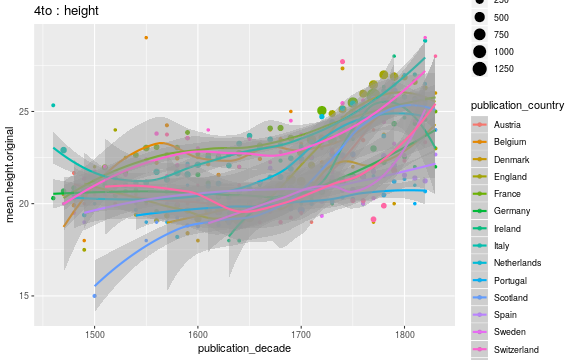

## Average document dimensions 

We have 2504 documents with country and original gatherings information. We have 20431 documents with original gatherings information but no country information.

|     | Belgium| Denmark| England| France| Germany| Ireland| Italy| Latvia| Netherlands| Poland| Portugal| Russia| Scotland| Spain| Sweden| Switzerland| USA| NA| total|
|:----|-------:|-------:|-------:|------:|-------:|-------:|-----:|------:|-----------:|------:|--------:|------:|--------:|-----:|------:|-----------:|---:|--:|-----:|
|1to  |       0|       0|       7|      1|       0|       1|     0|      0|           1|      0|        0|      0|        0|     0|      0|           0|   0|  0|    10|
|2fo  |       0|       1|      54|     12|       9|       0|    11|      1|           3|      0|        0|      1|       14|    11|      0|           0|   0| 63|   180|
|4to  |       2|       1|     123|     92|      29|       2|    11|      0|          12|      1|        2|      0|       19|     8|      1|           2|   4| 87|   396|
|8vo  |       2|       2|     193|     92|      30|       7|    11|      1|          17|      2|        0|      1|       40|     6|      0|           6|  19| 69|   498|
|12mo |       3|       0|      52|     36|       3|       3|     2|      0|          12|      0|        0|      0|       13|     0|      0|           1|   8| 17|   150|
|16mo |       0|       0|       2|      0|       0|       0|     0|      0|           2|      0|        0|      0|        0|     0|      0|           0|   0|  3|     7|
|18mo |       0|       0|       3|      0|       0|       1|     0|      0|           0|      0|        0|      0|        1|     0|      0|           0|   0|  1|     6|
|24mo |       0|       0|       2|      0|       0|       0|     0|      0|           1|      0|        0|      0|        0|     0|      0|           0|   0|  0|     3|
|32mo |       1|       0|       0|      0|       0|       0|     0|      0|           0|      0|        0|      0|        0|     0|      0|           0|   1|  0|     2|

### Selected gatherings across time; by country

### Average document sizes 

Only cases with 2000 documents are shown:

|gatherings.original | mean.height| median.height| mean.width| median.width|   n|
|:-------------------|-----------:|-------------:|----------:|------------:|---:|
|2fo                 |    32.37778|      32.37778|   25.33333|     25.33333| 180|
|4to                 |    22.30303|      22.30303|   18.50000|     18.50000| 396|
|8vo                 |    19.30221|      19.30221|   12.25000|     12.25000| 498|

### Average document sizes by decade and country

Only cases with 2000 documents are shown:

|gatherings.original |country     | publication_decade| mean.height| median.height| mean.width| median.width|  n|
|:-------------------|:-----------|------------------:|-----------:|-------------:|----------:|------------:|--:|
|2fo                 |Denmark     |               1690|    35.00000|      35.00000|         NA|           NA|  1|
|2fo                 |England     |               1600|    28.00000|      28.00000|         NA|           NA|  1|
|2fo                 |England     |               1620|    32.00000|      32.00000|         NA|           NA|  3|
|2fo                 |England     |               1640|    37.00000|      37.00000|         NA|           NA|  1|
|2fo                 |England     |               1650|    31.00000|      31.00000|         NA|           NA|  3|
|2fo                 |England     |               1660|    25.00000|      25.00000|         NA|           NA|  1|
|2fo                 |England     |               1670|    36.00000|      36.00000|         NA|           NA|  2|
|2fo                 |England     |               1680|    31.55556|      31.55556|         NA|           NA|  9|
|2fo                 |England     |               1690|    35.00000|      35.00000|         NA|           NA|  2|
|2fo                 |England     |               1700|    33.66667|      33.66667|   23.00000|     23.00000|  3|
|2fo                 |England     |               1710|    31.40000|      31.40000|        NaN|          NaN|  5|
|2fo                 |England     |               1720|    32.66667|      32.66667|        NaN|          NaN|  3|
|2fo                 |England     |               1730|    32.00000|      32.00000|   19.00000|     19.00000|  5|
|2fo                 |England     |               1740|    35.00000|      35.00000|   32.00000|     32.00000|  5|
|2fo                 |England     |               1750|    39.60000|      39.60000|        NaN|          NaN|  5|
|2fo                 |England     |               1770|    37.00000|      37.00000|        NaN|          NaN|  4|
|2fo                 |England     |               1790|    29.00000|      29.00000|        NaN|          NaN|  2|
|2fo                 |France      |               1470|    27.50000|      27.50000|        NaN|          NaN|  2|
|2fo                 |France      |               1540|    34.00000|      34.00000|        NaN|          NaN|  1|
|2fo                 |France      |               1560|    33.00000|      33.00000|        NaN|          NaN|  1|
|2fo                 |France      |               1570|    33.00000|      33.00000|        NaN|          NaN|  1|
|2fo                 |France      |               1580|    33.00000|      33.00000|        NaN|          NaN|  1|
|2fo                 |France      |               1600|    35.00000|      35.00000|        NaN|          NaN|  1|
|2fo                 |France      |               1610|    40.00000|      40.00000|        NaN|          NaN|  1|
|2fo                 |France      |               1640|    38.50000|      38.50000|        NaN|          NaN|  2|
|2fo                 |France      |               1690|    38.00000|      38.00000|        NaN|          NaN|  1|
|2fo                 |France      |               1750|    39.00000|      39.00000|        NaN|          NaN|  1|
|2fo                 |Germany     |               1510|    31.00000|      31.00000|        NaN|          NaN|  2|
|2fo                 |Germany     |               1600|    36.00000|      36.00000|        NaN|          NaN|  1|
|2fo                 |Germany     |               1640|    36.00000|      36.00000|        NaN|          NaN|  1|
|2fo                 |Germany     |               1680|    37.00000|      37.00000|        NaN|          NaN|  1|
|2fo                 |Germany     |               1730|    35.00000|      35.00000|        NaN|          NaN|  1|
|2fo                 |Germany     |               1750|    42.00000|      42.00000|        NaN|          NaN|  1|
|2fo                 |Germany     |               1760|    34.00000|      34.00000|        NaN|          NaN|  1|
|2fo                 |Germany     |               1780|    34.00000|      34.00000|        NaN|          NaN|  1|
|2fo                 |Italy       |               1470|    29.25000|      29.25000|        NaN|          NaN|  4|
|2fo                 |Italy       |               1480|    28.00000|      28.00000|        NaN|          NaN|  2|
|2fo                 |Italy       |               1490|    32.00000|      32.00000|        NaN|          NaN|  3|
|2fo                 |Italy       |               1680|    28.00000|      28.00000|        NaN|          NaN|  1|
|2fo                 |Italy       |               1740|    38.00000|      38.00000|        NaN|          NaN|  1|
|2fo                 |Latvia      |               1790|    33.00000|      33.00000|        NaN|          NaN|  1|
|2fo                 |Netherlands |               1610|    31.00000|      31.00000|        NaN|          NaN|  1|
|2fo                 |Netherlands |               1720|    38.00000|      38.00000|        NaN|          NaN|  1|
|2fo                 |Netherlands |               1740|    41.00000|      41.00000|   26.00000|     26.00000|  1|
|2fo                 |Russia      |               1780|    33.00000|      33.00000|        NaN|          NaN|  1|
|2fo                 |Scotland    |               1650|    27.00000|      27.00000|        NaN|          NaN|  1|
|2fo                 |Scotland    |               1680|    29.00000|      29.00000|        NaN|          NaN|  1|
|2fo                 |Scotland    |               1690|    33.50000|      33.50000|        NaN|          NaN|  2|
|2fo                 |Scotland    |               1700|    33.00000|      33.00000|        NaN|          NaN|  2|
|2fo                 |Scotland    |               1710|    36.00000|      36.00000|        NaN|          NaN|  1|
|2fo                 |Scotland    |               1720|    35.00000|      35.00000|        NaN|          NaN|  2|
|2fo                 |Scotland    |               1740|    36.80000|      36.80000|        NaN|          NaN|  5|
|2fo                 |Spain       |               1680|    29.00000|      29.00000|        NaN|          NaN|  1|
|2fo                 |Spain       |               1700|    31.00000|      31.00000|        NaN|          NaN|  1|
|2fo                 |Spain       |               1720|    31.50000|      31.50000|        NaN|          NaN|  2|
|2fo                 |Spain       |               1740|    30.00000|      30.00000|        NaN|          NaN|  1|
|2fo                 |Spain       |               1760|    30.00000|      30.00000|        NaN|          NaN|  1|
|2fo                 |Spain       |               1770|    29.00000|      29.00000|        NaN|          NaN|  1|
|2fo                 |Spain       |               1780|    31.00000|      31.00000|        NaN|          NaN|  2|
|2fo                 |Spain       |               1800|    30.00000|      30.00000|        NaN|          NaN|  1|
|2fo                 |Spain       |               1810|    31.00000|      31.00000|        NaN|          NaN|  1|
|2fo                 |NA          |               1470|    28.00000|      28.00000|        NaN|          NaN|  1|
|2fo                 |NA          |               1480|    30.00000|      30.00000|        NaN|          NaN|  2|
|2fo                 |NA          |               1490|    31.00000|      31.00000|        NaN|          NaN|  2|
|2fo                 |NA          |               1510|    29.00000|      29.00000|        NaN|          NaN|  1|
|2fo                 |NA          |               1520|    29.00000|      29.00000|        NaN|          NaN|  1|
|2fo                 |NA          |               1540|    29.50000|      29.50000|        NaN|          NaN|  2|
|2fo                 |NA          |               1550|    22.00000|      22.00000|        NaN|          NaN|  1|
|2fo                 |NA          |               1560|    29.00000|      29.00000|        NaN|          NaN|  1|
|2fo                 |NA          |               1570|    34.00000|      34.00000|        NaN|          NaN|  2|
|2fo                 |NA          |               1580|    28.00000|      28.00000|        NaN|          NaN|  1|
|2fo                 |NA          |               1590|    33.00000|      33.00000|        NaN|          NaN|  1|
|2fo                 |NA          |               1600|    31.00000|      31.00000|        NaN|          NaN|  1|
|2fo                 |NA          |               1610|    31.80000|      31.80000|   51.00000|     51.00000|  5|
|2fo                 |NA          |               1620|    31.50000|      31.50000|        NaN|          NaN|  2|
|2fo                 |NA          |               1630|    28.50000|      28.50000|        NaN|          NaN|  2|
|2fo                 |NA          |               1640|    33.50000|      33.50000|        NaN|          NaN|  2|
|2fo                 |NA          |               1650|    29.50000|      29.50000|        NaN|          NaN|  2|
|2fo                 |NA          |               1660|    32.75000|      32.75000|        NaN|          NaN|  4|
|2fo                 |NA          |               1670|    31.00000|      31.00000|        NaN|          NaN|  2|
|2fo                 |NA          |               1680|    34.00000|      34.00000|        NaN|          NaN|  2|
|2fo                 |NA          |               1690|    28.62500|      28.62500|        NaN|          NaN|  8|
|2fo                 |NA          |               1700|    29.00000|      29.00000|        NaN|          NaN|  2|
|2fo                 |NA          |               1740|    32.00000|      32.00000|        NaN|          NaN|  1|
|2fo                 |NA          |               1760|    48.00000|      48.00000|        NaN|          NaN|  1|
|2fo                 |NA          |               1770|    31.00000|      31.00000|        NaN|          NaN|  2|
|2fo                 |NA          |               1790|    29.00000|      29.00000|        NaN|          NaN|  1|
|2fo                 |NA          |               1800|    27.00000|      27.00000|        NaN|          NaN|  3|
|2fo                 |NA          |               1810|    31.00000|      31.00000|        NaN|          NaN|  1|
|2fo                 |NA          |               1820|    31.57143|      31.57143|   21.85714|     21.85714|  7|
|4to                 |Belgium     |               1480|    20.50000|      20.50000|        NaN|          NaN|  2|
|4to                 |Denmark     |               1700|    21.00000|      21.00000|        NaN|          NaN|  1|
|4to                 |England     |               1540|    20.00000|      20.00000|        NaN|          NaN|  1|
|4to                 |England     |               1560|    20.00000|      20.00000|        NaN|          NaN|  1|
|4to                 |England     |               1580|    22.50000|      22.50000|        NaN|          NaN|  2|
|4to                 |England     |               1590|    20.00000|      20.00000|        NaN|          NaN|  1|
|4to                 |England     |               1600|    19.28571|      19.28571|        NaN|          NaN|  7|
|4to                 |England     |               1610|    18.33333|      18.33333|        NaN|          NaN|  3|
|4to                 |England     |               1620|    19.33333|      19.33333|        NaN|          NaN|  6|
|4to                 |England     |               1630|    19.20000|      19.20000|        NaN|          NaN|  5|
|4to                 |England     |               1640|    19.00000|      19.00000|   14.00000|     14.00000| 19|
|4to                 |England     |               1650|    19.10000|      19.10000|        NaN|          NaN| 10|
|4to                 |England     |               1660|    19.00000|      19.00000|        NaN|          NaN|  2|
|4to                 |England     |               1670|    21.85714|      21.85714|        NaN|          NaN|  7|
|4to                 |England     |               1680|    21.28571|      21.28571|        NaN|          NaN| 14|
|4to                 |England     |               1690|    21.33333|      21.33333|        NaN|          NaN|  3|
|4to                 |England     |               1700|    20.85714|      20.85714|        NaN|          NaN|  7|
|4to                 |England     |               1710|    20.00000|      20.00000|        NaN|          NaN|  1|
|4to                 |England     |               1720|    23.75000|      23.75000|        NaN|          NaN|  4|
|4to                 |England     |               1730|    24.00000|      24.00000|        NaN|          NaN|  3|
|4to                 |England     |               1740|    21.33333|      21.33333|   16.00000|     16.00000|  3|
|4to                 |England     |               1750|    26.00000|      26.00000|        NaN|          NaN|  1|
|4to                 |England     |               1760|    22.00000|      22.00000|        NaN|          NaN|  3|
|4to                 |England     |               1770|    26.77778|      26.77778|   21.00000|     21.00000|  9|
|4to                 |England     |               1780|    26.00000|      26.00000|   16.00000|     16.00000|  6|
|4to                 |England     |               1790|    26.33333|      26.33333|   22.00000|     22.00000|  3|
|4to                 |England     |               1800|    26.00000|      26.00000|   22.00000|     22.00000|  1|
|4to                 |England     |               1810|    22.00000|      22.00000|        NaN|          NaN|  1|
|4to                 |France      |               1470|    21.00000|      21.00000|        NaN|          NaN|  1|
|4to                 |France      |               1480|    20.00000|      20.00000|        NaN|          NaN|  1|
|4to                 |France      |               1490|    18.50000|      18.50000|        NaN|          NaN|  2|
|4to                 |France      |               1500|    20.00000|      20.00000|        NaN|          NaN|  1|
|4to                 |France      |               1510|    20.50000|      20.50000|        NaN|          NaN|  2|
|4to                 |France      |               1520|    26.00000|      26.00000|        NaN|          NaN|  1|
|4to                 |France      |               1530|    23.00000|      23.00000|        NaN|          NaN|  1|
|4to                 |France      |               1550|    23.33333|      23.33333|        NaN|          NaN|  3|
|4to                 |France      |               1580|    22.00000|      22.00000|        NaN|          NaN|  2|
|4to                 |France      |               1600|    19.00000|      19.00000|        NaN|          NaN|  1|
|4to                 |France      |               1630|    21.00000|      21.00000|        NaN|          NaN|  1|
|4to                 |France      |               1640|    24.00000|      24.00000|        NaN|          NaN|  1|
|4to                 |France      |               1660|    25.00000|      25.00000|        NaN|          NaN|  1|
|4to                 |France      |               1680|    24.00000|      24.00000|        NaN|          NaN|  1|
|4to                 |France      |               1690|    25.00000|      25.00000|        NaN|          NaN|  1|
|4to                 |France      |               1700|    22.00000|      22.00000|        NaN|          NaN|  3|
|4to                 |France      |               1710|    23.37500|      23.37500|        NaN|          NaN|  8|
|4to                 |France      |               1720|    24.80000|      24.80000|        NaN|          NaN|  5|
|4to                 |France      |               1730|    24.33333|      24.33333|        NaN|          NaN|  6|
|4to                 |France      |               1740|    23.20000|      23.20000|        NaN|          NaN|  5|
|4to                 |France      |               1750|    25.37500|      25.37500|        NaN|          NaN|  8|
|4to                 |France      |               1760|    25.42857|      25.42857|        NaN|          NaN|  7|
|4to                 |France      |               1770|    25.51852|      25.51852|        NaN|          NaN| 27|
|4to                 |France      |               1780|    26.50000|      26.50000|        NaN|          NaN|  2|
|4to                 |France      |               1790|    21.00000|      21.00000|        NaN|          NaN|  1|
|4to                 |Germany     |               1490|    21.00000|      21.00000|        NaN|          NaN|  1|
|4to                 |Germany     |               1580|    19.50000|      19.50000|        NaN|          NaN|  2|
|4to                 |Germany     |               1590|    26.00000|      26.00000|        NaN|          NaN|  1|
|4to                 |Germany     |               1600|    21.00000|      21.00000|        NaN|          NaN|  2|
|4to                 |Germany     |               1620|    20.00000|      20.00000|        NaN|          NaN|  1|
|4to                 |Germany     |               1640|    18.50000|      18.50000|        NaN|          NaN|  2|
|4to                 |Germany     |               1650|    21.00000|      21.00000|        NaN|          NaN|  1|
|4to                 |Germany     |               1660|    21.50000|      21.50000|        NaN|          NaN|  2|
|4to                 |Germany     |               1690|    22.00000|      22.00000|        NaN|          NaN|  1|
|4to                 |Germany     |               1700|    20.50000|      20.50000|        NaN|          NaN|  2|
|4to                 |Germany     |               1710|    19.33333|      19.33333|        NaN|          NaN|  3|
|4to                 |Germany     |               1720|    22.50000|      22.50000|        NaN|          NaN|  2|
|4to                 |Germany     |               1730|    21.33333|      21.33333|        NaN|          NaN|  3|
|4to                 |Germany     |               1740|    19.50000|      19.50000|        NaN|          NaN|  2|
|4to                 |Germany     |               1760|    22.66667|      22.66667|        NaN|          NaN|  3|
|4to                 |Germany     |               1770|    26.00000|      26.00000|        NaN|          NaN|  1|
|4to                 |Ireland     |               1700|    21.00000|      21.00000|        NaN|          NaN|  1|
|4to                 |Ireland     |               1760|    23.00000|      23.00000|        NaN|          NaN|  1|
|4to                 |Italy       |               1490|    21.00000|      21.00000|        NaN|          NaN|  1|
|4to                 |Italy       |               1550|    21.00000|      21.00000|        NaN|          NaN|  1|
|4to                 |Italy       |               1590|    22.50000|      22.50000|        NaN|          NaN|  2|
|4to                 |Italy       |               1630|    21.00000|      21.00000|        NaN|          NaN|  1|
|4to                 |Italy       |               1670|    24.00000|      24.00000|        NaN|          NaN|  2|
|4to                 |Italy       |               1740|    25.00000|      25.00000|        NaN|          NaN|  1|
|4to                 |Italy       |               1750|    25.00000|      25.00000|        NaN|          NaN|  1|
|4to                 |Italy       |               1770|    23.00000|      23.00000|        NaN|          NaN|  2|
|4to                 |Netherlands |               1600|    20.00000|      20.00000|        NaN|          NaN|  1|
|4to                 |Netherlands |               1620|    19.00000|      19.00000|        NaN|          NaN|  1|
|4to                 |Netherlands |               1650|    20.00000|      20.00000|        NaN|          NaN|  1|
|4to                 |Netherlands |               1660|    21.00000|      21.00000|        NaN|          NaN|  1|
|4to                 |Netherlands |               1670|    24.00000|      24.00000|        NaN|          NaN|  2|
|4to                 |Netherlands |               1680|    19.00000|      19.00000|        NaN|          NaN|  1|
|4to                 |Netherlands |               1690|    19.00000|      19.00000|        NaN|          NaN|  1|
|4to                 |Netherlands |               1720|    24.00000|      24.00000|        NaN|          NaN|  1|
|4to                 |Netherlands |               1740|    26.50000|      26.50000|        NaN|          NaN|  2|
|4to                 |Netherlands |               1760|    21.00000|      21.00000|        NaN|          NaN|  1|
|4to                 |Poland      |               1760|    22.00000|      22.00000|        NaN|          NaN|  1|
|4to                 |Portugal    |               1640|    20.00000|      20.00000|        NaN|          NaN|  1|
|4to                 |Portugal    |               1780|    20.00000|      20.00000|        NaN|          NaN|  1|
|4to                 |Scotland    |               1620|    18.00000|      18.00000|        NaN|          NaN|  1|
|4to                 |Scotland    |               1630|    18.00000|      18.00000|        NaN|          NaN|  1|
|4to                 |Scotland    |               1640|    20.00000|      20.00000|        NaN|          NaN|  1|
|4to                 |Scotland    |               1680|    18.66667|      18.66667|        NaN|          NaN|  3|
|4to                 |Scotland    |               1700|    19.66667|      19.66667|        NaN|          NaN|  3|
|4to                 |Scotland    |               1730|    23.00000|      23.00000|        NaN|          NaN|  1|
|4to                 |Scotland    |               1740|    23.00000|      23.00000|        NaN|          NaN|  1|
|4to                 |Scotland    |               1750|    24.50000|      24.50000|        NaN|          NaN|  2|
|4to                 |Scotland    |               1780|    23.00000|      23.00000|        NaN|          NaN|  1|
|4to                 |Scotland    |               1790|    27.00000|      27.00000|        NaN|          NaN|  2|
|4to                 |Scotland    |               1800|    27.50000|      27.50000|        NaN|          NaN|  2|
|4to                 |Scotland    |               1810|    21.00000|      21.00000|        NaN|          NaN|  1|
|4to                 |Spain       |               1660|    21.00000|      21.00000|        NaN|          NaN|  1|
|4to                 |Spain       |               1710|    20.00000|      20.00000|        NaN|          NaN|  1|
|4to                 |Spain       |               1730|    32.00000|      32.00000|        NaN|          NaN|  1|
|4to                 |Spain       |               1750|    22.00000|      22.00000|        NaN|          NaN|  1|
|4to                 |Spain       |               1760|    20.00000|      20.00000|        NaN|          NaN|  1|
|4to                 |Spain       |               1770|    26.00000|      26.00000|        NaN|          NaN|  1|
|4to                 |Spain       |               1790|    22.00000|      22.00000|        NaN|          NaN|  1|
|4to                 |Spain       |               1820|    20.00000|      20.00000|        NaN|          NaN|  1|
|4to                 |Sweden      |               1800|    23.00000|      23.00000|        NaN|          NaN|  1|
|4to                 |Switzerland |               1560|    24.00000|      24.00000|        NaN|          NaN|  1|
|4to                 |Switzerland |               1760|    26.00000|      26.00000|        NaN|          NaN|  1|
|4to                 |USA         |               1760|    21.00000|      21.00000|        NaN|          NaN|  2|
|4to                 |USA         |               1780|    21.00000|      21.00000|        NaN|          NaN|  1|
|4to                 |USA         |               1790|    25.00000|      25.00000|        NaN|          NaN|  1|
|4to                 |NA          |               1480|    20.66667|      20.66667|        NaN|          NaN|  3|
|4to                 |NA          |               1490|    21.00000|      21.00000|        NaN|          NaN|  2|
|4to                 |NA          |               1500|    22.00000|      22.00000|        NaN|          NaN|  2|
|4to                 |NA          |               1510|    21.00000|      21.00000|        NaN|          NaN|  1|
|4to                 |NA          |               1520|    20.50000|      20.50000|        NaN|          NaN|  2|
|4to                 |NA          |               1530|    23.00000|      23.00000|        NaN|          NaN|  2|
|4to                 |NA          |               1550|    21.60000|      21.60000|        NaN|          NaN|  5|
|4to                 |NA          |               1560|    23.00000|      23.00000|        NaN|          NaN|  2|
|4to                 |NA          |               1570|    20.00000|      20.00000|        NaN|          NaN|  3|
|4to                 |NA          |               1580|    21.16667|      21.16667|        NaN|          NaN|  6|
|4to                 |NA          |               1590|    20.50000|      20.50000|        NaN|          NaN|  2|
|4to                 |NA          |               1600|    24.00000|      24.00000|        NaN|          NaN|  2|
|4to                 |NA          |               1620|    20.75000|      20.75000|        NaN|          NaN|  4|
|4to                 |NA          |               1630|    21.00000|      21.00000|        NaN|          NaN|  1|
|4to                 |NA          |               1640|    23.66667|      23.66667|        NaN|          NaN|  3|
|4to                 |NA          |               1650|    23.00000|      23.00000|        NaN|          NaN|  1|
|4to                 |NA          |               1660|    23.50000|      23.50000|        NaN|          NaN|  2|
|4to                 |NA          |               1670|    25.00000|      25.00000|        NaN|          NaN|  1|
|4to                 |NA          |               1680|    19.66667|      19.66667|        NaN|          NaN|  3|
|4to                 |NA          |               1690|    22.75000|      22.75000|        NaN|          NaN|  4|
|4to                 |NA          |               1700|    23.11111|      23.11111|        NaN|          NaN|  9|
|4to                 |NA          |               1710|    22.66667|      22.66667|        NaN|          NaN|  3|
|4to                 |NA          |               1720|    20.00000|      20.00000|        NaN|          NaN|  1|
|4to                 |NA          |               1730|    22.25000|      22.25000|        NaN|          NaN|  4|
|4to                 |NA          |               1750|    23.16667|      23.16667|        NaN|          NaN|  6|
|4to                 |NA          |               1760|    24.40000|      24.40000|        NaN|          NaN|  5|
|4to                 |NA          |               1770|    21.00000|      21.00000|        NaN|          NaN|  3|
|4to                 |NA          |               1790|    23.50000|      23.50000|        NaN|          NaN|  2|
|4to                 |NA          |               1800|    21.00000|      21.00000|        NaN|          NaN|  1|
|4to                 |NA          |               1810|    22.00000|      22.00000|        NaN|          NaN|  1|
|4to                 |NA          |               1820|    20.00000|      20.00000|        NaN|          NaN|  1|
|8vo                 |Belgium     |               1550|    15.00000|      15.00000|        NaN|          NaN|  1|
|8vo                 |Belgium     |               1570|    15.00000|      15.00000|        NaN|          NaN|  1|
|8vo                 |Denmark     |               1670|    16.00000|      16.00000|        NaN|          NaN|  1|
|8vo                 |Denmark     |               1790|    22.00000|      22.00000|        NaN|          NaN|  1|
|8vo                 |England     |               1570|    15.00000|      15.00000|        NaN|          NaN|  1|
|8vo                 |England     |               1590|    14.00000|      14.00000|        NaN|          NaN|  1|
|8vo                 |England     |               1630|    20.50000|      20.50000|        NaN|          NaN|  2|
|8vo                 |England     |               1640|    19.00000|      19.00000|        NaN|          NaN|  3|
|8vo                 |England     |               1650|    15.50000|      15.50000|        NaN|          NaN|  6|
|8vo                 |England     |               1660|    18.00000|      18.00000|        NaN|          NaN|  1|
|8vo                 |England     |               1670|    16.75000|      16.75000|        NaN|          NaN|  4|
|8vo                 |England     |               1680|    17.00000|      17.00000|        NaN|          NaN|  3|
|8vo                 |England     |               1690|    18.28571|      18.28571|        NaN|          NaN|  7|
|8vo                 |England     |               1700|    18.14286|      18.14286|        NaN|          NaN|  7|
|8vo                 |England     |               1710|    19.47059|      19.47059|        NaN|          NaN| 17|
|8vo                 |England     |               1720|    19.46154|      19.46154|        NaN|          NaN| 13|
|8vo                 |England     |               1730|    19.09091|      19.09091|        NaN|          NaN| 11|
|8vo                 |England     |               1740|    20.41667|      20.41667|        NaN|          NaN| 12|
|8vo                 |England     |               1750|    20.08333|      20.08333|        NaN|          NaN| 12|
|8vo                 |England     |               1760|    20.25000|      20.25000|        NaN|          NaN| 12|
|8vo                 |England     |               1770|    21.41667|      21.41667|   14.00000|     14.00000| 12|
|8vo                 |England     |               1780|    21.25000|      21.25000|        NaN|          NaN| 16|
|8vo                 |England     |               1790|    20.91667|      20.91667|        NaN|          NaN| 24|
|8vo                 |England     |               1800|    21.81818|      21.81818|        NaN|          NaN| 11|
|8vo                 |England     |               1810|    21.50000|      21.50000|   11.50000|     11.50000| 14|
|8vo                 |England     |               1820|    22.25000|      22.25000|        NaN|          NaN|  4|
|8vo                 |France      |               1500|    13.50000|      13.50000|        NaN|          NaN|  2|
|8vo                 |France      |               1530|    16.75000|      16.75000|        NaN|          NaN|  4|
|8vo                 |France      |               1540|    20.50000|      20.50000|        NaN|          NaN|  2|
|8vo                 |France      |               1560|    16.50000|      16.50000|        NaN|          NaN|  2|
|8vo                 |France      |               1570|    16.50000|      16.50000|        NaN|          NaN|  2|
|8vo                 |France      |               1580|    18.66667|      18.66667|        NaN|          NaN|  3|
|8vo                 |France      |               1610|    17.00000|      17.00000|        NaN|          NaN|  2|
|8vo                 |France      |               1620|    17.33333|      17.33333|        NaN|          NaN|  3|
|8vo                 |France      |               1630|    16.50000|      16.50000|        NaN|          NaN|  2|
|8vo                 |France      |               1660|    17.00000|      17.00000|        NaN|          NaN|  3|
|8vo                 |France      |               1680|    18.00000|      18.00000|        NaN|          NaN|  1|
|8vo                 |France      |               1720|    15.00000|      15.00000|        NaN|          NaN|  1|
|8vo                 |France      |               1730|    16.25000|      16.25000|        NaN|          NaN|  2|
|8vo                 |France      |               1740|    21.66667|      21.66667|        NaN|          NaN|  3|
|8vo                 |France      |               1750|    20.00000|      20.00000|        NaN|          NaN|  2|
|8vo                 |France      |               1760|    20.00000|      20.00000|        NaN|          NaN|  2|
|8vo                 |France      |               1770|    20.40000|      20.40000|        NaN|          NaN|  5|
|8vo                 |France      |               1780|    20.33333|      20.33333|        NaN|          NaN| 15|
|8vo                 |France      |               1790|    20.36667|      20.36667|        NaN|          NaN| 30|
|8vo                 |France      |               1800|    20.00000|      20.00000|        NaN|          NaN|  3|
|8vo                 |France      |               1810|    21.00000|      21.00000|        NaN|          NaN|  1|
|8vo                 |France      |               1820|    19.50000|      19.50000|        NaN|          NaN|  2|
|8vo                 |Germany     |               1490|    13.00000|      13.00000|        NaN|          NaN|  1|
|8vo                 |Germany     |               1570|    16.00000|      16.00000|        NaN|          NaN|  1|
|8vo                 |Germany     |               1600|    16.00000|      16.00000|        NaN|          NaN|  1|
|8vo                 |Germany     |               1610|    15.00000|      15.00000|        NaN|          NaN|  1|
|8vo                 |Germany     |               1620|    16.00000|      16.00000|        NaN|          NaN|  1|
|8vo                 |Germany     |               1640|    16.00000|      16.00000|        NaN|          NaN|  1|
|8vo                 |Germany     |               1710|    17.66667|      17.66667|        NaN|          NaN|  3|
|8vo                 |Germany     |               1720|    17.00000|      17.00000|        NaN|          NaN|  1|
|8vo                 |Germany     |               1740|    18.00000|      18.00000|        NaN|          NaN|  1|
|8vo                 |Germany     |               1750|    19.00000|      19.00000|        NaN|          NaN|  1|
|8vo                 |Germany     |               1760|    20.00000|      20.00000|        NaN|          NaN|  1|
|8vo                 |Germany     |               1770|    19.80000|      19.80000|        NaN|          NaN|  5|
|8vo                 |Germany     |               1780|    17.50000|      17.50000|        NaN|          NaN|  2|
|8vo                 |Germany     |               1790|    19.85714|      19.85714|        NaN|          NaN|  7|
|8vo                 |Germany     |               1810|    20.00000|      20.00000|        NaN|          NaN|  2|
|8vo                 |Germany     |               1820|    22.00000|      22.00000|        NaN|          NaN|  1|
|8vo                 |Ireland     |               1720|    18.00000|      18.00000|        NaN|          NaN|  1|
|8vo                 |Ireland     |               1740|    20.00000|      20.00000|        NaN|          NaN|  1|
|8vo                 |Ireland     |               1750|    20.00000|      20.00000|   12.00000|     12.00000|  1|
|8vo                 |Ireland     |               1770|    20.00000|      20.00000|        NaN|          NaN|  1|
|8vo                 |Ireland     |               1780|    17.00000|      17.00000|        NaN|          NaN|  1|
|8vo                 |Ireland     |               1790|    20.00000|      20.00000|        NaN|          NaN|  1|
|8vo                 |Ireland     |               1810|    20.00000|      20.00000|        NaN|          NaN|  1|
|8vo                 |Italy       |               1530|    15.00000|      15.00000|        NaN|          NaN|  1|
|8vo                 |Italy       |               1550|    15.00000|      15.00000|        NaN|          NaN|  1|
|8vo                 |Italy       |               1580|    17.00000|      17.00000|        NaN|          NaN|  1|
|8vo                 |Italy       |               1710|    17.00000|      17.00000|        NaN|          NaN|  1|
|8vo                 |Italy       |               1770|    19.75000|      19.75000|        NaN|          NaN|  4|
|8vo                 |Italy       |               1780|    24.00000|      24.00000|        NaN|          NaN|  1|
|8vo                 |Italy       |               1820|    21.50000|      21.50000|        NaN|          NaN|  2|
|8vo                 |Latvia      |               1770|    18.00000|      18.00000|        NaN|          NaN|  1|
|8vo                 |Netherlands |               1580|    18.00000|      18.00000|        NaN|          NaN|  1|
|8vo                 |Netherlands |               1600|    16.00000|      16.00000|        NaN|          NaN|  1|
|8vo                 |Netherlands |               1650|    18.50000|      18.50000|        NaN|          NaN|  2|
|8vo                 |Netherlands |               1670|    16.00000|      16.00000|        NaN|          NaN|  1|
|8vo                 |Netherlands |               1680|    17.00000|      17.00000|        NaN|          NaN|  2|
|8vo                 |Netherlands |               1690|    19.00000|      19.00000|        NaN|          NaN|  2|
|8vo                 |Netherlands |               1700|    21.00000|      21.00000|        NaN|          NaN|  1|
|8vo                 |Netherlands |               1720|    20.50000|      20.50000|        NaN|          NaN|  2|
|8vo                 |Netherlands |               1730|    16.00000|      16.00000|        NaN|          NaN|  1|
|8vo                 |Netherlands |               1750|    17.00000|      17.00000|        NaN|          NaN|  1|
|8vo                 |Netherlands |               1760|    17.00000|      17.00000|        NaN|          NaN|  1|
|8vo                 |Netherlands |               1780|    22.00000|      22.00000|        NaN|          NaN|  1|
|8vo                 |Netherlands |               1810|    15.00000|      15.00000|        NaN|          NaN|  1|
|8vo                 |Poland      |               1680|    18.00000|      18.00000|        NaN|          NaN|  1|
|8vo                 |Poland      |               1780|    20.00000|      20.00000|        NaN|          NaN|  1|
|8vo                 |Russia      |               1710|    17.00000|      17.00000|        NaN|          NaN|  1|
|8vo                 |Scotland    |               1590|    15.00000|      15.00000|        NaN|          NaN|  1|
|8vo                 |Scotland    |               1630|    15.00000|      15.00000|        NaN|          NaN|  1|
|8vo                 |Scotland    |               1640|    15.00000|      15.00000|        NaN|          NaN|  1|
|8vo                 |Scotland    |               1670|    17.00000|      17.00000|        NaN|          NaN|  1|
|8vo                 |Scotland    |               1710|    17.00000|      17.00000|        NaN|          NaN|  1|
|8vo                 |Scotland    |               1730|    19.00000|      19.00000|        NaN|          NaN|  1|
|8vo                 |Scotland    |               1750|    19.00000|      19.00000|        NaN|          NaN|  2|
|8vo                 |Scotland    |               1760|    20.00000|      20.00000|        NaN|          NaN|  1|
|8vo                 |Scotland    |               1770|    19.00000|      19.00000|        NaN|          NaN|  5|
|8vo                 |Scotland    |               1780|    20.00000|      20.00000|        NaN|          NaN|  9|
|8vo                 |Scotland    |               1790|    20.75000|      20.75000|        NaN|          NaN|  8|
|8vo                 |Scotland    |               1800|    21.33333|      21.33333|        NaN|          NaN|  3|
|8vo                 |Scotland    |               1810|    20.75000|      20.75000|        NaN|          NaN|  4|
|8vo                 |Scotland    |               1820|    21.00000|      21.00000|        NaN|          NaN|  2|
|8vo                 |Spain       |               1610|    16.00000|      16.00000|        NaN|          NaN|  1|
|8vo                 |Spain       |               1760|    15.00000|      15.00000|        NaN|          NaN|  1|
|8vo                 |Spain       |               1770|    16.50000|      16.50000|        NaN|          NaN|  2|
|8vo                 |Spain       |               1780|    20.00000|      20.00000|        NaN|          NaN|  1|
|8vo                 |Spain       |               1790|    22.00000|      22.00000|        NaN|          NaN|  1|
|8vo                 |Switzerland |               1590|    16.00000|      16.00000|        NaN|          NaN|  1|
|8vo                 |Switzerland |               1660|    18.00000|      18.00000|        NaN|          NaN|  1|
|8vo                 |Switzerland |               1730|    18.00000|      18.00000|        NaN|          NaN|  1|
|8vo                 |Switzerland |               1740|    20.00000|      20.00000|        NaN|          NaN|  1|
|8vo                 |Switzerland |               1760|    20.00000|      20.00000|        NaN|          NaN|  1|
|8vo                 |Switzerland |               1770|    21.00000|      21.00000|        NaN|          NaN|  1|
|8vo                 |USA         |               1750|    19.00000|      19.00000|        NaN|          NaN|  2|
|8vo                 |USA         |               1770|    18.50000|      18.50000|        NaN|          NaN|  2|
|8vo                 |USA         |               1780|    20.50000|      20.50000|        NaN|          NaN|  2|
|8vo                 |USA         |               1790|    21.80000|      21.80000|        NaN|          NaN| 10|
|8vo                 |USA         |               1810|    22.00000|      22.00000|        NaN|          NaN|  1|
|8vo                 |USA         |               1820|    21.00000|      21.00000|        NaN|          NaN|  2|
|8vo                 |NA          |               1480|    15.00000|      15.00000|        NaN|          NaN|  1|
|8vo                 |NA          |               1490|    15.00000|      15.00000|        NaN|          NaN|  1|
|8vo                 |NA          |               1510|    16.00000|      16.00000|        NaN|          NaN|  2|
|8vo                 |NA          |               1530|    16.00000|      16.00000|        NaN|          NaN|  4|
|8vo                 |NA          |               1540|    15.66667|      15.66667|        NaN|          NaN|  6|
|8vo                 |NA          |               1550|    16.66667|      16.66667|        NaN|          NaN|  3|
|8vo                 |NA          |               1560|    16.50000|      16.50000|        NaN|          NaN|  2|
|8vo                 |NA          |               1570|    16.80000|      16.80000|        NaN|          NaN|  5|
|8vo                 |NA          |               1580|    16.66667|      16.66667|        NaN|          NaN|  3|
|8vo                 |NA          |               1590|    16.00000|      16.00000|        NaN|          NaN|  1|
|8vo                 |NA          |               1600|    14.00000|      14.00000|        NaN|          NaN|  1|
|8vo                 |NA          |               1610|    18.00000|      18.00000|        NaN|          NaN|  2|
|8vo                 |NA          |               1630|    16.00000|      16.00000|        NaN|          NaN|  2|
|8vo                 |NA          |               1640|    18.00000|      18.00000|        NaN|          NaN|  2|
|8vo                 |NA          |               1660|    15.00000|      15.00000|        NaN|          NaN|  1|
|8vo                 |NA          |               1670|    17.00000|      17.00000|        NaN|          NaN|  1|
|8vo                 |NA          |               1680|    20.00000|      20.00000|        NaN|          NaN|  1|
|8vo                 |NA          |               1690|    28.00000|      28.00000|        NaN|          NaN|  2|
|8vo                 |NA          |               1700|    15.50000|      15.50000|        NaN|          NaN|  2|
|8vo                 |NA          |               1710|    17.50000|      17.50000|        NaN|          NaN|  2|
|8vo                 |NA          |               1720|    16.50000|      16.50000|        NaN|          NaN|  2|
|8vo                 |NA          |               1730|    19.50000|      19.50000|        NaN|          NaN|  2|
|8vo                 |NA          |               1740|    16.00000|      16.00000|        NaN|          NaN|  1|
|8vo                 |NA          |               1750|    17.33333|      17.33333|        NaN|          NaN|  3|
|8vo                 |NA          |               1760|    20.00000|      20.00000|        NaN|          NaN|  2|
|8vo                 |NA          |               1770|    17.00000|      17.00000|        NaN|          NaN|  2|
|8vo                 |NA          |               1780|    21.00000|      21.00000|        NaN|          NaN|  6|
|8vo                 |NA          |               1790|    19.50000|      19.50000|        NaN|          NaN|  6|
|8vo                 |NA          |               1800|    21.00000|      21.00000|        NaN|          NaN|  1|

