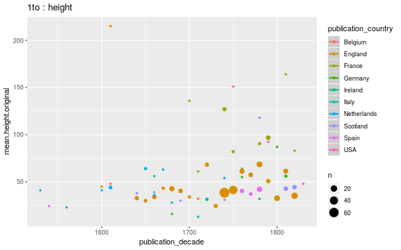

## Average document dimensions 

We have 1.47348 &times; 105 documents with country and original gatherings information.

|       | Argentina| Austria| Barbados| Belgium| Canada| Czech| Denmark| England| Estonia| Europe| Finland| France| Germany| Guernesey| Haiti| Hungary| India| Ireland| Italy| Jamaica| Latvia| Lithuania| Netherlands| Poland| Portugal| Russia| Scotland| Spain| Sweden| Switzerland| USA|   NA| total|
|:------|---------:|-------:|--------:|-------:|------:|-----:|-------:|-------:|-------:|------:|-------:|------:|-------:|---------:|-----:|-------:|-----:|-------:|-----:|-------:|------:|---------:|-----------:|------:|--------:|------:|--------:|-----:|------:|-----------:|---:|----:|-----:|
|1to    |         0|       0|        0|       1|      0|     0|       0|     294|       0|      0|       0|     20|       4|         0|     0|       0|     0|       4|     2|       0|      0|         0|           9|      0|        0|      0|       19|    19|      0|           0|   2|   25|   399|
|2long  |         0|       1|        0|       0|      0|     0|       0|      10|       0|      0|       0|      8|       0|         0|     0|       0|     0|       0|     2|       0|      0|         0|           0|      0|        0|      0|        1|     0|      0|           0|   0|    1|    23|
|2fo    |         2|       8|        0|      35|      4|     5|       7|    3296|      10|      0|       8|    646|     470|         0|     0|       0|     2|      57|   610|       0|      1|         0|         239|      1|       23|      9|      723|   801|      6|          98|  48| 4099| 11208|
|4long  |         0|       0|        0|       0|      0|     0|       0|       0|       0|      0|       0|      3|       0|         0|     0|       0|     0|       0|     0|       0|      0|         0|           1|      0|        0|      0|        0|     0|      0|           0|   0|    1|     5|
|4to    |         0|      19|        0|      59|      1|     2|      33|    7231|       2|      0|       7|   5169|    1497|         0|     1|       0|     5|      61|   883|       0|      0|         1|         766|     15|      122|     43|     1232|   579|    101|         106|  82| 4852| 22869|
|6to    |         0|       0|        0|       0|      0|     0|       0|       1|       0|      0|       0|      1|       0|         0|     0|       0|     0|       0|     0|       0|      0|         0|           1|      0|        0|      0|        1|     0|      0|           0|   0|    1|     5|
|8long  |         0|       0|        0|       0|      0|     0|       0|       0|       0|      0|       0|      0|       0|         0|     0|       0|     0|       0|     0|       0|      0|         0|           0|      1|        0|      0|        0|     0|      0|           0|   0|    1|     2|
|8vo    |         0|      58|        1|     104|      3|     2|      45|   12040|       0|      0|       2|   4823|    1420|         1|     0|       1|     3|     399|   527|       1|     15|         0|         941|     26|       32|     29|     2115|   403|     58|         284| 866| 4218| 28417|
|12long |         0|       0|        0|       0|      0|     0|       0|       6|       0|      0|       0|      2|       0|         0|     0|       0|     0|       0|     0|       0|      0|         0|           0|      0|        0|      0|        0|     0|      0|           0|   1|    0|     9|
|12mo   |         0|       1|        0|      73|     11|     0|       0|    3296|       0|      1|       1|   2040|     192|         0|     0|       0|     0|     237|   116|       1|      0|         0|        1225|      2|        5|      2|      643|    24|      7|          71| 429| 1194|  9571|
|16mo   |         0|       0|        0|       9|      0|     0|       0|      75|       0|      0|       1|    151|      14|         0|     0|       0|     0|       0|     6|       0|      0|         0|          68|      0|        1|      0|       18|    15|      2|          12|  14|  216|   602|
|18mo   |         0|       1|        0|       0|      0|     0|       0|      63|       0|      0|       0|     53|       1|         0|     0|       0|     0|       3|     1|       0|      0|         0|           5|      0|        0|      0|       33|     0|      0|           0|  40|   24|   224|
|24long |         0|       0|        0|       0|      0|     0|       0|       1|       0|      0|       0|      0|       0|         0|     0|       0|     0|       0|     0|       0|      0|         0|           1|      0|        0|      0|        0|     0|      0|           0|   0|    0|     2|
|24mo   |         0|       0|        0|       0|      0|     0|       0|      46|       0|      0|       0|     14|       0|         0|     0|       0|     0|       0|     1|       0|      0|         0|          94|      0|        0|      0|       31|     0|      0|           0|  20|   75|   281|
|32mo   |         0|       0|        0|       2|      0|     0|       0|      10|       0|      0|       0|      5|       0|         0|     0|       0|     0|       0|     0|       0|      0|         0|           2|      0|        0|      0|        3|     0|      0|           1|  19|   12|    54|
|48mo   |         0|       0|        0|       0|      0|     0|       0|       1|       0|      0|       0|      0|       0|         0|     0|       0|     0|       0|     0|       0|      0|         0|           0|      0|        0|      0|        0|     0|      0|           0|   0|    1|     2|
|64mo   |         0|       0|        0|       0|      0|     0|       0|       0|       0|      0|       0|      0|       0|         0|     0|       0|     0|       0|     0|       0|      0|         0|           0|      0|        0|      0|        1|     0|      0|           0|   0|    0|     1|

### Selected gatherings across time; by country

### Average document sizes 

Only cases with 2000 documents are shown:

|gatherings.original | mean.height| median.height| mean.width| median.width|      n|
|:-------------------|-----------:|-------------:|----------:|------------:|------:|
|1to                 |    54.49215|      54.49215|   38.06803|     38.06803|    399|
|2fo                 |    32.74235|      32.74235|   23.66726|     23.66726|  11208|
|4to                 |    22.40609|      22.40609|   19.32065|     19.32065|  22869|
|8vo                 |    19.21365|      19.21365|   14.00903|     14.00903|  28417|
|12mo                |    16.06897|      16.06897|   11.16860|     11.16860|   9571|
|16mo                |    12.73671|      12.73671|    9.78000|      9.78000|    602|
|18mo                |    14.24107|      14.24107|    9.00000|      9.00000|    224|
|NA                  |    23.13182|      23.13182|   27.67702|     27.67702| 542250|

### Average document sizes by decade and country

Only cases with 2000 documents are shown:

|gatherings.original |country     | publication_decade| mean.height| median.height| mean.width| median.width|     n|
|:-------------------|:-----------|------------------:|-----------:|-------------:|----------:|------------:|-----:|
|1to                 |Belgium     |               1610|    48.00000|      48.00000|   36.00000|     36.00000|     1|
|1to                 |England     |               1600|    45.00000|      45.00000|   32.00000|     32.00000|     1|
|1to                 |England     |               1610|   215.00000|     215.00000|   42.00000|     42.00000|     1|
|1to                 |England     |               1640|    31.75000|      31.75000|   21.75000|     21.75000|     4|
|1to                 |England     |               1650|    30.00000|      30.00000|   19.66667|     19.66667|     3|
|1to                 |England     |               1660|    34.00000|      34.00000|   23.71429|     23.71429|     7|
|1to                 |England     |               1670|    43.25000|      43.25000|   35.75000|     35.75000|     2|
|1to                 |England     |               1680|    42.63636|      42.63636|   24.88889|     24.88889|    11|
|1to                 |England     |               1690|    40.38333|      40.38333|   36.57500|     36.57500|     6|
|1to                 |England     |               1700|    32.00000|      32.00000|   24.50000|     24.50000|     3|
|1to                 |England     |               1710|    32.00000|      32.00000|   20.00000|     20.00000|     1|
|1to                 |England     |               1720|    76.75000|      76.75000|   51.25000|     51.25000|     4|
|1to                 |England     |               1730|    33.66667|      33.66667|   18.83333|     18.83333|     6|
|1to                 |England     |               1740|    57.20339|      57.20339|   31.43836|     31.43836|    73|
|1to                 |England     |               1750|    51.55000|      51.55000|   37.53333|     37.53333|    60|
|1to                 |England     |               1760|    59.54545|      59.54545|   42.81818|     42.81818|    11|
|1to                 |England     |               1770|    77.91667|      77.91667|   58.50000|     58.50000|    12|
|1to                 |England     |               1780|    78.29032|      78.29032|   56.16129|     56.16129|    31|
|1to                 |England     |               1790|    52.28571|      52.28571|   43.28571|     43.28571|     7|
|1to                 |England     |               1800|    30.00000|      30.00000|   24.36364|     24.36364|    22|
|1to                 |England     |               1810|    25.55556|      25.55556|   19.66667|     19.66667|     9|
|1to                 |England     |               1820|    35.26316|      35.26316|   28.11111|     28.11111|    19|
|1to                 |England     |               1830|    48.00000|      48.00000|   46.00000|     46.00000|     1|
|1to                 |France      |               1710|    61.00000|      61.00000|   44.00000|     44.00000|     1|
|1to                 |France      |               1740|   127.00000|     127.00000|   92.40000|     92.40000|     5|
|1to                 |France      |               1750|    82.00000|      82.00000|   49.00000|     49.00000|     2|
|1to                 |France      |               1760|    64.00000|      64.00000|   50.00000|     50.00000|     1|
|1to                 |France      |               1780|    90.50000|      90.50000|   55.00000|     55.00000|     2|
|1to                 |France      |               1790|    96.85714|      96.85714|   56.71429|     56.71429|     7|
|1to                 |France      |               1810|   164.00000|     164.00000|  163.00000|    163.00000|     1|
|1to                 |France      |               1820|    83.00000|      83.00000|   53.00000|     53.00000|     1|
|1to                 |Germany     |               1680|    16.00000|      16.00000|   11.00000|     11.00000|     1|
|1to                 |Germany     |               1760|    55.00000|      55.00000|   45.00000|     45.00000|     1|
|1to                 |Germany     |               1800|    87.00000|      87.00000|   55.00000|     55.00000|     1|
|1to                 |Germany     |               1810|    80.00000|      80.00000|   50.00000|     50.00000|     1|
|1to                 |Ireland     |               1720|    31.50000|      31.50000|   20.50000|     20.50000|     2|
|1to                 |Ireland     |               1740|   240.00000|     240.00000|  186.00000|    186.00000|     1|
|1to                 |Ireland     |               1780|    32.00000|      32.00000|   17.00000|     17.00000|     1|
|1to                 |Italy       |               1560|    23.00000|      23.00000|   17.00000|     17.00000|     1|
|1to                 |Italy       |               1660|    56.00000|      56.00000|   42.00000|     42.00000|     1|
|1to                 |Netherlands |               1600|    41.00000|      41.00000|   35.00000|     35.00000|     1|
|1to                 |Netherlands |               1610|    44.00000|      44.00000|   35.00000|     35.00000|     3|
|1to                 |Netherlands |               1650|    64.00000|      64.00000|   51.00000|     51.00000|     2|
|1to                 |Netherlands |               1660|    36.00000|      36.00000|   27.00000|     27.00000|     1|
|1to                 |Netherlands |               1670|    63.00000|      63.00000|   54.00000|     54.00000|     1|
|1to                 |Netherlands |               1740|    54.00000|      54.00000|   40.00000|     40.00000|     1|
|1to                 |Scotland    |               1640|    38.00000|      38.00000|   26.00000|     26.00000|     1|
|1to                 |Scotland    |               1660|    39.00000|      39.00000|   25.00000|     25.00000|     1|
|1to                 |Scotland    |               1690|    30.00000|      30.00000|   18.00000|     18.00000|     1|
|1to                 |Scotland    |               1740|    31.00000|      31.00000|   19.00000|     19.00000|     1|
|1to                 |Scotland    |               1780|   118.00000|     118.00000|  102.00000|    102.00000|     1|
|1to                 |Scotland    |               1810|    39.00000|      39.00000|   27.14286|     27.14286|     7|
|1to                 |Scotland    |               1820|    40.28571|      40.28571|   30.71429|     30.71429|     7|
|1to                 |Spain       |               1760|    40.33333|      40.33333|   36.20000|     36.20000|     5|
|1to                 |Spain       |               1770|    37.00000|      37.00000|   36.00000|     36.00000|     3|
|1to                 |Spain       |               1780|    42.09091|      42.09091|   36.45455|     36.45455|    11|
|1to                 |USA         |               1750|   151.00000|     151.00000|   75.00000|     75.00000|     1|
|1to                 |USA         |               1790|    92.40000|      92.40000|   82.60000|     82.60000|     1|
|1to                 |NA          |               1530|    41.00000|      41.00000|   28.00000|     28.00000|     1|
|1to                 |NA          |               1540|    24.30000|      24.30000|   23.20000|     23.20000|     1|
|1to                 |NA          |               1640|    37.00000|      37.00000|   26.00000|     26.00000|     1|
|1to                 |NA          |               1650|    39.00000|      39.00000|   23.00000|     23.00000|     1|
|1to                 |NA          |               1690|    31.00000|      31.00000|        NaN|          NaN|     1|
|1to                 |NA          |               1710|    13.00000|      13.00000|    9.00000|      9.00000|     1|
|1to                 |NA          |               1720|    95.00000|      95.00000|   78.00000|     78.00000|     2|
|1to                 |NA          |               1740|    69.00000|      69.00000|   53.00000|     53.00000|     1|
|1to                 |NA          |               1750|    59.00000|      59.00000|   57.00000|     57.00000|     1|
|1to                 |NA          |               1760|    51.00000|      51.00000|   34.75000|     34.75000|     4|
|1to                 |NA          |               1770|    55.33333|      55.33333|   41.33333|     41.33333|     3|
|1to                 |NA          |               1780|    71.00000|      71.00000|   52.75000|     52.75000|     4|
|1to                 |NA          |               1790|    59.00000|      59.00000|   53.00000|     53.00000|     1|
|1to                 |NA          |               1800|    31.25000|      31.25000|   28.00000|     28.00000|     2|
|1to                 |NA          |               1810|    32.00000|      32.00000|        NaN|          NaN|     1|
|2fo                 |Argentina   |               1810|    31.50000|      31.50000|        NaN|          NaN|     2|
|2fo                 |Austria     |               1540|    30.00000|      30.00000|        NaN|          NaN|     1|
|2fo                 |Austria     |               1550|    30.00000|      30.00000|        NaN|          NaN|     1|
|2fo                 |Austria     |               1660|    23.50000|      23.50000|        NaN|          NaN|     2|
|2fo                 |Austria     |               1670|    31.00000|      31.00000|        NaN|          NaN|     1|
|2fo                 |Austria     |               1710|    44.00000|      44.00000|        NaN|          NaN|     1|
|2fo                 |Austria     |               1780|    35.00000|      35.00000|        NaN|          NaN|     1|
|2fo                 |Austria     |               1790|    33.00000|      33.00000|        NaN|          NaN|     1|
|2fo                 |Belgium     |               1470|    28.00000|      28.00000|        NaN|          NaN|     3|
|2fo                 |Belgium     |               1480|    28.09091|      28.09091|        NaN|          NaN|    11|
|2fo                 |Belgium     |               1530|    33.00000|      33.00000|        NaN|          NaN|     3|
|2fo                 |Belgium     |               1540|    35.00000|      35.00000|        NaN|          NaN|     2|
|2fo                 |Belgium     |               1560|    31.00000|      31.00000|        NaN|          NaN|     1|
|2fo                 |Belgium     |               1570|    32.00000|      32.00000|        NaN|          NaN|     1|
|2fo                 |Belgium     |               1580|    32.66667|      32.66667|        NaN|          NaN|     3|
|2fo                 |Belgium     |               1600|    27.00000|      27.00000|   20.00000|     20.00000|     1|
|2fo                 |Belgium     |               1610|    37.00000|      37.00000|        NaN|          NaN|     1|
|2fo                 |Belgium     |               1630|    33.00000|      33.00000|   11.00000|     11.00000|     2|
|2fo                 |Belgium     |               1640|    32.00000|      32.00000|        NaN|          NaN|     1|
|2fo                 |Belgium     |               1680|    32.00000|      32.00000|        NaN|          NaN|     1|
|2fo                 |Belgium     |               1700|    35.00000|      35.00000|        NaN|          NaN|     2|
|2fo                 |Belgium     |               1760|    34.00000|      34.00000|   22.00000|     22.00000|     1|
|2fo                 |Belgium     |               1790|    30.00000|      30.00000|   17.50000|     17.50000|     1|
|2fo                 |Belgium     |               1830|    28.60000|      28.60000|   20.40000|     20.40000|     1|
|2fo                 |Canada      |               1770|    34.00000|      34.00000|        NaN|          NaN|     1|
|2fo                 |Canada      |               1780|    36.66667|      36.66667|        NaN|          NaN|     3|
|2fo                 |Czech       |               1550|    33.00000|      33.00000|        NaN|          NaN|     1|
|2fo                 |Czech       |               1590|    28.00000|      28.00000|        NaN|          NaN|     1|
|2fo                 |Czech       |               1730|    33.00000|      33.00000|        NaN|          NaN|     3|
|2fo                 |Denmark     |               1650|    32.00000|      32.00000|        NaN|          NaN|     2|
|2fo                 |Denmark     |               1690|    35.00000|      35.00000|        NaN|          NaN|     1|
|2fo                 |Denmark     |               1700|    34.00000|      34.00000|        NaN|          NaN|     1|
|2fo                 |Denmark     |               1730|    35.00000|      35.00000|        NaN|          NaN|     1|
|2fo                 |Denmark     |               1740|    41.00000|      41.00000|        NaN|          NaN|     1|
|2fo                 |Denmark     |               1770|    43.00000|      43.00000|        NaN|          NaN|     1|
|2fo                 |England     |               1470|    27.00000|      27.00000|        NaN|          NaN|     2|
|2fo                 |England     |               1480|    27.38462|      27.38462|        NaN|          NaN|    13|
|2fo                 |England     |               1490|    27.00000|      27.00000|        NaN|          NaN|     5|
|2fo                 |England     |               1510|    28.00000|      28.00000|        NaN|          NaN|     2|
|2fo                 |England     |               1520|    28.63636|      28.63636|        NaN|          NaN|    11|
|2fo                 |England     |               1530|    30.50000|      30.50000|        NaN|          NaN|     6|
|2fo                 |England     |               1540|    28.53333|      28.53333|        NaN|          NaN|    15|
|2fo                 |England     |               1550|    29.85714|      29.85714|        NaN|          NaN|    21|
|2fo                 |England     |               1560|    30.21053|      30.21053|        NaN|          NaN|    19|
|2fo                 |England     |               1570|    30.72973|      30.72973|        NaN|          NaN|    37|
|2fo                 |England     |               1580|    31.33333|      31.33333|        NaN|          NaN|    24|
|2fo                 |England     |               1590|    29.47059|      29.47059|        NaN|          NaN|    34|
|2fo                 |England     |               1600|    29.79630|      29.79630|   28.00000|     28.00000|    54|
|2fo                 |England     |               1610|    31.69524|      31.69524|        NaN|          NaN|   105|
|2fo                 |England     |               1620|    30.72000|      30.72000|        NaN|          NaN|   100|
|2fo                 |England     |               1630|    30.85662|      30.85662|   32.50000|     32.50000|   136|
|2fo                 |England     |               1640|    31.68750|      31.68750|   22.33333|     22.33333|    80|
|2fo                 |England     |               1650|    30.00000|      30.00000|   21.50000|     21.50000|   150|
|2fo                 |England     |               1660|    31.56557|      31.56557|   33.50000|     33.50000|   122|
|2fo                 |England     |               1670|    33.51575|      33.51575|   29.33333|     29.33333|   254|
|2fo                 |England     |               1680|    31.46875|      31.46875|   21.55556|     21.55556|   416|
|2fo                 |England     |               1690|    33.21053|      33.21053|   20.68750|     20.68750|   133|
|2fo                 |England     |               1700|    33.34783|      33.34783|   21.85714|     21.85714|   138|
|2fo                 |England     |               1710|    32.61780|      32.61780|   21.75000|     21.75000|   191|
|2fo                 |England     |               1720|    34.07407|      34.07407|   20.50000|     20.50000|   135|
|2fo                 |England     |               1730|    36.71988|      36.71988|   24.00000|     24.00000|   166|
|2fo                 |England     |               1740|    33.11538|      33.11538|   23.28571|     23.28571|   156|
|2fo                 |England     |               1750|    34.29070|      34.29070|   18.20000|     18.20000|   172|
|2fo                 |England     |               1760|    36.45652|      36.45652|   24.57143|     24.57143|    92|
|2fo                 |England     |               1770|    35.45161|      35.45161|   21.50000|     21.50000|    93|
|2fo                 |England     |               1780|    36.59504|      36.59504|   25.33333|     25.33333|   121|
|2fo                 |England     |               1790|    34.74675|      34.74675|   21.87500|     21.87500|   154|
|2fo                 |England     |               1800|    41.03571|      41.03571|   28.79310|     28.79310|    56|
|2fo                 |England     |               1810|    34.70732|      34.70732|   20.70000|     20.70000|    41|
|2fo                 |England     |               1820|    35.59524|      35.59524|   22.66667|     22.66667|    42|
|2fo                 |Estonia     |               1650|    28.00000|      28.00000|        NaN|          NaN|     1|
|2fo                 |Estonia     |               1670|    37.00000|      37.00000|        NaN|          NaN|     1|
|2fo                 |Estonia     |               1690|    34.00000|      34.00000|        NaN|          NaN|     3|
|2fo                 |Estonia     |               1700|    31.60000|      31.60000|        NaN|          NaN|     5|
|2fo                 |Finland     |               1610|    30.00000|      30.00000|        NaN|          NaN|     1|
|2fo                 |Finland     |               1630|    21.00000|      21.00000|        NaN|          NaN|     1|
|2fo                 |Finland     |               1680|    30.00000|      30.00000|        NaN|          NaN|     1|
|2fo                 |Finland     |               1710|    30.00000|      30.00000|        NaN|          NaN|     1|
|2fo                 |Finland     |               1720|    31.00000|      31.00000|        NaN|          NaN|     1|
|2fo                 |Finland     |               1730|    25.00000|      25.00000|        NaN|          NaN|     2|
|2fo                 |Finland     |               1800|    25.00000|      25.00000|        NaN|          NaN|     1|
|2fo                 |France      |               1460|    28.00000|      28.00000|        NaN|          NaN|     1|
|2fo                 |France      |               1470|    31.53571|      31.53571|        NaN|          NaN|    28|
|2fo                 |France      |               1480|    29.64815|      29.64815|        NaN|          NaN|    27|
|2fo                 |France      |               1490|    29.11290|      29.11290|        NaN|          NaN|    31|
|2fo                 |France      |               1500|    29.18182|      29.18182|        NaN|          NaN|    22|
|2fo                 |France      |               1510|    29.93548|      29.93548|        NaN|          NaN|    31|
|2fo                 |France      |               1520|    31.89286|      31.89286|   10.00000|     10.00000|    28|
|2fo                 |France      |               1530|    31.96875|      31.96875|        NaN|          NaN|    32|
|2fo                 |France      |               1540|    32.51282|      32.51282|        NaN|          NaN|    39|
|2fo                 |France      |               1550|    33.93333|      33.93333|        NaN|          NaN|    15|
|2fo                 |France      |               1560|    34.83333|      34.83333|        NaN|          NaN|    12|
|2fo                 |France      |               1570|    34.41667|      34.41667|        NaN|          NaN|    12|
|2fo                 |France      |               1580|    34.78947|      34.78947|        NaN|          NaN|    19|
|2fo                 |France      |               1590|    34.60000|      34.60000|        NaN|          NaN|     5|
|2fo                 |France      |               1600|    33.61538|      33.61538|   20.00000|     20.00000|    13|
|2fo                 |France      |               1610|    35.70588|      35.70588|        NaN|          NaN|    17|
|2fo                 |France      |               1620|    34.78947|      34.78947|        NaN|          NaN|    19|
|2fo                 |France      |               1630|    34.83333|      34.83333|   22.00000|     22.00000|    18|
|2fo                 |France      |               1640|    35.95000|      35.95000|        NaN|          NaN|    20|
|2fo                 |France      |               1650|    33.56250|      33.56250|        NaN|          NaN|    16|
|2fo                 |France      |               1660|    36.45455|      36.45455|   30.00000|     30.00000|    22|
|2fo                 |France      |               1670|    38.80000|      38.80000|        NaN|          NaN|    15|
|2fo                 |France      |               1680|    37.37500|      37.37500|   20.00000|     20.00000|    24|
|2fo                 |France      |               1690|    38.78571|      38.78571|        NaN|          NaN|    14|
|2fo                 |France      |               1700|    39.33333|      39.33333|        NaN|          NaN|    15|
|2fo                 |France      |               1710|    38.81250|      38.81250|   20.50000|     20.50000|    16|
|2fo                 |France      |               1720|    39.45000|      39.45000|        NaN|          NaN|    20|
|2fo                 |France      |               1730|    36.10000|      36.10000|        NaN|          NaN|     4|
|2fo                 |France      |               1740|    42.26667|      42.26667|        NaN|          NaN|    15|
|2fo                 |France      |               1750|    40.93333|      40.93333|        NaN|          NaN|    15|
|2fo                 |France      |               1760|    42.85714|      42.85714|        NaN|          NaN|    14|
|2fo                 |France      |               1770|    42.66667|      42.66667|   39.00000|     39.00000|    18|
|2fo                 |France      |               1780|    37.25000|      37.25000|   33.00000|     33.00000|    16|
|2fo                 |France      |               1790|    44.33333|      44.33333|        NaN|          NaN|     9|
|2fo                 |France      |               1800|    43.20000|      43.20000|        NaN|          NaN|    10|
|2fo                 |France      |               1810|    44.12500|      44.12500|        NaN|          NaN|     8|
|2fo                 |France      |               1820|    44.83333|      44.83333|        NaN|          NaN|     6|
|2fo                 |Germany     |               1470|    32.21951|      32.21951|   39.00000|     39.00000|    82|
|2fo                 |Germany     |               1480|    29.81356|      29.81356|   23.33333|     23.33333|    59|
|2fo                 |Germany     |               1490|    30.86111|      30.86111|   20.75000|     20.75000|    36|
|2fo                 |Germany     |               1500|    30.90909|      30.90909|        NaN|          NaN|    11|
|2fo                 |Germany     |               1510|    30.92308|      30.92308|        NaN|          NaN|    13|
|2fo                 |Germany     |               1520|    31.00000|      31.00000|        NaN|          NaN|     2|
|2fo                 |Germany     |               1530|    30.00000|      30.00000|        NaN|          NaN|     7|
|2fo                 |Germany     |               1540|    29.80000|      29.80000|        NaN|          NaN|     5|
|2fo                 |Germany     |               1550|    35.00000|      35.00000|        NaN|          NaN|     2|
|2fo                 |Germany     |               1560|    32.20000|      32.20000|        NaN|          NaN|     5|
|2fo                 |Germany     |               1570|    33.83333|      33.83333|        NaN|          NaN|    12|
|2fo                 |Germany     |               1580|    35.42857|      35.42857|        NaN|          NaN|     7|
|2fo                 |Germany     |               1590|    33.87500|      33.87500|        NaN|          NaN|    24|
|2fo                 |Germany     |               1600|    34.42308|      34.42308|        NaN|          NaN|    26|
|2fo                 |Germany     |               1610|    32.63636|      32.63636|        NaN|          NaN|    11|
|2fo                 |Germany     |               1620|    35.10000|      35.10000|        NaN|          NaN|    10|
|2fo                 |Germany     |               1630|    34.50000|      34.50000|        NaN|          NaN|     2|
|2fo                 |Germany     |               1640|    35.85714|      35.85714|        NaN|          NaN|     7|
|2fo                 |Germany     |               1650|    33.42857|      33.42857|        NaN|          NaN|     7|
|2fo                 |Germany     |               1660|    33.88889|      33.88889|        NaN|          NaN|     9|
|2fo                 |Germany     |               1670|    34.00000|      34.00000|        NaN|          NaN|    13|
|2fo                 |Germany     |               1680|    35.33333|      35.33333|        NaN|          NaN|    18|
|2fo                 |Germany     |               1690|    35.43478|      35.43478|        NaN|          NaN|    23|
|2fo                 |Germany     |               1700|    34.38462|      34.38462|        NaN|          NaN|    13|
|2fo                 |Germany     |               1710|    35.20000|      35.20000|        NaN|          NaN|    10|
|2fo                 |Germany     |               1720|    37.00000|      37.00000|        NaN|          NaN|    10|
|2fo                 |Germany     |               1730|    36.57143|      36.57143|        NaN|          NaN|     7|
|2fo                 |Germany     |               1740|    42.20000|      42.20000|        NaN|          NaN|     5|
|2fo                 |Germany     |               1750|    39.84615|      39.84615|   38.40000|     38.40000|    13|
|2fo                 |Germany     |               1760|    34.66667|      34.66667|        NaN|          NaN|     3|
|2fo                 |Germany     |               1770|    38.25000|      38.25000|        NaN|          NaN|     4|
|2fo                 |Germany     |               1780|    36.33333|      36.33333|        NaN|          NaN|     3|
|2fo                 |Germany     |               1790|    31.33333|      31.33333|   21.00000|     21.00000|     3|
|2fo                 |Germany     |               1800|    36.00000|      36.00000|        NaN|          NaN|     1|
|2fo                 |Germany     |               1810|    28.00000|      28.00000|        NaN|          NaN|     2|
|2fo                 |Germany     |               1820|    42.66667|      42.66667|        NaN|          NaN|     3|
|2fo                 |Germany     |               1830|    49.50000|      49.50000|   54.00000|     54.00000|     2|
|2fo                 |India       |               1770|    29.00000|      29.00000|        NaN|          NaN|     1|
|2fo                 |India       |               1780|    34.00000|      34.00000|        NaN|          NaN|     1|
|2fo                 |Ireland     |               1600|    25.00000|      25.00000|        NaN|          NaN|     1|
|2fo                 |Ireland     |               1620|    30.00000|      30.00000|        NaN|          NaN|     1|
|2fo                 |Ireland     |               1630|    29.00000|      29.00000|        NaN|          NaN|     1|
|2fo                 |Ireland     |               1660|    28.00000|      28.00000|        NaN|          NaN|     1|
|2fo                 |Ireland     |               1670|    29.00000|      29.00000|        NaN|          NaN|     4|
|2fo                 |Ireland     |               1690|    38.26667|      38.26667|        NaN|          NaN|    30|
|2fo                 |Ireland     |               1700|    36.00000|      36.00000|        NaN|          NaN|     5|
|2fo                 |Ireland     |               1710|    34.00000|      34.00000|        NaN|          NaN|     1|
|2fo                 |Ireland     |               1720|    31.75000|      31.75000|   20.00000|     20.00000|     4|
|2fo                 |Ireland     |               1730|    35.00000|      35.00000|        NaN|          NaN|     1|
|2fo                 |Ireland     |               1740|    36.50000|      36.50000|        NaN|          NaN|     2|
|2fo                 |Ireland     |               1750|    59.00000|      59.00000|        NaN|          NaN|     1|
|2fo                 |Ireland     |               1780|    33.00000|      33.00000|        NaN|          NaN|     1|
|2fo                 |Ireland     |               1790|    32.00000|      32.00000|        NaN|          NaN|     1|
|2fo                 |Ireland     |               1800|    34.00000|      34.00000|        NaN|          NaN|     1|
|2fo                 |Ireland     |               1810|    30.00000|      30.00000|        NaN|          NaN|     2|
|2fo                 |Italy       |               1460|    35.33333|      35.33333|        NaN|          NaN|     6|
|2fo                 |Italy       |               1470|    30.54945|      30.54945|        NaN|          NaN|    91|
|2fo                 |Italy       |               1480|    31.10784|      31.10784|   44.00000|     44.00000|   102|
|2fo                 |Italy       |               1490|    31.60552|      31.60552|        NaN|          NaN|   145|
|2fo                 |Italy       |               1500|    31.25000|      31.25000|        NaN|          NaN|    12|
|2fo                 |Italy       |               1520|    32.50000|      32.50000|        NaN|          NaN|     2|
|2fo                 |Italy       |               1530|    33.75000|      33.75000|        NaN|          NaN|     4|
|2fo                 |Italy       |               1540|    42.00000|      42.00000|        NaN|          NaN|     1|
|2fo                 |Italy       |               1550|    30.00000|      30.00000|        NaN|          NaN|     1|
|2fo                 |Italy       |               1560|    34.71429|      34.71429|        NaN|          NaN|     7|
|2fo                 |Italy       |               1570|    34.50000|      34.50000|        NaN|          NaN|     2|
|2fo                 |Italy       |               1580|    35.00000|      35.00000|   26.00000|     26.00000|     6|
|2fo                 |Italy       |               1590|    33.16667|      33.16667|   28.00000|     28.00000|     6|
|2fo                 |Italy       |               1600|    34.50000|      34.50000|        NaN|          NaN|     2|
|2fo                 |Italy       |               1610|    34.75000|      34.75000|        NaN|          NaN|     8|
|2fo                 |Italy       |               1620|    33.25000|      33.25000|        NaN|          NaN|     4|
|2fo                 |Italy       |               1630|    29.00000|      29.00000|        NaN|          NaN|     7|
|2fo                 |Italy       |               1640|    30.42857|      30.42857|        NaN|          NaN|    14|
|2fo                 |Italy       |               1650|    30.57143|      30.57143|        NaN|          NaN|    14|
|2fo                 |Italy       |               1660|    30.81250|      30.81250|   40.00000|     40.00000|    16|
|2fo                 |Italy       |               1670|    30.52381|      30.52381|        NaN|          NaN|    21|
|2fo                 |Italy       |               1680|    30.90000|      30.90000|        NaN|          NaN|    10|
|2fo                 |Italy       |               1690|    28.00000|      28.00000|        NaN|          NaN|    63|
|2fo                 |Italy       |               1700|    29.50000|      29.50000|        NaN|          NaN|     6|
|2fo                 |Italy       |               1710|    56.00000|      56.00000|        NaN|          NaN|     1|
|2fo                 |Italy       |               1720|    34.00000|      34.00000|        NaN|          NaN|     7|
|2fo                 |Italy       |               1730|    39.00000|      39.00000|        NaN|          NaN|     4|
|2fo                 |Italy       |               1740|    40.16667|      40.16667|   47.00000|     47.00000|     6|
|2fo                 |Italy       |               1750|    51.25000|      51.25000|   65.00000|     65.00000|     4|
|2fo                 |Italy       |               1760|    53.27273|      53.27273|   34.66667|     34.66667|    11|
|2fo                 |Italy       |               1770|    63.11111|      63.11111|   60.60000|     60.60000|     9|
|2fo                 |Italy       |               1780|    46.33333|      46.33333|   38.00000|     38.00000|     3|
|2fo                 |Italy       |               1790|    34.25000|      34.25000|        NaN|          NaN|     4|
|2fo                 |Italy       |               1800|    37.33333|      37.33333|        NaN|          NaN|     3|
|2fo                 |Italy       |               1810|    35.25000|      35.25000|        NaN|          NaN|     4|
|2fo                 |Italy       |               1820|    39.50000|      39.50000|   28.00000|     28.00000|     4|
|2fo                 |Latvia      |               1790|    33.00000|      33.00000|        NaN|          NaN|     1|
|2fo                 |Netherlands |               1470|    27.00000|      27.00000|        NaN|          NaN|     4|
|2fo                 |Netherlands |               1480|    29.00000|      29.00000|        NaN|          NaN|     2|
|2fo                 |Netherlands |               1600|    36.50000|      36.50000|   29.00000|     29.00000|     6|
|2fo                 |Netherlands |               1610|    33.82143|      33.82143|   18.00000|     18.00000|    14|
|2fo                 |Netherlands |               1620|    33.75000|      33.75000|        NaN|          NaN|    12|
|2fo                 |Netherlands |               1630|    34.33333|      34.33333|        NaN|          NaN|    18|
|2fo                 |Netherlands |               1640|    34.71429|      34.71429|        NaN|          NaN|    14|
|2fo                 |Netherlands |               1650|    38.71429|      38.71429|        NaN|          NaN|    14|
|2fo                 |Netherlands |               1660|    38.73913|      38.73913|        NaN|          NaN|    23|
|2fo                 |Netherlands |               1670|    38.36364|      38.36364|        NaN|          NaN|    11|
|2fo                 |Netherlands |               1680|    35.25000|      35.25000|        NaN|          NaN|     8|
|2fo                 |Netherlands |               1690|    36.87500|      36.87500|        NaN|          NaN|     8|
|2fo                 |Netherlands |               1700|    37.84000|      37.84000|        NaN|          NaN|    25|
|2fo                 |Netherlands |               1710|    43.80000|      43.80000|   45.00000|     45.00000|    10|
|2fo                 |Netherlands |               1720|    39.66667|      39.66667|   26.00000|     26.00000|    15|
|2fo                 |Netherlands |               1730|    41.33333|      41.33333|   25.00000|     25.00000|    30|
|2fo                 |Netherlands |               1740|    45.66667|      45.66667|   26.00000|     26.00000|     6|
|2fo                 |Netherlands |               1750|    40.00000|      40.00000|        NaN|          NaN|     6|
|2fo                 |Netherlands |               1760|    40.00000|      40.00000|        NaN|          NaN|     4|
|2fo                 |Netherlands |               1770|    38.66667|      38.66667|        NaN|          NaN|     3|
|2fo                 |Netherlands |               1780|    40.50000|      40.50000|        NaN|          NaN|     4|
|2fo                 |Netherlands |               1790|    49.50000|      49.50000|        NaN|          NaN|     2|
|2fo                 |Poland      |               1600|    34.00000|      34.00000|        NaN|          NaN|     1|
|2fo                 |Portugal    |               1480|    30.00000|      30.00000|        NaN|          NaN|     1|
|2fo                 |Portugal    |               1600|    27.00000|      27.00000|        NaN|          NaN|     2|
|2fo                 |Portugal    |               1610|    30.00000|      30.00000|        NaN|          NaN|     1|
|2fo                 |Portugal    |               1640|    29.00000|      29.00000|        NaN|          NaN|     2|
|2fo                 |Portugal    |               1650|    30.00000|      30.00000|        NaN|          NaN|     1|
|2fo                 |Portugal    |               1670|    28.00000|      28.00000|        NaN|          NaN|     1|
|2fo                 |Portugal    |               1680|    29.50000|      29.50000|        NaN|          NaN|     2|
|2fo                 |Portugal    |               1690|    31.00000|      31.00000|        NaN|          NaN|     1|
|2fo                 |Portugal    |               1710|    29.00000|      29.00000|        NaN|          NaN|     1|
|2fo                 |Portugal    |               1720|    33.50000|      33.50000|        NaN|          NaN|     2|
|2fo                 |Portugal    |               1740|    30.50000|      30.50000|        NaN|          NaN|     2|
|2fo                 |Portugal    |               1750|    31.00000|      31.00000|        NaN|          NaN|     2|
|2fo                 |Portugal    |               1760|    29.50000|      29.50000|        NaN|          NaN|     2|
|2fo                 |Portugal    |               1790|    30.00000|      30.00000|        NaN|          NaN|     1|
|2fo                 |Portugal    |               1800|    24.00000|      24.00000|        NaN|          NaN|     2|
|2fo                 |Russia      |               1630|    30.00000|      30.00000|        NaN|          NaN|     1|
|2fo                 |Russia      |               1750|    33.00000|      33.00000|        NaN|          NaN|     1|
|2fo                 |Russia      |               1780|    33.00000|      33.00000|        NaN|          NaN|     5|
|2fo                 |Russia      |               1800|    36.00000|      36.00000|        NaN|          NaN|     1|
|2fo                 |Russia      |               1820|    57.00000|      57.00000|        NaN|          NaN|     1|
|2fo                 |Scotland    |               1580|    29.00000|      29.00000|        NaN|          NaN|     1|
|2fo                 |Scotland    |               1590|    28.25000|      28.25000|        NaN|          NaN|     4|
|2fo                 |Scotland    |               1600|    27.75000|      27.75000|        NaN|          NaN|     4|
|2fo                 |Scotland    |               1610|    28.20000|      28.20000|        NaN|          NaN|     5|
|2fo                 |Scotland    |               1620|    27.60000|      27.60000|        NaN|          NaN|     5|
|2fo                 |Scotland    |               1630|    29.66667|      29.66667|        NaN|          NaN|     3|
|2fo                 |Scotland    |               1640|    29.66667|      29.66667|   28.00000|     28.00000|    15|
|2fo                 |Scotland    |               1650|    27.68421|      27.68421|        NaN|          NaN|    19|
|2fo                 |Scotland    |               1660|    27.92593|      27.92593|        NaN|          NaN|    27|
|2fo                 |Scotland    |               1670|    31.08000|      31.08000|   35.00000|     35.00000|    25|
|2fo                 |Scotland    |               1680|    31.00000|      31.00000|        NaN|          NaN|    38|
|2fo                 |Scotland    |               1690|    31.83333|      31.83333|   24.33333|     24.33333|    72|
|2fo                 |Scotland    |               1700|    31.66038|      31.66038|   18.80000|     18.80000|    53|
|2fo                 |Scotland    |               1710|    33.24561|      33.24561|   28.00000|     28.00000|    57|
|2fo                 |Scotland    |               1720|    33.69091|      33.69091|   18.50000|     18.50000|    55|
|2fo                 |Scotland    |               1730|    35.04082|      35.04082|   22.00000|     22.00000|    49|
|2fo                 |Scotland    |               1740|    36.89498|      36.89498|   21.80000|     21.80000|   219|
|2fo                 |Scotland    |               1750|    34.64286|      34.64286|        NaN|          NaN|    14|
|2fo                 |Scotland    |               1760|    37.16667|      37.16667|        NaN|          NaN|     6|
|2fo                 |Scotland    |               1770|    33.60000|      33.60000|        NaN|          NaN|     5|
|2fo                 |Scotland    |               1780|    35.15789|      35.15789|        NaN|          NaN|    19|
|2fo                 |Scotland    |               1790|    33.95000|      33.95000|        NaN|          NaN|    20|
|2fo                 |Scotland    |               1800|    36.00000|      36.00000|        NaN|          NaN|     2|
|2fo                 |Scotland    |               1810|    31.00000|      31.00000|        NaN|          NaN|     2|
|2fo                 |Scotland    |               1820|    43.00000|      43.00000|   38.00000|     38.00000|     4|
|2fo                 |Spain       |               1490|    28.00000|      28.00000|        NaN|          NaN|     1|
|2fo                 |Spain       |               1500|    29.66667|      29.66667|        NaN|          NaN|     3|
|2fo                 |Spain       |               1510|    29.00000|      29.00000|        NaN|          NaN|     2|
|2fo                 |Spain       |               1520|    30.00000|      30.00000|        NaN|          NaN|     1|
|2fo                 |Spain       |               1540|    30.00000|      30.00000|        NaN|          NaN|     2|
|2fo                 |Spain       |               1550|    28.00000|      28.00000|        NaN|          NaN|     1|
|2fo                 |Spain       |               1560|    29.50000|      29.50000|        NaN|          NaN|     2|
|2fo                 |Spain       |               1570|    29.33333|      29.33333|        NaN|          NaN|     3|
|2fo                 |Spain       |               1580|    30.20000|      30.20000|        NaN|          NaN|     5|
|2fo                 |Spain       |               1590|    30.30000|      30.30000|        NaN|          NaN|    20|
|2fo                 |Spain       |               1600|    30.00000|      30.00000|        NaN|          NaN|     8|
|2fo                 |Spain       |               1610|    29.42308|      29.42308|        NaN|          NaN|    26|
|2fo                 |Spain       |               1620|    29.92308|      29.92308|        NaN|          NaN|    26|
|2fo                 |Spain       |               1630|    30.50000|      30.50000|        NaN|          NaN|     8|
|2fo                 |Spain       |               1640|    30.20000|      30.20000|        NaN|          NaN|    10|
|2fo                 |Spain       |               1650|    29.90909|      29.90909|        NaN|          NaN|    11|
|2fo                 |Spain       |               1660|    29.64286|      29.64286|        NaN|          NaN|    14|
|2fo                 |Spain       |               1670|    29.55556|      29.55556|        NaN|          NaN|     9|
|2fo                 |Spain       |               1680|    29.77778|      29.77778|        NaN|          NaN|     9|
|2fo                 |Spain       |               1690|    29.40000|      29.40000|        NaN|          NaN|    20|
|2fo                 |Spain       |               1700|    30.22222|      30.22222|        NaN|          NaN|     9|
|2fo                 |Spain       |               1710|    28.80000|      28.80000|        NaN|          NaN|    10|
|2fo                 |Spain       |               1720|    30.30435|      30.30435|        NaN|          NaN|    23|
|2fo                 |Spain       |               1730|    30.42857|      30.42857|        NaN|          NaN|    28|
|2fo                 |Spain       |               1740|    29.27083|      29.27083|        NaN|          NaN|    24|
|2fo                 |Spain       |               1750|    29.73333|      29.73333|        NaN|          NaN|    15|
|2fo                 |Spain       |               1760|    29.21212|      29.21212|        NaN|          NaN|    66|
|2fo                 |Spain       |               1770|    29.80000|      29.80000|   30.00000|     30.00000|    75|
|2fo                 |Spain       |               1780|    31.66667|      31.66667|   43.75000|     43.75000|    96|
|2fo                 |Spain       |               1790|    32.36364|      32.36364|   30.00000|     30.00000|    55|
|2fo                 |Spain       |               1800|    32.81481|      32.81481|   29.23077|     29.23077|    54|
|2fo                 |Spain       |               1810|    31.82927|      31.82927|   27.91667|     27.91667|    82|
|2fo                 |Spain       |               1820|    31.84337|      31.84337|   23.21818|     23.21818|    83|
|2fo                 |Sweden      |               1480|    33.00000|      33.00000|        NaN|          NaN|     2|
|2fo                 |Sweden      |               1630|   122.50000|     122.50000|   41.50000|     41.50000|     2|
|2fo                 |Sweden      |               1740|    37.00000|      37.00000|        NaN|          NaN|     1|
|2fo                 |Sweden      |               1760|    95.00000|      95.00000|   62.50000|     62.50000|     1|
|2fo                 |Switzerland |               1470|    30.63636|      30.63636|   32.00000|     32.00000|    11|
|2fo                 |Switzerland |               1480|    34.50000|      34.50000|        NaN|          NaN|    14|
|2fo                 |Switzerland |               1490|    29.62500|      29.62500|        NaN|          NaN|    16|
|2fo                 |Switzerland |               1500|    29.00000|      29.00000|        NaN|          NaN|     1|
|2fo                 |Switzerland |               1510|    31.25000|      31.25000|        NaN|          NaN|     4|
|2fo                 |Switzerland |               1520|    31.00000|      31.00000|        NaN|          NaN|     1|
|2fo                 |Switzerland |               1530|    31.00000|      31.00000|        NaN|          NaN|     1|
|2fo                 |Switzerland |               1540|    34.00000|      34.00000|        NaN|          NaN|     1|
|2fo                 |Switzerland |               1550|    35.25000|      35.25000|        NaN|          NaN|     4|
|2fo                 |Switzerland |               1560|    32.66667|      32.66667|        NaN|          NaN|     6|
|2fo                 |Switzerland |               1570|    34.80000|      34.80000|        NaN|          NaN|     5|
|2fo                 |Switzerland |               1580|    33.71429|      33.71429|        NaN|          NaN|     7|
|2fo                 |Switzerland |               1590|    37.00000|      37.00000|        NaN|          NaN|     8|
|2fo                 |Switzerland |               1600|    35.75000|      35.75000|        NaN|          NaN|     4|
|2fo                 |Switzerland |               1610|    35.50000|      35.50000|        NaN|          NaN|     2|
|2fo                 |Switzerland |               1620|    39.00000|      39.00000|        NaN|          NaN|     1|
|2fo                 |Switzerland |               1640|    32.50000|      32.50000|        NaN|          NaN|     2|
|2fo                 |Switzerland |               1650|    39.00000|      39.00000|        NaN|          NaN|     2|
|2fo                 |Switzerland |               1660|    38.00000|      38.00000|        NaN|          NaN|     1|
|2fo                 |Switzerland |               1670|    36.00000|      36.00000|        NaN|          NaN|     1|
|2fo                 |Switzerland |               1680|    35.00000|      35.00000|        NaN|          NaN|     1|
|2fo                 |Switzerland |               1690|    37.00000|      37.00000|        NaN|          NaN|     1|
|2fo                 |Switzerland |               1730|    39.00000|      39.00000|        NaN|          NaN|     1|
|2fo                 |Switzerland |               1740|    39.00000|      39.00000|        NaN|          NaN|     1|
|2fo                 |Switzerland |               1760|    40.00000|      40.00000|        NaN|          NaN|     1|
|2fo                 |Switzerland |               1830|    47.00000|      47.00000|   30.00000|     30.00000|     1|
|2fo                 |USA         |               1710|    32.00000|      32.00000|        NaN|          NaN|     2|
|2fo                 |USA         |               1720|    32.00000|      32.00000|        NaN|          NaN|     3|
|2fo                 |USA         |               1730|    32.00000|      32.00000|        NaN|          NaN|     1|
|2fo                 |USA         |               1740|    35.00000|      35.00000|        NaN|          NaN|     2|
|2fo                 |USA         |               1750|    29.66667|      29.66667|        NaN|          NaN|     3|
|2fo                 |USA         |               1760|    39.50000|      39.50000|        NaN|          NaN|     2|
|2fo                 |USA         |               1770|    36.83333|      36.83333|        NaN|          NaN|     6|
|2fo                 |USA         |               1780|    39.00000|      39.00000|        NaN|          NaN|     3|
|2fo                 |USA         |               1790|    36.14286|      36.14286|        NaN|          NaN|    21|
|2fo                 |USA         |               1800|    33.00000|      33.00000|        NaN|          NaN|     1|
|2fo                 |USA         |               1810|    29.00000|      29.00000|   21.00000|     21.00000|     2|
|2fo                 |USA         |               1820|    53.00000|      53.00000|        NaN|          NaN|     1|
|2fo                 |USA         |               1830|    43.00000|      43.00000|   29.00000|     29.00000|     1|
|2fo                 |NA          |               1460|    35.00000|      35.00000|        NaN|          NaN|     3|
|2fo                 |NA          |               1470|    32.25974|      32.25974|        NaN|          NaN|    77|
|2fo                 |NA          |               1480|    30.38947|      30.38947|   21.00000|     21.00000|    95|
|2fo                 |NA          |               1490|    31.26220|      31.26220|        NaN|          NaN|    82|
|2fo                 |NA          |               1500|    30.36923|      30.36923|        NaN|          NaN|    65|
|2fo                 |NA          |               1510|    31.17284|      31.17284|        NaN|          NaN|    81|
|2fo                 |NA          |               1520|    31.75000|      31.75000|        NaN|          NaN|    68|
|2fo                 |NA          |               1530|    31.79518|      31.79518|        NaN|          NaN|    83|
|2fo                 |NA          |               1540|    32.35294|      32.35294|        NaN|          NaN|    85|
|2fo                 |NA          |               1550|    32.00495|      32.00495|        NaN|          NaN|   101|
|2fo                 |NA          |               1560|    32.58571|      32.58571|   27.25000|     27.25000|    70|
|2fo                 |NA          |               1570|    33.41538|      33.41538|        NaN|          NaN|    65|
|2fo                 |NA          |               1580|    34.40909|      34.40909|        NaN|          NaN|    66|
|2fo                 |NA          |               1590|    32.85246|      32.85246|   32.00000|     32.00000|    61|
|2fo                 |NA          |               1600|    32.59770|      32.59770|        NaN|          NaN|    87|
|2fo                 |NA          |               1610|    33.40678|      33.40678|   39.66667|     39.66667|   118|
|2fo                 |NA          |               1620|    32.38750|      32.38750|        NaN|          NaN|   160|
|2fo                 |NA          |               1630|    32.24490|      32.24490|   10.00000|     10.00000|    98|
|2fo                 |NA          |               1640|    32.34343|      32.34343|        NaN|          NaN|    99|
|2fo                 |NA          |               1650|    32.28205|      32.28205|        NaN|          NaN|   117|
|2fo                 |NA          |               1660|    31.39456|      31.39456|        NaN|          NaN|   147|
|2fo                 |NA          |               1670|    31.91589|      31.91589|        NaN|          NaN|   107|
|2fo                 |NA          |               1680|    32.24096|      32.24096|   26.00000|     26.00000|    83|
|2fo                 |NA          |               1690|    29.11929|      29.11929|   25.66667|     25.66667|   394|
|2fo                 |NA          |               1700|    33.25000|      33.25000|   18.75000|     18.75000|    60|
|2fo                 |NA          |               1710|    34.76596|      34.76596|        NaN|          NaN|    47|
|2fo                 |NA          |               1720|    34.25352|      34.25352|        NaN|          NaN|    71|
|2fo                 |NA          |               1730|    35.58333|      35.58333|   24.66667|     24.66667|    84|
|2fo                 |NA          |               1740|    33.59322|      33.59322|   25.00000|     25.00000|    59|
|2fo                 |NA          |               1750|    33.58000|      33.58000|   22.00000|     22.00000|    50|
|2fo                 |NA          |               1760|    32.89098|      32.89098|   25.00000|     25.00000|   122|
|2fo                 |NA          |               1770|    31.72897|      31.72897|   26.25000|     26.25000|   107|
|2fo                 |NA          |               1780|    32.34940|      32.34940|   20.50000|     20.50000|    83|
|2fo                 |NA          |               1790|    32.48295|      32.48295|   24.94444|     24.94444|    88|
|2fo                 |NA          |               1800|    31.09859|      31.09859|   29.50000|     29.50000|   142|
|2fo                 |NA          |               1810|    30.88514|      30.88514|   21.78947|     21.78947|   148|
|2fo                 |NA          |               1820|    31.36928|      31.36928|   22.03721|     22.03721|   612|
|2fo                 |NA          |               1830|    32.23571|      32.23571|   24.10000|     24.10000|    14|
|4to                 |Austria     |               1480|    22.00000|      22.00000|        NaN|          NaN|     2|
|4to                 |Austria     |               1500|    20.50000|      20.50000|        NaN|          NaN|     2|
|4to                 |Austria     |               1510|    21.33333|      21.33333|        NaN|          NaN|     3|
|4to                 |Austria     |               1520|    21.00000|      21.00000|        NaN|          NaN|     2|
|4to                 |Austria     |               1760|    22.75000|      22.75000|        NaN|          NaN|     4|
|4to                 |Austria     |               1770|    24.00000|      24.00000|        NaN|          NaN|     1|
|4to                 |Austria     |               1780|    24.50000|      24.50000|        NaN|          NaN|     4|
|4to                 |Austria     |               1790|    27.00000|      27.00000|        NaN|          NaN|     1|
|4to                 |Belgium     |               1470|    20.50000|      20.50000|        NaN|          NaN|     2|
|4to                 |Belgium     |               1480|    20.09091|      20.09091|        NaN|          NaN|    11|
|4to                 |Belgium     |               1490|    18.00000|      18.00000|        NaN|          NaN|     1|
|4to                 |Belgium     |               1500|    20.00000|      20.00000|        NaN|          NaN|     1|
|4to                 |Belgium     |               1510|    21.25000|      21.25000|        NaN|          NaN|     4|
|4to                 |Belgium     |               1540|    20.50000|      20.50000|        NaN|          NaN|     2|
|4to                 |Belgium     |               1560|    21.50000|      21.50000|        NaN|          NaN|     2|
|4to                 |Belgium     |               1570|    24.00000|      24.00000|        NaN|          NaN|     1|
|4to                 |Belgium     |               1580|    25.00000|      25.00000|        NaN|          NaN|     1|
|4to                 |Belgium     |               1590|    23.20000|      23.20000|   15.00000|     15.00000|     5|
|4to                 |Belgium     |               1600|    20.60000|      20.60000|        NaN|          NaN|     5|
|4to                 |Belgium     |               1610|    21.66667|      21.66667|        NaN|          NaN|     3|
|4to                 |Belgium     |               1620|    20.00000|      20.00000|        NaN|          NaN|     2|
|4to                 |Belgium     |               1630|    19.75000|      19.75000|        NaN|          NaN|     4|
|4to                 |Belgium     |               1650|    20.50000|      20.50000|        NaN|          NaN|     2|
|4to                 |Belgium     |               1660|    22.00000|      22.00000|        NaN|          NaN|     2|
|4to                 |Belgium     |               1680|    20.50000|      20.50000|        NaN|          NaN|     2|
|4to                 |Belgium     |               1690|    25.00000|      25.00000|        NaN|          NaN|     1|
|4to                 |Belgium     |               1700|    25.50000|      25.50000|        NaN|          NaN|     2|
|4to                 |Belgium     |               1710|    22.00000|      22.00000|        NaN|          NaN|     1|
|4to                 |Belgium     |               1720|    21.00000|      21.00000|   17.00000|     17.00000|     1|
|4to                 |Belgium     |               1730|    22.00000|      22.00000|        NaN|          NaN|     1|
|4to                 |Belgium     |               1750|    20.00000|      20.00000|        NaN|          NaN|     1|
|4to                 |Belgium     |               1770|    24.00000|      24.00000|        NaN|          NaN|     1|
|4to                 |Belgium     |               1780|    27.00000|      27.00000|        NaN|          NaN|     1|
|4to                 |Canada      |               1780|    24.00000|      24.00000|        NaN|          NaN|     1|
|4to                 |Czech       |               1610|    20.00000|      20.00000|        NaN|          NaN|     2|
|4to                 |Denmark     |               1570|    20.00000|      20.00000|        NaN|          NaN|     1|
|4to                 |Denmark     |               1630|    19.50000|      19.50000|        NaN|          NaN|     2|
|4to                 |Denmark     |               1640|    22.00000|      22.00000|        NaN|          NaN|     1|
|4to                 |Denmark     |               1650|    20.00000|      20.00000|        NaN|          NaN|     3|
|4to                 |Denmark     |               1670|    19.72500|      19.72500|        NaN|          NaN|     4|
|4to                 |Denmark     |               1680|    19.75000|      19.75000|        NaN|          NaN|     4|
|4to                 |Denmark     |               1690|    20.00000|      20.00000|        NaN|          NaN|     4|
|4to                 |Denmark     |               1700|    19.66667|      19.66667|        NaN|          NaN|     3|
|4to                 |Denmark     |               1720|    21.00000|      21.00000|        NaN|          NaN|     1|
|4to                 |Denmark     |               1730|    20.00000|      20.00000|        NaN|          NaN|     1|
|4to                 |Denmark     |               1740|    27.33333|      27.33333|   24.00000|     24.00000|     3|
|4to                 |Denmark     |               1770|    19.00000|      19.00000|        NaN|          NaN|     1|
|4to                 |Denmark     |               1780|    21.50000|      21.50000|        NaN|          NaN|     2|
|4to                 |Denmark     |               1790|    20.00000|      20.00000|        NaN|          NaN|     1|
|4to                 |Denmark     |               1820|    22.00000|      22.00000|        NaN|          NaN|     1|
|4to                 |Denmark     |               1830|    26.00000|      26.00000|        NaN|          NaN|     1|
|4to                 |England     |               1490|    17.50000|      17.50000|        NaN|          NaN|     2|
|4to                 |England     |               1500|    22.00000|      22.00000|        NaN|          NaN|     1|
|4to                 |England     |               1510|    21.00000|      21.00000|        NaN|          NaN|     1|
|4to                 |England     |               1520|    21.00000|      21.00000|        NaN|          NaN|     2|
|4to                 |England     |               1530|    22.50000|      22.50000|        NaN|          NaN|     2|
|4to                 |England     |               1540|    19.40000|      19.40000|        NaN|          NaN|     5|
|4to                 |England     |               1550|    20.80000|      20.80000|        NaN|          NaN|    15|
|4to                 |England     |               1560|    19.17391|      19.17391|        NaN|          NaN|    23|
|4to                 |England     |               1570|    19.36842|      19.36842|   17.00000|     17.00000|    57|
|4to                 |England     |               1580|    19.81818|      19.81818|        NaN|          NaN|    77|
|4to                 |England     |               1590|    19.64655|      19.64655|   14.00000|     14.00000|   116|
|4to                 |England     |               1600|    19.09783|      19.09783|   13.50000|     13.50000|   184|
|4to                 |England     |               1610|    19.46829|      19.46829|        NaN|          NaN|   205|
|4to                 |England     |               1620|    19.46939|      19.46939|        NaN|          NaN|   196|
|4to                 |England     |               1630|    19.14527|      19.14527|        NaN|          NaN|   296|
|4to                 |England     |               1640|    19.19928|      19.19928|   13.83333|     13.83333|  1257|
|4to                 |England     |               1650|    19.22312|      19.22312|   14.50000|     14.50000|   372|
|4to                 |England     |               1660|    19.77206|      19.77206|   18.66667|     18.66667|   272|
|4to                 |England     |               1670|    20.67318|      20.67318|   21.50000|     21.50000|   384|
|4to                 |England     |               1680|    20.83796|      20.83796|   16.00000|     16.00000|   685|
|4to                 |England     |               1690|    21.29012|      21.29012|   16.75000|     16.75000|   486|
|4to                 |England     |               1700|    21.19427|      21.19427|   16.33333|     16.33333|   314|
|4to                 |England     |               1710|    21.96078|      21.96078|   15.50000|     15.50000|   153|
|4to                 |England     |               1720|    23.39669|      23.39669|   17.00000|     17.00000|   121|
|4to                 |England     |               1730|    24.86275|      24.86275|   21.00000|     21.00000|   153|
|4to                 |England     |               1740|    25.61411|      25.61411|   16.00000|     16.00000|   241|
|4to                 |England     |               1750|    24.48341|      24.48341|   17.50000|     17.50000|   211|
|4to                 |England     |               1760|    25.46581|      25.46581|   20.33333|     20.33333|   234|
|4to                 |England     |               1770|    25.89589|      25.89589|   21.00000|     21.00000|   365|
|4to                 |England     |               1780|    26.77910|      26.77910|   21.81818|     21.81818|   336|
|4to                 |England     |               1790|    26.29268|      26.29268|   21.70370|     21.70370|   287|
|4to                 |England     |               1800|    26.70833|      26.70833|   21.11111|     21.11111|    84|
|4to                 |England     |               1810|    26.87719|      26.87719|   21.20000|     21.20000|    57|
|4to                 |England     |               1820|    26.30303|      26.30303|   22.75000|     22.75000|    33|
|4to                 |England     |               1830|    23.00000|      23.00000|   13.00000|     13.00000|     4|
|4to                 |Estonia     |               1690|    22.00000|      22.00000|        NaN|          NaN|     1|
|4to                 |Estonia     |               1800|    21.00000|      21.00000|        NaN|          NaN|     1|
|4to                 |Finland     |               1470|    17.00000|      17.00000|        NaN|          NaN|     1|
|4to                 |Finland     |               1530|    21.00000|      21.00000|        NaN|          NaN|     1|
|4to                 |Finland     |               1590|    24.00000|      24.00000|        NaN|          NaN|     1|
|4to                 |Finland     |               1650|    20.00000|      20.00000|        NaN|          NaN|     1|
|4to                 |Finland     |               1660|    20.00000|      20.00000|        NaN|          NaN|     1|
|4to                 |Finland     |               1670|    19.00000|      19.00000|        NaN|          NaN|     1|
|4to                 |Finland     |               1720|    24.00000|      24.00000|        NaN|          NaN|     1|
|4to                 |France      |               1470|    20.83333|      20.83333|        NaN|          NaN|     6|
|4to                 |France      |               1480|    20.52381|      20.52381|        NaN|          NaN|    21|
|4to                 |France      |               1490|    20.38052|      20.38052|        NaN|          NaN|    77|
|4to                 |France      |               1500|    21.08696|      21.08696|        NaN|          NaN|    46|
|4to                 |France      |               1510|    21.54667|      21.54667|        NaN|          NaN|    75|
|4to                 |France      |               1520|    20.93750|      20.93750|   14.00000|     14.00000|    32|
|4to                 |France      |               1530|    22.05000|      22.05000|        NaN|          NaN|    20|
|4to                 |France      |               1540|    22.66667|      22.66667|        NaN|          NaN|    54|
|4to                 |France      |               1550|    22.95745|      22.95745|        NaN|          NaN|    94|
|4to                 |France      |               1560|    23.25000|      23.25000|        NaN|          NaN|    52|
|4to                 |France      |               1570|    22.41935|      22.41935|        NaN|          NaN|    31|
|4to                 |France      |               1580|    23.18919|      23.18919|        NaN|          NaN|    37|
|4to                 |France      |               1590|    23.50000|      23.50000|        NaN|          NaN|    16|
|4to                 |France      |               1600|    23.53333|      23.53333|        NaN|          NaN|    15|
|4to                 |France      |               1610|    23.06452|      23.06452|        NaN|          NaN|    31|
|4to                 |France      |               1620|    22.66667|      22.66667|        NaN|          NaN|    30|
|4to                 |France      |               1630|    22.82759|      22.82759|        NaN|          NaN|    29|
|4to                 |France      |               1640|    22.62500|      22.62500|        NaN|          NaN|   100|
|4to                 |France      |               1650|    22.83085|      22.83085|        NaN|          NaN|    94|
|4to                 |France      |               1660|    23.21212|      23.21212|        NaN|          NaN|    66|
|4to                 |France      |               1670|    24.37045|      24.37045|        NaN|          NaN|    44|
|4to                 |France      |               1680|    24.10769|      24.10769|   22.00000|     22.00000|    65|
|4to                 |France      |               1690|    23.71765|      23.71765|        NaN|          NaN|    85|
|4to                 |France      |               1700|    22.79439|      22.79439|   16.83333|     16.83333|   214|
|4to                 |France      |               1710|    23.58360|      23.58360|        NaN|          NaN|   317|
|4to                 |France      |               1720|    25.03675|      25.03675|   20.00000|     20.00000|   381|
|4to                 |France      |               1730|    23.50000|      23.50000|        NaN|          NaN|   344|
|4to                 |France      |               1740|    23.61404|      23.61404|        NaN|          NaN|   228|
|4to                 |France      |               1750|    25.01148|      25.01148|   21.00000|     21.00000|   514|
|4to                 |France      |               1760|    25.09827|      25.09827|        NaN|          NaN|   346|
|4to                 |France      |               1770|    25.85533|      25.85533|   21.80000|     21.80000|  1258|
|4to                 |France      |               1780|    25.18613|      25.18613|   21.00000|     21.00000|   274|
|4to                 |France      |               1790|    25.14085|      25.14085|   22.00000|     22.00000|    71|
|4to                 |France      |               1800|    25.73810|      25.73810|   21.50000|     21.50000|    42|
|4to                 |France      |               1810|    25.63636|      25.63636|        NaN|          NaN|    33|
|4to                 |France      |               1820|    25.58333|      25.58333|        NaN|          NaN|    24|
|4to                 |France      |               1830|    25.00000|      25.00000|        NaN|          NaN|     3|
|4to                 |Germany     |               1460|    19.60000|      19.60000|        NaN|          NaN|     5|
|4to                 |Germany     |               1470|    20.60465|      20.60465|        NaN|          NaN|    43|
|4to                 |Germany     |               1480|    20.92308|      20.92308|        NaN|          NaN|    26|
|4to                 |Germany     |               1490|    20.49438|      20.49438|        NaN|          NaN|    89|
|4to                 |Germany     |               1500|    20.74359|      20.74359|        NaN|          NaN|    39|
|4to                 |Germany     |               1510|    20.93333|      20.93333|        NaN|          NaN|    30|
|4to                 |Germany     |               1520|    20.46667|      20.46667|        NaN|          NaN|    30|
|4to                 |Germany     |               1530|    20.16667|      20.16667|        NaN|          NaN|    18|
|4to                 |Germany     |               1540|    20.76923|      20.76923|        NaN|          NaN|    13|
|4to                 |Germany     |               1550|    20.10714|      20.10714|        NaN|          NaN|    28|
|4to                 |Germany     |               1560|    19.25000|      19.25000|   15.00000|     15.00000|     8|
|4to                 |Germany     |               1570|    19.85714|      19.85714|        NaN|          NaN|     7|
|4to                 |Germany     |               1580|    20.21739|      20.21739|        NaN|          NaN|    23|
|4to                 |Germany     |               1590|    21.71429|      21.71429|        NaN|          NaN|    28|
|4to                 |Germany     |               1600|    21.43478|      21.43478|        NaN|          NaN|    23|
|4to                 |Germany     |               1610|    21.20690|      21.20690|   20.00000|     20.00000|    29|
|4to                 |Germany     |               1620|    20.57692|      20.57692|        NaN|          NaN|    26|
|4to                 |Germany     |               1630|    19.89474|      19.89474|        NaN|          NaN|    19|
|4to                 |Germany     |               1640|    19.26875|      19.26875|        NaN|          NaN|    16|
|4to                 |Germany     |               1650|    19.89655|      19.89655|        NaN|          NaN|    29|
|4to                 |Germany     |               1660|    20.27907|      20.27907|        NaN|          NaN|    43|
|4to                 |Germany     |               1670|    20.07879|      20.07879|        NaN|          NaN|    66|
|4to                 |Germany     |               1680|    20.33708|      20.33708|        NaN|          NaN|    89|
|4to                 |Germany     |               1690|    20.72881|      20.72881|        NaN|          NaN|    59|
|4to                 |Germany     |               1700|    20.61333|      20.61333|        NaN|          NaN|    75|
|4to                 |Germany     |               1710|    21.01220|      21.01220|        NaN|          NaN|    82|
|4to                 |Germany     |               1720|    20.69231|      20.69231|        NaN|          NaN|    78|
|4to                 |Germany     |               1730|    21.23469|      21.23469|   17.50000|     17.50000|    98|
|4to                 |Germany     |               1740|    21.07407|      21.07407|   18.00000|     18.00000|    81|
|4to                 |Germany     |               1750|    21.77419|      21.77419|        NaN|          NaN|    62|
|4to                 |Germany     |               1760|    21.38636|      21.38636|        NaN|          NaN|    44|
|4to                 |Germany     |               1770|    23.20000|      23.20000|        NaN|          NaN|    75|
|4to                 |Germany     |               1780|    22.22727|      22.22727|        NaN|          NaN|    44|
|4to                 |Germany     |               1790|    23.77778|      23.77778|    8.00000|      8.00000|    37|
|4to                 |Germany     |               1800|    23.29412|      23.29412|        NaN|          NaN|    17|
|4to                 |Germany     |               1810|    23.71429|      23.71429|        NaN|          NaN|     7|
|4to                 |Germany     |               1820|    25.60000|      25.60000|   21.00000|     21.00000|    10|
|4to                 |Germany     |               1830|    22.00000|      22.00000|        NaN|          NaN|     1|
|4to                 |Haiti       |               1710|    27.00000|      27.00000|        NaN|          NaN|     1|
|4to                 |India       |               1780|    31.00000|      31.00000|        NaN|          NaN|     1|
|4to                 |India       |               1790|    23.00000|      23.00000|        NaN|          NaN|     2|
|4to                 |India       |               1820|    25.00000|      25.00000|        NaN|          NaN|     2|
|4to                 |Ireland     |               1630|    18.00000|      18.00000|        NaN|          NaN|     1|
|4to                 |Ireland     |               1640|    18.00000|      18.00000|        NaN|          NaN|     3|
|4to                 |Ireland     |               1650|    20.00000|      20.00000|        NaN|          NaN|     1|
|4to                 |Ireland     |               1660|    20.50000|      20.50000|        NaN|          NaN|     2|
|4to                 |Ireland     |               1670|    20.50000|      20.50000|        NaN|          NaN|     4|
|4to                 |Ireland     |               1680|    22.33333|      22.33333|        NaN|          NaN|     6|
|4to                 |Ireland     |               1690|    19.85714|      19.85714|        NaN|          NaN|     7|
|4to                 |Ireland     |               1700|    20.00000|      20.00000|        NaN|          NaN|     4|
|4to                 |Ireland     |               1710|    20.00000|      20.00000|        NaN|          NaN|     5|
|4to                 |Ireland     |               1720|    21.50000|      21.50000|        NaN|          NaN|     2|
|4to                 |Ireland     |               1730|    20.00000|      20.00000|        NaN|          NaN|     1|
|4to                 |Ireland     |               1740|    24.66667|      24.66667|        NaN|          NaN|     3|
|4to                 |Ireland     |               1750|    23.50000|      23.50000|        NaN|          NaN|     2|
|4to                 |Ireland     |               1760|    24.60000|      24.60000|        NaN|          NaN|     5|
|4to                 |Ireland     |               1770|    25.00000|      25.00000|   22.00000|     22.00000|     6|
|4to                 |Ireland     |               1780|    25.50000|      25.50000|        NaN|          NaN|     4|
|4to                 |Ireland     |               1800|    24.66667|      24.66667|        NaN|          NaN|     3|
|4to                 |Ireland     |               1810|    22.00000|      22.00000|        NaN|          NaN|     1|
|4to                 |Ireland     |               1830|    24.00000|      24.00000|        NaN|          NaN|     1|
|4to                 |Italy       |               1460|    24.00000|      24.00000|        NaN|          NaN|     2|
|4to                 |Italy       |               1470|    23.04638|      23.04638|        NaN|          NaN|    69|
|4to                 |Italy       |               1480|    20.48148|      20.48148|        NaN|          NaN|    81|
|4to                 |Italy       |               1490|    20.43478|      20.43478|        NaN|          NaN|   115|
|4to                 |Italy       |               1500|    20.57143|      20.57143|        NaN|          NaN|    21|
|4to                 |Italy       |               1510|    21.43750|      21.43750|        NaN|          NaN|    16|
|4to                 |Italy       |               1520|    21.38462|      21.38462|        NaN|          NaN|    13|
|4to                 |Italy       |               1530|    20.89474|      20.89474|        NaN|          NaN|    19|
|4to                 |Italy       |               1540|    21.46154|      21.46154|        NaN|          NaN|    13|
|4to                 |Italy       |               1550|    21.20000|      21.20000|        NaN|          NaN|    20|
|4to                 |Italy       |               1560|    21.35000|      21.35000|        NaN|          NaN|    20|
|4to                 |Italy       |               1570|    20.78947|      20.78947|        NaN|          NaN|    19|
|4to                 |Italy       |               1580|    21.32075|      21.32075|        NaN|          NaN|    53|
|4to                 |Italy       |               1590|    22.00278|      22.00278|        NaN|          NaN|    36|
|4to                 |Italy       |               1600|    21.45455|      21.45455|        NaN|          NaN|    33|
|4to                 |Italy       |               1610|    21.55556|      21.55556|        NaN|          NaN|    36|
|4to                 |Italy       |               1620|    21.76000|      21.76000|        NaN|          NaN|    25|
|4to                 |Italy       |               1630|    21.73684|      21.73684|        NaN|          NaN|    19|
|4to                 |Italy       |               1640|    23.27778|      23.27778|        NaN|          NaN|    18|
|4to                 |Italy       |               1650|    23.46154|      23.46154|        NaN|          NaN|    13|
|4to                 |Italy       |               1660|    23.05263|      23.05263|        NaN|          NaN|    19|
|4to                 |Italy       |               1670|    23.60870|      23.60870|        NaN|          NaN|    23|
|4to                 |Italy       |               1680|    23.04000|      23.04000|        NaN|          NaN|    25|
|4to                 |Italy       |               1690|    24.75000|      24.75000|        NaN|          NaN|    20|
|4to                 |Italy       |               1700|    23.44444|      23.44444|        NaN|          NaN|     9|
|4to                 |Italy       |               1710|    24.28571|      24.28571|        NaN|          NaN|     7|
|4to                 |Italy       |               1720|    25.57143|      25.57143|        NaN|          NaN|     7|
|4to                 |Italy       |               1730|    24.29167|      24.29167|   17.00000|     17.00000|    24|
|4to                 |Italy       |               1740|    25.31579|      25.31579|        NaN|          NaN|    19|
|4to                 |Italy       |               1750|    25.09333|      25.09333|        NaN|          NaN|    30|
|4to                 |Italy       |               1760|    24.62500|      24.62500|        NaN|          NaN|    16|
|4to                 |Italy       |               1770|    25.84615|      25.84615|        NaN|          NaN|    13|
|4to                 |Italy       |               1780|    23.25000|      23.25000|        NaN|          NaN|     8|
|4to                 |Italy       |               1790|    25.70000|      25.70000|        NaN|          NaN|    10|
|4to                 |Italy       |               1800|    24.50000|      24.50000|        NaN|          NaN|     2|
|4to                 |Italy       |               1810|    24.40000|      24.40000|        NaN|          NaN|     5|
|4to                 |Italy       |               1820|    29.40000|      29.40000|   21.00000|     21.00000|     5|
|4to                 |Lithuania   |               1580|    19.00000|      19.00000|        NaN|          NaN|     1|
|4to                 |Netherlands |               1480|    19.00000|      19.00000|        NaN|          NaN|     2|
|4to                 |Netherlands |               1490|    18.00000|      18.00000|        NaN|          NaN|     1|
|4to                 |Netherlands |               1580|    18.00000|      18.00000|        NaN|          NaN|     4|
|4to                 |Netherlands |               1590|    22.60000|      22.60000|        NaN|          NaN|     5|
|4to                 |Netherlands |               1600|    20.00000|      20.00000|        NaN|          NaN|    10|
|4to                 |Netherlands |               1610|    20.63889|      20.63889|        NaN|          NaN|    36|
|4to                 |Netherlands |               1620|    20.59259|      20.59259|   19.00000|     19.00000|    54|
|4to                 |Netherlands |               1630|    20.13333|      20.13333|        NaN|          NaN|    30|
|4to                 |Netherlands |               1640|    20.81818|      20.81818|        NaN|          NaN|    44|
|4to                 |Netherlands |               1650|    21.05303|      21.05303|        NaN|          NaN|    66|
|4to                 |Netherlands |               1660|    21.18519|      21.18519|        NaN|          NaN|    54|
|4to                 |Netherlands |               1670|    21.57143|      21.57143|        NaN|          NaN|    42|
|4to                 |Netherlands |               1680|    21.44068|      21.44068|   17.00000|     17.00000|    59|
|4to                 |Netherlands |               1690|    21.64706|      21.64706|        NaN|          NaN|    51|
|4to                 |Netherlands |               1700|    22.27049|      22.27049|        NaN|          NaN|    61|
|4to                 |Netherlands |               1710|    22.67568|      22.67568|        NaN|          NaN|    37|
|4to                 |Netherlands |               1720|    24.30556|      24.30556|        NaN|          NaN|    36|
|4to                 |Netherlands |               1730|    24.07143|      24.07143|        NaN|          NaN|    42|
|4to                 |Netherlands |               1740|    23.80000|      23.80000|        NaN|          NaN|    35|
|4to                 |Netherlands |               1750|    24.30270|      24.30270|        NaN|          NaN|    37|
|4to                 |Netherlands |               1760|    24.79167|      24.79167|        NaN|          NaN|    24|
|4to                 |Netherlands |               1770|    25.52941|      25.52941|        NaN|          NaN|    17|
|4to                 |Netherlands |               1780|    22.66667|      22.66667|        NaN|          NaN|    12|
|4to                 |Netherlands |               1790|    26.50000|      26.50000|        NaN|          NaN|     4|
|4to                 |Netherlands |               1800|    27.00000|      27.00000|        NaN|          NaN|     1|
|4to                 |Netherlands |               1810|    21.00000|      21.00000|        NaN|          NaN|     1|
|4to                 |Netherlands |               1820|    26.00000|      26.00000|        NaN|          NaN|     1|
|4to                 |Poland      |               1590|    21.00000|      21.00000|        NaN|          NaN|     1|
|4to                 |Poland      |               1610|    19.50000|      19.50000|        NaN|          NaN|     2|
|4to                 |Poland      |               1640|    18.66667|      18.66667|        NaN|          NaN|     3|
|4to                 |Poland      |               1660|    20.00000|      20.00000|        NaN|          NaN|     1|
|4to                 |Poland      |               1720|    22.00000|      22.00000|        NaN|          NaN|     1|
|4to                 |Poland      |               1730|    19.00000|      19.00000|        NaN|          NaN|     1|
|4to                 |Poland      |               1740|    26.00000|      26.00000|        NaN|          NaN|     2|
|4to                 |Poland      |               1760|    21.66667|      21.66667|        NaN|          NaN|     3|
|4to                 |Poland      |               1770|    22.00000|      22.00000|        NaN|          NaN|     1|
|4to                 |Portugal    |               1540|    19.00000|      19.00000|        NaN|          NaN|     1|
|4to                 |Portugal    |               1570|    19.00000|      19.00000|        NaN|          NaN|     1|
|4to                 |Portugal    |               1590|    21.00000|      21.00000|        NaN|          NaN|     1|
|4to                 |Portugal    |               1610|    19.66667|      19.66667|        NaN|          NaN|     3|
|4to                 |Portugal    |               1620|    19.33333|      19.33333|        NaN|          NaN|     3|
|4to                 |Portugal    |               1630|    19.50000|      19.50000|        NaN|          NaN|     2|
|4to                 |Portugal    |               1640|    20.20000|      20.20000|        NaN|          NaN|     5|
|4to                 |Portugal    |               1650|    19.66667|      19.66667|        NaN|          NaN|     3|
|4to                 |Portugal    |               1660|    20.00000|      20.00000|        NaN|          NaN|     6|
|4to                 |Portugal    |               1670|    19.83333|      19.83333|        NaN|          NaN|     6|
|4to                 |Portugal    |               1680|    19.50000|      19.50000|        NaN|          NaN|     4|
|4to                 |Portugal    |               1690|    20.00000|      20.00000|        NaN|          NaN|     1|
|4to                 |Portugal    |               1710|    20.00000|      20.00000|        NaN|          NaN|     9|
|4to                 |Portugal    |               1720|    20.66667|      20.66667|        NaN|          NaN|     3|
|4to                 |Portugal    |               1730|    20.12500|      20.12500|        NaN|          NaN|    16|
|4to                 |Portugal    |               1740|    20.33333|      20.33333|        NaN|          NaN|     6|
|4to                 |Portugal    |               1750|    20.25000|      20.25000|        NaN|          NaN|    12|
|4to                 |Portugal    |               1760|    20.00000|      20.00000|        NaN|          NaN|     2|
|4to                 |Portugal    |               1770|    21.50000|      21.50000|        NaN|          NaN|     2|
|4to                 |Portugal    |               1780|    20.37500|      20.37500|        NaN|          NaN|    16|
|4to                 |Portugal    |               1790|    21.21429|      21.21429|        NaN|          NaN|    14|
|4to                 |Portugal    |               1800|    21.33333|      21.33333|        NaN|          NaN|     3|
|4to                 |Portugal    |               1810|    20.00000|      20.00000|        NaN|          NaN|     1|
|4to                 |Portugal    |               1820|    21.00000|      21.00000|        NaN|          NaN|     2|
|4to                 |Russia      |               1700|    20.00000|      20.00000|        NaN|          NaN|     1|
|4to                 |Russia      |               1720|    21.50000|      21.50000|        NaN|          NaN|     4|
|4to                 |Russia      |               1730|    25.75000|      25.75000|        NaN|          NaN|     4|
|4to                 |Russia      |               1740|    24.66667|      24.66667|        NaN|          NaN|     3|
|4to                 |Russia      |               1750|    25.00000|      25.00000|        NaN|          NaN|     3|
|4to                 |Russia      |               1760|    25.25000|      25.25000|        NaN|          NaN|     8|
|4to                 |Russia      |               1770|    24.66667|      24.66667|        NaN|          NaN|     6|
|4to                 |Russia      |               1780|    25.60000|      25.60000|        NaN|          NaN|     5|
|4to                 |Russia      |               1790|    26.00000|      26.00000|        NaN|          NaN|     2|
|4to                 |Russia      |               1800|    27.00000|      27.00000|        NaN|          NaN|     1|
|4to                 |Russia      |               1810|    27.60000|      27.60000|   21.00000|     21.00000|     5|
|4to                 |Russia      |               1820|    26.00000|      26.00000|        NaN|          NaN|     1|
|4to                 |Scotland    |               1500|    15.00000|      15.00000|        NaN|          NaN|     6|
|4to                 |Scotland    |               1550|    18.00000|      18.00000|        NaN|          NaN|     1|
|4to                 |Scotland    |               1560|    19.00000|      19.00000|        NaN|          NaN|     1|
|4to                 |Scotland    |               1580|    19.33333|      19.33333|        NaN|          NaN|     3|
|4to                 |Scotland    |               1590|    18.83333|      18.83333|        NaN|          NaN|    12|
|4to                 |Scotland    |               1600|    18.80000|      18.80000|        NaN|          NaN|    10|
|4to                 |Scotland    |               1610|    20.00000|      20.00000|        NaN|          NaN|    10|
|4to                 |Scotland    |               1620|    18.91667|      18.91667|        NaN|          NaN|    12|
|4to                 |Scotland    |               1630|    18.96875|      18.96875|        NaN|          NaN|    32|
|4to                 |Scotland    |               1640|    18.81651|      18.81651|        NaN|          NaN|   109|
|4to                 |Scotland    |               1650|    19.46875|      19.46875|        NaN|          NaN|    32|
|4to                 |Scotland    |               1660|    19.56000|      19.56000|        NaN|          NaN|    25|
|4to                 |Scotland    |               1670|    20.21429|      20.21429|        NaN|          NaN|    14|
|4to                 |Scotland    |               1680|    19.95000|      19.95000|        NaN|          NaN|    60|
|4to                 |Scotland    |               1690|    19.74286|      19.74286|   21.00000|     21.00000|    35|
|4to                 |Scotland    |               1700|    19.68354|      19.68354|        NaN|          NaN|   158|
|4to                 |Scotland    |               1710|    20.54286|      20.54286|   16.33333|     16.33333|    35|
|4to                 |Scotland    |               1720|    23.00000|      23.00000|        NaN|          NaN|    18|
|4to                 |Scotland    |               1730|    22.70130|      22.70130|        NaN|          NaN|    77|
|4to                 |Scotland    |               1740|    22.64045|      22.64045|   15.50000|     15.50000|    89|
|4to                 |Scotland    |               1750|    22.64286|      22.64286|   20.00000|     20.00000|    56|
|4to                 |Scotland    |               1760|    25.22951|      25.22951|   19.00000|     19.00000|   122|
|4to                 |Scotland    |               1770|    25.66102|      25.66102|   21.00000|     21.00000|    59|
|4to                 |Scotland    |               1780|    25.93333|      25.93333|   22.00000|     22.00000|    60|
|4to                 |Scotland    |               1790|    26.12162|      26.12162|        NaN|          NaN|   148|
|4to                 |Scotland    |               1800|    25.33333|      25.33333|        NaN|          NaN|    15|
|4to                 |Scotland    |               1810|    25.86667|      25.86667|        NaN|          NaN|    12|
|4to                 |Scotland    |               1820|    25.30000|      25.30000|        NaN|          NaN|    20|
|4to                 |Scotland    |               1830|    24.00000|      24.00000|        NaN|          NaN|     1|
|4to                 |Spain       |               1490|    18.00000|      18.00000|        NaN|          NaN|     1|
|4to                 |Spain       |               1510|    20.00000|      20.00000|        NaN|          NaN|     1|
|4to                 |Spain       |               1540|    20.00000|      20.00000|        NaN|          NaN|     1|
|4to                 |Spain       |               1560|    20.25000|      20.25000|        NaN|          NaN|     2|
|4to                 |Spain       |               1570|    20.00000|      20.00000|        NaN|          NaN|     3|
|4to                 |Spain       |               1580|    20.33333|      20.33333|        NaN|          NaN|     3|
|4to                 |Spain       |               1590|    21.96875|      21.96875|        NaN|          NaN|    16|
|4to                 |Spain       |               1600|    20.25000|      20.25000|        NaN|          NaN|     4|
|4to                 |Spain       |               1610|    20.08333|      20.08333|        NaN|          NaN|     6|
|4to                 |Spain       |               1620|    20.38889|      20.38889|        NaN|          NaN|    18|
|4to                 |Spain       |               1630|    20.06667|      20.06667|        NaN|          NaN|    15|
|4to                 |Spain       |               1640|    20.55556|      20.55556|        NaN|          NaN|     9|
|4to                 |Spain       |               1650|    20.55556|      20.55556|        NaN|          NaN|     9|
|4to                 |Spain       |               1660|    21.22727|      21.22727|        NaN|          NaN|    11|
|4to                 |Spain       |               1670|    22.00000|      22.00000|        NaN|          NaN|    15|
|4to                 |Spain       |               1680|    20.90000|      20.90000|        NaN|          NaN|    10|
|4to                 |Spain       |               1690|    20.71429|      20.71429|        NaN|          NaN|     7|
|4to                 |Spain       |               1700|    20.58824|      20.58824|        NaN|          NaN|    17|
|4to                 |Spain       |               1710|    20.47619|      20.47619|        NaN|          NaN|    21|
|4to                 |Spain       |               1720|    20.12500|      20.12500|        NaN|          NaN|    24|
|4to                 |Spain       |               1730|    21.33333|      21.33333|        NaN|          NaN|    21|
|4to                 |Spain       |               1740|    20.78571|      20.78571|        NaN|          NaN|    28|
|4to                 |Spain       |               1750|    20.53333|      20.53333|        NaN|          NaN|    45|
|4to                 |Spain       |               1760|    21.15385|      21.15385|        NaN|          NaN|    39|
|4to                 |Spain       |               1770|    21.46875|      21.46875|        NaN|          NaN|    32|
|4to                 |Spain       |               1780|    22.75472|      22.75472|        NaN|          NaN|    53|
|4to                 |Spain       |               1790|    22.04688|      22.04688|        NaN|          NaN|    64|
|4to                 |Spain       |               1800|    21.60606|      21.60606|        NaN|          NaN|    33|
|4to                 |Spain       |               1810|    21.46875|      21.46875|        NaN|          NaN|    32|
|4to                 |Spain       |               1820|    21.30556|      21.30556|        NaN|          NaN|    36|
|4to                 |Spain       |               1830|    22.66667|      22.66667|        NaN|          NaN|     3|
|4to                 |Sweden      |               1610|    19.00000|      19.00000|        NaN|          NaN|     1|
|4to                 |Sweden      |               1620|    19.00000|      19.00000|        NaN|          NaN|     1|
|4to                 |Sweden      |               1650|    20.00000|      20.00000|        NaN|          NaN|     1|
|4to                 |Sweden      |               1670|    20.40000|      20.40000|        NaN|          NaN|     5|
|4to                 |Sweden      |               1680|    19.00000|      19.00000|        NaN|          NaN|     1|
|4to                 |Sweden      |               1700|    22.75000|      22.75000|        NaN|          NaN|     4|
|4to                 |Sweden      |               1710|    20.00000|      20.00000|        NaN|          NaN|     1|
|4to                 |Sweden      |               1720|    19.00000|      19.00000|        NaN|          NaN|     2|
|4to                 |Sweden      |               1730|    22.12500|      22.12500|        NaN|          NaN|     8|
|4to                 |Sweden      |               1740|    20.92857|      20.92857|        NaN|          NaN|    14|
|4to                 |Sweden      |               1750|    21.21875|      21.21875|        NaN|          NaN|    32|
|4to                 |Sweden      |               1760|    21.00000|      21.00000|        NaN|          NaN|     2|
|4to                 |Sweden      |               1770|    20.30000|      20.30000|        NaN|          NaN|    10|
|4to                 |Sweden      |               1780|    22.42857|      22.42857|        NaN|          NaN|     7|
|4to                 |Sweden      |               1790|    23.66667|      23.66667|        NaN|          NaN|     3|
|4to                 |Sweden      |               1800|    22.57143|      22.57143|        NaN|          NaN|     7|
|4to                 |Sweden      |               1810|    28.00000|      28.00000|        NaN|          NaN|     1|
|4to                 |Sweden      |               1820|    25.00000|      25.00000|        NaN|          NaN|     1|
|4to                 |Switzerland |               1470|    20.00000|      20.00000|        NaN|          NaN|     1|
|4to                 |Switzerland |               1480|    19.50000|      19.50000|        NaN|          NaN|     4|
|4to                 |Switzerland |               1490|    21.35714|      21.35714|        NaN|          NaN|    14|
|4to                 |Switzerland |               1500|    21.75000|      21.75000|        NaN|          NaN|     4|
|4to                 |Switzerland |               1510|    21.00000|      21.00000|        NaN|          NaN|     4|
|4to                 |Switzerland |               1520|    20.50000|      20.50000|        NaN|          NaN|     4|
|4to                 |Switzerland |               1530|    21.50000|      21.50000|        NaN|          NaN|     2|
|4to                 |Switzerland |               1550|    22.00000|      22.00000|        NaN|          NaN|     2|
|4to                 |Switzerland |               1560|    24.75000|      24.75000|        NaN|          NaN|     4|
|4to                 |Switzerland |               1570|    21.00000|      21.00000|        NaN|          NaN|     3|
|4to                 |Switzerland |               1580|    22.66667|      22.66667|        NaN|          NaN|     6|
|4to                 |Switzerland |               1590|    24.00000|      24.00000|        NaN|          NaN|     8|
|4to                 |Switzerland |               1600|    25.00000|      25.00000|        NaN|          NaN|     2|
|4to                 |Switzerland |               1620|    23.00000|      23.00000|        NaN|          NaN|     5|
|4to                 |Switzerland |               1640|    24.00000|      24.00000|        NaN|          NaN|     1|
|4to                 |Switzerland |               1650|    25.00000|      25.00000|        NaN|          NaN|     1|
|4to                 |Switzerland |               1660|    24.00000|      24.00000|        NaN|          NaN|     1|
|4to                 |Switzerland |               1670|    21.50000|      21.50000|        NaN|          NaN|     2|
|4to                 |Switzerland |               1690|    25.00000|      25.00000|        NaN|          NaN|     1|
|4to                 |Switzerland |               1700|    23.75000|      23.75000|        NaN|          NaN|     4|
|4to                 |Switzerland |               1710|    22.00000|      22.00000|        NaN|          NaN|     1|
|4to                 |Switzerland |               1730|    22.91667|      22.91667|        NaN|          NaN|    12|
|4to                 |Switzerland |               1740|    25.50000|      25.50000|        NaN|          NaN|     4|
|4to                 |Switzerland |               1750|    25.00000|      25.00000|        NaN|          NaN|     1|
|4to                 |Switzerland |               1760|    26.50000|      26.50000|        NaN|          NaN|     4|
|4to                 |Switzerland |               1770|    23.50000|      23.50000|        NaN|          NaN|     2|
|4to                 |Switzerland |               1780|    25.66667|      25.66667|        NaN|          NaN|     6|
|4to                 |Switzerland |               1810|    24.50000|      24.50000|        NaN|          NaN|     2|
|4to                 |Switzerland |               1820|    29.00000|      29.00000|        NaN|          NaN|     1|
|4to                 |USA         |               1690|    20.00000|      20.00000|        NaN|          NaN|     1|
|4to                 |USA         |               1700|    19.00000|      19.00000|        NaN|          NaN|     2|
|4to                 |USA         |               1730|    24.00000|      24.00000|        NaN|          NaN|     1|
|4to                 |USA         |               1740|    20.33333|      20.33333|        NaN|          NaN|     6|
|4to                 |USA         |               1750|    19.60000|      19.60000|        NaN|          NaN|    10|
|4to                 |USA         |               1760|    21.62500|      21.62500|        NaN|          NaN|     8|
|4to                 |USA         |               1770|    19.40000|      19.40000|        NaN|          NaN|    10|
|4to                 |USA         |               1780|    20.00000|      20.00000|        NaN|          NaN|    17|
|4to                 |USA         |               1790|    25.13043|      25.13043|   14.00000|     14.00000|    23|
|4to                 |USA         |               1800|    22.00000|      22.00000|        NaN|          NaN|     1|
|4to                 |USA         |               1810|    28.00000|      28.00000|        NaN|          NaN|     1|
|4to                 |USA         |               1820|    23.00000|      23.00000|        NaN|          NaN|     1|
|4to                 |USA         |               1830|    28.00000|      28.00000|        NaN|          NaN|     1|
|4to                 |NA          |               1460|    21.00000|      21.00000|        NaN|          NaN|     1|
|4to                 |NA          |               1470|    22.42105|      22.42105|        NaN|          NaN|    38|
|4to                 |NA          |               1480|    20.77465|      20.77465|        NaN|          NaN|    71|
|4to                 |NA          |               1490|    20.59542|      20.59542|        NaN|          NaN|   131|
|4to                 |NA          |               1500|    21.37838|      21.37838|        NaN|          NaN|    74|
|4to                 |NA          |               1510|    21.55556|      21.55556|        NaN|          NaN|    99|
|4to                 |NA          |               1520|    21.29286|      21.29286|        NaN|          NaN|    70|
|4to                 |NA          |               1530|    21.00000|      21.00000|        NaN|          NaN|    77|
|4to                 |NA          |               1540|    20.76471|      20.76471|        NaN|          NaN|    85|
|4to                 |NA          |               1550|    21.46212|      21.46212|        NaN|          NaN|   132|
|4to                 |NA          |               1560|    21.62000|      21.62000|        NaN|          NaN|   150|
|4to                 |NA          |               1570|    21.29008|      21.29008|        NaN|          NaN|   131|
|4to                 |NA          |               1580|    21.51691|      21.51691|        NaN|          NaN|   207|
|4to                 |NA          |               1590|    21.30000|      21.30000|        NaN|          NaN|   160|
|4to                 |NA          |               1600|    22.13380|      22.13380|   15.75000|     15.75000|   142|
|4to                 |NA          |               1610|    21.91429|      21.91429|        NaN|          NaN|   140|
|4to                 |NA          |               1620|    22.01838|      22.01838|   27.00000|     27.00000|   136|
|4to                 |NA          |               1630|    21.57653|      21.57653|        NaN|          NaN|    98|
|4to                 |NA          |               1640|    22.06087|      22.06087|        NaN|          NaN|   115|
|4to                 |NA          |               1650|    21.89024|      21.89024|        NaN|          NaN|   164|
|4to                 |NA          |               1660|    21.53020|      21.53020|        NaN|          NaN|   149|
|4to                 |NA          |               1670|    21.50877|      21.50877|        NaN|          NaN|   114|
|4to                 |NA          |               1680|    21.49306|      21.49306|   23.00000|     23.00000|   144|
|4to                 |NA          |               1690|    22.58454|      22.58454|        NaN|          NaN|   207|
|4to                 |NA          |               1700|    23.21788|      23.21788|        NaN|          NaN|   358|
|4to                 |NA          |               1710|    21.93891|      21.93891|        NaN|          NaN|   221|
|4to                 |NA          |               1720|    22.14362|      22.14362|        NaN|          NaN|   188|
|4to                 |NA          |               1730|    22.48454|      22.48454|   36.00000|     36.00000|   194|
|4to                 |NA          |               1740|    22.82000|      22.82000|        NaN|          NaN|   140|
|4to                 |NA          |               1750|    24.52586|      24.52586|   19.00000|     19.00000|   174|
|4to                 |NA          |               1760|    23.29787|      23.29787|   19.66667|     19.66667|   188|
|4to                 |NA          |               1770|    22.60000|      22.60000|        NaN|          NaN|   120|
|4to                 |NA          |               1780|    23.02578|      23.02578|   17.33333|     17.33333|   128|
|4to                 |NA          |               1790|    22.96639|      22.96639|   34.00000|     34.00000|   121|
|4to                 |NA          |               1800|    22.97674|      22.97674|    9.75000|      9.75000|    46|
|4to                 |NA          |               1810|    22.59767|      22.59767|        NaN|          NaN|    43|
|4to                 |NA          |               1820|    21.44828|      21.44828|   16.37500|     16.37500|    87|
|4to                 |NA          |               1830|    20.33333|      20.33333|        NaN|          NaN|     9|
|8vo                 |Austria     |               1550|    15.00000|      15.00000|        NaN|          NaN|     1|
|8vo                 |Austria     |               1620|    20.00000|      20.00000|        NaN|          NaN|     1|
|8vo                 |Austria     |               1670|    15.00000|      15.00000|        NaN|          NaN|     1|
|8vo                 |Austria     |               1730|    23.00000|      23.00000|        NaN|          NaN|     1|
|8vo                 |Austria     |               1740|    17.00000|      17.00000|        NaN|          NaN|     2|
|8vo                 |Austria     |               1750|    17.00000|      17.00000|        NaN|          NaN|     2|
|8vo                 |Austria     |               1760|    20.50000|      20.50000|        NaN|          NaN|     4|
|8vo                 |Austria     |               1770|    19.25000|      19.25000|        NaN|          NaN|     8|
|8vo                 |Austria     |               1780|    19.05263|      19.05263|        NaN|          NaN|    19|
|8vo                 |Austria     |               1790|    19.50000|      19.50000|        NaN|          NaN|    12|
|8vo                 |Austria     |               1800|    18.75000|      18.75000|        NaN|          NaN|     4|
|8vo                 |Austria     |               1810|    22.00000|      22.00000|        NaN|          NaN|     1|
|8vo                 |Austria     |               1820|    19.50000|      19.50000|        NaN|          NaN|     2|
|8vo                 |Barbados    |               1810|    21.00000|      21.00000|        NaN|          NaN|     1|
|8vo                 |Belgium     |               1490|    12.00000|      12.00000|        NaN|          NaN|     1|
|8vo                 |Belgium     |               1520|    14.00000|      14.00000|        NaN|          NaN|     1|
|8vo                 |Belgium     |               1530|    14.66667|      14.66667|        NaN|          NaN|     3|
|8vo                 |Belgium     |               1540|    15.50000|      15.50000|        NaN|          NaN|     2|
|8vo                 |Belgium     |               1550|    15.00000|      15.00000|        NaN|          NaN|     5|
|8vo                 |Belgium     |               1560|    15.50000|      15.50000|        NaN|          NaN|     2|
|8vo                 |Belgium     |               1570|    16.00000|      16.00000|        NaN|          NaN|     2|
|8vo                 |Belgium     |               1580|    16.75000|      16.75000|        NaN|          NaN|     2|
|8vo                 |Belgium     |               1590|    16.14286|      16.14286|        NaN|          NaN|     7|
|8vo                 |Belgium     |               1600|    16.66667|      16.66667|        NaN|          NaN|     3|
|8vo                 |Belgium     |               1630|    17.00000|      17.00000|        NaN|          NaN|     1|
|8vo                 |Belgium     |               1650|    14.00000|      14.00000|        NaN|          NaN|     1|
|8vo                 |Belgium     |               1660|    17.50000|      17.50000|        NaN|          NaN|     2|
|8vo                 |Belgium     |               1670|    17.50000|      17.50000|        NaN|          NaN|     4|
|8vo                 |Belgium     |               1680|    20.00000|      20.00000|        NaN|          NaN|     1|
|8vo                 |Belgium     |               1690|    17.66667|      17.66667|        NaN|          NaN|     3|
|8vo                 |Belgium     |               1700|    17.50000|      17.50000|        NaN|          NaN|     2|
|8vo                 |Belgium     |               1710|    16.66667|      16.66667|        NaN|          NaN|     6|
|8vo                 |Belgium     |               1720|    17.25000|      17.25000|        NaN|          NaN|     4|
|8vo                 |Belgium     |               1730|    16.75000|      16.75000|        NaN|          NaN|     4|
|8vo                 |Belgium     |               1740|    18.50000|      18.50000|        NaN|          NaN|     2|
|8vo                 |Belgium     |               1750|    19.00000|      19.00000|        NaN|          NaN|     1|
|8vo                 |Belgium     |               1760|    19.00000|      19.00000|        NaN|          NaN|     3|
|8vo                 |Belgium     |               1770|    19.08333|      19.08333|        NaN|          NaN|     6|
|8vo                 |Belgium     |               1780|    20.41176|      20.41176|        NaN|          NaN|    17|
|8vo                 |Belgium     |               1790|    20.81818|      20.81818|        NaN|          NaN|    11|
|8vo                 |Belgium     |               1800|    22.00000|      22.00000|        NaN|          NaN|     2|
|8vo                 |Belgium     |               1810|    21.00000|      21.00000|        NaN|          NaN|     2|
|8vo                 |Belgium     |               1820|    22.00000|      22.00000|        NaN|          NaN|     4|
|8vo                 |Canada      |               1780|    22.00000|      22.00000|        NaN|          NaN|     1|
|8vo                 |Canada      |               1790|    21.00000|      21.00000|        NaN|          NaN|     2|
|8vo                 |Czech       |               1770|    19.00000|      19.00000|        NaN|          NaN|     1|
|8vo                 |Czech       |               1780|    16.00000|      16.00000|        NaN|          NaN|     1|
|8vo                 |Denmark     |               1610|    16.00000|      16.00000|        NaN|          NaN|     1|
|8vo                 |Denmark     |               1620|    16.00000|      16.00000|        NaN|          NaN|     1|
|8vo                 |Denmark     |               1660|    16.00000|      16.00000|        NaN|          NaN|     3|
|8vo                 |Denmark     |               1670|    16.00000|      16.00000|        NaN|          NaN|     1|
|8vo                 |Denmark     |               1690|    16.00000|      16.00000|        NaN|          NaN|     1|
|8vo                 |Denmark     |               1740|    17.66667|      17.66667|        NaN|          NaN|     3|
|8vo                 |Denmark     |               1750|    17.66667|      17.66667|        NaN|          NaN|     3|
|8vo                 |Denmark     |               1760|    19.75000|      19.75000|        NaN|          NaN|     8|
|8vo                 |Denmark     |               1770|    18.37500|      18.37500|        NaN|          NaN|     8|
|8vo                 |Denmark     |               1780|    19.66667|      19.66667|        NaN|          NaN|     6|
|8vo                 |Denmark     |               1790|    18.66667|      18.66667|        NaN|          NaN|     6|
|8vo                 |Denmark     |               1800|    19.50000|      19.50000|        NaN|          NaN|     2|
|8vo                 |Denmark     |               1810|    18.00000|      18.00000|        NaN|          NaN|     1|
|8vo                 |Denmark     |               1820|    18.00000|      18.00000|        NaN|          NaN|     1|
|8vo                 |England     |               1490|    15.00000|      15.00000|        NaN|          NaN|     1|
|8vo                 |England     |               1510|    19.00000|      19.00000|        NaN|          NaN|     1|
|8vo                 |England     |               1530|    15.25000|      15.25000|        NaN|          NaN|     4|
|8vo                 |England     |               1540|    15.53846|      15.53846|        NaN|          NaN|    13|
|8vo                 |England     |               1550|    15.06250|      15.06250|        NaN|          NaN|    16|
|8vo                 |England     |               1560|    14.93333|      14.93333|   14.00000|     14.00000|    30|
|8vo                 |England     |               1570|    14.63333|      14.63333|        NaN|          NaN|    30|
|8vo                 |England     |               1580|    15.51020|      15.51020|        NaN|          NaN|    49|
|8vo                 |England     |               1590|    15.40000|      15.40000|        NaN|          NaN|    50|
|8vo                 |England     |               1600|    16.65385|      16.65385|        NaN|          NaN|    52|
|8vo                 |England     |               1610|    15.80000|      15.80000|        NaN|          NaN|    75|
|8vo                 |England     |               1620|    16.16438|      16.16438|        NaN|          NaN|    73|
|8vo                 |England     |               1630|    16.28090|      16.28090|        NaN|          NaN|    89|
|8vo                 |England     |               1640|    16.63393|      16.63393|   14.00000|     14.00000|   112|
|8vo                 |England     |               1650|    16.11896|      16.11896|   14.00000|     14.00000|   269|
|8vo                 |England     |               1660|    16.50698|      16.50698|        NaN|          NaN|   215|
|8vo                 |England     |               1670|    17.06161|      17.06161|   15.00000|     15.00000|   422|
|8vo                 |England     |               1680|    18.61575|      18.61575|        NaN|          NaN|   419|
|8vo                 |England     |               1690|    18.26316|      18.26316|   16.00000|     16.00000|   437|
|8vo                 |England     |               1700|    19.05074|      19.05074|        NaN|          NaN|   611|
|8vo                 |England     |               1710|    19.31622|      19.31622|   12.28571|     12.28571|   974|
|8vo                 |England     |               1720|    19.74615|      19.74615|   12.50000|     12.50000|   702|
|8vo                 |England     |               1730|    19.96554|      19.96554|   12.33333|     12.33333|   682|
|8vo                 |England     |               1740|    19.92587|      19.92587|   12.75000|     12.75000|   688|
|8vo                 |England     |               1750|    20.35391|      20.35391|   11.75000|     11.75000|   640|
|8vo                 |England     |               1760|    20.02253|      20.02253|   12.80000|     12.80000|   679|
|8vo                 |England     |               1770|    20.53945|      20.53945|   12.66667|     12.66667|   829|
|8vo                 |England     |               1780|    20.89820|      20.89820|   13.12500|     13.12500|   888|
|8vo                 |England     |               1790|    21.22947|      21.22947|   13.65217|     13.65217|  1364|
|8vo                 |England     |               1800|    21.10688|      21.10688|   13.22222|     13.22222|   552|
|8vo                 |England     |               1810|    21.44245|      21.44245|   13.36667|     13.36667|   556|
|8vo                 |England     |               1820|    21.77489|      21.77489|   13.73077|     13.73077|   462|
|8vo                 |England     |               1830|    21.78571|      21.78571|   14.00000|     14.00000|    56|
|8vo                 |Finland     |               1650|    15.00000|      15.00000|        NaN|          NaN|     1|
|8vo                 |Finland     |               1720|    18.00000|      18.00000|        NaN|          NaN|     1|
|8vo                 |France      |               1480|    16.00000|      16.00000|        NaN|          NaN|     1|
|8vo                 |France      |               1490|    14.27027|      14.27027|        NaN|          NaN|    37|
|8vo                 |France      |               1500|    13.87097|      13.87097|        NaN|          NaN|    31|
|8vo                 |France      |               1510|    15.84615|      15.84615|        NaN|          NaN|    13|
|8vo                 |France      |               1520|    16.68627|      16.68627|        NaN|          NaN|    51|
|8vo                 |France      |               1530|    16.73636|      16.73636|        NaN|          NaN|   110|
|8vo                 |France      |               1540|    16.76800|      16.76800|        NaN|          NaN|   125|
|8vo                 |France      |               1550|    17.02754|      17.02754|   17.00000|     17.00000|    69|
|8vo                 |France      |               1560|    16.59259|      16.59259|        NaN|          NaN|    54|
|8vo                 |France      |               1570|    16.79710|      16.79710|        NaN|          NaN|    69|
|8vo                 |France      |               1580|    16.68932|      16.68932|   12.00000|     12.00000|   103|
|8vo                 |France      |               1590|    17.19355|      17.19355|        NaN|          NaN|    31|
|8vo                 |France      |               1600|    17.71233|      17.71233|   20.00000|     20.00000|    73|
|8vo                 |France      |               1610|    16.97609|      16.97609|        NaN|          NaN|   184|
|8vo                 |France      |               1620|    17.37895|      17.37895|        NaN|          NaN|    95|
|8vo                 |France      |               1630|    17.23944|      17.23944|        NaN|          NaN|    71|
|8vo                 |France      |               1640|    17.35897|      17.35897|        NaN|          NaN|    78|
|8vo                 |France      |               1650|    17.39062|      17.39062|        NaN|          NaN|    64|
|8vo                 |France      |               1660|    17.45570|      17.45570|        NaN|          NaN|    79|
|8vo                 |France      |               1670|    17.89286|      17.89286|        NaN|          NaN|    28|
|8vo                 |France      |               1680|    17.90909|      17.90909|   11.00000|     11.00000|    44|
|8vo                 |France      |               1690|    18.56000|      18.56000|        NaN|          NaN|    25|
|8vo                 |France      |               1700|    18.94737|      18.94737|   20.00000|     20.00000|    19|
|8vo                 |France      |               1710|    18.63158|      18.63158|        NaN|          NaN|    19|
|8vo                 |France      |               1720|    18.54545|      18.54545|   23.00000|     23.00000|    33|
|8vo                 |France      |               1730|    19.18293|      19.18293|   18.00000|     18.00000|    41|
|8vo                 |France      |               1740|    19.12676|      19.12676|   19.50000|     19.50000|    71|
|8vo                 |France      |               1750|    19.36585|      19.36585|   17.40000|     17.40000|    82|
|8vo                 |France      |               1760|    19.46667|      19.46667|   13.00000|     13.00000|   120|
|8vo                 |France      |               1770|    20.00000|      20.00000|   13.00000|     13.00000|   209|
|8vo                 |France      |               1780|    20.33385|      20.33385|   15.25000|     15.25000|   895|
|8vo                 |France      |               1790|    20.33559|      20.33559|   13.75000|     13.75000|  1256|
|8vo                 |France      |               1800|    21.06479|      21.06479|   14.00000|     14.00000|   213|
|8vo                 |France      |               1810|    20.83417|      20.83417|   26.00000|     26.00000|   240|
|8vo                 |France      |               1820|    21.11561|      21.11561|   20.00000|     20.00000|   173|
|8vo                 |France      |               1830|    22.23529|      22.23529|        NaN|          NaN|    17|
|8vo                 |Germany     |               1480|    13.00000|      13.00000|        NaN|          NaN|     1|
|8vo                 |Germany     |               1490|    12.66667|      12.66667|        NaN|          NaN|     3|
|8vo                 |Germany     |               1500|    14.00000|      14.00000|        NaN|          NaN|     6|
|8vo                 |Germany     |               1520|    15.66667|      15.66667|        NaN|          NaN|     9|
|8vo                 |Germany     |               1530|    15.87500|      15.87500|        NaN|          NaN|    16|
|8vo                 |Germany     |               1540|    15.54167|      15.54167|        NaN|          NaN|    24|
|8vo                 |Germany     |               1550|    15.42857|      15.42857|        NaN|          NaN|    14|
|8vo                 |Germany     |               1560|    16.13514|      16.13514|        NaN|          NaN|    37|
|8vo                 |Germany     |               1570|    16.31579|      16.31579|        NaN|          NaN|    19|
|8vo                 |Germany     |               1580|    16.50000|      16.50000|   11.00000|     11.00000|    22|
|8vo                 |Germany     |               1590|    17.19048|      17.19048|        NaN|          NaN|    42|
|8vo                 |Germany     |               1600|    17.09091|      17.09091|        NaN|          NaN|    22|
|8vo                 |Germany     |               1610|    16.33333|      16.33333|        NaN|          NaN|    36|
|8vo                 |Germany     |               1620|    17.00000|      17.00000|        NaN|          NaN|    16|
|8vo                 |Germany     |               1630|    16.10000|      16.10000|        NaN|          NaN|    10|
|8vo                 |Germany     |               1640|    16.58333|      16.58333|   10.00000|     10.00000|    12|
|8vo                 |Germany     |               1650|    16.33333|      16.33333|   10.00000|     10.00000|    21|
|8vo                 |Germany     |               1660|    16.84500|      16.84500|        NaN|          NaN|    20|
|8vo                 |Germany     |               1670|    17.25714|      17.25714|   15.00000|     15.00000|    35|
|8vo                 |Germany     |               1680|    17.10526|      17.10526|        NaN|          NaN|    38|
|8vo                 |Germany     |               1690|    17.03922|      17.03922|        NaN|          NaN|    51|
|8vo                 |Germany     |               1700|    17.30517|      17.30517|        NaN|          NaN|    58|
|8vo                 |Germany     |               1710|    17.27119|      17.27119|        NaN|          NaN|    59|
|8vo                 |Germany     |               1720|    17.79487|      17.79487|        NaN|          NaN|    39|
|8vo                 |Germany     |               1730|    17.97021|      17.97021|        NaN|          NaN|    47|
|8vo                 |Germany     |               1740|    18.36364|      18.36364|        NaN|          NaN|    55|
|8vo                 |Germany     |               1750|    18.71698|      18.71698|        NaN|          NaN|    53|
|8vo                 |Germany     |               1760|    18.50952|      18.50952|   11.00000|     11.00000|    63|
|8vo                 |Germany     |               1770|    18.80093|      18.80093|        NaN|          NaN|   108|
|8vo                 |Germany     |               1780|    19.00625|      19.00625|        NaN|          NaN|   160|
|8vo                 |Germany     |               1790|    19.16111|      19.16111|   12.00000|     12.00000|   180|
|8vo                 |Germany     |               1800|    19.23810|      19.23810|        NaN|          NaN|    63|
|8vo                 |Germany     |               1810|    19.36842|      19.36842|        NaN|          NaN|    38|
|8vo                 |Germany     |               1820|    19.26471|      19.26471|        NaN|          NaN|    34|
|8vo                 |Germany     |               1830|    19.11111|      19.11111|        NaN|          NaN|     9|
|8vo                 |Guernesey   |               1800|    19.00000|      19.00000|        NaN|          NaN|     1|
|8vo                 |Hungary     |               1780|    23.00000|      23.00000|        NaN|          NaN|     1|
|8vo                 |India       |               1790|    21.00000|      21.00000|        NaN|          NaN|     1|
|8vo                 |India       |               1800|    21.50000|      21.50000|        NaN|          NaN|     2|
|8vo                 |Ireland     |               1670|    17.00000|      17.00000|        NaN|          NaN|     1|
|8vo                 |Ireland     |               1680|    16.00000|      16.00000|        NaN|          NaN|     3|
|8vo                 |Ireland     |               1690|    20.66667|      20.66667|        NaN|          NaN|     3|
|8vo                 |Ireland     |               1700|    18.25000|      18.25000|        NaN|          NaN|     4|
|8vo                 |Ireland     |               1710|    18.20000|      18.20000|        NaN|          NaN|     5|
|8vo                 |Ireland     |               1720|    17.87500|      17.87500|        NaN|          NaN|    16|
|8vo                 |Ireland     |               1730|    18.18919|      18.18919|        NaN|          NaN|    37|
|8vo                 |Ireland     |               1740|    20.24444|      20.24444|        NaN|          NaN|    45|
|8vo                 |Ireland     |               1750|    20.51111|      20.51111|   12.50000|     12.50000|    45|
|8vo                 |Ireland     |               1760|    20.04348|      20.04348|   13.00000|     13.00000|    23|
|8vo                 |Ireland     |               1770|    20.40000|      20.40000|   14.00000|     14.00000|    35|
|8vo                 |Ireland     |               1780|    20.78182|      20.78182|   13.80000|     13.80000|    55|
|8vo                 |Ireland     |               1790|    21.33721|      21.33721|   13.50000|     13.50000|    86|
|8vo                 |Ireland     |               1800|    21.33333|      21.33333|        NaN|          NaN|    12|
|8vo                 |Ireland     |               1810|    20.00000|      20.00000|   13.00000|     13.00000|    14|
|8vo                 |Ireland     |               1820|    21.40000|      21.40000|   13.00000|     13.00000|    15|
|8vo                 |Italy       |               1470|    17.00000|      17.00000|        NaN|          NaN|     4|
|8vo                 |Italy       |               1480|    15.00000|      15.00000|        NaN|          NaN|     5|
|8vo                 |Italy       |               1490|    16.33333|      16.33333|        NaN|          NaN|    27|
|8vo                 |Italy       |               1500|    15.21053|      15.21053|        NaN|          NaN|    19|
|8vo                 |Italy       |               1510|    14.71429|      14.71429|        NaN|          NaN|     7|
|8vo                 |Italy       |               1520|    16.20000|      16.20000|        NaN|          NaN|    10|
|8vo                 |Italy       |               1530|    15.50000|      15.50000|        NaN|          NaN|    20|
|8vo                 |Italy       |               1540|    16.03333|      16.03333|   15.00000|     15.00000|    30|
|8vo                 |Italy       |               1550|    16.64286|      16.64286|        NaN|          NaN|    14|
|8vo                 |Italy       |               1560|    17.14286|      17.14286|        NaN|          NaN|     7|
|8vo                 |Italy       |               1570|    16.00000|      16.00000|        NaN|          NaN|     5|
|8vo                 |Italy       |               1580|    16.82353|      16.82353|        NaN|          NaN|    17|
|8vo                 |Italy       |               1590|    17.06667|      17.06667|   16.00000|     16.00000|    15|
|8vo                 |Italy       |               1600|    16.00000|      16.00000|        NaN|          NaN|     8|
|8vo                 |Italy       |               1610|    17.09091|      17.09091|        NaN|          NaN|    11|
|8vo                 |Italy       |               1620|    16.60000|      16.60000|        NaN|          NaN|    10|
|8vo                 |Italy       |               1630|    16.00000|      16.00000|        NaN|          NaN|     6|
|8vo                 |Italy       |               1640|    17.10000|      17.10000|   15.00000|     15.00000|    10|
|8vo                 |Italy       |               1650|    16.37500|      16.37500|        NaN|          NaN|     8|
|8vo                 |Italy       |               1660|    17.14286|      17.14286|        NaN|          NaN|     7|
|8vo                 |Italy       |               1670|    19.00000|      19.00000|        NaN|          NaN|     1|
|8vo                 |Italy       |               1680|    17.50000|      17.50000|        NaN|          NaN|     4|
|8vo                 |Italy       |               1690|    16.50000|      16.50000|        NaN|          NaN|     6|
|8vo                 |Italy       |               1700|    16.20000|      16.20000|        NaN|          NaN|     5|
|8vo                 |Italy       |               1710|    17.25000|      17.25000|        NaN|          NaN|     4|
|8vo                 |Italy       |               1720|    18.37500|      18.37500|        NaN|          NaN|     8|
|8vo                 |Italy       |               1730|    18.80000|      18.80000|        NaN|          NaN|    15|
|8vo                 |Italy       |               1740|    20.52941|      20.52941|        NaN|          NaN|    17|
|8vo                 |Italy       |               1750|    18.93333|      18.93333|        NaN|          NaN|    15|
|8vo                 |Italy       |               1760|    20.14000|      20.14000|        NaN|          NaN|    30|
|8vo                 |Italy       |               1770|    20.15556|      20.15556|        NaN|          NaN|    45|
|8vo                 |Italy       |               1780|    20.18919|      20.18919|   17.00000|     17.00000|    37|
|8vo                 |Italy       |               1790|    19.40435|      19.40435|        NaN|          NaN|    46|
|8vo                 |Italy       |               1800|    20.52381|      20.52381|        NaN|          NaN|    21|
|8vo                 |Italy       |               1810|    20.33333|      20.33333|        NaN|          NaN|    18|
|8vo                 |Italy       |               1820|    20.28571|      20.28571|        NaN|          NaN|    14|
|8vo                 |Italy       |               1830|    24.00000|      24.00000|        NaN|          NaN|     1|
|8vo                 |Jamaica     |               1790|    21.00000|      21.00000|        NaN|          NaN|     1|
|8vo                 |Latvia      |               1770|    20.62500|      20.62500|        NaN|          NaN|     8|
|8vo                 |Latvia      |               1780|    19.33333|      19.33333|        NaN|          NaN|     6|
|8vo                 |Latvia      |               1790|    18.00000|      18.00000|        NaN|          NaN|     1|
|8vo                 |Netherlands |               1570|    16.00000|      16.00000|        NaN|          NaN|     1|
|8vo                 |Netherlands |               1580|    17.40000|      17.40000|        NaN|          NaN|     5|
|8vo                 |Netherlands |               1590|    16.21429|      16.21429|        NaN|          NaN|    14|
|8vo                 |Netherlands |               1600|    17.00000|      17.00000|        NaN|          NaN|     7|
|8vo                 |Netherlands |               1610|    16.46667|      16.46667|        NaN|          NaN|    15|
|8vo                 |Netherlands |               1620|    17.16129|      17.16129|        NaN|          NaN|    31|
|8vo                 |Netherlands |               1630|    16.18750|      16.18750|        NaN|          NaN|    32|
|8vo                 |Netherlands |               1640|    16.71667|      16.71667|   20.00000|     20.00000|    48|
|8vo                 |Netherlands |               1650|    17.10870|      17.10870|        NaN|          NaN|    46|
|8vo                 |Netherlands |               1660|    17.47059|      17.47059|        NaN|          NaN|    51|
|8vo                 |Netherlands |               1670|    17.85000|      17.85000|        NaN|          NaN|    40|
|8vo                 |Netherlands |               1680|    17.56140|      17.56140|        NaN|          NaN|    57|
|8vo                 |Netherlands |               1690|    17.83333|      17.83333|        NaN|          NaN|    48|
|8vo                 |Netherlands |               1700|    17.19524|      17.19524|        NaN|          NaN|    42|
|8vo                 |Netherlands |               1710|    17.92683|      17.92683|        NaN|          NaN|    41|
|8vo                 |Netherlands |               1720|    18.38889|      18.38889|        NaN|          NaN|    36|
|8vo                 |Netherlands |               1730|    18.17500|      18.17500|        NaN|          NaN|    40|
|8vo                 |Netherlands |               1740|    18.50000|      18.50000|   19.00000|     19.00000|    56|
|8vo                 |Netherlands |               1750|    18.21750|      18.21750|   11.00000|     11.00000|    40|
|8vo                 |Netherlands |               1760|    19.08475|      19.08475|        NaN|          NaN|    59|
|8vo                 |Netherlands |               1770|    20.21875|      20.21875|   14.00000|     14.00000|    64|
|8vo                 |Netherlands |               1780|    20.27451|      20.27451|        NaN|          NaN|    51|
|8vo                 |Netherlands |               1790|    21.12500|      21.12500|        NaN|          NaN|    16|
|8vo                 |Netherlands |               1800|    18.86667|      18.86667|        NaN|          NaN|    15|
|8vo                 |Netherlands |               1810|    20.70833|      20.70833|        NaN|          NaN|    72|
|8vo                 |Netherlands |               1820|    19.16667|      19.16667|   13.00000|     13.00000|    12|
|8vo                 |Netherlands |               1830|    17.00000|      17.00000|        NaN|          NaN|     2|
|8vo                 |Poland      |               1680|    18.00000|      18.00000|        NaN|          NaN|     1|
|8vo                 |Poland      |               1700|    17.00000|      17.00000|        NaN|          NaN|     1|
|8vo                 |Poland      |               1720|    18.00000|      18.00000|        NaN|          NaN|     1|
|8vo                 |Poland      |               1740|    18.00000|      18.00000|        NaN|          NaN|     1|
|8vo                 |Poland      |               1750|    17.00000|      17.00000|        NaN|          NaN|     1|
|8vo                 |Poland      |               1760|    19.33333|      19.33333|        NaN|          NaN|     3|
|8vo                 |Poland      |               1770|    16.66667|      16.66667|        NaN|          NaN|     3|
|8vo                 |Poland      |               1780|    18.50000|      18.50000|        NaN|          NaN|     6|
|8vo                 |Poland      |               1790|    18.57143|      18.57143|        NaN|          NaN|     7|
|8vo                 |Poland      |               1800|    16.00000|      16.00000|        NaN|          NaN|     1|
|8vo                 |Poland      |               1820|    17.00000|      17.00000|        NaN|          NaN|     1|
|8vo                 |Portugal    |               1490|    16.00000|      16.00000|        NaN|          NaN|     1|
|8vo                 |Portugal    |               1600|    13.50000|      13.50000|        NaN|          NaN|     2|
|8vo                 |Portugal    |               1610|    14.00000|      14.00000|        NaN|          NaN|     1|
|8vo                 |Portugal    |               1630|    15.00000|      15.00000|        NaN|          NaN|     1|
|8vo                 |Portugal    |               1670|    15.00000|      15.00000|        NaN|          NaN|     1|
|8vo                 |Portugal    |               1720|    15.00000|      15.00000|        NaN|          NaN|     1|
|8vo                 |Portugal    |               1730|    15.50000|      15.50000|        NaN|          NaN|     2|
|8vo                 |Portugal    |               1760|    16.00000|      16.00000|        NaN|          NaN|     1|
|8vo                 |Portugal    |               1770|    17.00000|      17.00000|        NaN|          NaN|     4|
|8vo                 |Portugal    |               1780|    16.83333|      16.83333|        NaN|          NaN|     6|
|8vo                 |Portugal    |               1790|    16.71429|      16.71429|        NaN|          NaN|     7|
|8vo                 |Portugal    |               1800|    18.00000|      18.00000|        NaN|          NaN|     2|
|8vo                 |Portugal    |               1810|    18.00000|      18.00000|        NaN|          NaN|     2|
|8vo                 |Portugal    |               1820|    15.00000|      15.00000|        NaN|          NaN|     1|
|8vo                 |Russia      |               1560|    13.00000|      13.00000|        NaN|          NaN|     1|
|8vo                 |Russia      |               1710|    17.00000|      17.00000|        NaN|          NaN|     1|
|8vo                 |Russia      |               1730|    18.00000|      18.00000|        NaN|          NaN|     1|
|8vo                 |Russia      |               1740|    18.00000|      18.00000|        NaN|          NaN|     1|
|8vo                 |Russia      |               1750|    19.00000|      19.00000|        NaN|          NaN|     1|
|8vo                 |Russia      |               1760|    20.25000|      20.25000|        NaN|          NaN|     4|
|8vo                 |Russia      |               1770|    21.00000|      21.00000|        NaN|          NaN|     3|
|8vo                 |Russia      |               1780|    19.42857|      19.42857|        NaN|          NaN|     7|
|8vo                 |Russia      |               1790|    20.25000|      20.25000|        NaN|          NaN|     4|
|8vo                 |Russia      |               1800|    20.00000|      20.00000|        NaN|          NaN|     3|
|8vo                 |Russia      |               1810|    21.00000|      21.00000|        NaN|          NaN|     1|
|8vo                 |Russia      |               1820|    22.00000|      22.00000|        NaN|          NaN|     2|
|8vo                 |Scotland    |               1560|    17.00000|      17.00000|        NaN|          NaN|     2|
|8vo                 |Scotland    |               1570|    15.25000|      15.25000|        NaN|          NaN|     4|
|8vo                 |Scotland    |               1580|    14.00000|      14.00000|        NaN|          NaN|     1|
|8vo                 |Scotland    |               1590|    15.85714|      15.85714|        NaN|          NaN|     7|
|8vo                 |Scotland    |               1600|    15.50000|      15.50000|        NaN|          NaN|     6|
|8vo                 |Scotland    |               1610|    15.11111|      15.11111|        NaN|          NaN|     9|
|8vo                 |Scotland    |               1620|    14.33333|      14.33333|        NaN|          NaN|     6|
|8vo                 |Scotland    |               1630|    15.46154|      15.46154|        NaN|          NaN|    13|
|8vo                 |Scotland    |               1640|    16.27778|      16.27778|        NaN|          NaN|    18|
|8vo                 |Scotland    |               1650|    15.90000|      15.90000|        NaN|          NaN|    10|
|8vo                 |Scotland    |               1660|    15.44444|      15.44444|        NaN|          NaN|     9|
|8vo                 |Scotland    |               1670|    16.00000|      16.00000|        NaN|          NaN|    11|
|8vo                 |Scotland    |               1680|    15.22222|      15.22222|        NaN|          NaN|    18|
|8vo                 |Scotland    |               1690|    15.61538|      15.61538|        NaN|          NaN|    39|
|8vo                 |Scotland    |               1700|    17.02439|      17.02439|        NaN|          NaN|    41|
|8vo                 |Scotland    |               1710|    17.45714|      17.45714|        NaN|          NaN|    35|
|8vo                 |Scotland    |               1720|    17.28302|      17.28302|        NaN|          NaN|    53|
|8vo                 |Scotland    |               1730|    18.38462|      18.38462|   11.00000|     11.00000|    78|
|8vo                 |Scotland    |               1740|    18.77778|      18.77778|   11.00000|     11.00000|    90|
|8vo                 |Scotland    |               1750|    18.98131|      18.98131|   12.00000|     12.00000|   107|
|8vo                 |Scotland    |               1760|    19.45614|      19.45614|        NaN|          NaN|   114|
|8vo                 |Scotland    |               1770|    19.70588|      19.70588|        NaN|          NaN|   204|
|8vo                 |Scotland    |               1780|    20.09416|      20.09416|   11.00000|     11.00000|   308|
|8vo                 |Scotland    |               1790|    20.58716|      20.58716|   14.80000|     14.80000|   436|
|8vo                 |Scotland    |               1800|    20.43902|      20.43902|   14.50000|     14.50000|   287|
|8vo                 |Scotland    |               1810|    21.22131|      21.22131|   14.00000|     14.00000|   122|
|8vo                 |Scotland    |               1820|    21.62805|      21.62805|   13.90000|     13.90000|    82|
|8vo                 |Scotland    |               1830|    21.60000|      21.60000|        NaN|          NaN|     5|
|8vo                 |Spain       |               1560|    19.83333|      19.83333|        NaN|          NaN|     3|
|8vo                 |Spain       |               1570|    14.50000|      14.50000|        NaN|          NaN|     2|
|8vo                 |Spain       |               1580|    15.50000|      15.50000|        NaN|          NaN|     4|
|8vo                 |Spain       |               1590|    17.75000|      17.75000|        NaN|          NaN|     8|
|8vo                 |Spain       |               1600|    15.00000|      15.00000|        NaN|          NaN|     2|
|8vo                 |Spain       |               1610|    15.33333|      15.33333|        NaN|          NaN|     6|
|8vo                 |Spain       |               1620|    15.83333|      15.83333|        NaN|          NaN|     6|
|8vo                 |Spain       |               1630|    16.83333|      16.83333|        NaN|          NaN|     6|
|8vo                 |Spain       |               1640|    17.00000|      17.00000|        NaN|          NaN|     3|
|8vo                 |Spain       |               1650|    17.00000|      17.00000|        NaN|          NaN|     3|
|8vo                 |Spain       |               1660|    16.50000|      16.50000|        NaN|          NaN|     6|
|8vo                 |Spain       |               1670|    22.00000|      22.00000|        NaN|          NaN|     3|
|8vo                 |Spain       |               1680|    24.00000|      24.00000|        NaN|          NaN|     3|
|8vo                 |Spain       |               1690|    18.00000|      18.00000|        NaN|          NaN|     2|
|8vo                 |Spain       |               1700|    29.00000|      29.00000|        NaN|          NaN|     1|
|8vo                 |Spain       |               1710|    20.00000|      20.00000|        NaN|          NaN|     1|
|8vo                 |Spain       |               1720|    16.20000|      16.20000|        NaN|          NaN|     5|
|8vo                 |Spain       |               1730|    15.63158|      15.63158|        NaN|          NaN|    19|
|8vo                 |Spain       |               1740|    16.20000|      16.20000|        NaN|          NaN|     5|
|8vo                 |Spain       |               1750|    16.18750|      16.18750|        NaN|          NaN|    16|
|8vo                 |Spain       |               1760|    16.00000|      16.00000|        NaN|          NaN|    29|
|8vo                 |Spain       |               1770|    16.53659|      16.53659|        NaN|          NaN|    41|
|8vo                 |Spain       |               1780|    16.85714|      16.85714|        NaN|          NaN|    49|
|8vo                 |Spain       |               1790|    16.81818|      16.81818|        NaN|          NaN|    77|
|8vo                 |Spain       |               1800|    17.25758|      17.25758|        NaN|          NaN|    33|
|8vo                 |Spain       |               1810|    15.50000|      15.50000|        NaN|          NaN|    26|
|8vo                 |Spain       |               1820|    15.92500|      15.92500|   15.00000|     15.00000|    40|
|8vo                 |Spain       |               1830|    16.00000|      16.00000|        NaN|          NaN|     4|
|8vo                 |Sweden      |               1610|    22.00000|      22.00000|        NaN|          NaN|     1|
|8vo                 |Sweden      |               1630|    16.00000|      16.00000|        NaN|          NaN|     1|
|8vo                 |Sweden      |               1640|    16.00000|      16.00000|        NaN|          NaN|     2|
|8vo                 |Sweden      |               1650|    16.00000|      16.00000|        NaN|          NaN|     2|
|8vo                 |Sweden      |               1660|    17.00000|      17.00000|        NaN|          NaN|     1|
|8vo                 |Sweden      |               1670|    16.00000|      16.00000|        NaN|          NaN|     7|
|8vo                 |Sweden      |               1680|    17.00000|      17.00000|        NaN|          NaN|     1|
|8vo                 |Sweden      |               1690|    17.50000|      17.50000|        NaN|          NaN|     2|
|8vo                 |Sweden      |               1700|    17.50000|      17.50000|        NaN|          NaN|     4|
|8vo                 |Sweden      |               1720|    17.00000|      17.00000|        NaN|          NaN|     4|
|8vo                 |Sweden      |               1730|    17.00000|      17.00000|        NaN|          NaN|     1|
|8vo                 |Sweden      |               1740|    17.00000|      17.00000|        NaN|          NaN|     1|
|8vo                 |Sweden      |               1750|    19.00000|      19.00000|        NaN|          NaN|    11|
|8vo                 |Sweden      |               1760|    16.00000|      16.00000|        NaN|          NaN|     1|
|8vo                 |Sweden      |               1770|    19.26250|      19.26250|        NaN|          NaN|     8|
|8vo                 |Sweden      |               1780|    20.25000|      20.25000|        NaN|          NaN|     4|
|8vo                 |Sweden      |               1790|    19.25000|      19.25000|        NaN|          NaN|     4|
|8vo                 |Sweden      |               1800|    19.00000|      19.00000|        NaN|          NaN|     1|
|8vo                 |Sweden      |               1810|    20.00000|      20.00000|        NaN|          NaN|     1|
|8vo                 |Sweden      |               1820|    22.00000|      22.00000|        NaN|          NaN|     1|
|8vo                 |Switzerland |               1490|    14.83333|      14.83333|        NaN|          NaN|     6|
|8vo                 |Switzerland |               1520|    16.00000|      16.00000|        NaN|          NaN|     3|
|8vo                 |Switzerland |               1530|    19.50000|      19.50000|        NaN|          NaN|     2|
|8vo                 |Switzerland |               1540|    17.00000|      17.00000|        NaN|          NaN|     3|
|8vo                 |Switzerland |               1550|    16.42857|      16.42857|        NaN|          NaN|    14|
|8vo                 |Switzerland |               1560|    17.73333|      17.73333|        NaN|          NaN|    15|
|8vo                 |Switzerland |               1570|    17.18182|      17.18182|        NaN|          NaN|    11|
|8vo                 |Switzerland |               1580|    17.18182|      17.18182|        NaN|          NaN|    11|
|8vo                 |Switzerland |               1590|    18.33333|      18.33333|        NaN|          NaN|    18|
|8vo                 |Switzerland |               1600|    16.75000|      16.75000|        NaN|          NaN|     4|
|8vo                 |Switzerland |               1610|    18.00000|      18.00000|        NaN|          NaN|     3|
|8vo                 |Switzerland |               1620|    18.00000|      18.00000|        NaN|          NaN|     1|
|8vo                 |Switzerland |               1630|    16.50000|      16.50000|        NaN|          NaN|     2|
|8vo                 |Switzerland |               1640|    17.50000|      17.50000|        NaN|          NaN|     4|
|8vo                 |Switzerland |               1650|    17.60000|      17.60000|        NaN|          NaN|     5|
|8vo                 |Switzerland |               1660|    17.50000|      17.50000|        NaN|          NaN|    10|
|8vo                 |Switzerland |               1670|    17.87500|      17.87500|        NaN|          NaN|     8|
|8vo                 |Switzerland |               1680|    17.50000|      17.50000|        NaN|          NaN|     4|
|8vo                 |Switzerland |               1690|    20.00000|      20.00000|        NaN|          NaN|     3|
|8vo                 |Switzerland |               1730|    18.00000|      18.00000|        NaN|          NaN|     7|
|8vo                 |Switzerland |               1740|    18.80000|      18.80000|        NaN|          NaN|     5|
|8vo                 |Switzerland |               1750|    17.12500|      17.12500|        NaN|          NaN|     8|
|8vo                 |Switzerland |               1760|    19.77778|      19.77778|        NaN|          NaN|    18|
|8vo                 |Switzerland |               1770|    19.92593|      19.92593|        NaN|          NaN|    27|
|8vo                 |Switzerland |               1780|    19.82609|      19.82609|        NaN|          NaN|    46|
|8vo                 |Switzerland |               1790|    20.72414|      20.72414|        NaN|          NaN|    29|
|8vo                 |Switzerland |               1800|    21.33333|      21.33333|        NaN|          NaN|     9|
|8vo                 |Switzerland |               1810|    21.00000|      21.00000|        NaN|          NaN|     4|
|8vo                 |Switzerland |               1820|    21.25000|      21.25000|        NaN|          NaN|     4|
|8vo                 |USA         |               1680|    15.00000|      15.00000|        NaN|          NaN|     1|
|8vo                 |USA         |               1690|    14.50000|      14.50000|        NaN|          NaN|     2|
|8vo                 |USA         |               1710|    15.75000|      15.75000|        NaN|          NaN|     4|
|8vo                 |USA         |               1720|    17.53846|      17.53846|        NaN|          NaN|    13|
|8vo                 |USA         |               1730|    18.20833|      18.20833|        NaN|          NaN|    24|
|8vo                 |USA         |               1740|    17.50000|      17.50000|        NaN|          NaN|    22|
|8vo                 |USA         |               1750|    18.65116|      18.65116|        NaN|          NaN|    43|
|8vo                 |USA         |               1760|    19.34286|      19.34286|        NaN|          NaN|    70|
|8vo                 |USA         |               1770|    20.46000|      20.46000|        NaN|          NaN|   100|
|8vo                 |USA         |               1780|    20.01961|      20.01961|        NaN|          NaN|   102|
|8vo                 |USA         |               1790|    21.29394|      21.29394|   14.00000|     14.00000|   330|
|8vo                 |USA         |               1800|    21.25000|      21.25000|        NaN|          NaN|    84|
|8vo                 |USA         |               1810|    21.38235|      21.38235|        NaN|          NaN|    34|
|8vo                 |USA         |               1820|    22.29412|      22.29412|        NaN|          NaN|    34|
|8vo                 |USA         |               1830|    23.00000|      23.00000|        NaN|          NaN|     3|
|8vo                 |NA          |               1470|    18.28571|      18.28571|        NaN|          NaN|     7|
|8vo                 |NA          |               1480|    17.75000|      17.75000|        NaN|          NaN|     4|
|8vo                 |NA          |               1490|    15.84286|      15.84286|        NaN|          NaN|    14|
|8vo                 |NA          |               1500|    16.50000|      16.50000|        NaN|          NaN|    26|
|8vo                 |NA          |               1510|    16.76744|      16.76744|        NaN|          NaN|    43|
|8vo                 |NA          |               1520|    16.48876|      16.48876|        NaN|          NaN|    89|
|8vo                 |NA          |               1530|    16.27059|      16.27059|        NaN|          NaN|   170|
|8vo                 |NA          |               1540|    16.54598|      16.54598|        NaN|          NaN|   261|
|8vo                 |NA          |               1550|    16.51389|      16.51389|        NaN|          NaN|   252|
|8vo                 |NA          |               1560|    16.24000|      16.24000|   11.00000|     11.00000|   200|
|8vo                 |NA          |               1570|    16.34188|      16.34188|        NaN|          NaN|   117|
|8vo                 |NA          |               1580|    16.50932|      16.50932|   10.00000|     10.00000|   161|
|8vo                 |NA          |               1590|    16.75424|      16.75424|   10.00000|     10.00000|   118|
|8vo                 |NA          |               1600|    16.70248|      16.70248|        NaN|          NaN|   121|
|8vo                 |NA          |               1610|    16.84211|      16.84211|   19.50000|     19.50000|   114|
|8vo                 |NA          |               1620|    17.24306|      17.24306|        NaN|          NaN|    72|
|8vo                 |NA          |               1630|    16.98148|      16.98148|        NaN|          NaN|    54|
|8vo                 |NA          |               1640|    16.67532|      16.67532|        NaN|          NaN|    77|
|8vo                 |NA          |               1650|    16.87059|      16.87059|   12.50000|     12.50000|    85|
|8vo                 |NA          |               1660|    17.16575|      17.16575|   17.00000|     17.00000|    73|
|8vo                 |NA          |               1670|    16.70667|      16.70667|        NaN|          NaN|    75|
|8vo                 |NA          |               1680|    17.13889|      17.13889|        NaN|          NaN|    54|
|8vo                 |NA          |               1690|    18.17857|      18.17857|        NaN|          NaN|    56|
|8vo                 |NA          |               1700|    17.04444|      17.04444|        NaN|          NaN|    45|
|8vo                 |NA          |               1710|    17.95714|      17.95714|   19.00000|     19.00000|    70|
|8vo                 |NA          |               1720|    17.34375|      17.34375|        NaN|          NaN|    64|
|8vo                 |NA          |               1730|    17.75472|      17.75472|        NaN|          NaN|    53|
|8vo                 |NA          |               1740|    18.53165|      18.53165|   20.00000|     20.00000|    79|
|8vo                 |NA          |               1750|    18.47664|      18.47664|   19.50000|     19.50000|   107|
|8vo                 |NA          |               1760|    18.89529|      18.89529|        NaN|          NaN|   191|
|8vo                 |NA          |               1770|    19.07926|      19.07926|        NaN|          NaN|   217|
|8vo                 |NA          |               1780|    19.86223|      19.86223|   14.12500|     14.12500|   323|
|8vo                 |NA          |               1790|    20.97222|      20.97222|   12.00000|     12.00000|   468|
|8vo                 |NA          |               1800|    20.77070|      20.77070|   11.00000|     11.00000|   157|
|8vo                 |NA          |               1810|    20.12500|      20.12500|   14.33333|     14.33333|   100|
|8vo                 |NA          |               1820|    19.21111|      19.21111|   13.50000|     13.50000|    90|
|8vo                 |NA          |               1830|    18.81818|      18.81818|   10.50000|     10.50000|    11|
|12mo                |Austria     |               1760|    17.00000|      17.00000|        NaN|          NaN|     1|
|12mo                |Belgium     |               1560|    13.00000|      13.00000|        NaN|          NaN|     1|
|12mo                |Belgium     |               1570|    14.50000|      14.50000|        NaN|          NaN|     2|
|12mo                |Belgium     |               1590|    13.33333|      13.33333|        NaN|          NaN|     3|
|12mo                |Belgium     |               1620|    14.50000|      14.50000|        NaN|          NaN|     2|
|12mo                |Belgium     |               1630|    14.00000|      14.00000|        NaN|          NaN|     1|
|12mo                |Belgium     |               1650|    15.00000|      15.00000|        NaN|          NaN|     3|
|12mo                |Belgium     |               1660|    13.72727|      13.72727|        NaN|          NaN|    11|
|12mo                |Belgium     |               1670|    14.28571|      14.28571|        NaN|          NaN|     7|
|12mo                |Belgium     |               1680|    15.14286|      15.14286|        NaN|          NaN|     7|
|12mo                |Belgium     |               1690|    15.00000|      15.00000|        NaN|          NaN|     7|
|12mo                |Belgium     |               1700|    16.33333|      16.33333|        NaN|          NaN|     3|
|12mo                |Belgium     |               1710|    15.00000|      15.00000|        NaN|          NaN|     3|
|12mo                |Belgium     |               1730|    15.60000|      15.60000|   10.00000|     10.00000|     5|
|12mo                |Belgium     |               1740|    15.50000|      15.50000|        NaN|          NaN|     2|
|12mo                |Belgium     |               1750|    17.00000|      17.00000|        NaN|          NaN|     2|
|12mo                |Belgium     |               1760|    17.50000|      17.50000|        NaN|          NaN|     6|
|12mo                |Belgium     |               1770|    17.50000|      17.50000|        NaN|          NaN|     2|
|12mo                |Belgium     |               1780|    15.66667|      15.66667|        NaN|          NaN|     3|
|12mo                |Belgium     |               1790|    15.00000|      15.00000|        NaN|          NaN|     2|
|12mo                |Belgium     |               1800|    18.00000|      18.00000|        NaN|          NaN|     1|
|12mo                |Canada      |               1780|    17.00000|      17.00000|        NaN|          NaN|     3|
|12mo                |Canada      |               1790|    17.83333|      17.83333|        NaN|          NaN|     6|
|12mo                |Canada      |               1800|    19.00000|      19.00000|        NaN|          NaN|     1|
|12mo                |Canada      |               1810|    15.00000|      15.00000|        NaN|          NaN|     1|
|12mo                |England     |               1520|    19.00000|      19.00000|        NaN|          NaN|     1|
|12mo                |England     |               1560|    18.00000|      18.00000|        NaN|          NaN|     1|
|12mo                |England     |               1580|    12.33333|      12.33333|        NaN|          NaN|     3|
|12mo                |England     |               1590|    12.70000|      12.70000|        NaN|          NaN|    10|
|12mo                |England     |               1600|    13.72727|      13.72727|   13.00000|     13.00000|    11|
|12mo                |England     |               1610|    13.46667|      13.46667|        NaN|          NaN|    15|
|12mo                |England     |               1620|    14.11111|      14.11111|        NaN|          NaN|    18|
|12mo                |England     |               1630|    14.22368|      14.22368|        NaN|          NaN|    76|
|12mo                |England     |               1640|    14.14634|      14.14634|        NaN|          NaN|    41|
|12mo                |England     |               1650|    14.22581|      14.22581|        NaN|          NaN|    62|
|12mo                |England     |               1660|    14.56452|      14.56452|        NaN|          NaN|    62|
|12mo                |England     |               1670|    14.87209|      14.87209|        NaN|          NaN|    86|
|12mo                |England     |               1680|    14.97810|      14.97810|        NaN|          NaN|   137|
|12mo                |England     |               1690|    15.12121|      15.12121|        NaN|          NaN|    99|
|12mo                |England     |               1700|    15.71429|      15.71429|        NaN|          NaN|    63|
|12mo                |England     |               1710|    16.17829|      16.17829|        NaN|          NaN|   129|
|12mo                |England     |               1720|    16.54839|      16.54839|   11.00000|     11.00000|   124|
|12mo                |England     |               1730|    17.04255|      17.04255|        NaN|          NaN|   188|
|12mo                |England     |               1740|    16.82550|      16.82550|        NaN|          NaN|   149|
|12mo                |England     |               1750|    16.95023|      16.95023|   10.00000|     10.00000|   221|
|12mo                |England     |               1760|    17.22807|      17.22807|   10.33333|     10.33333|   228|
|12mo                |England     |               1770|    17.22635|      17.22635|        NaN|          NaN|   296|
|12mo                |England     |               1780|    16.86538|      16.86538|   11.00000|     11.00000|   312|
|12mo                |England     |               1790|    17.56426|      17.56426|   10.50000|     10.50000|   568|
|12mo                |England     |               1800|    16.92857|      16.92857|   11.90000|     11.90000|   133|
|12mo                |England     |               1810|    16.66154|      16.66154|   10.33333|     10.33333|   130|
|12mo                |England     |               1820|    17.21667|      17.21667|   11.11111|     11.11111|   120|
|12mo                |England     |               1830|    18.23077|      18.23077|        NaN|          NaN|    13|
|12mo                |Europe      |               1750|    17.00000|      17.00000|        NaN|          NaN|     1|
|12mo                |Finland     |               1690|    16.00000|      16.00000|        NaN|          NaN|     1|
|12mo                |France      |               1500|    19.00000|      19.00000|        NaN|          NaN|     2|
|12mo                |France      |               1510|    16.00000|      16.00000|        NaN|          NaN|     3|
|12mo                |France      |               1530|    12.00000|      12.00000|        NaN|          NaN|     1|
|12mo                |France      |               1540|    14.50000|      14.50000|        NaN|          NaN|     2|
|12mo                |France      |               1550|    12.66667|      12.66667|        NaN|          NaN|     3|
|12mo                |France      |               1560|    15.00000|      15.00000|        NaN|          NaN|     2|
|12mo                |France      |               1570|    15.60000|      15.60000|        NaN|          NaN|     5|
|12mo                |France      |               1580|    14.33333|      14.33333|        NaN|          NaN|    15|
|12mo                |France      |               1590|    14.25000|      14.25000|        NaN|          NaN|     8|
|12mo                |France      |               1600|    14.64000|      14.64000|        NaN|          NaN|    25|
|12mo                |France      |               1610|    14.77273|      14.77273|        NaN|          NaN|    22|
|12mo                |France      |               1620|    13.60000|      13.60000|        NaN|          NaN|    10|
|12mo                |France      |               1630|    14.00000|      14.00000|        NaN|          NaN|    11|
|12mo                |France      |               1640|    14.06061|      14.06061|        NaN|          NaN|    33|
|12mo                |France      |               1650|    14.32877|      14.32877|        NaN|          NaN|    73|
|12mo                |France      |               1660|    15.05731|      15.05731|        NaN|          NaN|   171|
|12mo                |France      |               1670|    15.35878|      15.35878|   11.00000|     11.00000|   131|
|12mo                |France      |               1680|    15.95322|      15.95322|   12.00000|     12.00000|   171|
|12mo                |France      |               1690|    16.12903|      16.12903|        NaN|          NaN|   186|
|12mo                |France      |               1700|    16.31915|      16.31915|   12.00000|     12.00000|    94|
|12mo                |France      |               1710|    16.39759|      16.39759|        NaN|          NaN|    83|
|12mo                |France      |               1720|    16.92453|      16.92453|        NaN|          NaN|   106|
|12mo                |France      |               1730|    16.97727|      16.97727|   14.50000|     14.50000|    88|
|12mo                |France      |               1740|    16.95402|      16.95402|   11.00000|     11.00000|    87|
|12mo                |France      |               1750|    17.08603|      17.08603|   11.75000|     11.75000|   136|
|12mo                |France      |               1760|    16.99924|      16.99924|   10.00000|     10.00000|   131|
|12mo                |France      |               1770|    17.19290|      17.19290|   10.33333|     10.33333|   155|
|12mo                |France      |               1780|    16.93258|      16.93258|   12.50000|     12.50000|   132|
|12mo                |France      |               1790|    16.98611|      16.98611|   11.50000|     11.50000|    72|
|12mo                |France      |               1800|    17.03125|      17.03125|   10.50000|     10.50000|    32|
|12mo                |France      |               1810|    16.66667|      16.66667|   13.00000|     13.00000|    24|
|12mo                |France      |               1820|    16.42308|      16.42308|   13.00000|     13.00000|    26|
|12mo                |Germany     |               1570|    16.00000|      16.00000|        NaN|          NaN|     1|
|12mo                |Germany     |               1590|    15.00000|      15.00000|        NaN|          NaN|     1|
|12mo                |Germany     |               1600|    13.80000|      13.80000|        NaN|          NaN|     5|
|12mo                |Germany     |               1610|    13.80000|      13.80000|        NaN|          NaN|     5|
|12mo                |Germany     |               1620|    12.66667|      12.66667|        NaN|          NaN|     3|
|12mo                |Germany     |               1630|    13.80000|      13.80000|        NaN|          NaN|     5|
|12mo                |Germany     |               1640|    13.50000|      13.50000|        NaN|          NaN|     2|
|12mo                |Germany     |               1650|    13.50000|      13.50000|        NaN|          NaN|     8|
|12mo                |Germany     |               1660|    13.86667|      13.86667|        NaN|          NaN|    30|
|12mo                |Germany     |               1670|    14.13636|      14.13636|        NaN|          NaN|    22|
|12mo                |Germany     |               1680|    14.40909|      14.40909|        NaN|          NaN|    22|
|12mo                |Germany     |               1690|    15.50000|      15.50000|        NaN|          NaN|    16|
|12mo                |Germany     |               1700|    15.12000|      15.12000|        NaN|          NaN|    25|
|12mo                |Germany     |               1710|    16.00000|      16.00000|        NaN|          NaN|    10|
|12mo                |Germany     |               1720|    16.00000|      16.00000|        NaN|          NaN|     3|
|12mo                |Germany     |               1730|    17.50000|      17.50000|        NaN|          NaN|     2|
|12mo                |Germany     |               1740|    17.00000|      17.00000|        NaN|          NaN|     1|
|12mo                |Germany     |               1750|    16.08333|      16.08333|        NaN|          NaN|    12|
|12mo                |Germany     |               1760|    17.25000|      17.25000|        NaN|          NaN|     4|
|12mo                |Germany     |               1770|    16.80000|      16.80000|        NaN|          NaN|     5|
|12mo                |Germany     |               1780|    17.00000|      17.00000|        NaN|          NaN|     1|
|12mo                |Germany     |               1790|    17.00000|      17.00000|        NaN|          NaN|     6|
|12mo                |Germany     |               1800|    14.00000|      14.00000|        NaN|          NaN|     1|
|12mo                |Germany     |               1810|    18.00000|      18.00000|        NaN|          NaN|     1|
|12mo                |Germany     |               1820|    14.00000|      14.00000|        NaN|          NaN|     1|
|12mo                |Ireland     |               1710|    14.40000|      14.40000|        NaN|          NaN|     5|
|12mo                |Ireland     |               1720|    15.85714|      15.85714|        NaN|          NaN|     7|
|12mo                |Ireland     |               1730|    17.12500|      17.12500|        NaN|          NaN|     8|
|12mo                |Ireland     |               1740|    17.25000|      17.25000|        NaN|          NaN|    12|
|12mo                |Ireland     |               1750|    17.38462|      17.38462|        NaN|          NaN|    26|
|12mo                |Ireland     |               1760|    17.38095|      17.38095|        NaN|          NaN|    42|
|12mo                |Ireland     |               1770|    17.35417|      17.35417|        NaN|          NaN|    48|
|12mo                |Ireland     |               1780|    17.44737|      17.44737|        NaN|          NaN|    38|
|12mo                |Ireland     |               1790|    17.81818|      17.81818|   11.00000|     11.00000|    33|
|12mo                |Ireland     |               1800|    17.71429|      17.71429|   11.00000|     11.00000|    14|
|12mo                |Ireland     |               1810|    16.00000|      16.00000|        NaN|          NaN|     1|
|12mo                |Ireland     |               1820|    17.33333|      17.33333|        NaN|          NaN|     3|
|12mo                |Italy       |               1510|    15.00000|      15.00000|        NaN|          NaN|     1|
|12mo                |Italy       |               1520|    13.85714|      13.85714|        NaN|          NaN|     7|
|12mo                |Italy       |               1580|    15.00000|      15.00000|        NaN|          NaN|     1|
|12mo                |Italy       |               1590|    15.00000|      15.00000|        NaN|          NaN|     1|
|12mo                |Italy       |               1600|    15.00000|      15.00000|        NaN|          NaN|     1|
|12mo                |Italy       |               1610|    14.00000|      14.00000|        NaN|          NaN|     5|
|12mo                |Italy       |               1620|    14.71429|      14.71429|        NaN|          NaN|     7|
|12mo                |Italy       |               1630|    14.00000|      14.00000|        NaN|          NaN|     3|
|12mo                |Italy       |               1640|    15.00000|      15.00000|        NaN|          NaN|     7|
|12mo                |Italy       |               1650|    13.66667|      13.66667|        NaN|          NaN|     3|
|12mo                |Italy       |               1660|    14.41818|      14.41818|        NaN|          NaN|    11|
|12mo                |Italy       |               1670|    14.85714|      14.85714|        NaN|          NaN|     7|
|12mo                |Italy       |               1680|    15.00000|      15.00000|        NaN|          NaN|     1|
|12mo                |Italy       |               1690|    14.87500|      14.87500|        NaN|          NaN|     8|
|12mo                |Italy       |               1700|    15.25000|      15.25000|        NaN|          NaN|     4|
|12mo                |Italy       |               1710|    14.50000|      14.50000|        NaN|          NaN|     4|
|12mo                |Italy       |               1720|    15.80000|      15.80000|        NaN|          NaN|     5|
|12mo                |Italy       |               1730|    27.00000|      27.00000|        NaN|          NaN|     1|
|12mo                |Italy       |               1740|    16.16667|      16.16667|        NaN|          NaN|     6|
|12mo                |Italy       |               1750|    15.00000|      15.00000|        NaN|          NaN|     2|
|12mo                |Italy       |               1760|    18.00000|      18.00000|        NaN|          NaN|     4|
|12mo                |Italy       |               1770|    16.00000|      16.00000|        NaN|          NaN|     3|
|12mo                |Italy       |               1780|    16.93333|      16.93333|        NaN|          NaN|    15|
|12mo                |Italy       |               1790|    16.20000|      16.20000|        NaN|          NaN|     5|
|12mo                |Italy       |               1810|    19.50000|      19.50000|        NaN|          NaN|     2|
|12mo                |Italy       |               1820|    15.00000|      15.00000|        NaN|          NaN|     2|
|12mo                |Jamaica     |               1820|    16.00000|      16.00000|        NaN|          NaN|     1|
|12mo                |Netherlands |               1590|    12.00000|      12.00000|        NaN|          NaN|     1|
|12mo                |Netherlands |               1600|    15.50000|      15.50000|        NaN|          NaN|     2|
|12mo                |Netherlands |               1610|    13.50000|      13.50000|        NaN|          NaN|     2|
|12mo                |Netherlands |               1620|    13.00000|      13.00000|        NaN|          NaN|    14|
|12mo                |Netherlands |               1630|    12.93103|      12.93103|        NaN|          NaN|    58|
|12mo                |Netherlands |               1640|    13.37838|      13.37838|        NaN|          NaN|   148|
|12mo                |Netherlands |               1650|    13.50610|      13.50610|    7.00000|      7.00000|   164|
|12mo                |Netherlands |               1660|    13.75694|      13.75694|        NaN|          NaN|   144|
|12mo                |Netherlands |               1670|    13.90984|      13.90984|        NaN|          NaN|   122|
|12mo                |Netherlands |               1680|    15.08738|      15.08738|        NaN|          NaN|   103|
|12mo                |Netherlands |               1690|    15.14286|      15.14286|        NaN|          NaN|    98|
|12mo                |Netherlands |               1700|    15.72549|      15.72549|        NaN|          NaN|    51|
|12mo                |Netherlands |               1710|    16.14516|      16.14516|        NaN|          NaN|    62|
|12mo                |Netherlands |               1720|    16.46154|      16.46154|        NaN|          NaN|    26|
|12mo                |Netherlands |               1730|    16.44444|      16.44444|   10.00000|     10.00000|    45|
|12mo                |Netherlands |               1740|    15.87805|      15.87805|    9.00000|      9.00000|    41|
|12mo                |Netherlands |               1750|    16.60784|      16.60784|   10.00000|     10.00000|    51|
|12mo                |Netherlands |               1760|    17.13158|      17.13158|        NaN|          NaN|    38|
|12mo                |Netherlands |               1770|    17.03448|      17.03448|   10.00000|     10.00000|    29|
|12mo                |Netherlands |               1780|    16.66667|      16.66667|        NaN|          NaN|    21|
|12mo                |Netherlands |               1790|    16.20000|      16.20000|        NaN|          NaN|     1|
|12mo                |Netherlands |               1810|    15.00000|      15.00000|        NaN|          NaN|     1|
|12mo                |Netherlands |               1820|    16.00000|      16.00000|        NaN|          NaN|     3|
|12mo                |Poland      |               1700|    15.00000|      15.00000|        NaN|          NaN|     1|
|12mo                |Poland      |               1760|    18.00000|      18.00000|        NaN|          NaN|     1|
|12mo                |Portugal    |               1600|    18.00000|      18.00000|        NaN|          NaN|     1|
|12mo                |Portugal    |               1690|    14.00000|      14.00000|        NaN|          NaN|     1|
|12mo                |Portugal    |               1740|    12.00000|      12.00000|        NaN|          NaN|     1|
|12mo                |Portugal    |               1760|    21.00000|      21.00000|        NaN|          NaN|     1|
|12mo                |Portugal    |               1770|    20.00000|      20.00000|        NaN|          NaN|     1|
|12mo                |Russia      |               1780|    16.00000|      16.00000|        NaN|          NaN|     1|
|12mo                |Russia      |               1790|    17.00000|      17.00000|        NaN|          NaN|     1|
|12mo                |Scotland    |               1610|    14.00000|      14.00000|        NaN|          NaN|     3|
|12mo                |Scotland    |               1630|    14.00000|      14.00000|        NaN|          NaN|     4|
|12mo                |Scotland    |               1640|    15.16667|      15.16667|        NaN|          NaN|     6|
|12mo                |Scotland    |               1650|    13.50000|      13.50000|        NaN|          NaN|     4|
|12mo                |Scotland    |               1660|    12.75000|      12.75000|        NaN|          NaN|     4|
|12mo                |Scotland    |               1670|    14.00000|      14.00000|        NaN|          NaN|    18|
|12mo                |Scotland    |               1680|    13.94737|      13.94737|        NaN|          NaN|    19|
|12mo                |Scotland    |               1690|    13.20000|      13.20000|        NaN|          NaN|    15|
|12mo                |Scotland    |               1700|    15.07692|      15.07692|   11.00000|     11.00000|    13|
|12mo                |Scotland    |               1710|    13.75000|      13.75000|        NaN|          NaN|     4|
|12mo                |Scotland    |               1720|    15.22222|      15.22222|        NaN|          NaN|     9|
|12mo                |Scotland    |               1730|    16.44444|      16.44444|        NaN|          NaN|     9|
|12mo                |Scotland    |               1740|    15.92593|      15.92593|        NaN|          NaN|    27|
|12mo                |Scotland    |               1750|    16.73077|      16.73077|        NaN|          NaN|    52|
|12mo                |Scotland    |               1760|    17.05714|      17.05714|        NaN|          NaN|    70|
|12mo                |Scotland    |               1770|    16.14459|      16.14459|   11.50000|     11.50000|    74|
|12mo                |Scotland    |               1780|    16.26154|      16.26154|        NaN|          NaN|    65|
|12mo                |Scotland    |               1790|    16.72549|      16.72549|        NaN|          NaN|   153|
|12mo                |Scotland    |               1800|    16.43636|      16.43636|        NaN|          NaN|    55|
|12mo                |Scotland    |               1810|    18.12000|      18.12000|   10.00000|     10.00000|    25|
|12mo                |Scotland    |               1820|    17.35714|      17.35714|        NaN|          NaN|    14|
|12mo                |Spain       |               1700|    20.00000|      20.00000|        NaN|          NaN|     1|
|12mo                |Spain       |               1720|    11.00000|      11.00000|        NaN|          NaN|     1|
|12mo                |Spain       |               1740|    14.00000|      14.00000|        NaN|          NaN|     1|
|12mo                |Spain       |               1760|    14.50000|      14.50000|        NaN|          NaN|     2|
|12mo                |Spain       |               1770|    18.00000|      18.00000|        NaN|          NaN|     1|
|12mo                |Spain       |               1780|    14.50000|      14.50000|        NaN|          NaN|     2|
|12mo                |Spain       |               1790|    14.33333|      14.33333|    8.00000|      8.00000|     3|
|12mo                |Spain       |               1800|    14.00000|      14.00000|        NaN|          NaN|     1|
|12mo                |Spain       |               1810|    14.50000|      14.50000|        NaN|          NaN|     6|
|12mo                |Spain       |               1820|    13.83333|      13.83333|        NaN|          NaN|     6|
|12mo                |Sweden      |               1640|    13.00000|      13.00000|        NaN|          NaN|     1|
|12mo                |Sweden      |               1690|    15.00000|      15.00000|        NaN|          NaN|     1|
|12mo                |Sweden      |               1700|    16.00000|      16.00000|        NaN|          NaN|     1|
|12mo                |Sweden      |               1770|    17.00000|      17.00000|        NaN|          NaN|     1|
|12mo                |Sweden      |               1780|    17.00000|      17.00000|        NaN|          NaN|     1|
|12mo                |Sweden      |               1800|    15.50000|      15.50000|        NaN|          NaN|     2|
|12mo                |Switzerland |               1540|    13.00000|      13.00000|        NaN|          NaN|     1|
|12mo                |Switzerland |               1600|    13.00000|      13.00000|        NaN|          NaN|     2|
|12mo                |Switzerland |               1610|    14.00000|      14.00000|        NaN|          NaN|     1|
|12mo                |Switzerland |               1620|    14.00000|      14.00000|        NaN|          NaN|     1|
|12mo                |Switzerland |               1630|    15.00000|      15.00000|        NaN|          NaN|     1|
|12mo                |Switzerland |               1650|    14.00000|      14.00000|        NaN|          NaN|     1|
|12mo                |Switzerland |               1660|    14.00000|      14.00000|        NaN|          NaN|     1|
|12mo                |Switzerland |               1670|    15.00000|      15.00000|        NaN|          NaN|     1|
|12mo                |Switzerland |               1700|    14.00000|      14.00000|        NaN|          NaN|     1|
|12mo                |Switzerland |               1710|    17.00000|      17.00000|        NaN|          NaN|     1|
|12mo                |Switzerland |               1740|    17.50000|      17.50000|        NaN|          NaN|     4|
|12mo                |Switzerland |               1750|    16.75000|      16.75000|   12.00000|     12.00000|    12|
|12mo                |Switzerland |               1760|    16.60000|      16.60000|        NaN|          NaN|    10|
|12mo                |Switzerland |               1770|    15.90909|      15.90909|        NaN|          NaN|    11|
|12mo                |Switzerland |               1780|    17.00000|      17.00000|        NaN|          NaN|    16|
|12mo                |Switzerland |               1790|    15.20000|      15.20000|        NaN|          NaN|     5|
|12mo                |Switzerland |               1810|    18.00000|      18.00000|        NaN|          NaN|     2|
|12mo                |USA         |               1720|    14.00000|      14.00000|        NaN|          NaN|     1|
|12mo                |USA         |               1730|    17.00000|      17.00000|        NaN|          NaN|     2|
|12mo                |USA         |               1740|    16.42857|      16.42857|        NaN|          NaN|     7|
|12mo                |USA         |               1750|    17.00000|      17.00000|        NaN|          NaN|     4|
|12mo                |USA         |               1760|    17.04545|      17.04545|        NaN|          NaN|    22|
|12mo                |USA         |               1770|    17.39474|      17.39474|        NaN|          NaN|    38|
|12mo                |USA         |               1780|    16.87778|      16.87778|        NaN|          NaN|    90|
|12mo                |USA         |               1790|    17.39344|      17.39344|        NaN|          NaN|   183|
|12mo                |USA         |               1800|    17.70968|      17.70968|   10.00000|     10.00000|    31|
|12mo                |USA         |               1810|    16.89474|      16.89474|        NaN|          NaN|    19|
|12mo                |USA         |               1820|    17.93333|      17.93333|        NaN|          NaN|    30|
|12mo                |USA         |               1830|    19.00000|      19.00000|        NaN|          NaN|     2|
|12mo                |NA          |               1510|    21.33333|      21.33333|        NaN|          NaN|     6|
|12mo                |NA          |               1520|    14.50000|      14.50000|        NaN|          NaN|     4|
|12mo                |NA          |               1530|    14.33333|      14.33333|        NaN|          NaN|     3|
|12mo                |NA          |               1540|    15.00000|      15.00000|        NaN|          NaN|     4|
|12mo                |NA          |               1550|    13.69231|      13.69231|        NaN|          NaN|    13|
|12mo                |NA          |               1560|    13.85714|      13.85714|        NaN|          NaN|     7|
|12mo                |NA          |               1570|    14.44444|      14.44444|        NaN|          NaN|     9|
|12mo                |NA          |               1580|    13.81481|      13.81481|        NaN|          NaN|    27|
|12mo                |NA          |               1590|    14.07692|      14.07692|        NaN|          NaN|    13|
|12mo                |NA          |               1600|    14.35484|      14.35484|        NaN|          NaN|    31|
|12mo                |NA          |               1610|    14.43243|      14.43243|        NaN|          NaN|    37|
|12mo                |NA          |               1620|    13.66250|      13.66250|        NaN|          NaN|    40|
|12mo                |NA          |               1630|    13.64286|      13.64286|        NaN|          NaN|    56|
|12mo                |NA          |               1640|    13.75824|      13.75824|        NaN|          NaN|    91|
|12mo                |NA          |               1650|    13.77108|      13.77108|        NaN|          NaN|    83|
|12mo                |NA          |               1660|    14.31461|      14.31461|        NaN|          NaN|    89|
|12mo                |NA          |               1670|    14.27174|      14.27174|        NaN|          NaN|    46|
|12mo                |NA          |               1680|    14.90196|      14.90196|        NaN|          NaN|    51|
|12mo                |NA          |               1690|    14.98113|      14.98113|        NaN|          NaN|    53|
|12mo                |NA          |               1700|    15.00000|      15.00000|        NaN|          NaN|    23|
|12mo                |NA          |               1710|    15.87500|      15.87500|        NaN|          NaN|    24|
|12mo                |NA          |               1720|    15.57895|      15.57895|        NaN|          NaN|    19|
|12mo                |NA          |               1730|    16.45833|      16.45833|   12.00000|     12.00000|    24|
|12mo                |NA          |               1740|    16.73684|      16.73684|   12.00000|     12.00000|    19|
|12mo                |NA          |               1750|    16.59091|      16.59091|   10.00000|     10.00000|    22|
|12mo                |NA          |               1760|    16.65789|      16.65789|   13.00000|     13.00000|    38|
|12mo                |NA          |               1770|    17.44000|      17.44000|   13.00000|     13.00000|    55|
|12mo                |NA          |               1780|    16.81915|      16.81915|   10.50000|     10.50000|    94|
|12mo                |NA          |               1790|    17.15385|      17.15385|   11.00000|     11.00000|   143|
|12mo                |NA          |               1800|    16.89655|      16.89655|   12.00000|     12.00000|    29|
|12mo                |NA          |               1810|    17.00000|      17.00000|        NaN|          NaN|    21|
|12mo                |NA          |               1820|    17.38889|      17.38889|        NaN|          NaN|    18|
|12mo                |NA          |               1830|    15.50000|      15.50000|        NaN|          NaN|     2|
|16mo                |Belgium     |               1560|    12.00000|      12.00000|        NaN|          NaN|     1|
|16mo                |Belgium     |               1570|    12.00000|      12.00000|    9.00000|      9.00000|     1|
|16mo                |Belgium     |               1620|    12.00000|      12.00000|        NaN|          NaN|     1|
|16mo                |Belgium     |               1820|    12.00000|      12.00000|        NaN|          NaN|     6|
|16mo                |England     |               1490|    11.00000|      11.00000|        NaN|          NaN|     1|
|16mo                |England     |               1530|    11.50000|      11.50000|        NaN|          NaN|     2|
|16mo                |England     |               1560|     9.00000|       9.00000|        NaN|          NaN|     1|
|16mo                |England     |               1570|    11.33333|      11.33333|        NaN|          NaN|     3|
|16mo                |England     |               1580|    13.66667|      13.66667|        NaN|          NaN|     3|
|16mo                |England     |               1590|    11.25000|      11.25000|        NaN|          NaN|     4|
|16mo                |England     |               1600|    12.00000|      12.00000|        NaN|          NaN|     3|
|16mo                |England     |               1610|    12.00000|      12.00000|        NaN|          NaN|     1|
|16mo                |England     |               1620|    11.00000|      11.00000|        NaN|          NaN|     1|
|16mo                |England     |               1630|    12.00000|      12.00000|        NaN|          NaN|     1|
|16mo                |England     |               1670|    14.00000|      14.00000|        NaN|          NaN|     3|
|16mo                |England     |               1680|    14.00000|      14.00000|   11.00000|     11.00000|     5|
|16mo                |England     |               1710|     9.00000|       9.00000|        NaN|          NaN|     1|
|16mo                |England     |               1720|    14.50000|      14.50000|        NaN|          NaN|     2|
|16mo                |England     |               1730|    12.00000|      12.00000|        NaN|          NaN|     1|
|16mo                |England     |               1750|    15.50000|      15.50000|        NaN|          NaN|     2|
|16mo                |England     |               1760|    15.00000|      15.00000|        NaN|          NaN|     5|
|16mo                |England     |               1770|    16.40000|      16.40000|        NaN|          NaN|     5|
|16mo                |England     |               1780|    13.00000|      13.00000|        NaN|          NaN|     3|
|16mo                |England     |               1790|    12.00000|      12.00000|        NaN|          NaN|     7|
|16mo                |England     |               1800|    16.40000|      16.40000|   13.00000|     13.00000|     5|
|16mo                |England     |               1810|    14.71429|      14.71429|        NaN|          NaN|     7|
|16mo                |England     |               1820|    14.44444|      14.44444|   13.00000|     13.00000|     9|
|16mo                |Finland     |               1790|     7.50000|       7.50000|    5.50000|      5.50000|     1|
|16mo                |France      |               1520|    13.25000|      13.25000|        NaN|          NaN|     4|
|16mo                |France      |               1530|    12.37500|      12.37500|        NaN|          NaN|     8|
|16mo                |France      |               1540|    12.63889|      12.63889|        NaN|          NaN|    36|
|16mo                |France      |               1550|    12.38710|      12.38710|        NaN|          NaN|    31|
|16mo                |France      |               1560|    13.40000|      13.40000|        NaN|          NaN|    10|
|16mo                |France      |               1570|    12.22222|      12.22222|        NaN|          NaN|     9|
|16mo                |France      |               1580|    12.25000|      12.25000|        NaN|          NaN|     4|
|16mo                |France      |               1590|    12.66667|      12.66667|        NaN|          NaN|     3|
|16mo                |France      |               1600|    14.33333|      14.33333|        NaN|          NaN|     3|
|16mo                |France      |               1610|    13.60000|      13.60000|        NaN|          NaN|     5|
|16mo                |France      |               1620|    13.50000|      13.50000|        NaN|          NaN|     2|
|16mo                |France      |               1630|    10.00000|      10.00000|        NaN|          NaN|     1|
|16mo                |France      |               1640|    13.00000|      13.00000|        NaN|          NaN|     1|
|16mo                |France      |               1650|    12.50000|      12.50000|        NaN|          NaN|     2|
|16mo                |France      |               1680|    17.00000|      17.00000|        NaN|          NaN|     1|
|16mo                |France      |               1690|    17.00000|      17.00000|        NaN|          NaN|     1|
|16mo                |France      |               1700|    13.00000|      13.00000|        NaN|          NaN|     1|
|16mo                |France      |               1720|    16.00000|      16.00000|        NaN|          NaN|     1|
|16mo                |France      |               1730|    16.50000|      16.50000|    9.50000|      9.50000|     2|
|16mo                |France      |               1740|    15.33333|      15.33333|   10.00000|     10.00000|     3|
|16mo                |France      |               1750|    15.50000|      15.50000|    9.50000|      9.50000|     4|
|16mo                |France      |               1760|    15.33333|      15.33333|        NaN|          NaN|     3|
|16mo                |France      |               1770|    14.66667|      14.66667|   12.00000|     12.00000|     3|
|16mo                |France      |               1780|    15.33333|      15.33333|        NaN|          NaN|     3|
|16mo                |France      |               1790|    14.00000|      14.00000|    8.50000|      8.50000|     3|
|16mo                |France      |               1800|    14.66667|      14.66667|   10.00000|     10.00000|     3|
|16mo                |France      |               1810|    16.50000|      16.50000|   10.00000|     10.00000|     2|
|16mo                |France      |               1820|    13.50000|      13.50000|        NaN|          NaN|     2|
|16mo                |Germany     |               1550|     9.00000|       9.00000|        NaN|          NaN|     1|
|16mo                |Germany     |               1590|    13.00000|      13.00000|        NaN|          NaN|     2|
|16mo                |Germany     |               1640|    12.00000|      12.00000|        NaN|          NaN|     1|
|16mo                |Germany     |               1660|    13.00000|      13.00000|        NaN|          NaN|     1|
|16mo                |Germany     |               1680|    15.00000|      15.00000|        NaN|          NaN|     2|
|16mo                |Germany     |               1700|    14.00000|      14.00000|        NaN|          NaN|     1|
|16mo                |Germany     |               1740|    17.00000|      17.00000|        NaN|          NaN|     1|
|16mo                |Germany     |               1770|    17.00000|      17.00000|        NaN|          NaN|     1|
|16mo                |Germany     |               1780|    18.50000|      18.50000|        NaN|          NaN|     2|
|16mo                |Germany     |               1800|    19.00000|      19.00000|        NaN|          NaN|     1|
|16mo                |Germany     |               1820|    21.00000|      21.00000|        NaN|          NaN|     1|
|16mo                |Italy       |               1610|    20.00000|      20.00000|    8.00000|      8.00000|     1|
|16mo                |Italy       |               1650|    11.00000|      11.00000|        NaN|          NaN|     2|
|16mo                |Italy       |               1730|    14.00000|      14.00000|        NaN|          NaN|     1|
|16mo                |Italy       |               1810|    17.00000|      17.00000|        NaN|          NaN|     2|
|16mo                |Netherlands |               1590|    12.00000|      12.00000|        NaN|          NaN|     2|
|16mo                |Netherlands |               1600|    11.00000|      11.00000|        NaN|          NaN|     2|
|16mo                |Netherlands |               1620|    11.63636|      11.63636|        NaN|          NaN|    11|
|16mo                |Netherlands |               1630|    11.82353|      11.82353|        NaN|          NaN|    17|
|16mo                |Netherlands |               1640|    11.75000|      11.75000|        NaN|          NaN|     4|
|16mo                |Netherlands |               1650|    11.78571|      11.78571|        NaN|          NaN|    14|
|16mo                |Netherlands |               1660|    13.25000|      13.25000|        NaN|          NaN|     4|
|16mo                |Netherlands |               1670|    12.00000|      12.00000|        NaN|          NaN|     5|
|16mo                |Netherlands |               1680|    13.33333|      13.33333|        NaN|          NaN|     3|
|16mo                |Netherlands |               1710|    13.00000|      13.00000|        NaN|          NaN|     2|
|16mo                |Netherlands |               1720|    16.00000|      16.00000|        NaN|          NaN|     1|
|16mo                |Netherlands |               1740|    16.00000|      16.00000|        NaN|          NaN|     1|
|16mo                |Netherlands |               1750|    14.00000|      14.00000|        NaN|          NaN|     1|
|16mo                |Netherlands |               1810|    12.00000|      12.00000|        NaN|          NaN|     1|
|16mo                |Portugal    |               1820|    16.00000|      16.00000|        NaN|          NaN|     1|
|16mo                |Scotland    |               1600|    11.00000|      11.00000|        NaN|          NaN|     1|
|16mo                |Scotland    |               1610|    11.00000|      11.00000|        NaN|          NaN|     1|
|16mo                |Scotland    |               1620|    10.00000|      10.00000|        NaN|          NaN|     2|
|16mo                |Scotland    |               1630|    10.00000|      10.00000|        NaN|          NaN|     1|
|16mo                |Scotland    |               1640|    10.40000|      10.40000|        NaN|          NaN|     5|
|16mo                |Scotland    |               1650|    13.00000|      13.00000|        NaN|          NaN|     1|
|16mo                |Scotland    |               1710|    13.00000|      13.00000|   10.00000|     10.00000|     1|
|16mo                |Scotland    |               1720|    19.00000|      19.00000|        NaN|          NaN|     2|
|16mo                |Scotland    |               1760|    17.00000|      17.00000|        NaN|          NaN|     1|
|16mo                |Scotland    |               1790|    15.00000|      15.00000|        NaN|          NaN|     2|
|16mo                |Scotland    |               1810|    11.00000|      11.00000|        NaN|          NaN|     1|
|16mo                |Spain       |               1580|    13.00000|      13.00000|        NaN|          NaN|     1|
|16mo                |Spain       |               1600|    10.00000|      10.00000|        NaN|          NaN|     1|
|16mo                |Spain       |               1620|    10.00000|      10.00000|        NaN|          NaN|     1|
|16mo                |Spain       |               1700|    10.00000|      10.00000|        NaN|          NaN|     1|
|16mo                |Spain       |               1770|    14.50000|      14.50000|        NaN|          NaN|     2|
|16mo                |Spain       |               1780|    14.00000|      14.00000|        NaN|          NaN|     1|
|16mo                |Spain       |               1790|    13.71429|      13.71429|        NaN|          NaN|     7|
|16mo                |Spain       |               1820|    15.00000|      15.00000|        NaN|          NaN|     1|
|16mo                |Sweden      |               1820|    20.00000|      20.00000|        NaN|          NaN|     2|
|16mo                |Switzerland |               1550|    11.50000|      11.50000|        NaN|          NaN|     2|
|16mo                |Switzerland |               1560|    12.00000|      12.00000|        NaN|          NaN|     1|
|16mo                |Switzerland |               1570|    12.66667|      12.66667|        NaN|          NaN|     3|
|16mo                |Switzerland |               1580|    11.33333|      11.33333|        NaN|          NaN|     3|
|16mo                |Switzerland |               1610|    13.00000|      13.00000|        NaN|          NaN|     3|
|16mo                |USA         |               1780|    12.50000|      12.50000|        NaN|          NaN|     4|
|16mo                |USA         |               1790|    12.33333|      12.33333|        NaN|          NaN|     9|
|16mo                |USA         |               1800|    13.00000|      13.00000|        NaN|          NaN|     1|
|16mo                |NA          |               1500|    10.00000|      10.00000|        NaN|          NaN|     1|
|16mo                |NA          |               1510|    13.00000|      13.00000|        NaN|          NaN|     1|
|16mo                |NA          |               1530|    11.00000|      11.00000|        NaN|          NaN|     1|
|16mo                |NA          |               1540|    12.46667|      12.46667|        NaN|          NaN|    15|
|16mo                |NA          |               1550|    13.00000|      13.00000|        NaN|          NaN|    16|
|16mo                |NA          |               1560|    12.26667|      12.26667|        NaN|          NaN|    15|
|16mo                |NA          |               1570|    12.28571|      12.28571|        NaN|          NaN|     7|
|16mo                |NA          |               1580|    12.28571|      12.28571|        NaN|          NaN|     7|
|16mo                |NA          |               1590|    13.25000|      13.25000|   10.00000|     10.00000|     4|
|16mo                |NA          |               1600|    12.00000|      12.00000|        NaN|          NaN|     2|
|16mo                |NA          |               1610|    13.00000|      13.00000|        NaN|          NaN|     2|
|16mo                |NA          |               1620|    12.61538|      12.61538|        NaN|          NaN|    13|
|16mo                |NA          |               1630|    11.35714|      11.35714|    6.00000|      6.00000|    14|
|16mo                |NA          |               1640|    12.20000|      12.20000|        NaN|          NaN|     5|
|16mo                |NA          |               1650|    13.00000|      13.00000|        NaN|          NaN|     3|
|16mo                |NA          |               1660|    14.25000|      14.25000|        NaN|          NaN|     4|
|16mo                |NA          |               1670|    15.00000|      15.00000|        NaN|          NaN|     5|
|16mo                |NA          |               1680|    13.00000|      13.00000|        NaN|          NaN|     1|
|16mo                |NA          |               1690|    14.00000|      14.00000|        NaN|          NaN|     1|
|16mo                |NA          |               1700|    16.50000|      16.50000|        NaN|          NaN|     2|
|16mo                |NA          |               1710|    11.00000|      11.00000|        NaN|          NaN|     1|
|16mo                |NA          |               1720|    13.66667|      13.66667|        NaN|          NaN|     3|
|16mo                |NA          |               1730|    12.25000|      12.25000|        NaN|          NaN|     4|
|16mo                |NA          |               1740|    12.00000|      12.00000|    9.00000|      9.00000|     4|
|16mo                |NA          |               1750|    12.75000|      12.75000|        NaN|          NaN|     4|
|16mo                |NA          |               1760|    11.57143|      11.57143|   12.00000|     12.00000|     7|
|16mo                |NA          |               1770|    10.53333|      10.53333|        NaN|          NaN|    15|
|16mo                |NA          |               1780|    10.16667|      10.16667|        NaN|          NaN|    12|
|16mo                |NA          |               1790|    12.46667|      12.46667|        NaN|          NaN|    15|
|16mo                |NA          |               1800|    11.63636|      11.63636|   10.33333|     10.33333|    11|
|16mo                |NA          |               1810|    10.83333|      10.83333|        NaN|          NaN|    12|
|16mo                |NA          |               1820|    10.75000|      10.75000|        NaN|          NaN|     8|
|16mo                |NA          |               1830|    13.00000|      13.00000|        NaN|          NaN|     1|
|18mo                |Austria     |               1790|    12.00000|      12.00000|        NaN|          NaN|     1|
|18mo                |England     |               1640|    14.00000|      14.00000|        NaN|          NaN|     1|
|18mo                |England     |               1680|    13.50000|      13.50000|        NaN|          NaN|     2|
|18mo                |England     |               1700|    13.50000|      13.50000|        NaN|          NaN|     2|
|18mo                |England     |               1730|    12.00000|      12.00000|        NaN|          NaN|     1|
|18mo                |England     |               1740|    13.33333|      13.33333|        NaN|          NaN|     3|
|18mo                |England     |               1750|    12.50000|      12.50000|        NaN|          NaN|     2|
|18mo                |England     |               1760|    15.00000|      15.00000|        NaN|          NaN|     2|
|18mo                |England     |               1770|    14.00000|      14.00000|        NaN|          NaN|     3|
|18mo                |England     |               1780|    13.44444|      13.44444|        NaN|          NaN|     9|
|18mo                |England     |               1790|    15.78125|      15.78125|        NaN|          NaN|    32|
|18mo                |England     |               1800|    15.00000|      15.00000|        NaN|          NaN|     2|
|18mo                |England     |               1820|    15.00000|      15.00000|        NaN|          NaN|     3|
|18mo                |England     |               1830|    16.00000|      16.00000|        NaN|          NaN|     1|
|18mo                |France      |               1670|    15.00000|      15.00000|        NaN|          NaN|     1|
|18mo                |France      |               1710|    13.00000|      13.00000|        NaN|          NaN|     2|
|18mo                |France      |               1720|    13.33333|      13.33333|        NaN|          NaN|     3|
|18mo                |France      |               1730|    13.00000|      13.00000|        NaN|          NaN|     1|
|18mo                |France      |               1740|    14.00000|      14.00000|        NaN|          NaN|     1|
|18mo                |France      |               1750|    15.00000|      15.00000|        NaN|          NaN|     1|
|18mo                |France      |               1770|    14.00000|      14.00000|        NaN|          NaN|     1|
|18mo                |France      |               1780|    13.30000|      13.30000|        NaN|          NaN|    20|
|18mo                |France      |               1790|    13.85714|      13.85714|        NaN|          NaN|    14|
|18mo                |France      |               1800|    14.00000|      14.00000|        NaN|          NaN|     1|
|18mo                |France      |               1810|    14.66667|      14.66667|        NaN|          NaN|     3|
|18mo                |France      |               1820|    14.00000|      14.00000|    9.00000|      9.00000|     3|
|18mo                |France      |               1830|    14.00000|      14.00000|        NaN|          NaN|     2|
|18mo                |Germany     |               1700|    14.00000|      14.00000|        NaN|          NaN|     1|
|18mo                |Ireland     |               1770|    14.00000|      14.00000|        NaN|          NaN|     2|
|18mo                |Ireland     |               1790|    14.00000|      14.00000|        NaN|          NaN|     1|
|18mo                |Italy       |               1670|    11.00000|      11.00000|        NaN|          NaN|     1|
|18mo                |Netherlands |               1640|    10.75000|      10.75000|        NaN|          NaN|     4|
|18mo                |Netherlands |               1780|    14.00000|      14.00000|        NaN|          NaN|     1|
|18mo                |Scotland    |               1650|    14.00000|      14.00000|        NaN|          NaN|     1|
|18mo                |Scotland    |               1690|    12.50000|      12.50000|        NaN|          NaN|     2|
|18mo                |Scotland    |               1710|    14.00000|      14.00000|        NaN|          NaN|     1|
|18mo                |Scotland    |               1750|    14.33333|      14.33333|        NaN|          NaN|     3|
|18mo                |Scotland    |               1760|    14.00000|      14.00000|        NaN|          NaN|     3|
|18mo                |Scotland    |               1770|    13.81818|      13.81818|        NaN|          NaN|    11|
|18mo                |Scotland    |               1780|    14.00000|      14.00000|        NaN|          NaN|     3|
|18mo                |Scotland    |               1790|    14.40000|      14.40000|        NaN|          NaN|     5|
|18mo                |Scotland    |               1800|    15.00000|      15.00000|        NaN|          NaN|     4|
|18mo                |USA         |               1770|    12.00000|      12.00000|        NaN|          NaN|     1|
|18mo                |USA         |               1780|    15.25000|      15.25000|        NaN|          NaN|     4|
|18mo                |USA         |               1790|    14.22222|      14.22222|        NaN|          NaN|    18|
|18mo                |USA         |               1800|    14.68750|      14.68750|        NaN|          NaN|    16|
|18mo                |USA         |               1820|    15.00000|      15.00000|        NaN|          NaN|     1|
|18mo                |NA          |               1620|    11.00000|      11.00000|        NaN|          NaN|     1|
|18mo                |NA          |               1660|    15.00000|      15.00000|        NaN|          NaN|     1|
|18mo                |NA          |               1690|    15.00000|      15.00000|        NaN|          NaN|     1|
|18mo                |NA          |               1710|    12.00000|      12.00000|        NaN|          NaN|     1|
|18mo                |NA          |               1780|    13.75000|      13.75000|        NaN|          NaN|     4|
|18mo                |NA          |               1790|    15.38462|      15.38462|        NaN|          NaN|    13|
|18mo                |NA          |               1800|    14.66667|      14.66667|        NaN|          NaN|     3|
|NA                  |Argentina   |               1760|    23.00000|      23.00000|        NaN|          NaN|     1|
|NA                  |Argentina   |               1780|    19.00000|      19.00000|        NaN|          NaN|     1|
|NA                  |Argentina   |               1790|    15.00000|      15.00000|        NaN|          NaN|     1|
|NA                  |Argentina   |               1800|    15.50000|      15.50000|        NaN|          NaN|     2|
|NA                  |Argentina   |               1810|    20.00000|      20.00000|        NaN|          NaN|     1|
|NA                  |Argentina   |               1820|    23.14286|      23.14286|        NaN|          NaN|     7|
|NA                  |Austria     |               1490|    23.00000|      23.00000|        NaN|          NaN|     1|
|NA                  |Austria     |               1500|    21.00000|      21.00000|        NaN|          NaN|     3|
|NA                  |Austria     |               1510|    23.37500|      23.37500|        NaN|          NaN|     8|
|NA                  |Austria     |               1520|    23.31250|      23.31250|   28.00000|     28.00000|     8|
|NA                  |Austria     |               1530|    25.50000|      25.50000|        NaN|          NaN|     2|
|NA                  |Austria     |               1540|    52.00000|      52.00000|   40.00000|     40.00000|     1|
|NA                  |Austria     |               1550|    19.25000|      19.25000|        NaN|          NaN|     4|
|NA                  |Austria     |               1560|    18.50000|      18.50000|        NaN|          NaN|     4|
|NA                  |Austria     |               1570|    42.00000|      42.00000|   30.00000|     30.00000|     1|
|NA                  |Austria     |               1590|    23.00000|      23.00000|   40.00000|     40.00000|     7|
|NA                  |Austria     |               1600|    43.00000|      43.00000|   40.00000|     40.00000|     1|
|NA                  |Austria     |               1610|    21.00000|      21.00000|        NaN|          NaN|     1|
|NA                  |Austria     |               1620|    21.33333|      21.33333|        NaN|          NaN|     9|
|NA                  |Austria     |               1630|    16.00000|      16.00000|        NaN|          NaN|     3|
|NA                  |Austria     |               1640|    19.10000|      19.10000|        NaN|          NaN|    10|
|NA                  |Austria     |               1650|    22.90000|      22.90000|        NaN|          NaN|    10|
|NA                  |Austria     |               1660|    20.80000|      20.80000|        NaN|          NaN|    10|
|NA                  |Austria     |               1670|    27.76500|      27.76500|   30.44545|     30.44545|    40|
|NA                  |Austria     |               1680|    18.00000|      18.00000|        NaN|          NaN|    19|
|NA                  |Austria     |               1690|    19.13158|      19.13158|   35.00000|     35.00000|    19|
|NA                  |Austria     |               1700|    24.91667|      24.91667|        NaN|          NaN|    12|
|NA                  |Austria     |               1710|    24.23913|      24.23913|   17.50000|     17.50000|    23|
|NA                  |Austria     |               1720|    26.18056|      26.18056|   40.50000|     40.50000|    36|
|NA                  |Austria     |               1730|    28.07600|      28.07600|   40.17778|     40.17778|    50|
|NA                  |Austria     |               1740|    24.71429|      24.71429|   76.00000|     76.00000|    49|
|NA                  |Austria     |               1750|    21.85333|      21.85333|        NaN|          NaN|    75|
|NA                  |Austria     |               1760|    23.61268|      23.61268|   42.52500|     42.52500|   142|
|NA                  |Austria     |               1770|    21.53620|      21.53620|   27.37500|     27.37500|   221|
|NA                  |Austria     |               1780|    24.58798|      24.58798|   52.03947|     52.03947|   882|
|NA                  |Austria     |               1790|    23.65995|      23.65995|   24.00123|     24.00123|  1317|
|NA                  |Austria     |               1800|    28.46934|      28.46934|   48.73158|     48.73158|   499|
|NA                  |Austria     |               1810|    25.97756|      25.97756|   56.28276|     56.28276|   303|
|NA                  |Austria     |               1820|    28.69146|      28.69146|   30.64571|     30.64571|   445|
|NA                  |Austria     |               1830|    28.60959|      28.60959|   24.21875|     24.21875|    73|
|NA                  |Barbados    |               1760|    18.00000|      18.00000|        NaN|          NaN|     1|
|NA                  |Barbados    |               1790|    21.00000|      21.00000|        NaN|          NaN|     1|
|NA                  |Belarus     |               1810|    36.00000|      36.00000|   21.00000|     21.00000|     1|
|NA                  |Belarus     |               1820|    19.00000|      19.00000|        NaN|          NaN|     1|
|NA                  |Belgium     |               1470|    29.00000|      29.00000|        NaN|          NaN|     1|
|NA                  |Belgium     |               1480|    22.94667|      22.94667|        NaN|          NaN|    15|
|NA                  |Belgium     |               1490|    21.00000|      21.00000|        NaN|          NaN|     1|
|NA                  |Belgium     |               1500|    23.33333|      23.33333|        NaN|          NaN|     3|
|NA                  |Belgium     |               1510|    21.00000|      21.00000|        NaN|          NaN|     2|
|NA                  |Belgium     |               1520|    21.00000|      21.00000|        NaN|          NaN|     6|
|NA                  |Belgium     |               1530|    21.10000|      21.10000|        NaN|          NaN|    10|
|NA                  |Belgium     |               1540|    20.33333|      20.33333|   18.70000|     18.70000|    15|
|NA                  |Belgium     |               1550|    22.54255|      22.54255|   41.75000|     41.75000|    47|
|NA                  |Belgium     |               1560|    23.56481|      23.56481|   23.27778|     23.27778|    54|
|NA                  |Belgium     |               1570|    37.35429|      37.35429|   30.82571|     30.82571|   141|
|NA                  |Belgium     |               1580|    42.03409|      42.03409|   32.60789|     32.60789|   177|
|NA                  |Belgium     |               1590|    43.59337|      43.59337|   33.15407|     33.15407|   332|
|NA                  |Belgium     |               1600|    36.58312|      36.58312|   27.65407|     27.65407|   237|
|NA                  |Belgium     |               1610|    28.44330|      28.44330|   20.71629|     20.71629|   194|
|NA                  |Belgium     |               1620|    37.02472|      37.02472|   30.05833|     30.05833|    89|
|NA                  |Belgium     |               1630|    36.21235|      36.21235|   28.20484|     28.20484|    81|
|NA                  |Belgium     |               1640|    36.66780|      36.66780|   30.35106|     30.35106|    59|
|NA                  |Belgium     |               1650|    32.75649|      32.75649|   28.27236|     28.27236|   155|
|NA                  |Belgium     |               1660|    28.13152|      28.13152|   23.51471|     23.51471|   257|
|NA                  |Belgium     |               1670|    33.83224|      33.83224|   27.48466|     27.48466|   214|
|NA                  |Belgium     |               1680|    35.45536|      35.45536|   29.72500|     29.72500|   112|
|NA                  |Belgium     |               1690|    39.92659|      39.92659|   31.48434|     31.48434|   252|
|NA                  |Belgium     |               1700|    40.17120|      40.17120|   31.54488|     31.54488|   618|
|NA                  |Belgium     |               1710|    36.25084|      36.25084|   31.37546|     31.37546|   238|
|NA                  |Belgium     |               1720|    40.96300|      40.96300|   32.05765|     32.05765|   227|
|NA                  |Belgium     |               1730|    43.45223|      43.45223|   31.18776|     31.18776|   383|
|NA                  |Belgium     |               1740|    45.27914|      45.27914|   32.68500|     32.68500|   329|
|NA                  |Belgium     |               1750|    31.59609|      31.59609|   22.77294|     22.77294|   285|
|NA                  |Belgium     |               1760|    24.23004|      24.23004|   20.94507|     20.94507|   226|
|NA                  |Belgium     |               1770|    38.52403|      38.52403|   28.61168|     28.61168|   259|
|NA                  |Belgium     |               1780|    28.28612|      28.28612|   26.31912|     26.31912|   282|
|NA                  |Belgium     |               1790|    33.22486|      33.22486|   33.15746|     33.15746|   356|
|NA                  |Belgium     |               1800|    24.91176|      24.91176|   49.04545|     49.04545|   136|
|NA                  |Belgium     |               1810|    24.07240|      24.07240|   37.52500|     37.52500|   221|
|NA                  |Belgium     |               1820|    20.69253|      20.69253|   34.78667|     34.78667|   870|
|NA                  |Belgium     |               1830|    21.98387|      21.98387|   38.40909|     38.40909|   155|
|NA                  |Canada      |               1600|    24.00000|      24.00000|        NaN|          NaN|     1|
|NA                  |Canada      |               1700|    26.00000|      26.00000|        NaN|          NaN|     1|
|NA                  |Canada      |               1760|    20.33333|      20.33333|        NaN|          NaN|     3|
|NA                  |Canada      |               1770|    17.50000|      17.50000|   16.00000|     16.00000|     8|
|NA                  |Canada      |               1780|    24.16250|      24.16250|   42.00000|     42.00000|     8|
|NA                  |Canada      |               1790|    26.12500|      26.12500|   45.00000|     45.00000|     8|
|NA                  |Canada      |               1800|    19.66667|      19.66667|        NaN|          NaN|    18|
|NA                  |Canada      |               1810|    20.61364|      20.61364|   20.00000|     20.00000|    44|
|NA                  |Canada      |               1820|    24.14815|      24.14815|   50.00000|     50.00000|    27|
|NA                  |Canada      |               1830|    18.33333|      18.33333|        NaN|          NaN|     6|
|NA                  |Czech       |               1480|    32.00000|      32.00000|        NaN|          NaN|     1|
|NA                  |Czech       |               1500|    26.00000|      26.00000|        NaN|          NaN|     2|
|NA                  |Czech       |               1520|    18.66667|      18.66667|        NaN|          NaN|     3|
|NA                  |Czech       |               1540|    21.66667|      21.66667|        NaN|          NaN|     6|
|NA                  |Czech       |               1550|    31.00000|      31.00000|        NaN|          NaN|     1|
|NA                  |Czech       |               1560|    25.50000|      25.50000|        NaN|          NaN|     2|
|NA                  |Czech       |               1570|    19.00000|      19.00000|        NaN|          NaN|     1|
|NA                  |Czech       |               1580|    21.00000|      21.00000|        NaN|          NaN|     2|
|NA                  |Czech       |               1590|    21.90000|      21.90000|   27.00000|     27.00000|     5|
|NA                  |Czech       |               1600|    29.50000|      29.50000|        NaN|          NaN|     2|
|NA                  |Czech       |               1610|    18.12500|      18.12500|        NaN|          NaN|     4|
|NA                  |Czech       |               1620|    18.33333|      18.33333|        NaN|          NaN|     3|
|NA                  |Czech       |               1630|    15.12500|      15.12500|        NaN|          NaN|    16|
|NA                  |Czech       |               1640|    20.00000|      20.00000|        NaN|          NaN|     1|
|NA                  |Czech       |               1650|    15.50000|      15.50000|        NaN|          NaN|     2|
|NA                  |Czech       |               1660|    11.00000|      11.00000|        NaN|          NaN|     1|
|NA                  |Czech       |               1670|    14.60000|      14.60000|        NaN|          NaN|    10|
|NA                  |Czech       |               1680|    14.84615|      14.84615|        NaN|          NaN|    13|
|NA                  |Czech       |               1690|    16.66667|      16.66667|        NaN|          NaN|    12|
|NA                  |Czech       |               1700|    16.68182|      16.68182|   17.00000|     17.00000|    22|
|NA                  |Czech       |               1710|    16.20000|      16.20000|        NaN|          NaN|    20|
|NA                  |Czech       |               1720|    18.52727|      18.52727|        NaN|          NaN|    55|
|NA                  |Czech       |               1730|    19.83696|      19.83696|        NaN|          NaN|    46|
|NA                  |Czech       |               1740|    21.41489|      21.41489|        NaN|          NaN|    47|
|NA                  |Czech       |               1750|    21.57500|      21.57500|   45.50000|     45.50000|    40|
|NA                  |Czech       |               1760|    20.31765|      20.31765|        NaN|          NaN|    85|
|NA                  |Czech       |               1770|    19.51562|      19.51562|        NaN|          NaN|   160|
|NA                  |Czech       |               1780|    17.88828|      17.88828|        NaN|          NaN|   367|
|NA                  |Czech       |               1790|    18.20000|      18.20000|        NaN|          NaN|   240|
|NA                  |Czech       |               1800|    18.08594|      18.08594|        NaN|          NaN|    64|
|NA                  |Czech       |               1810|    17.47368|      17.47368|        NaN|          NaN|    38|
|NA                  |Czech       |               1820|    18.94737|      18.94737|        NaN|          NaN|    57|
|NA                  |Czech       |               1830|    27.40000|      27.40000|        NaN|          NaN|     5|
|NA                  |Denmark     |               1500|    16.33333|      16.33333|        NaN|          NaN|     3|
|NA                  |Denmark     |               1510|    20.80000|      20.80000|        NaN|          NaN|     5|
|NA                  |Denmark     |               1520|    20.00000|      20.00000|        NaN|          NaN|     1|
|NA                  |Denmark     |               1530|    15.00000|      15.00000|        NaN|          NaN|     1|
|NA                  |Denmark     |               1550|    18.50000|      18.50000|        NaN|          NaN|     2|
|NA                  |Denmark     |               1560|    17.75000|      17.75000|        NaN|          NaN|     8|
|NA                  |Denmark     |               1570|    18.50000|      18.50000|        NaN|          NaN|     6|
|NA                  |Denmark     |               1580|    15.50000|      15.50000|        NaN|          NaN|     6|
|NA                  |Denmark     |               1590|    15.30769|      15.30769|        NaN|          NaN|    13|
|NA                  |Denmark     |               1600|    12.50000|      12.50000|        NaN|          NaN|     2|
|NA                  |Denmark     |               1610|    16.12500|      16.12500|        NaN|          NaN|     8|
|NA                  |Denmark     |               1620|    21.00000|      21.00000|   30.00000|     30.00000|     7|
|NA                  |Denmark     |               1630|    18.66667|      18.66667|   15.00000|     15.00000|    15|
|NA                  |Denmark     |               1640|    22.75000|      22.75000|        NaN|          NaN|    12|
|NA                  |Denmark     |               1650|    18.94118|      18.94118|   15.00000|     15.00000|    17|
|NA                  |Denmark     |               1660|    17.26471|      17.26471|   15.50000|     15.50000|    34|
|NA                  |Denmark     |               1670|    18.67742|      18.67742|        NaN|          NaN|    31|
|NA                  |Denmark     |               1680|    19.44444|      19.44444|   11.50000|     11.50000|    18|
|NA                  |Denmark     |               1690|    25.78947|      25.78947|        NaN|          NaN|    19|
|NA                  |Denmark     |               1700|    24.86957|      24.86957|   22.33333|     22.33333|    23|
|NA                  |Denmark     |               1710|    20.50000|      20.50000|    7.00000|      7.00000|    10|
|NA                  |Denmark     |               1720|    20.86667|      20.86667|        NaN|          NaN|    15|
|NA                  |Denmark     |               1730|    19.33333|      19.33333|   15.00000|     15.00000|    30|
|NA                  |Denmark     |               1740|    21.82979|      21.82979|   15.00000|     15.00000|    47|
|NA                  |Denmark     |               1750|    21.16667|      21.16667|   18.00000|     18.00000|    57|
|NA                  |Denmark     |               1760|    19.66667|      19.66667|   19.00000|     19.00000|    51|
|NA                  |Denmark     |               1770|    21.32386|      21.32386|   17.33333|     17.33333|    88|
|NA                  |Denmark     |               1780|    22.03797|      22.03797|   30.50000|     30.50000|    79|
|NA                  |Denmark     |               1790|    20.09091|      20.09091|        NaN|          NaN|    44|
|NA                  |Denmark     |               1800|    20.13559|      20.13559|   26.66667|     26.66667|    59|
|NA                  |Denmark     |               1810|    21.95960|      21.95960|   20.25000|     20.25000|    99|
|NA                  |Denmark     |               1820|    21.60619|      21.60619|   22.57143|     22.57143|   113|
|NA                  |Denmark     |               1830|    24.33333|      24.33333|        NaN|          NaN|     6|
|NA                  |England     |               1460|    22.00000|      22.00000|   14.00000|     14.00000|     1|
|NA                  |England     |               1470|    16.00000|      16.00000|        NaN|          NaN|     1|
|NA                  |England     |               1480|    25.00000|      25.00000|        NaN|          NaN|     5|
|NA                  |England     |               1490|    28.25000|      28.25000|        NaN|          NaN|     8|
|NA                  |England     |               1500|    21.75000|      21.75000|        NaN|          NaN|     4|
|NA                  |England     |               1510|    22.94118|      22.94118|   13.00000|     13.00000|    17|
|NA                  |England     |               1520|    20.68966|      20.68966|   19.00000|     19.00000|    29|
|NA                  |England     |               1530|    19.65789|      19.65789|   10.00000|     10.00000|    38|
|NA                  |England     |               1540|    19.48345|      19.48345|   11.00000|     11.00000|   139|
|NA                  |England     |               1550|    20.10467|      20.10467|   15.60000|     15.60000|   150|
|NA                  |England     |               1560|    20.00323|      20.00323|   28.00000|     28.00000|   155|
|NA                  |England     |               1570|    20.16063|      20.16063|   24.80000|     24.80000|   315|
|NA                  |England     |               1580|    19.11867|      19.11867|   18.88889|     18.88889|   407|
|NA                  |England     |               1590|    19.41826|      19.41826|   14.88889|     14.88889|   438|
|NA                  |England     |               1600|    22.40910|      22.40910|   24.20144|     24.20144|   780|
|NA                  |England     |               1610|    21.51395|      21.51395|   23.70270|     23.70270|  1011|
|NA                  |England     |               1620|    21.60285|      21.60285|   21.10448|     21.10448|  1195|
|NA                  |England     |               1630|    20.12855|      20.12855|   21.77686|     21.77686|  1681|
|NA                  |England     |               1640|    19.70934|      19.70934|   19.32566|     19.32566|  6704|
|NA                  |England     |               1650|    20.36376|      20.36376|   20.66528|     20.66528|  3975|
|NA                  |England     |               1660|    22.70100|      22.70100|   24.39815|     24.39815|  3408|
|NA                  |England     |               1670|    22.46788|      22.46788|   23.52295|     23.52295|  4124|
|NA                  |England     |               1680|    24.07514|      24.07514|   21.53747|     21.53747|  6959|
|NA                  |England     |               1690|    22.48069|      22.48069|   21.54757|     21.54757|  4988|
|NA                  |England     |               1700|    22.93569|      22.93569|   22.85522|     22.85522|  4124|
|NA                  |England     |               1710|    22.48220|      22.48220|   23.46839|     23.46839|  5342|
|NA                  |England     |               1720|    23.01380|      23.01380|   21.22329|     21.22329|  3909|
|NA                  |England     |               1730|    22.64264|      22.64264|   22.45848|     22.45848|  4119|
|NA                  |England     |               1740|    22.41862|      22.41862|   20.87830|     20.87830|  4696|
|NA                  |England     |               1750|    22.70048|      22.70048|   27.17739|     27.17739|  4986|
|NA                  |England     |               1760|    23.05696|      23.05696|   25.77385|     25.77385|  5793|
|NA                  |England     |               1770|    23.07648|      23.07648|   23.39064|     23.39064|  6827|
|NA                  |England     |               1780|    22.93057|      22.93057|   25.16221|     25.16221|  7102|
|NA                  |England     |               1790|    22.77343|      22.77343|   26.18755|     26.18755|  9258|
|NA                  |England     |               1800|    22.57197|      22.57197|   29.75125|     29.75125| 11836|
|NA                  |England     |               1810|    22.38495|      22.38495|   24.25710|     24.25710| 14852|
|NA                  |England     |               1820|    22.44356|      22.44356|   24.48586|     24.48586| 18126|
|NA                  |England     |               1830|    24.62402|      24.62402|   43.26644|     43.26644|  2290|
|NA                  |Estonia     |               1630|    18.07792|      18.07792|   15.00000|     15.00000|    77|
|NA                  |Estonia     |               1640|    18.92208|      18.92208|        NaN|          NaN|    77|
|NA                  |Estonia     |               1650|    18.15625|      18.15625|        NaN|          NaN|    64|
|NA                  |Estonia     |               1660|    18.55556|      18.55556|        NaN|          NaN|    36|
|NA                  |Estonia     |               1670|    19.85714|      19.85714|        NaN|          NaN|    42|
|NA                  |Estonia     |               1680|    18.87755|      18.87755|   36.00000|     36.00000|    49|
|NA                  |Estonia     |               1690|    20.78218|      20.78218|   32.00000|     32.00000|   101|
|NA                  |Estonia     |               1700|    23.02817|      23.02817|    7.00000|      7.00000|    71|
|NA                  |Estonia     |               1710|    23.00000|      23.00000|   32.00000|     32.00000|     8|
|NA                  |Estonia     |               1720|    26.56250|      26.56250|   35.00000|     35.00000|    32|
|NA                  |Estonia     |               1730|    19.38095|      19.38095|    9.00000|      9.00000|    21|
|NA                  |Estonia     |               1740|    18.00000|      18.00000|    9.00000|      9.00000|    16|
|NA                  |Estonia     |               1750|    30.35294|      30.35294|   37.00000|     37.00000|    17|
|NA                  |Estonia     |               1760|    21.18519|      21.18519|        NaN|          NaN|    27|
|NA                  |Estonia     |               1770|    26.15190|      26.15190|   65.83333|     65.83333|    79|
|NA                  |Estonia     |               1780|    21.73529|      21.73529|   52.00000|     52.00000|    68|
|NA                  |Estonia     |               1790|    20.42784|      20.42784|   21.37500|     21.37500|    97|
|NA                  |Estonia     |               1800|    21.99644|      21.99644|   24.37500|     24.37500|   281|
|NA                  |Estonia     |               1810|    20.83624|      20.83624|   20.31250|     20.31250|   458|
|NA                  |Estonia     |               1820|    23.80944|      23.80944|   39.02778|     39.02778|   572|
|NA                  |Estonia     |               1830|    21.57353|      21.57353|   30.00000|     30.00000|    68|
|NA                  |Europe      |               1580|    19.00000|      19.00000|        NaN|          NaN|     1|
|NA                  |Europe      |               1640|    19.50000|      19.50000|        NaN|          NaN|     2|
|NA                  |Europe      |               1670|    14.00000|      14.00000|        NaN|          NaN|     1|
|NA                  |Europe      |               1700|    38.50000|      38.50000|   31.00000|     31.00000|     2|
|NA                  |Europe      |               1750|    17.00000|      17.00000|        NaN|          NaN|     1|
|NA                  |Europe      |               1800|    17.00000|      17.00000|        NaN|          NaN|     2|
|NA                  |Finland     |               1590|    21.00000|      21.00000|        NaN|          NaN|     2|
|NA                  |Finland     |               1610|    15.00000|      15.00000|        NaN|          NaN|     1|
|NA                  |Finland     |               1620|    17.50000|      17.50000|        NaN|          NaN|     6|
|NA                  |Finland     |               1630|    11.87500|      11.87500|        NaN|          NaN|     8|
|NA                  |Finland     |               1640|    55.00000|      55.00000|   37.00000|     37.00000|     1|
|NA                  |Finland     |               1650|    27.00000|      27.00000|   40.00000|     40.00000|     4|
|NA                  |Finland     |               1660|    18.33333|      18.33333|        NaN|          NaN|     3|
|NA                  |Finland     |               1670|    18.42857|      18.42857|        NaN|          NaN|     7|
|NA                  |Finland     |               1680|    19.83333|      19.83333|        NaN|          NaN|    12|
|NA                  |Finland     |               1690|    19.55882|      19.55882|        NaN|          NaN|    34|
|NA                  |Finland     |               1700|    20.94872|      20.94872|   29.00000|     29.00000|    39|
|NA                  |Finland     |               1710|    18.02941|      18.02941|        NaN|          NaN|    34|
|NA                  |Finland     |               1720|    16.61538|      16.61538|        NaN|          NaN|    39|
|NA                  |Finland     |               1730|    17.95161|      17.95161|        NaN|          NaN|    62|
|NA                  |Finland     |               1740|    18.58462|      18.58462|        NaN|          NaN|    65|
|NA                  |Finland     |               1750|    18.05797|      18.05797|   17.00000|     17.00000|    69|
|NA                  |Finland     |               1760|    20.58140|      20.58140|   14.00000|     14.00000|    43|
|NA                  |Finland     |               1770|    21.53125|      21.53125|        NaN|          NaN|    32|
|NA                  |Finland     |               1780|    25.06667|      25.06667|        NaN|          NaN|    15|
|NA                  |Finland     |               1790|    22.53125|      22.53125|        NaN|          NaN|    16|
|NA                  |Finland     |               1800|    19.83333|      19.83333|        NaN|          NaN|     6|
|NA                  |Finland     |               1810|    25.23913|      25.23913|   64.50000|     64.50000|    46|
|NA                  |Finland     |               1820|    21.27083|      21.27083|    9.00000|      9.00000|    48|
|NA                  |Finland     |               1830|    20.00000|      20.00000|        NaN|          NaN|     2|
|NA                  |France      |               1460|    40.25000|      40.25000|        NaN|          NaN|     4|
|NA                  |France      |               1470|    32.95556|      32.95556|   18.00000|     18.00000|    36|
|NA                  |France      |               1480|    28.17395|      28.17395|   23.31250|     23.31250|   119|
|NA                  |France      |               1490|    23.57282|      23.57282|        NaN|          NaN|   195|
|NA                  |France      |               1500|    21.68037|      21.68037|   17.52500|     17.52500|   214|
|NA                  |France      |               1510|    22.82533|      22.82533|   16.92857|     16.92857|   458|
|NA                  |France      |               1520|    22.23600|      22.23600|   17.24000|     17.24000|   375|
|NA                  |France      |               1530|    21.63569|      21.63569|   20.00000|     20.00000|   566|
|NA                  |France      |               1540|    20.19136|      20.19136|   18.75000|     18.75000|   671|
|NA                  |France      |               1550|    19.93008|      19.93008|   16.38235|     16.38235|   728|
|NA                  |France      |               1560|    20.37700|      20.37700|   17.02000|     17.02000|   600|
|NA                  |France      |               1570|    21.69521|      21.69521|   24.11538|     24.11538|   626|
|NA                  |France      |               1580|    21.01465|      21.01465|   15.48571|     15.48571|   669|
|NA                  |France      |               1590|    19.08148|      19.08148|   14.75000|     14.75000|   351|
|NA                  |France      |               1600|    21.79607|      21.79607|   20.33333|     20.33333|   560|
|NA                  |France      |               1610|    20.65206|      20.65206|   16.10000|     16.10000|   712|
|NA                  |France      |               1620|    21.87249|      21.87249|   21.76316|     21.76316|   618|
|NA                  |France      |               1630|    22.46577|      22.46577|   24.17568|     24.17568|   783|
|NA                  |France      |               1640|    24.22137|      24.22137|   25.14828|     25.14828|  1703|
|NA                  |France      |               1650|    24.23287|      24.23287|   34.74178|     34.74178|  1926|
|NA                  |France      |               1660|    23.13662|      23.13662|   30.32822|     30.32822|  1445|
|NA                  |France      |               1670|    24.01641|      24.01641|   32.37820|     32.37820|  1322|
|NA                  |France      |               1680|    22.31812|      22.31812|   29.57907|     29.57907|  1309|
|NA                  |France      |               1690|    25.08166|      25.08166|   30.60326|     30.60326|  1450|
|NA                  |France      |               1700|    26.48000|      26.48000|   30.45876|     30.45876|  1242|
|NA                  |France      |               1710|    24.83552|      24.83552|   26.20560|     26.20560|  1237|
|NA                  |France      |               1720|    24.35588|      24.35588|   25.30354|     25.30354|  1253|
|NA                  |France      |               1730|    22.80744|      22.80744|   22.87857|     22.87857|  1331|
|NA                  |France      |               1740|    24.56756|      24.56756|   33.76335|     33.76335|  1794|
|NA                  |France      |               1750|    24.10790|      24.10790|   31.09579|     31.09579|  2778|
|NA                  |France      |               1760|    22.45615|      22.45615|   26.72440|     26.72440|  2926|
|NA                  |France      |               1770|    23.01394|      23.01394|   25.30455|     25.30455|  3668|
|NA                  |France      |               1780|    24.05476|      24.05476|   34.44065|     34.44065|  4928|
|NA                  |France      |               1790|    22.27418|      22.27418|   28.53907|     28.53907|  5173|
|NA                  |France      |               1800|    22.11571|      22.11571|   26.60738|     26.60738|  7689|
|NA                  |France      |               1810|    22.37034|      22.37034|   30.27011|     30.27011|  8648|
|NA                  |France      |               1820|    21.57617|      21.57617|   24.56586|     24.56586| 16364|
|NA                  |France      |               1830|    21.84319|      21.84319|   24.92553|     24.92553|  1725|
|NA                  |Germany     |               1460|    32.50000|      32.50000|   16.00000|     16.00000|     2|
|NA                  |Germany     |               1470|    32.60849|      32.60849|   30.30000|     30.30000|   106|
|NA                  |Germany     |               1480|    29.50915|      29.50915|   23.44355|     23.44355|   164|
|NA                  |Germany     |               1490|    24.31215|      24.31215|   21.37838|     21.37838|   215|
|NA                  |Germany     |               1500|    23.55932|      23.55932|   18.48571|     18.48571|   118|
|NA                  |Germany     |               1510|    23.22185|      23.22185|   24.00000|     24.00000|   151|
|NA                  |Germany     |               1520|    20.37709|      20.37709|   15.16667|     15.16667|   419|
|NA                  |Germany     |               1530|    20.39257|      20.39257|   24.18750|     24.18750|   296|
|NA                  |Germany     |               1540|    20.00427|      20.00427|   20.70000|     20.70000|   211|
|NA                  |Germany     |               1550|    20.79498|      20.79498|   25.18750|     25.18750|   279|
|NA                  |Germany     |               1560|    20.76079|      20.76079|   24.53125|     24.53125|   431|
|NA                  |Germany     |               1570|    24.75527|      24.75527|   32.17455|     32.17455|   512|
|NA                  |Germany     |               1580|    21.63481|      21.63481|   20.79167|     20.79167|   497|
|NA                  |Germany     |               1590|    22.29425|      22.29425|   19.41579|     19.41579|   800|
|NA                  |Germany     |               1600|    21.75156|      21.75156|   12.65600|     12.65600|   931|
|NA                  |Germany     |               1610|    21.82036|      21.82036|   20.65000|     20.65000|   938|
|NA                  |Germany     |               1620|    21.99301|      21.99301|   15.94839|     15.94839|   644|
|NA                  |Germany     |               1630|    20.15595|      20.15595|   16.47500|     16.47500|   370|
|NA                  |Germany     |               1640|    22.05175|      22.05175|   18.44268|     18.44268|   488|
|NA                  |Germany     |               1650|    25.73042|      25.73042|   19.67532|     19.67532|  1386|
|NA                  |Germany     |               1660|    22.01555|      22.01555|   20.61897|     20.61897|  1145|
|NA                  |Germany     |               1670|    20.49336|      20.49336|   18.85165|     18.85165|  1416|
|NA                  |Germany     |               1680|    21.64609|      21.64609|   23.48760|     23.48760|  1626|
|NA                  |Germany     |               1690|    21.74275|      21.74275|   22.92169|     22.92169|  1558|
|NA                  |Germany     |               1700|    23.90250|      23.90250|   22.78965|     22.78965|  1882|
|NA                  |Germany     |               1710|    23.94655|      23.94655|   31.34291|     31.34291|  2042|
|NA                  |Germany     |               1720|    23.72968|      23.72968|   32.16685|     32.16685|  1914|
|NA                  |Germany     |               1730|    24.24016|      24.24016|   28.90282|     28.90282|  2170|
|NA                  |Germany     |               1740|    24.84224|      24.84224|   33.10748|     33.10748|  2424|
|NA                  |Germany     |               1750|    23.46750|      23.46750|   31.92784|     31.92784|  3133|
|NA                  |Germany     |               1760|    22.86041|      22.86041|   43.54018|     43.54018|  2945|
|NA                  |Germany     |               1770|    21.36465|      21.36465|   36.02085|     36.02085|  3929|
|NA                  |Germany     |               1780|    21.37491|      21.37491|   40.79684|     40.79684|  5388|
|NA                  |Germany     |               1790|    21.31382|      21.31382|   27.65917|     27.65917|  6542|
|NA                  |Germany     |               1800|    25.49270|      25.49270|   37.03265|     37.03265|  4052|
|NA                  |Germany     |               1810|    25.33978|      25.33978|   37.51770|     37.51770|  3049|
|NA                  |Germany     |               1820|    23.80475|      23.80475|   32.54761|     32.54761|  5144|
|NA                  |Germany     |               1830|    24.57103|      24.57103|   29.58200|     29.58200|   611|
|NA                  |Guernesey   |               1790|    15.00000|      15.00000|        NaN|          NaN|     1|
|NA                  |Guernesey   |               1800|    26.00000|      26.00000|        NaN|          NaN|     1|
|NA                  |Guernesey   |               1820|    22.00000|      22.00000|        NaN|          NaN|     1|
|NA                  |Haiti       |               1780|    27.20000|      27.20000|   21.00000|     21.00000|     5|
|NA                  |Haiti       |               1790|    21.00000|      21.00000|        NaN|          NaN|     1|
|NA                  |Hungary     |               1650|    27.00000|      27.00000|        NaN|          NaN|     1|
|NA                  |Hungary     |               1770|    20.88889|      20.88889|        NaN|          NaN|     9|
|NA                  |Hungary     |               1780|    19.05000|      19.05000|        NaN|          NaN|    20|
|NA                  |Hungary     |               1790|    18.96386|      18.96386|        NaN|          NaN|    83|
|NA                  |Hungary     |               1800|    21.68750|      21.68750|        NaN|          NaN|    16|
|NA                  |Hungary     |               1810|    21.04348|      21.04348|        NaN|          NaN|    23|
|NA                  |Hungary     |               1820|    21.15000|      21.15000|        NaN|          NaN|    20|
|NA                  |Hungary     |               1830|    22.66667|      22.66667|        NaN|          NaN|     3|
|NA                  |Iceland     |               1820|    22.00000|      22.00000|        NaN|          NaN|     1|
|NA                  |India       |               1780|    21.76471|      21.76471|        NaN|          NaN|    17|
|NA                  |India       |               1790|    24.77273|      24.77273|   23.00000|     23.00000|    22|
|NA                  |India       |               1800|    26.37778|      26.37778|        NaN|          NaN|    45|
|NA                  |India       |               1810|    24.96774|      24.96774|   22.00000|     22.00000|    93|
|NA                  |India       |               1820|    22.87179|      22.87179|   28.00000|     28.00000|   195|
|NA                  |India       |               1830|    24.32000|      24.32000|   22.00000|     22.00000|    25|
|NA                  |Ireland     |               1610|    18.50000|      18.50000|        NaN|          NaN|     2|
|NA                  |Ireland     |               1620|    21.33333|      21.33333|        NaN|          NaN|     3|
|NA                  |Ireland     |               1630|    20.35000|      20.35000|        NaN|          NaN|    12|
|NA                  |Ireland     |               1640|    23.42857|      23.42857|   24.00000|     24.00000|    14|
|NA                  |Ireland     |               1650|    24.00000|      24.00000|   29.00000|     29.00000|     3|
|NA                  |Ireland     |               1660|    17.69231|      17.69231|        NaN|          NaN|    13|
|NA                  |Ireland     |               1670|    22.33333|      22.33333|   34.00000|     34.00000|    18|
|NA                  |Ireland     |               1680|    23.50000|      23.50000|   22.20000|     22.20000|    34|
|NA                  |Ireland     |               1690|    32.89423|      32.89423|   27.53333|     27.53333|   104|
|NA                  |Ireland     |               1700|    22.95349|      22.95349|   24.12500|     24.12500|    43|
|NA                  |Ireland     |               1710|    21.28829|      21.28829|   19.52632|     19.52632|   111|
|NA                  |Ireland     |               1720|    22.95493|      22.95493|   19.62617|     19.62617|   355|
|NA                  |Ireland     |               1730|    20.83862|      20.83862|   21.11364|     21.11364|   347|
|NA                  |Ireland     |               1740|    19.64372|      19.64372|   21.25000|     21.25000|   247|
|NA                  |Ireland     |               1750|    20.62304|      20.62304|   23.00000|     23.00000|   382|
|NA                  |Ireland     |               1760|    18.96729|      18.96729|   19.40000|     19.40000|   321|
|NA                  |Ireland     |               1770|    19.44187|      19.44187|   20.75000|     20.75000|   375|
|NA                  |Ireland     |               1780|    20.00000|      20.00000|   21.50000|     21.50000|   468|
|NA                  |Ireland     |               1790|    20.47696|      20.47696|   37.57143|     37.57143|   716|
|NA                  |Ireland     |               1800|    20.67663|      20.67663|   17.33333|     17.33333|   415|
|NA                  |Ireland     |               1810|    20.17206|      20.17206|   21.28571|     21.28571|   383|
|NA                  |Ireland     |               1820|    20.12236|      20.12236|   30.13750|     30.13750|   501|
|NA                  |Ireland     |               1830|    20.01587|      20.01587|        NaN|          NaN|    63|
|NA                  |Italy       |               1460|    31.33333|      31.33333|        NaN|          NaN|     3|
|NA                  |Italy       |               1470|    27.41102|      27.41102|   20.50000|     20.50000|   118|
|NA                  |Italy       |               1480|    26.20710|      26.20710|   17.60000|     17.60000|   169|
|NA                  |Italy       |               1490|    27.08031|      27.08031|   24.56250|     24.56250|   320|
|NA                  |Italy       |               1500|    25.79306|      25.79306|   23.00000|     23.00000|    72|
|NA                  |Italy       |               1510|    20.95429|      20.95429|   22.75000|     22.75000|    70|
|NA                  |Italy       |               1520|    20.10964|      20.10964|        NaN|          NaN|    83|
|NA                  |Italy       |               1530|    16.27833|      16.27833|        NaN|          NaN|    60|
|NA                  |Italy       |               1540|    17.45181|      17.45181|   14.00000|     14.00000|    83|
|NA                  |Italy       |               1550|    20.27283|      20.27283|   30.00000|     30.00000|    92|
|NA                  |Italy       |               1560|    22.66800|      22.66800|   27.42857|     27.42857|    50|
|NA                  |Italy       |               1570|    18.52308|      18.52308|   19.00000|     19.00000|    78|
|NA                  |Italy       |               1580|    19.84132|      19.84132|   23.70000|     23.70000|   167|
|NA                  |Italy       |               1590|    21.19911|      21.19911|   23.81667|     23.81667|   113|
|NA                  |Italy       |               1600|    22.66183|      22.66183|   32.19231|     32.19231|   131|
|NA                  |Italy       |               1610|    21.22857|      21.22857|   23.45455|     23.45455|   112|
|NA                  |Italy       |               1620|    23.63165|      23.63165|   23.71875|     23.71875|   139|
|NA                  |Italy       |               1630|    22.28241|      22.28241|   28.40000|     28.40000|   108|
|NA                  |Italy       |               1640|    28.38391|      28.38391|   22.30060|     22.30060|   261|
|NA                  |Italy       |               1650|    33.85559|      33.85559|   28.27183|     28.27183|   358|
|NA                  |Italy       |               1660|    37.28072|      37.28072|   29.14260|     29.14260|   664|
|NA                  |Italy       |               1670|    37.35217|      37.35217|   30.84694|     30.84694|   761|
|NA                  |Italy       |               1680|    36.05808|      36.05808|   28.10476|     28.10476|   792|
|NA                  |Italy       |               1690|    35.14004|      35.14004|   26.07748|     26.07748|   939|
|NA                  |Italy       |               1700|    31.84374|      31.84374|   25.92658|     25.92658|   535|
|NA                  |Italy       |               1710|    21.43962|      21.43962|   40.50000|     40.50000|   265|
|NA                  |Italy       |               1720|    21.14725|      21.14725|   18.88889|     18.88889|   309|
|NA                  |Italy       |               1730|    22.17782|      22.17782|   18.27273|     18.27273|   284|
|NA                  |Italy       |               1740|    24.31667|      24.31667|   38.50000|     38.50000|   330|
|NA                  |Italy       |               1750|    24.75670|      24.75670|   24.90000|     24.90000|   388|
|NA                  |Italy       |               1760|    25.87927|      25.87927|   24.69565|     24.69565|   381|
|NA                  |Italy       |               1770|    24.07311|      24.07311|   21.01486|     21.01486|   499|
|NA                  |Italy       |               1780|    22.80561|      22.80561|   24.21053|     24.21053|   571|
|NA                  |Italy       |               1790|    23.33373|      23.33373|   20.78983|     20.78983|   418|
|NA                  |Italy       |               1800|    23.89724|      23.89724|   27.59773|     27.59773|   579|
|NA                  |Italy       |               1810|    23.35028|      23.35028|   29.32203|     29.32203|   704|
|NA                  |Italy       |               1820|    23.22806|      23.22806|   23.22609|     23.22609|  1080|
|NA                  |Italy       |               1830|    21.73171|      21.73171|   14.75758|     14.75758|   123|
|NA                  |Jamaica     |               1580|    16.00000|      16.00000|        NaN|          NaN|     1|
|NA                  |Jamaica     |               1670|    18.00000|      18.00000|        NaN|          NaN|     1|
|NA                  |Jamaica     |               1750|    20.00000|      20.00000|        NaN|          NaN|     1|
|NA                  |Jamaica     |               1760|    21.00000|      21.00000|        NaN|          NaN|     1|
|NA                  |Jamaica     |               1770|    22.00000|      22.00000|        NaN|          NaN|     1|
|NA                  |Jamaica     |               1780|    23.60000|      23.60000|   21.50000|     21.50000|     5|
|NA                  |Jamaica     |               1790|    24.00000|      24.00000|        NaN|          NaN|     3|
|NA                  |Jamaica     |               1800|    21.50000|      21.50000|        NaN|          NaN|     2|
|NA                  |Jamaica     |               1810|    24.57143|      24.57143|   22.00000|     22.00000|     7|
|NA                  |Jamaica     |               1820|    21.12500|      21.12500|        NaN|          NaN|     8|
|NA                  |Latvia      |               1590|    19.00000|      19.00000|        NaN|          NaN|     2|
|NA                  |Latvia      |               1600|    21.00000|      21.00000|        NaN|          NaN|     1|
|NA                  |Latvia      |               1610|    18.63636|      18.63636|        NaN|          NaN|    11|
|NA                  |Latvia      |               1620|    17.85714|      17.85714|        NaN|          NaN|     7|
|NA                  |Latvia      |               1630|    17.26316|      17.26316|        NaN|          NaN|    19|
|NA                  |Latvia      |               1640|    19.20000|      19.20000|        NaN|          NaN|     5|
|NA                  |Latvia      |               1650|    20.57143|      20.57143|        NaN|          NaN|     7|
|NA                  |Latvia      |               1660|    20.75000|      20.75000|        NaN|          NaN|     4|
|NA                  |Latvia      |               1670|    19.00000|      19.00000|        NaN|          NaN|     2|
|NA                  |Latvia      |               1680|    17.82692|      17.82692|   10.00000|     10.00000|    52|
|NA                  |Latvia      |               1690|    18.06897|      18.06897|        NaN|          NaN|    29|
|NA                  |Latvia      |               1700|    19.22727|      19.22727|        NaN|          NaN|    22|
|NA                  |Latvia      |               1710|    17.50000|      17.50000|        NaN|          NaN|     2|
|NA                  |Latvia      |               1720|    21.00000|      21.00000|        NaN|          NaN|     1|
|NA                  |Latvia      |               1740|    16.67778|      16.67778|        NaN|          NaN|     9|
|NA                  |Latvia      |               1750|    25.28571|      25.28571|        NaN|          NaN|     7|
|NA                  |Latvia      |               1760|    19.69811|      19.69811|        NaN|          NaN|    53|
|NA                  |Latvia      |               1770|    19.20805|      19.20805|   25.00000|     25.00000|   149|
|NA                  |Latvia      |               1780|    19.43353|      19.43353|   17.00000|     17.00000|   173|
|NA                  |Latvia      |               1790|    22.33412|      22.33412|   47.00000|     47.00000|   211|
|NA                  |Latvia      |               1800|    20.02252|      20.02252|   21.00000|     21.00000|   111|
|NA                  |Latvia      |               1810|    19.53158|      19.53158|   11.00000|     11.00000|   190|
|NA                  |Latvia      |               1820|    19.85063|      19.85063|   17.00000|     17.00000|   158|
|NA                  |Latvia      |               1830|    19.90000|      19.90000|   30.00000|     30.00000|    21|
|NA                  |Lithuania   |               1570|    17.00000|      17.00000|        NaN|          NaN|     1|
|NA                  |Lithuania   |               1580|    16.66667|      16.66667|        NaN|          NaN|     9|
|NA                  |Lithuania   |               1590|    13.00000|      13.00000|        NaN|          NaN|     1|
|NA                  |Lithuania   |               1640|    16.50000|      16.50000|        NaN|          NaN|     2|
|NA                  |Lithuania   |               1670|    16.28571|      16.28571|        NaN|          NaN|     7|
|NA                  |Lithuania   |               1680|    19.33333|      19.33333|        NaN|          NaN|     3|
|NA                  |Lithuania   |               1690|    18.00000|      18.00000|        NaN|          NaN|     4|
|NA                  |Lithuania   |               1710|    17.00000|      17.00000|        NaN|          NaN|     1|
|NA                  |Lithuania   |               1720|    15.00000|      15.00000|        NaN|          NaN|     1|
|NA                  |Lithuania   |               1730|    16.00000|      16.00000|        NaN|          NaN|     2|
|NA                  |Lithuania   |               1740|    15.00000|      15.00000|        NaN|          NaN|     1|
|NA                  |Lithuania   |               1750|    22.00000|      22.00000|        NaN|          NaN|     3|
|NA                  |Lithuania   |               1760|    14.50000|      14.50000|        NaN|          NaN|     2|
|NA                  |Lithuania   |               1770|    19.25000|      19.25000|        NaN|          NaN|     4|
|NA                  |Lithuania   |               1780|    35.00000|      35.00000|        NaN|          NaN|     1|
|NA                  |Lithuania   |               1790|    20.50000|      20.50000|        NaN|          NaN|     6|
|NA                  |Lithuania   |               1800|    19.47059|      19.47059|        NaN|          NaN|    34|
|NA                  |Lithuania   |               1810|    21.65385|      21.65385|   19.50000|     19.50000|    39|
|NA                  |Lithuania   |               1820|    20.66265|      20.66265|   23.50000|     23.50000|    83|
|NA                  |Lithuania   |               1830|    20.66667|      20.66667|        NaN|          NaN|     3|
|NA                  |Netherlands |               1470|    30.00000|      30.00000|        NaN|          NaN|     2|
|NA                  |Netherlands |               1480|    27.25000|      27.25000|   16.00000|     16.00000|     4|
|NA                  |Netherlands |               1500|    22.00000|      22.00000|   10.00000|     10.00000|     2|
|NA                  |Netherlands |               1510|    34.00000|      34.00000|        NaN|          NaN|     1|
|NA                  |Netherlands |               1520|    15.00000|      15.00000|        NaN|          NaN|     2|
|NA                  |Netherlands |               1550|    19.00000|      19.00000|        NaN|          NaN|     3|
|NA                  |Netherlands |               1570|    19.49375|      19.49375|   22.43333|     22.43333|    16|
|NA                  |Netherlands |               1580|    21.29818|      21.29818|   29.00000|     29.00000|    56|
|NA                  |Netherlands |               1590|    21.86906|      21.86906|   20.98537|     20.98537|   181|
|NA                  |Netherlands |               1600|    24.94970|      24.94970|   28.48649|     28.48649|   165|
|NA                  |Netherlands |               1610|    25.69201|      25.69201|   26.46863|     26.46863|   288|
|NA                  |Netherlands |               1620|    24.28367|      24.28367|   22.89056|     22.89056|   398|
|NA                  |Netherlands |               1630|    30.19202|      30.19202|   25.70311|     25.70311|  1228|
|NA                  |Netherlands |               1640|    29.62394|      29.62394|   36.74702|     36.74702|   894|
|NA                  |Netherlands |               1650|    24.43566|      24.43566|   33.50050|     33.50050|   844|
|NA                  |Netherlands |               1660|    24.35120|      24.35120|   37.13514|     37.13514|   920|
|NA                  |Netherlands |               1670|    23.13076|      23.13076|   35.35714|     35.35714|   777|
|NA                  |Netherlands |               1680|    24.75815|      24.75815|   42.42885|     42.42885|  1178|
|NA                  |Netherlands |               1690|    24.91408|      24.91408|   37.58486|     37.58486|  1065|
|NA                  |Netherlands |               1700|    29.27154|      29.27154|   32.65649|     32.65649|  1258|
|NA                  |Netherlands |               1710|    23.20939|      23.20939|   26.43180|     26.43180|   981|
|NA                  |Netherlands |               1720|    24.46562|      24.46562|   34.90778|     34.90778|  1011|
|NA                  |Netherlands |               1730|    25.09992|      25.09992|   41.75971|     41.75971|  1269|
|NA                  |Netherlands |               1740|    24.55173|      24.55173|   38.86033|     38.86033|   956|
|NA                  |Netherlands |               1750|    25.02182|      25.02182|   41.87267|     41.87267|   925|
|NA                  |Netherlands |               1760|    21.15950|      21.15950|   30.96400|     30.96400|   842|
|NA                  |Netherlands |               1770|    20.77236|      20.77236|   19.46053|     19.46053|   891|
|NA                  |Netherlands |               1780|    24.37811|      24.37811|   38.27556|     38.27556|   702|
|NA                  |Netherlands |               1790|    26.62985|      26.62985|   37.91154|     37.91154|   201|
|NA                  |Netherlands |               1800|    21.47941|      21.47941|   22.38235|     22.38235|  1914|
|NA                  |Netherlands |               1810|    21.40288|      21.40288|   36.52941|     36.52941|  1596|
|NA                  |Netherlands |               1820|    21.89728|      21.89728|   32.67073|     32.67073|  2392|
|NA                  |Netherlands |               1830|    21.76389|      21.76389|   20.00000|     20.00000|   396|
|NA                  |Northern    |               1780|    20.00000|      20.00000|        NaN|          NaN|     1|
|NA                  |Northern    |               1810|    15.00000|      15.00000|        NaN|          NaN|     1|
|NA                  |Norway      |               1650|    10.00000|      10.00000|    7.00000|      7.00000|     1|
|NA                  |Norway      |               1660|    23.00000|      23.00000|        NaN|          NaN|     1|
|NA                  |Norway      |               1670|    10.00000|      10.00000|    5.00000|      5.00000|     1|
|NA                  |Norway      |               1690|    13.00000|      13.00000|    6.00000|      6.00000|     1|
|NA                  |Norway      |               1710|    10.00000|      10.00000|        NaN|          NaN|     2|
|NA                  |Norway      |               1750|    15.80000|      15.80000|        NaN|          NaN|     5|
|NA                  |Norway      |               1760|    23.00000|      23.00000|        NaN|          NaN|     1|
|NA                  |Norway      |               1770|    16.00000|      16.00000|        NaN|          NaN|     2|
|NA                  |Norway      |               1780|    17.83333|      17.83333|        NaN|          NaN|     6|
|NA                  |Norway      |               1790|    20.16667|      20.16667|   20.00000|     20.00000|     3|
|NA                  |Norway      |               1800|    16.50000|      16.50000|        NaN|          NaN|     2|
|NA                  |Norway      |               1810|    28.47368|      28.47368|   22.64286|     22.64286|    76|
|NA                  |Norway      |               1820|    22.66364|      22.66364|   32.00000|     32.00000|    55|
|NA                  |Norway      |               1830|    21.71429|      21.71429|        NaN|          NaN|     7|
|NA                  |Poland      |               1500|    22.00000|      22.00000|        NaN|          NaN|     1|
|NA                  |Poland      |               1570|    22.40000|      22.40000|        NaN|          NaN|     5|
|NA                  |Poland      |               1580|    34.20000|      34.20000|   32.00000|     32.00000|     5|
|NA                  |Poland      |               1590|    23.87500|      23.87500|        NaN|          NaN|     8|
|NA                  |Poland      |               1600|    24.90909|      24.90909|        NaN|          NaN|    11|
|NA                  |Poland      |               1610|    22.66667|      22.66667|   10.00000|     10.00000|     9|
|NA                  |Poland      |               1620|    27.25000|      27.25000|   45.00000|     45.00000|    10|
|NA                  |Poland      |               1630|    21.88462|      21.88462|   33.75000|     33.75000|    13|
|NA                  |Poland      |               1640|    20.35714|      20.35714|   16.00000|     16.00000|    14|
|NA                  |Poland      |               1650|    17.94118|      17.94118|   17.00000|     17.00000|    17|
|NA                  |Poland      |               1660|    22.25000|      22.25000|   30.00000|     30.00000|     8|
|NA                  |Poland      |               1670|    16.20000|      16.20000|        NaN|          NaN|     5|
|NA                  |Poland      |               1680|    21.85714|      21.85714|   28.00000|     28.00000|     7|
|NA                  |Poland      |               1690|    34.26984|      34.26984|   29.87037|     29.87037|    63|
|NA                  |Poland      |               1700|    19.30000|      19.30000|   17.00000|     17.00000|    10|
|NA                  |Poland      |               1710|    19.00000|      19.00000|        NaN|          NaN|     5|
|NA                  |Poland      |               1720|    22.80000|      22.80000|        NaN|          NaN|    15|
|NA                  |Poland      |               1730|    25.06061|      25.06061|        NaN|          NaN|    33|
|NA                  |Poland      |               1740|    21.70833|      21.70833|   17.00000|     17.00000|    24|
|NA                  |Poland      |               1750|    21.33696|      21.33696|   38.00000|     38.00000|    46|
|NA                  |Poland      |               1760|    19.87458|      19.87458|   17.40000|     17.40000|    59|
|NA                  |Poland      |               1770|    19.73881|      19.73881|        NaN|          NaN|    67|
|NA                  |Poland      |               1780|    19.47895|      19.47895|   44.00000|     44.00000|    95|
|NA                  |Poland      |               1790|    19.75000|      19.75000|   15.00000|     15.00000|    94|
|NA                  |Poland      |               1800|    20.35586|      20.35586|   23.45000|     23.45000|   111|
|NA                  |Poland      |               1810|    25.31077|      25.31077|   20.18153|     20.18153|   325|
|NA                  |Poland      |               1820|    27.41066|      27.41066|   19.22161|     19.22161|   985|
|NA                  |Poland      |               1830|    23.70982|      23.70982|   20.88158|     20.88158|   112|
|NA                  |Portugal    |               1480|    30.00000|      30.00000|        NaN|          NaN|     2|
|NA                  |Portugal    |               1490|    27.00000|      27.00000|        NaN|          NaN|     2|
|NA                  |Portugal    |               1540|    21.00000|      21.00000|        NaN|          NaN|     1|
|NA                  |Portugal    |               1550|    20.00000|      20.00000|        NaN|          NaN|     1|
|NA                  |Portugal    |               1560|    26.50000|      26.50000|        NaN|          NaN|     6|
|NA                  |Portugal    |               1570|    16.00000|      16.00000|        NaN|          NaN|     2|
|NA                  |Portugal    |               1580|    16.00000|      16.00000|        NaN|          NaN|     1|
|NA                  |Portugal    |               1590|    17.72222|      17.72222|        NaN|          NaN|     9|
|NA                  |Portugal    |               1600|    20.40000|      20.40000|        NaN|          NaN|    15|
|NA                  |Portugal    |               1610|    20.47500|      20.47500|        NaN|          NaN|    20|
|NA                  |Portugal    |               1620|    19.26316|      19.26316|        NaN|          NaN|    19|
|NA                  |Portugal    |               1630|    22.03571|      22.03571|   13.00000|     13.00000|    14|
|NA                  |Portugal    |               1640|    19.13793|      19.13793|        NaN|          NaN|    29|
|NA                  |Portugal    |               1650|    21.00000|      21.00000|        NaN|          NaN|     8|
|NA                  |Portugal    |               1660|    17.00000|      17.00000|        NaN|          NaN|     4|
|NA                  |Portugal    |               1670|    21.18182|      21.18182|        NaN|          NaN|    11|
|NA                  |Portugal    |               1680|    20.27381|      20.27381|        NaN|          NaN|    42|
|NA                  |Portugal    |               1690|    23.16667|      23.16667|   14.00000|     14.00000|     6|
|NA                  |Portugal    |               1700|    20.20000|      20.20000|        NaN|          NaN|    10|
|NA                  |Portugal    |               1710|    23.25000|      23.25000|   20.00000|     20.00000|    12|
|NA                  |Portugal    |               1720|    25.55263|      25.55263|        NaN|          NaN|    19|
|NA                  |Portugal    |               1730|    26.01786|      26.01786|        NaN|          NaN|    28|
|NA                  |Portugal    |               1740|    22.52941|      22.52941|   21.00000|     21.00000|    17|
|NA                  |Portugal    |               1750|    23.42424|      23.42424|   13.50000|     13.50000|    33|
|NA                  |Portugal    |               1760|    22.57143|      22.57143|        NaN|          NaN|    14|
|NA                  |Portugal    |               1770|    18.75000|      18.75000|        NaN|          NaN|    28|
|NA                  |Portugal    |               1780|    17.71795|      17.71795|        NaN|          NaN|    39|
|NA                  |Portugal    |               1790|    19.93103|      19.93103|        NaN|          NaN|    29|
|NA                  |Portugal    |               1800|    22.05594|      22.05594|   17.00000|     17.00000|   143|
|NA                  |Portugal    |               1810|    21.54070|      21.54070|   11.50000|     11.50000|   172|
|NA                  |Portugal    |               1820|    20.67500|      20.67500|        NaN|          NaN|    40|
|NA                  |Portugal    |               1830|    19.50000|      19.50000|        NaN|          NaN|     6|
|NA                  |Romania     |               1690|    19.00000|      19.00000|        NaN|          NaN|     1|
|NA                  |Romania     |               1730|    16.00000|      16.00000|        NaN|          NaN|     1|
|NA                  |Romania     |               1740|    21.00000|      21.00000|        NaN|          NaN|     1|
|NA                  |Romania     |               1770|    17.00000|      17.00000|        NaN|          NaN|     1|
|NA                  |Russia      |               1560|    16.00000|      16.00000|        NaN|          NaN|     1|
|NA                  |Russia      |               1680|    19.00000|      19.00000|        NaN|          NaN|     1|
|NA                  |Russia      |               1710|    18.20000|      18.20000|        NaN|          NaN|     5|
|NA                  |Russia      |               1720|    54.05263|      54.05263|   73.71429|     73.71429|    19|
|NA                  |Russia      |               1730|    24.31395|      24.31395|   22.00000|     22.00000|    43|
|NA                  |Russia      |               1740|    40.03226|      40.03226|   46.86364|     46.86364|    62|
|NA                  |Russia      |               1750|    26.26087|      26.26087|   29.50000|     29.50000|    23|
|NA                  |Russia      |               1760|    26.33898|      26.33898|   56.75000|     56.75000|    59|
|NA                  |Russia      |               1770|    24.09412|      24.09412|   28.20000|     28.20000|    85|
|NA                  |Russia      |               1780|    24.55556|      24.55556|   44.00000|     44.00000|   126|
|NA                  |Russia      |               1790|    36.47951|      36.47951|   42.70588|     42.70588|   122|
|NA                  |Russia      |               1800|    23.54815|      23.54815|   27.22222|     27.22222|   135|
|NA                  |Russia      |               1810|    22.78740|      22.78740|   44.00000|     44.00000|   255|
|NA                  |Russia      |               1820|    24.76471|      24.76471|   35.81944|     35.81944|   371|
|NA                  |Russia      |               1830|    23.84848|      23.84848|   18.66667|     18.66667|    33|
|NA                  |Scotland    |               1540|    26.00000|      26.00000|        NaN|          NaN|     1|
|NA                  |Scotland    |               1560|    27.00000|      27.00000|        NaN|          NaN|     1|
|NA                  |Scotland    |               1570|    22.83333|      22.83333|   18.00000|     18.00000|     6|
|NA                  |Scotland    |               1580|    20.25000|      20.25000|   21.00000|     21.00000|     4|
|NA                  |Scotland    |               1590|    23.64286|      23.64286|   26.33333|     26.33333|    14|
|NA                  |Scotland    |               1600|    25.57143|      25.57143|   26.00000|     26.00000|     7|
|NA                  |Scotland    |               1610|    23.12500|      23.12500|   20.00000|     20.00000|     8|
|NA                  |Scotland    |               1620|    17.00000|      17.00000|        NaN|          NaN|     5|
|NA                  |Scotland    |               1630|    21.66071|      21.66071|   24.83333|     24.83333|    56|
|NA                  |Scotland    |               1640|    23.76695|      23.76695|   23.58571|     23.58571|   236|
|NA                  |Scotland    |               1650|    26.17054|      26.17054|   23.18966|     23.18966|   129|
|NA                  |Scotland    |               1660|    32.47134|      32.47134|   27.54955|     27.54955|   157|
|NA                  |Scotland    |               1670|    32.14286|      32.14286|   29.39437|     29.39437|   112|
|NA                  |Scotland    |               1680|    28.55597|      28.55597|   23.68452|     23.68452|   269|
|NA                  |Scotland    |               1690|    29.27606|      29.27606|   20.62121|     20.62121|   355|
|NA                  |Scotland    |               1700|    26.39385|      26.39385|   19.50000|     19.50000|   359|
|NA                  |Scotland    |               1710|    28.12690|      28.12690|   20.20909|     20.20909|   197|
|NA                  |Scotland    |               1720|    27.63184|      27.63184|   21.56989|     21.56989|   202|
|NA                  |Scotland    |               1730|    25.05607|      25.05607|   23.64000|     23.64000|   107|
|NA                  |Scotland    |               1740|    24.47182|      24.47182|   21.25143|     21.25143|   291|
|NA                  |Scotland    |               1750|    19.49474|      19.49474|   20.00000|     20.00000|   285|
|NA                  |Scotland    |               1760|    21.34396|      21.34396|   22.34615|     22.34615|   364|
|NA                  |Scotland    |               1770|    20.85558|      20.85558|   21.30645|     21.30645|   412|
|NA                  |Scotland    |               1780|    20.63175|      20.63175|   23.16667|     23.16667|   463|
|NA                  |Scotland    |               1790|    21.41840|      21.41840|   19.05714|     19.05714|   701|
|NA                  |Scotland    |               1800|    19.80581|      19.80581|   22.80000|     22.80000|  1154|
|NA                  |Scotland    |               1810|    22.58649|      22.58649|   41.63095|     41.63095|  1909|
|NA                  |Scotland    |               1820|    23.04983|      23.04983|   39.71910|     39.71910|  2117|
|NA                  |Scotland    |               1830|    23.71605|      23.71605|   30.47368|     30.47368|   162|
|NA                  |Spain       |               1500|    20.66667|      20.66667|        NaN|          NaN|     3|
|NA                  |Spain       |               1510|    22.00000|      22.00000|        NaN|          NaN|     1|
|NA                  |Spain       |               1520|    19.00000|      19.00000|        NaN|          NaN|     2|
|NA                  |Spain       |               1530|    26.33333|      26.33333|        NaN|          NaN|     3|
|NA                  |Spain       |               1540|    36.50000|      36.50000|        NaN|          NaN|    10|
|NA                  |Spain       |               1550|    28.00000|      28.00000|        NaN|          NaN|     5|
|NA                  |Spain       |               1560|    18.10000|      18.10000|        NaN|          NaN|    10|
|NA                  |Spain       |               1570|    19.60000|      19.60000|        NaN|          NaN|    20|
|NA                  |Spain       |               1580|    19.87500|      19.87500|        NaN|          NaN|    24|
|NA                  |Spain       |               1590|    23.90741|      23.90741|   21.00000|     21.00000|    54|
|NA                  |Spain       |               1600|    22.81818|      22.81818|   16.00000|     16.00000|    55|
|NA                  |Spain       |               1610|    20.45625|      20.45625|   20.00000|     20.00000|    64|
|NA                  |Spain       |               1620|    23.15652|      23.15652|   26.00000|     26.00000|   115|
|NA                  |Spain       |               1630|    22.41875|      22.41875|   15.50000|     15.50000|    80|
|NA                  |Spain       |               1640|    24.70000|      24.70000|   13.00000|     13.00000|   115|
|NA                  |Spain       |               1650|    22.66265|      22.66265|        NaN|          NaN|    83|
|NA                  |Spain       |               1660|    22.07667|      22.07667|   38.70000|     38.70000|    90|
|NA                  |Spain       |               1670|    21.12234|      21.12234|   17.50000|     17.50000|    94|
|NA                  |Spain       |               1680|    22.65385|      22.65385|   24.50000|     24.50000|    78|
|NA                  |Spain       |               1690|    22.25714|      22.25714|   17.00000|     17.00000|    70|
|NA                  |Spain       |               1700|    20.79054|      20.79054|        NaN|          NaN|    74|
|NA                  |Spain       |               1710|    20.55851|      20.55851|   16.00000|     16.00000|    94|
|NA                  |Spain       |               1720|    21.97183|      21.97183|        NaN|          NaN|   142|
|NA                  |Spain       |               1730|    21.30645|      21.30645|   32.00000|     32.00000|   155|
|NA                  |Spain       |               1740|    21.43396|      21.43396|   16.33333|     16.33333|   159|
|NA                  |Spain       |               1750|    21.66825|      21.66825|   30.92727|     30.92727|   252|
|NA                  |Spain       |               1760|    22.46996|      22.46996|   30.92778|     30.92778|   277|
|NA                  |Spain       |               1770|    23.07945|      23.07945|   37.58571|     37.58571|   366|
|NA                  |Spain       |               1780|    21.38762|      21.38762|   25.93182|     25.93182|   603|
|NA                  |Spain       |               1790|    20.95348|      20.95348|   22.40476|     22.40476|   574|
|NA                  |Spain       |               1800|    20.45426|      20.45426|   24.23684|     24.23684|   575|
|NA                  |Spain       |               1810|    19.69882|      19.69882|   25.95833|     25.95833|   425|
|NA                  |Spain       |               1820|    19.25557|      19.25557|   20.50667|     20.50667|   745|
|NA                  |Spain       |               1830|    20.25000|      20.25000|        NaN|          NaN|    56|
|NA                  |Sweden      |               1520|    17.25000|      17.25000|   13.00000|     13.00000|     4|
|NA                  |Sweden      |               1530|    20.00000|      20.00000|        NaN|          NaN|     1|
|NA                  |Sweden      |               1540|    23.00000|      23.00000|        NaN|          NaN|     3|
|NA                  |Sweden      |               1550|    14.00000|      14.00000|        NaN|          NaN|     2|
|NA                  |Sweden      |               1560|    13.66667|      13.66667|        NaN|          NaN|     6|
|NA                  |Sweden      |               1570|    14.00000|      14.00000|        NaN|          NaN|     1|
|NA                  |Sweden      |               1590|    25.42857|      25.42857|   70.00000|     70.00000|     7|
|NA                  |Sweden      |               1600|    24.50000|      24.50000|        NaN|          NaN|     4|
|NA                  |Sweden      |               1610|    19.76923|      19.76923|   14.33333|     14.33333|    13|
|NA                  |Sweden      |               1620|    19.36364|      19.36364|   15.00000|     15.00000|    11|
|NA                  |Sweden      |               1630|    17.42857|      17.42857|        NaN|          NaN|     7|
|NA                  |Sweden      |               1640|    17.88235|      17.88235|   13.66667|     13.66667|    17|
|NA                  |Sweden      |               1650|    20.52941|      20.52941|   18.75000|     18.75000|    17|
|NA                  |Sweden      |               1660|    20.17188|      20.17188|   23.33333|     23.33333|    32|
|NA                  |Sweden      |               1670|    22.31818|      22.31818|   22.25000|     22.25000|    55|
|NA                  |Sweden      |               1680|    19.53846|      19.53846|    8.20000|      8.20000|    91|
|NA                  |Sweden      |               1690|    21.50000|      21.50000|   15.50000|     15.50000|    28|
|NA                  |Sweden      |               1700|    20.24000|      20.24000|   15.00000|     15.00000|    50|
|NA                  |Sweden      |               1710|    20.52174|      20.52174|   16.00000|     16.00000|    23|
|NA                  |Sweden      |               1720|    19.00000|      19.00000|   17.00000|     17.00000|    27|
|NA                  |Sweden      |               1730|    24.22642|      24.22642|   33.07143|     33.07143|    53|
|NA                  |Sweden      |               1740|    20.84857|      20.84857|   19.57143|     19.57143|   105|
|NA                  |Sweden      |               1750|    20.54839|      20.54839|   16.50000|     16.50000|    93|
|NA                  |Sweden      |               1760|    21.73684|      21.73684|   31.50000|     31.50000|    76|
|NA                  |Sweden      |               1770|    23.20625|      23.20625|   32.88889|     32.88889|    80|
|NA                  |Sweden      |               1780|    25.26263|      25.26263|   35.80000|     35.80000|    99|
|NA                  |Sweden      |               1790|    21.37222|      21.37222|   24.20000|     24.20000|    90|
|NA                  |Sweden      |               1800|    21.80814|      21.80814|   27.83333|     27.83333|    86|
|NA                  |Sweden      |               1810|    23.61594|      23.61594|   44.50000|     44.50000|   138|
|NA                  |Sweden      |               1820|    23.33425|      23.33425|   24.00000|     24.00000|   181|
|NA                  |Sweden      |               1830|    21.30000|      21.30000|        NaN|          NaN|    10|
|NA                  |Switzerland |               1470|    36.06818|      36.06818|   26.31818|     26.31818|    22|
|NA                  |Switzerland |               1480|    31.03684|      31.03684|   24.66667|     24.66667|    38|
|NA                  |Switzerland |               1490|    26.00366|      26.00366|   21.99474|     21.99474|    82|
|NA                  |Switzerland |               1500|    24.47500|      24.47500|   16.66667|     16.66667|    40|
|NA                  |Switzerland |               1510|    26.81481|      26.81481|   15.00000|     15.00000|    27|
|NA                  |Switzerland |               1520|    21.37500|      21.37500|   18.50000|     18.50000|    64|
|NA                  |Switzerland |               1530|    19.41667|      19.41667|        NaN|          NaN|    12|
|NA                  |Switzerland |               1540|    25.28462|      25.28462|   25.33333|     25.33333|    26|
|NA                  |Switzerland |               1550|    22.46538|      22.46538|   32.00000|     32.00000|    78|
|NA                  |Switzerland |               1560|    22.30000|      22.30000|        NaN|          NaN|    90|
|NA                  |Switzerland |               1570|    21.16449|      21.16449|   20.00000|     20.00000|   107|
|NA                  |Switzerland |               1580|    22.49605|      22.49605|   10.33333|     10.33333|    76|
|NA                  |Switzerland |               1590|    21.33810|      21.33810|   21.16667|     21.16667|    64|
|NA                  |Switzerland |               1600|    20.19828|      20.19828|    6.00000|      6.00000|    58|
|NA                  |Switzerland |               1610|    21.43269|      21.43269|   19.00000|     19.00000|    52|
|NA                  |Switzerland |               1620|    24.32974|      24.32974|   17.07240|     17.07240|   271|
|NA                  |Switzerland |               1630|    18.51613|      18.51613|        NaN|          NaN|    31|
|NA                  |Switzerland |               1640|    19.17027|      19.17027|        NaN|          NaN|    37|
|NA                  |Switzerland |               1650|    17.22222|      17.22222|        NaN|          NaN|    18|
|NA                  |Switzerland |               1660|    19.42182|      19.42182|   12.00000|     12.00000|    55|
|NA                  |Switzerland |               1670|    19.27083|      19.27083|        NaN|          NaN|    48|
|NA                  |Switzerland |               1680|    19.02500|      19.02500|        NaN|          NaN|    40|
|NA                  |Switzerland |               1690|    20.42105|      20.42105|        NaN|          NaN|    19|
|NA                  |Switzerland |               1700|    18.66667|      18.66667|        NaN|          NaN|    15|
|NA                  |Switzerland |               1710|    22.07143|      22.07143|        NaN|          NaN|    14|
|NA                  |Switzerland |               1720|    21.26531|      21.26531|   25.00000|     25.00000|    49|
|NA                  |Switzerland |               1730|    22.73469|      22.73469|   20.00000|     20.00000|    49|
|NA                  |Switzerland |               1740|    22.15385|      22.15385|   19.66667|     19.66667|    65|
|NA                  |Switzerland |               1750|    18.86875|      18.86875|   10.00000|     10.00000|   160|
|NA                  |Switzerland |               1760|    19.96898|      19.96898|   30.04286|     30.04286|   303|
|NA                  |Switzerland |               1770|    20.09392|      20.09392|   22.60000|     22.60000|   378|
|NA                  |Switzerland |               1780|    20.31594|      20.31594|   26.12500|     26.12500|   640|
|NA                  |Switzerland |               1790|    20.01035|      20.01035|   38.88889|     38.88889|   367|
|NA                  |Switzerland |               1800|    20.85723|      20.85723|   24.95714|     24.95714|   166|
|NA                  |Switzerland |               1810|    21.91949|      21.91949|   46.00000|     46.00000|   118|
|NA                  |Switzerland |               1820|    21.71862|      21.71862|   25.35714|     25.35714|   247|
|NA                  |Switzerland |               1830|    21.96875|      21.96875|        NaN|          NaN|    32|
|NA                  |Ukraine     |               1810|    20.75000|      20.75000|        NaN|          NaN|     4|
|NA                  |Ukraine     |               1820|    23.00000|      23.00000|        NaN|          NaN|     1|
|NA                  |Ukraine     |               1830|    20.25000|      20.25000|        NaN|          NaN|     4|
|NA                  |USA         |               1490|    26.00000|      26.00000|        NaN|          NaN|     1|
|NA                  |USA         |               1620|    26.00000|      26.00000|        NaN|          NaN|     1|
|NA                  |USA         |               1630|    35.00000|      35.00000|        NaN|          NaN|     1|
|NA                  |USA         |               1680|    19.71053|      19.71053|   19.00000|     19.00000|    19|
|NA                  |USA         |               1690|    22.00877|      22.00877|   21.08333|     21.08333|    57|
|NA                  |USA         |               1700|    20.38235|      20.38235|   19.80000|     19.80000|    34|
|NA                  |USA         |               1710|    19.85714|      19.85714|   16.00000|     16.00000|    14|
|NA                  |USA         |               1720|    22.53750|      22.53750|   17.80000|     17.80000|    40|
|NA                  |USA         |               1730|    19.68367|      19.68367|        NaN|          NaN|    49|
|NA                  |USA         |               1740|    20.46667|      20.46667|   17.81818|     17.81818|   120|
|NA                  |USA         |               1750|    23.11438|      23.11438|   26.84615|     26.84615|   153|
|NA                  |USA         |               1760|    23.33680|      23.33680|   24.53333|     24.53333|   231|
|NA                  |USA         |               1770|    22.49537|      22.49537|   25.09434|     25.09434|   432|
|NA                  |USA         |               1780|    22.47333|      22.47333|   22.75439|     22.75439|   495|
|NA                  |USA         |               1790|    21.98554|      21.98554|   20.87671|     20.87671|  1625|
|NA                  |USA         |               1800|    19.52179|      19.52179|   23.40625|     23.40625|  2125|
|NA                  |USA         |               1810|    19.19923|      19.19923|   19.78529|     19.78529|  2994|
|NA                  |USA         |               1820|    19.48731|      19.48731|   20.45070|     20.45070|  3350|
|NA                  |USA         |               1830|    19.91039|      19.91039|   16.20000|     16.20000|   462|
|NA                  |NA          |               1460|    22.75000|      22.75000|   19.75000|     19.75000|     4|
|NA                  |NA          |               1470|    30.23741|      30.23741|   26.73913|     26.73913|   139|
|NA                  |NA          |               1480|    28.15329|      28.15329|   21.09881|     21.09881|   304|
|NA                  |NA          |               1490|    26.08440|      26.08440|   19.23333|     19.23333|   327|
|NA                  |NA          |               1500|    25.14164|      25.14164|   26.55714|     26.55714|  1354|
|NA                  |NA          |               1510|    24.66094|      24.66094|   26.22340|     26.22340|  2033|
|NA                  |NA          |               1520|    22.19860|      22.19860|   17.46000|     17.46000|  2285|
|NA                  |NA          |               1530|    22.42280|      22.42280|   18.73125|     18.73125|  2469|
|NA                  |NA          |               1540|    22.27993|      22.27993|   19.79524|     19.79524|  3223|
|NA                  |NA          |               1550|    21.95883|      21.95883|   22.06500|     22.06500|  4051|
|NA                  |NA          |               1560|    21.79604|      21.79604|   25.83382|     25.83382|  3683|
|NA                  |NA          |               1570|    21.63369|      21.63369|   21.70412|     21.70412|  3274|
|NA                  |NA          |               1580|    21.92551|      21.92551|   24.06641|     24.06641|  4045|
|NA                  |NA          |               1590|    22.15950|      22.15950|   24.01368|     24.01368|  3830|
|NA                  |NA          |               1600|    21.61339|      21.61339|   21.73939|     21.73939|  4034|
|NA                  |NA          |               1610|    22.71555|      22.71555|   30.02557|     30.02557|  4702|
|NA                  |NA          |               1620|    23.28982|      23.28982|   28.76634|     28.76634|  3323|
|NA                  |NA          |               1630|    25.48096|      25.48096|   31.62303|     31.62303|  2643|
|NA                  |NA          |               1640|    23.78090|      23.78090|   28.74000|     28.74000|  3011|
|NA                  |NA          |               1650|    23.39917|      23.39917|   26.14959|     26.14959|  3969|
|NA                  |NA          |               1660|    23.62012|      23.62012|   28.79064|     28.79064|  3978|
|NA                  |NA          |               1670|    23.87184|      23.87184|   29.74858|     29.74858|  4430|
|NA                  |NA          |               1680|    24.21161|      24.21161|   31.25024|     31.25024|  4603|
|NA                  |NA          |               1690|    25.83553|      25.83553|   31.39910|     31.39910|  4523|
|NA                  |NA          |               1700|    27.56239|      27.56239|   34.66543|     34.66543|  4576|
|NA                  |NA          |               1710|    26.20045|      26.20045|   39.35094|     39.35094|  4898|
|NA                  |NA          |               1720|    26.37737|      26.37737|   38.63796|     38.63796|  5428|
|NA                  |NA          |               1730|    27.20616|      27.20616|   37.21683|     37.21683|  5619|
|NA                  |NA          |               1740|    26.30579|      26.30579|   33.00219|     33.00219|  5328|
|NA                  |NA          |               1750|    24.20415|      24.20415|   22.82913|     22.82913|  6390|
|NA                  |NA          |               1760|    23.75032|      23.75032|   28.65089|     28.65089|  5784|
|NA                  |NA          |               1770|    24.30999|      24.30999|   32.82171|     32.82171|  6265|
|NA                  |NA          |               1780|    22.15115|      22.15115|   25.86417|     25.86417|  8610|
|NA                  |NA          |               1790|    22.43612|      22.43612|   25.83722|     25.83722|  8618|
|NA                  |NA          |               1800|    21.95068|      21.95068|   28.42039|     28.42039|  9003|
|NA                  |NA          |               1810|    21.97754|      21.97754|   24.59852|     24.59852| 11150|
|NA                  |NA          |               1820|    22.16753|      22.16753|   25.05462|     25.05462| 13877|
|NA                  |NA          |               1830|    23.37009|      23.37009|   25.34638|     25.34638|  1811|

