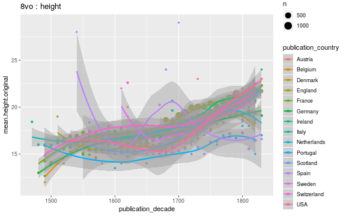
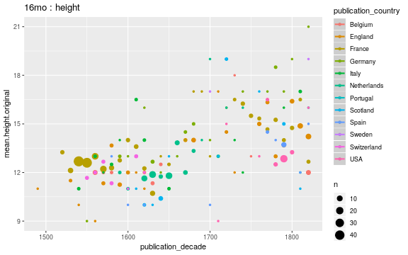
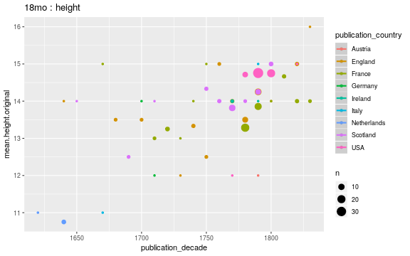

## Average document dimensions 

We have 1.53052 &times; 105 documents with publication country and original gatherings information. We have 991904 documents with original gatherings information but no publication country information.

|       | Ambiguous| Argentina| Austria| Barbados| Belgium| Canada| Copenhagen| Cuba| Czech Republic| Denmark| England| Estonia| Finland| France| Germany| Guernesey| Haiti| Hungary| India| Iraq| Ireland| Israel| Italy| Jamaica| Latvia| Lithuania| Malta| Mexico| Netherlands| Northern Ireland| Poland| Portugal| Russia| Scotland| Spain| Sweden| Switzerland| Turkey|  USA|   NA| total|
|:------|---------:|---------:|-------:|--------:|-------:|------:|----------:|----:|--------------:|-------:|-------:|-------:|-------:|------:|-------:|---------:|-----:|-------:|-----:|----:|-------:|------:|-----:|-------:|------:|---------:|-----:|------:|-----------:|----------------:|------:|--------:|------:|--------:|-----:|------:|-----------:|------:|----:|----:|-----:|
|1to    |         0|         0|       0|        0|       1|      0|          0|    0|              0|       0|     276|       0|       0|     21|       5|         0|     0|       0|     0|    0|       2|      0|     5|       0|      0|         0|     0|      0|           8|                0|      0|        0|      0|       14|    20|      0|           0|      0|    3|   21|   376|
|2long  |         0|         0|       1|        0|       0|      0|          0|    0|              0|       0|      10|       0|       0|      8|       0|         0|     0|       0|     0|    0|       0|      0|     3|       0|      0|         0|     0|      0|           0|                0|      0|        0|      0|        1|     0|      0|           0|      0|    1|    1|    25|
|2fo    |         0|         2|      23|        0|     144|      4|          1|    1|             11|      10|    3397|      11|       1|    998|     703|         0|     1|       0|     2|    0|      60|      0|  1971|       0|      1|         0|     2|      5|         296|                0|      3|       32|     10|      739|   937|     10|         272|      0|  116| 2111| 11874|
|4long  |         0|         0|       0|        0|       0|      0|          0|    0|              0|       0|       0|       0|       0|      3|       0|         0|     0|       0|     0|    0|       0|      0|     0|       0|      0|         0|     0|      0|           1|                0|      0|        0|      0|        0|     0|      0|           0|      0|    0|    2|     6|
|4to    |         0|         0|      53|        0|     145|      1|         11|    3|             17|      45|    7294|       2|       2|   5722|    1993|         0|     1|       0|     6|    0|      62|      0|  2173|       0|      0|         1|     1|      3|         941|                1|     23|      140|     48|     1249|   667|    123|         208|      0|  375| 2297| 23607|
|6to    |         0|         0|       0|        0|       0|      0|          0|    0|              0|       0|       1|       0|       0|      1|       0|         0|     0|       0|     0|    0|       0|      0|     0|       0|      0|         0|     0|      0|           1|                0|      0|        0|      0|        1|     0|      0|           0|      0|    0|    1|     5|
|8long  |         0|         0|       0|        0|       0|      0|          0|    0|              0|       0|       1|       0|       0|      1|       0|         0|     0|       0|     0|    0|       0|      0|     1|       0|      0|         0|     0|      0|           0|                0|      1|        0|      0|        0|     0|      0|           0|      0|    0|    0|     4|
|8vo    |         0|         0|     116|        1|     252|      3|          6|    0|             19|      65|   11872|       0|       3|   5474|    1946|         1|     0|       2|     4|    0|     411|      0|  1402|       1|     18|         0|     0|      1|        1118|                6|     35|       37|     35|     2178|   454|     66|         493|      1| 1908| 1527| 29455|
|12long |         0|         0|       0|        0|       0|      0|          0|    0|              0|       0|       6|       0|       0|      2|       0|         0|     0|       0|     0|    0|       0|      0|     0|       0|      0|         0|     0|      0|           0|                0|      0|        0|      0|        0|     0|      0|           0|      0|    1|    0|     9|
|12mo   |         1|         0|      12|        0|     122|     11|          1|    0|              1|       0|    3200|       0|       0|   2230|     259|         0|     0|       1|     0|    3|     237|      1|   285|       1|      0|         0|     0|      0|        1371|                7|      6|        7|      5|      704|    24|      8|          90|      0|  880|  489|  9956|
|16mo   |         0|         0|       0|        0|      27|      0|          0|    0|              0|       0|      72|       0|       1|    212|      22|         0|     0|       0|     0|    0|       0|      0|    19|       0|      1|         0|     0|      3|          72|                0|      0|        1|      0|       18|    16|      2|          17|      0|   34|  113|   630|
|18mo   |         0|         0|       1|        0|       0|      0|          0|    0|              0|       0|      41|       0|       0|     55|       2|         0|     0|       0|     0|    0|       3|      0|     2|       0|      0|         0|     0|      0|           7|                0|      0|        0|      0|       36|     0|      0|           0|      0|   66|   14|   227|
|24long |         0|         0|       0|        0|       0|      0|          0|    0|              0|       0|       1|       0|       0|      0|       0|         0|     0|       0|     0|    0|       0|      0|     0|       0|      0|         0|     0|      0|           1|                0|      0|        0|      0|        0|     0|      0|           0|      0|    0|    0|     2|
|24mo   |         0|         0|       0|        0|       3|      0|          0|    0|              0|       0|      43|       0|       0|     25|       5|         0|     0|       0|     0|    0|       0|      0|     7|       0|      0|         0|     0|      0|         116|                0|      0|        0|      0|       32|     0|      0|           0|      0|   28|   33|   292|
|32mo   |         0|         0|       0|        0|       2|      0|          0|    0|              0|       0|       4|       0|       0|      6|       2|         0|     0|       0|     0|    0|       0|      0|     0|       0|      0|         0|     0|      0|           2|                0|      1|        0|      0|        3|     0|      0|           1|      0|   32|    2|    55|
|48mo   |         0|         0|       0|        0|       0|      0|          0|    0|              0|       0|       0|       0|       0|      0|       0|         0|     0|       0|     0|    0|       0|      0|     0|       0|      0|         0|     0|      0|           0|                0|      0|        0|      0|        0|     0|      0|           0|      0|    2|    0|     2|
|64mo   |         0|         0|       0|        0|       0|      0|          0|    0|              0|       0|       0|       0|       0|      0|       0|         0|     0|       0|     0|    0|       0|      0|     0|       0|      0|         0|     0|      0|           0|                0|      0|        0|      0|        1|     0|      0|           0|      0|    0|    0|     1|

### Selected gatherings across time; by publication country

### Average document sizes 

Only cases with 2000 documents are shown:

|gatherings.original | mean.height| median.height| mean.width| median.width|     n|
|:-------------------|-----------:|-------------:|----------:|------------:|-----:|
|1to                 |    57.87187|      57.87187|  40.422102|    40.422102|   376|
|2fo                 |    32.88567|      32.88567|  23.901856|    23.901856| 11874|
|4to                 |    22.43945|      22.43945|  19.433155|    19.433155| 23607|
|8vo                 |    19.22213|      19.22213|  14.005263|    14.005263| 29455|
|12mo                |    16.06810|      16.06810|  11.185393|    11.185393|  9956|
|16mo                |    12.76429|      12.76429|   9.568965|     9.568965|   630|
|18mo                |    14.22907|      14.22907|   9.000000|     9.000000|   227|

### Average document sizes by decade and publication country

Only cases with 2000 documents are shown:

|gatherings.original |publication_country | publication_decade| mean.height| median.height| mean.width| median.width|    n|
|:-------------------|:-------------------|------------------:|-----------:|-------------:|----------:|------------:|----:|
|1to                 |Belgium             |               1610|    48.00000|      48.00000|  36.000000|    36.000000|    1|
|1to                 |England             |                  0|    31.80000|      31.80000|  24.800000|    24.800000|    5|
|1to                 |England             |                 10|    24.00000|      24.00000|  19.000000|    19.000000|    1|
|1to                 |England             |                 20|    77.20000|      77.20000|  62.400000|    62.400000|    5|
|1to                 |England             |                 30|    24.00000|      24.00000|  19.500000|    19.500000|    2|
|1to                 |England             |               1610|   215.00000|     215.00000|  42.000000|    42.000000|    1|
|1to                 |England             |               1660|    24.00000|      24.00000|  14.000000|    14.000000|    1|
|1to                 |England             |               1670|    53.50000|      53.50000|  46.500000|    46.500000|    1|
|1to                 |England             |               1680|    68.66667|      68.66667|  29.500000|    29.500000|    3|
|1to                 |England             |               1690|    54.15000|      54.15000|  43.650000|    43.650000|    2|
|1to                 |England             |               1700|    36.00000|      36.00000|  23.000000|    23.000000|    1|
|1to                 |England             |               1720|    68.20000|      68.20000|  51.250000|    51.250000|    5|
|1to                 |England             |               1730|    24.40000|      24.40000|  11.000000|    11.000000|    5|
|1to                 |England             |               1740|    38.45455|      38.45455|  21.753623|    21.753623|   69|
|1to                 |England             |               1750|    41.36957|      41.36957|  29.347826|    29.347826|   46|
|1to                 |England             |               1760|    61.10000|      61.10000|  43.800000|    43.800000|   10|
|1to                 |England             |               1770|    57.42857|      57.42857|  38.142857|    38.142857|    7|
|1to                 |England             |               1780|    68.53333|      68.53333|  51.466667|    51.466667|   15|
|1to                 |England             |               1790|    50.83333|      50.83333|  40.500000|    40.500000|    6|
|1to                 |England             |               1800|    32.73333|      32.73333|  26.800000|    26.800000|   15|
|1to                 |England             |               1810|    61.33333|      61.33333|  47.666667|    47.666667|    9|
|1to                 |England             |               1820|    35.26316|      35.26316|  28.111111|    28.111111|   19|
|1to                 |England             |                 NA|    99.39583|      99.39583|  69.645833|    69.645833|   48|
|1to                 |France              |               1700|   136.00000|     136.00000| 131.000000|   131.000000|    1|
|1to                 |France              |               1710|    61.00000|      61.00000|  44.000000|    44.000000|    1|
|1to                 |France              |               1740|   127.00000|     127.00000|  92.400000|    92.400000|    5|
|1to                 |France              |               1750|    82.00000|      82.00000|  49.000000|    49.000000|    2|
|1to                 |France              |               1760|    64.00000|      64.00000|  50.000000|    50.000000|    1|
|1to                 |France              |               1780|    90.50000|      90.50000|  55.000000|    55.000000|    2|
|1to                 |France              |               1790|    96.85714|      96.85714|  56.714286|    56.714286|    7|
|1to                 |France              |               1810|   164.00000|     164.00000| 163.000000|   163.000000|    1|
|1to                 |France              |               1820|    83.00000|      83.00000|  53.000000|    53.000000|    1|
|1to                 |Germany             |               1680|    16.00000|      16.00000|  11.000000|    11.000000|    1|
|1to                 |Germany             |               1760|    55.00000|      55.00000|  45.000000|    45.000000|    1|
|1to                 |Germany             |               1800|    87.00000|      87.00000|  55.000000|    55.000000|    1|
|1to                 |Germany             |               1810|    56.00000|      56.00000|  50.000000|    50.000000|    2|
|1to                 |Ireland             |               1780|    32.00000|      32.00000|  17.000000|    17.000000|    1|
|1to                 |Ireland             |                 NA|   240.00000|     240.00000| 186.000000|   186.000000|    1|
|1to                 |Italy               |               1530|    41.00000|      41.00000|  28.000000|    28.000000|    1|
|1to                 |Italy               |               1560|    23.00000|      23.00000|  17.000000|    17.000000|    1|
|1to                 |Italy               |               1660|    56.00000|      56.00000|  42.000000|    42.000000|    1|
|1to                 |Italy               |               1680|    28.00000|      28.00000|  21.000000|    21.000000|    1|
|1to                 |Italy               |               1710|    13.00000|      13.00000|   9.000000|     9.000000|    1|
|1to                 |Netherlands         |               1600|    41.00000|      41.00000|  35.000000|    35.000000|    1|
|1to                 |Netherlands         |               1610|    44.00000|      44.00000|  35.000000|    35.000000|    3|
|1to                 |Netherlands         |               1650|    64.00000|      64.00000|  51.000000|    51.000000|    2|
|1to                 |Netherlands         |               1670|    63.00000|      63.00000|  54.000000|    54.000000|    1|
|1to                 |Netherlands         |               1740|    54.00000|      54.00000|  40.000000|    40.000000|    1|
|1to                 |Scotland            |               1740|    31.00000|      31.00000|  19.000000|    19.000000|    1|
|1to                 |Scotland            |               1780|   118.00000|     118.00000| 102.000000|   102.000000|    1|
|1to                 |Scotland            |               1810|    42.83333|      42.83333|  29.166667|    29.166667|    6|
|1to                 |Scotland            |               1820|    44.33333|      44.33333|  33.333333|    33.333333|    6|
|1to                 |Spain               |               1540|    24.30000|      24.30000|  23.200000|    23.200000|    1|
|1to                 |Spain               |               1760|    40.33333|      40.33333|  36.200000|    36.200000|    5|
|1to                 |Spain               |               1770|    37.00000|      37.00000|  36.000000|    36.000000|    3|
|1to                 |Spain               |               1780|    42.09091|      42.09091|  36.454546|    36.454546|   11|
|1to                 |USA                 |               1750|   151.00000|     151.00000|  75.000000|    75.000000|    1|
|1to                 |USA                 |               1790|    92.40000|      92.40000|  82.600000|    82.600000|    1|
|1to                 |USA                 |               1830|    48.00000|      48.00000|  46.000000|    46.000000|    1|
|1to                 |NA                  |                  0|    60.00000|      60.00000|  47.000000|    47.000000|    1|
|1to                 |NA                  |               1650|    39.00000|      39.00000|  23.000000|    23.000000|    1|
|1to                 |NA                  |               1720|    95.00000|      95.00000|  78.000000|    78.000000|    2|
|1to                 |NA                  |               1750|    59.00000|      59.00000|  57.000000|    57.000000|    1|
|1to                 |NA                  |               1760|    51.00000|      51.00000|  34.750000|    34.750000|    4|
|1to                 |NA                  |               1770|    55.33333|      55.33333|  41.333333|    41.333333|    3|
|1to                 |NA                  |               1780|    74.66667|      74.66667|  54.666667|    54.666667|    3|
|1to                 |NA                  |               1790|    59.00000|      59.00000|  53.000000|    53.000000|    1|
|1to                 |NA                  |               1800|    14.50000|      14.50000|   9.000000|     9.000000|    1|
|1to                 |NA                  |                 NA|    52.25000|      52.25000|  46.250000|    46.250000|    4|
|2fo                 |Argentina           |               1810|    31.50000|      31.50000|        NaN|          NaN|    2|
|2fo                 |Austria             |               1470|    29.00000|      29.00000|        NaN|          NaN|    1|
|2fo                 |Austria             |               1510|    30.00000|      30.00000|        NaN|          NaN|    1|
|2fo                 |Austria             |               1540|    30.00000|      30.00000|        NaN|          NaN|    1|
|2fo                 |Austria             |               1550|    30.00000|      30.00000|        NaN|          NaN|    1|
|2fo                 |Austria             |               1560|    32.00000|      32.00000|        NaN|          NaN|    1|
|2fo                 |Austria             |               1630|    29.00000|      29.00000|        NaN|          NaN|    1|
|2fo                 |Austria             |               1660|    26.66667|      26.66667|        NaN|          NaN|    3|
|2fo                 |Austria             |               1670|    31.00000|      31.00000|        NaN|          NaN|    1|
|2fo                 |Austria             |               1680|    38.00000|      38.00000|        NaN|          NaN|    1|
|2fo                 |Austria             |               1690|    33.00000|      33.00000|        NaN|          NaN|    1|
|2fo                 |Austria             |               1710|    44.00000|      44.00000|        NaN|          NaN|    1|
|2fo                 |Austria             |               1720|    40.00000|      40.00000|        NaN|          NaN|    1|
|2fo                 |Austria             |               1730|    35.00000|      35.00000|        NaN|          NaN|    2|
|2fo                 |Austria             |               1750|    43.00000|      43.00000|        NaN|          NaN|    1|
|2fo                 |Austria             |               1760|    40.00000|      40.00000|        NaN|          NaN|    1|
|2fo                 |Austria             |               1780|    37.00000|      37.00000|        NaN|          NaN|    3|
|2fo                 |Austria             |               1790|    33.00000|      33.00000|        NaN|          NaN|    1|
|2fo                 |Austria             |                 NA|    34.00000|      34.00000|        NaN|          NaN|    1|
|2fo                 |Belgium             |               1470|    28.60000|      28.60000|        NaN|          NaN|    5|
|2fo                 |Belgium             |               1480|    28.08333|      28.08333|        NaN|          NaN|   12|
|2fo                 |Belgium             |               1530|    33.00000|      33.00000|        NaN|          NaN|    3|
|2fo                 |Belgium             |               1540|    35.33333|      35.33333|        NaN|          NaN|    3|
|2fo                 |Belgium             |               1560|    32.00000|      32.00000|  27.000000|    27.000000|    5|
|2fo                 |Belgium             |               1570|    35.75000|      35.75000|        NaN|          NaN|    4|
|2fo                 |Belgium             |               1580|    32.42857|      32.42857|        NaN|          NaN|    7|
|2fo                 |Belgium             |               1590|    38.66667|      38.66667|        NaN|          NaN|    3|
|2fo                 |Belgium             |               1600|    33.00000|      33.00000|  20.000000|    20.000000|    4|
|2fo                 |Belgium             |               1610|    36.30769|      36.30769|        NaN|          NaN|   13|
|2fo                 |Belgium             |               1620|    33.00000|      33.00000|        NaN|          NaN|    6|
|2fo                 |Belgium             |               1630|    33.83333|      33.83333|  10.666667|    10.666667|   12|
|2fo                 |Belgium             |               1640|    36.20000|      36.20000|        NaN|          NaN|    5|
|2fo                 |Belgium             |               1650|    31.33333|      31.33333|        NaN|          NaN|    3|
|2fo                 |Belgium             |               1660|    34.77778|      34.77778|        NaN|          NaN|    9|
|2fo                 |Belgium             |               1670|    33.75000|      33.75000|        NaN|          NaN|    4|
|2fo                 |Belgium             |               1680|    35.66667|      35.66667|        NaN|          NaN|    3|
|2fo                 |Belgium             |               1700|    34.20000|      34.20000|  18.500000|    18.500000|   10|
|2fo                 |Belgium             |               1710|    34.00000|      34.00000|        NaN|          NaN|    2|
|2fo                 |Belgium             |               1720|    33.66667|      33.66667|        NaN|          NaN|    6|
|2fo                 |Belgium             |               1730|    34.00000|      34.00000|        NaN|          NaN|    1|
|2fo                 |Belgium             |               1740|    38.00000|      38.00000|        NaN|          NaN|    1|
|2fo                 |Belgium             |               1750|    33.00000|      33.00000|        NaN|          NaN|    1|
|2fo                 |Belgium             |               1760|    33.50000|      33.50000|  21.000000|    21.000000|    2|
|2fo                 |Belgium             |               1780|    32.92308|      32.92308|  19.923077|    19.923077|   13|
|2fo                 |Belgium             |               1790|    35.60000|      35.60000|  24.800000|    24.800000|    5|
|2fo                 |Belgium             |                 NA|    27.50000|      27.50000|        NaN|          NaN|    2|
|2fo                 |Canada              |               1770|    34.00000|      34.00000|        NaN|          NaN|    1|
|2fo                 |Canada              |               1780|    36.66667|      36.66667|        NaN|          NaN|    3|
|2fo                 |Copenhagen          |               1790|    38.00000|      38.00000|        NaN|          NaN|    1|
|2fo                 |Cuba                |               1820|    32.00000|      32.00000|        NaN|          NaN|    1|
|2fo                 |Czech Republic      |                540|    35.00000|      35.00000|        NaN|          NaN|    1|
|2fo                 |Czech Republic      |               1530|    33.00000|      33.00000|        NaN|          NaN|    1|
|2fo                 |Czech Republic      |               1550|    33.00000|      33.00000|        NaN|          NaN|    1|
|2fo                 |Czech Republic      |               1590|    28.00000|      28.00000|        NaN|          NaN|    1|
|2fo                 |Czech Republic      |               1670|    32.00000|      32.00000|        NaN|          NaN|    1|
|2fo                 |Czech Republic      |               1680|    32.00000|      32.00000|        NaN|          NaN|    1|
|2fo                 |Czech Republic      |               1730|    33.00000|      33.00000|        NaN|          NaN|    4|
|2fo                 |Czech Republic      |               1800|    36.00000|      36.00000|        NaN|          NaN|    1|
|2fo                 |Denmark             |               1580|    38.00000|      38.00000|        NaN|          NaN|    1|
|2fo                 |Denmark             |               1620|    31.00000|      31.00000|        NaN|          NaN|    1|
|2fo                 |Denmark             |               1650|    32.00000|      32.00000|        NaN|          NaN|    2|
|2fo                 |Denmark             |               1690|    35.00000|      35.00000|        NaN|          NaN|    1|
|2fo                 |Denmark             |               1700|    34.00000|      34.00000|        NaN|          NaN|    1|
|2fo                 |Denmark             |               1730|    35.00000|      35.00000|        NaN|          NaN|    1|
|2fo                 |Denmark             |               1740|    50.00000|      50.00000|        NaN|          NaN|    2|
|2fo                 |Denmark             |               1770|    43.00000|      43.00000|        NaN|          NaN|    1|
|2fo                 |England             |                  0|    30.00000|      30.00000|        NaN|          NaN|    1|
|2fo                 |England             |                170|    37.42857|      37.42857|  48.000000|    48.000000|    7|
|2fo                 |England             |               1470|    27.00000|      27.00000|        NaN|          NaN|    2|
|2fo                 |England             |               1480|    27.50000|      27.50000|        NaN|          NaN|   14|
|2fo                 |England             |               1490|    26.85714|      26.85714|        NaN|          NaN|    7|
|2fo                 |England             |               1510|    28.00000|      28.00000|        NaN|          NaN|    2|
|2fo                 |England             |               1520|    28.83333|      28.83333|        NaN|          NaN|   12|
|2fo                 |England             |               1530|    29.80000|      29.80000|        NaN|          NaN|    5|
|2fo                 |England             |               1540|    28.53333|      28.53333|        NaN|          NaN|   15|
|2fo                 |England             |               1550|    29.38095|      29.38095|        NaN|          NaN|   21|
|2fo                 |England             |               1560|    30.20000|      30.20000|        NaN|          NaN|   20|
|2fo                 |England             |               1570|    30.75000|      30.75000|        NaN|          NaN|   36|
|2fo                 |England             |               1580|    31.43478|      31.43478|        NaN|          NaN|   23|
|2fo                 |England             |               1590|    29.44118|      29.44118|        NaN|          NaN|   34|
|2fo                 |England             |               1600|    29.94118|      29.94118|  28.000000|    28.000000|   51|
|2fo                 |England             |               1610|    31.67593|      31.67593|        NaN|          NaN|  108|
|2fo                 |England             |               1620|    30.72165|      30.72165|        NaN|          NaN|   97|
|2fo                 |England             |               1630|    30.93511|      30.93511|  32.500000|    32.500000|  131|
|2fo                 |England             |               1640|    31.72500|      31.72500|  22.333333|    22.333333|   80|
|2fo                 |England             |               1650|    30.02703|      30.02703|  21.500000|    21.500000|  148|
|2fo                 |England             |               1660|    31.50820|      31.50820|  33.500000|    33.500000|  122|
|2fo                 |England             |               1670|    33.56349|      33.56349|  29.333333|    29.333333|  252|
|2fo                 |England             |               1680|    31.44634|      31.44634|  21.555556|    21.555556|  410|
|2fo                 |England             |               1690|    33.22901|      33.22901|  20.812500|    20.812500|  131|
|2fo                 |England             |               1700|    33.32374|      33.32374|  21.666667|    21.666667|  139|
|2fo                 |England             |               1710|    32.83422|      32.83422|  21.750000|    21.750000|  187|
|2fo                 |England             |               1720|    34.12030|      34.12030|  20.500000|    20.500000|  133|
|2fo                 |England             |               1730|    36.66959|      36.66959|  24.000000|    24.000000|  171|
|2fo                 |England             |               1740|    33.32919|      33.32919|  24.000000|    24.000000|  161|
|2fo                 |England             |               1750|    34.33918|      34.33918|  18.200000|    18.200000|  171|
|2fo                 |England             |               1760|    36.44444|      36.44444|  24.571429|    24.571429|   90|
|2fo                 |England             |               1770|    35.86170|      35.86170|  21.714286|    21.714286|   94|
|2fo                 |England             |               1780|    36.88525|      36.88525|  25.333333|    25.333333|  122|
|2fo                 |England             |               1790|    35.18634|      35.18634|  23.000000|    23.000000|  161|
|2fo                 |England             |               1800|    40.60000|      40.60000|  28.793103|    28.793103|   60|
|2fo                 |England             |               1810|    34.70732|      34.70732|  20.700000|    20.700000|   41|
|2fo                 |England             |               1820|    35.42222|      35.42222|  23.916667|    23.916667|   45|
|2fo                 |England             |               1830|    34.00000|      34.00000|  21.000000|    21.000000|    1|
|2fo                 |England             |                 NA|    33.63043|      33.63043|  20.333333|    20.333333|   92|
|2fo                 |Estonia             |               1650|    28.00000|      28.00000|        NaN|          NaN|    2|
|2fo                 |Estonia             |               1670|    37.00000|      37.00000|        NaN|          NaN|    1|
|2fo                 |Estonia             |               1690|    34.00000|      34.00000|        NaN|          NaN|    3|
|2fo                 |Estonia             |               1700|    31.60000|      31.60000|        NaN|          NaN|    5|
|2fo                 |Finland             |               1710|    30.00000|      30.00000|        NaN|          NaN|    1|
|2fo                 |France              |                  0|    33.00000|      33.00000|        NaN|          NaN|    1|
|2fo                 |France              |                 10|    32.00000|      32.00000|        NaN|          NaN|    1|
|2fo                 |France              |               1460|    28.00000|      28.00000|        NaN|          NaN|    1|
|2fo                 |France              |               1470|    31.18750|      31.18750|        NaN|          NaN|   32|
|2fo                 |France              |               1480|    29.65152|      29.65152|  10.000000|    10.000000|   33|
|2fo                 |France              |               1490|    29.20312|      29.20312|        NaN|          NaN|   32|
|2fo                 |France              |               1500|    29.00000|      29.00000|        NaN|          NaN|   26|
|2fo                 |France              |               1510|    30.05263|      30.05263|  10.000000|    10.000000|   38|
|2fo                 |France              |               1520|    32.61111|      32.61111|  10.000000|    10.000000|   36|
|2fo                 |France              |               1530|    32.56818|      32.56818|        NaN|          NaN|   44|
|2fo                 |France              |               1540|    33.19565|      33.19565|        NaN|          NaN|   46|
|2fo                 |France              |               1550|    34.48148|      34.48148|        NaN|          NaN|   27|
|2fo                 |France              |               1560|    34.56250|      34.56250|        NaN|          NaN|   16|
|2fo                 |France              |               1570|    35.52632|      35.52632|        NaN|          NaN|   19|
|2fo                 |France              |               1580|    35.93103|      35.93103|        NaN|          NaN|   29|
|2fo                 |France              |               1590|    34.66667|      34.66667|        NaN|          NaN|    6|
|2fo                 |France              |               1600|    34.60000|      34.60000|  20.000000|    20.000000|   20|
|2fo                 |France              |               1610|    35.78125|      35.78125|        NaN|          NaN|   32|
|2fo                 |France              |               1620|    35.23333|      35.23333|        NaN|          NaN|   30|
|2fo                 |France              |               1630|    35.27586|      35.27586|  22.000000|    22.000000|   29|
|2fo                 |France              |               1640|    36.07317|      36.07317|        NaN|          NaN|   41|
|2fo                 |France              |               1650|    35.10811|      35.10811|        NaN|          NaN|   37|
|2fo                 |France              |               1660|    35.95556|      35.95556|  30.000000|    30.000000|   45|
|2fo                 |France              |               1670|    37.69697|      37.69697|        NaN|          NaN|   33|
|2fo                 |France              |               1680|    36.97297|      36.97297|  20.000000|    20.000000|   37|
|2fo                 |France              |               1690|    38.30435|      38.30435|        NaN|          NaN|   23|
|2fo                 |France              |               1700|    37.47619|      37.47619|        NaN|          NaN|   21|
|2fo                 |France              |               1710|    38.53846|      38.53846|  20.500000|    20.500000|   26|
|2fo                 |France              |               1720|    38.51852|      38.51852|        NaN|          NaN|   27|
|2fo                 |France              |               1730|    36.10769|      36.10769|        NaN|          NaN|   13|
|2fo                 |France              |               1740|    44.15789|      44.15789|  33.500000|    33.500000|   19|
|2fo                 |France              |               1750|    39.40000|      39.40000|        NaN|          NaN|   20|
|2fo                 |France              |               1760|    39.96154|      39.96154|  30.000000|    30.000000|   26|
|2fo                 |France              |               1770|    42.23810|      42.23810|  39.000000|    39.000000|   21|
|2fo                 |France              |               1780|    37.61905|      37.61905|  33.000000|    33.000000|   21|
|2fo                 |France              |               1790|    44.72727|      44.72727|        NaN|          NaN|   11|
|2fo                 |France              |               1800|    45.30769|      45.30769|        NaN|          NaN|   13|
|2fo                 |France              |               1810|    45.80000|      45.80000|        NaN|          NaN|   10|
|2fo                 |France              |               1820|    51.87500|      51.87500|  60.000000|    60.000000|    8|
|2fo                 |France              |               1830|    53.00000|      53.00000|        NaN|          NaN|    1|
|2fo                 |France              |               1890|    37.00000|      37.00000|        NaN|          NaN|    1|
|2fo                 |France              |                 NA|    37.39130|      37.39130|  39.000000|    39.000000|   46|
|2fo                 |Germany             |                  0|    25.20000|      25.20000|        NaN|          NaN|    1|
|2fo                 |Germany             |                 10|    30.00000|      30.00000|        NaN|          NaN|    1|
|2fo                 |Germany             |                 20|    46.00000|      46.00000|        NaN|          NaN|    1|
|2fo                 |Germany             |               1450|    32.00000|      32.00000|        NaN|          NaN|    2|
|2fo                 |Germany             |               1460|    33.50000|      33.50000|        NaN|          NaN|    2|
|2fo                 |Germany             |               1470|    32.28866|      32.28866|  39.000000|    39.000000|   97|
|2fo                 |Germany             |               1480|    29.69231|      29.69231|  23.333333|    23.333333|   65|
|2fo                 |Germany             |               1490|    31.05556|      31.05556|  20.750000|    20.750000|   36|
|2fo                 |Germany             |               1500|    30.63636|      30.63636|        NaN|          NaN|   11|
|2fo                 |Germany             |               1510|    31.00000|      31.00000|        NaN|          NaN|   16|
|2fo                 |Germany             |               1520|    31.00000|      31.00000|        NaN|          NaN|    3|
|2fo                 |Germany             |               1530|    30.63158|      30.63158|        NaN|          NaN|   19|
|2fo                 |Germany             |               1540|    31.22222|      31.22222|        NaN|          NaN|    9|
|2fo                 |Germany             |               1550|    33.16667|      33.16667|        NaN|          NaN|    6|
|2fo                 |Germany             |               1560|    31.53846|      31.53846|        NaN|          NaN|   13|
|2fo                 |Germany             |               1570|    33.64286|      33.64286|        NaN|          NaN|   14|
|2fo                 |Germany             |               1580|    36.25000|      36.25000|        NaN|          NaN|   12|
|2fo                 |Germany             |               1590|    33.70968|      33.70968|        NaN|          NaN|   31|
|2fo                 |Germany             |               1600|    34.09091|      34.09091|        NaN|          NaN|   33|
|2fo                 |Germany             |               1610|    34.46429|      34.46429|  36.000000|    36.000000|   28|
|2fo                 |Germany             |               1620|    34.52381|      34.52381|        NaN|          NaN|   21|
|2fo                 |Germany             |               1630|    34.00000|      34.00000|        NaN|          NaN|    6|
|2fo                 |Germany             |               1640|    35.75000|      35.75000|        NaN|          NaN|   12|
|2fo                 |Germany             |               1650|    34.70000|      34.70000|        NaN|          NaN|   10|
|2fo                 |Germany             |               1660|    33.72727|      33.72727|        NaN|          NaN|   11|
|2fo                 |Germany             |               1670|    34.15000|      34.15000|        NaN|          NaN|   20|
|2fo                 |Germany             |               1680|    35.36000|      35.36000|        NaN|          NaN|   25|
|2fo                 |Germany             |               1690|    35.54286|      35.54286|        NaN|          NaN|   35|
|2fo                 |Germany             |               1700|    35.15385|      35.15385|        NaN|          NaN|   13|
|2fo                 |Germany             |               1710|    35.60000|      35.60000|        NaN|          NaN|   15|
|2fo                 |Germany             |               1720|    38.55000|      38.55000|        NaN|          NaN|   20|
|2fo                 |Germany             |               1730|    36.54839|      36.54839|  22.000000|    22.000000|   31|
|2fo                 |Germany             |               1740|    38.80000|      38.80000|        NaN|          NaN|   10|
|2fo                 |Germany             |               1750|    38.25000|      38.25000|  20.000000|    20.000000|   20|
|2fo                 |Germany             |               1760|    34.66667|      34.66667|        NaN|          NaN|    3|
|2fo                 |Germany             |               1770|    38.25000|      38.25000|        NaN|          NaN|    4|
|2fo                 |Germany             |               1780|    39.80000|      39.80000|        NaN|          NaN|    5|
|2fo                 |Germany             |               1790|    34.80000|      34.80000|  21.000000|    21.000000|    5|
|2fo                 |Germany             |               1800|    36.00000|      36.00000|        NaN|          NaN|    1|
|2fo                 |Germany             |               1810|    33.75000|      33.75000|        NaN|          NaN|    4|
|2fo                 |Germany             |               1820|    42.75000|      42.75000|        NaN|          NaN|    4|
|2fo                 |Germany             |               1830|    49.50000|      49.50000|  54.000000|    54.000000|    2|
|2fo                 |Germany             |                 NA|    33.23077|      33.23077|        NaN|          NaN|   26|
|2fo                 |Haiti               |               1790|    44.00000|      44.00000|        NaN|          NaN|    1|
|2fo                 |India               |               1770|    29.00000|      29.00000|        NaN|          NaN|    1|
|2fo                 |India               |               1780|    34.00000|      34.00000|        NaN|          NaN|    1|
|2fo                 |Ireland             |               1600|    25.00000|      25.00000|        NaN|          NaN|    1|
|2fo                 |Ireland             |               1620|    30.00000|      30.00000|        NaN|          NaN|    1|
|2fo                 |Ireland             |               1630|    29.00000|      29.00000|        NaN|          NaN|    1|
|2fo                 |Ireland             |               1660|    28.00000|      28.00000|        NaN|          NaN|    1|
|2fo                 |Ireland             |               1670|    29.00000|      29.00000|        NaN|          NaN|    4|
|2fo                 |Ireland             |               1690|    38.26667|      38.26667|        NaN|          NaN|   30|
|2fo                 |Ireland             |               1700|    36.00000|      36.00000|        NaN|          NaN|    5|
|2fo                 |Ireland             |               1710|    34.00000|      34.00000|        NaN|          NaN|    1|
|2fo                 |Ireland             |               1720|    32.00000|      32.00000|  20.000000|    20.000000|    5|
|2fo                 |Ireland             |               1730|    33.50000|      33.50000|        NaN|          NaN|    2|
|2fo                 |Ireland             |               1740|    36.50000|      36.50000|        NaN|          NaN|    2|
|2fo                 |Ireland             |               1750|    59.00000|      59.00000|        NaN|          NaN|    1|
|2fo                 |Ireland             |               1770|    45.00000|      45.00000|        NaN|          NaN|    1|
|2fo                 |Ireland             |               1780|    33.00000|      33.00000|        NaN|          NaN|    1|
|2fo                 |Ireland             |               1790|    32.00000|      32.00000|        NaN|          NaN|    1|
|2fo                 |Ireland             |               1800|    34.00000|      34.00000|        NaN|          NaN|    1|
|2fo                 |Ireland             |               1810|    30.00000|      30.00000|        NaN|          NaN|    2|
|2fo                 |Italy               |                  0|    34.68571|      34.68571|        NaN|          NaN|    7|
|2fo                 |Italy               |                 10|    30.50000|      30.50000|        NaN|          NaN|    6|
|2fo                 |Italy               |                 20|    33.50000|      33.50000|  40.000000|    40.000000|    8|
|2fo                 |Italy               |               1460|    35.33333|      35.33333|        NaN|          NaN|    6|
|2fo                 |Italy               |               1470|    31.21970|      31.21970|        NaN|          NaN|  132|
|2fo                 |Italy               |               1480|    31.14179|      31.14179|  44.000000|    44.000000|  134|
|2fo                 |Italy               |               1490|    31.40957|      31.40957|        NaN|          NaN|  188|
|2fo                 |Italy               |               1500|    31.10000|      31.10000|        NaN|          NaN|   50|
|2fo                 |Italy               |               1510|    31.08696|      31.08696|        NaN|          NaN|   23|
|2fo                 |Italy               |               1520|    32.16667|      32.16667|        NaN|          NaN|   30|
|2fo                 |Italy               |               1530|    31.82353|      31.82353|        NaN|          NaN|   17|
|2fo                 |Italy               |               1540|    33.19231|      33.19231|        NaN|          NaN|   26|
|2fo                 |Italy               |               1550|    31.64516|      31.64516|        NaN|          NaN|   31|
|2fo                 |Italy               |               1560|    33.00000|      33.00000|        NaN|          NaN|   26|
|2fo                 |Italy               |               1570|    32.92308|      32.92308|        NaN|          NaN|   26|
|2fo                 |Italy               |               1580|    33.16000|      33.16000|  26.000000|    26.000000|   25|
|2fo                 |Italy               |               1590|    32.96774|      32.96774|  28.000000|    28.000000|   31|
|2fo                 |Italy               |               1600|    32.76316|      32.76316|        NaN|          NaN|   38|
|2fo                 |Italy               |               1610|    32.91176|      32.91176|  32.000000|    32.000000|   34|
|2fo                 |Italy               |               1620|    32.51163|      32.51163|        NaN|          NaN|   86|
|2fo                 |Italy               |               1630|    29.26316|      29.26316|        NaN|          NaN|   38|
|2fo                 |Italy               |               1640|    30.54545|      30.54545|        NaN|          NaN|   55|
|2fo                 |Italy               |               1650|    30.16438|      30.16438|        NaN|          NaN|   73|
|2fo                 |Italy               |               1660|    29.61000|      29.61000|        NaN|          NaN|  100|
|2fo                 |Italy               |               1670|    30.84211|      30.84211|        NaN|          NaN|   76|
|2fo                 |Italy               |               1680|    30.15000|      30.15000|        NaN|          NaN|   40|
|2fo                 |Italy               |               1690|    28.08333|      28.08333|        NaN|          NaN|  396|
|2fo                 |Italy               |               1700|    32.10000|      32.10000|        NaN|          NaN|   20|
|2fo                 |Italy               |               1710|    37.55556|      37.55556|        NaN|          NaN|    9|
|2fo                 |Italy               |               1720|    35.31579|      35.31579|        NaN|          NaN|   19|
|2fo                 |Italy               |               1730|    36.90909|      36.90909|        NaN|          NaN|   22|
|2fo                 |Italy               |               1740|    40.21739|      40.21739|  42.000000|    42.000000|   23|
|2fo                 |Italy               |               1750|    37.47619|      37.47619|  65.000000|    65.000000|   21|
|2fo                 |Italy               |               1760|    43.13571|      43.13571|  34.666667|    34.666667|   42|
|2fo                 |Italy               |               1770|    51.21053|      51.21053|  60.600000|    60.600000|   19|
|2fo                 |Italy               |               1780|    41.44444|      41.44444|  38.000000|    38.000000|    9|
|2fo                 |Italy               |               1790|    37.88889|      37.88889|  32.000000|    32.000000|    9|
|2fo                 |Italy               |               1800|    37.00000|      37.00000|        NaN|          NaN|    5|
|2fo                 |Italy               |               1810|    35.25000|      35.25000|        NaN|          NaN|    4|
|2fo                 |Italy               |               1820|    40.00000|      40.00000|  28.000000|    28.000000|    5|
|2fo                 |Italy               |                 NA|    35.19355|      35.19355|  39.500000|    39.500000|   62|
|2fo                 |Latvia              |               1790|    33.00000|      33.00000|        NaN|          NaN|    1|
|2fo                 |Malta               |               1770|    34.00000|      34.00000|        NaN|          NaN|    1|
|2fo                 |Malta               |               1790|    29.00000|      29.00000|        NaN|          NaN|    1|
|2fo                 |Mexico              |               1820|    31.00000|      31.00000|  21.333333|    21.333333|    5|
|2fo                 |Netherlands         |                170|    40.00000|      40.00000|        NaN|          NaN|    1|
|2fo                 |Netherlands         |                470|    34.00000|      34.00000|        NaN|          NaN|    1|
|2fo                 |Netherlands         |               1470|    27.66667|      27.66667|        NaN|          NaN|    6|
|2fo                 |Netherlands         |               1480|    28.20000|      28.20000|        NaN|          NaN|    5|
|2fo                 |Netherlands         |               1590|    31.00000|      31.00000|        NaN|          NaN|    1|
|2fo                 |Netherlands         |               1600|    35.25000|      35.25000|  29.000000|    29.000000|    8|
|2fo                 |Netherlands         |               1610|    34.53125|      34.53125|  18.000000|    18.000000|   16|
|2fo                 |Netherlands         |               1620|    34.22222|      34.22222|        NaN|          NaN|    9|
|2fo                 |Netherlands         |               1630|    34.13636|      34.13636|        NaN|          NaN|   22|
|2fo                 |Netherlands         |               1640|    35.25000|      35.25000|        NaN|          NaN|   16|
|2fo                 |Netherlands         |               1650|    38.75000|      38.75000|  34.000000|    34.000000|   20|
|2fo                 |Netherlands         |               1660|    38.73913|      38.73913|        NaN|          NaN|   23|
|2fo                 |Netherlands         |               1670|    38.41667|      38.41667|        NaN|          NaN|   12|
|2fo                 |Netherlands         |               1680|    38.83333|      38.83333|        NaN|          NaN|   12|
|2fo                 |Netherlands         |               1690|    36.72727|      36.72727|        NaN|          NaN|   11|
|2fo                 |Netherlands         |               1700|    38.50000|      38.50000|        NaN|          NaN|   28|
|2fo                 |Netherlands         |               1710|    42.80000|      42.80000|  45.000000|    45.000000|   15|
|2fo                 |Netherlands         |               1720|    39.61111|      39.61111|  26.000000|    26.000000|   18|
|2fo                 |Netherlands         |               1730|    41.47059|      41.47059|  25.000000|    25.000000|   34|
|2fo                 |Netherlands         |               1740|    44.85714|      44.85714|  26.000000|    26.000000|    7|
|2fo                 |Netherlands         |               1750|    39.50000|      39.50000|        NaN|          NaN|    8|
|2fo                 |Netherlands         |               1760|    40.60000|      40.60000|        NaN|          NaN|    5|
|2fo                 |Netherlands         |               1770|    39.00000|      39.00000|        NaN|          NaN|    4|
|2fo                 |Netherlands         |               1780|    43.40000|      43.40000|        NaN|          NaN|    5|
|2fo                 |Netherlands         |               1790|    56.00000|      56.00000|        NaN|          NaN|    1|
|2fo                 |Netherlands         |               1800|    35.00000|      35.00000|        NaN|          NaN|    1|
|2fo                 |Netherlands         |               1970|    47.00000|      47.00000|        NaN|          NaN|    1|
|2fo                 |Netherlands         |                 NA|    32.16667|      32.16667|        NaN|          NaN|    6|
|2fo                 |Poland              |               1600|    34.00000|      34.00000|        NaN|          NaN|    1|
|2fo                 |Poland              |               1630|    31.00000|      31.00000|        NaN|          NaN|    1|
|2fo                 |Poland              |               1650|    28.00000|      28.00000|        NaN|          NaN|    1|
|2fo                 |Portugal            |               1480|    30.00000|      30.00000|        NaN|          NaN|    1|
|2fo                 |Portugal            |               1550|    31.50000|      31.50000|        NaN|          NaN|    2|
|2fo                 |Portugal            |               1600|    27.40000|      27.40000|        NaN|          NaN|    5|
|2fo                 |Portugal            |               1610|    30.00000|      30.00000|        NaN|          NaN|    1|
|2fo                 |Portugal            |               1640|    29.00000|      29.00000|        NaN|          NaN|    2|
|2fo                 |Portugal            |               1650|    30.00000|      30.00000|        NaN|          NaN|    1|
|2fo                 |Portugal            |               1670|    29.33333|      29.33333|        NaN|          NaN|    3|
|2fo                 |Portugal            |               1680|    29.50000|      29.50000|        NaN|          NaN|    2|
|2fo                 |Portugal            |               1690|    31.00000|      31.00000|        NaN|          NaN|    1|
|2fo                 |Portugal            |               1710|    29.00000|      29.00000|        NaN|          NaN|    1|
|2fo                 |Portugal            |               1720|    33.50000|      33.50000|        NaN|          NaN|    2|
|2fo                 |Portugal            |               1740|    30.50000|      30.50000|        NaN|          NaN|    2|
|2fo                 |Portugal            |               1750|    31.00000|      31.00000|        NaN|          NaN|    2|
|2fo                 |Portugal            |               1760|    29.50000|      29.50000|        NaN|          NaN|    2|
|2fo                 |Portugal            |               1790|    30.00000|      30.00000|        NaN|          NaN|    1|
|2fo                 |Portugal            |               1800|    24.00000|      24.00000|        NaN|          NaN|    2|
|2fo                 |Portugal            |                 NA|    32.50000|      32.50000|        NaN|          NaN|    2|
|2fo                 |Russia              |               1630|    30.00000|      30.00000|        NaN|          NaN|    1|
|2fo                 |Russia              |               1750|    33.00000|      33.00000|        NaN|          NaN|    1|
|2fo                 |Russia              |               1780|    33.00000|      33.00000|        NaN|          NaN|    5|
|2fo                 |Russia              |               1800|    36.00000|      36.00000|        NaN|          NaN|    1|
|2fo                 |Russia              |               1820|    57.00000|      57.00000|        NaN|          NaN|    1|
|2fo                 |Russia              |                 NA|    33.00000|      33.00000|        NaN|          NaN|    1|
|2fo                 |Scotland            |                 10|    28.50000|      28.50000|        NaN|          NaN|    2|
|2fo                 |Scotland            |                160|    31.00000|      31.00000|        NaN|          NaN|    1|
|2fo                 |Scotland            |                170|    34.00000|      34.00000|        NaN|          NaN|    1|
|2fo                 |Scotland            |               1580|    29.00000|      29.00000|        NaN|          NaN|    1|
|2fo                 |Scotland            |               1590|    29.00000|      29.00000|        NaN|          NaN|    1|
|2fo                 |Scotland            |               1600|    27.75000|      27.75000|        NaN|          NaN|    4|
|2fo                 |Scotland            |               1610|    28.20000|      28.20000|        NaN|          NaN|    5|
|2fo                 |Scotland            |               1620|    27.60000|      27.60000|        NaN|          NaN|    5|
|2fo                 |Scotland            |               1630|    29.66667|      29.66667|        NaN|          NaN|    3|
|2fo                 |Scotland            |               1640|    29.66667|      29.66667|  28.000000|    28.000000|   15|
|2fo                 |Scotland            |               1650|    27.68421|      27.68421|        NaN|          NaN|   19|
|2fo                 |Scotland            |               1660|    27.92593|      27.92593|        NaN|          NaN|   27|
|2fo                 |Scotland            |               1670|    31.08000|      31.08000|  35.000000|    35.000000|   25|
|2fo                 |Scotland            |               1680|    31.00000|      31.00000|        NaN|          NaN|   38|
|2fo                 |Scotland            |               1690|    31.79710|      31.79710|  24.333333|    24.333333|   69|
|2fo                 |Scotland            |               1700|    31.64151|      31.64151|  18.666667|    18.666667|   53|
|2fo                 |Scotland            |               1710|    33.24138|      33.24138|  28.000000|    28.000000|   58|
|2fo                 |Scotland            |               1720|    33.75926|      33.75926|  19.000000|    19.000000|   54|
|2fo                 |Scotland            |               1730|    34.84444|      34.84444|  22.000000|    22.000000|   45|
|2fo                 |Scotland            |               1740|    36.89320|      36.89320|  21.800000|    21.800000|  206|
|2fo                 |Scotland            |               1750|    34.80000|      34.80000|        NaN|          NaN|   15|
|2fo                 |Scotland            |               1760|    38.00000|      38.00000|        NaN|          NaN|    7|
|2fo                 |Scotland            |               1770|    33.60000|      33.60000|        NaN|          NaN|    5|
|2fo                 |Scotland            |               1780|    35.15789|      35.15789|        NaN|          NaN|   19|
|2fo                 |Scotland            |               1790|    34.42857|      34.42857|        NaN|          NaN|   21|
|2fo                 |Scotland            |               1800|    34.66667|      34.66667|  19.000000|    19.000000|    3|
|2fo                 |Scotland            |               1810|    31.00000|      31.00000|        NaN|          NaN|    2|
|2fo                 |Scotland            |               1820|    42.50000|      42.50000|  38.000000|    38.000000|    6|
|2fo                 |Scotland            |                 NA|    35.86207|      35.86207|  18.000000|    18.000000|   29|
|2fo                 |Spain               |                170|    29.00000|      29.00000|        NaN|          NaN|    1|
|2fo                 |Spain               |               1480|    30.00000|      30.00000|        NaN|          NaN|    2|
|2fo                 |Spain               |               1490|    28.50000|      28.50000|        NaN|          NaN|    2|
|2fo                 |Spain               |               1500|    29.75000|      29.75000|        NaN|          NaN|    4|
|2fo                 |Spain               |               1510|    29.66667|      29.66667|        NaN|          NaN|    3|
|2fo                 |Spain               |               1520|    30.00000|      30.00000|        NaN|          NaN|    1|
|2fo                 |Spain               |               1540|    30.00000|      30.00000|        NaN|          NaN|    2|
|2fo                 |Spain               |               1550|    28.00000|      28.00000|        NaN|          NaN|    1|
|2fo                 |Spain               |               1560|    29.50000|      29.50000|        NaN|          NaN|    2|
|2fo                 |Spain               |               1570|    29.33333|      29.33333|        NaN|          NaN|    3|
|2fo                 |Spain               |               1580|    30.20000|      30.20000|        NaN|          NaN|    5|
|2fo                 |Spain               |               1590|    30.28571|      30.28571|        NaN|          NaN|   21|
|2fo                 |Spain               |               1600|    29.42857|      29.42857|        NaN|          NaN|    7|
|2fo                 |Spain               |               1610|    29.48276|      29.48276|        NaN|          NaN|   29|
|2fo                 |Spain               |               1620|    30.00000|      30.00000|        NaN|          NaN|   33|
|2fo                 |Spain               |               1630|    30.33333|      30.33333|        NaN|          NaN|    9|
|2fo                 |Spain               |               1640|    30.16667|      30.16667|        NaN|          NaN|   12|
|2fo                 |Spain               |               1650|    29.90909|      29.90909|        NaN|          NaN|   11|
|2fo                 |Spain               |               1660|    29.64286|      29.64286|        NaN|          NaN|   14|
|2fo                 |Spain               |               1670|    29.54545|      29.54545|        NaN|          NaN|   11|
|2fo                 |Spain               |               1680|    30.69231|      30.69231|  30.000000|    30.000000|   13|
|2fo                 |Spain               |               1690|    29.40000|      29.40000|        NaN|          NaN|   20|
|2fo                 |Spain               |               1700|    30.33333|      30.33333|        NaN|          NaN|   12|
|2fo                 |Spain               |               1710|    29.72727|      29.72727|        NaN|          NaN|   11|
|2fo                 |Spain               |               1720|    30.50000|      30.50000|        NaN|          NaN|   26|
|2fo                 |Spain               |               1730|    30.42857|      30.42857|        NaN|          NaN|   28|
|2fo                 |Spain               |               1740|    29.27083|      29.27083|        NaN|          NaN|   24|
|2fo                 |Spain               |               1750|    29.73333|      29.73333|        NaN|          NaN|   15|
|2fo                 |Spain               |               1760|    29.07143|      29.07143|        NaN|          NaN|   70|
|2fo                 |Spain               |               1770|    29.79487|      29.79487|  30.000000|    30.000000|   78|
|2fo                 |Spain               |               1780|    31.51456|      31.51456|  43.750000|    43.750000|  103|
|2fo                 |Spain               |               1790|    32.00000|      32.00000|  30.000000|    30.000000|   60|
|2fo                 |Spain               |               1800|    32.12857|      32.12857|  29.230769|    29.230769|   70|
|2fo                 |Spain               |               1810|    31.04545|      31.04545|  25.555556|    25.555556|  132|
|2fo                 |Spain               |               1820|    31.60920|      31.60920|  23.218182|    23.218182|   87|
|2fo                 |Spain               |                 NA|    30.93333|      30.93333|        NaN|          NaN|   15|
|2fo                 |Sweden              |               1480|    33.00000|      33.00000|        NaN|          NaN|    2|
|2fo                 |Sweden              |               1600|    30.00000|      30.00000|        NaN|          NaN|    1|
|2fo                 |Sweden              |               1610|    28.00000|      28.00000|        NaN|          NaN|    1|
|2fo                 |Sweden              |               1630|   122.50000|     122.50000|  41.500000|    41.500000|    2|
|2fo                 |Sweden              |               1690|    32.00000|      32.00000|        NaN|          NaN|    1|
|2fo                 |Sweden              |               1700|    30.00000|      30.00000|        NaN|          NaN|    1|
|2fo                 |Sweden              |               1740|    37.00000|      37.00000|        NaN|          NaN|    1|
|2fo                 |Sweden              |               1760|    34.00000|      34.00000|        NaN|          NaN|    1|
|2fo                 |Switzerland         |               1470|    31.23077|      31.23077|  32.000000|    32.000000|   13|
|2fo                 |Switzerland         |               1480|    33.66667|      33.66667|        NaN|          NaN|   18|
|2fo                 |Switzerland         |               1490|    29.81250|      29.81250|        NaN|          NaN|   16|
|2fo                 |Switzerland         |               1500|    29.66667|      29.66667|        NaN|          NaN|    3|
|2fo                 |Switzerland         |               1510|    31.50000|      31.50000|        NaN|          NaN|    6|
|2fo                 |Switzerland         |               1520|    30.60000|      30.60000|        NaN|          NaN|    5|
|2fo                 |Switzerland         |               1530|    32.03448|      32.03448|        NaN|          NaN|   29|
|2fo                 |Switzerland         |               1540|    32.47826|      32.47826|        NaN|          NaN|   23|
|2fo                 |Switzerland         |               1550|    32.92105|      32.92105|        NaN|          NaN|   38|
|2fo                 |Switzerland         |               1560|    32.95000|      32.95000|        NaN|          NaN|   20|
|2fo                 |Switzerland         |               1570|    33.83333|      33.83333|        NaN|          NaN|   18|
|2fo                 |Switzerland         |               1580|    33.53333|      33.53333|        NaN|          NaN|   15|
|2fo                 |Switzerland         |               1590|    37.28571|      37.28571|        NaN|          NaN|    7|
|2fo                 |Switzerland         |               1600|    35.70000|      35.70000|        NaN|          NaN|   10|
|2fo                 |Switzerland         |               1610|    35.85714|      35.85714|        NaN|          NaN|    7|
|2fo                 |Switzerland         |               1620|    35.00000|      35.00000|        NaN|          NaN|    3|
|2fo                 |Switzerland         |               1630|    37.00000|      37.00000|        NaN|          NaN|    2|
|2fo                 |Switzerland         |               1640|    32.50000|      32.50000|        NaN|          NaN|    2|
|2fo                 |Switzerland         |               1650|    39.66667|      39.66667|        NaN|          NaN|    3|
|2fo                 |Switzerland         |               1660|    36.00000|      36.00000|        NaN|          NaN|    5|
|2fo                 |Switzerland         |               1670|    34.00000|      34.00000|        NaN|          NaN|    1|
|2fo                 |Switzerland         |               1680|    34.50000|      34.50000|  22.000000|    22.000000|    2|
|2fo                 |Switzerland         |               1690|    40.00000|      40.00000|  34.000000|    34.000000|    2|
|2fo                 |Switzerland         |               1700|    39.00000|      39.00000|        NaN|          NaN|    1|
|2fo                 |Switzerland         |               1710|    37.00000|      37.00000|        NaN|          NaN|    1|
|2fo                 |Switzerland         |               1720|    35.00000|      35.00000|        NaN|          NaN|    1|
|2fo                 |Switzerland         |               1730|    37.83333|      37.83333|        NaN|          NaN|    6|
|2fo                 |Switzerland         |               1740|    38.00000|      38.00000|        NaN|          NaN|    2|
|2fo                 |Switzerland         |               1760|    40.00000|      40.00000|        NaN|          NaN|    1|
|2fo                 |Switzerland         |               1830|    47.00000|      47.00000|  30.000000|    30.000000|    1|
|2fo                 |Switzerland         |               1960|    35.00000|      35.00000|        NaN|          NaN|    1|
|2fo                 |Switzerland         |                 NA|    31.70000|      31.70000|        NaN|          NaN|   10|
|2fo                 |USA                 |               1490|    31.00000|      31.00000|        NaN|          NaN|    1|
|2fo                 |USA                 |               1570|    42.00000|      42.00000|        NaN|          NaN|    1|
|2fo                 |USA                 |               1620|    32.00000|      32.00000|        NaN|          NaN|    1|
|2fo                 |USA                 |               1690|    32.25000|      32.25000|        NaN|          NaN|    4|
|2fo                 |USA                 |               1700|    33.00000|      33.00000|        NaN|          NaN|    1|
|2fo                 |USA                 |               1710|    29.87500|      29.87500|        NaN|          NaN|    8|
|2fo                 |USA                 |               1720|    33.83333|      33.83333|        NaN|          NaN|    6|
|2fo                 |USA                 |               1730|    35.33333|      35.33333|        NaN|          NaN|    3|
|2fo                 |USA                 |               1740|    34.33333|      34.33333|        NaN|          NaN|    3|
|2fo                 |USA                 |               1750|    31.50000|      31.50000|        NaN|          NaN|    8|
|2fo                 |USA                 |               1760|    34.26667|      34.26667|        NaN|          NaN|   15|
|2fo                 |USA                 |               1770|    35.10000|      35.10000|  21.000000|    21.000000|   20|
|2fo                 |USA                 |               1780|    35.50000|      35.50000|        NaN|          NaN|    6|
|2fo                 |USA                 |               1790|    36.17857|      36.17857|  21.000000|    21.000000|   28|
|2fo                 |USA                 |               1800|    36.50000|      36.50000|        NaN|          NaN|    4|
|2fo                 |USA                 |               1810|    29.00000|      29.00000|  21.000000|    21.000000|    2|
|2fo                 |USA                 |               1820|    53.00000|      53.00000|        NaN|          NaN|    1|
|2fo                 |USA                 |               1830|    43.00000|      43.00000|  29.000000|    29.000000|    1|
|2fo                 |USA                 |                 NA|    42.00000|      42.00000|        NaN|          NaN|    3|
|2fo                 |NA                  |                  0|    31.20000|      31.20000|  21.666667|    21.666667|    5|
|2fo                 |NA                  |                 10|    34.91667|      34.91667|  21.000000|    21.000000|    6|
|2fo                 |NA                  |                 20|    30.50000|      30.50000|  21.000000|    21.000000|    2|
|2fo                 |NA                  |                 30|    33.00000|      33.00000|        NaN|          NaN|    1|
|2fo                 |NA                  |                160|    29.66667|      29.66667|        NaN|          NaN|    3|
|2fo                 |NA                  |                170|    36.00000|      36.00000|        NaN|          NaN|    1|
|2fo                 |NA                  |                180|    32.00000|      32.00000|        NaN|          NaN|    1|
|2fo                 |NA                  |               1210|    30.00000|      30.00000|        NaN|          NaN|    1|
|2fo                 |NA                  |               1460|    38.00000|      38.00000|        NaN|          NaN|    1|
|2fo                 |NA                  |               1470|    30.38235|      30.38235|        NaN|          NaN|   34|
|2fo                 |NA                  |               1480|    29.80952|      29.80952|  21.000000|    21.000000|   63|
|2fo                 |NA                  |               1490|    31.10345|      31.10345|        NaN|          NaN|   29|
|2fo                 |NA                  |               1500|    29.80952|      29.80952|        NaN|          NaN|   21|
|2fo                 |NA                  |               1510|    31.34146|      31.34146|        NaN|          NaN|   41|
|2fo                 |NA                  |               1520|    30.90909|      30.90909|        NaN|          NaN|   22|
|2fo                 |NA                  |               1530|    31.33333|      31.33333|        NaN|          NaN|   18|
|2fo                 |NA                  |               1540|    30.25000|      30.25000|        NaN|          NaN|   24|
|2fo                 |NA                  |               1550|    30.25000|      30.25000|        NaN|          NaN|   26|
|2fo                 |NA                  |               1560|    32.05000|      32.05000|        NaN|          NaN|   20|
|2fo                 |NA                  |               1570|    31.20000|      31.20000|        NaN|          NaN|   15|
|2fo                 |NA                  |               1580|    34.00000|      34.00000|        NaN|          NaN|   21|
|2fo                 |NA                  |               1590|    31.84000|      31.84000|  32.000000|    32.000000|   25|
|2fo                 |NA                  |               1600|    31.59375|      31.59375|        NaN|          NaN|   32|
|2fo                 |NA                  |               1610|    31.71795|      31.71795|  51.000000|    51.000000|   39|
|2fo                 |NA                  |               1620|    31.36364|      31.36364|        NaN|          NaN|   44|
|2fo                 |NA                  |               1630|    33.03226|      33.03226|        NaN|          NaN|   31|
|2fo                 |NA                  |               1640|    33.53333|      33.53333|        NaN|          NaN|   30|
|2fo                 |NA                  |               1650|    31.96296|      31.96296|        NaN|          NaN|   27|
|2fo                 |NA                  |               1660|    31.52174|      31.52174|        NaN|          NaN|   23|
|2fo                 |NA                  |               1670|    33.03571|      33.03571|  38.000000|    38.000000|   28|
|2fo                 |NA                  |               1680|    31.20690|      31.20690|        NaN|          NaN|   29|
|2fo                 |NA                  |               1690|    34.35135|      34.35135|  21.500000|    21.500000|   37|
|2fo                 |NA                  |               1700|    32.60870|      32.60870|        NaN|          NaN|   23|
|2fo                 |NA                  |               1710|    32.50000|      32.50000|        NaN|          NaN|   16|
|2fo                 |NA                  |               1720|    31.86111|      31.86111|        NaN|          NaN|   36|
|2fo                 |NA                  |               1730|    34.12500|      34.12500|  30.000000|    30.000000|   32|
|2fo                 |NA                  |               1740|    32.82500|      32.82500|  21.000000|    21.000000|   40|
|2fo                 |NA                  |               1750|    32.91667|      32.91667|  22.000000|    22.000000|   24|
|2fo                 |NA                  |               1760|    31.07143|      31.07143|  30.000000|    30.000000|   70|
|2fo                 |NA                  |               1770|    31.46429|      31.46429|  35.000000|    35.000000|   84|
|2fo                 |NA                  |               1780|    31.75000|      31.75000|  28.000000|    28.000000|   60|
|2fo                 |NA                  |               1790|    31.25735|      31.25735|  24.600000|    24.600000|   68|
|2fo                 |NA                  |               1800|    30.81967|      30.81967|  29.500000|    29.500000|  122|
|2fo                 |NA                  |               1810|    31.32653|      31.32653|  22.230769|    22.230769|   98|
|2fo                 |NA                  |               1820|    31.31966|      31.31966|  22.000000|    22.000000|  585|
|2fo                 |NA                  |               1830|    31.94286|      31.94286|  32.200000|    32.200000|   21|
|2fo                 |NA                  |                 NA|    31.48485|      31.48485|  22.166667|    22.166667|  132|
|4to                 |Austria             |               1480|    21.66667|      21.66667|        NaN|          NaN|    3|
|4to                 |Austria             |               1490|    20.00000|      20.00000|        NaN|          NaN|    1|
|4to                 |Austria             |               1500|    20.50000|      20.50000|        NaN|          NaN|    2|
|4to                 |Austria             |               1510|    21.50000|      21.50000|        NaN|          NaN|   10|
|4to                 |Austria             |               1520|    20.00000|      20.00000|        NaN|          NaN|    1|
|4to                 |Austria             |               1540|    21.00000|      21.00000|        NaN|          NaN|    1|
|4to                 |Austria             |               1550|    20.00000|      20.00000|        NaN|          NaN|    2|
|4to                 |Austria             |               1590|    20.00000|      20.00000|        NaN|          NaN|    3|
|4to                 |Austria             |               1680|    20.50000|      20.50000|        NaN|          NaN|    2|
|4to                 |Austria             |               1710|    19.00000|      19.00000|        NaN|          NaN|    1|
|4to                 |Austria             |               1720|    23.00000|      23.00000|        NaN|          NaN|    1|
|4to                 |Austria             |               1750|    22.60000|      22.60000|        NaN|          NaN|    5|
|4to                 |Austria             |               1760|    23.44444|      23.44444|        NaN|          NaN|    9|
|4to                 |Austria             |               1770|    24.00000|      24.00000|        NaN|          NaN|    1|
|4to                 |Austria             |               1780|    25.28571|      25.28571|        NaN|          NaN|    7|
|4to                 |Austria             |               1790|    27.00000|      27.00000|        NaN|          NaN|    3|
|4to                 |Austria             |                 NA|    22.00000|      22.00000|        NaN|          NaN|    1|
|4to                 |Belgium             |               1470|    20.50000|      20.50000|        NaN|          NaN|    2|
|4to                 |Belgium             |               1480|    19.91667|      19.91667|        NaN|          NaN|   12|
|4to                 |Belgium             |               1490|    18.00000|      18.00000|        NaN|          NaN|    1|
|4to                 |Belgium             |               1500|    20.00000|      20.00000|        NaN|          NaN|    1|
|4to                 |Belgium             |               1510|    21.33333|      21.33333|        NaN|          NaN|    3|
|4to                 |Belgium             |               1540|    20.50000|      20.50000|        NaN|          NaN|    2|
|4to                 |Belgium             |               1550|    29.00000|      29.00000|        NaN|          NaN|    1|
|4to                 |Belgium             |               1560|    22.22222|      22.22222|        NaN|          NaN|    9|
|4to                 |Belgium             |               1570|    24.25000|      24.25000|        NaN|          NaN|    4|
|4to                 |Belgium             |               1580|    22.46154|      22.46154|        NaN|          NaN|   13|
|4to                 |Belgium             |               1590|    23.55556|      23.55556|  15.000000|    15.000000|    9|
|4to                 |Belgium             |               1600|    22.53333|      22.53333|  16.000000|    16.000000|   15|
|4to                 |Belgium             |               1610|    22.14286|      22.14286|        NaN|          NaN|    7|
|4to                 |Belgium             |               1620|    21.55556|      21.55556|        NaN|          NaN|    9|
|4to                 |Belgium             |               1630|    20.37500|      20.37500|        NaN|          NaN|    8|
|4to                 |Belgium             |               1640|    22.00000|      22.00000|        NaN|          NaN|    5|
|4to                 |Belgium             |               1650|    23.57143|      23.57143|        NaN|          NaN|    7|
|4to                 |Belgium             |               1660|    22.42857|      22.42857|        NaN|          NaN|    7|
|4to                 |Belgium             |               1670|    24.00000|      24.00000|        NaN|          NaN|    1|
|4to                 |Belgium             |               1680|    23.50000|      23.50000|        NaN|          NaN|    6|
|4to                 |Belgium             |               1690|    25.00000|      25.00000|        NaN|          NaN|    1|
|4to                 |Belgium             |               1700|    23.25000|      23.25000|        NaN|          NaN|    4|
|4to                 |Belgium             |               1710|    22.00000|      22.00000|        NaN|          NaN|    1|
|4to                 |Belgium             |               1720|    22.25000|      22.25000|  17.000000|    17.000000|    4|
|4to                 |Belgium             |               1730|    22.00000|      22.00000|        NaN|          NaN|    1|
|4to                 |Belgium             |               1750|    21.50000|      21.50000|        NaN|          NaN|    2|
|4to                 |Belgium             |               1770|    22.00000|      22.00000|        NaN|          NaN|    2|
|4to                 |Belgium             |               1780|    27.00000|      27.00000|        NaN|          NaN|    2|
|4to                 |Belgium             |               1790|    27.00000|      27.00000|        NaN|          NaN|    1|
|4to                 |Belgium             |                 NA|    22.20000|      22.20000|        NaN|          NaN|    5|
|4to                 |Canada              |               1780|    24.00000|      24.00000|        NaN|          NaN|    1|
|4to                 |Copenhagen          |               1630|    21.00000|      21.00000|        NaN|          NaN|    1|
|4to                 |Copenhagen          |               1650|    20.00000|      20.00000|        NaN|          NaN|    1|
|4to                 |Copenhagen          |               1660|    20.50000|      20.50000|        NaN|          NaN|    2|
|4to                 |Copenhagen          |               1700|    20.00000|      20.00000|        NaN|          NaN|    2|
|4to                 |Copenhagen          |               1720|    20.00000|      20.00000|        NaN|          NaN|    1|
|4to                 |Copenhagen          |               1730|    21.00000|      21.00000|        NaN|          NaN|    2|
|4to                 |Copenhagen          |               1770|    25.00000|      25.00000|        NaN|          NaN|    1|
|4to                 |Copenhagen          |               1780|    27.00000|      27.00000|        NaN|          NaN|    1|
|4to                 |Cuba                |               1800|    20.00000|      20.00000|        NaN|          NaN|    2|
|4to                 |Cuba                |               1810|    20.00000|      20.00000|        NaN|          NaN|    1|
|4to                 |Czech Republic      |               1600|    24.00000|      24.00000|        NaN|          NaN|    1|
|4to                 |Czech Republic      |               1610|    20.80000|      20.80000|        NaN|          NaN|    5|
|4to                 |Czech Republic      |               1660|    20.00000|      20.00000|        NaN|          NaN|    2|
|4to                 |Czech Republic      |               1690|    19.00000|      19.00000|        NaN|          NaN|    1|
|4to                 |Czech Republic      |               1760|    24.00000|      24.00000|        NaN|          NaN|    2|
|4to                 |Czech Republic      |               1770|    24.00000|      24.00000|        NaN|          NaN|    2|
|4to                 |Czech Republic      |               1780|    21.00000|      21.00000|        NaN|          NaN|    1|
|4to                 |Czech Republic      |               1790|    25.00000|      25.00000|        NaN|          NaN|    1|
|4to                 |Czech Republic      |                 NA|    21.00000|      21.00000|        NaN|          NaN|    2|
|4to                 |Denmark             |               1570|    20.00000|      20.00000|        NaN|          NaN|    1|
|4to                 |Denmark             |               1590|    18.40000|      18.40000|        NaN|          NaN|    5|
|4to                 |Denmark             |               1600|    18.00000|      18.00000|        NaN|          NaN|    2|
|4to                 |Denmark             |               1630|    19.33333|      19.33333|        NaN|          NaN|    3|
|4to                 |Denmark             |               1640|    22.00000|      22.00000|        NaN|          NaN|    1|
|4to                 |Denmark             |               1650|    20.00000|      20.00000|        NaN|          NaN|    3|
|4to                 |Denmark             |               1670|    19.72500|      19.72500|        NaN|          NaN|    4|
|4to                 |Denmark             |               1680|    19.75000|      19.75000|        NaN|          NaN|    4|
|4to                 |Denmark             |               1690|    20.00000|      20.00000|        NaN|          NaN|    4|
|4to                 |Denmark             |               1700|    19.66667|      19.66667|        NaN|          NaN|    3|
|4to                 |Denmark             |               1720|    21.00000|      21.00000|        NaN|          NaN|    1|
|4to                 |Denmark             |               1730|    20.00000|      20.00000|        NaN|          NaN|    1|
|4to                 |Denmark             |               1740|    27.33333|      27.33333|  24.000000|    24.000000|    3|
|4to                 |Denmark             |               1750|    22.00000|      22.00000|        NaN|          NaN|    2|
|4to                 |Denmark             |               1770|    19.00000|      19.00000|        NaN|          NaN|    1|
|4to                 |Denmark             |               1780|    23.75000|      23.75000|        NaN|          NaN|    4|
|4to                 |Denmark             |               1790|    20.00000|      20.00000|        NaN|          NaN|    1|
|4to                 |Denmark             |               1810|    22.00000|      22.00000|        NaN|          NaN|    1|
|4to                 |Denmark             |               1830|    26.00000|      26.00000|        NaN|          NaN|    1|
|4to                 |England             |                  0|    18.75000|      18.75000|        NaN|          NaN|    4|
|4to                 |England             |                 10|    19.60000|      19.60000|  19.000000|    19.000000|    5|
|4to                 |England             |                 20|    18.28571|      18.28571|  10.000000|    10.000000|    7|
|4to                 |England             |                160|    19.66667|      19.66667|        NaN|          NaN|    6|
|4to                 |England             |                170|    29.00000|      29.00000|        NaN|          NaN|    1|
|4to                 |England             |               1490|    17.50000|      17.50000|        NaN|          NaN|    2|
|4to                 |England             |               1500|    22.00000|      22.00000|        NaN|          NaN|    1|
|4to                 |England             |               1520|    24.00000|      24.00000|        NaN|          NaN|    1|
|4to                 |England             |               1530|    22.50000|      22.50000|        NaN|          NaN|    2|
|4to                 |England             |               1540|    19.40000|      19.40000|        NaN|          NaN|    5|
|4to                 |England             |               1550|    21.18182|      21.18182|        NaN|          NaN|   11|
|4to                 |England             |               1560|    19.09524|      19.09524|        NaN|          NaN|   21|
|4to                 |England             |               1570|    19.34615|      19.34615|  17.000000|    17.000000|   52|
|4to                 |England             |               1580|    19.88571|      19.88571|        NaN|          NaN|   70|
|4to                 |England             |               1590|    19.66981|      19.66981|  14.000000|    14.000000|  106|
|4to                 |England             |               1600|    19.18405|      19.18405|  13.500000|    13.500000|  163|
|4to                 |England             |               1610|    19.61538|      19.61538|        NaN|          NaN|  195|
|4to                 |England             |               1620|    19.57672|      19.57672|        NaN|          NaN|  189|
|4to                 |England             |               1630|    19.14483|      19.14483|        NaN|          NaN|  290|
|4to                 |England             |               1640|    19.22407|      19.22407|  14.600000|    14.600000| 1234|
|4to                 |England             |               1650|    19.24586|      19.24586|  14.500000|    14.500000|  362|
|4to                 |England             |               1660|    19.80303|      19.80303|  18.666667|    18.666667|  264|
|4to                 |England             |               1670|    20.69536|      20.69536|  21.500000|    21.500000|  366|
|4to                 |England             |               1680|    20.87440|      20.87440|  16.000000|    16.000000|  621|
|4to                 |England             |               1690|    21.30684|      21.30684|  16.750000|    16.750000|  453|
|4to                 |England             |               1700|    21.21824|      21.21824|  16.333333|    16.333333|  307|
|4to                 |England             |               1710|    22.09677|      22.09677|  15.500000|    15.500000|  155|
|4to                 |England             |               1720|    23.60870|      23.60870|  17.000000|    17.000000|  115|
|4to                 |England             |               1730|    24.88158|      24.88158|  21.000000|    21.000000|  152|
|4to                 |England             |               1740|    25.11211|      25.11211|  16.000000|    16.000000|  223|
|4to                 |England             |               1750|    24.94416|      24.94416|  17.500000|    17.500000|  197|
|4to                 |England             |               1760|    25.95000|      25.95000|  20.333333|    20.333333|  220|
|4to                 |England             |               1770|    26.44928|      26.44928|  21.000000|    21.000000|  345|
|4to                 |England             |               1780|    26.98780|      26.98780|  22.625000|    22.625000|  329|
|4to                 |England             |               1790|    26.88612|      26.88612|  21.703704|    21.703704|  281|
|4to                 |England             |               1800|    26.85326|      26.85326|  21.111111|    21.111111|   92|
|4to                 |England             |               1810|    26.59649|      26.59649|  21.200000|    21.200000|   57|
|4to                 |England             |               1820|    26.28125|      26.28125|  22.750000|    22.750000|   32|
|4to                 |England             |               1830|    23.00000|      23.00000|  13.000000|    13.000000|    5|
|4to                 |England             |               1940|    20.00000|      20.00000|        NaN|          NaN|    1|
|4to                 |England             |                 NA|    21.04545|      21.04545|  18.750000|    18.750000|  352|
|4to                 |Estonia             |               1690|    22.00000|      22.00000|        NaN|          NaN|    1|
|4to                 |Estonia             |               1800|    21.00000|      21.00000|        NaN|          NaN|    1|
|4to                 |Finland             |               1670|    19.00000|      19.00000|        NaN|          NaN|    1|
|4to                 |Finland             |               1790|    21.00000|      21.00000|        NaN|          NaN|    1|
|4to                 |France              |                  0|    25.00000|      25.00000|        NaN|          NaN|    1|
|4to                 |France              |                 20|    21.00000|      21.00000|        NaN|          NaN|    1|
|4to                 |France              |                150|    23.00000|      23.00000|        NaN|          NaN|    2|
|4to                 |France              |                160|    22.83333|      22.83333|        NaN|          NaN|    6|
|4to                 |France              |                170|    27.00000|      27.00000|        NaN|          NaN|    1|
|4to                 |France              |               1090|    21.00000|      21.00000|        NaN|          NaN|    1|
|4to                 |France              |               1470|    20.57143|      20.57143|        NaN|          NaN|    7|
|4to                 |France              |               1480|    20.84000|      20.84000|        NaN|          NaN|   25|
|4to                 |France              |               1490|    20.33291|      20.33291|        NaN|          NaN|   79|
|4to                 |France              |               1500|    21.20408|      21.20408|        NaN|          NaN|   49|
|4to                 |France              |               1510|    21.97260|      21.97260|        NaN|          NaN|   73|
|4to                 |France              |               1520|    20.97059|      20.97059|  14.000000|    14.000000|   34|
|4to                 |France              |               1530|    21.67742|      21.67742|        NaN|          NaN|   31|
|4to                 |France              |               1540|    22.63492|      22.63492|        NaN|          NaN|   63|
|4to                 |France              |               1550|    23.01786|      23.01786|        NaN|          NaN|  112|
|4to                 |France              |               1560|    23.06667|      23.06667|        NaN|          NaN|   60|
|4to                 |France              |               1570|    22.65517|      22.65517|        NaN|          NaN|   29|
|4to                 |France              |               1580|    23.04348|      23.04348|        NaN|          NaN|   46|
|4to                 |France              |               1590|    23.86364|      23.86364|        NaN|          NaN|   22|
|4to                 |France              |               1600|    22.69565|      22.69565|        NaN|          NaN|   23|
|4to                 |France              |               1610|    22.65000|      22.65000|        NaN|          NaN|   40|
|4to                 |France              |               1620|    22.55263|      22.55263|        NaN|          NaN|   38|
|4to                 |France              |               1630|    22.65625|      22.65625|        NaN|          NaN|   32|
|4to                 |France              |               1640|    22.73301|      22.73301|        NaN|          NaN|  103|
|4to                 |France              |               1650|    22.75588|      22.75588|        NaN|          NaN|  102|
|4to                 |France              |               1660|    23.16418|      23.16418|        NaN|          NaN|   67|
|4to                 |France              |               1670|    24.08600|      24.08600|        NaN|          NaN|   50|
|4to                 |France              |               1680|    24.10390|      24.10390|  22.000000|    22.000000|   77|
|4to                 |France              |               1690|    23.55752|      23.55752|        NaN|          NaN|  113|
|4to                 |France              |               1700|    22.78689|      22.78689|  16.833333|    16.833333|  244|
|4to                 |France              |               1710|    23.47692|      23.47692|        NaN|          NaN|  390|
|4to                 |France              |               1720|    25.04787|      25.04787|  20.000000|    20.000000|  376|
|4to                 |France              |               1730|    23.44947|      23.44947|        NaN|          NaN|  376|
|4to                 |France              |               1740|    23.69030|      23.69030|        NaN|          NaN|  268|
|4to                 |France              |               1750|    25.48105|      25.48105|  21.000000|    21.000000|  533|
|4to                 |France              |               1760|    25.04178|      25.04178|        NaN|          NaN|  359|
|4to                 |France              |               1770|    25.85066|      25.85066|  21.800000|    21.800000| 1279|
|4to                 |France              |               1780|    25.21754|      25.21754|  21.000000|    21.000000|  285|
|4to                 |France              |               1790|    25.66292|      25.66292|  22.000000|    22.000000|   89|
|4to                 |France              |               1800|    25.79545|      25.79545|  21.500000|    21.500000|   44|
|4to                 |France              |               1810|    25.70588|      25.70588|        NaN|          NaN|   34|
|4to                 |France              |               1820|    25.58333|      25.58333|        NaN|          NaN|   24|
|4to                 |France              |               1830|    26.00000|      26.00000|        NaN|          NaN|    4|
|4to                 |France              |                 NA|    22.73077|      22.73077|        NaN|          NaN|  130|
|4to                 |Germany             |                  0|    19.00000|      19.00000|        NaN|          NaN|    1|
|4to                 |Germany             |                 10|    21.00000|      21.00000|        NaN|          NaN|    2|
|4to                 |Germany             |                 20|    23.00000|      23.00000|        NaN|          NaN|    1|
|4to                 |Germany             |                520|    21.00000|      21.00000|        NaN|          NaN|    1|
|4to                 |Germany             |               1460|    20.30000|      20.30000|        NaN|          NaN|   10|
|4to                 |Germany             |               1470|    20.68000|      20.68000|        NaN|          NaN|   50|
|4to                 |Germany             |               1480|    20.86207|      20.86207|        NaN|          NaN|   29|
|4to                 |Germany             |               1490|    20.43810|      20.43810|        NaN|          NaN|  105|
|4to                 |Germany             |               1500|    20.75610|      20.75610|        NaN|          NaN|   41|
|4to                 |Germany             |               1510|    21.00000|      21.00000|        NaN|          NaN|   31|
|4to                 |Germany             |               1520|    20.44828|      20.44828|        NaN|          NaN|   29|
|4to                 |Germany             |               1530|    20.66667|      20.66667|        NaN|          NaN|   21|
|4to                 |Germany             |               1540|    20.75000|      20.75000|        NaN|          NaN|   16|
|4to                 |Germany             |               1550|    20.17073|      20.17073|        NaN|          NaN|   41|
|4to                 |Germany             |               1560|    19.58824|      19.58824|  15.000000|    15.000000|   17|
|4to                 |Germany             |               1570|    20.64286|      20.64286|        NaN|          NaN|   14|
|4to                 |Germany             |               1580|    20.40000|      20.40000|        NaN|          NaN|   35|
|4to                 |Germany             |               1590|    21.61765|      21.61765|        NaN|          NaN|   34|
|4to                 |Germany             |               1600|    21.57143|      21.57143|        NaN|          NaN|   28|
|4to                 |Germany             |               1610|    21.11429|      21.11429|  20.000000|    20.000000|   35|
|4to                 |Germany             |               1620|    20.36585|      20.36585|        NaN|          NaN|   41|
|4to                 |Germany             |               1630|    20.42308|      20.42308|        NaN|          NaN|   26|
|4to                 |Germany             |               1640|    19.60455|      19.60455|        NaN|          NaN|   22|
|4to                 |Germany             |               1650|    20.07500|      20.07500|        NaN|          NaN|   40|
|4to                 |Germany             |               1660|    20.37736|      20.37736|        NaN|          NaN|   53|
|4to                 |Germany             |               1670|    20.16053|      20.16053|        NaN|          NaN|   76|
|4to                 |Germany             |               1680|    20.29245|      20.29245|        NaN|          NaN|  106|
|4to                 |Germany             |               1690|    20.84810|      20.84810|        NaN|          NaN|   79|
|4to                 |Germany             |               1700|    20.57303|      20.57303|        NaN|          NaN|   89|
|4to                 |Germany             |               1710|    21.03571|      21.03571|        NaN|          NaN|  112|
|4to                 |Germany             |               1720|    20.65421|      20.65421|        NaN|          NaN|  107|
|4to                 |Germany             |               1730|    21.21970|      21.21970|  17.500000|    17.500000|  132|
|4to                 |Germany             |               1740|    21.22222|      21.22222|  18.000000|    18.000000|  117|
|4to                 |Germany             |               1750|    21.49398|      21.49398|        NaN|          NaN|   83|
|4to                 |Germany             |               1760|    21.47143|      21.47143|        NaN|          NaN|   70|
|4to                 |Germany             |               1770|    22.99020|      22.99020|        NaN|          NaN|  102|
|4to                 |Germany             |               1780|    22.25000|      22.25000|        NaN|          NaN|   48|
|4to                 |Germany             |               1790|    24.33333|      24.33333|  33.250000|    33.250000|   48|
|4to                 |Germany             |               1800|    22.52941|      22.52941|   5.000000|     5.000000|   20|
|4to                 |Germany             |               1810|    24.33636|      24.33636|        NaN|          NaN|   11|
|4to                 |Germany             |               1820|    24.57143|      24.57143|  21.000000|    21.000000|   14|
|4to                 |Germany             |               1830|    22.00000|      22.00000|        NaN|          NaN|    1|
|4to                 |Germany             |                 NA|    20.94545|      20.94545|        NaN|          NaN|   55|
|4to                 |Haiti               |                 NA|    27.00000|      27.00000|        NaN|          NaN|    1|
|4to                 |India               |               1730|    24.00000|      24.00000|        NaN|          NaN|    1|
|4to                 |India               |               1780|    31.00000|      31.00000|        NaN|          NaN|    1|
|4to                 |India               |               1790|    23.00000|      23.00000|        NaN|          NaN|    2|
|4to                 |India               |               1820|    25.00000|      25.00000|        NaN|          NaN|    2|
|4to                 |Ireland             |               1630|    18.00000|      18.00000|        NaN|          NaN|    1|
|4to                 |Ireland             |               1640|    18.00000|      18.00000|        NaN|          NaN|    3|
|4to                 |Ireland             |               1650|    20.00000|      20.00000|        NaN|          NaN|    1|
|4to                 |Ireland             |               1660|    21.00000|      21.00000|        NaN|          NaN|    1|
|4to                 |Ireland             |               1670|    20.33333|      20.33333|        NaN|          NaN|    3|
|4to                 |Ireland             |               1680|    22.33333|      22.33333|        NaN|          NaN|    6|
|4to                 |Ireland             |               1690|    19.83333|      19.83333|        NaN|          NaN|    6|
|4to                 |Ireland             |               1700|    20.00000|      20.00000|        NaN|          NaN|    4|
|4to                 |Ireland             |               1710|    20.25000|      20.25000|        NaN|          NaN|    4|
|4to                 |Ireland             |               1720|    22.00000|      22.00000|        NaN|          NaN|    1|
|4to                 |Ireland             |               1730|    20.00000|      20.00000|        NaN|          NaN|    1|
|4to                 |Ireland             |               1740|    24.66667|      24.66667|        NaN|          NaN|    3|
|4to                 |Ireland             |               1750|    23.50000|      23.50000|        NaN|          NaN|    2|
|4to                 |Ireland             |               1760|    25.00000|      25.00000|        NaN|          NaN|    6|
|4to                 |Ireland             |               1770|    25.00000|      25.00000|  22.000000|    22.000000|    6|
|4to                 |Ireland             |               1780|    26.33333|      26.33333|        NaN|          NaN|    3|
|4to                 |Ireland             |               1790|    28.00000|      28.00000|        NaN|          NaN|    1|
|4to                 |Ireland             |               1800|    24.66667|      24.66667|        NaN|          NaN|    3|
|4to                 |Ireland             |               1810|    22.00000|      22.00000|        NaN|          NaN|    1|
|4to                 |Ireland             |               1830|    24.00000|      24.00000|        NaN|          NaN|    1|
|4to                 |Ireland             |                 NA|    21.00000|      21.00000|        NaN|          NaN|    5|
|4to                 |Italy               |                  0|    21.00000|      21.00000|        NaN|          NaN|    1|
|4to                 |Italy               |                 10|    21.00000|      21.00000|        NaN|          NaN|    2|
|4to                 |Italy               |                 20|    19.66667|      19.66667|        NaN|          NaN|    6|
|4to                 |Italy               |                140|    20.00000|      20.00000|        NaN|          NaN|    1|
|4to                 |Italy               |                150|    21.00000|      21.00000|        NaN|          NaN|    4|
|4to                 |Italy               |               1460|    25.33333|      25.33333|        NaN|          NaN|    3|
|4to                 |Italy               |               1470|    22.90392|      22.90392|        NaN|          NaN|  102|
|4to                 |Italy               |               1480|    20.58333|      20.58333|        NaN|          NaN|  120|
|4to                 |Italy               |               1490|    20.69128|      20.69128|        NaN|          NaN|  149|
|4to                 |Italy               |               1500|    20.82857|      20.82857|        NaN|          NaN|   35|
|4to                 |Italy               |               1510|    21.25000|      21.25000|        NaN|          NaN|   28|
|4to                 |Italy               |               1520|    21.37838|      21.37838|        NaN|          NaN|   37|
|4to                 |Italy               |               1530|    21.00000|      21.00000|        NaN|          NaN|   46|
|4to                 |Italy               |               1540|    21.12195|      21.12195|        NaN|          NaN|   41|
|4to                 |Italy               |               1550|    21.14286|      21.14286|        NaN|          NaN|   70|
|4to                 |Italy               |               1560|    21.72632|      21.72632|        NaN|          NaN|   95|
|4to                 |Italy               |               1570|    21.30137|      21.30137|        NaN|          NaN|   73|
|4to                 |Italy               |               1580|    21.67176|      21.67176|        NaN|          NaN|  131|
|4to                 |Italy               |               1590|    21.58617|      21.58617|        NaN|          NaN|   94|
|4to                 |Italy               |               1600|    22.10891|      22.10891|  15.000000|    15.000000|  101|
|4to                 |Italy               |               1610|    22.49333|      22.49333|        NaN|          NaN|   75|
|4to                 |Italy               |               1620|    22.48000|      22.48000|        NaN|          NaN|   75|
|4to                 |Italy               |               1630|    22.07407|      22.07407|        NaN|          NaN|   54|
|4to                 |Italy               |               1640|    23.25397|      23.25397|        NaN|          NaN|   63|
|4to                 |Italy               |               1650|    23.68627|      23.68627|        NaN|          NaN|   51|
|4to                 |Italy               |               1660|    23.04615|      23.04615|        NaN|          NaN|   65|
|4to                 |Italy               |               1670|    23.48333|      23.48333|        NaN|          NaN|   60|
|4to                 |Italy               |               1680|    23.19149|      23.19149|  23.000000|    23.000000|   47|
|4to                 |Italy               |               1690|    22.46154|      22.46154|        NaN|          NaN|   52|
|4to                 |Italy               |               1700|    23.08696|      23.08696|        NaN|          NaN|   23|
|4to                 |Italy               |               1710|    23.36364|      23.36364|        NaN|          NaN|   33|
|4to                 |Italy               |               1720|    23.38462|      23.38462|        NaN|          NaN|   26|
|4to                 |Italy               |               1730|    24.35135|      24.35135|  17.000000|    17.000000|   37|
|4to                 |Italy               |               1740|    25.16957|      25.16957|        NaN|          NaN|   46|
|4to                 |Italy               |               1750|    25.43729|      25.43729|        NaN|          NaN|   59|
|4to                 |Italy               |               1760|    25.15385|      25.15385|        NaN|          NaN|   39|
|4to                 |Italy               |               1770|    25.64000|      25.64000|        NaN|          NaN|   25|
|4to                 |Italy               |               1780|    26.12692|      26.12692|        NaN|          NaN|   26|
|4to                 |Italy               |               1790|    26.45000|      26.45000|        NaN|          NaN|   20|
|4to                 |Italy               |               1800|    25.76923|      25.76923|  24.000000|    24.000000|   13|
|4to                 |Italy               |               1810|    27.00000|      27.00000|        NaN|          NaN|    8|
|4to                 |Italy               |               1820|    28.83333|      28.83333|  21.000000|    21.000000|    6|
|4to                 |Italy               |                 NA|    21.54198|      21.54198|        NaN|          NaN|  131|
|4to                 |Lithuania           |               1580|    19.00000|      19.00000|        NaN|          NaN|    1|
|4to                 |Malta               |               1780|    29.00000|      29.00000|        NaN|          NaN|    1|
|4to                 |Mexico              |               1810|    22.00000|      22.00000|        NaN|          NaN|    1|
|4to                 |Mexico              |               1820|    21.00000|      21.00000|        NaN|          NaN|    2|
|4to                 |Netherlands         |                160|    20.00000|      20.00000|        NaN|          NaN|    2|
|4to                 |Netherlands         |               1480|    20.30000|      20.30000|        NaN|          NaN|   10|
|4to                 |Netherlands         |               1490|    19.38462|      19.38462|        NaN|          NaN|   13|
|4to                 |Netherlands         |               1500|    20.00000|      20.00000|        NaN|          NaN|    1|
|4to                 |Netherlands         |               1510|    22.00000|      22.00000|        NaN|          NaN|    1|
|4to                 |Netherlands         |               1580|    18.20000|      18.20000|        NaN|          NaN|    5|
|4to                 |Netherlands         |               1590|    22.16667|      22.16667|        NaN|          NaN|    6|
|4to                 |Netherlands         |               1600|    20.50000|      20.50000|        NaN|          NaN|   12|
|4to                 |Netherlands         |               1610|    20.95122|      20.95122|        NaN|          NaN|   41|
|4to                 |Netherlands         |               1620|    21.08871|      21.08871|  19.000000|    19.000000|   62|
|4to                 |Netherlands         |               1630|    20.32353|      20.32353|        NaN|          NaN|   34|
|4to                 |Netherlands         |               1640|    20.68000|      20.68000|        NaN|          NaN|   50|
|4to                 |Netherlands         |               1650|    20.79670|      20.79670|        NaN|          NaN|   91|
|4to                 |Netherlands         |               1660|    21.14035|      21.14035|        NaN|          NaN|   57|
|4to                 |Netherlands         |               1670|    21.43182|      21.43182|        NaN|          NaN|   44|
|4to                 |Netherlands         |               1680|    21.44118|      21.44118|  17.000000|    17.000000|   68|
|4to                 |Netherlands         |               1690|    21.88889|      21.88889|        NaN|          NaN|   63|
|4to                 |Netherlands         |               1700|    22.43919|      22.43919|        NaN|          NaN|   74|
|4to                 |Netherlands         |               1710|    22.50000|      22.50000|        NaN|          NaN|   42|
|4to                 |Netherlands         |               1720|    24.71795|      24.71795|        NaN|          NaN|   39|
|4to                 |Netherlands         |               1730|    24.43478|      24.43478|        NaN|          NaN|   46|
|4to                 |Netherlands         |               1740|    24.17391|      24.17391|        NaN|          NaN|   46|
|4to                 |Netherlands         |               1750|    24.05500|      24.05500|        NaN|          NaN|   40|
|4to                 |Netherlands         |               1760|    24.52000|      24.52000|        NaN|          NaN|   25|
|4to                 |Netherlands         |               1770|    25.70000|      25.70000|        NaN|          NaN|   20|
|4to                 |Netherlands         |               1780|    23.66667|      23.66667|        NaN|          NaN|   18|
|4to                 |Netherlands         |               1790|    25.33333|      25.33333|        NaN|          NaN|    6|
|4to                 |Netherlands         |               1800|    27.00000|      27.00000|        NaN|          NaN|    1|
|4to                 |Netherlands         |               1810|    21.00000|      21.00000|        NaN|          NaN|    1|
|4to                 |Netherlands         |               1820|    26.50000|      26.50000|        NaN|          NaN|    2|
|4to                 |Netherlands         |                 NA|    21.42857|      21.42857|        NaN|          NaN|   21|
|4to                 |Northern Ireland    |               1710|    19.00000|      19.00000|        NaN|          NaN|    1|
|4to                 |Poland              |               1590|    21.00000|      21.00000|        NaN|          NaN|    1|
|4to                 |Poland              |               1610|    19.50000|      19.50000|        NaN|          NaN|    2|
|4to                 |Poland              |               1640|    19.20000|      19.20000|        NaN|          NaN|    5|
|4to                 |Poland              |               1650|    21.00000|      21.00000|        NaN|          NaN|    1|
|4to                 |Poland              |               1660|    20.00000|      20.00000|        NaN|          NaN|    1|
|4to                 |Poland              |               1670|    20.00000|      20.00000|        NaN|          NaN|    1|
|4to                 |Poland              |               1690|    20.00000|      20.00000|        NaN|          NaN|    1|
|4to                 |Poland              |               1720|    22.00000|      22.00000|        NaN|          NaN|    1|
|4to                 |Poland              |               1730|    22.66667|      22.66667|        NaN|          NaN|    3|
|4to                 |Poland              |               1740|    26.00000|      26.00000|        NaN|          NaN|    2|
|4to                 |Poland              |               1750|    21.00000|      21.00000|        NaN|          NaN|    1|
|4to                 |Poland              |               1760|    21.66667|      21.66667|        NaN|          NaN|    3|
|4to                 |Poland              |               1770|    22.00000|      22.00000|        NaN|          NaN|    1|
|4to                 |Portugal            |               1540|    19.66667|      19.66667|        NaN|          NaN|    3|
|4to                 |Portugal            |               1550|    19.00000|      19.00000|        NaN|          NaN|    1|
|4to                 |Portugal            |               1570|    19.00000|      19.00000|        NaN|          NaN|    1|
|4to                 |Portugal            |               1590|    21.00000|      21.00000|        NaN|          NaN|    1|
|4to                 |Portugal            |               1610|    19.66667|      19.66667|        NaN|          NaN|    3|
|4to                 |Portugal            |               1620|    19.50000|      19.50000|        NaN|          NaN|    2|
|4to                 |Portugal            |               1630|    19.50000|      19.50000|        NaN|          NaN|    2|
|4to                 |Portugal            |               1640|    20.16667|      20.16667|        NaN|          NaN|    6|
|4to                 |Portugal            |               1650|    19.66667|      19.66667|        NaN|          NaN|    3|
|4to                 |Portugal            |               1660|    20.00000|      20.00000|        NaN|          NaN|    6|
|4to                 |Portugal            |               1670|    19.88889|      19.88889|        NaN|          NaN|    9|
|4to                 |Portugal            |               1680|    20.00000|      20.00000|        NaN|          NaN|    3|
|4to                 |Portugal            |               1690|    20.00000|      20.00000|        NaN|          NaN|    2|
|4to                 |Portugal            |               1710|    20.00000|      20.00000|        NaN|          NaN|    9|
|4to                 |Portugal            |               1720|    20.66667|      20.66667|        NaN|          NaN|    3|
|4to                 |Portugal            |               1730|    20.12500|      20.12500|        NaN|          NaN|   16|
|4to                 |Portugal            |               1740|    20.33333|      20.33333|        NaN|          NaN|    6|
|4to                 |Portugal            |               1750|    20.25000|      20.25000|        NaN|          NaN|   12|
|4to                 |Portugal            |               1760|    20.00000|      20.00000|        NaN|          NaN|    3|
|4to                 |Portugal            |               1770|    21.50000|      21.50000|        NaN|          NaN|    2|
|4to                 |Portugal            |               1780|    20.47619|      20.47619|        NaN|          NaN|   21|
|4to                 |Portugal            |               1790|    21.20000|      21.20000|        NaN|          NaN|   15|
|4to                 |Portugal            |               1800|    21.33333|      21.33333|        NaN|          NaN|    3|
|4to                 |Portugal            |               1810|    20.00000|      20.00000|        NaN|          NaN|    1|
|4to                 |Portugal            |               1820|    20.66667|      20.66667|        NaN|          NaN|    3|
|4to                 |Portugal            |                 NA|    19.00000|      19.00000|        NaN|          NaN|    4|
|4to                 |Russia              |               1700|    20.00000|      20.00000|        NaN|          NaN|    1|
|4to                 |Russia              |               1720|    21.50000|      21.50000|        NaN|          NaN|    4|
|4to                 |Russia              |               1730|    25.75000|      25.75000|        NaN|          NaN|    4|
|4to                 |Russia              |               1740|    25.00000|      25.00000|        NaN|          NaN|    4|
|4to                 |Russia              |               1750|    25.00000|      25.00000|        NaN|          NaN|    3|
|4to                 |Russia              |               1760|    25.25000|      25.25000|        NaN|          NaN|    8|
|4to                 |Russia              |               1770|    25.14286|      25.14286|        NaN|          NaN|    7|
|4to                 |Russia              |               1780|    25.85714|      25.85714|        NaN|          NaN|    7|
|4to                 |Russia              |               1790|    26.00000|      26.00000|        NaN|          NaN|    2|
|4to                 |Russia              |               1800|    27.00000|      27.00000|        NaN|          NaN|    1|
|4to                 |Russia              |               1810|    27.60000|      27.60000|  21.000000|    21.000000|    5|
|4to                 |Russia              |               1820|    27.00000|      27.00000|        NaN|          NaN|    2|
|4to                 |Scotland            |                170|    21.00000|      21.00000|        NaN|          NaN|    1|
|4to                 |Scotland            |               1500|    15.00000|      15.00000|        NaN|          NaN|    6|
|4to                 |Scotland            |               1550|    18.00000|      18.00000|        NaN|          NaN|    1|
|4to                 |Scotland            |               1560|    19.00000|      19.00000|        NaN|          NaN|    1|
|4to                 |Scotland            |               1580|    19.25000|      19.25000|        NaN|          NaN|    4|
|4to                 |Scotland            |               1590|    18.81818|      18.81818|        NaN|          NaN|   11|
|4to                 |Scotland            |               1600|    18.77778|      18.77778|        NaN|          NaN|    9|
|4to                 |Scotland            |               1610|    20.00000|      20.00000|        NaN|          NaN|   10|
|4to                 |Scotland            |               1620|    18.84615|      18.84615|        NaN|          NaN|   13|
|4to                 |Scotland            |               1630|    18.96875|      18.96875|        NaN|          NaN|   32|
|4to                 |Scotland            |               1640|    18.81651|      18.81651|        NaN|          NaN|  109|
|4to                 |Scotland            |               1650|    19.34286|      19.34286|        NaN|          NaN|   35|
|4to                 |Scotland            |               1660|    19.69565|      19.69565|        NaN|          NaN|   23|
|4to                 |Scotland            |               1670|    20.23077|      20.23077|        NaN|          NaN|   13|
|4to                 |Scotland            |               1680|    19.98182|      19.98182|        NaN|          NaN|   55|
|4to                 |Scotland            |               1690|    19.72727|      19.72727|  21.000000|    21.000000|   33|
|4to                 |Scotland            |               1700|    19.65986|      19.65986|        NaN|          NaN|  147|
|4to                 |Scotland            |               1710|    20.47059|      20.47059|  16.500000|    16.500000|   34|
|4to                 |Scotland            |               1720|    23.31250|      23.31250|        NaN|          NaN|   16|
|4to                 |Scotland            |               1730|    22.68919|      22.68919|        NaN|          NaN|   74|
|4to                 |Scotland            |               1740|    22.61446|      22.61446|  15.500000|    15.500000|   83|
|4to                 |Scotland            |               1750|    22.67925|      22.67925|  20.000000|    20.000000|   53|
|4to                 |Scotland            |               1760|    25.24370|      25.24370|  19.000000|    19.000000|  119|
|4to                 |Scotland            |               1770|    25.69811|      25.69811|  21.000000|    21.000000|   53|
|4to                 |Scotland            |               1780|    25.60714|      25.60714|  22.000000|    22.000000|   56|
|4to                 |Scotland            |               1790|    26.12081|      26.12081|        NaN|          NaN|  149|
|4to                 |Scotland            |               1800|    25.33333|      25.33333|        NaN|          NaN|   15|
|4to                 |Scotland            |               1810|    25.64000|      25.64000|        NaN|          NaN|   10|
|4to                 |Scotland            |               1820|    25.42857|      25.42857|        NaN|          NaN|   21|
|4to                 |Scotland            |               1830|    24.00000|      24.00000|        NaN|          NaN|    1|
|4to                 |Scotland            |                 NA|    22.58065|      22.58065|  18.500000|    18.500000|   62|
|4to                 |Spain               |                170|    20.00000|      20.00000|        NaN|          NaN|    1|
|4to                 |Spain               |               1490|    19.00000|      19.00000|        NaN|          NaN|    2|
|4to                 |Spain               |               1510|    20.50000|      20.50000|        NaN|          NaN|    2|
|4to                 |Spain               |               1540|    20.00000|      20.00000|        NaN|          NaN|    1|
|4to                 |Spain               |               1560|    20.25000|      20.25000|        NaN|          NaN|    2|
|4to                 |Spain               |               1570|    20.00000|      20.00000|        NaN|          NaN|    3|
|4to                 |Spain               |               1580|    20.50000|      20.50000|        NaN|          NaN|    4|
|4to                 |Spain               |               1590|    22.03333|      22.03333|        NaN|          NaN|   15|
|4to                 |Spain               |               1600|    20.16667|      20.16667|        NaN|          NaN|    6|
|4to                 |Spain               |               1610|    20.21429|      20.21429|        NaN|          NaN|    7|
|4to                 |Spain               |               1620|    20.42105|      20.42105|        NaN|          NaN|   19|
|4to                 |Spain               |               1630|    20.07143|      20.07143|        NaN|          NaN|   14|
|4to                 |Spain               |               1640|    20.55556|      20.55556|        NaN|          NaN|    9|
|4to                 |Spain               |               1650|    20.54545|      20.54545|        NaN|          NaN|   11|
|4to                 |Spain               |               1660|    21.19231|      21.19231|        NaN|          NaN|   13|
|4to                 |Spain               |               1670|    21.93750|      21.93750|        NaN|          NaN|   16|
|4to                 |Spain               |               1680|    20.50000|      20.50000|        NaN|          NaN|   10|
|4to                 |Spain               |               1690|    20.88889|      20.88889|        NaN|          NaN|    9|
|4to                 |Spain               |               1700|    20.52632|      20.52632|        NaN|          NaN|   19|
|4to                 |Spain               |               1710|    20.52381|      20.52381|        NaN|          NaN|   21|
|4to                 |Spain               |               1720|    20.12500|      20.12500|        NaN|          NaN|   24|
|4to                 |Spain               |               1730|    21.43478|      21.43478|        NaN|          NaN|   23|
|4to                 |Spain               |               1740|    20.72414|      20.72414|        NaN|          NaN|   29|
|4to                 |Spain               |               1750|    20.76000|      20.76000|        NaN|          NaN|   50|
|4to                 |Spain               |               1760|    21.44898|      21.44898|        NaN|          NaN|   49|
|4to                 |Spain               |               1770|    21.75000|      21.75000|        NaN|          NaN|   40|
|4to                 |Spain               |               1780|    22.58730|      22.58730|        NaN|          NaN|   63|
|4to                 |Spain               |               1790|    22.07692|      22.07692|        NaN|          NaN|   65|
|4to                 |Spain               |               1800|    21.54286|      21.54286|        NaN|          NaN|   35|
|4to                 |Spain               |               1810|    21.38889|      21.38889|        NaN|          NaN|   36|
|4to                 |Spain               |               1820|    21.23684|      21.23684|        NaN|          NaN|   38|
|4to                 |Spain               |               1830|    22.66667|      22.66667|        NaN|          NaN|    3|
|4to                 |Spain               |                 NA|    21.39286|      21.39286|        NaN|          NaN|   28|
|4to                 |Sweden              |               1610|    19.00000|      19.00000|        NaN|          NaN|    1|
|4to                 |Sweden              |               1620|    19.00000|      19.00000|        NaN|          NaN|    1|
|4to                 |Sweden              |               1650|    20.00000|      20.00000|        NaN|          NaN|    1|
|4to                 |Sweden              |               1670|    20.16667|      20.16667|        NaN|          NaN|    6|
|4to                 |Sweden              |               1680|    19.00000|      19.00000|        NaN|          NaN|    1|
|4to                 |Sweden              |               1700|    22.20000|      22.20000|        NaN|          NaN|    5|
|4to                 |Sweden              |               1710|    21.00000|      21.00000|        NaN|          NaN|    2|
|4to                 |Sweden              |               1720|    19.33333|      19.33333|        NaN|          NaN|    3|
|4to                 |Sweden              |               1730|    21.72727|      21.72727|        NaN|          NaN|   11|
|4to                 |Sweden              |               1740|    21.07692|      21.07692|        NaN|          NaN|   13|
|4to                 |Sweden              |               1750|    21.42857|      21.42857|        NaN|          NaN|   35|
|4to                 |Sweden              |               1760|    20.00000|      20.00000|        NaN|          NaN|    3|
|4to                 |Sweden              |               1770|    20.30000|      20.30000|        NaN|          NaN|   10|
|4to                 |Sweden              |               1780|    21.50000|      21.50000|        NaN|          NaN|   10|
|4to                 |Sweden              |               1790|    23.25000|      23.25000|        NaN|          NaN|    8|
|4to                 |Sweden              |               1800|    22.62500|      22.62500|        NaN|          NaN|    8|
|4to                 |Sweden              |               1810|    24.00000|      24.00000|        NaN|          NaN|    2|
|4to                 |Sweden              |               1820|    25.00000|      25.00000|        NaN|          NaN|    1|
|4to                 |Sweden              |                 NA|    20.00000|      20.00000|        NaN|          NaN|    2|
|4to                 |Switzerland         |               1470|    20.00000|      20.00000|        NaN|          NaN|    1|
|4to                 |Switzerland         |               1480|    19.50000|      19.50000|        NaN|          NaN|    4|
|4to                 |Switzerland         |               1490|    21.35714|      21.35714|        NaN|          NaN|   14|
|4to                 |Switzerland         |               1500|    21.75000|      21.75000|        NaN|          NaN|    4|
|4to                 |Switzerland         |               1510|    22.00000|      22.00000|        NaN|          NaN|    7|
|4to                 |Switzerland         |               1520|    20.87500|      20.87500|        NaN|          NaN|   12|
|4to                 |Switzerland         |               1530|    21.57143|      21.57143|        NaN|          NaN|   14|
|4to                 |Switzerland         |               1540|    20.20000|      20.20000|        NaN|          NaN|    5|
|4to                 |Switzerland         |               1550|    22.40000|      22.40000|        NaN|          NaN|    5|
|4to                 |Switzerland         |               1560|    23.80000|      23.80000|        NaN|          NaN|   10|
|4to                 |Switzerland         |               1570|    21.00000|      21.00000|        NaN|          NaN|    3|
|4to                 |Switzerland         |               1580|    22.07692|      22.07692|        NaN|          NaN|   13|
|4to                 |Switzerland         |               1590|    23.55556|      23.55556|        NaN|          NaN|    9|
|4to                 |Switzerland         |               1600|    23.00000|      23.00000|        NaN|          NaN|    6|
|4to                 |Switzerland         |               1610|    24.00000|      24.00000|        NaN|          NaN|    1|
|4to                 |Switzerland         |               1620|    22.66667|      22.66667|        NaN|          NaN|    6|
|4to                 |Switzerland         |               1640|    22.00000|      22.00000|        NaN|          NaN|    4|
|4to                 |Switzerland         |               1650|    23.50000|      23.50000|        NaN|          NaN|    2|
|4to                 |Switzerland         |               1660|    20.75000|      20.75000|        NaN|          NaN|    8|
|4to                 |Switzerland         |               1670|    22.25000|      22.25000|        NaN|          NaN|    4|
|4to                 |Switzerland         |               1680|    22.80000|      22.80000|        NaN|          NaN|    5|
|4to                 |Switzerland         |               1690|    24.50000|      24.50000|        NaN|          NaN|    2|
|4to                 |Switzerland         |               1700|    23.75000|      23.75000|        NaN|          NaN|    4|
|4to                 |Switzerland         |               1710|    22.50000|      22.50000|        NaN|          NaN|   10|
|4to                 |Switzerland         |               1720|    21.50000|      21.50000|        NaN|          NaN|    2|
|4to                 |Switzerland         |               1730|    22.92308|      22.92308|        NaN|          NaN|   13|
|4to                 |Switzerland         |               1740|    25.44444|      25.44444|        NaN|          NaN|    9|
|4to                 |Switzerland         |               1750|    24.25000|      24.25000|        NaN|          NaN|    4|
|4to                 |Switzerland         |               1760|    25.60000|      25.60000|        NaN|          NaN|    5|
|4to                 |Switzerland         |               1770|    25.00000|      25.00000|        NaN|          NaN|    5|
|4to                 |Switzerland         |               1780|    24.42857|      24.42857|        NaN|          NaN|    7|
|4to                 |Switzerland         |               1810|    24.50000|      24.50000|        NaN|          NaN|    2|
|4to                 |Switzerland         |               1820|    29.00000|      29.00000|        NaN|          NaN|    1|
|4to                 |Switzerland         |                 NA|    22.28571|      22.28571|        NaN|          NaN|    7|
|4to                 |USA                 |               1510|    21.33333|      21.33333|        NaN|          NaN|    3|
|4to                 |USA                 |               1520|    20.00000|      20.00000|        NaN|          NaN|    1|
|4to                 |USA                 |               1530|    20.50000|      20.50000|        NaN|          NaN|    2|
|4to                 |USA                 |               1540|    21.00000|      21.00000|        NaN|          NaN|    1|
|4to                 |USA                 |               1570|    23.75000|      23.75000|        NaN|          NaN|    4|
|4to                 |USA                 |               1580|    20.00000|      20.00000|        NaN|          NaN|    1|
|4to                 |USA                 |               1590|    20.60000|      20.60000|        NaN|          NaN|    5|
|4to                 |USA                 |               1600|    21.00000|      21.00000|        NaN|          NaN|    1|
|4to                 |USA                 |               1610|    20.60000|      20.60000|        NaN|          NaN|    5|
|4to                 |USA                 |               1620|    19.50000|      19.50000|        NaN|          NaN|    2|
|4to                 |USA                 |               1640|    21.00000|      21.00000|        NaN|          NaN|    3|
|4to                 |USA                 |               1660|    19.00000|      19.00000|        NaN|          NaN|    3|
|4to                 |USA                 |               1670|    19.55556|      19.55556|        NaN|          NaN|    9|
|4to                 |USA                 |               1680|    19.00000|      19.00000|        NaN|          NaN|    8|
|4to                 |USA                 |               1690|    19.25000|      19.25000|        NaN|          NaN|    4|
|4to                 |USA                 |               1700|    19.50000|      19.50000|        NaN|          NaN|    4|
|4to                 |USA                 |               1720|    21.40000|      21.40000|        NaN|          NaN|    5|
|4to                 |USA                 |               1730|    22.80000|      22.80000|        NaN|          NaN|    5|
|4to                 |USA                 |               1740|    27.70370|      27.70370|        NaN|          NaN|   27|
|4to                 |USA                 |               1750|    20.17241|      20.17241|        NaN|          NaN|   29|
|4to                 |USA                 |               1760|    20.16667|      20.16667|        NaN|          NaN|   30|
|4to                 |USA                 |               1770|    19.15517|      19.15517|        NaN|          NaN|   58|
|4to                 |USA                 |               1780|    19.89091|      19.89091|        NaN|          NaN|   55|
|4to                 |USA                 |               1790|    21.80460|      21.80460|        NaN|          NaN|   87|
|4to                 |USA                 |               1800|    22.33333|      22.33333|        NaN|          NaN|    6|
|4to                 |USA                 |               1810|    25.50000|      25.50000|        NaN|          NaN|    2|
|4to                 |USA                 |               1820|    23.33333|      23.33333|        NaN|          NaN|    6|
|4to                 |USA                 |               1830|    22.66667|      22.66667|        NaN|          NaN|    3|
|4to                 |USA                 |                 NA|    23.50000|      23.50000|  14.000000|    14.000000|    6|
|4to                 |NA                  |                 10|    20.50000|      20.50000|  15.000000|    15.000000|    2|
|4to                 |NA                  |                 20|    20.50000|      20.50000|        NaN|          NaN|    2|
|4to                 |NA                  |                 30|    20.00000|      20.00000|        NaN|          NaN|    1|
|4to                 |NA                  |                180|    24.00000|      24.00000|        NaN|          NaN|    2|
|4to                 |NA                  |                370|    24.00000|      24.00000|        NaN|          NaN|    1|
|4to                 |NA                  |                540|    21.00000|      21.00000|        NaN|          NaN|    1|
|4to                 |NA                  |                550|    22.00000|      22.00000|        NaN|          NaN|    1|
|4to                 |NA                  |                580|    21.00000|      21.00000|        NaN|          NaN|    1|
|4to                 |NA                  |               1470|    21.15385|      21.15385|        NaN|          NaN|   13|
|4to                 |NA                  |               1480|    20.66667|      20.66667|        NaN|          NaN|   24|
|4to                 |NA                  |               1490|    20.59649|      20.59649|        NaN|          NaN|   57|
|4to                 |NA                  |               1500|    21.25000|      21.25000|        NaN|          NaN|   48|
|4to                 |NA                  |               1510|    21.25000|      21.25000|        NaN|          NaN|   44|
|4to                 |NA                  |               1520|    21.51852|      21.51852|        NaN|          NaN|   27|
|4to                 |NA                  |               1530|    20.05556|      20.05556|        NaN|          NaN|   18|
|4to                 |NA                  |               1540|    20.12903|      20.12903|        NaN|          NaN|   31|
|4to                 |NA                  |               1550|    21.27273|      21.27273|        NaN|          NaN|   33|
|4to                 |NA                  |               1560|    21.03226|      21.03226|        NaN|          NaN|   31|
|4to                 |NA                  |               1570|    20.76000|      20.76000|        NaN|          NaN|   50|
|4to                 |NA                  |               1580|    21.28571|      21.28571|        NaN|          NaN|   77|
|4to                 |NA                  |               1590|    21.00000|      21.00000|        NaN|          NaN|   52|
|4to                 |NA                  |               1600|    21.71053|      21.71053|        NaN|          NaN|   38|
|4to                 |NA                  |               1610|    21.16667|      21.16667|        NaN|          NaN|   60|
|4to                 |NA                  |               1620|    21.41463|      21.41463|  27.000000|    27.000000|   41|
|4to                 |NA                  |               1630|    21.05814|      21.05814|        NaN|          NaN|   43|
|4to                 |NA                  |               1640|    21.73529|      21.73529|        NaN|          NaN|   34|
|4to                 |NA                  |               1650|    21.58667|      21.58667|        NaN|          NaN|   75|
|4to                 |NA                  |               1660|    20.93443|      20.93443|        NaN|          NaN|   61|
|4to                 |NA                  |               1670|    20.46667|      20.46667|        NaN|          NaN|   45|
|4to                 |NA                  |               1680|    20.82258|      20.82258|        NaN|          NaN|   62|
|4to                 |NA                  |               1690|    23.30556|      23.30556|        NaN|          NaN|  108|
|4to                 |NA                  |               1700|    23.54945|      23.54945|        NaN|          NaN|  273|
|4to                 |NA                  |               1710|    21.04730|      21.04730|        NaN|          NaN|   74|
|4to                 |NA                  |               1720|    22.54412|      22.54412|        NaN|          NaN|  136|
|4to                 |NA                  |               1730|    22.60377|      22.60377|  36.000000|    36.000000|  106|
|4to                 |NA                  |               1740|    21.30556|      21.30556|        NaN|          NaN|   36|
|4to                 |NA                  |               1750|    23.29348|      23.29348|  19.000000|    19.000000|   92|
|4to                 |NA                  |               1760|    23.41176|      23.41176|  22.000000|    22.000000|  119|
|4to                 |NA                  |               1770|    23.30769|      23.30769|        NaN|          NaN|   39|
|4to                 |NA                  |               1780|    23.77049|      23.77049|  17.333333|    17.333333|   61|
|4to                 |NA                  |               1790|    24.07692|      24.07692|  19.000000|    19.000000|   39|
|4to                 |NA                  |               1800|    22.96000|      22.96000|        NaN|          NaN|   25|
|4to                 |NA                  |               1810|    22.03704|      22.03704|        NaN|          NaN|   27|
|4to                 |NA                  |               1820|    21.23944|      21.23944|  16.571429|    16.571429|   71|
|4to                 |NA                  |               1830|    20.33333|      20.33333|        NaN|          NaN|    9|
|4to                 |NA                  |                 NA|    21.77570|      21.77570|  32.000000|    32.000000|  107|
|8vo                 |Austria             |               1550|    15.00000|      15.00000|        NaN|          NaN|    1|
|8vo                 |Austria             |               1560|    16.00000|      16.00000|        NaN|          NaN|    1|
|8vo                 |Austria             |               1620|    20.00000|      20.00000|        NaN|          NaN|    1|
|8vo                 |Austria             |               1640|    16.00000|      16.00000|        NaN|          NaN|    2|
|8vo                 |Austria             |               1660|    15.00000|      15.00000|        NaN|          NaN|    1|
|8vo                 |Austria             |               1670|    15.00000|      15.00000|        NaN|          NaN|    1|
|8vo                 |Austria             |               1720|    16.00000|      16.00000|        NaN|          NaN|    1|
|8vo                 |Austria             |               1730|    23.00000|      23.00000|        NaN|          NaN|    1|
|8vo                 |Austria             |               1740|    17.00000|      17.00000|        NaN|          NaN|    2|
|8vo                 |Austria             |               1750|    17.60000|      17.60000|        NaN|          NaN|    5|
|8vo                 |Austria             |               1760|    20.15000|      20.15000|        NaN|          NaN|   20|
|8vo                 |Austria             |               1770|    19.75263|      19.75263|        NaN|          NaN|   19|
|8vo                 |Austria             |               1780|    19.72727|      19.72727|        NaN|          NaN|   33|
|8vo                 |Austria             |               1790|    19.47059|      19.47059|        NaN|          NaN|   17|
|8vo                 |Austria             |               1800|    19.00000|      19.00000|        NaN|          NaN|    5|
|8vo                 |Austria             |               1810|    22.00000|      22.00000|        NaN|          NaN|    1|
|8vo                 |Austria             |               1820|    20.50000|      20.50000|        NaN|          NaN|    4|
|8vo                 |Austria             |                 NA|    16.00000|      16.00000|        NaN|          NaN|    1|
|8vo                 |Barbados            |               1810|    21.00000|      21.00000|        NaN|          NaN|    1|
|8vo                 |Belgium             |               1490|    12.00000|      12.00000|        NaN|          NaN|    1|
|8vo                 |Belgium             |               1520|    14.00000|      14.00000|        NaN|          NaN|    1|
|8vo                 |Belgium             |               1530|    15.66667|      15.66667|        NaN|          NaN|    6|
|8vo                 |Belgium             |               1540|    17.00000|      17.00000|        NaN|          NaN|    7|
|8vo                 |Belgium             |               1550|    16.29412|      16.29412|        NaN|          NaN|   17|
|8vo                 |Belgium             |               1560|    16.48387|      16.48387|        NaN|          NaN|   31|
|8vo                 |Belgium             |               1570|    17.37500|      17.37500|        NaN|          NaN|   16|
|8vo                 |Belgium             |               1580|    17.25000|      17.25000|  10.000000|    10.000000|   14|
|8vo                 |Belgium             |               1590|    16.70588|      16.70588|        NaN|          NaN|   17|
|8vo                 |Belgium             |               1600|    17.37500|      17.37500|        NaN|          NaN|    8|
|8vo                 |Belgium             |               1610|    17.75000|      17.75000|        NaN|          NaN|    4|
|8vo                 |Belgium             |               1620|    15.40000|      15.40000|        NaN|          NaN|    5|
|8vo                 |Belgium             |               1630|    17.33333|      17.33333|        NaN|          NaN|    3|
|8vo                 |Belgium             |               1640|    17.00000|      17.00000|        NaN|          NaN|    2|
|8vo                 |Belgium             |               1650|    17.00000|      17.00000|        NaN|          NaN|    3|
|8vo                 |Belgium             |               1660|    16.80000|      16.80000|        NaN|          NaN|    5|
|8vo                 |Belgium             |               1670|    16.87500|      16.87500|        NaN|          NaN|    8|
|8vo                 |Belgium             |               1680|    18.00000|      18.00000|        NaN|          NaN|    3|
|8vo                 |Belgium             |               1690|    17.33333|      17.33333|        NaN|          NaN|    6|
|8vo                 |Belgium             |               1700|    17.00000|      17.00000|        NaN|          NaN|    5|
|8vo                 |Belgium             |               1710|    16.62500|      16.62500|        NaN|          NaN|    8|
|8vo                 |Belgium             |               1720|    17.00000|      17.00000|        NaN|          NaN|    8|
|8vo                 |Belgium             |               1730|    16.66667|      16.66667|        NaN|          NaN|    6|
|8vo                 |Belgium             |               1740|    18.50000|      18.50000|        NaN|          NaN|    2|
|8vo                 |Belgium             |               1750|    17.66667|      17.66667|        NaN|          NaN|    3|
|8vo                 |Belgium             |               1760|    18.16667|      18.16667|        NaN|          NaN|    6|
|8vo                 |Belgium             |               1770|    19.08333|      19.08333|        NaN|          NaN|    6|
|8vo                 |Belgium             |               1780|    20.44444|      20.44444|        NaN|          NaN|   18|
|8vo                 |Belgium             |               1790|    20.61538|      20.61538|        NaN|          NaN|   13|
|8vo                 |Belgium             |               1800|    22.00000|      22.00000|        NaN|          NaN|    2|
|8vo                 |Belgium             |               1810|    21.00000|      21.00000|        NaN|          NaN|    3|
|8vo                 |Belgium             |               1820|    22.00000|      22.00000|        NaN|          NaN|    4|
|8vo                 |Belgium             |                 NA|    16.36364|      16.36364|        NaN|          NaN|   11|
|8vo                 |Canada              |               1780|    22.00000|      22.00000|        NaN|          NaN|    1|
|8vo                 |Canada              |               1790|    21.00000|      21.00000|        NaN|          NaN|    2|
|8vo                 |Copenhagen          |               1720|    18.00000|      18.00000|        NaN|          NaN|    1|
|8vo                 |Copenhagen          |               1760|    19.00000|      19.00000|        NaN|          NaN|    1|
|8vo                 |Copenhagen          |               1770|    18.00000|      18.00000|        NaN|          NaN|    1|
|8vo                 |Copenhagen          |               1780|    20.50000|      20.50000|        NaN|          NaN|    2|
|8vo                 |Copenhagen          |               1800|    21.00000|      21.00000|        NaN|          NaN|    1|
|8vo                 |Czech Republic      |               1580|    17.00000|      17.00000|        NaN|          NaN|    1|
|8vo                 |Czech Republic      |               1600|    16.00000|      16.00000|        NaN|          NaN|    1|
|8vo                 |Czech Republic      |               1610|    20.00000|      20.00000|        NaN|          NaN|    1|
|8vo                 |Czech Republic      |               1680|    16.00000|      16.00000|        NaN|          NaN|    2|
|8vo                 |Czech Republic      |               1710|    16.00000|      16.00000|        NaN|          NaN|    1|
|8vo                 |Czech Republic      |               1770|    19.25000|      19.25000|        NaN|          NaN|    4|
|8vo                 |Czech Republic      |               1780|    19.00000|      19.00000|        NaN|          NaN|    4|
|8vo                 |Czech Republic      |               1790|    19.00000|      19.00000|        NaN|          NaN|    2|
|8vo                 |Czech Republic      |               1800|    18.00000|      18.00000|        NaN|          NaN|    1|
|8vo                 |Czech Republic      |               1810|    20.50000|      20.50000|        NaN|          NaN|    2|
|8vo                 |Denmark             |               1610|    16.00000|      16.00000|        NaN|          NaN|    1|
|8vo                 |Denmark             |               1620|    16.00000|      16.00000|        NaN|          NaN|    1|
|8vo                 |Denmark             |               1660|    16.00000|      16.00000|        NaN|          NaN|    3|
|8vo                 |Denmark             |               1670|    16.00000|      16.00000|        NaN|          NaN|    1|
|8vo                 |Denmark             |               1690|    16.00000|      16.00000|        NaN|          NaN|    1|
|8vo                 |Denmark             |               1730|    17.00000|      17.00000|        NaN|          NaN|    1|
|8vo                 |Denmark             |               1740|    17.75000|      17.75000|        NaN|          NaN|    4|
|8vo                 |Denmark             |               1750|    18.50000|      18.50000|        NaN|          NaN|    4|
|8vo                 |Denmark             |               1760|    19.77778|      19.77778|        NaN|          NaN|    9|
|8vo                 |Denmark             |               1770|    18.37500|      18.37500|        NaN|          NaN|    8|
|8vo                 |Denmark             |               1780|    19.60000|      19.60000|        NaN|          NaN|   10|
|8vo                 |Denmark             |               1790|    19.07143|      19.07143|        NaN|          NaN|   14|
|8vo                 |Denmark             |               1800|    19.25000|      19.25000|        NaN|          NaN|    4|
|8vo                 |Denmark             |               1810|    18.00000|      18.00000|        NaN|          NaN|    1|
|8vo                 |Denmark             |               1820|    18.33333|      18.33333|        NaN|          NaN|    3|
|8vo                 |England             |                  0|    15.00000|      15.00000|        NaN|          NaN|    1|
|8vo                 |England             |                 20|    23.00000|      23.00000|        NaN|          NaN|    1|
|8vo                 |England             |                160|    15.00000|      15.00000|        NaN|          NaN|    1|
|8vo                 |England             |                170|    22.00000|      22.00000|        NaN|          NaN|    1|
|8vo                 |England             |               1510|    19.00000|      19.00000|        NaN|          NaN|    1|
|8vo                 |England             |               1530|    15.25000|      15.25000|        NaN|          NaN|    4|
|8vo                 |England             |               1540|    15.53846|      15.53846|        NaN|          NaN|   13|
|8vo                 |England             |               1550|    15.14286|      15.14286|        NaN|          NaN|   14|
|8vo                 |England             |               1560|    14.92857|      14.92857|  14.000000|    14.000000|   28|
|8vo                 |England             |               1570|    14.62069|      14.62069|        NaN|          NaN|   29|
|8vo                 |England             |               1580|    15.46809|      15.46809|        NaN|          NaN|   47|
|8vo                 |England             |               1590|    15.36957|      15.36957|        NaN|          NaN|   46|
|8vo                 |England             |               1600|    16.86957|      16.86957|        NaN|          NaN|   46|
|8vo                 |England             |               1610|    15.76923|      15.76923|        NaN|          NaN|   78|
|8vo                 |England             |               1620|    16.19718|      16.19718|        NaN|          NaN|   71|
|8vo                 |England             |               1630|    16.30952|      16.30952|        NaN|          NaN|   84|
|8vo                 |England             |               1640|    16.60909|      16.60909|  14.000000|    14.000000|  110|
|8vo                 |England             |               1650|    16.13725|      16.13725|  14.000000|    14.000000|  255|
|8vo                 |England             |               1660|    16.51923|      16.51923|        NaN|          NaN|  208|
|8vo                 |England             |               1670|    17.07371|      17.07371|  15.000000|    15.000000|  407|
|8vo                 |England             |               1680|    18.64963|      18.64963|        NaN|          NaN|  411|
|8vo                 |England             |               1690|    18.37621|      18.37621|  16.000000|    16.000000|  412|
|8vo                 |England             |               1700|    19.12438|      19.12438|  12.000000|    12.000000|  603|
|8vo                 |England             |               1710|    19.39679|      19.39679|  12.285714|    12.285714|  935|
|8vo                 |England             |               1720|    19.93478|      19.93478|  12.666667|    12.666667|  621|
|8vo                 |England             |               1730|    20.03451|      20.03451|  12.333333|    12.333333|  623|
|8vo                 |England             |               1740|    20.00820|      20.00820|  12.750000|    12.750000|  610|
|8vo                 |England             |               1750|    20.40254|      20.40254|  11.666667|    11.666667|  590|
|8vo                 |England             |               1760|    20.04406|      20.04406|  12.800000|    12.800000|  631|
|8vo                 |England             |               1770|    20.54962|      20.54962|  12.285714|    12.285714|  786|
|8vo                 |England             |               1780|    20.94654|      20.94654|  12.900000|    12.900000|  868|
|8vo                 |England             |               1790|    21.20095|      21.20095|  13.666667|    13.666667| 1264|
|8vo                 |England             |               1800|    21.14556|      21.14556|  13.222222|    13.222222|  529|
|8vo                 |England             |               1810|    21.38265|      21.38265|  13.366667|    13.366667|  559|
|8vo                 |England             |               1820|    21.69362|      21.69362|  13.730769|    13.730769|  470|
|8vo                 |England             |               1830|    21.74138|      21.74138|  14.000000|    14.000000|   58|
|8vo                 |England             |               1880|    27.00000|      27.00000|        NaN|          NaN|    1|
|8vo                 |England             |                 NA|    19.53618|      19.53618|  12.750000|    12.750000|  456|
|8vo                 |Finland             |               1650|    15.00000|      15.00000|        NaN|          NaN|    1|
|8vo                 |Finland             |               1790|    19.00000|      19.00000|        NaN|          NaN|    1|
|8vo                 |Finland             |                 NA|    20.00000|      20.00000|        NaN|          NaN|    1|
|8vo                 |France              |                  0|    21.00000|      21.00000|        NaN|          NaN|    2|
|8vo                 |France              |                 10|    22.00000|      22.00000|        NaN|          NaN|    1|
|8vo                 |France              |                 20|    21.00000|      21.00000|        NaN|          NaN|    1|
|8vo                 |France              |                150|    22.00000|      22.00000|        NaN|          NaN|    2|
|8vo                 |France              |                160|    17.00000|      17.00000|        NaN|          NaN|    2|
|8vo                 |France              |                170|    19.66667|      19.66667|        NaN|          NaN|    6|
|8vo                 |France              |               1480|    13.00000|      13.00000|        NaN|          NaN|    3|
|8vo                 |France              |               1490|    14.26829|      14.26829|        NaN|          NaN|   41|
|8vo                 |France              |               1500|    14.12903|      14.12903|        NaN|          NaN|   31|
|8vo                 |France              |               1510|    16.47368|      16.47368|        NaN|          NaN|   19|
|8vo                 |France              |               1520|    16.52500|      16.52500|        NaN|          NaN|   40|
|8vo                 |France              |               1530|    16.88722|      16.88722|        NaN|          NaN|  133|
|8vo                 |France              |               1540|    16.90995|      16.90995|        NaN|          NaN|  211|
|8vo                 |France              |               1550|    17.28992|      17.28992|  17.000000|    17.000000|  129|
|8vo                 |France              |               1560|    16.92857|      16.92857|        NaN|          NaN|   70|
|8vo                 |France              |               1570|    16.81013|      16.81013|        NaN|          NaN|   79|
|8vo                 |France              |               1580|    16.68696|      16.68696|  12.000000|    12.000000|  115|
|8vo                 |France              |               1590|    17.39474|      17.39474|        NaN|          NaN|   38|
|8vo                 |France              |               1600|    17.35714|      17.35714|  20.000000|    20.000000|   84|
|8vo                 |France              |               1610|    17.00838|      17.00838|        NaN|          NaN|  191|
|8vo                 |France              |               1620|    17.37143|      17.37143|        NaN|          NaN|  105|
|8vo                 |France              |               1630|    17.18987|      17.18987|        NaN|          NaN|   79|
|8vo                 |France              |               1640|    17.40741|      17.40741|        NaN|          NaN|   81|
|8vo                 |France              |               1650|    17.40278|      17.40278|        NaN|          NaN|   72|
|8vo                 |France              |               1660|    17.39286|      17.39286|        NaN|          NaN|   84|
|8vo                 |France              |               1670|    17.91429|      17.91429|        NaN|          NaN|   35|
|8vo                 |France              |               1680|    17.69565|      17.69565|  11.000000|    11.000000|   46|
|8vo                 |France              |               1690|    18.28571|      18.28571|        NaN|          NaN|   28|
|8vo                 |France              |               1700|    19.09091|      19.09091|  20.000000|    20.000000|   22|
|8vo                 |France              |               1710|    18.60000|      18.60000|  20.000000|    20.000000|   25|
|8vo                 |France              |               1720|    18.50000|      18.50000|  23.000000|    23.000000|   36|
|8vo                 |France              |               1730|    19.15854|      19.15854|  18.000000|    18.000000|   41|
|8vo                 |France              |               1740|    19.32000|      19.32000|  20.000000|    20.000000|   75|
|8vo                 |France              |               1750|    19.60000|      19.60000|  18.250000|    18.250000|   90|
|8vo                 |France              |               1760|    19.40625|      19.40625|  13.000000|    13.000000|  128|
|8vo                 |France              |               1770|    19.98174|      19.98174|  13.000000|    13.000000|  219|
|8vo                 |France              |               1780|    20.33922|      20.33922|  15.666667|    15.666667|  928|
|8vo                 |France              |               1790|    20.32706|      20.32706|  13.200000|    13.200000| 1356|
|8vo                 |France              |               1800|    21.02566|      21.02566|  14.000000|    14.000000|  226|
|8vo                 |France              |               1810|    20.83554|      20.83554|  26.000000|    26.000000|  242|
|8vo                 |France              |               1820|    21.17204|      21.17204|  19.000000|    19.000000|  186|
|8vo                 |France              |               1830|    22.09091|      22.09091|        NaN|          NaN|   22|
|8vo                 |France              |                 NA|    18.36667|      18.36667|  19.000000|    19.000000|  150|
|8vo                 |Germany             |                170|    17.00000|      17.00000|        NaN|          NaN|    1|
|8vo                 |Germany             |                510|    17.00000|      17.00000|        NaN|          NaN|    1|
|8vo                 |Germany             |               1480|    13.00000|      13.00000|        NaN|          NaN|    1|
|8vo                 |Germany             |               1490|    12.66667|      12.66667|        NaN|          NaN|    3|
|8vo                 |Germany             |               1500|    14.00000|      14.00000|        NaN|          NaN|    6|
|8vo                 |Germany             |               1510|    14.00000|      14.00000|        NaN|          NaN|    1|
|8vo                 |Germany             |               1520|    15.52941|      15.52941|        NaN|          NaN|   17|
|8vo                 |Germany             |               1530|    15.93750|      15.93750|        NaN|          NaN|   32|
|8vo                 |Germany             |               1540|    15.51351|      15.51351|        NaN|          NaN|   37|
|8vo                 |Germany             |               1550|    14.95455|      14.95455|        NaN|          NaN|   22|
|8vo                 |Germany             |               1560|    15.46667|      15.46667|        NaN|          NaN|   60|
|8vo                 |Germany             |               1570|    15.48837|      15.48837|        NaN|          NaN|   43|
|8vo                 |Germany             |               1580|    16.48780|      16.48780|  11.000000|    11.000000|   41|
|8vo                 |Germany             |               1590|    17.06250|      17.06250|  10.000000|    10.000000|   64|
|8vo                 |Germany             |               1600|    17.41667|      17.41667|        NaN|          NaN|   36|
|8vo                 |Germany             |               1610|    16.35849|      16.35849|        NaN|          NaN|   53|
|8vo                 |Germany             |               1620|    16.89474|      16.89474|        NaN|          NaN|   19|
|8vo                 |Germany             |               1630|    16.00000|      16.00000|        NaN|          NaN|   17|
|8vo                 |Germany             |               1640|    16.52381|      16.52381|  10.000000|    10.000000|   21|
|8vo                 |Germany             |               1650|    16.50000|      16.50000|  10.000000|    10.000000|   26|
|8vo                 |Germany             |               1660|    16.81786|      16.81786|        NaN|          NaN|   28|
|8vo                 |Germany             |               1670|    17.12500|      17.12500|  15.000000|    15.000000|   40|
|8vo                 |Germany             |               1680|    17.26190|      17.26190|        NaN|          NaN|   42|
|8vo                 |Germany             |               1690|    17.07937|      17.07937|        NaN|          NaN|   63|
|8vo                 |Germany             |               1700|    17.32295|      17.32295|        NaN|          NaN|   61|
|8vo                 |Germany             |               1710|    17.29286|      17.29286|        NaN|          NaN|   70|
|8vo                 |Germany             |               1720|    17.88889|      17.88889|        NaN|          NaN|   45|
|8vo                 |Germany             |               1730|    17.86786|      17.86786|        NaN|          NaN|   56|
|8vo                 |Germany             |               1740|    18.34328|      18.34328|        NaN|          NaN|   67|
|8vo                 |Germany             |               1750|    18.63636|      18.63636|        NaN|          NaN|   66|
|8vo                 |Germany             |               1760|    18.72857|      18.72857|  12.000000|    12.000000|   77|
|8vo                 |Germany             |               1770|    18.98162|      18.98162|        NaN|          NaN|  136|
|8vo                 |Germany             |               1780|    19.22535|      19.22535|        NaN|          NaN|  213|
|8vo                 |Germany             |               1790|    19.32636|      19.32636|  12.000000|    12.000000|  239|
|8vo                 |Germany             |               1800|    19.26190|      19.26190|        NaN|          NaN|   84|
|8vo                 |Germany             |               1810|    19.53636|      19.53636|        NaN|          NaN|   55|
|8vo                 |Germany             |               1820|    19.67500|      19.67500|        NaN|          NaN|   40|
|8vo                 |Germany             |               1830|    19.10000|      19.10000|        NaN|          NaN|   10|
|8vo                 |Germany             |                 NA|    17.30189|      17.30189|        NaN|          NaN|   53|
|8vo                 |Guernesey           |               1800|    19.00000|      19.00000|        NaN|          NaN|    1|
|8vo                 |Hungary             |               1780|    23.00000|      23.00000|        NaN|          NaN|    1|
|8vo                 |Hungary             |               1800|    20.00000|      20.00000|        NaN|          NaN|    1|
|8vo                 |India               |               1720|    19.00000|      19.00000|        NaN|          NaN|    1|
|8vo                 |India               |               1790|    21.00000|      21.00000|        NaN|          NaN|    1|
|8vo                 |India               |               1800|    21.50000|      21.50000|        NaN|          NaN|    2|
|8vo                 |Ireland             |               1670|    17.00000|      17.00000|        NaN|          NaN|    1|
|8vo                 |Ireland             |               1680|    15.00000|      15.00000|        NaN|          NaN|    1|
|8vo                 |Ireland             |               1690|    20.66667|      20.66667|        NaN|          NaN|    3|
|8vo                 |Ireland             |               1700|    18.25000|      18.25000|        NaN|          NaN|    4|
|8vo                 |Ireland             |               1710|    18.16667|      18.16667|        NaN|          NaN|    6|
|8vo                 |Ireland             |               1720|    17.93750|      17.93750|  12.000000|    12.000000|   16|
|8vo                 |Ireland             |               1730|    18.53125|      18.53125|        NaN|          NaN|   32|
|8vo                 |Ireland             |               1740|    20.21429|      20.21429|        NaN|          NaN|   42|
|8vo                 |Ireland             |               1750|    20.43478|      20.43478|  12.500000|    12.500000|   46|
|8vo                 |Ireland             |               1760|    20.04545|      20.04545|  13.000000|    13.000000|   22|
|8vo                 |Ireland             |               1770|    20.60526|      20.60526|  14.000000|    14.000000|   38|
|8vo                 |Ireland             |               1780|    20.82456|      20.82456|  13.800000|    13.800000|   57|
|8vo                 |Ireland             |               1790|    21.48864|      21.48864|  13.500000|    13.500000|   88|
|8vo                 |Ireland             |               1800|    21.30000|      21.30000|        NaN|          NaN|   10|
|8vo                 |Ireland             |               1810|    20.00000|      20.00000|  13.000000|    13.000000|   14|
|8vo                 |Ireland             |               1820|    21.42857|      21.42857|  13.000000|    13.000000|   14|
|8vo                 |Ireland             |                 NA|    18.52941|      18.52941|        NaN|          NaN|   17|
|8vo                 |Italy               |                  0|    15.50000|      15.50000|        NaN|          NaN|    2|
|8vo                 |Italy               |                 10|    15.25000|      15.25000|        NaN|          NaN|    4|
|8vo                 |Italy               |                 20|    15.75000|      15.75000|        NaN|          NaN|    4|
|8vo                 |Italy               |                150|    15.00000|      15.00000|        NaN|          NaN|    1|
|8vo                 |Italy               |                160|    17.50000|      17.50000|        NaN|          NaN|    2|
|8vo                 |Italy               |               1470|    18.42857|      18.42857|        NaN|          NaN|    7|
|8vo                 |Italy               |               1480|    16.00000|      16.00000|        NaN|          NaN|    9|
|8vo                 |Italy               |               1490|    15.93548|      15.93548|        NaN|          NaN|   31|
|8vo                 |Italy               |               1500|    15.91667|      15.91667|        NaN|          NaN|   36|
|8vo                 |Italy               |               1510|    16.20690|      16.20690|        NaN|          NaN|   29|
|8vo                 |Italy               |               1520|    16.64286|      16.64286|        NaN|          NaN|   28|
|8vo                 |Italy               |               1530|    15.73563|      15.73563|        NaN|          NaN|   87|
|8vo                 |Italy               |               1540|    16.10909|      16.10909|  15.000000|    15.000000|  110|
|8vo                 |Italy               |               1550|    16.04082|      16.04082|        NaN|          NaN|   98|
|8vo                 |Italy               |               1560|    16.41818|      16.41818|  11.000000|    11.000000|   55|
|8vo                 |Italy               |               1570|    16.29630|      16.29630|        NaN|          NaN|   27|
|8vo                 |Italy               |               1580|    16.60294|      16.60294|        NaN|          NaN|   68|
|8vo                 |Italy               |               1590|    16.73529|      16.73529|  16.000000|    16.000000|   34|
|8vo                 |Italy               |               1600|    16.83333|      16.83333|        NaN|          NaN|   36|
|8vo                 |Italy               |               1610|    17.76667|      17.76667|  19.500000|    19.500000|   30|
|8vo                 |Italy               |               1620|    16.82609|      16.82609|        NaN|          NaN|   23|
|8vo                 |Italy               |               1630|    16.45455|      16.45455|        NaN|          NaN|   11|
|8vo                 |Italy               |               1640|    17.42857|      17.42857|  15.000000|    15.000000|   14|
|8vo                 |Italy               |               1650|    16.50000|      16.50000|        NaN|          NaN|   14|
|8vo                 |Italy               |               1660|    17.09130|      17.09130|        NaN|          NaN|   23|
|8vo                 |Italy               |               1670|    16.72727|      16.72727|        NaN|          NaN|   11|
|8vo                 |Italy               |               1680|    17.03846|      17.03846|        NaN|          NaN|   13|
|8vo                 |Italy               |               1690|    19.64286|      19.64286|        NaN|          NaN|   14|
|8vo                 |Italy               |               1700|    16.33333|      16.33333|        NaN|          NaN|    6|
|8vo                 |Italy               |               1710|    17.91667|      17.91667|        NaN|          NaN|   12|
|8vo                 |Italy               |               1720|    17.66667|      17.66667|        NaN|          NaN|    9|
|8vo                 |Italy               |               1730|    19.84211|      19.84211|        NaN|          NaN|   19|
|8vo                 |Italy               |               1740|    19.92593|      19.92593|        NaN|          NaN|   27|
|8vo                 |Italy               |               1750|    19.13889|      19.13889|        NaN|          NaN|   36|
|8vo                 |Italy               |               1760|    19.61795|      19.61795|        NaN|          NaN|   78|
|8vo                 |Italy               |               1770|    19.49020|      19.49020|        NaN|          NaN|  102|
|8vo                 |Italy               |               1780|    19.94030|      19.94030|  17.000000|    17.000000|   67|
|8vo                 |Italy               |               1790|    19.32439|      19.32439|  13.000000|    13.000000|   82|
|8vo                 |Italy               |               1800|    20.72727|      20.72727|        NaN|          NaN|   33|
|8vo                 |Italy               |               1810|    20.71429|      20.71429|  16.000000|    16.000000|   21|
|8vo                 |Italy               |               1820|    20.72727|      20.72727|        NaN|          NaN|   22|
|8vo                 |Italy               |               1830|    24.00000|      24.00000|        NaN|          NaN|    1|
|8vo                 |Italy               |                 NA|    16.74242|      16.74242|        NaN|          NaN|   66|
|8vo                 |Jamaica             |               1790|    21.00000|      21.00000|        NaN|          NaN|    1|
|8vo                 |Latvia              |               1770|    20.62500|      20.62500|        NaN|          NaN|    8|
|8vo                 |Latvia              |               1780|    19.77778|      19.77778|        NaN|          NaN|    9|
|8vo                 |Latvia              |               1790|    18.00000|      18.00000|        NaN|          NaN|    1|
|8vo                 |Mexico              |               1720|    15.00000|      15.00000|        NaN|          NaN|    1|
|8vo                 |Netherlands         |                 20|    21.00000|      21.00000|        NaN|          NaN|    1|
|8vo                 |Netherlands         |                440|    17.00000|      17.00000|        NaN|          NaN|    1|
|8vo                 |Netherlands         |                520|    17.00000|      17.00000|        NaN|          NaN|    2|
|8vo                 |Netherlands         |               1580|    16.83333|      16.83333|        NaN|          NaN|    6|
|8vo                 |Netherlands         |               1590|    16.00000|      16.00000|        NaN|          NaN|   14|
|8vo                 |Netherlands         |               1600|    16.87500|      16.87500|        NaN|          NaN|    8|
|8vo                 |Netherlands         |               1610|    16.46667|      16.46667|        NaN|          NaN|   15|
|8vo                 |Netherlands         |               1620|    17.16667|      17.16667|        NaN|          NaN|   36|
|8vo                 |Netherlands         |               1630|    16.30303|      16.30303|        NaN|          NaN|   33|
|8vo                 |Netherlands         |               1640|    16.71064|      16.71064|  20.000000|    20.000000|   47|
|8vo                 |Netherlands         |               1650|    17.13793|      17.13793|        NaN|          NaN|   58|
|8vo                 |Netherlands         |               1660|    17.55932|      17.55932|        NaN|          NaN|   59|
|8vo                 |Netherlands         |               1670|    17.93333|      17.93333|        NaN|          NaN|   45|
|8vo                 |Netherlands         |               1680|    17.75758|      17.75758|        NaN|          NaN|   66|
|8vo                 |Netherlands         |               1690|    17.96610|      17.96610|        NaN|          NaN|   59|
|8vo                 |Netherlands         |               1700|    17.21961|      17.21961|        NaN|          NaN|   51|
|8vo                 |Netherlands         |               1710|    17.91111|      17.91111|        NaN|          NaN|   45|
|8vo                 |Netherlands         |               1720|    18.23404|      18.23404|        NaN|          NaN|   47|
|8vo                 |Netherlands         |               1730|    18.10204|      18.10204|        NaN|          NaN|   49|
|8vo                 |Netherlands         |               1740|    18.55385|      18.55385|  19.000000|    19.000000|   65|
|8vo                 |Netherlands         |               1750|    18.46327|      18.46327|  11.000000|    11.000000|   49|
|8vo                 |Netherlands         |               1760|    18.98413|      18.98413|        NaN|          NaN|   63|
|8vo                 |Netherlands         |               1770|    20.21127|      20.21127|  14.000000|    14.000000|   71|
|8vo                 |Netherlands         |               1780|    20.49123|      20.49123|        NaN|          NaN|   57|
|8vo                 |Netherlands         |               1790|    21.35000|      21.35000|        NaN|          NaN|   20|
|8vo                 |Netherlands         |               1800|    18.77778|      18.77778|        NaN|          NaN|   18|
|8vo                 |Netherlands         |               1810|    20.78571|      20.78571|        NaN|          NaN|   84|
|8vo                 |Netherlands         |               1820|    18.66667|      18.66667|  13.000000|    13.000000|   15|
|8vo                 |Netherlands         |               1830|    19.00000|      19.00000|        NaN|          NaN|    6|
|8vo                 |Netherlands         |                 NA|    17.00000|      17.00000|        NaN|          NaN|   28|
|8vo                 |Northern Ireland    |               1740|    21.00000|      21.00000|        NaN|          NaN|    1|
|8vo                 |Northern Ireland    |               1790|    21.33333|      21.33333|        NaN|          NaN|    3|
|8vo                 |Northern Ireland    |               1820|    21.00000|      21.00000|  13.000000|    13.000000|    1|
|8vo                 |Northern Ireland    |                 NA|    20.00000|      20.00000|        NaN|          NaN|    1|
|8vo                 |Poland              |               1620|    17.00000|      17.00000|        NaN|          NaN|    1|
|8vo                 |Poland              |               1650|    16.00000|      16.00000|        NaN|          NaN|    1|
|8vo                 |Poland              |               1670|    16.00000|      16.00000|        NaN|          NaN|    1|
|8vo                 |Poland              |               1680|    18.00000|      18.00000|        NaN|          NaN|    1|
|8vo                 |Poland              |               1700|    17.50000|      17.50000|        NaN|          NaN|    2|
|8vo                 |Poland              |               1720|    18.00000|      18.00000|        NaN|          NaN|    1|
|8vo                 |Poland              |               1740|    17.50000|      17.50000|        NaN|          NaN|    2|
|8vo                 |Poland              |               1750|    17.00000|      17.00000|        NaN|          NaN|    1|
|8vo                 |Poland              |               1760|    19.60000|      19.60000|        NaN|          NaN|    5|
|8vo                 |Poland              |               1770|    16.66667|      16.66667|        NaN|          NaN|    3|
|8vo                 |Poland              |               1780|    18.62500|      18.62500|        NaN|          NaN|    8|
|8vo                 |Poland              |               1790|    18.57143|      18.57143|        NaN|          NaN|    7|
|8vo                 |Poland              |               1800|    16.00000|      16.00000|        NaN|          NaN|    1|
|8vo                 |Poland              |               1820|    17.00000|      17.00000|        NaN|          NaN|    1|
|8vo                 |Portugal            |               1490|    16.00000|      16.00000|        NaN|          NaN|    1|
|8vo                 |Portugal            |               1600|    13.50000|      13.50000|        NaN|          NaN|    2|
|8vo                 |Portugal            |               1610|    14.00000|      14.00000|        NaN|          NaN|    1|
|8vo                 |Portugal            |               1630|    15.00000|      15.00000|        NaN|          NaN|    1|
|8vo                 |Portugal            |               1650|    14.00000|      14.00000|        NaN|          NaN|    1|
|8vo                 |Portugal            |               1670|    15.00000|      15.00000|        NaN|          NaN|    1|
|8vo                 |Portugal            |               1720|    15.00000|      15.00000|        NaN|          NaN|    1|
|8vo                 |Portugal            |               1730|    15.66667|      15.66667|        NaN|          NaN|    3|
|8vo                 |Portugal            |               1760|    16.00000|      16.00000|        NaN|          NaN|    1|
|8vo                 |Portugal            |               1770|    17.00000|      17.00000|        NaN|          NaN|    4|
|8vo                 |Portugal            |               1780|    16.83333|      16.83333|        NaN|          NaN|    6|
|8vo                 |Portugal            |               1790|    16.71429|      16.71429|        NaN|          NaN|    7|
|8vo                 |Portugal            |               1800|    18.00000|      18.00000|        NaN|          NaN|    2|
|8vo                 |Portugal            |               1810|    18.00000|      18.00000|        NaN|          NaN|    2|
|8vo                 |Portugal            |               1820|    15.00000|      15.00000|        NaN|          NaN|    1|
|8vo                 |Portugal            |                 NA|    16.66667|      16.66667|        NaN|          NaN|    3|
|8vo                 |Russia              |               1560|    13.00000|      13.00000|        NaN|          NaN|    1|
|8vo                 |Russia              |               1710|    17.00000|      17.00000|        NaN|          NaN|    1|
|8vo                 |Russia              |               1730|    18.00000|      18.00000|        NaN|          NaN|    2|
|8vo                 |Russia              |               1740|    18.00000|      18.00000|        NaN|          NaN|    1|
|8vo                 |Russia              |               1750|    19.50000|      19.50000|        NaN|          NaN|    2|
|8vo                 |Russia              |               1760|    21.00000|      21.00000|        NaN|          NaN|    3|
|8vo                 |Russia              |               1770|    21.00000|      21.00000|        NaN|          NaN|    3|
|8vo                 |Russia              |               1780|    19.00000|      19.00000|        NaN|          NaN|    9|
|8vo                 |Russia              |               1790|    20.25000|      20.25000|        NaN|          NaN|    4|
|8vo                 |Russia              |               1800|    20.00000|      20.00000|        NaN|          NaN|    3|
|8vo                 |Russia              |               1810|    22.50000|      22.50000|        NaN|          NaN|    2|
|8vo                 |Russia              |               1820|    22.00000|      22.00000|        NaN|          NaN|    2|
|8vo                 |Russia              |                 NA|    19.50000|      19.50000|        NaN|          NaN|    2|
|8vo                 |Scotland            |                170|    18.00000|      18.00000|        NaN|          NaN|    1|
|8vo                 |Scotland            |               1560|    17.00000|      17.00000|        NaN|          NaN|    2|
|8vo                 |Scotland            |               1570|    15.20000|      15.20000|        NaN|          NaN|    5|
|8vo                 |Scotland            |               1580|    14.00000|      14.00000|        NaN|          NaN|    1|
|8vo                 |Scotland            |               1590|    16.16667|      16.16667|        NaN|          NaN|    6|
|8vo                 |Scotland            |               1600|    15.50000|      15.50000|        NaN|          NaN|    6|
|8vo                 |Scotland            |               1610|    15.10000|      15.10000|        NaN|          NaN|   10|
|8vo                 |Scotland            |               1620|    14.70000|      14.70000|        NaN|          NaN|   10|
|8vo                 |Scotland            |               1630|    15.37500|      15.37500|        NaN|          NaN|   16|
|8vo                 |Scotland            |               1640|    15.88889|      15.88889|        NaN|          NaN|   18|
|8vo                 |Scotland            |               1650|    15.90000|      15.90000|        NaN|          NaN|   10|
|8vo                 |Scotland            |               1660|    15.44444|      15.44444|        NaN|          NaN|    9|
|8vo                 |Scotland            |               1670|    16.10000|      16.10000|        NaN|          NaN|   10|
|8vo                 |Scotland            |               1680|    15.23529|      15.23529|        NaN|          NaN|   17|
|8vo                 |Scotland            |               1690|    15.68421|      15.68421|        NaN|          NaN|   38|
|8vo                 |Scotland            |               1700|    16.91176|      16.91176|        NaN|          NaN|   34|
|8vo                 |Scotland            |               1710|    17.45714|      17.45714|        NaN|          NaN|   35|
|8vo                 |Scotland            |               1720|    17.27451|      17.27451|        NaN|          NaN|   51|
|8vo                 |Scotland            |               1730|    18.46154|      18.46154|  11.000000|    11.000000|   78|
|8vo                 |Scotland            |               1740|    18.77273|      18.77273|  11.000000|    11.000000|   88|
|8vo                 |Scotland            |               1750|    18.90741|      18.90741|  12.000000|    12.000000|  108|
|8vo                 |Scotland            |               1760|    19.41509|      19.41509|        NaN|          NaN|  106|
|8vo                 |Scotland            |               1770|    19.65517|      19.65517|        NaN|          NaN|  203|
|8vo                 |Scotland            |               1780|    20.04262|      20.04262|  11.000000|    11.000000|  305|
|8vo                 |Scotland            |               1790|    20.59725|      20.59725|  14.800000|    14.800000|  437|
|8vo                 |Scotland            |               1800|    20.45486|      20.45486|  13.333333|    13.333333|  288|
|8vo                 |Scotland            |               1810|    21.21488|      21.21488|  14.000000|    14.000000|  121|
|8vo                 |Scotland            |               1820|    21.62048|      21.62048|  13.750000|    13.750000|   83|
|8vo                 |Scotland            |               1830|    21.60000|      21.60000|        NaN|          NaN|    5|
|8vo                 |Scotland            |                 NA|    19.15584|      19.15584|        NaN|          NaN|   77|
|8vo                 |Spain               |               1540|    28.00000|      28.00000|        NaN|          NaN|    1|
|8vo                 |Spain               |               1560|    18.37500|      18.37500|        NaN|          NaN|    4|
|8vo                 |Spain               |               1570|    14.50000|      14.50000|        NaN|          NaN|    2|
|8vo                 |Spain               |               1580|    15.20000|      15.20000|        NaN|          NaN|    5|
|8vo                 |Spain               |               1590|    17.28571|      17.28571|        NaN|          NaN|    7|
|8vo                 |Spain               |               1600|    15.00000|      15.00000|        NaN|          NaN|    4|
|8vo                 |Spain               |               1610|    15.33333|      15.33333|        NaN|          NaN|    9|
|8vo                 |Spain               |               1620|    15.71429|      15.71429|        NaN|          NaN|    7|
|8vo                 |Spain               |               1630|    16.83333|      16.83333|        NaN|          NaN|    6|
|8vo                 |Spain               |               1640|    16.25000|      16.25000|        NaN|          NaN|    4|
|8vo                 |Spain               |               1650|    17.00000|      17.00000|        NaN|          NaN|    3|
|8vo                 |Spain               |               1660|    16.80000|      16.80000|        NaN|          NaN|    5|
|8vo                 |Spain               |               1670|    20.25000|      20.25000|        NaN|          NaN|    4|
|8vo                 |Spain               |               1680|    24.00000|      24.00000|        NaN|          NaN|    3|
|8vo                 |Spain               |               1690|    18.00000|      18.00000|        NaN|          NaN|    2|
|8vo                 |Spain               |               1700|    29.00000|      29.00000|        NaN|          NaN|    1|
|8vo                 |Spain               |               1710|    18.50000|      18.50000|        NaN|          NaN|    2|
|8vo                 |Spain               |               1720|    16.20000|      16.20000|        NaN|          NaN|    5|
|8vo                 |Spain               |               1730|    15.70588|      15.70588|        NaN|          NaN|   17|
|8vo                 |Spain               |               1740|    15.00000|      15.00000|        NaN|          NaN|    4|
|8vo                 |Spain               |               1750|    16.28571|      16.28571|        NaN|          NaN|   14|
|8vo                 |Spain               |               1760|    16.36364|      16.36364|        NaN|          NaN|   33|
|8vo                 |Spain               |               1770|    16.77273|      16.77273|        NaN|          NaN|   44|
|8vo                 |Spain               |               1780|    17.17241|      17.17241|        NaN|          NaN|   58|
|8vo                 |Spain               |               1790|    19.53012|      19.53012|        NaN|          NaN|   83|
|8vo                 |Spain               |               1800|    17.24286|      17.24286|        NaN|          NaN|   35|
|8vo                 |Spain               |               1810|    15.54839|      15.54839|        NaN|          NaN|   31|
|8vo                 |Spain               |               1820|    16.45455|      16.45455|  15.000000|    15.000000|   44|
|8vo                 |Spain               |               1830|    16.60000|      16.60000|        NaN|          NaN|    5|
|8vo                 |Spain               |                 NA|    16.66667|      16.66667|        NaN|          NaN|   12|
|8vo                 |Sweden              |               1610|    22.00000|      22.00000|        NaN|          NaN|    1|
|8vo                 |Sweden              |               1630|    16.00000|      16.00000|        NaN|          NaN|    1|
|8vo                 |Sweden              |               1640|    16.00000|      16.00000|        NaN|          NaN|    1|
|8vo                 |Sweden              |               1650|    16.00000|      16.00000|        NaN|          NaN|    2|
|8vo                 |Sweden              |               1660|    17.00000|      17.00000|        NaN|          NaN|    1|
|8vo                 |Sweden              |               1670|    16.00000|      16.00000|        NaN|          NaN|    7|
|8vo                 |Sweden              |               1680|    17.00000|      17.00000|        NaN|          NaN|    1|
|8vo                 |Sweden              |               1690|    17.50000|      17.50000|        NaN|          NaN|    2|
|8vo                 |Sweden              |               1700|    17.40000|      17.40000|        NaN|          NaN|    5|
|8vo                 |Sweden              |               1720|    17.00000|      17.00000|        NaN|          NaN|    4|
|8vo                 |Sweden              |               1730|    17.00000|      17.00000|        NaN|          NaN|    1|
|8vo                 |Sweden              |               1740|    17.00000|      17.00000|        NaN|          NaN|    1|
|8vo                 |Sweden              |               1750|    19.25000|      19.25000|        NaN|          NaN|   12|
|8vo                 |Sweden              |               1760|    19.33333|      19.33333|        NaN|          NaN|    3|
|8vo                 |Sweden              |               1770|    19.56667|      19.56667|        NaN|          NaN|    9|
|8vo                 |Sweden              |               1780|    20.25000|      20.25000|        NaN|          NaN|    4|
|8vo                 |Sweden              |               1790|    19.00000|      19.00000|        NaN|          NaN|    6|
|8vo                 |Sweden              |               1800|    18.50000|      18.50000|        NaN|          NaN|    2|
|8vo                 |Sweden              |               1810|    20.00000|      20.00000|        NaN|          NaN|    1|
|8vo                 |Sweden              |               1820|    22.00000|      22.00000|        NaN|          NaN|    1|
|8vo                 |Sweden              |                 NA|    16.00000|      16.00000|        NaN|          NaN|    1|
|8vo                 |Switzerland         |               1490|    14.85714|      14.85714|        NaN|          NaN|    7|
|8vo                 |Switzerland         |               1520|    16.50000|      16.50000|        NaN|          NaN|   12|
|8vo                 |Switzerland         |               1530|    16.95000|      16.95000|        NaN|          NaN|   20|
|8vo                 |Switzerland         |               1540|    16.41667|      16.41667|        NaN|          NaN|   30|
|8vo                 |Switzerland         |               1550|    16.50000|      16.50000|        NaN|          NaN|   40|
|8vo                 |Switzerland         |               1560|    17.41667|      17.41667|        NaN|          NaN|   36|
|8vo                 |Switzerland         |               1570|    17.14815|      17.14815|        NaN|          NaN|   27|
|8vo                 |Switzerland         |               1580|    16.94118|      16.94118|        NaN|          NaN|   17|
|8vo                 |Switzerland         |               1590|    17.91667|      17.91667|        NaN|          NaN|   24|
|8vo                 |Switzerland         |               1600|    16.85714|      16.85714|        NaN|          NaN|    7|
|8vo                 |Switzerland         |               1610|    17.57143|      17.57143|        NaN|          NaN|    7|
|8vo                 |Switzerland         |               1620|    17.77778|      17.77778|        NaN|          NaN|    9|
|8vo                 |Switzerland         |               1630|    17.25000|      17.25000|        NaN|          NaN|    4|
|8vo                 |Switzerland         |               1640|    17.37500|      17.37500|        NaN|          NaN|    8|
|8vo                 |Switzerland         |               1650|    17.18182|      17.18182|        NaN|          NaN|   11|
|8vo                 |Switzerland         |               1660|    17.43750|      17.43750|        NaN|          NaN|   16|
|8vo                 |Switzerland         |               1670|    17.77778|      17.77778|        NaN|          NaN|    9|
|8vo                 |Switzerland         |               1680|    17.50000|      17.50000|        NaN|          NaN|    6|
|8vo                 |Switzerland         |               1690|    18.75000|      18.75000|        NaN|          NaN|    4|
|8vo                 |Switzerland         |               1720|    19.00000|      19.00000|        NaN|          NaN|    2|
|8vo                 |Switzerland         |               1730|    18.00000|      18.00000|        NaN|          NaN|    7|
|8vo                 |Switzerland         |               1740|    19.80000|      19.80000|        NaN|          NaN|    5|
|8vo                 |Switzerland         |               1750|    17.44444|      17.44444|        NaN|          NaN|    9|
|8vo                 |Switzerland         |               1760|    19.56000|      19.56000|        NaN|          NaN|   25|
|8vo                 |Switzerland         |               1770|    19.94286|      19.94286|        NaN|          NaN|   35|
|8vo                 |Switzerland         |               1780|    19.92157|      19.92157|        NaN|          NaN|   51|
|8vo                 |Switzerland         |               1790|    20.70968|      20.70968|        NaN|          NaN|   31|
|8vo                 |Switzerland         |               1800|    21.33333|      21.33333|        NaN|          NaN|    9|
|8vo                 |Switzerland         |               1810|    21.00000|      21.00000|        NaN|          NaN|    4|
|8vo                 |Switzerland         |               1820|    21.33333|      21.33333|        NaN|          NaN|    3|
|8vo                 |Switzerland         |                 NA|    17.66667|      17.66667|        NaN|          NaN|   18|
|8vo                 |Turkey              |               1510|    21.00000|      21.00000|        NaN|          NaN|    1|
|8vo                 |USA                 |               1530|    16.33333|      16.33333|        NaN|          NaN|    3|
|8vo                 |USA                 |               1540|    16.00000|      16.00000|        NaN|          NaN|    1|
|8vo                 |USA                 |               1560|    17.00000|      17.00000|        NaN|          NaN|    2|
|8vo                 |USA                 |               1580|    16.00000|      16.00000|        NaN|          NaN|    1|
|8vo                 |USA                 |               1600|    16.00000|      16.00000|        NaN|          NaN|    3|
|8vo                 |USA                 |               1620|    19.00000|      19.00000|        NaN|          NaN|    1|
|8vo                 |USA                 |               1650|    15.00000|      15.00000|        NaN|          NaN|    1|
|8vo                 |USA                 |               1660|    15.00000|      15.00000|        NaN|          NaN|    1|
|8vo                 |USA                 |               1670|    15.00000|      15.00000|        NaN|          NaN|    2|
|8vo                 |USA                 |               1680|    15.50000|      15.50000|        NaN|          NaN|    4|
|8vo                 |USA                 |               1690|    15.16667|      15.16667|        NaN|          NaN|   12|
|8vo                 |USA                 |               1700|    15.33333|      15.33333|        NaN|          NaN|    9|
|8vo                 |USA                 |               1710|    15.64000|      15.64000|        NaN|          NaN|   25|
|8vo                 |USA                 |               1720|    17.33824|      17.33824|        NaN|          NaN|   68|
|8vo                 |USA                 |               1730|    18.52564|      18.52564|        NaN|          NaN|   78|
|8vo                 |USA                 |               1740|    18.68041|      18.68041|        NaN|          NaN|   97|
|8vo                 |USA                 |               1750|    18.68041|      18.68041|        NaN|          NaN|   97|
|8vo                 |USA                 |               1760|    19.22436|      19.22436|        NaN|          NaN|  156|
|8vo                 |USA                 |               1770|    20.07653|      20.07653|        NaN|          NaN|  196|
|8vo                 |USA                 |               1780|    20.00000|      20.00000|        NaN|          NaN|  184|
|8vo                 |USA                 |               1790|    21.47799|      21.47799|  14.000000|    14.000000|  636|
|8vo                 |USA                 |               1800|    21.33854|      21.33854|        NaN|          NaN|  192|
|8vo                 |USA                 |               1810|    21.51786|      21.51786|        NaN|          NaN|   56|
|8vo                 |USA                 |               1820|    22.44444|      22.44444|        NaN|          NaN|   54|
|8vo                 |USA                 |               1830|    23.00000|      23.00000|        NaN|          NaN|    4|
|8vo                 |USA                 |                 NA|    20.00000|      20.00000|        NaN|          NaN|   25|
|8vo                 |NA                  |                 10|    15.00000|      15.00000|        NaN|          NaN|    1|
|8vo                 |NA                  |                 20|    16.00000|      16.00000|        NaN|          NaN|    1|
|8vo                 |NA                  |                170|    20.00000|      20.00000|        NaN|          NaN|    2|
|8vo                 |NA                  |                550|    18.00000|      18.00000|        NaN|          NaN|    3|
|8vo                 |NA                  |               1470|    18.66667|      18.66667|        NaN|          NaN|    3|
|8vo                 |NA                  |               1480|    16.00000|      16.00000|        NaN|          NaN|    1|
|8vo                 |NA                  |               1490|    15.84286|      15.84286|        NaN|          NaN|   14|
|8vo                 |NA                  |               1500|    14.62500|      14.62500|        NaN|          NaN|    8|
|8vo                 |NA                  |               1510|    16.75000|      16.75000|        NaN|          NaN|    8|
|8vo                 |NA                  |               1520|    16.43750|      16.43750|        NaN|          NaN|   24|
|8vo                 |NA                  |               1530|    16.76471|      16.76471|        NaN|          NaN|   17|
|8vo                 |NA                  |               1540|    16.30435|      16.30435|        NaN|          NaN|   46|
|8vo                 |NA                  |               1550|    16.45833|      16.45833|        NaN|          NaN|   48|
|8vo                 |NA                  |               1560|    15.98000|      15.98000|        NaN|          NaN|   50|
|8vo                 |NA                  |               1570|    16.35714|      16.35714|        NaN|          NaN|   28|
|8vo                 |NA                  |               1580|    16.52727|      16.52727|        NaN|          NaN|   55|
|8vo                 |NA                  |               1590|    16.75000|      16.75000|        NaN|          NaN|   52|
|8vo                 |NA                  |               1600|    16.54348|      16.54348|        NaN|          NaN|   46|
|8vo                 |NA                  |               1610|    16.49020|      16.49020|        NaN|          NaN|   51|
|8vo                 |NA                  |               1620|    17.56818|      17.56818|        NaN|          NaN|   22|
|8vo                 |NA                  |               1630|    17.65217|      17.65217|        NaN|          NaN|   23|
|8vo                 |NA                  |               1640|    16.59259|      16.59259|        NaN|          NaN|   54|
|8vo                 |NA                  |               1650|    16.72340|      16.72340|  12.500000|    12.500000|   47|
|8vo                 |NA                  |               1660|    17.78261|      17.78261|  17.000000|    17.000000|   23|
|8vo                 |NA                  |               1670|    16.92105|      16.92105|        NaN|          NaN|   38|
|8vo                 |NA                  |               1680|    17.18182|      17.18182|        NaN|          NaN|   22|
|8vo                 |NA                  |               1690|    17.89474|      17.89474|        NaN|          NaN|   19|
|8vo                 |NA                  |               1700|    16.46154|      16.46154|        NaN|          NaN|   26|
|8vo                 |NA                  |               1710|    18.26923|      18.26923|  18.000000|    18.000000|   39|
|8vo                 |NA                  |               1720|    17.19355|      17.19355|        NaN|          NaN|   31|
|8vo                 |NA                  |               1730|    17.90000|      17.90000|        NaN|          NaN|   30|
|8vo                 |NA                  |               1740|    18.13889|      18.13889|  19.000000|    19.000000|   36|
|8vo                 |NA                  |               1750|    17.97059|      17.97059|  19.000000|    19.000000|   34|
|8vo                 |NA                  |               1760|    18.17742|      18.17742|        NaN|          NaN|   62|
|8vo                 |NA                  |               1770|    18.54028|      18.54028|        NaN|          NaN|   72|
|8vo                 |NA                  |               1780|    19.85928|      19.85928|  14.600000|    14.600000|  167|
|8vo                 |NA                  |               1790|    19.37398|      19.37398|        NaN|          NaN|  123|
|8vo                 |NA                  |               1800|    19.52941|      19.52941|        NaN|          NaN|   34|
|8vo                 |NA                  |               1810|    19.68293|      19.68293|  14.333333|    14.333333|   41|
|8vo                 |NA                  |               1820|    17.79545|      17.79545|  13.500000|    13.500000|   44|
|8vo                 |NA                  |               1830|    17.16667|      17.16667|  10.500000|    10.500000|    6|
|8vo                 |NA                  |                 NA|    17.34211|      17.34211|        NaN|          NaN|   76|
|12mo                |Ambiguous           |               1750|    17.00000|      17.00000|        NaN|          NaN|    1|
|12mo                |Austria             |               1510|    22.80000|      22.80000|        NaN|          NaN|    5|
|12mo                |Austria             |               1670|    13.00000|      13.00000|        NaN|          NaN|    1|
|12mo                |Austria             |               1760|    16.00000|      16.00000|        NaN|          NaN|    3|
|12mo                |Austria             |               1770|    16.50000|      16.50000|        NaN|          NaN|    2|
|12mo                |Austria             |               1810|    17.00000|      17.00000|        NaN|          NaN|    1|
|12mo                |Belgium             |               1550|    14.00000|      14.00000|        NaN|          NaN|    1|
|12mo                |Belgium             |               1560|    13.00000|      13.00000|        NaN|          NaN|    2|
|12mo                |Belgium             |               1570|    13.75000|      13.75000|        NaN|          NaN|    4|
|12mo                |Belgium             |               1580|    13.00000|      13.00000|        NaN|          NaN|    1|
|12mo                |Belgium             |               1590|    14.25000|      14.25000|        NaN|          NaN|    4|
|12mo                |Belgium             |               1610|    14.66667|      14.66667|        NaN|          NaN|    3|
|12mo                |Belgium             |               1620|    13.75000|      13.75000|        NaN|          NaN|    4|
|12mo                |Belgium             |               1630|    14.75000|      14.75000|        NaN|          NaN|    4|
|12mo                |Belgium             |               1640|    13.00000|      13.00000|        NaN|          NaN|    2|
|12mo                |Belgium             |               1650|    14.10000|      14.10000|        NaN|          NaN|   10|
|12mo                |Belgium             |               1660|    13.91667|      13.91667|        NaN|          NaN|   12|
|12mo                |Belgium             |               1670|    14.00000|      14.00000|        NaN|          NaN|   14|
|12mo                |Belgium             |               1680|    15.60000|      15.60000|        NaN|          NaN|   10|
|12mo                |Belgium             |               1690|    14.77778|      14.77778|        NaN|          NaN|    9|
|12mo                |Belgium             |               1700|    15.62500|      15.62500|        NaN|          NaN|    8|
|12mo                |Belgium             |               1710|    15.00000|      15.00000|        NaN|          NaN|    3|
|12mo                |Belgium             |               1720|    14.00000|      14.00000|        NaN|          NaN|    1|
|12mo                |Belgium             |               1730|    15.60000|      15.60000|  10.000000|    10.000000|    5|
|12mo                |Belgium             |               1740|    15.00000|      15.00000|        NaN|          NaN|    3|
|12mo                |Belgium             |               1750|    16.66667|      16.66667|        NaN|          NaN|    3|
|12mo                |Belgium             |               1760|    17.50000|      17.50000|        NaN|          NaN|    6|
|12mo                |Belgium             |               1770|    17.50000|      17.50000|        NaN|          NaN|    2|
|12mo                |Belgium             |               1780|    16.33333|      16.33333|        NaN|          NaN|    6|
|12mo                |Belgium             |               1790|    15.00000|      15.00000|        NaN|          NaN|    2|
|12mo                |Belgium             |               1800|    18.00000|      18.00000|        NaN|          NaN|    1|
|12mo                |Belgium             |               1820|    18.00000|      18.00000|        NaN|          NaN|    1|
|12mo                |Belgium             |                 NA|    14.00000|      14.00000|        NaN|          NaN|    1|
|12mo                |Canada              |               1780|    17.00000|      17.00000|        NaN|          NaN|    3|
|12mo                |Canada              |               1790|    17.83333|      17.83333|        NaN|          NaN|    6|
|12mo                |Canada              |               1800|    19.00000|      19.00000|        NaN|          NaN|    1|
|12mo                |Canada              |               1810|    15.00000|      15.00000|        NaN|          NaN|    1|
|12mo                |Copenhagen          |               1690|    16.00000|      16.00000|        NaN|          NaN|    1|
|12mo                |Czech Republic      |               1670|    13.00000|      13.00000|        NaN|          NaN|    1|
|12mo                |England             |                  0|    18.00000|      18.00000|        NaN|          NaN|    2|
|12mo                |England             |                160|    13.00000|      13.00000|        NaN|          NaN|    1|
|12mo                |England             |                170|    17.00000|      17.00000|        NaN|          NaN|    1|
|12mo                |England             |                180|    17.00000|      17.00000|        NaN|          NaN|    1|
|12mo                |England             |               1520|    19.00000|      19.00000|        NaN|          NaN|    1|
|12mo                |England             |               1560|    18.00000|      18.00000|        NaN|          NaN|    1|
|12mo                |England             |               1580|    12.33333|      12.33333|        NaN|          NaN|    3|
|12mo                |England             |               1590|    12.66667|      12.66667|        NaN|          NaN|    9|
|12mo                |England             |               1600|    13.80000|      13.80000|  13.000000|    13.000000|   10|
|12mo                |England             |               1610|    13.46667|      13.46667|        NaN|          NaN|   15|
|12mo                |England             |               1620|    14.29412|      14.29412|        NaN|          NaN|   17|
|12mo                |England             |               1630|    14.25333|      14.25333|        NaN|          NaN|   75|
|12mo                |England             |               1640|    14.05000|      14.05000|        NaN|          NaN|   40|
|12mo                |England             |               1650|    14.16129|      14.16129|        NaN|          NaN|   62|
|12mo                |England             |               1660|    14.63333|      14.63333|        NaN|          NaN|   60|
|12mo                |England             |               1670|    14.92683|      14.92683|        NaN|          NaN|   82|
|12mo                |England             |               1680|    14.96479|      14.96479|        NaN|          NaN|  142|
|12mo                |England             |               1690|    15.12121|      15.12121|        NaN|          NaN|   99|
|12mo                |England             |               1700|    15.87719|      15.87719|        NaN|          NaN|   57|
|12mo                |England             |               1710|    16.29104|      16.29104|        NaN|          NaN|  134|
|12mo                |England             |               1720|    16.63636|      16.63636|  11.000000|    11.000000|  121|
|12mo                |England             |               1730|    17.04615|      17.04615|        NaN|          NaN|  195|
|12mo                |England             |               1740|    16.86486|      16.86486|        NaN|          NaN|  148|
|12mo                |England             |               1750|    16.85576|      16.85576|  10.000000|    10.000000|  217|
|12mo                |England             |               1760|    17.23423|      17.23423|  10.333333|    10.333333|  222|
|12mo                |England             |               1770|    17.18996|      17.18996|        NaN|          NaN|  279|
|12mo                |England             |               1780|    16.89209|      16.89209|  11.000000|    11.000000|  278|
|12mo                |England             |               1790|    17.57346|      17.57346|  10.500000|    10.500000|  456|
|12mo                |England             |               1800|    16.86742|      16.86742|  11.500000|    11.500000|  132|
|12mo                |England             |               1810|    16.66418|      16.66418|  10.333333|    10.333333|  134|
|12mo                |England             |               1820|    17.23729|      17.23729|  11.250000|    11.250000|  118|
|12mo                |England             |               1830|    18.50000|      18.50000|        NaN|          NaN|   14|
|12mo                |England             |                 NA|    16.35135|      16.35135|  10.000000|    10.000000|   74|
|12mo                |France              |                  0|    17.00000|      17.00000|        NaN|          NaN|    1|
|12mo                |France              |               1160|    14.00000|      14.00000|        NaN|          NaN|    1|
|12mo                |France              |               1500|    19.00000|      19.00000|        NaN|          NaN|    2|
|12mo                |France              |               1510|    16.00000|      16.00000|        NaN|          NaN|    3|
|12mo                |France              |               1530|    12.00000|      12.00000|        NaN|          NaN|    1|
|12mo                |France              |               1540|    14.00000|      14.00000|        NaN|          NaN|    3|
|12mo                |France              |               1550|    12.83333|      12.83333|        NaN|          NaN|    6|
|12mo                |France              |               1560|    13.75000|      13.75000|        NaN|          NaN|    4|
|12mo                |France              |               1570|    14.57143|      14.57143|        NaN|          NaN|    7|
|12mo                |France              |               1580|    14.25000|      14.25000|        NaN|          NaN|   16|
|12mo                |France              |               1590|    14.14286|      14.14286|        NaN|          NaN|    7|
|12mo                |France              |               1600|    14.73077|      14.73077|        NaN|          NaN|   26|
|12mo                |France              |               1610|    14.75862|      14.75862|        NaN|          NaN|   29|
|12mo                |France              |               1620|    13.68750|      13.68750|        NaN|          NaN|   16|
|12mo                |France              |               1630|    14.00000|      14.00000|        NaN|          NaN|   15|
|12mo                |France              |               1640|    13.95000|      13.95000|        NaN|          NaN|   40|
|12mo                |France              |               1650|    14.32000|      14.32000|        NaN|          NaN|   75|
|12mo                |France              |               1660|    15.07831|      15.07831|        NaN|          NaN|  166|
|12mo                |France              |               1670|    15.27820|      15.27820|  11.000000|    11.000000|  133|
|12mo                |France              |               1680|    15.97222|      15.97222|  12.000000|    12.000000|  180|
|12mo                |France              |               1690|    16.10363|      16.10363|        NaN|          NaN|  193|
|12mo                |France              |               1700|    16.29592|      16.29592|  12.000000|    12.000000|   98|
|12mo                |France              |               1710|    16.37079|      16.37079|        NaN|          NaN|   89|
|12mo                |France              |               1720|    16.89908|      16.89908|        NaN|          NaN|  109|
|12mo                |France              |               1730|    16.96907|      16.96907|  12.750000|    12.750000|   97|
|12mo                |France              |               1740|    16.96703|      16.96703|  11.000000|    11.000000|   91|
|12mo                |France              |               1750|    17.05724|      17.05724|  11.400000|    11.400000|  152|
|12mo                |France              |               1760|    17.00621|      17.00621|  11.000000|    11.000000|  145|
|12mo                |France              |               1770|    17.21369|      17.21369|  10.800000|    10.800000|  168|
|12mo                |France              |               1780|    16.88803|      16.88803|  12.000000|    12.000000|  142|
|12mo                |France              |               1790|    16.97333|      16.97333|  11.500000|    11.500000|   75|
|12mo                |France              |               1800|    17.12121|      17.12121|  10.500000|    10.500000|   33|
|12mo                |France              |               1810|    16.66667|      16.66667|  13.000000|    13.000000|   24|
|12mo                |France              |               1820|    16.31034|      16.31034|  13.000000|    13.000000|   29|
|12mo                |France              |               1860|    16.00000|      16.00000|        NaN|          NaN|    1|
|12mo                |France              |                 NA|    15.69811|      15.69811|        NaN|          NaN|   53|
|12mo                |Germany             |                530|    14.00000|      14.00000|        NaN|          NaN|    1|
|12mo                |Germany             |               1560|    13.00000|      13.00000|        NaN|          NaN|    1|
|12mo                |Germany             |               1570|    15.00000|      15.00000|        NaN|          NaN|    2|
|12mo                |Germany             |               1580|    13.50000|      13.50000|        NaN|          NaN|    2|
|12mo                |Germany             |               1590|    13.66667|      13.66667|        NaN|          NaN|    3|
|12mo                |Germany             |               1600|    13.54545|      13.54545|        NaN|          NaN|   11|
|12mo                |Germany             |               1610|    13.88889|      13.88889|        NaN|          NaN|    9|
|12mo                |Germany             |               1620|    12.83333|      12.83333|        NaN|          NaN|    9|
|12mo                |Germany             |               1630|    13.66667|      13.66667|        NaN|          NaN|    6|
|12mo                |Germany             |               1640|    13.22222|      13.22222|        NaN|          NaN|    9|
|12mo                |Germany             |               1650|    13.50000|      13.50000|        NaN|          NaN|    8|
|12mo                |Germany             |               1660|    13.90244|      13.90244|        NaN|          NaN|   41|
|12mo                |Germany             |               1670|    14.12500|      14.12500|        NaN|          NaN|   24|
|12mo                |Germany             |               1680|    14.40000|      14.40000|        NaN|          NaN|   25|
|12mo                |Germany             |               1690|    15.50000|      15.50000|        NaN|          NaN|   18|
|12mo                |Germany             |               1700|    15.07407|      15.07407|        NaN|          NaN|   27|
|12mo                |Germany             |               1710|    15.91667|      15.91667|        NaN|          NaN|   12|
|12mo                |Germany             |               1720|    16.00000|      16.00000|        NaN|          NaN|    3|
|12mo                |Germany             |               1730|    16.50000|      16.50000|        NaN|          NaN|    6|
|12mo                |Germany             |               1740|    17.00000|      17.00000|        NaN|          NaN|    2|
|12mo                |Germany             |               1750|    16.00000|      16.00000|        NaN|          NaN|   12|
|12mo                |Germany             |               1760|    17.25000|      17.25000|        NaN|          NaN|    4|
|12mo                |Germany             |               1770|    17.33333|      17.33333|        NaN|          NaN|    6|
|12mo                |Germany             |               1780|    17.00000|      17.00000|        NaN|          NaN|    1|
|12mo                |Germany             |               1790|    17.11111|      17.11111|        NaN|          NaN|    9|
|12mo                |Germany             |               1800|    16.66667|      16.66667|        NaN|          NaN|    3|
|12mo                |Germany             |               1810|    18.00000|      18.00000|        NaN|          NaN|    1|
|12mo                |Germany             |               1820|    14.00000|      14.00000|        NaN|          NaN|    1|
|12mo                |Germany             |                 NA|    14.00000|      14.00000|        NaN|          NaN|    3|
|12mo                |Hungary             |               1810|    14.00000|      14.00000|        NaN|          NaN|    1|
|12mo                |Iraq                |               1740|    17.33333|      17.33333|        NaN|          NaN|    3|
|12mo                |Ireland             |               1710|    14.40000|      14.40000|        NaN|          NaN|    5|
|12mo                |Ireland             |               1720|    16.33333|      16.33333|        NaN|          NaN|    9|
|12mo                |Ireland             |               1730|    17.12500|      17.12500|        NaN|          NaN|    8|
|12mo                |Ireland             |               1740|    17.25000|      17.25000|        NaN|          NaN|   12|
|12mo                |Ireland             |               1750|    17.36364|      17.36364|        NaN|          NaN|   22|
|12mo                |Ireland             |               1760|    17.35897|      17.35897|        NaN|          NaN|   39|
|12mo                |Ireland             |               1770|    17.36735|      17.36735|        NaN|          NaN|   49|
|12mo                |Ireland             |               1780|    17.41667|      17.41667|        NaN|          NaN|   36|
|12mo                |Ireland             |               1790|    17.76471|      17.76471|  11.000000|    11.000000|   34|
|12mo                |Ireland             |               1800|    17.71429|      17.71429|  11.000000|    11.000000|   14|
|12mo                |Ireland             |               1810|    16.00000|      16.00000|        NaN|          NaN|    1|
|12mo                |Ireland             |               1820|    16.50000|      16.50000|        NaN|          NaN|    2|
|12mo                |Ireland             |                 NA|    18.00000|      18.00000|        NaN|          NaN|    6|
|12mo                |Israel              |               1770|    19.00000|      19.00000|        NaN|          NaN|    1|
|12mo                |Italy               |                170|    17.00000|      17.00000|        NaN|          NaN|    1|
|12mo                |Italy               |               1500|    17.00000|      17.00000|        NaN|          NaN|    1|
|12mo                |Italy               |               1510|    14.50000|      14.50000|        NaN|          NaN|    2|
|12mo                |Italy               |               1520|    14.00000|      14.00000|        NaN|          NaN|   11|
|12mo                |Italy               |               1530|    14.33333|      14.33333|        NaN|          NaN|    3|
|12mo                |Italy               |               1540|    16.00000|      16.00000|        NaN|          NaN|    1|
|12mo                |Italy               |               1550|    14.33333|      14.33333|        NaN|          NaN|    6|
|12mo                |Italy               |               1570|    16.00000|      16.00000|        NaN|          NaN|    4|
|12mo                |Italy               |               1580|    13.94737|      13.94737|        NaN|          NaN|   19|
|12mo                |Italy               |               1590|    14.25000|      14.25000|        NaN|          NaN|    4|
|12mo                |Italy               |               1600|    13.85714|      13.85714|        NaN|          NaN|   14|
|12mo                |Italy               |               1610|    14.50000|      14.50000|        NaN|          NaN|   12|
|12mo                |Italy               |               1620|    14.43750|      14.43750|        NaN|          NaN|   16|
|12mo                |Italy               |               1630|    14.50000|      14.50000|        NaN|          NaN|    8|
|12mo                |Italy               |               1640|    14.93333|      14.93333|        NaN|          NaN|   15|
|12mo                |Italy               |               1650|    14.13333|      14.13333|        NaN|          NaN|   15|
|12mo                |Italy               |               1660|    14.54783|      14.54783|        NaN|          NaN|   23|
|12mo                |Italy               |               1670|    14.71053|      14.71053|        NaN|          NaN|   19|
|12mo                |Italy               |               1680|    14.91667|      14.91667|        NaN|          NaN|   12|
|12mo                |Italy               |               1690|    14.75000|      14.75000|        NaN|          NaN|   12|
|12mo                |Italy               |               1700|    15.77778|      15.77778|        NaN|          NaN|    9|
|12mo                |Italy               |               1710|    14.71429|      14.71429|        NaN|          NaN|    7|
|12mo                |Italy               |               1720|    16.00000|      16.00000|        NaN|          NaN|    6|
|12mo                |Italy               |               1730|    20.00000|      20.00000|        NaN|          NaN|    3|
|12mo                |Italy               |               1740|    16.00000|      16.00000|        NaN|          NaN|    8|
|12mo                |Italy               |               1750|    17.50000|      17.50000|        NaN|          NaN|    4|
|12mo                |Italy               |               1760|    17.83333|      17.83333|        NaN|          NaN|    6|
|12mo                |Italy               |               1770|    17.28571|      17.28571|        NaN|          NaN|    7|
|12mo                |Italy               |               1780|    16.81250|      16.81250|        NaN|          NaN|   16|
|12mo                |Italy               |               1790|    16.00000|      16.00000|        NaN|          NaN|    5|
|12mo                |Italy               |               1800|    15.00000|      15.00000|        NaN|          NaN|    1|
|12mo                |Italy               |               1810|    19.50000|      19.50000|        NaN|          NaN|    2|
|12mo                |Italy               |               1820|    14.00000|      14.00000|        NaN|          NaN|    1|
|12mo                |Italy               |                 NA|    15.00000|      15.00000|        NaN|          NaN|   12|
|12mo                |Jamaica             |               1820|    16.00000|      16.00000|        NaN|          NaN|    1|
|12mo                |Netherlands         |               1590|    12.00000|      12.00000|        NaN|          NaN|    1|
|12mo                |Netherlands         |               1600|    15.50000|      15.50000|        NaN|          NaN|    2|
|12mo                |Netherlands         |               1610|    13.50000|      13.50000|        NaN|          NaN|    2|
|12mo                |Netherlands         |               1620|    12.87500|      12.87500|        NaN|          NaN|   16|
|12mo                |Netherlands         |               1630|    12.97059|      12.97059|        NaN|          NaN|   68|
|12mo                |Netherlands         |               1640|    13.40994|      13.40994|        NaN|          NaN|  161|
|12mo                |Netherlands         |               1650|    13.54301|      13.54301|   7.000000|     7.000000|  186|
|12mo                |Netherlands         |               1660|    13.74675|      13.74675|        NaN|          NaN|  154|
|12mo                |Netherlands         |               1670|    13.90323|      13.90323|        NaN|          NaN|  124|
|12mo                |Netherlands         |               1680|    15.08411|      15.08411|        NaN|          NaN|  107|
|12mo                |Netherlands         |               1690|    15.17117|      15.17117|        NaN|          NaN|  111|
|12mo                |Netherlands         |               1700|    15.63793|      15.63793|        NaN|          NaN|   58|
|12mo                |Netherlands         |               1710|    16.13846|      16.13846|        NaN|          NaN|   65|
|12mo                |Netherlands         |               1720|    16.41935|      16.41935|        NaN|          NaN|   31|
|12mo                |Netherlands         |               1730|    16.36957|      16.36957|        NaN|          NaN|   46|
|12mo                |Netherlands         |               1740|    15.88636|      15.88636|   9.000000|     9.000000|   44|
|12mo                |Netherlands         |               1750|    16.66071|      16.66071|  10.000000|    10.000000|   56|
|12mo                |Netherlands         |               1760|    17.02326|      17.02326|        NaN|          NaN|   43|
|12mo                |Netherlands         |               1770|    17.09375|      17.09375|        NaN|          NaN|   32|
|12mo                |Netherlands         |               1780|    16.69565|      16.69565|        NaN|          NaN|   23|
|12mo                |Netherlands         |               1790|    16.20000|      16.20000|        NaN|          NaN|    1|
|12mo                |Netherlands         |               1820|    16.00000|      16.00000|        NaN|          NaN|    3|
|12mo                |Netherlands         |                 NA|    14.56757|      14.56757|        NaN|          NaN|   37|
|12mo                |Northern Ireland    |               1740|    17.00000|      17.00000|        NaN|          NaN|    1|
|12mo                |Northern Ireland    |               1750|    16.50000|      16.50000|        NaN|          NaN|    2|
|12mo                |Northern Ireland    |               1760|    17.50000|      17.50000|        NaN|          NaN|    2|
|12mo                |Northern Ireland    |               1780|    18.00000|      18.00000|        NaN|          NaN|    1|
|12mo                |Northern Ireland    |               1820|    19.00000|      19.00000|        NaN|          NaN|    1|
|12mo                |Poland              |               1650|    13.00000|      13.00000|        NaN|          NaN|    1|
|12mo                |Poland              |               1660|    14.00000|      14.00000|        NaN|          NaN|    2|
|12mo                |Poland              |               1700|    15.00000|      15.00000|        NaN|          NaN|    1|
|12mo                |Poland              |               1760|    18.00000|      18.00000|        NaN|          NaN|    1|
|12mo                |Poland              |                 NA|    14.00000|      14.00000|        NaN|          NaN|    1|
|12mo                |Portugal            |               1600|    18.00000|      18.00000|        NaN|          NaN|    1|
|12mo                |Portugal            |               1690|    14.00000|      14.00000|        NaN|          NaN|    1|
|12mo                |Portugal            |               1740|    12.00000|      12.00000|        NaN|          NaN|    1|
|12mo                |Portugal            |               1760|    19.00000|      19.00000|        NaN|          NaN|    2|
|12mo                |Portugal            |               1770|    20.00000|      20.00000|        NaN|          NaN|    2|
|12mo                |Russia              |               1760|    17.00000|      17.00000|        NaN|          NaN|    1|
|12mo                |Russia              |               1770|    17.00000|      17.00000|        NaN|          NaN|    1|
|12mo                |Russia              |               1780|    17.50000|      17.50000|        NaN|          NaN|    2|
|12mo                |Russia              |               1790|    17.00000|      17.00000|        NaN|          NaN|    1|
|12mo                |Scotland            |               1610|    14.00000|      14.00000|        NaN|          NaN|    3|
|12mo                |Scotland            |               1620|    12.00000|      12.00000|        NaN|          NaN|    1|
|12mo                |Scotland            |               1630|    14.00000|      14.00000|        NaN|          NaN|    4|
|12mo                |Scotland            |               1640|    15.16667|      15.16667|        NaN|          NaN|    6|
|12mo                |Scotland            |               1650|    13.50000|      13.50000|        NaN|          NaN|    4|
|12mo                |Scotland            |               1660|    12.66667|      12.66667|        NaN|          NaN|    3|
|12mo                |Scotland            |               1670|    14.05882|      14.05882|        NaN|          NaN|   17|
|12mo                |Scotland            |               1680|    13.94737|      13.94737|        NaN|          NaN|   19|
|12mo                |Scotland            |               1690|    13.20000|      13.20000|        NaN|          NaN|   15|
|12mo                |Scotland            |               1700|    15.07692|      15.07692|  11.000000|    11.000000|   13|
|12mo                |Scotland            |               1710|    13.75000|      13.75000|        NaN|          NaN|    4|
|12mo                |Scotland            |               1720|    15.22222|      15.22222|        NaN|          NaN|    9|
|12mo                |Scotland            |               1730|    16.37500|      16.37500|        NaN|          NaN|    8|
|12mo                |Scotland            |               1740|    15.96429|      15.96429|        NaN|          NaN|   28|
|12mo                |Scotland            |               1750|    16.72222|      16.72222|        NaN|          NaN|   54|
|12mo                |Scotland            |               1760|    17.06849|      17.06849|        NaN|          NaN|   73|
|12mo                |Scotland            |               1770|    16.36118|      16.36118|  11.500000|    11.500000|   85|
|12mo                |Scotland            |               1780|    16.30233|      16.30233|        NaN|          NaN|   86|
|12mo                |Scotland            |               1790|    16.77246|      16.77246|        NaN|          NaN|  167|
|12mo                |Scotland            |               1800|    16.50000|      16.50000|        NaN|          NaN|   58|
|12mo                |Scotland            |               1810|    18.10714|      18.10714|  10.000000|    10.000000|   28|
|12mo                |Scotland            |               1820|    17.35714|      17.35714|        NaN|          NaN|   14|
|12mo                |Scotland            |                 NA|    15.20000|      15.20000|        NaN|          NaN|    5|
|12mo                |Spain               |               1700|    20.00000|      20.00000|        NaN|          NaN|    1|
|12mo                |Spain               |               1720|    11.00000|      11.00000|        NaN|          NaN|    1|
|12mo                |Spain               |               1740|    14.00000|      14.00000|        NaN|          NaN|    1|
|12mo                |Spain               |               1760|    14.50000|      14.50000|        NaN|          NaN|    2|
|12mo                |Spain               |               1770|    18.00000|      18.00000|        NaN|          NaN|    1|
|12mo                |Spain               |               1780|    14.50000|      14.50000|        NaN|          NaN|    2|
|12mo                |Spain               |               1790|    14.33333|      14.33333|   8.000000|     8.000000|    3|
|12mo                |Spain               |               1800|    14.00000|      14.00000|        NaN|          NaN|    1|
|12mo                |Spain               |               1810|    14.50000|      14.50000|        NaN|          NaN|    6|
|12mo                |Spain               |               1820|    13.83333|      13.83333|        NaN|          NaN|    6|
|12mo                |Sweden              |               1640|    13.00000|      13.00000|        NaN|          NaN|    1|
|12mo                |Sweden              |               1650|    13.00000|      13.00000|        NaN|          NaN|    1|
|12mo                |Sweden              |               1690|    15.00000|      15.00000|        NaN|          NaN|    1|
|12mo                |Sweden              |               1770|    17.00000|      17.00000|        NaN|          NaN|    1|
|12mo                |Sweden              |               1780|    17.00000|      17.00000|        NaN|          NaN|    1|
|12mo                |Sweden              |               1800|    15.50000|      15.50000|        NaN|          NaN|    2|
|12mo                |Sweden              |                 NA|    16.00000|      16.00000|        NaN|          NaN|    1|
|12mo                |Switzerland         |               1540|    13.00000|      13.00000|        NaN|          NaN|    1|
|12mo                |Switzerland         |               1590|    15.00000|      15.00000|        NaN|          NaN|    1|
|12mo                |Switzerland         |               1600|    13.00000|      13.00000|        NaN|          NaN|    2|
|12mo                |Switzerland         |               1610|    14.00000|      14.00000|        NaN|          NaN|    1|
|12mo                |Switzerland         |               1620|    14.00000|      14.00000|        NaN|          NaN|    1|
|12mo                |Switzerland         |               1630|    14.50000|      14.50000|        NaN|          NaN|    2|
|12mo                |Switzerland         |               1640|    15.00000|      15.00000|        NaN|          NaN|    1|
|12mo                |Switzerland         |               1650|    13.00000|      13.00000|        NaN|          NaN|    2|
|12mo                |Switzerland         |               1660|    14.00000|      14.00000|        NaN|          NaN|    2|
|12mo                |Switzerland         |               1670|    15.00000|      15.00000|        NaN|          NaN|    1|
|12mo                |Switzerland         |               1680|    14.00000|      14.00000|        NaN|          NaN|    1|
|12mo                |Switzerland         |               1700|    14.00000|      14.00000|        NaN|          NaN|    1|
|12mo                |Switzerland         |               1710|    17.00000|      17.00000|        NaN|          NaN|    1|
|12mo                |Switzerland         |               1730|    16.00000|      16.00000|        NaN|          NaN|    1|
|12mo                |Switzerland         |               1740|    17.50000|      17.50000|        NaN|          NaN|    4|
|12mo                |Switzerland         |               1750|    16.76923|      16.76923|  11.000000|    11.000000|   13|
|12mo                |Switzerland         |               1760|    16.78571|      16.78571|        NaN|          NaN|   14|
|12mo                |Switzerland         |               1770|    16.50000|      16.50000|        NaN|          NaN|   14|
|12mo                |Switzerland         |               1780|    17.05556|      17.05556|        NaN|          NaN|   18|
|12mo                |Switzerland         |               1790|    15.66667|      15.66667|        NaN|          NaN|    6|
|12mo                |Switzerland         |               1810|    18.00000|      18.00000|        NaN|          NaN|    2|
|12mo                |Switzerland         |                 NA|    11.00000|      11.00000|        NaN|          NaN|    1|
|12mo                |USA                 |                170|    13.00000|      13.00000|        NaN|          NaN|    1|
|12mo                |USA                 |               1590|    14.00000|      14.00000|        NaN|          NaN|    1|
|12mo                |USA                 |               1700|    14.14286|      14.14286|        NaN|          NaN|    7|
|12mo                |USA                 |               1710|    14.33333|      14.33333|        NaN|          NaN|    6|
|12mo                |USA                 |               1720|    15.50000|      15.50000|        NaN|          NaN|   10|
|12mo                |USA                 |               1730|    16.00000|      16.00000|        NaN|          NaN|    3|
|12mo                |USA                 |               1740|    16.18182|      16.18182|        NaN|          NaN|   11|
|12mo                |USA                 |               1750|    16.80000|      16.80000|        NaN|          NaN|    5|
|12mo                |USA                 |               1760|    17.08108|      17.08108|        NaN|          NaN|   37|
|12mo                |USA                 |               1770|    17.40506|      17.40506|        NaN|          NaN|   79|
|12mo                |USA                 |               1780|    16.91979|      16.91979|        NaN|          NaN|  187|
|12mo                |USA                 |               1790|    17.26382|      17.26382|        NaN|          NaN|  398|
|12mo                |USA                 |               1800|    17.40385|      17.40385|  11.500000|    11.500000|   52|
|12mo                |USA                 |               1810|    16.97143|      16.97143|        NaN|          NaN|   35|
|12mo                |USA                 |               1820|    17.90244|      17.90244|        NaN|          NaN|   41|
|12mo                |USA                 |               1830|    17.66667|      17.66667|        NaN|          NaN|    3|
|12mo                |USA                 |                 NA|    17.50000|      17.50000|        NaN|          NaN|    4|
|12mo                |NA                  |                 20|    15.00000|      15.00000|        NaN|          NaN|    1|
|12mo                |NA                  |                160|    15.00000|      15.00000|        NaN|          NaN|    1|
|12mo                |NA                  |               1510|    20.00000|      20.00000|        NaN|          NaN|    1|
|12mo                |NA                  |               1540|    15.50000|      15.50000|        NaN|          NaN|    2|
|12mo                |NA                  |               1550|    13.00000|      13.00000|        NaN|          NaN|    3|
|12mo                |NA                  |               1560|    15.00000|      15.00000|        NaN|          NaN|    2|
|12mo                |NA                  |               1570|    14.00000|      14.00000|        NaN|          NaN|    2|
|12mo                |NA                  |               1580|    13.60000|      13.60000|        NaN|          NaN|    5|
|12mo                |NA                  |               1590|    13.50000|      13.50000|        NaN|          NaN|    4|
|12mo                |NA                  |               1600|    15.45455|      15.45455|        NaN|          NaN|   11|
|12mo                |NA                  |               1610|    14.07692|      14.07692|        NaN|          NaN|   13|
|12mo                |NA                  |               1620|    13.86667|      13.86667|        NaN|          NaN|   15|
|12mo                |NA                  |               1630|    13.43590|      13.43590|        NaN|          NaN|   39|
|12mo                |NA                  |               1640|    13.70000|      13.70000|        NaN|          NaN|   60|
|12mo                |NA                  |               1650|    13.62791|      13.62791|        NaN|          NaN|   43|
|12mo                |NA                  |               1660|    14.56250|      14.56250|        NaN|          NaN|   48|
|12mo                |NA                  |               1670|    14.35000|      14.35000|        NaN|          NaN|   20|
|12mo                |NA                  |               1680|    14.90476|      14.90476|        NaN|          NaN|   21|
|12mo                |NA                  |               1690|    14.92593|      14.92593|        NaN|          NaN|   27|
|12mo                |NA                  |               1700|    14.80000|      14.80000|        NaN|          NaN|   10|
|12mo                |NA                  |               1710|    16.07692|      16.07692|        NaN|          NaN|   13|
|12mo                |NA                  |               1720|    15.62500|      15.62500|        NaN|          NaN|    8|
|12mo                |NA                  |               1730|    16.53846|      16.53846|        NaN|          NaN|   13|
|12mo                |NA                  |               1740|    16.62500|      16.62500|  12.000000|    12.000000|    8|
|12mo                |NA                  |               1750|    16.10000|      16.10000|        NaN|          NaN|   10|
|12mo                |NA                  |               1760|    16.11111|      16.11111|        NaN|          NaN|   18|
|12mo                |NA                  |               1770|    17.18333|      17.18333|        NaN|          NaN|   12|
|12mo                |NA                  |               1780|    16.20000|      16.20000|  11.000000|    11.000000|   10|
|12mo                |NA                  |               1790|    17.58333|      17.58333|  11.000000|    11.000000|   24|
|12mo                |NA                  |               1800|    16.91667|      16.91667|  12.000000|    12.000000|   12|
|12mo                |NA                  |               1810|    17.00000|      17.00000|        NaN|          NaN|    2|
|12mo                |NA                  |               1820|    16.77778|      16.77778|        NaN|          NaN|    9|
|12mo                |NA                  |               1830|    15.50000|      15.50000|        NaN|          NaN|    2|
|12mo                |NA                  |                 NA|    16.05000|      16.05000|  12.000000|    12.000000|   20|
|16mo                |Belgium             |               1560|    12.00000|      12.00000|        NaN|          NaN|    6|
|16mo                |Belgium             |               1570|    12.00000|      12.00000|   9.000000|     9.000000|    2|
|16mo                |Belgium             |               1580|    12.00000|      12.00000|        NaN|          NaN|    2|
|16mo                |Belgium             |               1590|    13.00000|      13.00000|  10.000000|    10.000000|    1|
|16mo                |Belgium             |               1620|    12.00000|      12.00000|        NaN|          NaN|    2|
|16mo                |Belgium             |               1630|    11.33333|      11.33333|        NaN|          NaN|    3|
|16mo                |Belgium             |               1640|    12.50000|      12.50000|        NaN|          NaN|    2|
|16mo                |Belgium             |               1730|    18.00000|      18.00000|        NaN|          NaN|    1|
|16mo                |Belgium             |               1750|    13.00000|      13.00000|        NaN|          NaN|    1|
|16mo                |Belgium             |               1820|    12.00000|      12.00000|        NaN|          NaN|    6|
|16mo                |Belgium             |                 NA|    12.00000|      12.00000|        NaN|          NaN|    1|
|16mo                |England             |               1490|    11.00000|      11.00000|        NaN|          NaN|    1|
|16mo                |England             |               1530|    11.50000|      11.50000|        NaN|          NaN|    2|
|16mo                |England             |               1540|    10.00000|      10.00000|        NaN|          NaN|    1|
|16mo                |England             |               1560|     9.00000|       9.00000|        NaN|          NaN|    1|
|16mo                |England             |               1570|    11.33333|      11.33333|        NaN|          NaN|    3|
|16mo                |England             |               1580|    13.66667|      13.66667|        NaN|          NaN|    3|
|16mo                |England             |               1590|    11.25000|      11.25000|        NaN|          NaN|    4|
|16mo                |England             |               1600|    12.00000|      12.00000|        NaN|          NaN|    3|
|16mo                |England             |               1610|    12.00000|      12.00000|        NaN|          NaN|    1|
|16mo                |England             |               1620|    11.00000|      11.00000|        NaN|          NaN|    1|
|16mo                |England             |               1630|    12.00000|      12.00000|        NaN|          NaN|    1|
|16mo                |England             |               1670|    14.00000|      14.00000|        NaN|          NaN|    3|
|16mo                |England             |               1680|    14.00000|      14.00000|  11.000000|    11.000000|    5|
|16mo                |England             |               1710|    17.00000|      17.00000|        NaN|          NaN|    1|
|16mo                |England             |               1720|    14.50000|      14.50000|        NaN|          NaN|    2|
|16mo                |England             |               1730|    12.00000|      12.00000|        NaN|          NaN|    1|
|16mo                |England             |               1750|    15.50000|      15.50000|        NaN|          NaN|    2|
|16mo                |England             |               1760|    15.00000|      15.00000|        NaN|          NaN|    4|
|16mo                |England             |               1770|    16.33333|      16.33333|        NaN|          NaN|    3|
|16mo                |England             |               1780|    13.00000|      13.00000|        NaN|          NaN|    3|
|16mo                |England             |               1790|    13.66667|      13.66667|        NaN|          NaN|    3|
|16mo                |England             |               1800|    16.40000|      16.40000|  13.000000|    13.000000|    5|
|16mo                |England             |               1810|    14.87500|      14.87500|        NaN|          NaN|    8|
|16mo                |England             |               1820|    14.22222|      14.22222|        NaN|          NaN|    9|
|16mo                |England             |               1840|    15.00000|      15.00000|        NaN|          NaN|    1|
|16mo                |England             |                 NA|    15.00000|      15.00000|        NaN|          NaN|    1|
|16mo                |Finland             |               1790|     7.50000|       7.50000|   5.500000|     5.500000|    1|
|16mo                |France              |               1520|    13.25000|      13.25000|        NaN|          NaN|    4|
|16mo                |France              |               1530|    12.12500|      12.12500|        NaN|          NaN|    8|
|16mo                |France              |               1540|    12.68750|      12.68750|        NaN|          NaN|   48|
|16mo                |France              |               1550|    12.60000|      12.60000|        NaN|          NaN|   45|
|16mo                |France              |               1560|    13.00000|      13.00000|        NaN|          NaN|   15|
|16mo                |France              |               1570|    12.21429|      12.21429|        NaN|          NaN|   14|
|16mo                |France              |               1580|    12.28571|      12.28571|        NaN|          NaN|    7|
|16mo                |France              |               1590|    12.75000|      12.75000|        NaN|          NaN|    4|
|16mo                |France              |               1600|    14.00000|      14.00000|        NaN|          NaN|    4|
|16mo                |France              |               1610|    13.60000|      13.60000|        NaN|          NaN|    5|
|16mo                |France              |               1620|    12.25000|      12.25000|        NaN|          NaN|    4|
|16mo                |France              |               1630|    10.71429|      10.71429|        NaN|          NaN|    7|
|16mo                |France              |               1640|    13.00000|      13.00000|        NaN|          NaN|    1|
|16mo                |France              |               1650|    12.50000|      12.50000|        NaN|          NaN|    2|
|16mo                |France              |               1670|    14.00000|      14.00000|        NaN|          NaN|    1|
|16mo                |France              |               1680|    17.00000|      17.00000|        NaN|          NaN|    1|
|16mo                |France              |               1690|    17.00000|      17.00000|        NaN|          NaN|    1|
|16mo                |France              |               1700|    13.00000|      13.00000|        NaN|          NaN|    1|
|16mo                |France              |               1720|    16.00000|      16.00000|        NaN|          NaN|    1|
|16mo                |France              |               1730|    16.50000|      16.50000|   9.500000|     9.500000|    2|
|16mo                |France              |               1740|    16.25000|      16.25000|  11.000000|    11.000000|    4|
|16mo                |France              |               1750|    15.50000|      15.50000|   9.500000|     9.500000|    4|
|16mo                |France              |               1760|    15.33333|      15.33333|        NaN|          NaN|    3|
|16mo                |France              |               1770|    14.66667|      14.66667|  12.000000|    12.000000|    3|
|16mo                |France              |               1780|    15.25000|      15.25000|   9.000000|     9.000000|    4|
|16mo                |France              |               1790|    14.00000|      14.00000|   8.500000|     8.500000|    3|
|16mo                |France              |               1800|    14.75000|      14.75000|   9.666667|     9.666667|    4|
|16mo                |France              |               1810|    16.50000|      16.50000|  10.000000|    10.000000|    2|
|16mo                |France              |               1820|    12.66667|      12.66667|        NaN|          NaN|    3|
|16mo                |France              |                 NA|    12.42857|      12.42857|   6.000000|     6.000000|    7|
|16mo                |Germany             |               1550|     9.00000|       9.00000|        NaN|          NaN|    1|
|16mo                |Germany             |               1590|    13.00000|      13.00000|        NaN|          NaN|    2|
|16mo                |Germany             |               1600|    13.00000|      13.00000|        NaN|          NaN|    1|
|16mo                |Germany             |               1620|    16.00000|      16.00000|        NaN|          NaN|    1|
|16mo                |Germany             |               1630|    12.66667|      12.66667|        NaN|          NaN|    3|
|16mo                |Germany             |               1640|    12.00000|      12.00000|        NaN|          NaN|    1|
|16mo                |Germany             |               1660|    13.00000|      13.00000|        NaN|          NaN|    1|
|16mo                |Germany             |               1670|    14.50000|      14.50000|        NaN|          NaN|    2|
|16mo                |Germany             |               1680|    15.00000|      15.00000|        NaN|          NaN|    2|
|16mo                |Germany             |               1700|    14.00000|      14.00000|        NaN|          NaN|    1|
|16mo                |Germany             |               1740|    17.00000|      17.00000|        NaN|          NaN|    1|
|16mo                |Germany             |               1770|    17.00000|      17.00000|        NaN|          NaN|    1|
|16mo                |Germany             |               1780|    18.50000|      18.50000|        NaN|          NaN|    2|
|16mo                |Germany             |               1790|    17.00000|      17.00000|        NaN|          NaN|    1|
|16mo                |Germany             |               1800|    19.00000|      19.00000|        NaN|          NaN|    1|
|16mo                |Germany             |               1820|    21.00000|      21.00000|        NaN|          NaN|    1|
|16mo                |Italy               |               1540|    11.00000|      11.00000|        NaN|          NaN|    2|
|16mo                |Italy               |               1560|    13.00000|      13.00000|        NaN|          NaN|    2|
|16mo                |Italy               |               1570|    12.00000|      12.00000|        NaN|          NaN|    1|
|16mo                |Italy               |               1580|    12.50000|      12.50000|        NaN|          NaN|    2|
|16mo                |Italy               |               1590|    14.00000|      14.00000|        NaN|          NaN|    1|
|16mo                |Italy               |               1610|    16.50000|      16.50000|   8.000000|     8.000000|    2|
|16mo                |Italy               |               1620|    14.00000|      14.00000|        NaN|          NaN|    2|
|16mo                |Italy               |               1650|    11.00000|      11.00000|        NaN|          NaN|    2|
|16mo                |Italy               |               1730|    14.00000|      14.00000|        NaN|          NaN|    1|
|16mo                |Italy               |               1740|    12.00000|      12.00000|        NaN|          NaN|    1|
|16mo                |Italy               |               1790|    16.00000|      16.00000|        NaN|          NaN|    1|
|16mo                |Italy               |               1810|    17.00000|      17.00000|        NaN|          NaN|    2|
|16mo                |Latvia              |               1780|    16.00000|      16.00000|        NaN|          NaN|    1|
|16mo                |Mexico              |               1820|    10.33333|      10.33333|        NaN|          NaN|    3|
|16mo                |Netherlands         |               1590|    12.00000|      12.00000|        NaN|          NaN|    2|
|16mo                |Netherlands         |               1600|    11.00000|      11.00000|        NaN|          NaN|    2|
|16mo                |Netherlands         |               1620|    11.63636|      11.63636|        NaN|          NaN|   11|
|16mo                |Netherlands         |               1630|    11.87500|      11.87500|        NaN|          NaN|   16|
|16mo                |Netherlands         |               1640|    11.75000|      11.75000|        NaN|          NaN|    4|
|16mo                |Netherlands         |               1650|    11.80000|      11.80000|        NaN|          NaN|   15|
|16mo                |Netherlands         |               1660|    13.83333|      13.83333|        NaN|          NaN|    6|
|16mo                |Netherlands         |               1670|    12.00000|      12.00000|        NaN|          NaN|    5|
|16mo                |Netherlands         |               1680|    13.33333|      13.33333|        NaN|          NaN|    3|
|16mo                |Netherlands         |               1690|    14.00000|      14.00000|        NaN|          NaN|    1|
|16mo                |Netherlands         |               1700|    19.00000|      19.00000|        NaN|          NaN|    1|
|16mo                |Netherlands         |               1710|    13.00000|      13.00000|        NaN|          NaN|    2|
|16mo                |Netherlands         |               1720|    16.00000|      16.00000|        NaN|          NaN|    1|
|16mo                |Netherlands         |               1740|    16.00000|      16.00000|        NaN|          NaN|    1|
|16mo                |Netherlands         |               1810|    12.00000|      12.00000|        NaN|          NaN|    1|
|16mo                |Netherlands         |                 NA|    14.00000|      14.00000|        NaN|          NaN|    1|
|16mo                |Portugal            |               1820|    16.00000|      16.00000|        NaN|          NaN|    1|
|16mo                |Scotland            |               1600|    11.00000|      11.00000|        NaN|          NaN|    1|
|16mo                |Scotland            |               1610|    11.00000|      11.00000|        NaN|          NaN|    1|
|16mo                |Scotland            |               1620|    10.00000|      10.00000|        NaN|          NaN|    2|
|16mo                |Scotland            |               1630|    10.00000|      10.00000|        NaN|          NaN|    1|
|16mo                |Scotland            |               1640|    10.40000|      10.40000|        NaN|          NaN|    5|
|16mo                |Scotland            |               1650|    13.00000|      13.00000|        NaN|          NaN|    1|
|16mo                |Scotland            |               1710|    13.00000|      13.00000|  10.000000|    10.000000|    1|
|16mo                |Scotland            |               1720|    19.00000|      19.00000|        NaN|          NaN|    2|
|16mo                |Scotland            |               1760|    17.00000|      17.00000|        NaN|          NaN|    1|
|16mo                |Scotland            |               1790|    15.00000|      15.00000|        NaN|          NaN|    2|
|16mo                |Scotland            |               1810|    11.00000|      11.00000|        NaN|          NaN|    1|
|16mo                |Spain               |               1580|    13.00000|      13.00000|        NaN|          NaN|    1|
|16mo                |Spain               |               1600|    10.00000|      10.00000|        NaN|          NaN|    1|
|16mo                |Spain               |               1620|    10.00000|      10.00000|        NaN|          NaN|    1|
|16mo                |Spain               |               1700|    10.00000|      10.00000|        NaN|          NaN|    1|
|16mo                |Spain               |               1770|    14.50000|      14.50000|        NaN|          NaN|    2|
|16mo                |Spain               |               1780|    14.00000|      14.00000|        NaN|          NaN|    1|
|16mo                |Spain               |               1790|    13.71429|      13.71429|        NaN|          NaN|    7|
|16mo                |Spain               |               1810|    12.00000|      12.00000|        NaN|          NaN|    1|
|16mo                |Spain               |               1820|    15.00000|      15.00000|        NaN|          NaN|    1|
|16mo                |Sweden              |               1700|    17.00000|      17.00000|        NaN|          NaN|    1|
|16mo                |Sweden              |               1820|    19.00000|      19.00000|        NaN|          NaN|    1|
|16mo                |Switzerland         |               1550|    11.66667|      11.66667|        NaN|          NaN|    3|
|16mo                |Switzerland         |               1560|    12.00000|      12.00000|        NaN|          NaN|    2|
|16mo                |Switzerland         |               1570|    12.66667|      12.66667|        NaN|          NaN|    3|
|16mo                |Switzerland         |               1580|    11.33333|      11.33333|        NaN|          NaN|    3|
|16mo                |Switzerland         |               1600|    11.00000|      11.00000|        NaN|          NaN|    1|
|16mo                |Switzerland         |               1610|    13.00000|      13.00000|        NaN|          NaN|    3|
|16mo                |Switzerland         |               1620|    12.00000|      12.00000|        NaN|          NaN|    1|
|16mo                |Switzerland         |                 NA|    12.00000|      12.00000|        NaN|          NaN|    1|
|16mo                |USA                 |               1710|     9.00000|       9.00000|        NaN|          NaN|    1|
|16mo                |USA                 |               1720|    15.00000|      15.00000|        NaN|          NaN|    1|
|16mo                |USA                 |               1760|    13.00000|      13.00000|        NaN|          NaN|    1|
|16mo                |USA                 |               1770|    16.50000|      16.50000|        NaN|          NaN|    2|
|16mo                |USA                 |               1780|    12.50000|      12.50000|        NaN|          NaN|    4|
|16mo                |USA                 |               1790|    12.85000|      12.85000|        NaN|          NaN|   20|
|16mo                |USA                 |               1800|    13.25000|      13.25000|  11.000000|    11.000000|    4|
|16mo                |USA                 |               1820|    16.00000|      16.00000|  13.000000|    13.000000|    1|
|16mo                |NA                  |                 10|    13.00000|      13.00000|        NaN|          NaN|    1|
|16mo                |NA                  |               1500|    10.00000|      10.00000|        NaN|          NaN|    1|
|16mo                |NA                  |               1540|    11.00000|      11.00000|        NaN|          NaN|    1|
|16mo                |NA                  |               1550|    13.00000|      13.00000|        NaN|          NaN|    1|
|16mo                |NA                  |               1560|    12.50000|      12.50000|        NaN|          NaN|    2|
|16mo                |NA                  |               1570|    13.00000|      13.00000|        NaN|          NaN|    1|
|16mo                |NA                  |               1590|    13.00000|      13.00000|        NaN|          NaN|    1|
|16mo                |NA                  |               1610|    13.00000|      13.00000|        NaN|          NaN|    1|
|16mo                |NA                  |               1620|    12.33333|      12.33333|        NaN|          NaN|    6|
|16mo                |NA                  |               1630|    11.00000|      11.00000|   6.000000|     6.000000|    3|
|16mo                |NA                  |               1640|    12.00000|      12.00000|        NaN|          NaN|    3|
|16mo                |NA                  |               1650|    13.00000|      13.00000|        NaN|          NaN|    3|
|16mo                |NA                  |               1660|    13.50000|      13.50000|        NaN|          NaN|    2|
|16mo                |NA                  |               1670|    15.33333|      15.33333|        NaN|          NaN|    3|
|16mo                |NA                  |               1680|    13.00000|      13.00000|        NaN|          NaN|    1|
|16mo                |NA                  |               1700|    16.00000|      16.00000|        NaN|          NaN|    1|
|16mo                |NA                  |               1710|    11.00000|      11.00000|        NaN|          NaN|    2|
|16mo                |NA                  |               1720|    13.00000|      13.00000|        NaN|          NaN|    2|
|16mo                |NA                  |               1730|    11.75000|      11.75000|        NaN|          NaN|    4|
|16mo                |NA                  |               1740|    12.00000|      12.00000|   9.000000|     9.000000|    3|
|16mo                |NA                  |               1750|    12.66667|      12.66667|        NaN|          NaN|    3|
|16mo                |NA                  |               1760|    11.33333|      11.33333|  12.000000|    12.000000|    6|
|16mo                |NA                  |               1770|    10.53333|      10.53333|        NaN|          NaN|   15|
|16mo                |NA                  |               1780|    10.16667|      10.16667|        NaN|          NaN|   12|
|16mo                |NA                  |               1790|    10.37500|      10.37500|        NaN|          NaN|    8|
|16mo                |NA                  |               1800|    10.42857|      10.42857|        NaN|          NaN|    7|
|16mo                |NA                  |               1810|    10.20000|      10.20000|        NaN|          NaN|   10|
|16mo                |NA                  |               1820|    12.40000|      12.40000|        NaN|          NaN|    5|
|16mo                |NA                  |               1830|    13.00000|      13.00000|        NaN|          NaN|    1|
|16mo                |NA                  |                 NA|    11.00000|      11.00000|        NaN|          NaN|    4|
|18mo                |Austria             |               1790|    12.00000|      12.00000|        NaN|          NaN|    1|
|18mo                |England             |               1640|    14.00000|      14.00000|        NaN|          NaN|    1|
|18mo                |England             |               1680|    13.50000|      13.50000|        NaN|          NaN|    2|
|18mo                |England             |               1700|    13.50000|      13.50000|        NaN|          NaN|    2|
|18mo                |England             |               1730|    12.00000|      12.00000|        NaN|          NaN|    1|
|18mo                |England             |               1740|    13.33333|      13.33333|        NaN|          NaN|    3|
|18mo                |England             |               1750|    12.50000|      12.50000|        NaN|          NaN|    2|
|18mo                |England             |               1760|    15.00000|      15.00000|        NaN|          NaN|    2|
|18mo                |England             |               1770|    14.00000|      14.00000|        NaN|          NaN|    3|
|18mo                |England             |               1780|    13.50000|      13.50000|        NaN|          NaN|    8|
|18mo                |England             |               1790|    14.25000|      14.25000|        NaN|          NaN|   12|
|18mo                |England             |               1800|    14.00000|      14.00000|        NaN|          NaN|    1|
|18mo                |England             |               1820|    15.00000|      15.00000|        NaN|          NaN|    3|
|18mo                |England             |               1830|    16.00000|      16.00000|        NaN|          NaN|    1|
|18mo                |France              |               1670|    15.00000|      15.00000|        NaN|          NaN|    1|
|18mo                |France              |               1710|    13.00000|      13.00000|        NaN|          NaN|    2|
|18mo                |France              |               1720|    13.25000|      13.25000|        NaN|          NaN|    4|
|18mo                |France              |               1730|    13.00000|      13.00000|        NaN|          NaN|    1|
|18mo                |France              |               1740|    14.00000|      14.00000|        NaN|          NaN|    1|
|18mo                |France              |               1750|    15.00000|      15.00000|        NaN|          NaN|    1|
|18mo                |France              |               1770|    14.00000|      14.00000|        NaN|          NaN|    1|
|18mo                |France              |               1780|    13.28571|      13.28571|        NaN|          NaN|   21|
|18mo                |France              |               1790|    13.85714|      13.85714|        NaN|          NaN|   14|
|18mo                |France              |               1800|    14.00000|      14.00000|        NaN|          NaN|    1|
|18mo                |France              |               1810|    14.66667|      14.66667|        NaN|          NaN|    3|
|18mo                |France              |               1820|    14.00000|      14.00000|   9.000000|     9.000000|    3|
|18mo                |France              |               1830|    14.00000|      14.00000|        NaN|          NaN|    2|
|18mo                |Germany             |               1700|    14.00000|      14.00000|        NaN|          NaN|    1|
|18mo                |Germany             |               1710|    12.00000|      12.00000|        NaN|          NaN|    1|
|18mo                |Ireland             |               1770|    14.00000|      14.00000|        NaN|          NaN|    2|
|18mo                |Ireland             |               1790|    14.00000|      14.00000|        NaN|          NaN|    1|
|18mo                |Italy               |               1670|    11.00000|      11.00000|        NaN|          NaN|    1|
|18mo                |Italy               |               1790|    15.00000|      15.00000|        NaN|          NaN|    1|
|18mo                |Netherlands         |               1620|    11.00000|      11.00000|        NaN|          NaN|    1|
|18mo                |Netherlands         |               1640|    10.75000|      10.75000|        NaN|          NaN|    4|
|18mo                |Netherlands         |               1780|    14.00000|      14.00000|        NaN|          NaN|    1|
|18mo                |Netherlands         |                 NA|    12.00000|      12.00000|        NaN|          NaN|    1|
|18mo                |Scotland            |               1650|    14.00000|      14.00000|        NaN|          NaN|    1|
|18mo                |Scotland            |               1690|    12.50000|      12.50000|        NaN|          NaN|    2|
|18mo                |Scotland            |               1710|    14.00000|      14.00000|        NaN|          NaN|    1|
|18mo                |Scotland            |               1750|    14.33333|      14.33333|        NaN|          NaN|    3|
|18mo                |Scotland            |               1760|    14.00000|      14.00000|        NaN|          NaN|    3|
|18mo                |Scotland            |               1770|    13.81818|      13.81818|        NaN|          NaN|   11|
|18mo                |Scotland            |               1780|    14.00000|      14.00000|        NaN|          NaN|    2|
|18mo                |Scotland            |               1790|    14.25000|      14.25000|        NaN|          NaN|    8|
|18mo                |Scotland            |               1800|    15.00000|      15.00000|        NaN|          NaN|    4|
|18mo                |Scotland            |                 NA|    14.00000|      14.00000|        NaN|          NaN|    1|
|18mo                |USA                 |               1770|    12.00000|      12.00000|        NaN|          NaN|    1|
|18mo                |USA                 |               1780|    14.71429|      14.71429|        NaN|          NaN|    7|
|18mo                |USA                 |               1790|    14.75676|      14.75676|        NaN|          NaN|   37|
|18mo                |USA                 |               1800|    14.75000|      14.75000|        NaN|          NaN|   20|
|18mo                |USA                 |               1820|    15.00000|      15.00000|        NaN|          NaN|    1|
|18mo                |NA                  |               1660|    15.00000|      15.00000|        NaN|          NaN|    1|
|18mo                |NA                  |               1690|    15.00000|      15.00000|        NaN|          NaN|    1|
|18mo                |NA                  |               1750|    15.00000|      15.00000|        NaN|          NaN|    1|
|18mo                |NA                  |               1780|    13.00000|      13.00000|        NaN|          NaN|    1|
|18mo                |NA                  |               1790|    18.70000|      18.70000|        NaN|          NaN|   10|

