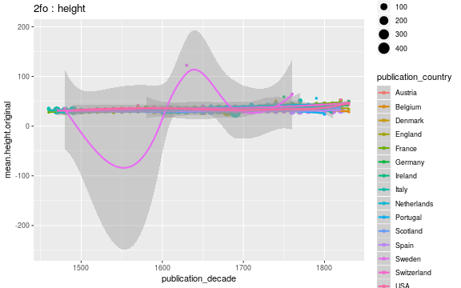

## Average document dimensions 

We have 4010 documents with publication country and original gatherings information. We have 17979 documents with original gatherings information but no publication country information.

|     | Austria| Belgium| Canada| Czech Republic| Denmark| England| France| Germany| Iraq| Ireland| Italy| Netherlands| Poland| Portugal| Scotland| Spain| Sweden| Switzerland| USA| NA| total|
|:----|-------:|-------:|------:|--------------:|-------:|-------:|------:|-------:|----:|-------:|-----:|-----------:|------:|--------:|--------:|-----:|------:|-----------:|---:|--:|-----:|
|1to  |       0|       0|      0|              0|       0|     115|      1|       0|    0|       0|     0|           0|      0|        0|        0|     0|      0|           0|   0| 11|   127|
|2fo  |       1|       6|      0|              0|       0|      89|     31|      19|    0|       2|    68|           3|      0|        2|       40|    25|      0|           4|   1| 68|   359|
|4to  |       1|       3|      0|              0|       0|     184|    155|      52|    0|       2|    71|          18|      0|        1|       42|     5|      8|           2|  12| 45|   601|
|8vo  |       3|       6|      0|              1|       5|     241|    136|      41|    0|       9|    33|          30|      1|        1|       62|     0|      1|          12|  59| 32|   673|
|12mo |       0|       3|      1|              0|       0|      75|     45|       3|    1|       9|     7|          14|      0|        0|       27|     0|      0|           4|  30|  7|   226|
|16mo |       0|       1|      0|              0|       0|       0|      6|       0|    0|       0|     0|           1|      0|        0|        0|     0|      0|           0|   2|  1|    11|
|18mo |       0|       0|      0|              0|       0|       1|      0|       0|    0|       0|     0|           1|      0|        0|        0|     0|      0|           0|   2|  0|     4|
|24mo |       0|       0|      0|              0|       0|       0|      0|       0|    0|       0|     0|           1|      0|        0|        0|     0|      0|           0|   1|  0|     2|
|32mo |       0|       0|      0|              0|       0|       1|      0|       1|    0|       0|     0|           0|      0|        0|        0|     0|      0|           0|   0|  0|     2|

### Selected gatherings across time; by publication country

### Average document sizes 

Only cases with 2000 documents are shown:

|gatherings.original | mean.height| median.height| mean.width| median.width|   n|
|:-------------------|-----------:|-------------:|----------:|------------:|---:|
|2fo                 |    33.94150|      33.94150|   30.77778|     30.77778| 359|
|4to                 |    22.90266|      22.90266|   28.00000|     28.00000| 601|
|8vo                 |    19.65438|      19.65438|        NaN|          NaN| 673|

### Average document sizes by decade and publication country

Only cases with 2000 documents are shown:

|gatherings.original |publication_country | publication_decade| mean.height| median.height| mean.width| median.width|  n|
|:-------------------|:-------------------|------------------:|-----------:|-------------:|----------:|------------:|--:|
|2fo                 |Austria             |               1690|    33.00000|      33.00000|        NaN|          NaN|  1|
|2fo                 |Belgium             |               1480|    28.50000|      28.50000|        NaN|          NaN|  2|
|2fo                 |Belgium             |               1640|    38.00000|      38.00000|        NaN|          NaN|  1|
|2fo                 |Belgium             |               1650|    29.00000|      29.00000|        NaN|          NaN|  1|
|2fo                 |Belgium             |               1660|    38.00000|      38.00000|        NaN|          NaN|  1|
|2fo                 |Belgium             |               1700|    32.00000|      32.00000|        NaN|          NaN|  1|
|2fo                 |England             |               1560|    29.00000|      29.00000|        NaN|          NaN|  1|
|2fo                 |England             |               1630|    28.50000|      28.50000|        NaN|          NaN|  2|
|2fo                 |England             |               1640|    30.00000|      30.00000|        NaN|          NaN|  1|
|2fo                 |England             |               1650|    32.50000|      32.50000|        NaN|          NaN|  2|
|2fo                 |England             |               1660|    28.50000|      28.50000|        NaN|          NaN|  2|
|2fo                 |England             |               1670|    31.00000|      31.00000|        NaN|          NaN|  2|
|2fo                 |England             |               1680|    30.33333|      30.33333|        NaN|          NaN|  9|
|2fo                 |England             |               1690|    31.66667|      31.66667|        NaN|          NaN|  3|
|2fo                 |England             |               1700|    30.83333|      30.83333|        NaN|          NaN|  6|
|2fo                 |England             |               1710|    31.20000|      31.20000|        NaN|          NaN|  5|
|2fo                 |England             |               1720|    32.66667|      32.66667|        NaN|          NaN|  3|
|2fo                 |England             |               1730|    35.25000|      35.25000|   25.00000|     25.00000|  4|
|2fo                 |England             |               1740|    31.80000|      31.80000|        NaN|          NaN|  5|
|2fo                 |England             |               1750|    32.50000|      32.50000|        NaN|          NaN|  8|
|2fo                 |England             |               1760|    36.71429|      36.71429|        NaN|          NaN|  7|
|2fo                 |England             |               1770|    39.33333|      39.33333|        NaN|          NaN|  3|
|2fo                 |England             |               1780|    39.27778|      39.27778|        NaN|          NaN| 18|
|2fo                 |England             |               1790|    40.00000|      40.00000|        NaN|          NaN|  4|
|2fo                 |England             |               1810|    48.00000|      48.00000|        NaN|          NaN|  1|
|2fo                 |England             |               1820|    46.00000|      46.00000|        NaN|          NaN|  1|
|2fo                 |England             |                 NA|    36.00000|      36.00000|        NaN|          NaN|  2|
|2fo                 |France              |               1470|    29.00000|      29.00000|        NaN|          NaN|  1|
|2fo                 |France              |               1480|    28.00000|      28.00000|        NaN|          NaN|  1|
|2fo                 |France              |               1490|    28.00000|      28.00000|        NaN|          NaN|  2|
|2fo                 |France              |               1530|    30.00000|      30.00000|        NaN|          NaN|  1|
|2fo                 |France              |               1550|    31.00000|      31.00000|        NaN|          NaN|  1|
|2fo                 |France              |               1560|    35.00000|      35.00000|        NaN|          NaN|  1|
|2fo                 |France              |               1570|    35.50000|      35.50000|        NaN|          NaN|  2|
|2fo                 |France              |               1600|    31.00000|      31.00000|        NaN|          NaN|  1|
|2fo                 |France              |               1610|    35.00000|      35.00000|        NaN|          NaN|  2|
|2fo                 |France              |               1620|    39.00000|      39.00000|        NaN|          NaN|  3|
|2fo                 |France              |               1640|    35.50000|      35.50000|        NaN|          NaN|  2|
|2fo                 |France              |               1660|    35.00000|      35.00000|        NaN|          NaN|  1|
|2fo                 |France              |               1680|    37.00000|      37.00000|        NaN|          NaN|  2|
|2fo                 |France              |               1690|    40.00000|      40.00000|        NaN|          NaN|  1|
|2fo                 |France              |               1740|    51.50000|      51.50000|   33.50000|     33.50000|  2|
|2fo                 |France              |               1750|    37.00000|      37.00000|        NaN|          NaN|  2|
|2fo                 |France              |               1770|    60.00000|      60.00000|        NaN|          NaN|  1|
|2fo                 |France              |               1780|    33.00000|      33.00000|        NaN|          NaN|  1|
|2fo                 |France              |               1820|    53.00000|      53.00000|        NaN|          NaN|  1|
|2fo                 |France              |                 NA|    48.00000|      48.00000|        NaN|          NaN|  3|
|2fo                 |Germany             |               1470|    34.33333|      34.33333|        NaN|          NaN|  3|
|2fo                 |Germany             |               1480|    29.00000|      29.00000|        NaN|          NaN|  1|
|2fo                 |Germany             |               1490|    23.00000|      23.00000|   18.00000|     18.00000|  1|
|2fo                 |Germany             |               1560|    32.00000|      32.00000|        NaN|          NaN|  1|
|2fo                 |Germany             |               1590|    35.00000|      35.00000|        NaN|          NaN|  2|
|2fo                 |Germany             |               1600|    35.00000|      35.00000|        NaN|          NaN|  1|
|2fo                 |Germany             |               1610|    38.00000|      38.00000|        NaN|          NaN|  2|
|2fo                 |Germany             |               1670|    34.00000|      34.00000|        NaN|          NaN|  2|
|2fo                 |Germany             |               1680|    37.00000|      37.00000|        NaN|          NaN|  1|
|2fo                 |Germany             |               1690|    37.00000|      37.00000|        NaN|          NaN|  1|
|2fo                 |Germany             |               1710|    35.00000|      35.00000|        NaN|          NaN|  1|
|2fo                 |Germany             |               1730|    38.00000|      38.00000|        NaN|          NaN|  2|
|2fo                 |Germany             |               1750|    35.00000|      35.00000|        NaN|          NaN|  1|
|2fo                 |Ireland             |               1690|    38.50000|      38.50000|        NaN|          NaN|  2|
|2fo                 |Italy               |               1470|    30.50000|      30.50000|        NaN|          NaN|  2|
|2fo                 |Italy               |               1480|    30.77778|      30.77778|        NaN|          NaN|  9|
|2fo                 |Italy               |               1490|    30.42857|      30.42857|        NaN|          NaN|  7|
|2fo                 |Italy               |               1500|    33.00000|      33.00000|        NaN|          NaN|  2|
|2fo                 |Italy               |               1530|    29.00000|      29.00000|        NaN|          NaN|  1|
|2fo                 |Italy               |               1560|    31.00000|      31.00000|        NaN|          NaN|  1|
|2fo                 |Italy               |               1570|    30.00000|      30.00000|        NaN|          NaN|  1|
|2fo                 |Italy               |               1580|    30.00000|      30.00000|        NaN|          NaN|  1|
|2fo                 |Italy               |               1600|    25.00000|      25.00000|        NaN|          NaN|  1|
|2fo                 |Italy               |               1610|    31.00000|      31.00000|        NaN|          NaN|  1|
|2fo                 |Italy               |               1620|    33.66667|      33.66667|        NaN|          NaN|  3|
|2fo                 |Italy               |               1630|    28.00000|      28.00000|        NaN|          NaN|  1|
|2fo                 |Italy               |               1650|    29.33333|      29.33333|        NaN|          NaN|  3|
|2fo                 |Italy               |               1660|    27.00000|      27.00000|        NaN|          NaN|  3|
|2fo                 |Italy               |               1670|    27.00000|      27.00000|        NaN|          NaN|  2|
|2fo                 |Italy               |               1690|    27.87500|      27.87500|        NaN|          NaN| 16|
|2fo                 |Italy               |               1750|    28.00000|      28.00000|        NaN|          NaN|  1|
|2fo                 |Italy               |               1760|    52.60000|      52.60000|   42.00000|     42.00000|  5|
|2fo                 |Italy               |               1770|    66.25000|      66.25000|   61.00000|     61.00000|  4|
|2fo                 |Italy               |               1780|    56.00000|      56.00000|   42.00000|     42.00000|  1|
|2fo                 |Italy               |                 NA|    35.33333|      35.33333|   32.00000|     32.00000|  3|
|2fo                 |Netherlands         |               1620|    33.00000|      33.00000|        NaN|          NaN|  1|
|2fo                 |Netherlands         |               1650|    52.00000|      52.00000|   34.00000|     34.00000|  1|
|2fo                 |Netherlands         |               1680|    33.00000|      33.00000|        NaN|          NaN|  1|
|2fo                 |Portugal            |               1600|    29.00000|      29.00000|        NaN|          NaN|  1|
|2fo                 |Portugal            |               1800|    17.00000|      17.00000|        NaN|          NaN|  1|
|2fo                 |Scotland            |               1640|    28.00000|      28.00000|        NaN|          NaN|  1|
|2fo                 |Scotland            |               1660|    26.50000|      26.50000|        NaN|          NaN|  2|
|2fo                 |Scotland            |               1680|    30.50000|      30.50000|        NaN|          NaN|  2|
|2fo                 |Scotland            |               1690|    32.00000|      32.00000|        NaN|          NaN|  2|
|2fo                 |Scotland            |               1700|    35.00000|      35.00000|   22.00000|     22.00000|  2|
|2fo                 |Scotland            |               1710|    33.83333|      33.83333|   36.00000|     36.00000|  6|
|2fo                 |Scotland            |               1720|    34.25000|      34.25000|   19.00000|     19.00000|  8|
|2fo                 |Scotland            |               1730|    35.00000|      35.00000|        NaN|          NaN|  2|
|2fo                 |Scotland            |               1740|    37.50000|      37.50000|        NaN|          NaN| 12|
|2fo                 |Scotland            |               1790|    34.00000|      34.00000|        NaN|          NaN|  1|
|2fo                 |Scotland            |                 NA|    37.00000|      37.00000|        NaN|          NaN|  2|
|2fo                 |Spain               |               1600|    30.00000|      30.00000|        NaN|          NaN|  1|
|2fo                 |Spain               |               1610|    29.00000|      29.00000|        NaN|          NaN|  1|
|2fo                 |Spain               |               1660|    29.00000|      29.00000|        NaN|          NaN|  2|
|2fo                 |Spain               |               1670|    30.00000|      30.00000|        NaN|          NaN|  1|
|2fo                 |Spain               |               1680|    35.50000|      35.50000|   30.00000|     30.00000|  2|
|2fo                 |Spain               |               1710|    29.00000|      29.00000|        NaN|          NaN|  2|
|2fo                 |Spain               |               1720|    29.50000|      29.50000|        NaN|          NaN|  2|
|2fo                 |Spain               |               1750|    27.00000|      27.00000|        NaN|          NaN|  1|
|2fo                 |Spain               |               1760|    27.50000|      27.50000|        NaN|          NaN|  2|
|2fo                 |Spain               |               1780|    33.00000|      33.00000|        NaN|          NaN|  1|
|2fo                 |Spain               |               1790|    29.00000|      29.00000|        NaN|          NaN|  2|
|2fo                 |Spain               |               1800|    28.33333|      28.33333|        NaN|          NaN|  3|
|2fo                 |Spain               |               1810|    29.66667|      29.66667|        NaN|          NaN|  3|
|2fo                 |Spain               |               1820|    30.00000|      30.00000|        NaN|          NaN|  1|
|2fo                 |Spain               |                 NA|    30.00000|      30.00000|        NaN|          NaN|  1|
|2fo                 |Switzerland         |               1550|    35.50000|      35.50000|        NaN|          NaN|  2|
|2fo                 |Switzerland         |               1580|    33.00000|      33.00000|        NaN|          NaN|  1|
|2fo                 |Switzerland         |               1730|    36.00000|      36.00000|        NaN|          NaN|  1|
|2fo                 |USA                 |               1790|    34.00000|      34.00000|        NaN|          NaN|  1|
|2fo                 |NA                  |               1470|    34.00000|      34.00000|        NaN|          NaN|  1|
|2fo                 |NA                  |               1490|    29.00000|      29.00000|        NaN|          NaN|  2|
|2fo                 |NA                  |               1500|    32.00000|      32.00000|        NaN|          NaN|  1|
|2fo                 |NA                  |               1540|    31.00000|      31.00000|        NaN|          NaN|  1|
|2fo                 |NA                  |               1550|    31.00000|      31.00000|        NaN|          NaN|  2|
|2fo                 |NA                  |               1580|    37.00000|      37.00000|        NaN|          NaN|  1|
|2fo                 |NA                  |               1620|    32.00000|      32.00000|        NaN|          NaN|  1|
|2fo                 |NA                  |               1630|    36.00000|      36.00000|        NaN|          NaN|  1|
|2fo                 |NA                  |               1640|    30.00000|      30.00000|        NaN|          NaN|  1|
|2fo                 |NA                  |               1660|    31.00000|      31.00000|        NaN|          NaN|  2|
|2fo                 |NA                  |               1690|    29.00000|      29.00000|        NaN|          NaN|  1|
|2fo                 |NA                  |               1700|    34.00000|      34.00000|        NaN|          NaN|  1|
|2fo                 |NA                  |               1720|    29.00000|      29.00000|        NaN|          NaN|  1|
|2fo                 |NA                  |               1730|    54.00000|      54.00000|        NaN|          NaN|  1|
|2fo                 |NA                  |               1740|    29.00000|      29.00000|        NaN|          NaN|  1|
|2fo                 |NA                  |               1750|    35.00000|      35.00000|        NaN|          NaN|  1|
|2fo                 |NA                  |               1760|    29.25000|      29.25000|        NaN|          NaN|  4|
|2fo                 |NA                  |               1770|    37.25000|      37.25000|   42.00000|     42.00000|  4|
|2fo                 |NA                  |               1780|    30.00000|      30.00000|        NaN|          NaN|  3|
|2fo                 |NA                  |               1790|    29.00000|      29.00000|        NaN|          NaN|  4|
|2fo                 |NA                  |               1800|    31.16667|      31.16667|        NaN|          NaN|  6|
|2fo                 |NA                  |               1810|    34.75000|      34.75000|   21.00000|     21.00000|  4|
|2fo                 |NA                  |               1820|    32.57895|      32.57895|   23.13333|     23.13333| 19|
|2fo                 |NA                  |                 NA|    30.80000|      30.80000|   22.00000|     22.00000|  5|
|4to                 |Austria             |               1510|    20.00000|      20.00000|        NaN|          NaN|  1|
|4to                 |Belgium             |               1480|    20.00000|      20.00000|        NaN|          NaN|  2|
|4to                 |Belgium             |               1580|    22.00000|      22.00000|        NaN|          NaN|  1|
|4to                 |England             |                160|    19.00000|      19.00000|        NaN|          NaN|  1|
|4to                 |England             |               1540|    18.00000|      18.00000|        NaN|          NaN|  1|
|4to                 |England             |               1560|    18.50000|      18.50000|        NaN|          NaN|  2|
|4to                 |England             |               1570|    19.00000|      19.00000|        NaN|          NaN|  1|
|4to                 |England             |               1590|    17.00000|      17.00000|        NaN|          NaN|  1|
|4to                 |England             |               1600|    17.00000|      17.00000|        NaN|          NaN|  1|
|4to                 |England             |               1610|    29.00000|      29.00000|        NaN|          NaN|  1|
|4to                 |England             |               1620|    19.33333|      19.33333|        NaN|          NaN|  3|
|4to                 |England             |               1630|    19.75000|      19.75000|        NaN|          NaN|  4|
|4to                 |England             |               1640|    19.00000|      19.00000|        NaN|          NaN| 39|
|4to                 |England             |               1650|    18.77778|      18.77778|        NaN|          NaN|  9|
|4to                 |England             |               1660|    20.16667|      20.16667|        NaN|          NaN|  6|
|4to                 |England             |               1670|    20.33333|      20.33333|        NaN|          NaN|  6|
|4to                 |England             |               1680|    20.25000|      20.25000|        NaN|          NaN| 16|
|4to                 |England             |               1690|    20.60000|      20.60000|        NaN|          NaN| 15|
|4to                 |England             |               1700|    20.50000|      20.50000|        NaN|          NaN|  8|
|4to                 |England             |               1710|    23.30000|      23.30000|        NaN|          NaN| 10|
|4to                 |England             |               1720|    22.50000|      22.50000|        NaN|          NaN|  2|
|4to                 |England             |               1730|    26.33333|      26.33333|        NaN|          NaN|  3|
|4to                 |England             |               1740|    27.20000|      27.20000|        NaN|          NaN|  5|
|4to                 |England             |               1750|    27.50000|      27.50000|        NaN|          NaN|  6|
|4to                 |England             |               1760|    26.66667|      26.66667|        NaN|          NaN|  6|
|4to                 |England             |               1770|    27.60000|      27.60000|        NaN|          NaN| 10|
|4to                 |England             |               1780|    27.40000|      27.40000|        NaN|          NaN| 10|
|4to                 |England             |               1790|    26.71429|      26.71429|        NaN|          NaN|  7|
|4to                 |England             |               1800|    28.00000|      28.00000|        NaN|          NaN|  1|
|4to                 |England             |               1820|    38.00000|      38.00000|   28.00000|     28.00000|  1|
|4to                 |England             |                 NA|    19.22222|      19.22222|        NaN|          NaN|  9|
|4to                 |France              |               1480|    20.00000|      20.00000|        NaN|          NaN|  1|
|4to                 |France              |               1490|    21.75000|      21.75000|        NaN|          NaN|  4|
|4to                 |France              |               1510|    22.50000|      22.50000|        NaN|          NaN|  2|
|4to                 |France              |               1520|    21.00000|      21.00000|        NaN|          NaN|  1|
|4to                 |France              |               1550|    23.00000|      23.00000|        NaN|          NaN|  1|
|4to                 |France              |               1560|    23.00000|      23.00000|        NaN|          NaN|  1|
|4to                 |France              |               1570|    23.00000|      23.00000|        NaN|          NaN|  1|
|4to                 |France              |               1610|    23.00000|      23.00000|        NaN|          NaN|  1|
|4to                 |France              |               1630|    22.00000|      22.00000|        NaN|          NaN|  1|
|4to                 |France              |               1640|    24.00000|      24.00000|        NaN|          NaN|  1|
|4to                 |France              |               1650|    23.00000|      23.00000|        NaN|          NaN|  2|
|4to                 |France              |               1660|    23.80000|      23.80000|        NaN|          NaN|  5|
|4to                 |France              |               1690|    23.20000|      23.20000|        NaN|          NaN|  5|
|4to                 |France              |               1700|    23.00000|      23.00000|        NaN|          NaN|  7|
|4to                 |France              |               1710|    23.50000|      23.50000|        NaN|          NaN| 12|
|4to                 |France              |               1720|    24.38462|      24.38462|        NaN|          NaN| 13|
|4to                 |France              |               1730|    23.83333|      23.83333|        NaN|          NaN| 12|
|4to                 |France              |               1740|    23.10000|      23.10000|        NaN|          NaN| 10|
|4to                 |France              |               1750|    24.61538|      24.61538|        NaN|          NaN| 13|
|4to                 |France              |               1760|    24.56250|      24.56250|        NaN|          NaN| 16|
|4to                 |France              |               1770|    33.16129|      33.16129|        NaN|          NaN| 31|
|4to                 |France              |               1780|    25.33333|      25.33333|        NaN|          NaN|  6|
|4to                 |France              |               1790|    23.20000|      23.20000|        NaN|          NaN|  5|
|4to                 |France              |               1820|    25.00000|      25.00000|        NaN|          NaN|  1|
|4to                 |France              |                 NA|    22.66667|      22.66667|        NaN|          NaN|  3|
|4to                 |Germany             |               1470|    20.00000|      20.00000|        NaN|          NaN|  1|
|4to                 |Germany             |               1490|    20.50000|      20.50000|        NaN|          NaN|  4|
|4to                 |Germany             |               1500|    21.00000|      21.00000|        NaN|          NaN|  1|
|4to                 |Germany             |               1510|    20.00000|      20.00000|        NaN|          NaN|  1|
|4to                 |Germany             |               1520|    20.50000|      20.50000|        NaN|          NaN|  2|
|4to                 |Germany             |               1550|    21.00000|      21.00000|        NaN|          NaN|  1|
|4to                 |Germany             |               1620|    20.00000|      20.00000|        NaN|          NaN|  1|
|4to                 |Germany             |               1650|    19.66667|      19.66667|        NaN|          NaN|  3|
|4to                 |Germany             |               1660|    19.00000|      19.00000|        NaN|          NaN|  2|
|4to                 |Germany             |               1670|    18.75000|      18.75000|        NaN|          NaN|  4|
|4to                 |Germany             |               1680|    20.00000|      20.00000|        NaN|          NaN|  3|
|4to                 |Germany             |               1690|    20.37500|      20.37500|        NaN|          NaN|  8|
|4to                 |Germany             |               1700|    20.66667|      20.66667|        NaN|          NaN|  3|
|4to                 |Germany             |               1710|    21.50000|      21.50000|        NaN|          NaN|  2|
|4to                 |Germany             |               1720|    20.66667|      20.66667|        NaN|          NaN|  3|
|4to                 |Germany             |               1730|    20.00000|      20.00000|        NaN|          NaN|  1|
|4to                 |Germany             |               1740|    21.50000|      21.50000|        NaN|          NaN|  2|
|4to                 |Germany             |               1750|    21.33333|      21.33333|        NaN|          NaN|  3|
|4to                 |Germany             |               1760|    23.00000|      23.00000|        NaN|          NaN|  1|
|4to                 |Germany             |               1780|    24.00000|      24.00000|        NaN|          NaN|  1|
|4to                 |Germany             |               1790|    21.00000|      21.00000|        NaN|          NaN|  1|
|4to                 |Germany             |               1800|    22.00000|      22.00000|        NaN|          NaN|  1|
|4to                 |Germany             |               1820|    23.00000|      23.00000|        NaN|          NaN|  2|
|4to                 |Germany             |                 NA|    21.00000|      21.00000|        NaN|          NaN|  1|
|4to                 |Ireland             |               1700|    19.00000|      19.00000|        NaN|          NaN|  1|
|4to                 |Ireland             |               1760|    27.00000|      27.00000|        NaN|          NaN|  1|
|4to                 |Italy               |               1470|    28.00000|      28.00000|        NaN|          NaN|  3|
|4to                 |Italy               |               1480|    22.25000|      22.25000|        NaN|          NaN|  8|
|4to                 |Italy               |               1490|    20.83333|      20.83333|        NaN|          NaN|  6|
|4to                 |Italy               |               1530|    18.00000|      18.00000|        NaN|          NaN|  1|
|4to                 |Italy               |               1550|    22.00000|      22.00000|        NaN|          NaN|  1|
|4to                 |Italy               |               1560|    21.00000|      21.00000|        NaN|          NaN|  1|
|4to                 |Italy               |               1570|    21.75000|      21.75000|        NaN|          NaN|  4|
|4to                 |Italy               |               1580|    20.66667|      20.66667|        NaN|          NaN|  6|
|4to                 |Italy               |               1590|    20.50000|      20.50000|        NaN|          NaN|  4|
|4to                 |Italy               |               1600|    25.00000|      25.00000|        NaN|          NaN|  3|
|4to                 |Italy               |               1610|    24.50000|      24.50000|        NaN|          NaN|  2|
|4to                 |Italy               |               1620|    21.66667|      21.66667|        NaN|          NaN|  3|
|4to                 |Italy               |               1630|    22.66667|      22.66667|        NaN|          NaN|  3|
|4to                 |Italy               |               1640|    23.00000|      23.00000|        NaN|          NaN|  1|
|4to                 |Italy               |               1650|    24.33333|      24.33333|        NaN|          NaN|  3|
|4to                 |Italy               |               1660|    24.50000|      24.50000|        NaN|          NaN|  2|
|4to                 |Italy               |               1670|    23.00000|      23.00000|        NaN|          NaN|  3|
|4to                 |Italy               |               1680|    23.00000|      23.00000|        NaN|          NaN|  1|
|4to                 |Italy               |               1690|    22.00000|      22.00000|        NaN|          NaN|  2|
|4to                 |Italy               |               1700|    25.00000|      25.00000|        NaN|          NaN|  1|
|4to                 |Italy               |               1730|    23.00000|      23.00000|        NaN|          NaN|  2|
|4to                 |Italy               |               1740|    25.66667|      25.66667|        NaN|          NaN|  3|
|4to                 |Italy               |               1750|    23.75000|      23.75000|        NaN|          NaN|  4|
|4to                 |Italy               |               1780|    28.00000|      28.00000|        NaN|          NaN|  2|
|4to                 |Italy               |                 NA|    23.50000|      23.50000|        NaN|          NaN|  2|
|4to                 |Netherlands         |               1490|    17.00000|      17.00000|        NaN|          NaN|  1|
|4to                 |Netherlands         |               1620|    23.50000|      23.50000|        NaN|          NaN|  1|
|4to                 |Netherlands         |               1640|    24.00000|      24.00000|        NaN|          NaN|  1|
|4to                 |Netherlands         |               1660|    26.00000|      26.00000|        NaN|          NaN|  1|
|4to                 |Netherlands         |               1670|    21.00000|      21.00000|        NaN|          NaN|  1|
|4to                 |Netherlands         |               1690|    21.50000|      21.50000|        NaN|          NaN|  2|
|4to                 |Netherlands         |               1710|    22.33333|      22.33333|        NaN|          NaN|  3|
|4to                 |Netherlands         |               1740|    25.33333|      25.33333|        NaN|          NaN|  3|
|4to                 |Netherlands         |               1750|    21.00000|      21.00000|        NaN|          NaN|  1|
|4to                 |Netherlands         |               1770|    25.00000|      25.00000|        NaN|          NaN|  2|
|4to                 |Netherlands         |               1780|    21.00000|      21.00000|        NaN|          NaN|  1|
|4to                 |Netherlands         |                 NA|    19.00000|      19.00000|        NaN|          NaN|  1|
|4to                 |Portugal            |               1660|    19.00000|      19.00000|        NaN|          NaN|  1|
|4to                 |Scotland            |               1630|    19.33333|      19.33333|        NaN|          NaN|  3|
|4to                 |Scotland            |               1640|    18.71429|      18.71429|        NaN|          NaN|  7|
|4to                 |Scotland            |               1650|    19.50000|      19.50000|        NaN|          NaN|  2|
|4to                 |Scotland            |               1660|    17.50000|      17.50000|        NaN|          NaN|  2|
|4to                 |Scotland            |               1690|    21.00000|      21.00000|        NaN|          NaN|  1|
|4to                 |Scotland            |               1700|    20.16667|      20.16667|        NaN|          NaN|  6|
|4to                 |Scotland            |               1730|    23.00000|      23.00000|        NaN|          NaN|  3|
|4to                 |Scotland            |               1740|    21.00000|      21.00000|        NaN|          NaN|  1|
|4to                 |Scotland            |               1750|    23.00000|      23.00000|        NaN|          NaN|  3|
|4to                 |Scotland            |               1760|    25.25000|      25.25000|        NaN|          NaN|  4|
|4to                 |Scotland            |               1770|    22.50000|      22.50000|        NaN|          NaN|  2|
|4to                 |Scotland            |               1780|    26.00000|      26.00000|        NaN|          NaN|  1|
|4to                 |Scotland            |               1790|    26.50000|      26.50000|        NaN|          NaN|  4|
|4to                 |Scotland            |               1800|    25.00000|      25.00000|        NaN|          NaN|  1|
|4to                 |Scotland            |               1820|    26.00000|      26.00000|        NaN|          NaN|  1|
|4to                 |Scotland            |                 NA|    20.00000|      20.00000|        NaN|          NaN|  1|
|4to                 |Spain               |               1770|    22.00000|      22.00000|        NaN|          NaN|  1|
|4to                 |Spain               |               1780|    23.00000|      23.00000|        NaN|          NaN|  1|
|4to                 |Spain               |               1790|    21.00000|      21.00000|        NaN|          NaN|  1|
|4to                 |Spain               |               1800|    21.00000|      21.00000|        NaN|          NaN|  1|
|4to                 |Spain               |               1810|    25.00000|      25.00000|        NaN|          NaN|  1|
|4to                 |Sweden              |               1670|    20.00000|      20.00000|        NaN|          NaN|  1|
|4to                 |Sweden              |               1740|    21.00000|      21.00000|        NaN|          NaN|  1|
|4to                 |Sweden              |               1750|    21.33333|      21.33333|        NaN|          NaN|  3|
|4to                 |Sweden              |               1770|    20.00000|      20.00000|        NaN|          NaN|  1|
|4to                 |Sweden              |               1780|    20.50000|      20.50000|        NaN|          NaN|  2|
|4to                 |Switzerland         |               1700|    23.00000|      23.00000|        NaN|          NaN|  1|
|4to                 |Switzerland         |               1730|    23.00000|      23.00000|        NaN|          NaN|  1|
|4to                 |USA                 |               1590|    20.00000|      20.00000|        NaN|          NaN|  1|
|4to                 |USA                 |               1610|    20.00000|      20.00000|        NaN|          NaN|  1|
|4to                 |USA                 |               1690|    19.00000|      19.00000|        NaN|          NaN|  1|
|4to                 |USA                 |               1750|    21.00000|      21.00000|        NaN|          NaN|  1|
|4to                 |USA                 |               1760|    22.00000|      22.00000|        NaN|          NaN|  1|
|4to                 |USA                 |               1770|    20.00000|      20.00000|        NaN|          NaN|  2|
|4to                 |USA                 |               1780|    19.50000|      19.50000|        NaN|          NaN|  2|
|4to                 |USA                 |               1790|    24.00000|      24.00000|        NaN|          NaN|  2|
|4to                 |USA                 |               1800|    19.00000|      19.00000|        NaN|          NaN|  1|
|4to                 |NA                  |                180|    26.00000|      26.00000|        NaN|          NaN|  1|
|4to                 |NA                  |               1470|    21.00000|      21.00000|        NaN|          NaN|  1|
|4to                 |NA                  |               1490|    20.00000|      20.00000|        NaN|          NaN|  1|
|4to                 |NA                  |               1500|    21.00000|      21.00000|        NaN|          NaN|  2|
|4to                 |NA                  |               1510|    21.00000|      21.00000|        NaN|          NaN|  1|
|4to                 |NA                  |               1530|    20.00000|      20.00000|        NaN|          NaN|  1|
|4to                 |NA                  |               1570|    20.00000|      20.00000|        NaN|          NaN|  1|
|4to                 |NA                  |               1600|    24.00000|      24.00000|        NaN|          NaN|  1|
|4to                 |NA                  |               1610|    25.00000|      25.00000|        NaN|          NaN|  1|
|4to                 |NA                  |               1630|    19.50000|      19.50000|        NaN|          NaN|  2|
|4to                 |NA                  |               1670|    20.50000|      20.50000|        NaN|          NaN|  2|
|4to                 |NA                  |               1680|    23.00000|      23.00000|        NaN|          NaN|  2|
|4to                 |NA                  |               1690|    24.00000|      24.00000|        NaN|          NaN|  1|
|4to                 |NA                  |               1700|    23.50000|      23.50000|        NaN|          NaN|  6|
|4to                 |NA                  |               1710|    22.50000|      22.50000|        NaN|          NaN|  2|
|4to                 |NA                  |               1720|    23.75000|      23.75000|        NaN|          NaN|  4|
|4to                 |NA                  |               1730|    21.00000|      21.00000|        NaN|          NaN|  1|
|4to                 |NA                  |               1750|    24.00000|      24.00000|        NaN|          NaN|  2|
|4to                 |NA                  |               1760|    23.20000|      23.20000|        NaN|          NaN|  5|
|4to                 |NA                  |               1780|    24.50000|      24.50000|        NaN|          NaN|  2|
|4to                 |NA                  |               1790|    22.00000|      22.00000|        NaN|          NaN|  1|
|4to                 |NA                  |               1820|    24.00000|      24.00000|        NaN|          NaN|  3|
|4to                 |NA                  |                 NA|    21.00000|      21.00000|        NaN|          NaN|  2|
|8vo                 |Austria             |               1750|    17.00000|      17.00000|        NaN|          NaN|  1|
|8vo                 |Austria             |               1760|    20.00000|      20.00000|        NaN|          NaN|  2|
|8vo                 |Belgium             |               1560|    19.00000|      19.00000|        NaN|          NaN|  1|
|8vo                 |Belgium             |               1650|    18.00000|      18.00000|        NaN|          NaN|  1|
|8vo                 |Belgium             |               1690|    19.00000|      19.00000|        NaN|          NaN|  1|
|8vo                 |Belgium             |               1770|    18.00000|      18.00000|        NaN|          NaN|  1|
|8vo                 |Belgium             |               1790|    20.00000|      20.00000|        NaN|          NaN|  1|
|8vo                 |Belgium             |               1810|    21.00000|      21.00000|        NaN|          NaN|  1|
|8vo                 |Czech Republic      |               1600|    16.00000|      16.00000|        NaN|          NaN|  1|
|8vo                 |Denmark             |               1760|    19.00000|      19.00000|        NaN|          NaN|  2|
|8vo                 |Denmark             |               1790|    21.00000|      21.00000|        NaN|          NaN|  2|
|8vo                 |Denmark             |               1800|    20.00000|      20.00000|        NaN|          NaN|  1|
|8vo                 |England             |               1540|    19.00000|      19.00000|        NaN|          NaN|  1|
|8vo                 |England             |               1550|    17.00000|      17.00000|        NaN|          NaN|  1|
|8vo                 |England             |               1570|    17.00000|      17.00000|        NaN|          NaN|  1|
|8vo                 |England             |               1580|    16.00000|      16.00000|        NaN|          NaN|  1|
|8vo                 |England             |               1620|    16.00000|      16.00000|        NaN|          NaN|  3|
|8vo                 |England             |               1630|    14.00000|      14.00000|        NaN|          NaN|  1|
|8vo                 |England             |               1650|    14.00000|      14.00000|        NaN|          NaN|  1|
|8vo                 |England             |               1660|    16.50000|      16.50000|        NaN|          NaN|  6|
|8vo                 |England             |               1670|    16.87500|      16.87500|        NaN|          NaN|  8|
|8vo                 |England             |               1680|    17.46154|      17.46154|        NaN|          NaN| 13|
|8vo                 |England             |               1690|    16.60000|      16.60000|        NaN|          NaN|  5|
|8vo                 |England             |               1700|    19.66667|      19.66667|        NaN|          NaN|  9|
|8vo                 |England             |               1710|    19.65000|      19.65000|        NaN|          NaN| 20|
|8vo                 |England             |               1720|    20.37500|      20.37500|        NaN|          NaN| 16|
|8vo                 |England             |               1730|    19.92857|      19.92857|        NaN|          NaN| 14|
|8vo                 |England             |               1740|    20.41667|      20.41667|        NaN|          NaN| 12|
|8vo                 |England             |               1750|    21.10000|      21.10000|        NaN|          NaN| 10|
|8vo                 |England             |               1760|    20.29412|      20.29412|        NaN|          NaN| 17|
|8vo                 |England             |               1770|    21.11765|      21.11765|        NaN|          NaN| 17|
|8vo                 |England             |               1780|    21.33333|      21.33333|        NaN|          NaN| 18|
|8vo                 |England             |               1790|    21.12903|      21.12903|        NaN|          NaN| 31|
|8vo                 |England             |               1800|    20.90909|      20.90909|        NaN|          NaN| 11|
|8vo                 |England             |               1810|    22.16667|      22.16667|        NaN|          NaN|  6|
|8vo                 |England             |               1820|    21.41667|      21.41667|        NaN|          NaN| 12|
|8vo                 |England             |                 NA|    19.31429|      19.31429|        NaN|          NaN|  7|
|8vo                 |France              |               1530|    16.00000|      16.00000|        NaN|          NaN|  1|
|8vo                 |France              |               1540|    16.66667|      16.66667|        NaN|          NaN|  3|
|8vo                 |France              |               1550|    18.00000|      18.00000|        NaN|          NaN|  1|
|8vo                 |France              |               1560|    15.00000|      15.00000|        NaN|          NaN|  1|
|8vo                 |France              |               1580|    16.00000|      16.00000|        NaN|          NaN|  4|
|8vo                 |France              |               1590|    18.00000|      18.00000|        NaN|          NaN|  1|
|8vo                 |France              |               1600|    17.00000|      17.00000|        NaN|          NaN|  1|
|8vo                 |France              |               1610|    17.33333|      17.33333|        NaN|          NaN|  3|
|8vo                 |France              |               1630|    16.50000|      16.50000|        NaN|          NaN|  2|
|8vo                 |France              |               1640|    17.00000|      17.00000|        NaN|          NaN|  1|
|8vo                 |France              |               1650|    14.00000|      14.00000|        NaN|          NaN|  1|
|8vo                 |France              |               1660|    18.00000|      18.00000|        NaN|          NaN|  1|
|8vo                 |France              |               1670|    19.00000|      19.00000|        NaN|          NaN|  2|
|8vo                 |France              |               1680|    17.50000|      17.50000|        NaN|          NaN|  2|
|8vo                 |France              |               1700|    16.00000|      16.00000|        NaN|          NaN|  1|
|8vo                 |France              |               1720|    16.00000|      16.00000|        NaN|          NaN|  1|
|8vo                 |France              |               1730|    20.33333|      20.33333|        NaN|          NaN|  3|
|8vo                 |France              |               1750|    20.00000|      20.00000|        NaN|          NaN|  1|
|8vo                 |France              |               1760|    20.00000|      20.00000|        NaN|          NaN|  2|
|8vo                 |France              |               1770|    19.50000|      19.50000|        NaN|          NaN|  2|
|8vo                 |France              |               1780|    20.70000|      20.70000|        NaN|          NaN| 30|
|8vo                 |France              |               1790|    20.57143|      20.57143|        NaN|          NaN| 49|
|8vo                 |France              |               1800|    20.71429|      20.71429|        NaN|          NaN|  7|
|8vo                 |France              |               1810|    20.88571|      20.88571|        NaN|          NaN|  7|
|8vo                 |France              |               1820|    20.87500|      20.87500|        NaN|          NaN|  8|
|8vo                 |France              |                 NA|    20.00000|      20.00000|        NaN|          NaN|  1|
|8vo                 |Germany             |               1560|    17.00000|      17.00000|        NaN|          NaN|  2|
|8vo                 |Germany             |               1570|    17.00000|      17.00000|        NaN|          NaN|  1|
|8vo                 |Germany             |               1580|    17.00000|      17.00000|        NaN|          NaN|  1|
|8vo                 |Germany             |               1600|    16.00000|      16.00000|        NaN|          NaN|  1|
|8vo                 |Germany             |               1640|    15.00000|      15.00000|        NaN|          NaN|  1|
|8vo                 |Germany             |               1660|    16.00000|      16.00000|        NaN|          NaN|  1|
|8vo                 |Germany             |               1670|    17.00000|      17.00000|        NaN|          NaN|  2|
|8vo                 |Germany             |               1690|    16.00000|      16.00000|        NaN|          NaN|  1|
|8vo                 |Germany             |               1710|    18.00000|      18.00000|        NaN|          NaN|  1|
|8vo                 |Germany             |               1720|    15.00000|      15.00000|        NaN|          NaN|  1|
|8vo                 |Germany             |               1740|    18.50000|      18.50000|        NaN|          NaN|  2|
|8vo                 |Germany             |               1750|    20.00000|      20.00000|        NaN|          NaN|  2|
|8vo                 |Germany             |               1760|    19.00000|      19.00000|        NaN|          NaN|  3|
|8vo                 |Germany             |               1770|    21.00000|      21.00000|        NaN|          NaN|  2|
|8vo                 |Germany             |               1780|    19.16667|      19.16667|        NaN|          NaN|  6|
|8vo                 |Germany             |               1790|    19.87500|      19.87500|        NaN|          NaN|  8|
|8vo                 |Germany             |               1800|    18.00000|      18.00000|        NaN|          NaN|  1|
|8vo                 |Germany             |               1810|    20.00000|      20.00000|        NaN|          NaN|  3|
|8vo                 |Germany             |               1820|    21.00000|      21.00000|        NaN|          NaN|  1|
|8vo                 |Germany             |                 NA|    16.00000|      16.00000|        NaN|          NaN|  1|
|8vo                 |Ireland             |               1690|    17.00000|      17.00000|        NaN|          NaN|  1|
|8vo                 |Ireland             |               1700|    17.00000|      17.00000|        NaN|          NaN|  1|
|8vo                 |Ireland             |               1740|    20.50000|      20.50000|        NaN|          NaN|  2|
|8vo                 |Ireland             |               1750|    21.00000|      21.00000|        NaN|          NaN|  2|
|8vo                 |Ireland             |               1770|    22.00000|      22.00000|        NaN|          NaN|  1|
|8vo                 |Ireland             |               1790|    22.00000|      22.00000|        NaN|          NaN|  1|
|8vo                 |Ireland             |                 NA|    18.00000|      18.00000|        NaN|          NaN|  1|
|8vo                 |Italy               |               1470|    21.00000|      21.00000|        NaN|          NaN|  1|
|8vo                 |Italy               |               1500|    15.00000|      15.00000|        NaN|          NaN|  1|
|8vo                 |Italy               |               1520|    17.00000|      17.00000|        NaN|          NaN|  2|
|8vo                 |Italy               |               1530|    16.00000|      16.00000|        NaN|          NaN|  2|
|8vo                 |Italy               |               1540|    16.00000|      16.00000|        NaN|          NaN|  1|
|8vo                 |Italy               |               1550|    16.66667|      16.66667|        NaN|          NaN|  3|
|8vo                 |Italy               |               1560|    17.00000|      17.00000|        NaN|          NaN|  1|
|8vo                 |Italy               |               1580|    17.00000|      17.00000|        NaN|          NaN|  2|
|8vo                 |Italy               |               1600|    16.00000|      16.00000|        NaN|          NaN|  2|
|8vo                 |Italy               |               1670|    16.00000|      16.00000|        NaN|          NaN|  1|
|8vo                 |Italy               |               1690|    17.00000|      17.00000|        NaN|          NaN|  1|
|8vo                 |Italy               |               1730|    26.00000|      26.00000|        NaN|          NaN|  1|
|8vo                 |Italy               |               1740|    22.00000|      22.00000|        NaN|          NaN|  1|
|8vo                 |Italy               |               1760|    19.00000|      19.00000|        NaN|          NaN|  1|
|8vo                 |Italy               |               1770|    21.00000|      21.00000|        NaN|          NaN|  2|
|8vo                 |Italy               |               1780|    22.00000|      22.00000|        NaN|          NaN|  3|
|8vo                 |Italy               |               1790|    17.66667|      17.66667|        NaN|          NaN|  3|
|8vo                 |Italy               |               1800|    22.00000|      22.00000|        NaN|          NaN|  2|
|8vo                 |Italy               |                 NA|    14.66667|      14.66667|        NaN|          NaN|  3|
|8vo                 |Netherlands         |               1620|    16.00000|      16.00000|        NaN|          NaN|  1|
|8vo                 |Netherlands         |               1640|    16.00000|      16.00000|        NaN|          NaN|  1|
|8vo                 |Netherlands         |               1670|    17.50000|      17.50000|        NaN|          NaN|  2|
|8vo                 |Netherlands         |               1680|    17.00000|      17.00000|        NaN|          NaN|  1|
|8vo                 |Netherlands         |               1690|    20.00000|      20.00000|        NaN|          NaN|  1|
|8vo                 |Netherlands         |               1700|    19.66667|      19.66667|        NaN|          NaN|  3|
|8vo                 |Netherlands         |               1710|    19.33333|      19.33333|        NaN|          NaN|  3|
|8vo                 |Netherlands         |               1730|    16.50000|      16.50000|        NaN|          NaN|  2|
|8vo                 |Netherlands         |               1740|    19.00000|      19.00000|        NaN|          NaN|  3|
|8vo                 |Netherlands         |               1750|    16.00000|      16.00000|        NaN|          NaN|  1|
|8vo                 |Netherlands         |               1760|    22.00000|      22.00000|        NaN|          NaN|  1|
|8vo                 |Netherlands         |               1770|    21.66667|      21.66667|        NaN|          NaN|  3|
|8vo                 |Netherlands         |               1780|    22.00000|      22.00000|        NaN|          NaN|  2|
|8vo                 |Netherlands         |               1790|    21.00000|      21.00000|        NaN|          NaN|  1|
|8vo                 |Netherlands         |               1810|    21.00000|      21.00000|        NaN|          NaN|  3|
|8vo                 |Netherlands         |               1820|    21.00000|      21.00000|        NaN|          NaN|  1|
|8vo                 |Netherlands         |                 NA|    17.00000|      17.00000|        NaN|          NaN|  1|
|8vo                 |Poland              |               1780|    20.00000|      20.00000|        NaN|          NaN|  1|
|8vo                 |Portugal            |               1630|    15.00000|      15.00000|        NaN|          NaN|  1|
|8vo                 |Scotland            |               1650|    13.00000|      13.00000|        NaN|          NaN|  1|
|8vo                 |Scotland            |               1660|    15.00000|      15.00000|        NaN|          NaN|  1|
|8vo                 |Scotland            |               1690|    15.00000|      15.00000|        NaN|          NaN|  1|
|8vo                 |Scotland            |               1700|    16.00000|      16.00000|        NaN|          NaN|  1|
|8vo                 |Scotland            |               1710|    17.00000|      17.00000|        NaN|          NaN|  1|
|8vo                 |Scotland            |               1720|    16.00000|      16.00000|        NaN|          NaN|  2|
|8vo                 |Scotland            |               1730|    19.00000|      19.00000|        NaN|          NaN|  2|
|8vo                 |Scotland            |               1740|    19.00000|      19.00000|        NaN|          NaN|  2|
|8vo                 |Scotland            |               1750|    18.00000|      18.00000|        NaN|          NaN|  3|
|8vo                 |Scotland            |               1760|    19.40000|      19.40000|        NaN|          NaN|  5|
|8vo                 |Scotland            |               1770|    20.36364|      20.36364|        NaN|          NaN| 11|
|8vo                 |Scotland            |               1780|    21.00000|      21.00000|        NaN|          NaN|  6|
|8vo                 |Scotland            |               1790|    20.71429|      20.71429|        NaN|          NaN|  7|
|8vo                 |Scotland            |               1800|    20.44444|      20.44444|        NaN|          NaN|  9|
|8vo                 |Scotland            |               1810|    22.25000|      22.25000|        NaN|          NaN|  4|
|8vo                 |Scotland            |               1820|    21.25000|      21.25000|        NaN|          NaN|  4|
|8vo                 |Scotland            |                 NA|    21.00000|      21.00000|        NaN|          NaN|  2|
|8vo                 |Sweden              |               1750|    24.00000|      24.00000|        NaN|          NaN|  1|
|8vo                 |Switzerland         |               1530|    15.00000|      15.00000|        NaN|          NaN|  1|
|8vo                 |Switzerland         |               1540|    16.00000|      16.00000|        NaN|          NaN|  1|
|8vo                 |Switzerland         |               1550|    16.00000|      16.00000|        NaN|          NaN|  2|
|8vo                 |Switzerland         |               1630|    16.00000|      16.00000|        NaN|          NaN|  1|
|8vo                 |Switzerland         |               1660|    18.00000|      18.00000|        NaN|          NaN|  1|
|8vo                 |Switzerland         |               1720|    19.00000|      19.00000|        NaN|          NaN|  1|
|8vo                 |Switzerland         |               1750|    18.00000|      18.00000|        NaN|          NaN|  1|
|8vo                 |Switzerland         |               1760|    19.00000|      19.00000|        NaN|          NaN|  1|
|8vo                 |Switzerland         |               1770|    19.50000|      19.50000|        NaN|          NaN|  2|
|8vo                 |Switzerland         |               1820|    21.00000|      21.00000|        NaN|          NaN|  1|
|8vo                 |USA                 |               1690|    17.00000|      17.00000|        NaN|          NaN|  1|
|8vo                 |USA                 |               1710|    16.00000|      16.00000|        NaN|          NaN|  1|
|8vo                 |USA                 |               1720|    17.33333|      17.33333|        NaN|          NaN|  3|
|8vo                 |USA                 |               1730|    18.00000|      18.00000|        NaN|          NaN|  2|
|8vo                 |USA                 |               1740|    17.33333|      17.33333|        NaN|          NaN|  3|
|8vo                 |USA                 |               1750|    18.00000|      18.00000|        NaN|          NaN|  2|
|8vo                 |USA                 |               1760|    18.00000|      18.00000|        NaN|          NaN|  5|
|8vo                 |USA                 |               1770|    19.00000|      19.00000|        NaN|          NaN|  2|
|8vo                 |USA                 |               1780|    20.20000|      20.20000|        NaN|          NaN|  5|
|8vo                 |USA                 |               1790|    21.40909|      21.40909|        NaN|          NaN| 22|
|8vo                 |USA                 |               1800|    21.50000|      21.50000|        NaN|          NaN|  6|
|8vo                 |USA                 |               1810|    21.66667|      21.66667|        NaN|          NaN|  3|
|8vo                 |USA                 |               1820|    23.50000|      23.50000|        NaN|          NaN|  2|
|8vo                 |USA                 |                 NA|    20.00000|      20.00000|        NaN|          NaN|  2|
|8vo                 |NA                  |               1510|    18.00000|      18.00000|        NaN|          NaN|  1|
|8vo                 |NA                  |               1520|    16.00000|      16.00000|        NaN|          NaN|  1|
|8vo                 |NA                  |               1550|    17.00000|      17.00000|        NaN|          NaN|  1|
|8vo                 |NA                  |               1560|    16.00000|      16.00000|        NaN|          NaN|  1|
|8vo                 |NA                  |               1580|    15.00000|      15.00000|        NaN|          NaN|  1|
|8vo                 |NA                  |               1590|    16.50000|      16.50000|        NaN|          NaN|  2|
|8vo                 |NA                  |               1600|    15.00000|      15.00000|        NaN|          NaN|  1|
|8vo                 |NA                  |               1640|    16.00000|      16.00000|        NaN|          NaN|  1|
|8vo                 |NA                  |               1650|    17.00000|      17.00000|        NaN|          NaN|  1|
|8vo                 |NA                  |               1660|    18.00000|      18.00000|        NaN|          NaN|  2|
|8vo                 |NA                  |               1740|    22.00000|      22.00000|        NaN|          NaN|  1|
|8vo                 |NA                  |               1750|    17.00000|      17.00000|        NaN|          NaN|  1|
|8vo                 |NA                  |               1780|    20.72727|      20.72727|        NaN|          NaN| 11|
|8vo                 |NA                  |               1790|    19.50000|      19.50000|        NaN|          NaN|  2|
|8vo                 |NA                  |               1800|    21.00000|      21.00000|        NaN|          NaN|  1|
|8vo                 |NA                  |               1810|    21.00000|      21.00000|        NaN|          NaN|  2|
|8vo                 |NA                  |                 NA|    17.50000|      17.50000|        NaN|          NaN|  2|

