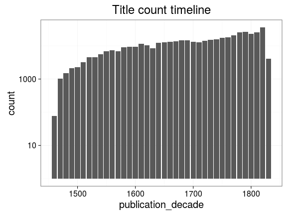
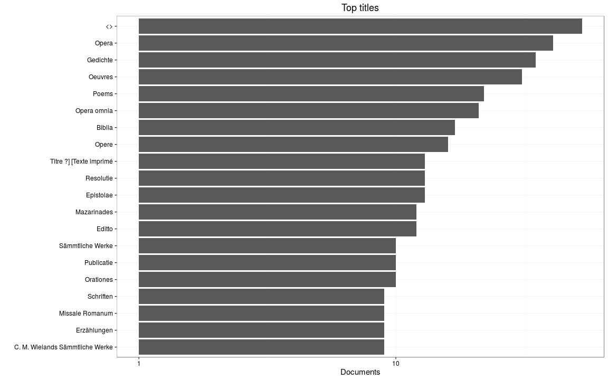

### Publication year

[Publication year conversions](output.tables/publication_year_conversion.csv)

[Publication year discarded](output.tables/publication_year_discarded.csv)

<<<<<<< HEAD
Publication year is available for 91010 documents (100%). The publication years span 1460-1830
=======
Publication year is available for 9223 documents (100%). The publication years span 1465-1830
>>>>>>> 944f9e11c3785f4e18e381ca726a873a0725755b

### Titles

[Publication titles](output.tables/title_accepted.csv)

[Publication titles discarded](output.tables/title_discarded.csv)

[Title harmonization table](output.tables/title_conversion_nontrivial.csv)

<<<<<<< HEAD
Top-20 titles are shown together with the number of documents. This info is available for 90977 documents (100%). There are 88879 unique titles.
=======
Top-20 titles are shown together with the number of documents. This info is available for 9222 documents (100%). There are 9177 unique titles.
>>>>>>> 944f9e11c3785f4e18e381ca726a873a0725755b

## Language

Title count for the 20 unique languages. Some documents may have more than one language listed.

[Unrecognized language entries](output.tables/language_unidentified.csv)  

