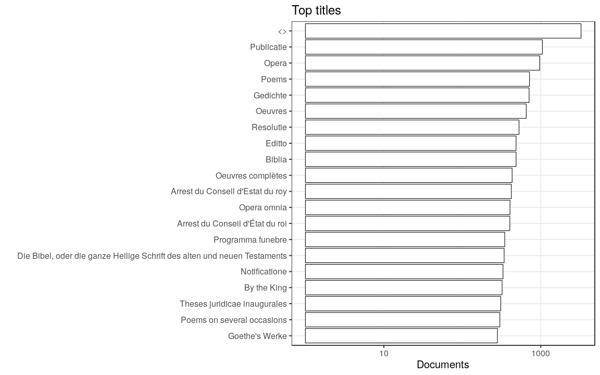

### Publication year

[Publication year conversions](output.tables/publication_year_conversion.csv)

[Publication year discarded](output.tables/publication_year_discarded.csv)

Publication year is available for 5462580 documents (100%). The publication years span 1460-1830

### Titles

[Publication titles](output.tables/title_accepted.csv)

[Publication titles discarded](output.tables/title_discarded.csv)

[Title harmonization table](output.tables/title_conversion_nontrivial.csv)

Top-20 titles are shown together with the number of documents. This info is available for 5460681 documents (100%). There are 4272826 unique titles.

## Language

Statistics:

 * 285 unique languages
 * 181037 docs with multiple languages
 * 1014652 docs (18.57%) with no recognized language 
 
[Language conversions](output.tables/language_conversions.csv) Language codes as in [marc database](http://www.loc.gov/marc/languages/language_code.html); new custom abbreviations can be added in [this table](https://github.com/rOpenGov/bibliographica/blob/master/inst/extdata/language_abbreviations.csv)

[Discarded languages](output.tables/language_discarded.csv)

Title count per language:

