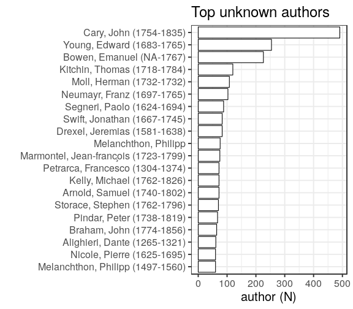
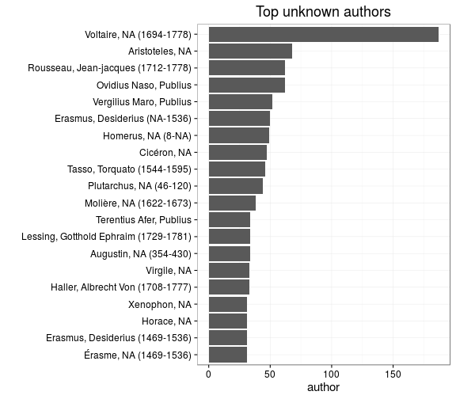
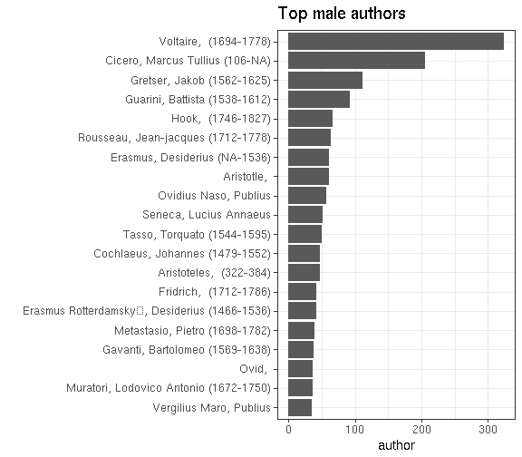

### Gender

[Female authors](output.tables/gender_female.csv)

[Male authors](output.tables/gender_male.csv)

[Authors with missing gender](output.tables/gender_unknown.csv)

Author gender distribution in the complete data:

|author_gender |    docs| fraction|
|:-------------|-------:|--------:|
|female        |  164366|     3.01|
|male          | 2606911|    47.72|
|NA            | 2691303|    49.27|

Author gender distribution over time. Note that the name-gender mappings change over time. This has not been taken into account yet.

