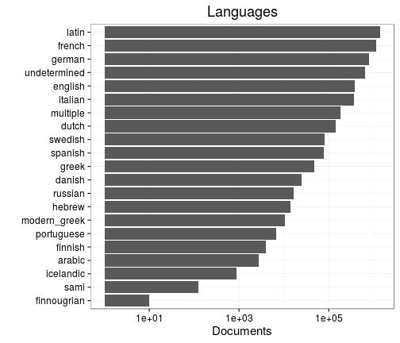

## Language

 * 94 [unique languages](output.tables/language_accepted.csv)
 * The languages may come in [combinations](output.tables/language_conversions.csv)
 * 4506 multilingual documents (5%)  
 * 2567 docs (2.85%) with empty or [unrecognized language](output.tables/language_discarded.csv)

Language codes are from [MARC](http://www.loc.gov/marc/languages/language_code.html); new custom abbreviations can be added in [this table](https://github.com/rOpenGov/bibliographica/blob/master/inst/extdata/language_abbreviations.csv).

Title count per language (including multi-language documents):

### Top languages

Number of documents assigned with each language. For a complete list,
see [accepted languages](output.tables/language_accepted.csv).

|Language | Documents (n)| Fraction (%)|
|:--------|-------------:|------------:|
|Latin    |         30137|         32.4|
|French   |         22699|         24.4|
|English  |         10765|         11.6|
|Italian  |          9808|         10.5|
|German   |          9042|          9.7|
|Dutch    |          2832|          3.0|

