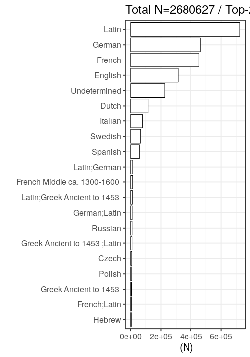

## Language

 * 266 [unique languages](output.tables/language_accepted.csv)
 * 206 [unique primary languages](output.tables/language_accepted.csv)  
 * 2573145 single-language documents (95.99%)
 * 107482 multilingual documents (4.01%) 
 * [Conversions from raw to preprocessed language entries](output.tables/language_conversions.csv) 
 * 226436 documents (8.45%) with [unrecognized language](output.tables/language_discarded.csv)

Language codes are from [MARC](http://www.loc.gov/marc/languages/language_code.html); new custom abbreviations can be added in [this table](https://github.com/COMHIS/bibliographica/blob/master/inst/extdata/language_abbreviations.csv).

Title count per language (including multi-language documents):

### Top languages

Number of documents assigned with each language (top-10). For a complete list,
see [accepted languages](output.tables/language_accepted.csv).

|Language     |Documents (n) |Fraction (%) |
|:------------|:-------------|:------------|
|Latin        |723610        |27           |
|German       |463161        |17.3         |
|French       |454052        |16.9         |
|English      |313745        |11.7         |
|Undetermined |225162        |8.4          |
|Dutch        |114609        |4.3          |
|Italian      |77547         |2.9          |
|Swedish      |65572         |2.4          |
|Spanish      |57428         |2.1          |
|Latin;German |13446         |0.5          |

