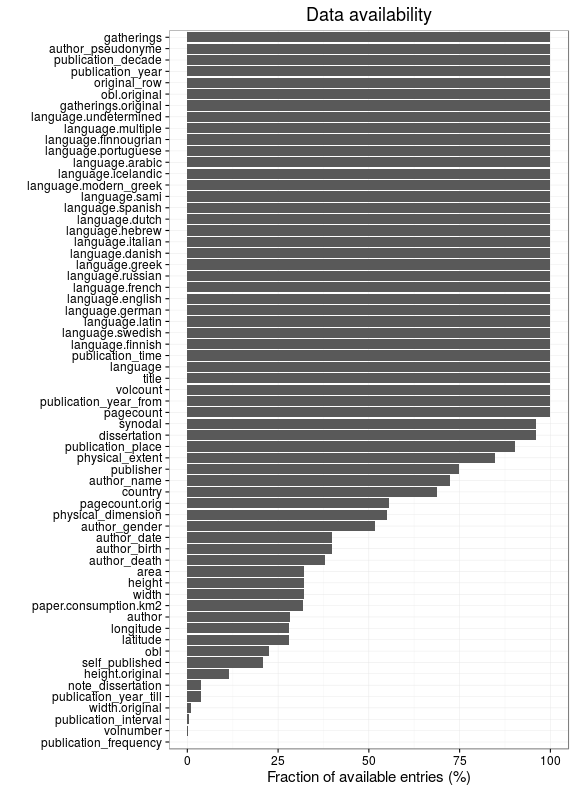

# Preprocessing summary

The data spanning years 1-2013 has been included and contains 2680627 documents (also other filter may apply depending on the data collection, see the source code for details.


## Specific fields

  * [Author info](author.md)
  * [Gender info](gender.md)
  * [Publisher info](publisher.md)
  * [Publication geography](publicationplace.md)
  * [Publication year info](publicationyear.md)
  * [Titles](title.md)  
  * [Page counts](pagecount.md)
  * [Physical dimension](dimension.md)    
  * [Document and subject topics](topic.md)
  * [Languages](language.md)


## Annotated documents

  * 6004893 documents in the original raw data
  * 2680627 documents in the final preprocessed data (44.64%)

Fraction of documents with data:



Same in exact numbers: documents with available/missing entries, and number of unique entries for each field. Sorted by missing data:


|field name              | available (%)| available (n)| missing (%)| unique (n)|
|:-----------------------|-------------:|-------------:|-----------:|----------:|
|volnumber               |           0.0|            41|       100.0|          9|
|parts                   |           0.2|          5784|        99.8|         57|
|width.original          |           2.2|         59323|        97.8|        866|
|publication_year_till   |           3.0|         79853|        97.0|        634|
|first_edition           |          19.6|        524236|        80.4|          3|
|height.original         |          24.2|        648600|        75.8|       1131|
|author_age              |          34.9|        935252|        65.1|        626|
|obl                     |          45.1|       1209949|        54.9|          3|
|author_gender           |          49.0|       1313965|        51.0|          5|
|author_death            |          51.5|       1381105|        48.5|       1041|
|author_birth            |          52.5|       1406233|        47.5|       1224|
|paper                   |          57.9|       1552281|        42.1|      46090|
|area                    |          58.4|       1564515|        41.6|       5917|
|height                  |          58.4|       1564520|        41.6|       1127|
|width                   |          58.4|       1564538|        41.6|        866|
|author_name             |          75.0|       2010999|        25.0|     343293|
|author                  |          75.0|       2011002|        25.0|     369109|
|self_published          |          76.9|       2060518|        23.1|          3|
|publication_country     |          77.0|       2062853|        23.0|         59|
|pagecount.orig          |          80.6|       2161345|        19.4|       3505|
|publisher               |          84.3|       2260169|        15.7|     792622|
|publication_place       |          88.5|       2372974|        11.5|      31939|
|publication_year_from   |          94.1|       2523725|         5.9|        867|
|publication_year        |          94.6|       2536443|         5.4|        890|
|publication_decade      |          94.6|       2536443|         5.4|        154|
|dissertation            |          95.4|       2556442|         4.6|          3|
|synodal                 |          95.4|       2556442|         4.6|          2|
|pagecount               |          99.4|       2665032|         0.6|       3539|
|volcount                |          99.5|       2667720|         0.5|        210|
|pagecount.sheet         |         100.0|       2679594|         0.0|       2147|
|title                   |         100.0|       2680279|         0.0|    2223108|
|obl.original            |         100.0|       2680626|         0.0|          3|
|original_row            |         100.0|       2680627|         0.0|    2680627|
|language_count          |         100.0|       2680627|         0.0|         13|
|multilingual            |         100.0|       2680627|         0.0|          2|
|languages               |         100.0|       2680627|         0.0|       3481|
|language_primary        |         100.0|       2680627|         0.0|        207|
|pagecount.multiplier    |         100.0|       2680627|         0.0|          2|
|pagecount.squarebracket |         100.0|       2680627|         0.0|       1462|
|pagecount.plate         |         100.0|       2680627|         0.0|        747|
|pagecount.arabic        |         100.0|       2680627|         0.0|       3870|
|pagecount.roman         |         100.0|       2680627|         0.0|        897|
|gatherings.original     |         100.0|       2680627|         0.0|         20|
|pagecount_from          |         100.0|       2680627|         0.0|          4|
|author_pseudonyme       |         100.0|       2680627|         0.0|          2|
|gatherings              |         100.0|       2680627|         0.0|         23|
|singlevol               |         100.0|       2680627|         0.0|          2|
|multivol                |         100.0|       2680627|         0.0|          2|
|issue                   |         100.0|       2680627|         0.0|          2|

```
##             used   (Mb) gc trigger   (Mb)  max used   (Mb)
## Ncells  11254187  601.1   79819523 4262.9 124718005 6660.7
## Vcells 452713103 3454.0  983754904 7505.5 983064721 7500.2
```


## Field conversions

This documents the conversions from raw data to the final preprocessed version (accepted, discarded, conversions). Only some of the key tables are explicitly linked below. The complete list of all summary tables is [here](output.tables/).

Brief description of the fields:

 * [Description of the original MARC fields](https://github.com/COMHIS/bibliographica/blob/master/inst/extdata/fieldnames.csv)

 * [Description of the preprocessed fields](https://github.com/COMHIS/bibliographica/blob/master/inst/extdata/fieldnames_polished.csv)


## Histograms of all entries for numeric variables


```
## Error in freq && !equidist: invalid 'x' type in 'x && y'
```


## Histograms of the top entries for factor variables

Non-trivial factors with at least 2 levels are shown.


