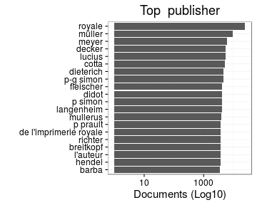

# Preprocessing summary

## Specific fields

  * [Author info](author.md)
  * [Gender info](gender.md)
  * [Publisher info](publisher.md)
  * [Publication geography](publicationplace.md)
  * [Generic document info](documents.md)
  * [Document sizes](size.md)
  * [Document topics](topic.md)


## Field conversions

This documents the conversions from raw data to the final preprocessed version (accepted, discarded, conversions). Only some of the key tables are explicitly linked below. The complete list of all summary tables is [here](output.tables/).

## Annotated documents

Fraction of documents with data:


Same in exact numbers: documents with available/missing entries, and number of unique entries for each field. Sorted by missing data:


|field name                                                          | missing (%)| available (%)| available (n)| unique (n)|
|:-------------------------------------------------------------------|-----------:|-------------:|-------------:|----------:|
|publication_frequency                                               |       100.0|           0.0|             0|          1|
|volnumber                                                           |        99.9|           0.1|          3133|         37|
|publication_interval                                                |        99.5|           0.5|         28459|      24550|
|width.original                                                      |        98.9|           1.1|         62605|        860|
|note_dissertation                                                   |        96.5|           3.5|        193886|      77539|
|publication_year_till                                               |        96.3|           3.7|        202719|        543|
|volcount                                                            |        96.0|           4.0|        217022|        203|
|height.original                                                     |        88.4|          11.6|        635976|       1127|
|obl                                                                 |        77.4|          22.6|       1235159|          3|
|latitude                                                            |        72.7|          27.3|       1490730|         20|
|longitude                                                           |        72.7|          27.3|       1490730|         20|
|paper.consumption.km2                                               |        67.2|          32.8|       1793724|      43883|
|area                                                                |        67.1|          32.9|       1796036|       5944|
|height                                                              |        67.1|          32.9|       1796041|       1123|
|width                                                               |        67.1|          32.9|       1796056|        860|
|author_date                                                         |        61.0|          39.0|       2127986|      59252|
|author_death                                                        |        54.7|          45.3|       2475897|        926|
|author_birth                                                        |        52.2|          47.8|       2612446|       1209|
|author_gender                                                       |        49.3|          50.7|       2771277|          3|
|pagecount.orig                                                      |        45.3|          54.7|       2990458|       4069|
|physical_dimension                                                  |        45.1|          54.9|       3000409|      36256|
|self_published                                                      |        44.0|          56.0|       3059991|          3|
|country                                                             |        31.6|          68.4|       3738943|         61|
|author_name                                                         |        28.7|          71.3|       3892682|     560091|
|author                                                              |        28.7|          71.3|       3892682|     597938|
|publisher                                                           |        25.8|          74.2|       4051713|     923072|
|language                                                            |        18.6|          81.4|       4447928|       4111|
|physical_extent                                                     |        15.7|          84.3|       4602266|    1454489|
|publication_place                                                   |        10.0|          90.0|       4918618|      83309|
|dissertation                                                        |         3.5|          96.5|       5269365|          3|
|synodal                                                             |         3.5|          96.5|       5269365|          2|
|publication_year_from                                               |         0.2|          99.8|       5452929|        372|
|pagecount                                                           |         0.1|          99.9|       5457225|       4210|
|title                                                               |         0.0|         100.0|       5460681|    4272826|
|obl.original                                                        |         0.0|         100.0|       5462578|          3|
|publication_time                                                    |         0.0|         100.0|       5462580|     167215|
|language.French                                                     |         0.0|         100.0|       5462580|          2|
|language.French, Middle (ca. 1300-1600)                             |         0.0|         100.0|       5462580|          1|
|language.Italian                                                    |         0.0|         100.0|       5462580|          2|
|language.Latin                                                      |         0.0|         100.0|       5462580|          2|
|language.German                                                     |         0.0|         100.0|       5462580|          2|
|language.Dutch                                                      |         0.0|         100.0|       5462580|          2|
|language.English                                                    |         0.0|         100.0|       5462580|          2|
|language.Spanish                                                    |         0.0|         100.0|       5462580|          2|
|language.Czech                                                      |         0.0|         100.0|       5462580|          2|
|language.Danish                                                     |         0.0|         100.0|       5462580|          2|
|language.Russian                                                    |         0.0|         100.0|       5462580|          2|
|language.Catalan                                                    |         0.0|         100.0|       5462580|          2|
|language.Polish                                                     |         0.0|         100.0|       5462580|          2|
|language.Portuguese                                                 |         0.0|         100.0|       5462580|          2|
|language.Swedish                                                    |         0.0|         100.0|       5462580|          2|
|language.Undetermined                                               |         0.0|         100.0|       5462580|          2|
|language.Greek, Ancient (to 1453)                                   |         0.0|         100.0|       5462580|          1|
|language.Greek, Modern (1453-)                                      |         0.0|         100.0|       5462580|          1|
|language.Japanese                                                   |         0.0|         100.0|       5462580|          2|
|language.Welsh                                                      |         0.0|         100.0|       5462580|          2|
|language.Yiddish                                                    |         0.0|         100.0|       5462580|          2|
|language.Hebrew                                                     |         0.0|         100.0|       5462580|          2|
|language.Church Slavic                                              |         0.0|         100.0|       5462580|          2|
|language.Romance (Other)                                            |         0.0|         100.0|       5462580|          1|
|language.Arabic                                                     |         0.0|         100.0|       5462580|          2|
|language.Croatian                                                   |         0.0|         100.0|       5462580|          2|
|language.Aramaic                                                    |         0.0|         100.0|       5462580|          2|
|language.Breton                                                     |         0.0|         100.0|       5462580|          2|
|language.Persian                                                    |         0.0|         100.0|       5462580|          2|
|language.English, Old (ca. 450-1100)                                |         0.0|         100.0|       5462580|          1|
|language.Germanic (Other)                                           |         0.0|         100.0|       5462580|          1|
|language.Gothic                                                     |         0.0|         100.0|       5462580|          2|
|language.Icelandic                                                  |         0.0|         100.0|       5462580|          2|
|language.Syriac, Modern                                             |         0.0|         100.0|       5462580|          2|
|language.Ethiopic                                                   |         0.0|         100.0|       5462580|          2|
|language.Macedonian                                                 |         0.0|         100.0|       5462580|          2|
|language.Bulgarian                                                  |         0.0|         100.0|       5462580|          2|
|language.Coptic                                                     |         0.0|         100.0|       5462580|          2|
|language.Chinese                                                    |         0.0|         100.0|       5462580|          2|
|language.Hungarian                                                  |         0.0|         100.0|       5462580|          2|
|language.Romanian                                                   |         0.0|         100.0|       5462580|          2|
|language.Occitan (post 1500)                                        |         0.0|         100.0|       5462580|          1|
|language.Cornish                                                    |         0.0|         100.0|       5462580|          2|
|language.German, Middle High (ca. 1050-1500)                        |         0.0|         100.0|       5462580|          1|
|language.Fang                                                       |         0.0|         100.0|       5462580|          2|
|language.Georgian                                                   |         0.0|         100.0|       5462580|          2|
|language.Albanian                                                   |         0.0|         100.0|       5462580|          2|
|language.Armenian                                                   |         0.0|         100.0|       5462580|          2|
|language.Amharic                                                    |         0.0|         100.0|       5462580|          2|
|language.Indic (Other)                                              |         0.0|         100.0|       5462580|          1|
|language.Malayalam                                                  |         0.0|         100.0|       5462580|          2|
|language.Tibetan                                                    |         0.0|         100.0|       5462580|          2|
|language.Burmese                                                    |         0.0|         100.0|       5462580|          2|
|language.Turkish, Ottoman                                           |         0.0|         100.0|       5462580|          2|
|language.Scots                                                      |         0.0|         100.0|       5462580|          2|
|language.French, Old (ca. 842-1300)                                 |         0.0|         100.0|       5462580|          1|
|language.Tamil                                                      |         0.0|         100.0|       5462580|          2|
|language.Irish                                                      |         0.0|         100.0|       5462580|          2|
|language.Slovak                                                     |         0.0|         100.0|       5462580|          2|
|language.Rajasthani                                                 |         0.0|         100.0|       5462580|          2|
|language.Scottish Gaelix                                            |         0.0|         100.0|       5462580|          2|
|language.Raeto-Romance                                              |         0.0|         100.0|       5462580|          2|
|language.Basque                                                     |         0.0|         100.0|       5462580|          2|
|language.Serbian                                                    |         0.0|         100.0|       5462580|          2|
|language.Slavic (Other)                                             |         0.0|         100.0|       5462580|          1|
|language.Dutch, Middle (ca. 1050-1350)                              |         0.0|         100.0|       5462580|          1|
|language.Philippine (Other)                                         |         0.0|         100.0|       5462580|          1|
|language.Slovenian                                                  |         0.0|         100.0|       5462580|          2|
|language.Lithuanian                                                 |         0.0|         100.0|       5462580|          2|
|language.Syriac                                                     |         0.0|         100.0|       5462580|          2|
|language.Iranian (Other)                                            |         0.0|         100.0|       5462580|          1|
|language.Altai                                                      |         0.0|         100.0|       5462580|          2|
|language.Sorbian (Other)                                            |         0.0|         100.0|       5462580|          1|
|language.Ukrainian                                                  |         0.0|         100.0|       5462580|          2|
|language.Finnish                                                    |         0.0|         100.0|       5462580|          2|
|language.Norwegian                                                  |         0.0|         100.0|       5462580|          2|
|language.Kalâtdlisut                                                |         0.0|         100.0|       5462580|          2|
|language.Sami                                                       |         0.0|         100.0|       5462580|          2|
|language.Tagalog                                                    |         0.0|         100.0|       5462580|          2|
|language.Low German                                                 |         0.0|         100.0|       5462580|          2|
|language.Semitic (Other)                                            |         0.0|         100.0|       5462580|          1|
|language.German, Old High (ca. 750-1050)                            |         0.0|         100.0|       5462580|          1|
|language.Scottish Gaelic                                            |         0.0|         100.0|       5462580|          2|
|language.Latvian                                                    |         0.0|         100.0|       5462580|          2|
|language.Sanskrit                                                   |         0.0|         100.0|       5462580|          2|
|language.English, Middle (1100-1500)                                |         0.0|         100.0|       5462580|          1|
|language.Mongolian                                                  |         0.0|         100.0|       5462580|          2|
|language.Choctaw                                                    |         0.0|         100.0|       5462580|          2|
|language.Malay                                                      |         0.0|         100.0|       5462580|          2|
|language.Frisian                                                    |         0.0|         100.0|       5462580|          2|
|language.Aymara                                                     |         0.0|         100.0|       5462580|          2|
|language.Occitan (post-1500)                                        |         0.0|         100.0|       5462580|          1|
|language.Turkish                                                    |         0.0|         100.0|       5462580|          2|
|language.Maltese                                                    |         0.0|         100.0|       5462580|          2|
|language.Baltic (Other)                                             |         0.0|         100.0|       5462580|          1|
|language.Faroese                                                    |         0.0|         100.0|       5462580|          2|
|language.Eskimo languages                                           |         0.0|         100.0|       5462580|          2|
|language.Samaritan Aramaic                                          |         0.0|         100.0|       5462580|          2|
|language.Old Persian (ca. 600-400 B.C.)                             |         0.0|         100.0|       5462580|          1|
|language.Provençal (to 1500)                                        |         0.0|         100.0|       5462580|          1|
|language.Finno-Ugrian (Other)                                       |         0.0|         100.0|       5462580|          1|
|language.Old Norse                                                  |         0.0|         100.0|       5462580|          2|
|language.North American Indian (Other)                              |         0.0|         100.0|       5462580|          1|
|language.Caddo                                                      |         0.0|         100.0|       5462580|          1|
|language.Sinhalese                                                  |         0.0|         100.0|       5462580|          2|
|language.Romani                                                     |         0.0|         100.0|       5462580|          2|
|language.Malagasy                                                   |         0.0|         100.0|       5462580|          2|
|language.Chagatai                                                   |         0.0|         100.0|       5462580|          2|
|language.Algonquian (Other)                                         |         0.0|         100.0|       5462580|          1|
|language.Mohawk                                                     |         0.0|         100.0|       5462580|          2|
|language.Bengali                                                    |         0.0|         100.0|       5462580|          2|
|language.Assamese                                                   |         0.0|         100.0|       5462580|          2|
|language.Kachin                                                     |         0.0|         100.0|       5462580|          1|
|language.Urdu                                                       |         0.0|         100.0|       5462580|          2|
|language.Manx                                                       |         0.0|         100.0|       5462580|          2|
|language.Delaware                                                   |         0.0|         100.0|       5462580|          2|
|language.Creoles and Pidgins (Other)                                |         0.0|         100.0|       5462580|          1|
|language.Interlingua (International Auxiliary Language Association) |         0.0|         100.0|       5462580|          1|
|language.Telugu                                                     |         0.0|         100.0|       5462580|          2|
|language.Miscellaneous languages                                    |         0.0|         100.0|       5462580|          2|
|language.Herero                                                     |         0.0|         100.0|       5462580|          2|
|language.Wolof                                                      |         0.0|         100.0|       5462580|          2|
|language.Bambara                                                    |         0.0|         100.0|       5462580|          2|
|language.Susu                                                       |         0.0|         100.0|       5462580|          2|
|language.Esperanto                                                  |         0.0|         100.0|       5462580|          2|
|language.Marwari                                                    |         0.0|         100.0|       5462580|          2|
|language.Hindi                                                      |         0.0|         100.0|       5462580|          2|
|language.Nauru                                                      |         0.0|         100.0|       5462580|          2|
|language.Niger-Kordofanian (Other)                                  |         0.0|         100.0|       5462580|          1|
|language.Tatar                                                      |         0.0|         100.0|       5462580|          2|
|language.Estonian                                                   |         0.0|         100.0|       5462580|          2|
|language.Salishan languages                                         |         0.0|         100.0|       5462580|          2|
|language.Corsican                                                   |         0.0|         100.0|       5462580|          2|
|language.Carib                                                      |         0.0|         100.0|       5462580|          2|
|language.Nahuatl                                                    |         0.0|         100.0|       5462580|          2|
|language.Otomian languages                                          |         0.0|         100.0|       5462580|          2|
|language.Ladino                                                     |         0.0|         100.0|       5462580|          2|
|language.Prakrit languages                                          |         0.0|         100.0|       5462580|          2|
|language.Central American Indian (Other)                            |         0.0|         100.0|       5462580|          1|
|language.Egyptian                                                   |         0.0|         100.0|       5462580|          2|
|language.Braj                                                       |         0.0|         100.0|       5462580|          2|
|language.Oriya                                                      |         0.0|         100.0|       5462580|          2|
|language.Quechua                                                    |         0.0|         100.0|       5462580|          2|
|language.Achinese                                                   |         0.0|         100.0|       5462580|          2|
|language.Athapascan (Other)                                         |         0.0|         100.0|       5462580|          1|
|language.Judeo-Arabic                                               |         0.0|         100.0|       5462580|          2|
|language.Indo-European (Other)                                      |         0.0|         100.0|       5462580|          1|
|language.Efik                                                       |         0.0|         100.0|       5462580|          2|
|language.Mari                                                       |         0.0|         100.0|       5462580|          2|
|language.Celtic (Other)                                             |         0.0|         100.0|       5462580|          1|
|language.Tetum                                                      |         0.0|         100.0|       5462580|          2|
|language.Rundi                                                      |         0.0|         100.0|       5462580|          2|
|language.Javanese                                                   |         0.0|         100.0|       5462580|          2|
|language.South American Indian (Other)                              |         0.0|         100.0|       5462580|          1|
|language.Sukuma                                                     |         0.0|         100.0|       5462580|          2|
|language.Maori                                                      |         0.0|         100.0|       5462580|          2|
|language.Hausa                                                      |         0.0|         100.0|       5462580|          2|
|language.Iroquoian (Other)                                          |         0.0|         100.0|       5462580|          1|
|language.Ojibwa                                                     |         0.0|         100.0|       5462580|          2|
|language.Tahitian                                                   |         0.0|         100.0|       5462580|          2|
|language.Pohnpeian                                                  |         0.0|         100.0|       5462580|          2|
|language.Minangkabau                                                |         0.0|         100.0|       5462580|          2|
|language.Creek                                                      |         0.0|         100.0|       5462580|          2|
|language.Avestan                                                    |         0.0|         100.0|       5462580|          2|
|language.Swahili                                                    |         0.0|         100.0|       5462580|          2|
|language.Gã                                                         |         0.0|         100.0|       5462580|          2|
|language.Yupik languages                                            |         0.0|         100.0|       5462580|          2|
|language.Pahlavi                                                    |         0.0|         100.0|       5462580|          2|
|language.Nepali                                                     |         0.0|         100.0|       5462580|          2|
|language.Belarusian                                                 |         0.0|         100.0|       5462580|          2|
|language.Indonesian                                                 |         0.0|         100.0|       5462580|          2|
|language.Hawaiian                                                   |         0.0|         100.0|       5462580|          2|
|language.Fon                                                        |         0.0|         100.0|       5462580|          2|
|language.Mapuche                                                    |         0.0|         100.0|       5462580|          2|
|language.Marathi                                                    |         0.0|         100.0|       5462580|          2|
|language.Grebo                                                      |         0.0|         100.0|       5462580|          2|
|language.Fanti                                                      |         0.0|         100.0|       5462580|          1|
|language.Berber (Other)                                             |         0.0|         100.0|       5462580|          1|
|language.Pali                                                       |         0.0|         100.0|       5462580|          2|
|language.Vietnamese                                                 |         0.0|         100.0|       5462580|          2|
|language.Kurdish                                                    |         0.0|         100.0|       5462580|          2|
|language.Lamba (Zambia and Congo)                                   |         0.0|         100.0|       5462580|          1|
|language.Komi                                                       |         0.0|         100.0|       5462580|          2|
|language.Guarani                                                    |         0.0|         100.0|       5462580|          2|
|language.Slavey                                                     |         0.0|         100.0|       5462580|          2|
|language.Tlingit                                                    |         0.0|         100.0|       5462580|          2|
|language.Kannada                                                    |         0.0|         100.0|       5462580|          2|
|language.Palauan                                                    |         0.0|         100.0|       5462580|          2|
|language.Galician                                                   |         0.0|         100.0|       5462580|          2|
|language.Phoenician                                                 |         0.0|         100.0|       5462580|          2|
|language.Turkmen                                                    |         0.0|         100.0|       5462580|          2|
|language.Chechen                                                    |         0.0|         100.0|       5462580|          2|
|language.Arawak                                                     |         0.0|         100.0|       5462580|          2|
|language.Gujarati                                                   |         0.0|         100.0|       5462580|          2|
|language.Oirat                                                      |         0.0|         100.0|       5462580|          2|
|language.Chuvash                                                    |         0.0|         100.0|       5462580|          2|
|language.Marshallese                                                |         0.0|         100.0|       5462580|          2|
|language.Ossetic                                                    |         0.0|         100.0|       5462580|          2|
|language.Moldavian                                                  |         0.0|         100.0|       5462580|          2|
|language.Apache languages                                           |         0.0|         100.0|       5462580|          2|
|language.Gwich'in                                                   |         0.0|         100.0|       5462580|          2|
|language.Manchu                                                     |         0.0|         100.0|       5462580|          2|
|language.Awadhi                                                     |         0.0|         100.0|       5462580|          2|
|language.Magahi                                                     |         0.0|         100.0|       5462580|          2|
|language.Abkhaz                                                     |         0.0|         100.0|       5462580|          2|
|language.Ewe                                                        |         0.0|         100.0|       5462580|          2|
|language.Lower Sorbian                                              |         0.0|         100.0|       5462580|          2|
|language.Mayan languages                                            |         0.0|         100.0|       5462580|          2|
|language.Cebuano                                                    |         0.0|         100.0|       5462580|          2|
|language.Zapotec                                                    |         0.0|         100.0|       5462580|          2|
|language.Osage                                                      |         0.0|         100.0|       5462580|          2|
|language.Tajik                                                      |         0.0|         100.0|       5462580|          2|
|language.Samoan                                                     |         0.0|         100.0|       5462580|          2|
|language.Aljamía                                                    |         0.0|         100.0|       5462580|          2|
|language.Kosraean                                                   |         0.0|         100.0|       5462580|          2|
|language.Panjabi                                                    |         0.0|         100.0|       5462580|          2|
|language.Khasi                                                      |         0.0|         100.0|       5462580|          2|
|language.Iban                                                       |         0.0|         100.0|       5462580|          2|
|language.Elamite                                                    |         0.0|         100.0|       5462580|          2|
|language.Friulian                                                   |         0.0|         100.0|       5462580|          2|
|language.Sardinian                                                  |         0.0|         100.0|       5462580|          2|
|language.Lahndā                                                     |         0.0|         100.0|       5462580|          2|
|language.Creoles and Pidgins, English-based (Other)                 |         0.0|         100.0|       5462580|          1|
|language.Acoli                                                      |         0.0|         100.0|       5462580|          2|
|language.Kamba                                                      |         0.0|         100.0|       5462580|          2|
|language.Pushto                                                     |         0.0|         100.0|       5462580|          2|
|language.Inuktitut                                                  |         0.0|         100.0|       5462580|          2|
|language.Madurese                                                   |         0.0|         100.0|       5462580|          2|
|language.Dogri                                                      |         0.0|         100.0|       5462580|          2|
|language.Kashmiri                                                   |         0.0|         100.0|       5462580|          2|
|language.Konkani                                                    |         0.0|         100.0|       5462580|          2|
|language.Northern Sami                                              |         0.0|         100.0|       5462580|          2|
|language.Artificial (Other)                                         |         0.0|         100.0|       5462580|          1|
|language.Sranan                                                     |         0.0|         100.0|       5462580|          2|
|language.Afrihili (Artificial language)                             |         0.0|         100.0|       5462580|          1|
|language.Kyrgyz                                                     |         0.0|         100.0|       5462580|          1|
|language.Thai                                                       |         0.0|         100.0|       5462580|          2|
|language.Adygei                                                     |         0.0|         100.0|       5462580|          2|
|language.Adangme                                                    |         0.0|         100.0|       5462580|          2|
|language.Chamorro                                                   |         0.0|         100.0|       5462580|          2|
|language.Walloon                                                    |         0.0|         100.0|       5462580|          2|
|language.Ainu                                                       |         0.0|         100.0|       5462580|          2|
|language.Dravidian (Other)                                          |         0.0|         100.0|       5462580|          1|
|language.Mandar                                                     |         0.0|         100.0|       5462580|          2|
|language.Altaic (Other)                                             |         0.0|         100.0|       5462580|          1|
|language.Ugaritic                                                   |         0.0|         100.0|       5462580|          2|
|language.Akkadian                                                   |         0.0|         100.0|       5462580|          2|
|language.Korean                                                     |         0.0|         100.0|       5462580|          2|
|language.Newari                                                     |         0.0|         100.0|       5462580|          2|
|language.Khoisan (Other)                                            |         0.0|         100.0|       5462580|          1|
|language.Cherokee                                                   |         0.0|         100.0|       5462580|          2|
|language.Irish, Middle (ca. 1100-1550)                              |         0.0|         100.0|       5462580|          1|
|language.Sign languages                                             |         0.0|         100.0|       5462580|          2|
|language.Ekajuk                                                     |         0.0|         100.0|       5462580|          2|
|language.Aragonese                                                  |         0.0|         100.0|       5462580|          2|
|language.Bashkir                                                    |         0.0|         100.0|       5462580|          2|
|language.Afrikaans                                                  |         0.0|         100.0|       5462580|          2|
|language.Afroasiatic (Other)                                        |         0.0|         100.0|       5462580|          1|
|language.Lao                                                        |         0.0|         100.0|       5462580|          2|
|language.Kimbundu                                                   |         0.0|         100.0|       5462580|          2|
|language.Aleut                                                      |         0.0|         100.0|       5462580|          2|
|language.Bemba                                                      |         0.0|         100.0|       5462580|          2|
|language.Tswana                                                     |         0.0|         100.0|       5462580|          2|
|language.Siksika                                                    |         0.0|         100.0|       5462580|          2|
|language.Austronesian (Other)                                       |         0.0|         100.0|       5462580|          1|
|language.Afar                                                       |         0.0|         100.0|       5462580|          2|
|language.Judeo-Persian                                              |         0.0|         100.0|       5462580|          2|
|language.Kabyle                                                     |         0.0|         100.0|       5462580|          2|
|language.Irish, Old (to 1100)                                       |         0.0|         100.0|       5462580|          1|
|language.Caucasian (Other)                                          |         0.0|         100.0|       5462580|          1|
|language.Ingush                                                     |         0.0|         100.0|       5462580|          2|
|language.Kabardian                                                  |         0.0|         100.0|       5462580|          2|
|language.Kazakh                                                     |         0.0|         100.0|       5462580|          2|
|language.Mandingo                                                   |         0.0|         100.0|       5462580|          2|
|language.Ndebele (Zimbabwe)                                         |         0.0|         100.0|       5462580|          1|
|language.Upper Sorbian                                              |         0.0|         100.0|       5462580|          2|
|language.Gondi                                                      |         0.0|         100.0|       5462580|          2|
|language.Cree                                                       |         0.0|         100.0|       5462580|          2|
|language.Sandawe                                                    |         0.0|         100.0|       5462580|          2|
|language.Norwegian (Bokmål)                                         |         0.0|         100.0|       5462580|          1|
|language.Norwegian (Nynorsk)                                        |         0.0|         100.0|       5462580|          1|
|language.Australian languages                                       |         0.0|         100.0|       5462580|          2|
|language.Southern Sami                                              |         0.0|         100.0|       5462580|          2|
|language.Angika                                                     |         0.0|         100.0|       5462580|          2|
|language.Kongo                                                      |         0.0|         100.0|       5462580|          2|
|language.Multiple languages                                         |         0.0|         100.0|       5462580|          2|
|gatherings.original                                                 |         0.0|         100.0|       5462580|         20|
|original_row                                                        |         0.0|         100.0|       5462580|    5462580|
|publication_year                                                    |         0.0|         100.0|       5462580|        371|
|publication_decade                                                  |         0.0|         100.0|       5462580|         38|
|author_pseudonyme                                                   |         0.0|         100.0|       5462580|          2|
|gatherings                                                          |         0.0|         100.0|       5462580|         20|


## Histograms of all entries for numeric variables


## Histograms of the top entries for factor variables


```
## Error in dfs$names: $ operator is invalid for atomic vectors
```




