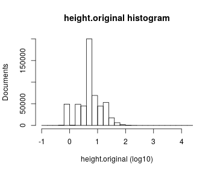

# Preprocessing summary

## Specific fields

  * [Author info](author.md)
  * [Gender info](gender.md)
  * [Publisher info](publisher.md)
  * [Publication geography](publicationplace.md)
  * [Generic document info](documents.md)
  * [Document sizes](size.md)
  * [Document topics](topic.md)


## Field conversions

This documents the conversions from raw data to the final preprocessed version (accepted, discarded, conversions). Only some of the key tables are explicitly linked below. The complete list of all summary tables is [here](output.tables/).

## Annotated documents

Fraction of documents with data:


Same in exact numbers: documents with available/missing entries, and number of unique entries for each field. Sorted by missing data:


|field name            | missing (%)| available (%)| available (n)| unique (n)|
|:---------------------|-----------:|-------------:|-------------:|----------:|
|publication_frequency |       100.0|           0.0|             0|          1|
|volnumber             |        99.9|           0.1|             6|          3|
|publication_interval  |        99.5|           0.5|            45|         45|
|width.original        |        98.9|           1.1|           105|         54|
|publication_year_till |        96.2|           3.8|           349|        157|
|note_dissertation     |        96.1|           3.9|           359|        343|
|height.original       |        88.6|          11.4|          1047|         76|
|self_published        |        79.1|          20.9|          1931|          3|
|obl                   |        77.6|          22.4|          2066|          3|
|latitude              |        72.0|          28.0|          2581|         16|
|longitude             |        72.0|          28.0|          2581|         16|
|author                |        71.8|          28.2|          2600|       2472|
|paper.consumption.km2 |        68.0|          32.0|          2950|       1485|
|width                 |        67.8|          32.2|          2967|         62|
|height                |        67.8|          32.2|          2967|         79|
|area                  |        67.8|          32.2|          2967|        152|
|author_death          |        62.1|          37.9|          3491|        451|
|author_birth          |        60.2|          39.8|          3673|        465|
|author_date           |        60.0|          40.0|          3688|       2839|
|author_gender         |        48.4|          51.6|          4758|          3|
|physical_dimension    |        44.9|          55.1|          5078|        577|
|pagecount.orig        |        44.4|          55.6|          5126|        852|
|country               |        31.2|          68.8|          6349|         28|
|author_name           |        27.7|          72.3|          6672|       5748|
|publisher             |        25.1|          74.9|          6908|       5849|
|physical_extent       |        15.4|          84.6|          7804|       5318|
|publication_place     |         9.7|          90.3|          8330|       1380|
|dissertation          |         3.9|          96.1|          8864|          2|
|synodal               |         3.9|          96.1|          8864|          2|
|pagecount             |         0.2|          99.8|          9206|        869|
|publication_year_from |         0.2|          99.8|          9209|        361|
|volcount              |         0.1|          99.9|          9217|         22|
|title                 |         0.0|         100.0|          9222|       9177|
|language              |         0.0|         100.0|          9223|          1|
|publication_time      |         0.0|         100.0|          9223|       1856|
|language.finnish      |         0.0|         100.0|          9223|          2|
|language.swedish      |         0.0|         100.0|          9223|          2|
|language.latin        |         0.0|         100.0|          9223|          2|
|language.german       |         0.0|         100.0|          9223|          2|
|language.english      |         0.0|         100.0|          9223|          2|
|language.french       |         0.0|         100.0|          9223|          2|
|language.russian      |         0.0|         100.0|          9223|          2|
|language.greek        |         0.0|         100.0|          9223|          2|
|language.danish       |         0.0|         100.0|          9223|          2|
|language.italian      |         0.0|         100.0|          9223|          2|
|language.hebrew       |         0.0|         100.0|          9223|          2|
|language.dutch        |         0.0|         100.0|          9223|          2|
|language.spanish      |         0.0|         100.0|          9223|          2|
|language.sami         |         0.0|         100.0|          9223|          1|
|language.modern_greek |         0.0|         100.0|          9223|          2|
|language.icelandic    |         0.0|         100.0|          9223|          2|
|language.arabic       |         0.0|         100.0|          9223|          2|
|language.portuguese   |         0.0|         100.0|          9223|          2|
|language.finnougrian  |         0.0|         100.0|          9223|          1|
|language.multiple     |         0.0|         100.0|          9223|          2|
|language.undetermined |         0.0|         100.0|          9223|          2|
|gatherings.original   |         0.0|         100.0|          9223|         11|
|obl.original          |         0.0|         100.0|          9223|          2|
|original_row          |         0.0|         100.0|          9223|       9223|
|publication_year      |         0.0|         100.0|          9223|        360|
|publication_decade    |         0.0|         100.0|          9223|         38|
|author_pseudonyme     |         0.0|         100.0|          9223|          2|
|gatherings            |         0.0|         100.0|          9223|         11|


## Histograms of all entries for numeric variables



## Histograms of the top entries for factor variables


```
## Error in dfs$names: $ operator is invalid for atomic vectors
```


