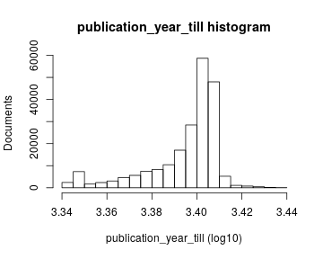
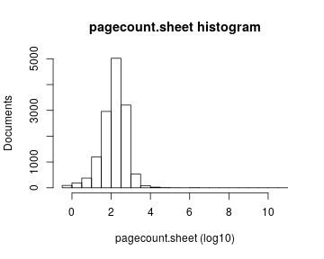
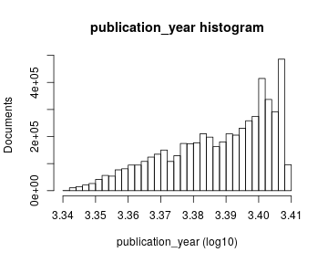
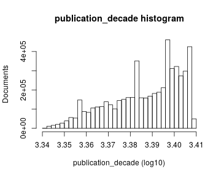
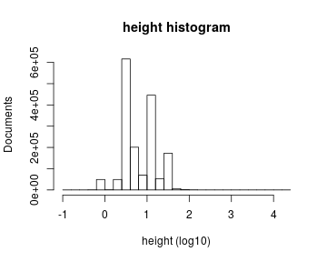

# Preprocessing summary

## Specific fields

  * [Author info](author.md)
  * [Gender info](gender.md)
  * [Publisher info](publisher.md)
  * [Publication geography](publicationplace.md)
  * [Publication year info](publicationyear.md)
  * [Titles](title.md)  
  * [Page counts](pagecount.md)
  * [Physical dimension](dimension.md)    
  * [Document and subject topics](topic.md)
  * [Languages](language.md)

## Field conversions

This documents the conversions from raw data to the final preprocessed version (accepted, discarded, conversions). Only some of the key tables are explicitly linked below. The complete list of all summary tables is [here](output.tables/).

## Annotated documents

  * 6004893 documents in the original raw data
  * 90127 documents in the final preprocessed data (1.5%)

Fraction of documents with data:

Same in exact numbers: documents with available/missing entries, and number of unique entries for each field. Sorted by missing data:

|field name                                | missing (%)| available (%)| available (n)| unique (n)|
|:-----------------------------------------|-----------:|-------------:|-------------:|----------:|
|volnumber                                 |        99.9|           0.1|            87|         16|
|parts                                     |        99.7|           0.3|           246|         20|
|width.original                            |        99.2|           0.8|           723|        187|
|publication_year_till                     |        96.8|           3.2|          2885|        373|
|volcount                                  |        94.7|           5.3|          4734|         53|
|obl                                       |        91.4|           8.6|          7740|          3|
|first_edition                             |        90.7|           9.3|          8365|          3|
|height.original                           |        69.1|          30.9|         27839|        227|
|paper                                     |        62.4|          37.6|         33862|      11078|
|paper.check                               |        62.4|          37.6|         33862|      11078|
|width                                     |        61.4|          38.6|         34747|        196|
|height                                    |        61.4|          38.6|         34747|        231|
|area                                      |        61.4|          38.6|         34747|        487|
|author_death                              |        59.1|          40.9|         36821|        661|
|author_gender                             |        58.3|          41.7|         37553|          5|
|author_birth                              |        58.1|          41.9|         37798|        674|
|self_published                            |        41.8|          58.2|         52466|          2|
|author_name                               |        36.0|          64.0|         57679|      27054|
|author                                    |        36.0|          64.0|         57679|      27853|
|pagecount.orig                            |        33.9|          66.1|         59606|       1550|
|country                                   |        26.6|          73.4|         66150|         37|
|publisher                                 |        16.3|          83.7|         75445|      48634|
|latitude                                  |        15.1|          84.9|         76537|        286|
|longitude                                 |        15.1|          84.9|         76537|        286|
|publication_place                         |        12.8|          87.2|         78557|       3474|
|language                                  |         2.8|          97.2|         87560|        448|
|pagecount                                 |         1.2|          98.8|         89087|       1587|
|dissertation                              |         0.4|          99.6|         89772|          2|
|synodal                                   |         0.4|          99.6|         89772|          2|
|publication_year_from                     |         0.1|          99.9|         90043|        368|
|title                                     |         0.0|         100.0|         90090|      84430|
|language.French                           |         0.0|         100.0|         90127|          2|
|language.French Middle ca. 1300-1600      |         0.0|         100.0|         90127|          2|
|language.Italian                          |         0.0|         100.0|         90127|          2|
|language.Latin                            |         0.0|         100.0|         90127|          2|
|language.German                           |         0.0|         100.0|         90127|          2|
|language.Dutch                            |         0.0|         100.0|         90127|          2|
|language.English                          |         0.0|         100.0|         90127|          2|
|language.Spanish                          |         0.0|         100.0|         90127|          2|
|language.Czech                            |         0.0|         100.0|         90127|          2|
|language.Danish                           |         0.0|         100.0|         90127|          2|
|language.Russian                          |         0.0|         100.0|         90127|          2|
|language.Catalan                          |         0.0|         100.0|         90127|          2|
|language.Polish                           |         0.0|         100.0|         90127|          2|
|language.Portuguese                       |         0.0|         100.0|         90127|          2|
|language.Swedish                          |         0.0|         100.0|         90127|          2|
|language.Undetermined                     |         0.0|         100.0|         90127|          2|
|language.Greek Ancient to 1453            |         0.0|         100.0|         90127|          2|
|language.Greek Modern 1453-               |         0.0|         100.0|         90127|          2|
|language.Japanese                         |         0.0|         100.0|         90127|          2|
|language.Welsh                            |         0.0|         100.0|         90127|          2|
|language.Yiddish                          |         0.0|         100.0|         90127|          2|
|language.Hebrew                           |         0.0|         100.0|         90127|          2|
|language.Church Slavic                    |         0.0|         100.0|         90127|          2|
|language.Romance Other                    |         0.0|         100.0|         90127|          2|
|language.Arabic                           |         0.0|         100.0|         90127|          2|
|language.Croatian                         |         0.0|         100.0|         90127|          2|
|language.Aramaic                          |         0.0|         100.0|         90127|          2|
|language.Breton                           |         0.0|         100.0|         90127|          2|
|language.Persian                          |         0.0|         100.0|         90127|          2|
|language.English Old ca. 450-1100         |         0.0|         100.0|         90127|          2|
|language.Germanic Other                   |         0.0|         100.0|         90127|          2|
|language.Gothic                           |         0.0|         100.0|         90127|          2|
|language.Icelandic                        |         0.0|         100.0|         90127|          2|
|language.Syriac Modern                    |         0.0|         100.0|         90127|          2|
|language.Ethiopic                         |         0.0|         100.0|         90127|          2|
|language.Macedonian                       |         0.0|         100.0|         90127|          1|
|language.Bulgarian                        |         0.0|         100.0|         90127|          1|
|language.Coptic                           |         0.0|         100.0|         90127|          2|
|language.Chinese                          |         0.0|         100.0|         90127|          2|
|language.Hungarian                        |         0.0|         100.0|         90127|          2|
|language.Romanian                         |         0.0|         100.0|         90127|          2|
|language.Occitan post 1500                |         0.0|         100.0|         90127|          2|
|language.Cornish                          |         0.0|         100.0|         90127|          2|
|language.German Middle High ca. 1050-1500 |         0.0|         100.0|         90127|          2|
|language.Fang                             |         0.0|         100.0|         90127|          2|
|language.Georgian                         |         0.0|         100.0|         90127|          2|
|language.Albanian                         |         0.0|         100.0|         90127|          2|
|language.Armenian                         |         0.0|         100.0|         90127|          2|
|language.Amharic                          |         0.0|         100.0|         90127|          2|
|language.Indic Other                      |         0.0|         100.0|         90127|          2|
|language.Malayalam                        |         0.0|         100.0|         90127|          2|
|language.Tibetan                          |         0.0|         100.0|         90127|          2|
|language.Burmese                          |         0.0|         100.0|         90127|          2|
|language.Turkish Ottoman                  |         0.0|         100.0|         90127|          2|
|language.Scots                            |         0.0|         100.0|         90127|          2|
|language.French Old ca. 842-1300          |         0.0|         100.0|         90127|          2|
|language.Tamil                            |         0.0|         100.0|         90127|          2|
|language.Irish                            |         0.0|         100.0|         90127|          2|
|language.Slovak                           |         0.0|         100.0|         90127|          2|
|language.Rajasthani                       |         0.0|         100.0|         90127|          2|
|language.Scottish Gaelix                  |         0.0|         100.0|         90127|          2|
|language.Raeto-Romance                    |         0.0|         100.0|         90127|          2|
|language.Basque                           |         0.0|         100.0|         90127|          2|
|language.Serbian                          |         0.0|         100.0|         90127|          2|
|language.Slavic Other                     |         0.0|         100.0|         90127|          2|
|language.Dutch Middle ca. 1050-1350       |         0.0|         100.0|         90127|          2|
|language.Philippine Other                 |         0.0|         100.0|         90127|          2|
|language.Slovenian                        |         0.0|         100.0|         90127|          2|
|language.Lithuanian                       |         0.0|         100.0|         90127|          2|
|language.Syriac                           |         0.0|         100.0|         90127|          2|
|language.Iranian Other                    |         0.0|         100.0|         90127|          2|
|language.Altai                            |         0.0|         100.0|         90127|          2|
|language.Sorbian Other                    |         0.0|         100.0|         90127|          2|
|language.Ukrainian                        |         0.0|         100.0|         90127|          2|
|language.Finnish                          |         0.0|         100.0|         90127|          2|
|language.Norwegian                        |         0.0|         100.0|         90127|          2|
|language.Kalâtdlisut                      |         0.0|         100.0|         90127|          2|
|language.Sami                             |         0.0|         100.0|         90127|          2|
|language.Tagalog                          |         0.0|         100.0|         90127|          2|
|language.Low German                       |         0.0|         100.0|         90127|          2|
|language.Semitic Other                    |         0.0|         100.0|         90127|          2|
|language.German Old High ca. 750-1050     |         0.0|         100.0|         90127|          2|
|language.Scottish Gaelic                  |         0.0|         100.0|         90127|          2|
|language.Latvian                          |         0.0|         100.0|         90127|          2|
|language.Sanskrit                         |         0.0|         100.0|         90127|          2|
|language.English Middle 1100-1500         |         0.0|         100.0|         90127|          2|
|language.Mongolian                        |         0.0|         100.0|         90127|          2|
|language.Choctaw                          |         0.0|         100.0|         90127|          2|
|language.Malay                            |         0.0|         100.0|         90127|          2|
|language.Frisian                          |         0.0|         100.0|         90127|          2|
|language.Aymara                           |         0.0|         100.0|         90127|          2|
|language.Occitan post-1500                |         0.0|         100.0|         90127|          2|
|language.Turkish                          |         0.0|         100.0|         90127|          2|
|language.Maltese                          |         0.0|         100.0|         90127|          2|
|language.Baltic Other                     |         0.0|         100.0|         90127|          2|
|multilingual                              |         0.0|         100.0|         90127|          2|
|gatherings.original                       |         0.0|         100.0|         90127|         12|
|obl.original                              |         0.0|         100.0|         90127|          2|
|original_row                              |         0.0|         100.0|         90127|      90127|
|author_pseudonyme                         |         0.0|         100.0|         90127|          2|
|publication_year                          |         0.0|         100.0|         90127|        367|
|publication_decade                        |         0.0|         100.0|         90127|         38|
|gatherings                                |         0.0|         100.0|         90127|         12|
|singlevol                                 |         0.0|         100.0|         90127|          2|
|multivol                                  |         0.0|         100.0|         90127|          2|
|issue                                     |         0.0|         100.0|         90127|          2|

## Histograms of all entries for numeric variables

## Histograms of the top entries for factor variables

Non-trivial factors with at least 2 levels are shown.

