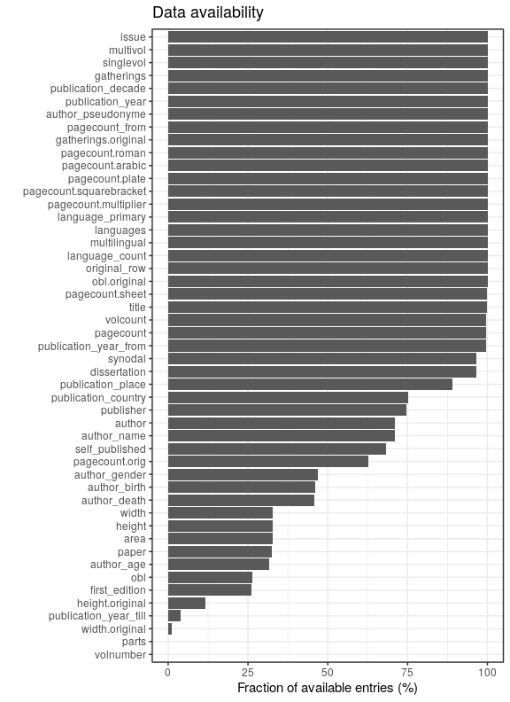
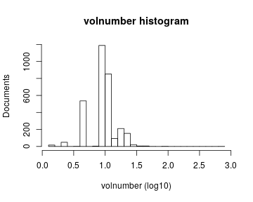

# Preprocessing summary

## Specific fields

  * [Author info](author.md)
  * [Gender info](gender.md)
  * [Publisher info](publisher.md)
  * [Publication geography](publicationplace.md)
  * [Generic document info](documents.md)
  * [Document sizes](size.md)
  * [Document topics](topic.md)


## Field conversions

This documents the conversions from raw data to the final preprocessed version (accepted, discarded, conversions). Only some of the key tables are explicitly linked below. The complete list of all summary tables is [here](output.tables/).

## Annotated documents

Fraction of documents with data:



Same in exact numbers: documents with available/missing entries, and number of unique entries for each field. Sorted by missing data:


|field name                                   | missing (%)| available (%)| available (n)| unique (n)|
|:--------------------------------------------|-----------:|-------------:|-------------:|----------:|
|publication_frequency                        |       100.0|           0.0|             0|          1|
|volnumber                                    |        99.9|           0.1|            11|          5|
|publication_interval                         |        99.5|           0.5|            88|         88|
|width.original                               |        98.7|           1.3|           229|         70|
|note_dissertation                            |        96.3|           3.7|           679|        643|
|publication_year_till                        |        96.2|           3.8|           685|        234|
|height.original                              |        88.5|          11.5|          2097|        103|
|obl                                          |        77.6|          22.4|          4072|          3|
|latitude                                     |        72.4|          27.6|          5027|         17|
|longitude                                    |        72.4|          27.6|          5027|         17|
|paper.consumption.km2                        |        67.5|          32.5|          5919|       2440|
|width                                        |        67.5|          32.5|          5928|         79|
|height                                       |        67.5|          32.5|          5928|        105|
|area                                         |        67.5|          32.5|          5928|        250|
|author_death                                 |        62.4|          37.6|          6852|        472|
|author_date                                  |        60.8|          39.2|          7139|       4765|
|author_birth                                 |        60.4|          39.6|          7221|        493|
|author_gender                                |        48.8|          51.2|          9317|          3|
|physical_dimension                           |        45.2|          54.8|          9982|        911|
|pagecount.orig                               |        44.8|          55.2|         10059|       1023|
|self_published                               |        43.7|          56.3|         10249|          3|
|country                                      |        31.7|          68.3|         12446|         31|
|author_name                                  |        28.7|          71.3|         12992|      10393|
|author                                       |        28.7|          71.3|         12992|      10514|
|publisher                                    |        25.8|          74.2|         13507|      10482|
|physical_extent                              |        15.4|          84.6|         15404|       9669|
|publication_place                            |        10.0|          90.0|         16388|       2175|
|dissertation                                 |         3.7|          96.3|         17533|          2|
|synodal                                      |         3.7|          96.3|         17533|          2|
|publication_year_from                        |         0.2|          99.8|         18177|        364|
|volcount                                     |         0.1|          99.9|         18201|         25|
|pagecount                                    |         0.0|         100.0|         18203|       1045|
|title                                        |         0.0|         100.0|         18207|      18065|
|publication_time                             |         0.0|         100.0|         18212|       2819|
|language.Latin                               |         0.0|         100.0|         18212|          2|
|language.Italian                             |         0.0|         100.0|         18212|          2|
|language.Spanish                             |         0.0|         100.0|         18212|          2|
|language.Undetermined                        |         0.0|         100.0|         18212|          2|
|language.French                              |         0.0|         100.0|         18212|          2|
|language.German                              |         0.0|         100.0|         18212|          2|
|language.English                             |         0.0|         100.0|         18212|          2|
|language.Dutch                               |         0.0|         100.0|         18212|          2|
|language.Greek, Ancient (to 1453)            |         0.0|         100.0|         18212|          1|
|language.Swedish                             |         0.0|         100.0|         18212|          2|
|language.Polish                              |         0.0|         100.0|         18212|          2|
|language.Portuguese                          |         0.0|         100.0|         18212|          2|
|language.Russian                             |         0.0|         100.0|         18212|          2|
|language.Sanskrit                            |         0.0|         100.0|         18212|          2|
|language.Multiple languages                  |         0.0|         100.0|         18212|          2|
|language.Low German                          |         0.0|         100.0|         18212|          2|
|language.French, Middle (ca. 1300-1600)      |         0.0|         100.0|         18212|          1|
|language.Czech                               |         0.0|         100.0|         18212|          2|
|language.Hebrew                              |         0.0|         100.0|         18212|          2|
|language.Danish                              |         0.0|         100.0|         18212|          2|
|language.Panjabi                             |         0.0|         100.0|         18212|          2|
|language.Greek, Modern (1453-)               |         0.0|         100.0|         18212|          1|
|language.Ladino                              |         0.0|         100.0|         18212|          2|
|language.Ethiopic                            |         0.0|         100.0|         18212|          2|
|language.Chinese                             |         0.0|         100.0|         18212|          2|
|language.Burmese                             |         0.0|         100.0|         18212|          1|
|language.Finnish                             |         0.0|         100.0|         18212|          2|
|language.Hungarian                           |         0.0|         100.0|         18212|          2|
|language.Hindi                               |         0.0|         100.0|         18212|          2|
|language.Arabic                              |         0.0|         100.0|         18212|          2|
|language.Ndebele (Zimbabwe)                  |         0.0|         100.0|         18212|          1|
|language.Gothic                              |         0.0|         100.0|         18212|          2|
|language.Scottish Gaelic                     |         0.0|         100.0|         18212|          2|
|language.Scottish Gaelix                     |         0.0|         100.0|         18212|          2|
|language.Norwegian                           |         0.0|         100.0|         18212|          2|
|language.Latvian                             |         0.0|         100.0|         18212|          2|
|language.Algonquian (Other)                  |         0.0|         100.0|         18212|          1|
|language.Croatian                            |         0.0|         100.0|         18212|          2|
|language.Japanese                            |         0.0|         100.0|         18212|          2|
|language.Oriya                               |         0.0|         100.0|         18212|          2|
|language.Icelandic                           |         0.0|         100.0|         18212|          2|
|language.Norwegian (Bokmål)                  |         0.0|         100.0|         18212|          1|
|language.Yiddish                             |         0.0|         100.0|         18212|          2|
|language.English, Old (ca. 450-1100)         |         0.0|         100.0|         18212|          1|
|language.Syriac, Modern                      |         0.0|         100.0|         18212|          2|
|language.Lithuanian                          |         0.0|         100.0|         18212|          2|
|language.Oirat                               |         0.0|         100.0|         18212|          1|
|language.Estonian                            |         0.0|         100.0|         18212|          2|
|language.Tamil                               |         0.0|         100.0|         18212|          2|
|language.Slovenian                           |         0.0|         100.0|         18212|          2|
|language.Welsh                               |         0.0|         100.0|         18212|          2|
|language.Frisian                             |         0.0|         100.0|         18212|          2|
|language.Romance (Other)                     |         0.0|         100.0|         18212|          1|
|language.Armenian                            |         0.0|         100.0|         18212|          2|
|language.Persian                             |         0.0|         100.0|         18212|          2|
|language.Occitan (post-1500)                 |         0.0|         100.0|         18212|          1|
|language.Basque                              |         0.0|         100.0|         18212|          2|
|language.Church Slavic                       |         0.0|         100.0|         18212|          2|
|language.German, Middle High (ca. 1050-1500) |         0.0|         100.0|         18212|          1|
|language.mul                                 |         0.0|         100.0|         18212|          2|
|language                                     |         0.0|         100.0|         18212|        177|
|gatherings.original                          |         0.0|         100.0|         18212|         12|
|obl.original                                 |         0.0|         100.0|         18212|          2|
|original_row                                 |         0.0|         100.0|         18212|      18212|
|publication_year                             |         0.0|         100.0|         18212|        363|
|publication_decade                           |         0.0|         100.0|         18212|         38|
|author_pseudonyme                            |         0.0|         100.0|         18212|          2|
|gatherings                                   |         0.0|         100.0|         18212|         12|


## Histograms of all entries for numeric variables



## Histograms of the top entries for factor variables


```
## Error in dfs$names: $ operator is invalid for atomic vectors
```


