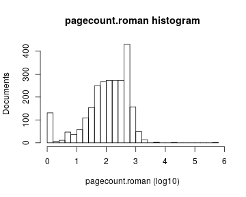
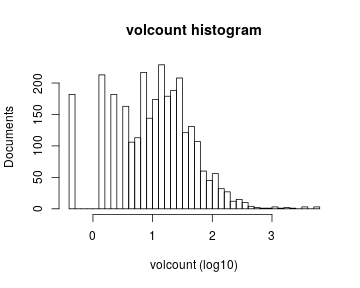

# Preprocessing summary

## Specific fields

  * [Author info](author.md)
  * [Gender info](gender.md)
  * [Publisher info](publisher.md)
  * [Publication geography](publicationplace.md)
  * [Generic document info](documents.md)
  * [Document sizes](size.md)
  * [Document topics](topic.md)


## Field conversions

This documents the conversions from raw data to the final preprocessed version (accepted, discarded, conversions). Only some of the key tables are explicitly linked below. The complete list of all summary tables is [here](output.tables/).

## Annotated documents

Fraction of documents with data:


Same in exact numbers: documents with available/missing entries, and number of unique entries for each field. Sorted by missing data:


|field name                                   | missing (%)| available (%)| available (n)| unique (n)|
|:--------------------------------------------|-----------:|-------------:|-------------:|----------:|
|publication_frequency                        |       100.0|           0.0|             0|          1|
|volnumber                                    |        99.9|           0.1|           294|         18|
|publication_interval                         |        99.5|           0.5|          2335|       2257|
|width.original                               |        98.9|           1.1|          5133|        301|
|note_dissertation                            |        96.5|           3.5|         16119|      11551|
|publication_year_till                        |        96.3|           3.7|         16982|        477|
|height.original                              |        88.4|          11.6|         52655|        463|
|obl                                          |        77.4|          22.6|        102902|          3|
|latitude                                     |        72.7|          27.3|        124127|         19|
|longitude                                    |        72.7|          27.3|        124127|         19|
|paper.consumption.km2                        |        67.2|          32.8|        149237|      15116|
|height                                       |        67.2|          32.8|        149256|        461|
|area                                         |        67.2|          32.8|        149256|       1454|
|width                                        |        67.2|          32.8|        149257|        304|
|author_date                                  |        61.0|          39.0|        177381|      26170|
|author_death                                 |        56.6|          43.4|        197378|        775|
|author_birth                                 |        54.0|          46.0|        209077|        929|
|author_gender                                |        49.2|          50.8|        231220|          3|
|physical_dimension                           |        45.2|          54.8|        249489|       7022|
|pagecount.orig                               |        45.0|          55.0|        250314|       2009|
|self_published                               |        43.9|          56.1|        255363|          3|
|country                                      |        31.4|          68.6|        312173|         53|
|author_name                                  |        28.7|          71.3|        324617|     123685|
|author                                       |        28.7|          71.3|        324617|     129995|
|publisher                                    |        25.8|          74.2|        337772|     147029|
|physical_extent                              |        15.7|          84.3|        383323|     169497|
|publication_place                            |         9.9|          90.1|        409941|      16626|
|dissertation                                 |         3.5|          96.5|        438906|          3|
|synodal                                      |         3.5|          96.5|        438906|          2|
|publication_year_from                        |         0.2|          99.8|        454149|        371|
|volcount                                     |         0.1|          99.9|        454675|         85|
|title                                        |         0.0|         100.0|        454821|     426469|
|pagecount                                    |         0.0|         100.0|        454937|       2056|
|publication_time                             |         0.0|         100.0|        454969|      27423|
|language.Latin                               |         0.0|         100.0|        454969|          2|
|language.Italian                             |         0.0|         100.0|        454969|          2|
|language.Spanish                             |         0.0|         100.0|        454969|          2|
|language.Undetermined                        |         0.0|         100.0|        454969|          2|
|language.French                              |         0.0|         100.0|        454969|          2|
|language.German                              |         0.0|         100.0|        454969|          2|
|language.English                             |         0.0|         100.0|        454969|          2|
|language.Dutch                               |         0.0|         100.0|        454969|          2|
|language.Greek, Ancient (to 1453)            |         0.0|         100.0|        454969|          1|
|language.Swedish                             |         0.0|         100.0|        454969|          2|
|language.Polish                              |         0.0|         100.0|        454969|          2|
|language.Portuguese                          |         0.0|         100.0|        454969|          2|
|language.Russian                             |         0.0|         100.0|        454969|          2|
|language.Sanskrit                            |         0.0|         100.0|        454969|          2|
|language.Multiple languages                  |         0.0|         100.0|        454969|          2|
|language.Low German                          |         0.0|         100.0|        454969|          2|
|language.French, Middle (ca. 1300-1600)      |         0.0|         100.0|        454969|          1|
|language.Czech                               |         0.0|         100.0|        454969|          2|
|language.Hebrew                              |         0.0|         100.0|        454969|          2|
|language.Danish                              |         0.0|         100.0|        454969|          2|
|language.Panjabi                             |         0.0|         100.0|        454969|          2|
|language.Greek, Modern (1453-)               |         0.0|         100.0|        454969|          1|
|language.Ladino                              |         0.0|         100.0|        454969|          2|
|language.Ethiopic                            |         0.0|         100.0|        454969|          2|
|language.Chinese                             |         0.0|         100.0|        454969|          2|
|language.Burmese                             |         0.0|         100.0|        454969|          2|
|language.Finnish                             |         0.0|         100.0|        454969|          2|
|language.Hungarian                           |         0.0|         100.0|        454969|          2|
|language.Hindi                               |         0.0|         100.0|        454969|          2|
|language.Arabic                              |         0.0|         100.0|        454969|          2|
|language.Ndebele (Zimbabwe)                  |         0.0|         100.0|        454969|          1|
|language.Gothic                              |         0.0|         100.0|        454969|          2|
|language.Scottish Gaelic                     |         0.0|         100.0|        454969|          2|
|language.Scottish Gaelix                     |         0.0|         100.0|        454969|          2|
|language.Norwegian                           |         0.0|         100.0|        454969|          2|
|language.Latvian                             |         0.0|         100.0|        454969|          2|
|language.Algonquian (Other)                  |         0.0|         100.0|        454969|          1|
|language.Croatian                            |         0.0|         100.0|        454969|          2|
|language.Japanese                            |         0.0|         100.0|        454969|          2|
|language.Oriya                               |         0.0|         100.0|        454969|          2|
|language.Icelandic                           |         0.0|         100.0|        454969|          2|
|language.Norwegian (Bokmål)                  |         0.0|         100.0|        454969|          1|
|language.Yiddish                             |         0.0|         100.0|        454969|          2|
|language.English, Old (ca. 450-1100)         |         0.0|         100.0|        454969|          1|
|language.Syriac, Modern                      |         0.0|         100.0|        454969|          2|
|language.Lithuanian                          |         0.0|         100.0|        454969|          2|
|language.Oirat                               |         0.0|         100.0|        454969|          1|
|language.Estonian                            |         0.0|         100.0|        454969|          2|
|language.Tamil                               |         0.0|         100.0|        454969|          2|
|language.Slovenian                           |         0.0|         100.0|        454969|          2|
|language.Welsh                               |         0.0|         100.0|        454969|          2|
|language.Frisian                             |         0.0|         100.0|        454969|          2|
|language.Romance (Other)                     |         0.0|         100.0|        454969|          1|
|language.Armenian                            |         0.0|         100.0|        454969|          2|
|language.Persian                             |         0.0|         100.0|        454969|          2|
|language.Occitan (post-1500)                 |         0.0|         100.0|        454969|          1|
|language.Basque                              |         0.0|         100.0|        454969|          2|
|language.Church Slavic                       |         0.0|         100.0|        454969|          2|
|language.German, Middle High (ca. 1050-1500) |         0.0|         100.0|        454969|          1|
|language.Sorbian (Other)                     |         0.0|         100.0|        454969|          1|
|language.Scots                               |         0.0|         100.0|        454969|          2|
|language.Malay                               |         0.0|         100.0|        454969|          2|
|language.Aramaic                             |         0.0|         100.0|        454969|          2|
|language.Esperanto                           |         0.0|         100.0|        454969|          2|
|language.Irish                               |         0.0|         100.0|        454969|          2|
|language.Turkish, Ottoman                    |         0.0|         100.0|        454969|          2|
|language.Germanic (Other)                    |         0.0|         100.0|        454969|          1|
|language.Slavic (Other)                      |         0.0|         100.0|        454969|          1|
|language.Raeto-Romance                       |         0.0|         100.0|        454969|          2|
|language.Catalan                             |         0.0|         100.0|        454969|          2|
|language.Bengali                             |         0.0|         100.0|        454969|          2|
|language.Sami                                |         0.0|         100.0|        454969|          2|
|language.French, Old (ca. 842-1300)          |         0.0|         100.0|        454969|          1|
|language.Syriac                              |         0.0|         100.0|        454969|          2|
|language.Iroquoian (Other)                   |         0.0|         100.0|        454969|          1|
|language.Samaritan Aramaic                   |         0.0|         100.0|        454969|          2|
|language.Egyptian                            |         0.0|         100.0|        454969|          2|
|language.Breton                              |         0.0|         100.0|        454969|          2|
|language.Braj                                |         0.0|         100.0|        454969|          2|
|language.Indic (Other)                       |         0.0|         100.0|        454969|          1|
|language.Turkish                             |         0.0|         100.0|        454969|          2|
|language.Marathi                             |         0.0|         100.0|        454969|          2|
|language.Serbian                             |         0.0|         100.0|        454969|          2|
|language.Afar                                |         0.0|         100.0|        454969|          2|
|language.Manx                                |         0.0|         100.0|        454969|          2|
|language.Slovak                              |         0.0|         100.0|        454969|          2|
|language.Tibetan                             |         0.0|         100.0|        454969|          2|
|language.Ojibwa                              |         0.0|         100.0|        454969|          2|
|language.Coptic                              |         0.0|         100.0|        454969|          2|
|language.Lahndā                              |         0.0|         100.0|        454969|          2|
|language.Hawaiian                            |         0.0|         100.0|        454969|          2|
|language.Dutch, Middle (ca. 1050-1350)       |         0.0|         100.0|        454969|          1|
|language.Old Norse                           |         0.0|         100.0|        454969|          2|
|language.Creoles and Pidgins (Other)         |         0.0|         100.0|        454969|          1|
|language.Telugu                              |         0.0|         100.0|        454969|          2|
|language.Philippine (Other)                  |         0.0|         100.0|        454969|          1|
|language.Urdu                                |         0.0|         100.0|        454969|          2|
|language.Tatar                               |         0.0|         100.0|        454969|          2|
|language.Romanian                            |         0.0|         100.0|        454969|          2|
|language.Mohawk                              |         0.0|         100.0|        454969|          2|
|language.Eskimo languages                    |         0.0|         100.0|        454969|          2|
|language.Finno-Ugrian (Other)                |         0.0|         100.0|        454969|          1|
|language.Sinhalese                           |         0.0|         100.0|        454969|          2|
|language.Belarusian                          |         0.0|         100.0|        454969|          2|
|language.Indo-European (Other)               |         0.0|         100.0|        454969|          1|
|language.Altaic (Other)                      |         0.0|         100.0|        454969|          1|
|language.Georgian                            |         0.0|         100.0|        454969|          2|
|language.Tagalog                             |         0.0|         100.0|        454969|          2|
|language.German, Old High (ca. 750-1050)     |         0.0|         100.0|        454969|          1|
|language.Provençal (to 1500)                 |         0.0|         100.0|        454969|          1|
|language.Albanian                            |         0.0|         100.0|        454969|          2|
|language.Bulgarian                           |         0.0|         100.0|        454969|          2|
|language.Norwegian (Nynorsk)                 |         0.0|         100.0|        454969|          1|
|language.Nahuatl                             |         0.0|         100.0|        454969|          2|
|language.Vietnamese                          |         0.0|         100.0|        454969|          2|
|language.Occitan (post 1500)                 |         0.0|         100.0|        454969|          1|
|language.Salishan languages                  |         0.0|         100.0|        454969|          2|
|language.Guarani                             |         0.0|         100.0|        454969|          2|
|language.Kalâtdlisut                         |         0.0|         100.0|        454969|          2|
|language.Chagatai                            |         0.0|         100.0|        454969|          1|
|language.Tahitian                            |         0.0|         100.0|        454969|          2|
|language.Slavey                              |         0.0|         100.0|        454969|          2|
|language.Semitic (Other)                     |         0.0|         100.0|        454969|          1|
|language.Macedonian                          |         0.0|         100.0|        454969|          1|
|language.Quechua                             |         0.0|         100.0|        454969|          2|
|language.Aymara                              |         0.0|         100.0|        454969|          2|
|language.Amharic                             |         0.0|         100.0|        454969|          2|
|language.Niger-Kordofanian (Other)           |         0.0|         100.0|        454969|          1|
|language.Maltese                             |         0.0|         100.0|        454969|          2|
|language.Otomian languages                   |         0.0|         100.0|        454969|          2|
|language.Faroese                             |         0.0|         100.0|        454969|          2|
|language.Northern Sami                       |         0.0|         100.0|        454969|          2|
|language.Ukrainian                           |         0.0|         100.0|        454969|          2|
|language.Hausa                               |         0.0|         100.0|        454969|          2|
|language.Sign languages                      |         0.0|         100.0|        454969|          2|
|language.Manchu                              |         0.0|         100.0|        454969|          2|
|language.Old Persian (ca. 600-400 B.C.)      |         0.0|         100.0|        454969|          1|
|language.Romani                              |         0.0|         100.0|        454969|          2|
|language.Dogri                               |         0.0|         100.0|        454969|          2|
|language.Kannada                             |         0.0|         100.0|        454969|          2|
|language.Dravidian (Other)                   |         0.0|         100.0|        454969|          1|
|language.Pahlavi                             |         0.0|         100.0|        454969|          2|
|language.Prakrit languages                   |         0.0|         100.0|        454969|          2|
|language.Gã                                  |         0.0|         100.0|        454969|          2|
|language.Malagasy                            |         0.0|         100.0|        454969|          2|
|language.Lower Sorbian                       |         0.0|         100.0|        454969|          2|
|language.English, Middle (1100-1500)         |         0.0|         100.0|        454969|          1|
|language.Efik                                |         0.0|         100.0|        454969|          1|
|language.Galician                            |         0.0|         100.0|        454969|          2|
|language.Mayan languages                     |         0.0|         100.0|        454969|          2|
|language.Nauru                               |         0.0|         100.0|        454969|          1|
|language.Irish, Middle (ca. 1100-1550)       |         0.0|         100.0|        454969|          1|
|language.Chuvash                             |         0.0|         100.0|        454969|          2|
|language.Bambara                             |         0.0|         100.0|        454969|          2|
|language.Wolof                               |         0.0|         100.0|        454969|          2|
|language.Mongolian                           |         0.0|         100.0|        454969|          2|
|language.North American Indian (Other)       |         0.0|         100.0|        454969|          1|
|language.mul                                 |         0.0|         100.0|        454969|          2|
|language                                     |         0.0|         100.0|        454969|       1095|
|gatherings.original                          |         0.0|         100.0|        454969|         18|
|obl.original                                 |         0.0|         100.0|        454969|          2|
|original_row                                 |         0.0|         100.0|        454969|     454969|
|publication_year                             |         0.0|         100.0|        454969|        370|
|publication_decade                           |         0.0|         100.0|        454969|         38|
|author_pseudonyme                            |         0.0|         100.0|        454969|          2|
|gatherings                                   |         0.0|         100.0|        454969|         18|


## Histograms of all entries for numeric variables



## Histograms of the top entries for factor variables


```
## Error in dfs$names: $ operator is invalid for atomic vectors
```


