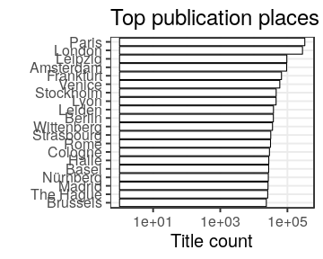
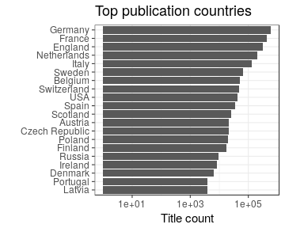

### Publication places

[Publication countries](output.tables/country_accepted.csv)

[Publication country not identified](output.tables/country_discarded.csv)

[Discarded publication places](output.tables/publication_place_discarded.csv)

[Publication place conversions](output.tables/publication_place_conversion_nontrivial.csv)

[Places missing geocoordinate information](output.tables/absentgeocoordinates.csv). Altogether ``72.87``% of the documents have missing geocoordinates.

Top-20 publication places are shown together with the number of documents. This info is available for 4989000 documents (91%). There are 88538 unique publication places. Overall 27.1% of the places could be matched to geographic coordinates (from the [Geonames](http://download.geonames.org/export/dump/) database).

|name        |      n|  fraction|
|:-----------|------:|---------:|
|France      | 956463| 17.509364|
|Germany     | 903989| 16.548755|
|England     | 474815|  8.692138|
|Netherlands | 265165|  4.854208|
|Italy       | 209782|  3.840347|
|Sweden      |  78500|  1.437050|
