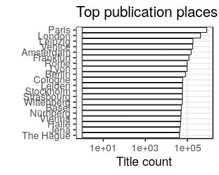
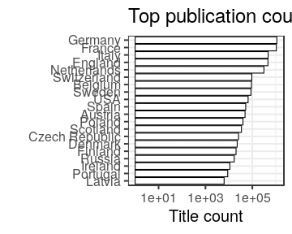

### Publication places

 * 52165 [unique publication places](output.tables/publication_place_accepted.csv); available for 4821333 documents (89%).
 * 0 [ambiguous publication places](output.tables/publication_place_ambiguous.csv); some of these can be possibly resolved by checking that the the [synonyme list](https://github.com/COMHIS/bibliographica/blob/master/inst/extdata/PublicationPlaceSynonymes.csv) does not contain multiple versions of the final name (case sensitive). 
 * 53157 [unknown place names](output.tables/publication_place_todo.csv) These terms do not map to any known place on the [synonyme list](https://github.com/COMHIS/bibliographica/blob/master/inst/extdata/PublicationPlaceSynonymes.csv); either because they require further cleaning or have not yet been encountered in the analyses. Terms that are clearly not place names can be added to [stopwords](inst/extdata/stopwords_for_place.csv); borderline cases that are not accepted as place names can be added as NA on the [synonyme list](https://github.com/COMHIS/bibliographica/blob/master/inst/extdata/PublicationPlaceSynonymes.csv).
 * 6968 [discarded place names](output.tables/publication_place_discarded.csv) These terms are potential place names but with a closer check have been explicitly rejected on the [synonyme list](https://github.com/COMHIS/bibliographica/blob/master/inst/extdata/PublicationPlaceSynonymes.csv)
 * [Conversions from the original to the accepted place names](output.tables/publication_place_conversion_nontrivial.csv) 
 * [Unit tests for place names](https://github.com/COMHIS/bibliographica/blob/master/inst/extdata/tests_place.csv) are automatically checked during package build

Top-20 publication places are shown together with the number of documents.

### Publication countries	

 * 61 [unique publication countries](output.tables/country_accepted.csv); available for 4070067 documents (75%).
 * 51206 [places with unknown publication country](output.tables/publication_place_missingcountry.csv) (98.2% of the unique places; can be added to [country mappings](https://github.com/COMHIS/bibliographica/blob/master/inst/extdata/reg2country.csv))
 * 32 [potentially ambiguous region-country mappings](output.tables/publication_country_ambiguous.csv) (these may occur in the data in various synonymes and the country is not always clear when multiple countries have a similar place name; the default country is listed first). NOTE: possible improvements should not be done in this output summary but instead in the [country mapping file](https://github.com/COMHIS/bibliographica/blob/master/inst/extdata/reg2country.csv).

|Country     | Documents (n)| Fraction (%)|
|:-----------|-------------:|------------:|
|Germany     |       1111077|         20.6|
|France      |       1060603|         19.6|
|Italy       |        474181|          8.8|
|England     |        465203|          8.6|
|Netherlands |        312409|          5.8|
|Switzerland |         95630|          1.8|

### Geocoordinates

 * 85.3% of the documents were matched to geographic coordinates (based on [Geonames](http://download.geonames.org/export/dump/)).
 * 51691 unique places (99.1% of all unique places and 14.68% of all documents) are missing geocoordinates. See [list of places missing geocoordinate information](output.tables/absentgeocoordinates.csv).
 
