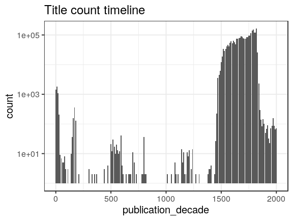
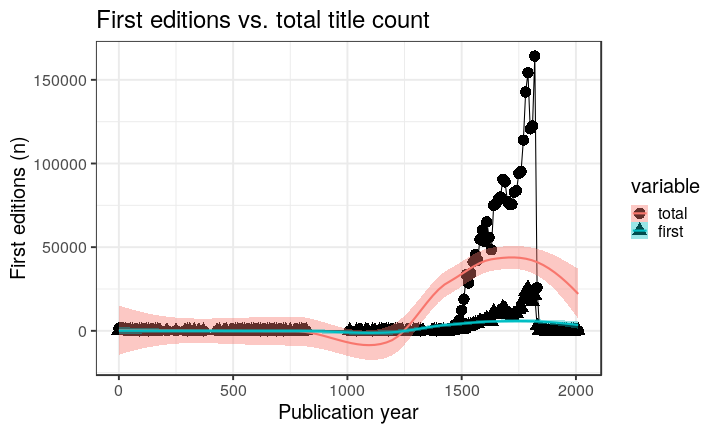

### Publication year

[Publication year conversions](output.tables/publication_year_conversion.csv)

[Publication year discarded](output.tables/publication_year_discarded.csv)

Publication year is available for 2536443 documents (95%). The publication years span 1-2013.

### Publication frequency

Publication frequency information is available for 0 documents (NaN%). The links are invalid if the lists are empty. The (estimated annual) frequencies are converted to plain text according to their closest match in [this table](https://github.com/COMHIS/bibliographica/blob/master/inst/extdata/frequency_conversions.csv).

[Publication frequency accepted](output.tables/publication_frequency_accepted.csv)

[Publication frequency conversions](output.tables/publication_frequency_conversion.csv)

[Publication frequency discarded](output.tables/publication_frequency_discarded.csv)

### Publication interval

Publication interval is available for 0 documents (NaN%). 

[Publication interval accepted](output.tables/publication_interval_accepted.csv)

[Publication interval conversions](output.tables/publication_interval_conversion_nontrivial.csv)

[Publication interval discarded](output.tables/publication_interval_discarded.csv)

### Editions

Automated detection of potential first editions (first_edition field)
identifies unique author-title pairs, and proposes the first
occcurrence (earliest publication_year) as the first edition. If there
are multiple instances from the same earliest year, they are all
marked as potential first editions. Later need to check if this
information is readily available in MARC.

There are 2304138 unique
documents with an identical title and author and
189377
of those have multiple occurrences, sometimes with different publication
years.  The earliest occurrence is suggested as the first edition.

This figure shows the number of first editions per decade.

