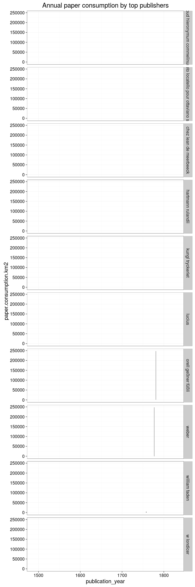

### Publishers

[Publishers accepted](output.tables/publisher_accepted.csv)

[Publishers discarded](output.tables/publisher_discarded.csv)

The 20 most common publishers are shown with the number of documents. Publisher information is available for 3923026 documents (74%). There are 950239 unique publisher names (some may be synonymes, though).

### Publication timeline for top publishers

Title count

Paper consumption

Title count versus paper consumption (top publishers):

|publisher  | titles|     paper|
|:----------|------:|---------:|
|imp royale |  11547| 0.1175472|
|meyer      |   5965| 8.8811798|
|müller      |   9348|      -Inf|
|p simon    |   8917| 0.0524948|
|royale     |  13082| 1.3811691|
