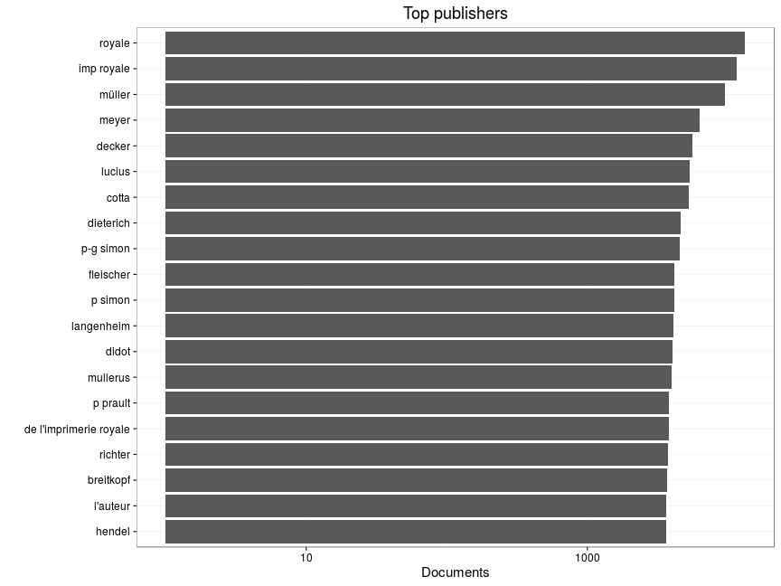
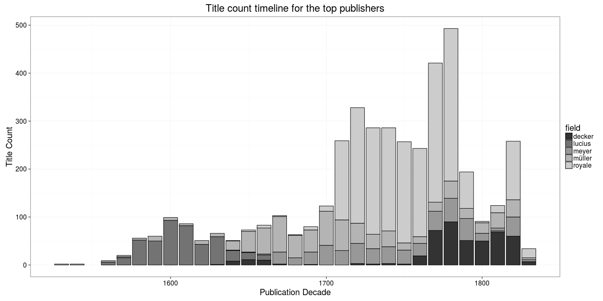
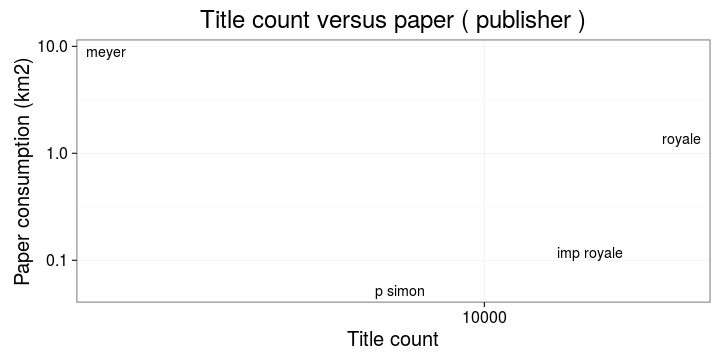

### Publishers

[Publishers accepted](output.tables/publisher_accepted.csv)

[Publishers discarded](output.tables/publisher_discarded.csv)

The 20 most common publishers are shown with the number of documents. Publisher information is available for 67619 documents (74%). There are 43084 unique publisher names (some may be synonymes, though).

### Publication timeline for top publishers

Title count

Title count versus paper consumption (top publishers):

|publisher  | titles|     paper|
|:----------|------:|---------:|
|cotta      |     93| 0.1315141|
|imp royale |    175| 0.0003888|
|meyer      |    110| 0.2466191|
|müller      |    156| 0.1682584|
|royale     |    266| 0.1295658|
