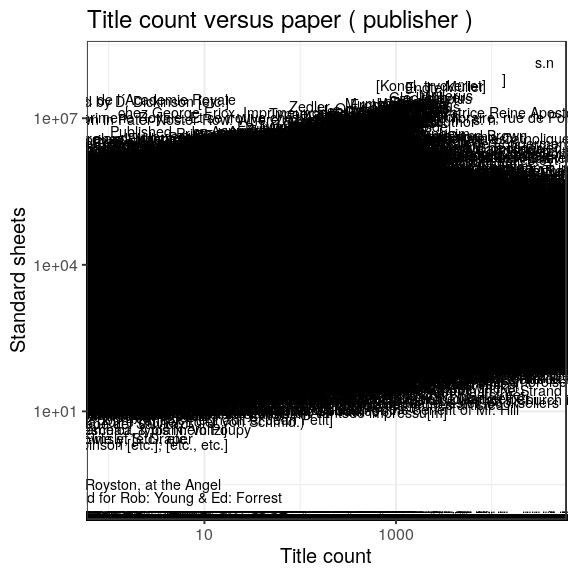

### Publishers

 * 1188702 [unique publishers](output.tables/publisher_accepted.csv)

 * 4047161 documents have unambiguous publisher information (74.9%). This includes documents identified as self-published; the author name is used as the publisher in those cases (if known).

 * 376 documents are identified as self-published (0%). 

 * [Discarded publisher entries](output.tables/publisher_discarded.csv)

 * [Conversions from original to final names](output.tables/publisher_conversion_nontrivial.csv) (only non-trivial conversions shown)

The 20 most common publishers are shown with the number of documents. 

### Publication timeline for top publishers

Title count

Title count versus paper consumption (top publishers):

|publisher    | titles|       paper|
|:------------|------:|-----------:|
|[s. n.]      |  11106| 12211270.61|
|[s.n.?]      |   4824|  5302006.60|
|Cotta        |   4676| 21863788.41|
|imp. royale  |   5642|    12850.26|
|Imp. royale  |   5682|    39615.45|
|Impr. royale |  11543|  1671536.85|
|Lucius       |   4913| 26489278.39|
|Meyer        |   6049| 28046745.83|
|Müller       |   9064| 45797975.17|
|s. n         |   8807|  9378238.54|

### Corporates

Summaries of the corporate field.

 * 0 [unique corporates](output.tables/corporate_accepted.csv)

 * 0 documents have unambiguous corporate information (NaN%). 

 * [Discarded corporate entries](output.tables/corporate_discarded.csv)

 * [Conversions from original to final names](output.tables/corporate_conversion_nontrivial.csv) (only non-trivial conversions shown)

The 20 most common corporates are shown with the number of documents. 

