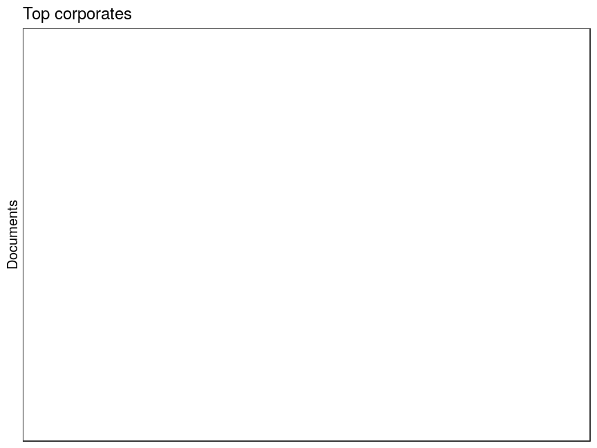

### Publishers

 * 792622 [unique publishers](output.tables/publisher_accepted.csv)

 * 2260169 documents have unambiguous publisher information (84.3%). This includes documents identified as self-published; the author name is used as the publisher in those cases (if known).

 * 177 documents are identified as self-published (0%). 

 * [Discarded publisher entries](output.tables/publisher_discarded.csv)

 * [Conversions from original to final names](output.tables/publisher_conversion_nontrivial.csv) (only non-trivial conversions shown)

The 20 most common publishers are shown with the number of documents. 

### Publication timeline for top publishers

Title count

Title count versus paper consumption (top publishers):

|publisher         | titles|     paper|
|:-----------------|------:|---------:|
|]                 |  13420|  60966820|
|Dieterich         |   2458|  10664111|
|Kilius            |   2414|  16800807|
|kungl.tryckeriet) |   2396|   3327198|
|Lucius            |   3840|  25986818|
|Meyer             |   3244|  26593852|
|Müller            |   5233|  44692203|
|Mullerus          |   3349|  28785286|
|s. n              |   8374|   9301364|
|s.n               |  35383| 137469896|

### Corporates

Summaries of the corporate field.

 * 0 [unique corporates](output.tables/corporate_accepted.csv)

 * 0 documents have unambiguous corporate information (NaN%). 

 * [Discarded corporate entries](output.tables/corporate_discarded.csv)

 * [Conversions from original to final names](output.tables/corporate_conversion_nontrivial.csv) (only non-trivial conversions shown)

The 20 most common corporates are shown with the number of documents. 

