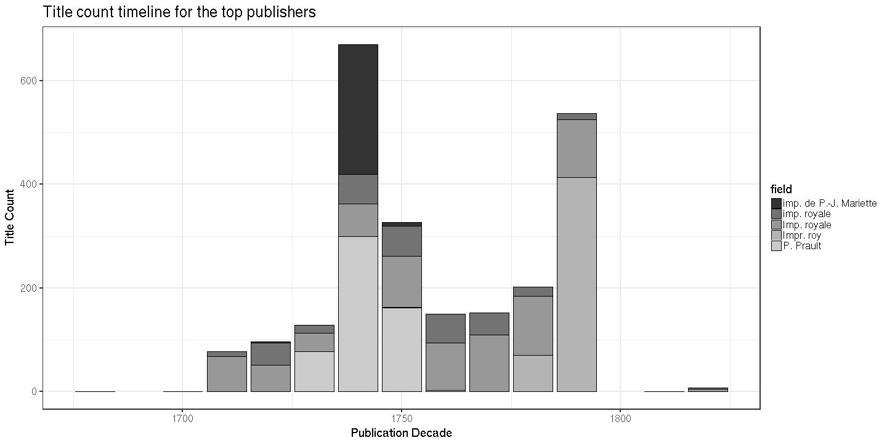

### Publishers

[Publishers accepted](output.tables/publisher_accepted.csv)

[Publishers discarded](output.tables/publisher_discarded.csv)

The 20 most common publishers are shown with the number of documents. Publisher information is available for 6908 documents (75%). There are 6024 unique publisher names (some may be synonymes, though).

### Publication timeline for top publishers

Title count

Title count versus paper consumption (top publishers):

|publisher  | titles|     paper|
|:----------|------:|---------:|
|imp royale |     13| 0.0000000|
|meyer      |     11| 0.0376030|
|müller      |     19| 0.0260154|
|p simon    |     10| 0.0000000|
|royale     |     23| 0.0194656|
