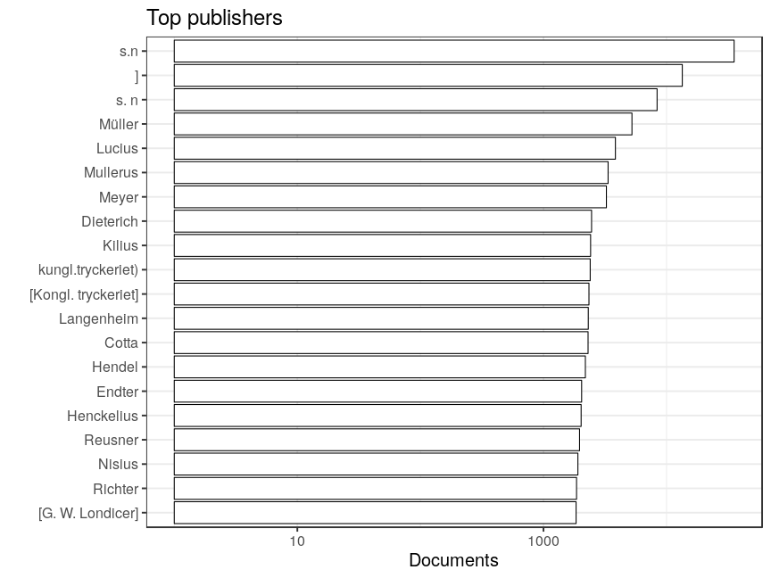

### Publishers

 * 48634 [unique publishers](output.tables/publisher_accepted.csv)

 * 75445 documents have unambiguous publisher information (84%). 

 * [Discarded publisher entries](output.tables/publisher_discarded.csv)

 * [Conversions from original to final names](output.tables/publisher_conversion_nontrivial.csv) (only non-trivial conversions shown)

The 20 most common publishers are shown with the number of documents. 

### Publication timeline for top publishers

Title count

Title count versus paper consumption (top publishers):

|publisher                   | titles| paper|
|:---------------------------|------:|-----:|
|imp. de P.-J. Mariette      |    261|     0|
|imp. royale                 |    315|     0|
|Imp. royale                 |    748|     0|
|impr. de H. Guerin          |    167|     0|
|impr. de L. Delatour        |    216|     0|
|Impr. roy                   |    486|     0|
|impr. royale                |    249|     0|
|Impr. royale                |    159|     0|
|P. Prault                   |    542|     0|
|Vve Saugrain et : P. Prault |    238|     0|

