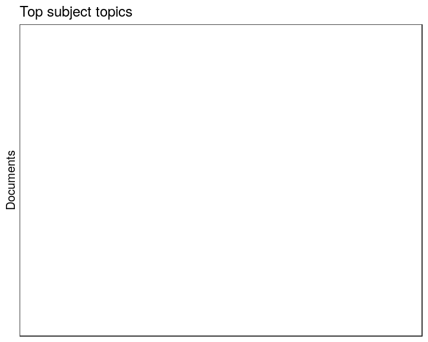

## Subject topics


  * 0 unique subject topics
  * 0 documents assigned to at least one subject topic (NaN)

Top-20 subject topics and number of documents for each.


```
## Error in dfs$names: $ operator is invalid for atomic vectors
```


